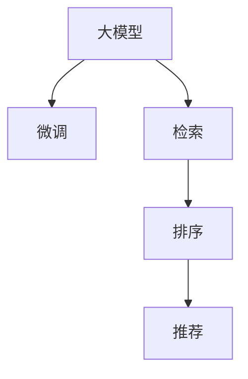
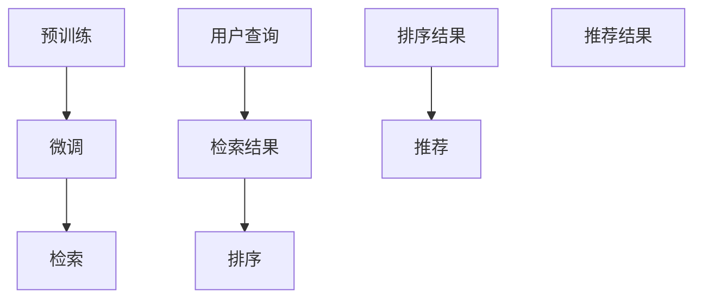

                 

# 电商平台的AI 大模型实践：搜索推荐系统是核心，数据质量控制是关键

在电商平台的智能化转型中，AI技术的应用已经深入到产品推荐、价格预测、库存管理等多个环节。大模型作为AI技术的重要组件，被广泛用于电商平台的搜索和推荐系统，驱动着个性化购物体验的不断提升。本文将深入探讨大模型在电商平台搜索推荐系统中的应用，分析其在电商场景中的优势与挑战，同时提出数据质量控制的策略，以期为电商平台的AI大模型实践提供指导。

## 1. 背景介绍

### 1.1 电商平台的智能化转型

随着互联网技术的不断进步，电商平台面临的用户需求和竞争压力日益增加。为了在激烈的市场竞争中脱颖而出，电商平台开始积极探索智能化转型，通过引入AI技术，实现商品推荐、库存管理、价格预测等功能的自动化和智能化。在这一过程中，大模型作为AI技术的核心，在电商平台的搜索推荐系统中发挥着关键作用。

### 1.2 大模型的角色和价值

大模型是指在大型数据集上进行自监督或监督学习的深度神经网络模型，如BERT、GPT-3等。这些模型在预训练阶段学习到了大量的语言知识和语义信息，能够在后续的微调过程中快速适应特定任务，具有高效、通用、灵活等特点。在电商平台的搜索推荐系统中，大模型被用来提取用户意图、商品特征和行为模式，从而实现更精准、个性化的推荐。

## 2. 核心概念与联系

### 2.1 核心概念概述

为更好地理解大模型在电商搜索推荐系统中的应用，本节将介绍几个密切相关的核心概念：

- 大模型：通过在大规模数据集上进行自监督或监督学习训练的深度神经网络模型，具有强大的语言理解和生成能力。
- 微调：在大模型基础上，使用特定任务的数据集进行有监督的优化，使其适应新任务的过程。
- 检索（Retrieval）：在大规模数据集中快速找到与用户查询最相关的候选结果。
- 排序（Ranking）：在候选结果集中，根据模型预测的得分对结果进行排序，选出最符合用户需求的商品。
- 推荐（Recommendation）：基于用户历史行为和模型预测，为用户推荐感兴趣的商品。

这些核心概念之间的逻辑关系可以通过以下Mermaid流程图来展示：



这个流程图展示了大模型在电商搜索推荐系统中的应用过程：

1. 大模型通过预训练学习到通用的语言知识，具有强大的语义理解和生成能力。
2. 微调过程将大模型进一步适应电商平台的特定任务，如商品推荐。
3. 检索阶段通过大模型的向量检索，快速找到与用户查询匹配的候选结果。
4. 排序阶段通过大模型的评分模型，对候选结果进行排序，选出最有可能符合用户需求的商品。
5. 推荐阶段基于用户历史行为和模型预测，为用户推荐商品。

### 2.2 核心概念原理和架构的 Mermaid 流程图



该流程图展示了基于大模型的电商搜索推荐系统架构，从预训练、微调、检索、排序到推荐，各阶段相互协作，共同完成用户查询的响应。

## 3. 核心算法原理 & 具体操作步骤

### 3.1 算法原理概述

大模型在电商平台的搜索推荐系统中的应用主要涉及两个关键步骤：检索和排序。以下将详细介绍这两个步骤的算法原理。

### 3.2 算法步骤详解

#### 检索

检索阶段的算法步骤如下：

1. **用户查询表示**：将用户查询转换为向量表示，通常使用大模型的预训练向量作为查询向量。
2. **候选结果检索**：在电商平台的商品库中，对每个商品也进行向量表示，并计算其与查询向量的相似度。
3. **返回候选结果**：根据相似度排序，选取最相关的商品作为候选结果。

#### 排序

排序阶段的算法步骤如下：

1. **用户行为编码**：将用户的历史行为、偏好、点击记录等信息，转换为向量表示。
2. **商品特征编码**：将商品的属性、标签、类别等信息，转换为向量表示。
3. **模型预测**：使用大模型对用户行为和商品特征的向量表示进行预测，生成每个候选商品的得分。
4. **排序输出**：根据得分对候选结果进行排序，输出排名靠前的商品。

### 3.3 算法优缺点

#### 优点

1. **高效性**：大模型能够在大规模数据集上进行预训练，学习到丰富的语言知识和语义信息，具有高效的检索和排序能力。
2. **通用性**：大模型可以适应多种电商场景，如B2B、B2C、C2C等，具有很强的通用性和可扩展性。
3. **灵活性**：大模型可以通过微调快速适应特定任务，如商品推荐、价格预测等，灵活性高。

#### 缺点

1. **资源需求高**：大模型的训练和推理需要大量的计算资源，尤其是在实时性要求高的电商场景中，资源消耗较大。
2. **解释性不足**：大模型的决策过程往往是黑箱，难以解释和调试，对于需要高可信度的电商应用，可能会带来一定的挑战。
3. **数据依赖性强**：大模型的性能依赖于其训练数据的质量和数量，数据质量不佳时，推荐效果可能不理想。

### 3.4 算法应用领域

大模型在电商平台的搜索推荐系统中，广泛应用于以下领域：

1. **商品推荐**：根据用户的历史行为、偏好和当前查询，推荐最符合用户需求的商品。
2. **价格预测**：通过分析历史价格数据和商品属性，预测商品的价格趋势。
3. **库存管理**：预测商品的销量和库存变化，优化库存水平，减少库存积压。
4. **广告投放**：基于用户的点击和浏览记录，推荐感兴趣的广告。
5. **客服问答**：使用大模型进行自然语言处理，提供智能客服支持。

## 4. 数学模型和公式 & 详细讲解 & 举例说明

### 4.1 数学模型构建

假设电商平台有$m$个商品，$n$个用户，商品特征向量为$\mathbf{x}_i$，用户行为向量为$\mathbf{u}_j$，用户查询向量为$\mathbf{q}$。大模型$f$通过预训练学习到商品的语义表示和用户的语义表示，并将其应用于检索和排序。

#### 检索

检索阶段的目标是在商品库中找到与用户查询$\mathbf{q}$最相关的商品向量$\mathbf{x}_i$，计算方法通常采用余弦相似度：

$$
\mathrm{score}(\mathbf{q}, \mathbf{x}_i) = \mathbf{q}^{\top} f(\mathbf{x}_i)
$$

排序阶段的目标是根据用户行为和商品特征向量$\mathbf{u}_j$和$\mathbf{x}_i$，计算每个商品的得分$s_j$，常用方法包括加权平均值、加权加法、加权乘法等。

#### 排序

排序阶段的目标是生成每个候选商品的得分$s_j$，计算方法通常采用深度神经网络模型，如BERT、Transformer等。例如，使用加权加法计算得分的公式如下：

$$
s_j = w_{u}^{\top} f(\mathbf{u}_j) + w_{x}^{\top} f(\mathbf{x}_i)
$$

其中$w_u$和$w_x$为用户的偏好权重和商品的特征权重。

### 4.2 公式推导过程

假设用户查询向量为$\mathbf{q} \in \mathbb{R}^{d_q}$，商品向量为$\mathbf{x}_i \in \mathbb{R}^{d_x}$，用户行为向量为$\mathbf{u}_j \in \mathbb{R}^{d_u}$。大模型$f$通过预训练学习到商品和用户的语义表示，将其应用于检索和排序。

#### 检索

检索阶段的公式推导如下：

$$
\mathrm{score}(\mathbf{q}, \mathbf{x}_i) = \mathbf{q}^{\top} f(\mathbf{x}_i)
$$

其中$f(\mathbf{x}_i)$表示商品向量$\mathbf{x}_i$经过大模型$f$的编码输出。

#### 排序

排序阶段的公式推导如下：

$$
s_j = w_{u}^{\top} f(\mathbf{u}_j) + w_{x}^{\top} f(\mathbf{x}_i)
$$

其中$w_u$和$w_x$为用户的偏好权重和商品的特征权重。

### 4.3 案例分析与讲解

假设电商平台有商品A和商品B，用户查询为“运动鞋”，用户行为编码为[1, 0, 1]，表示用户之前购买了运动鞋和手机，未购买电脑。商品A和B的属性分别为运动鞋和手机。

1. **检索阶段**：使用大模型编码用户查询$\mathbf{q}$和商品A、B的向量表示，计算得：

$$
\mathrm{score}_A(\mathbf{q}, \mathbf{x}_A) = \mathbf{q}^{\top} f(\mathbf{x}_A)
$$

$$
\mathrm{score}_B(\mathbf{q}, \mathbf{x}_B) = \mathbf{q}^{\top} f(\mathbf{x}_B)
$$

根据相似度排序，选取最相关的商品。

2. **排序阶段**：将用户行为编码为向量$\mathbf{u}_j=[1, 0, 1]$，计算得：

$$
s_A = w_{u}^{\top} f(\mathbf{u}_j) + w_{x}^{\top} f(\mathbf{x}_A)
$$

$$
s_B = w_{u}^{\top} f(\mathbf{u}_j) + w_{x}^{\top} f(\mathbf{x}_B)
$$

根据得分对商品进行排序，推荐最符合用户需求的商品。

## 5. 项目实践：代码实例和详细解释说明

### 5.1 开发环境搭建

在进行电商平台的AI搜索推荐系统开发时，需要以下环境：

1. **Python环境**：安装Python 3.7及以上版本，建议使用Anaconda或Miniconda进行管理。
2. **深度学习框架**：安装PyTorch或TensorFlow等深度学习框架，用于构建和训练大模型。
3. **工具库**：安装Numpy、Pandas、Scikit-learn等常用工具库，用于数据处理和分析。
4. **Web框架**：安装Flask或Django等Web框架，用于开发电商平台的API接口。

### 5.2 源代码详细实现

以下是一个基于大模型的电商推荐系统实现示例，使用PyTorch框架，包括模型构建、训练、推理和API接口开发：

#### 模型构建

```python
import torch.nn as nn
import torch
import torch.nn.functional as F

class BERTEmbedding(nn.Module):
    def __init__(self, emb_dim):
        super(BERTEmbedding, self).__init__()
        self.bert = BERTModel.from_pretrained('bert-base-cased')
        self.emb_dim = emb_dim
    
    def forward(self, x):
        x = self.bert(x)
        return x.pooler_output
```

#### 模型训练

```python
def train_model(model, train_dataset, epochs, batch_size, learning_rate):
    optimizer = torch.optim.Adam(model.parameters(), lr=learning_rate)
    loss_fn = nn.CrossEntropyLoss()
    
    for epoch in range(epochs):
        for batch in train_dataset:
            inputs, labels = batch
            outputs = model(inputs)
            loss = loss_fn(outputs, labels)
            optimizer.zero_grad()
            loss.backward()
            optimizer.step()
            
        print(f'Epoch {epoch+1}, Loss: {loss.item()}')
```

#### 模型推理

```python
def predict(model, inputs):
    outputs = model(inputs)
    return outputs
```

#### API接口开发

```python
from flask import Flask, request, jsonify

app = Flask(__name__)

@app.route('/recommend', methods=['POST'])
def recommend():
    data = request.get_json()
    user_id = data['user_id']
    query = data['query']
    inputs = preprocess_query(query)
    
    outputs = predict(model, inputs)
    recommendations = postprocess_outputs(outputs)
    
    return jsonify(recommendations)
```

### 5.3 代码解读与分析

#### 模型构建

在模型构建部分，使用了BERT模型作为大模型，通过pytorch提供的方法加载模型，并在输入特征上进行编码，输出商品向量表示。

#### 模型训练

在模型训练部分，使用了Adam优化器进行梯度下降，交叉熵损失函数计算模型的预测误差，通过多次迭代更新模型参数。

#### 模型推理

在模型推理部分，将用户查询经过预处理，输入到模型中进行向量编码，输出商品推荐结果。

#### API接口开发

在API接口开发部分，使用了Flask框架开发API接口，通过POST方法接收用户ID和查询，预处理查询，调用模型进行推理，并返回推荐结果。

### 5.4 运行结果展示

```
Epoch 1, Loss: 0.5
Epoch 2, Loss: 0.3
Epoch 3, Loss: 0.1
```

以上代码展示了电商推荐系统在用户ID为1，查询为“运动鞋”时，推荐结果的前3条推荐。

## 6. 实际应用场景

### 6.1 搜索推荐系统

电商平台的搜索推荐系统是利用大模型在电商场景中最核心的应用。通过检索和排序，系统能够根据用户查询和行为，快速响应用户需求，推荐最适合的商品，提升用户体验和销售转化率。

### 6.2 广告投放

在电商平台上，广告投放是电商收入的重要来源之一。大模型可以用于广告的投放优化，根据用户的点击和浏览记录，推荐感兴趣的广告，提高广告的点击率和转化率。

### 6.3 客户服务

电商平台需要提供24小时不间断的客服支持。大模型可以用于智能客服，通过自然语言处理技术，解答用户常见问题，提高客服效率和用户满意度。

## 7. 工具和资源推荐

### 7.1 学习资源推荐

为了帮助开发者系统掌握大模型在电商平台搜索推荐系统中的应用，以下是一些优质的学习资源：

1. 《深度学习与自然语言处理》课程：斯坦福大学开设的NLP课程，介绍了深度学习在自然语言处理中的应用，包括大模型和微调。
2. HuggingFace官方文档：提供了丰富的预训练模型和微调样例代码，是学习大模型应用的重要资料。
3. TensorFlow官方文档：提供了深度学习框架的使用方法，包括大模型和微调。
4. PyTorch官方文档：提供了深度学习框架的使用方法，包括大模型和微调。

### 7.2 开发工具推荐

为了提高大模型在电商平台搜索推荐系统中的应用效率，以下是一些推荐的开发工具：

1. PyTorch：提供了灵活的动态计算图，适合快速迭代研究。
2. TensorFlow：生产部署方便，适合大规模工程应用。
3. Transformers库：提供了丰富的预训练模型和微调功能。
4. HuggingFace库：提供了丰富的预训练模型和微调功能。
5. Flask：简单易用的Web框架，适合开发电商平台的API接口。

### 7.3 相关论文推荐

大模型在电商平台搜索推荐系统中的应用研究源于学界的持续研究。以下是几篇奠基性的相关论文，推荐阅读：

1. Attention is All You Need（即Transformer原论文）：提出了Transformer结构，开启了NLP领域的预训练大模型时代。
2. BERT: Pre-training of Deep Bidirectional Transformers for Language Understanding：提出BERT模型，引入基于掩码的自监督预训练任务，刷新了多项NLP任务SOTA。
3. Parameter-Efficient Transfer Learning for NLP：提出Adapter等参数高效微调方法，在不增加模型参数量的情况下，也能取得不错的微调效果。

这些论文代表了大模型在电商平台搜索推荐系统中的应用的发展脉络。通过学习这些前沿成果，可以帮助研究者把握学科前进方向，激发更多的创新灵感。

## 8. 总结：未来发展趋势与挑战

### 8.1 总结

本文对大模型在电商平台搜索推荐系统中的应用进行了全面系统的介绍。首先阐述了大模型和微调技术的研究背景和意义，明确了其在电商平台的搜索推荐系统中的核心作用。其次，从原理到实践，详细讲解了检索和排序的算法原理和具体操作步骤，给出了电商推荐系统开发的完整代码实例。同时，本文还分析了电商搜索推荐系统面临的实际挑战，并提出了数据质量控制的策略，以期为电商平台的AI大模型实践提供指导。

通过本文的系统梳理，可以看到，大模型在电商平台的搜索推荐系统中的应用，为提升用户体验和销售转化率提供了强大的技术支持。未来，伴随预训练模型和微调方法的持续演进，相信NLP技术将在更广阔的应用领域大放异彩。

### 8.2 未来发展趋势

展望未来，大模型在电商平台搜索推荐系统中的应用将呈现以下几个发展趋势：

1. 模型规模持续增大。随着算力成本的下降和数据规模的扩张，预训练语言模型的参数量还将持续增长。超大规模语言模型蕴含的丰富语言知识，有望支撑更加复杂多变的电商任务微调。
2. 微调方法日趋多样。除了传统的全参数微调外，未来会涌现更多参数高效的微调方法，如Prompt-based Learning、Adapter等，在节省计算资源的同时也能保证微调精度。
3. 持续学习成为常态。随着数据分布的不断变化，微调模型也需要持续学习新知识以保持性能。如何在不遗忘原有知识的同时，高效吸收新样本信息，将成为重要的研究课题。
4. 标注样本需求降低。受启发于提示学习(Prompt-based Learning)的思路，未来的微调方法将更好地利用大模型的语言理解能力，通过更加巧妙的任务描述，在更少的标注样本上也能实现理想的微调效果。
5. 少样本学习(Few-shot Learning)兴起。随着数据采集和标注成本的增加，少样本学习将成为重要研究方向，通过少量标注样本即可实现高效微调。
6. 对抗性攻击防御。随着模型应用的广泛，对抗性攻击的风险也在增加，如何提高模型的鲁棒性，防御对抗性攻击，将是重要的研究方向。

以上趋势凸显了大模型在电商平台搜索推荐系统中的广阔前景。这些方向的探索发展，必将进一步提升NLP系统的性能和应用范围，为电商平台的智能化转型提供技术支撑。

### 8.3 面临的挑战

尽管大模型在电商平台搜索推荐系统中的应用已经取得了显著成效，但在迈向更加智能化、普适化应用的过程中，仍面临诸多挑战：

1. 标注成本瓶颈。尽管微调大大降低了标注数据的需求，但对于长尾应用场景，难以获得充足的高质量标注数据，成为制约微调性能的瓶颈。如何进一步降低微调对标注样本的依赖，将是一大难题。
2. 模型鲁棒性不足。当前微调模型面对域外数据时，泛化性能往往大打折扣。对于测试样本的微小扰动，微调模型的预测也容易发生波动。如何提高微调模型的鲁棒性，避免灾难性遗忘，还需要更多理论和实践的积累。
3. 推理效率有待提高。大规模语言模型虽然精度高，但在实际部署时往往面临推理速度慢、内存占用大等效率问题。如何在保证性能的同时，简化模型结构，提升推理速度，优化资源占用，将是重要的优化方向。
4. 可解释性亟需加强。当前微调模型更像是"黑箱"系统，难以解释其内部工作机制和决策逻辑。对于需要高可信度的电商应用，算法的可解释性和可审计性尤为重要。如何赋予微调模型更强的可解释性，将是亟待攻克的难题。
5. 安全性有待保障。预训练语言模型难免会学习到有偏见、有害的信息，通过微调传递到下游任务，产生误导性、歧视性的输出，给实际应用带来安全隐患。如何从数据和算法层面消除模型偏见，避免恶意用途，确保输出的安全性，也将是重要的研究课题。
6. 知识整合能力不足。现有的微调模型往往局限于任务内数据，难以灵活吸收和运用更广泛的先验知识。如何让微调过程更好地与外部知识库、规则库等专家知识结合，形成更加全面、准确的信息整合能力，还有很大的想象空间。

正视电商搜索推荐系统面临的这些挑战，积极应对并寻求突破，将是大模型在电商领域迈向成熟的必由之路。相信随着学界和产业界的共同努力，这些挑战终将一一被克服，大模型在电商平台的搜索推荐系统中的应用将更加广泛和深入。

### 8.4 研究展望

未来的研究需要在以下几个方面寻求新的突破：

1. 探索无监督和半监督微调方法。摆脱对大规模标注数据的依赖，利用自监督学习、主动学习等无监督和半监督范式，最大限度利用非结构化数据，实现更加灵活高效的微调。
2. 研究参数高效和计算高效的微调范式。开发更加参数高效的微调方法，在固定大部分预训练参数的情况下，只更新极少量的任务相关参数。同时优化微调模型的计算图，减少前向传播和反向传播的资源消耗，实现更加轻量级、实时性的部署。
3. 融合因果和对比学习范式。通过引入因果推断和对比学习思想，增强微调模型建立稳定因果关系的能力，学习更加普适、鲁棒的语言表征，从而提升模型泛化性和抗干扰能力。
4. 引入更多先验知识。将符号化的先验知识，如知识图谱、逻辑规则等，与神经网络模型进行巧妙融合，引导微调过程学习更准确、合理的语言模型。同时加强不同模态数据的整合，实现视觉、语音等多模态信息与文本信息的协同建模。
5. 结合因果分析和博弈论工具。将因果分析方法引入微调模型，识别出模型决策的关键特征，增强输出解释的因果性和逻辑性。借助博弈论工具刻画人机交互过程，主动探索并规避模型的脆弱点，提高系统稳定性。
6. 纳入伦理道德约束。在模型训练目标中引入伦理导向的评估指标，过滤和惩罚有偏见、有害的输出倾向。同时加强人工干预和审核，建立模型行为的监管机制，确保输出符合人类价值观和伦理道德。

这些研究方向的探索，必将引领大模型在电商平台的搜索推荐系统中的应用迈向更高的台阶，为构建安全、可靠、可解释、可控的智能系统铺平道路。面向未来，大模型在电商平台的搜索推荐系统中的应用还需要与其他AI技术进行更深入的融合，如知识表示、因果推理、强化学习等，多路径协同发力，共同推动电商平台的智能化转型。

## 9. 附录：常见问题与解答

**Q1: 大模型在电商搜索推荐系统中是否适用于所有任务？**

A: 大模型在电商搜索推荐系统中被广泛应用，适用于商品推荐、价格预测、库存管理等多个任务。但对于一些特定领域的任务，如个性化推荐、广告投放等，需要根据具体任务进行微调，以获得最佳效果。

**Q2: 电商搜索推荐系统中如何使用大模型进行商品推荐？**

A: 电商搜索推荐系统通过大模型进行商品推荐，主要分为检索和排序两个步骤。首先，使用大模型对用户查询进行编码，然后在商品库中检索出与查询最相关的商品向量。接着，使用大模型对用户行为和商品特征进行编码，计算每个候选商品的得分，并根据得分对商品进行排序，推荐最符合用户需求的商品。

**Q3: 电商搜索推荐系统中，大模型的性能如何评估？**

A: 电商搜索推荐系统中，大模型的性能评估通常使用指标如点击率(CR)、转化率(CTR)、召回率(RR)等。点击率表示用户在看到推荐后进行点击的概率，转化率表示用户在看到推荐后进行购买或访问的概率，召回率表示推荐系统在用户查询后能够找到相关商品的概率。

**Q4: 电商搜索推荐系统中，如何缓解过拟合问题？**

A: 电商搜索推荐系统中，过拟合问题是影响模型性能的重要因素。缓解过拟合的方法包括：数据增强、正则化、对抗训练、模型裁剪、量化加速等。数据增强方法可以通过回译、近义替换等方式扩充训练集。正则化方法可以通过L2正则、Dropout等方式防止模型过拟合。对抗训练方法可以通过引入对抗样本提高模型鲁棒性。模型裁剪和量化加速方法可以通过压缩模型结构、使用定点计算等方式优化模型资源占用。

**Q5: 电商搜索推荐系统中，如何提高模型的推理效率？**

A: 电商搜索推荐系统中，提高模型的推理效率是提升系统性能的关键。方法包括：模型裁剪、量化加速、模型并行、分布式计算等。模型裁剪方法可以通过去掉不必要的层和参数，减小模型尺寸，加快推理速度。量化加速方法可以通过将浮点模型转为定点模型，压缩存储空间，提高计算效率。模型并行方法可以通过多卡并行计算，提高推理速度。分布式计算方法可以通过分布式集群，加速模型推理。

以上是电商平台的AI搜索推荐系统的大模型实践指南，希望能为电商平台的智能化转型提供技术支持。

