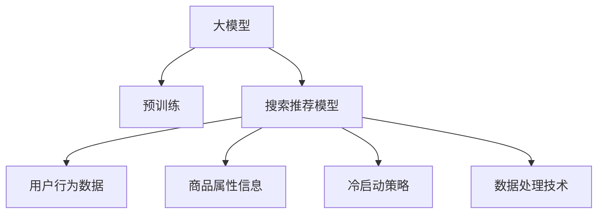

                 

# 电商平台的AI 大模型应用：搜索推荐系统是核心，冷启动策略与数据处理

> 关键词：电商、搜索推荐、大模型、冷启动、数据处理、深度学习

## 1. 背景介绍

### 1.1 问题由来
随着互联网和电子商务的迅猛发展，电商平台在用户数量和交易规模上持续扩大。用户需求日益多样化，如何提升搜索推荐的准确性和个性化，直接关系到用户的购物体验和平台的转化率、复购率等关键指标。传统的基于规则和关键词匹配的推荐算法，难以满足用户不断变化的个性化需求，亟需引入先进的AI技术以提升推荐效果。

在大数据和深度学习算法的推动下，电商平台的AI推荐系统逐渐成为实现个性化推荐的重要手段。其中，基于大模型的推荐算法由于其强大的自适应能力和泛化能力，逐渐取代传统机器学习模型，成为AI推荐的主流方向。

### 1.2 问题核心关键点
AI大模型在电商平台的搜索推荐系统中的应用，主要涉及以下几个核心关键点：

- **大模型预训练**：利用大规模无标签数据，预训练通用语言表示，具备强大的语义理解和生成能力。
- **搜索推荐模型构建**：将预训练大模型作为特征提取器，结合用户行为数据和商品属性信息，构建搜索推荐模型。
- **冷启动问题解决**：新用户或新商品进入系统时，如何通过大模型快速获取其语义表示，以进行有效推荐。
- **数据高效处理**：电商交易数据体量庞大、维度高，如何高效处理和利用数据，提升推荐模型的训练效率和效果。

### 1.3 问题研究意义
电商平台的AI搜索推荐系统，对提升用户体验、增加用户粘性和交易转化具有重要意义。利用大模型进行推荐，可以大幅提升推荐的准确性和个性化水平，从而为电商平台带来更大的商业价值。具体而言：

1. **提升用户体验**：个性化推荐能够根据用户的历史行为和偏好，提供更符合用户需求的商品，提升用户的满意度和购物体验。
2. **增加用户粘性**：通过精准推荐，提升用户回购率，增加用户的平台访问量和停留时间。
3. **提升转化率**：推荐系统可以引导用户发现更多潜在购买目标，提高单次访问的转化率。
4. **支持商家运营**：平台可以为商家提供个性化的商品推荐，提升商家产品的曝光率和销量，优化营销策略。
5. **优化库存管理**：推荐系统可以根据用户需求预测商品销量，帮助商家优化库存管理，减少库存积压和缺货情况。

## 2. 核心概念与联系

### 2.1 核心概念概述

为了更好地理解基于大模型的电商搜索推荐系统，本节将介绍几个密切相关的核心概念：

- **大模型**：如BERT、GPT、DALL·E等，通过大规模无标签数据的预训练，获得丰富的语言和图像语义表示，具备强大的特征提取能力。
- **搜索推荐模型**：结合用户行为数据和商品属性，构建的深度学习模型，用于预测用户对商品的兴趣和购买行为。
- **冷启动问题**：新用户或商品进入系统时，如何利用已有数据进行快速特征学习，以进行有效推荐。
- **数据处理**：电商数据体量庞大、维度高，如何高效处理和利用数据，提升推荐模型的训练效率和效果。

这些核心概念之间的逻辑关系可以通过以下Mermaid流程图来展示：



这个流程图展示了大模型在电商搜索推荐系统中的核心作用和关键技术环节：

1. 大模型通过预训练获得基础能力。
2. 搜索推荐模型结合用户行为数据和商品属性信息，利用大模型提取特征。
3. 冷启动策略解决新用户或新商品的数据缺失问题。
4. 数据处理技术提升推荐模型的训练效率和效果。

## 3. 核心算法原理 & 具体操作步骤
### 3.1 算法原理概述

基于大模型的电商搜索推荐系统，核心原理是将大模型作为特征提取器，结合用户行为数据和商品属性信息，构建搜索推荐模型。具体而言，分为以下几个步骤：

1. **数据准备**：收集用户行为数据和商品属性信息，并进行预处理和特征提取。
2. **大模型预训练**：利用大规模无标签数据，对通用语言模型进行预训练，学习通用的语言和图像表示。
3. **特征提取**：将用户行为数据和商品属性信息输入大模型，提取其语义表示。
4. **模型构建**：构建深度学习模型，如神经网络、Attention机制、Transformer等，利用提取的语义表示，进行用户行为预测或商品推荐。
5. **模型训练**：使用标注数据，对搜索推荐模型进行训练，调整模型参数，优化预测或推荐效果。
6. **模型评估**：在测试集上评估模型性能，进行必要的调参和优化。

### 3.2 算法步骤详解

**步骤1: 数据准备**

- 收集用户行为数据和商品属性信息，如点击、浏览、购买记录，商品标题、描述、类别等。
- 对数据进行清洗和预处理，去除噪声和无效数据，生成特征向量。
- 特征工程：根据业务需求，设计有意义的特征，如用户点击序列、商品类别、品牌等。

**步骤2: 大模型预训练**

- 选择合适的大模型，如BERT、GPT等，进行预训练。
- 预训练任务：选择适合电商场景的预训练任务，如掩码语言模型、视觉语言模型等。
- 使用预训练大模型作为特征提取器，提取用户行为和商品属性的语义表示。

**步骤3: 特征提取**

- 将用户行为数据和商品属性信息，输入大模型进行特征提取。
- 生成高维特征向量，作为深度学习模型的输入。

**步骤4: 模型构建**

- 选择合适的深度学习模型，如神经网络、Attention机制、Transformer等。
- 将大模型提取的特征，输入模型进行进一步处理和融合。
- 设计合适的输出层，如二分类、多分类、回归等，用于预测用户行为或推荐商品。

**步骤5: 模型训练**

- 使用标注数据，对模型进行训练。
- 选择合适的优化算法和损失函数，如Adam、SGD、交叉熵损失等。
- 调整模型参数，优化预测或推荐效果。

**步骤6: 模型评估**

- 在测试集上评估模型性能，如准确率、召回率、F1-score等。
- 根据评估结果，进行必要的调参和优化。

### 3.3 算法优缺点

基于大模型的电商搜索推荐系统具有以下优点：

- **泛化能力强**：大模型通过预训练，具备强大的语言和图像理解能力，能够适应多种电商场景，泛化能力强。
- **特征提取能力强**：大模型能够高效提取用户行为和商品属性的语义表示，提升推荐模型的准确性和个性化水平。
- **实时性高**：通过优化计算图和参数结构，可以实现在线实时推荐，提升用户体验。
- **易用性高**：使用先进的深度学习框架和开源工具，开发者可以便捷地实现和部署推荐系统。

同时，该方法也存在以下局限性：

- **计算资源需求高**：大模型参数量庞大，计算资源需求高，需要高性能硬件支持。
- **数据依赖性强**：推荐模型依赖于大量的标注数据和高质量数据，数据获取成本较高。
- **模型复杂度高**：大模型结构复杂，模型调优和优化难度较大。
- **解释性不足**：推荐模型的决策过程复杂，难以进行有效的解释和调试。

尽管存在这些局限性，但就目前而言，基于大模型的搜索推荐系统仍是最有效的电商推荐方法之一。未来相关研究的重点在于如何进一步降低计算资源需求，提高模型的实时性和可解释性，同时兼顾数据效率和效果。

### 3.4 算法应用领域

基于大模型的电商搜索推荐系统，在电商平台的推荐应用中已经得到了广泛的应用，覆盖了几乎所有常见任务，例如：

- **个性化推荐**：根据用户历史行为和偏好，推荐相关商品。
- **内容推荐**：推荐相关商品、商品评论、商品问答等。
- **用户画像生成**：通过用户行为数据，生成用户画像，用于推荐和广告投放。
- **商品搜索排序**：优化搜索结果排序，提升用户搜索体验。
- **广告投放**：根据用户画像和行为数据，进行精准广告投放。
- **库存管理**：预测商品销量，优化库存管理。

除了上述这些经典任务外，大模型搜索推荐系统还被创新性地应用到更多场景中，如智能客服、智能搜索、实时监控等，为电商平台的运营提供更智能、更高效的支持。随着预训练模型和推荐方法的不断进步，相信电商平台的搜索推荐系统将进一步提升用户体验，推动电商业务的持续增长。

## 4. 数学模型和公式 & 详细讲解  
### 4.1 数学模型构建

在电商平台的搜索推荐系统中，数学模型通常包括以下几个关键部分：

- **用户行为数据**：如点击、浏览、购买等行为，转换为用户行为特征向量 $X$。
- **商品属性信息**：如商品类别、品牌、价格等，转换为商品属性特征向量 $Y$。
- **大模型语义表示**：将用户行为数据和商品属性信息输入大模型，提取其语义表示 $Z$。
- **推荐模型**：使用深度学习模型，如神经网络、Attention机制、Transformer等，进行用户行为预测或商品推荐。

以二分类任务为例，推荐模型的数学模型为：

$$
Y = f(X, Z)
$$

其中 $Y$ 表示用户行为，$f$ 表示推荐模型，$X$ 和 $Z$ 为模型的输入特征。推荐模型的预测结果为：

$$
Y' = softmax(f(X, Z))
$$

其中 $Y'$ 为预测结果，$softmax$ 为softmax函数，用于将模型输出转化为概率分布。

### 4.2 公式推导过程

在实际应用中，推荐模型的训练目标函数通常为交叉熵损失函数：

$$
\mathcal{L} = -\frac{1}{N} \sum_{i=1}^N \sum_{j=1}^C y_{ij} \log P(Y_{ij} = 1 | X_i, Z_i)
$$

其中 $N$ 为样本数，$C$ 为类别数，$y_{ij}$ 为标签，$P(Y_{ij} = 1 | X_i, Z_i)$ 为模型对第 $i$ 个样本在第 $j$ 个类别上的预测概率。

推荐模型的优化目标是最小化损失函数：

$$
\hat{\theta} = \mathop{\arg\min}_{\theta} \mathcal{L}
$$

其中 $\hat{\theta}$ 为模型参数。

### 4.3 案例分析与讲解

假设我们有一个电商平台，需要推荐用户购买商品 $i$ 的概率。用户的历史行为数据 $X_i$ 和商品 $i$ 的属性信息 $Y_i$ 输入到大模型中，提取其语义表示 $Z_i$。推荐模型为神经网络，输入为 $X_i$ 和 $Z_i$，输出为商品 $i$ 被用户购买的概率 $P(Y_i = 1 | X_i, Z_i)$。

在训练阶段，我们首先对用户历史行为数据和商品属性信息进行预处理和特征提取，得到输入向量 $X_i$ 和 $Y_i$。然后将 $X_i$ 和 $Y_i$ 输入到大模型中，提取其语义表示 $Z_i$。最后，将 $Z_i$ 输入到推荐模型中，输出预测结果 $Y'$，并与真实标签 $y_i$ 进行交叉熵损失计算，用于优化模型参数 $\theta$。

## 5. 项目实践：代码实例和详细解释说明
### 5.1 开发环境搭建

在进行电商搜索推荐系统开发前，我们需要准备好开发环境。以下是使用Python进行PyTorch开发的环境配置流程：

1. 安装Anaconda：从官网下载并安装Anaconda，用于创建独立的Python环境。

2. 创建并激活虚拟环境：
```bash
conda create -n pytorch-env python=3.8 
conda activate pytorch-env
```

3. 安装PyTorch：根据CUDA版本，从官网获取对应的安装命令。例如：
```bash
conda install pytorch torchvision torchaudio cudatoolkit=11.1 -c pytorch -c conda-forge
```

4. 安装Transformers库：
```bash
pip install transformers
```

5. 安装各类工具包：
```bash
pip install numpy pandas scikit-learn matplotlib tqdm jupyter notebook ipython
```

完成上述步骤后，即可在`pytorch-env`环境中开始电商搜索推荐系统的开发。

### 5.2 源代码详细实现

下面以电商推荐系统的二分类任务为例，给出使用Transformers库对BERT模型进行推荐建模的PyTorch代码实现。

首先，定义推荐模型的数据处理函数：

```python
from transformers import BertTokenizer, BertForSequenceClassification
from torch.utils.data import Dataset, DataLoader
import torch

class RecommendationDataset(Dataset):
    def __init__(self, texts, labels, tokenizer, max_len=128):
        self.texts = texts
        self.labels = labels
        self.tokenizer = tokenizer
        self.max_len = max_len
        
    def __len__(self):
        return len(self.texts)
    
    def __getitem__(self, item):
        text = self.texts[item]
        label = self.labels[item]
        
        encoding = self.tokenizer(text, return_tensors='pt', max_length=self.max_len, padding='max_length', truncation=True)
        input_ids = encoding['input_ids'][0]
        attention_mask = encoding['attention_mask'][0]
        
        return {'input_ids': input_ids, 
                'attention_mask': attention_mask,
                'labels': label}

# 创建dataset
tokenizer = BertTokenizer.from_pretrained('bert-base-cased')

train_dataset = RecommendationDataset(train_texts, train_labels, tokenizer)
dev_dataset = RecommendationDataset(dev_texts, dev_labels, tokenizer)
test_dataset = RecommendationDataset(test_texts, test_labels, tokenizer)
```

然后，定义模型和优化器：

```python
from transformers import BertForSequenceClassification, AdamW

model = BertForSequenceClassification.from_pretrained('bert-base-cased', num_labels=2)

optimizer = AdamW(model.parameters(), lr=2e-5)
```

接着，定义训练和评估函数：

```python
from tqdm import tqdm
from sklearn.metrics import classification_report

device = torch.device('cuda') if torch.cuda.is_available() else torch.device('cpu')
model.to(device)

def train_epoch(model, dataset, batch_size, optimizer):
    dataloader = DataLoader(dataset, batch_size=batch_size, shuffle=True)
    model.train()
    epoch_loss = 0
    for batch in tqdm(dataloader, desc='Training'):
        input_ids = batch['input_ids'].to(device)
        attention_mask = batch['attention_mask'].to(device)
        labels = batch['labels'].to(device)
        model.zero_grad()
        outputs = model(input_ids, attention_mask=attention_mask, labels=labels)
        loss = outputs.loss
        epoch_loss += loss.item()
        loss.backward()
        optimizer.step()
    return epoch_loss / len(dataloader)

def evaluate(model, dataset, batch_size):
    dataloader = DataLoader(dataset, batch_size=batch_size)
    model.eval()
    preds, labels = [], []
    with torch.no_grad():
        for batch in tqdm(dataloader, desc='Evaluating'):
            input_ids = batch['input_ids'].to(device)
            attention_mask = batch['attention_mask'].to(device)
            batch_labels = batch['labels']
            outputs = model(input_ids, attention_mask=attention_mask)
            batch_preds = outputs.logits.argmax(dim=2).to('cpu').tolist()
            batch_labels = batch_labels.to('cpu').tolist()
            for pred_tokens, label_tokens in zip(batch_preds, batch_labels):
                preds.append(pred_tokens[:len(label_tokens)])
                labels.append(label_tokens)
                
    print(classification_report(labels, preds))
```

最后，启动训练流程并在测试集上评估：

```python
epochs = 5
batch_size = 16

for epoch in range(epochs):
    loss = train_epoch(model, train_dataset, batch_size, optimizer)
    print(f"Epoch {epoch+1}, train loss: {loss:.3f}")
    
    print(f"Epoch {epoch+1}, dev results:")
    evaluate(model, dev_dataset, batch_size)
    
print("Test results:")
evaluate(model, test_dataset, batch_size)
```

以上就是使用PyTorch对BERT进行电商推荐系统建模的完整代码实现。可以看到，得益于Transformers库的强大封装，我们可以用相对简洁的代码完成BERT模型的加载和推荐建模。

### 5.3 代码解读与分析

让我们再详细解读一下关键代码的实现细节：

**RecommendationDataset类**：
- `__init__`方法：初始化文本、标签、分词器等关键组件。
- `__len__`方法：返回数据集的样本数量。
- `__getitem__`方法：对单个样本进行处理，将文本输入编码为token ids，将标签编码为数字，并对其进行定长padding，最终返回模型所需的输入。

**模型和优化器定义**：
- 使用BertForSequenceClassification作为推荐模型，指定输出类别数为2，对应于用户是否购买商品的二分类任务。
- 设置AdamW优化器，并设定学习率为2e-5。

**训练和评估函数**：
- 使用PyTorch的DataLoader对数据集进行批次化加载，供模型训练和推理使用。
- 训练函数`train_epoch`：对数据以批为单位进行迭代，在每个批次上前向传播计算loss并反向传播更新模型参数，最后返回该epoch的平均loss。
- 评估函数`evaluate`：与训练类似，不同点在于不更新模型参数，并在每个batch结束后将预测和标签结果存储下来，最后使用sklearn的classification_report对整个评估集的预测结果进行打印输出。

**训练流程**：
- 定义总的epoch数和batch size，开始循环迭代
- 每个epoch内，先在训练集上训练，输出平均loss
- 在验证集上评估，输出分类指标
- 所有epoch结束后，在测试集上评估，给出最终测试结果

可以看到，PyTorch配合Transformers库使得BERT推荐模型的代码实现变得简洁高效。开发者可以将更多精力放在数据处理、模型改进等高层逻辑上，而不必过多关注底层的实现细节。

当然，工业级的系统实现还需考虑更多因素，如模型的保存和部署、超参数的自动搜索、更灵活的任务适配层等。但核心的推荐范式基本与此类似。

## 6. 实际应用场景
### 6.1 电商平台搜索推荐

基于大模型的电商搜索推荐系统，可以广泛应用于电商平台的搜索推荐任务。传统的基于规则和关键词匹配的推荐算法，难以满足用户不断变化的个性化需求，亟需引入先进的AI技术以提升推荐效果。

在技术实现上，可以收集电商平台的商品属性信息、用户历史行为数据，将商品和用户输入大模型进行特征提取，构建推荐模型，训练模型并评估效果。微调后的推荐模型能够根据用户的历史行为和偏好，推荐相关商品，提升用户购物体验和转化率。

### 6.2 个性化广告推荐

电商平台可以利用大模型进行个性化广告推荐，提升广告投放的精准度和效果。传统的广告推荐算法基于规则或浅层机器学习，难以应对多变的用户行为和广告创意。而基于大模型的广告推荐算法，能够更好地理解用户兴趣和广告内容，实现精准的广告投放。

具体而言，可以收集用户的历史行为数据和广告点击数据，将广告内容输入大模型进行特征提取，构建广告推荐模型。微调后的模型能够根据用户的行为特征，预测用户对不同广告的兴趣，实现精准的广告投放。

### 6.3 实时推荐系统

大模型的实时推荐系统，能够根据用户的实时行为数据，进行动态推荐，提升推荐效果。传统的推荐系统通常是离线批量训练，无法实时响应用户需求。而基于大模型的实时推荐系统，可以实现在线实时推荐，提升用户体验。

具体实现时，可以将用户的实时行为数据输入大模型，提取其语义表示，再将其输入推荐模型进行动态推荐。这种实时推荐系统能够根据用户的实时行为，动态调整推荐结果，提升推荐效果和用户体验。

### 6.4 未来应用展望

随着大模型和推荐方法的发展，基于大模型的电商搜索推荐系统将在更多领域得到应用，为电商平台的运营带来变革性影响。

在智慧物流领域，利用大模型的推荐算法，可以为仓库管理提供优化建议，提升仓储效率。

在智慧营销领域，利用大模型的推荐算法，可以为品牌和产品制定个性化营销策略，提升品牌影响力和产品销售。

在智慧金融领域，利用大模型的推荐算法，可以为金融产品推荐提供精准预测，优化金融服务。

除此之外，在教育、旅游、娱乐等众多领域，基于大模型的推荐算法也将得到广泛应用，为各行各业提供智能化的推荐服务。相信随着技术的日益成熟，基于大模型的搜索推荐系统必将在更多领域大放异彩，深刻影响人类的生产生活方式。

## 7. 工具和资源推荐
### 7.1 学习资源推荐

为了帮助开发者系统掌握电商搜索推荐系统的理论基础和实践技巧，这里推荐一些优质的学习资源：

1. 《深度学习入门》系列博文：从基础概念到深度学习应用，深入浅出地介绍了深度学习的基本原理和电商推荐系统。

2. CS231n《深度学习计算机视觉》课程：斯坦福大学开设的计算机视觉明星课程，涵盖深度学习基础、视觉推荐任务等前沿内容。

3. 《Deep Learning with PyTorch》书籍：深度学习领域的经典教材，详细介绍了PyTorch的使用方法和电商推荐系统的构建方法。

4. Kaggle：数据科学竞赛平台，提供大量电商推荐系统的数据集和竞赛项目，可以实践电商推荐系统相关技术。

5. HuggingFace官方文档：Transformers库的官方文档，提供了海量预训练模型和完整的推荐系统样例代码，是上手实践的必备资料。

通过对这些资源的学习实践，相信你一定能够快速掌握电商搜索推荐系统的精髓，并用于解决实际的电商问题。
###  7.2 开发工具推荐

高效的开发离不开优秀的工具支持。以下是几款用于电商搜索推荐系统开发的常用工具：

1. PyTorch：基于Python的开源深度学习框架，灵活动态的计算图，适合快速迭代研究。大部分预训练语言模型都有PyTorch版本的实现。

2. TensorFlow：由Google主导开发的开源深度学习框架，生产部署方便，适合大规模工程应用。同样有丰富的预训练语言模型资源。

3. Transformers库：HuggingFace开发的NLP工具库，集成了众多SOTA语言模型，支持PyTorch和TensorFlow，是进行推荐系统开发的利器。

4. Weights & Biases：模型训练的实验跟踪工具，可以记录和可视化模型训练过程中的各项指标，方便对比和调优。与主流深度学习框架无缝集成。

5. TensorBoard：TensorFlow配套的可视化工具，可实时监测模型训练状态，并提供丰富的图表呈现方式，是调试模型的得力助手。

6. Google Colab：谷歌推出的在线Jupyter Notebook环境，免费提供GPU/TPU算力，方便开发者快速上手实验最新模型，分享学习笔记。

合理利用这些工具，可以显著提升电商搜索推荐系统的开发效率，加快创新迭代的步伐。

### 7.3 相关论文推荐

电商平台的AI搜索推荐系统，对提升用户体验、增加用户粘性和交易转化具有重要意义。利用大模型进行推荐，可以大幅提升推荐的准确性和个性化水平，从而为电商平台带来更大的商业价值。以下是几篇奠基性的相关论文，推荐阅读：

1. Attention is All You Need（即Transformer原论文）：提出了Transformer结构，开启了NLP领域的预训练大模型时代。

2. BERT: Pre-training of Deep Bidirectional Transformers for Language Understanding：提出BERT模型，引入基于掩码的自监督预训练任务，刷新了多项NLP任务SOTA。

3. Deep Learning for Recommender Systems：综述了深度学习在推荐系统中的应用，包括基于神经网络的推荐模型。

4. Neural Collaborative Filtering：提出基于矩阵分解的神经网络推荐模型，提升推荐效果。

5. Attention-Based Recommender Networks with Relation-Awareness：引入注意力机制和关系网络，提升推荐系统的效果和泛化能力。

6. Deeper Reinforcement Learning for Recommender Systems：引入强化学习算法，实现动态推荐，提升推荐效果。

这些论文代表了大模型在电商搜索推荐系统中的应用趋势和前沿进展。通过学习这些前沿成果，可以帮助研究者把握学科前进方向，激发更多的创新灵感。

## 8. 总结：未来发展趋势与挑战
### 8.1 总结

本文对基于大模型的电商搜索推荐系统进行了全面系统的介绍。首先阐述了电商搜索推荐系统的重要性及其面临的挑战，明确了大模型在其中的核心作用。其次，从原理到实践，详细讲解了大模型在电商搜索推荐系统中的应用方法，包括数据准备、模型构建、冷启动处理等关键步骤，给出了推荐系统的代码实例。同时，本文还广泛探讨了推荐系统在电商、广告、实时推荐等实际应用场景中的应用前景，展示了大模型推荐系统的强大潜力。此外，本文精选了推荐系统的各类学习资源，力求为读者提供全方位的技术指引。

通过本文的系统梳理，可以看到，基于大模型的电商搜索推荐系统正在成为电商推荐的主流方向，通过其强大的语言理解和生成能力，能够显著提升推荐的准确性和个性化水平。未来，伴随预训练模型和推荐方法的不断进步，基于大模型的电商搜索推荐系统必将在更多领域得到应用，为电商平台的运营带来更大的商业价值。

### 8.2 未来发展趋势

展望未来，电商平台的AI搜索推荐系统将呈现以下几个发展趋势：

1. **模型规模持续增大**：随着算力成本的下降和数据规模的扩张，大模型的参数量还将持续增长，带来更强大的语义理解和生成能力。

2. **实时性提升**：通过优化计算图和参数结构，可以实现在线实时推荐，提升用户体验。

3. **少样本学习和零样本学习**：利用大模型的语言理解能力，通过巧妙的任务描述，在少样本或零样本条件下也能实现有效的推荐。

4. **跨领域迁移能力**：利用大模型的跨领域迁移能力，可以推广推荐系统到更多垂直领域，如医疗、金融等。

5. **多模态融合**：将图像、语音等多模态数据与文本数据进行融合，提升推荐系统的全面性和个性化水平。

6. **跨场景优化**：将推荐系统与其他系统（如搜索、广告、营销等）进行联合优化，提升整体系统的效率和效果。

7. **持续学习**：利用数据流数据进行实时微调，保持推荐系统的时效性和适应性。

以上趋势凸显了大模型在电商搜索推荐系统中的广阔前景。这些方向的探索发展，必将进一步提升推荐系统的性能和应用范围，为电商平台的运营提供更大的商业价值。

### 8.3 面临的挑战

尽管大模型的电商搜索推荐系统已经取得了显著效果，但在迈向更加智能化、普适化应用的过程中，它仍面临诸多挑战：

1. **数据获取成本高**：高质量标注数据的获取成本较高，尤其是对于小众领域和冷启动问题，数据获取尤为困难。

2. **计算资源需求高**：大模型参数量庞大，计算资源需求高，需要高性能硬件支持。

3. **模型复杂度高**：大模型结构复杂，模型调优和优化难度较大，需要较强的技术背景和实践经验。

4. **可解释性不足**：推荐系统的决策过程复杂，难以进行有效的解释和调试，给用户带来不信任感。

5. **用户隐私问题**：推荐系统需要大量的用户行为数据，如何保护用户隐私，避免数据泄露和滥用，也是重要挑战。

6. **算法公平性**：推荐系统的决策过程可能存在算法偏见，如何确保算法的公平性和公正性，避免歧视性推荐，也是重要研究方向。

7. **多模态数据处理**：多模态数据融合处理，需要考虑不同模态数据之间的协同和融合，提升推荐效果。

这些挑战需要在技术、伦理、法律等多方面协同解决，才能真正实现大模型在电商平台的有效应用。只有面对挑战，积极应对并寻求突破，才能将大模型推荐系统推向更高的台阶。

### 8.4 研究展望

面对大模型电商搜索推荐系统面临的诸多挑战，未来的研究需要在以下几个方面寻求新的突破：

1. **无监督和半监督学习**：探索无监督和半监督学习范式，降低数据获取成本，提升模型的泛化能力和鲁棒性。

2. **跨模态推荐**：将图像、语音等多模态数据与文本数据进行融合，提升推荐系统的全面性和个性化水平。

3. **深度强化学习**：引入深度强化学习算法，实现动态推荐，提升推荐效果和用户体验。

4. **算法公平性**：引入公平性约束，确保推荐系统的决策过程公正公平，避免歧视性推荐。

5. **可解释性和透明度**：开发可解释性的推荐算法，提高推荐系统的透明度和可信度，让用户对推荐结果有更好的理解和信任。

6. **跨场景优化**：将推荐系统与其他系统（如搜索、广告、营销等）进行联合优化，提升整体系统的效率和效果。

7. **用户隐私保护**：采用隐私保护技术，如差分隐私、联邦学习等，保护用户隐私，避免数据泄露和滥用。

这些研究方向将推动大模型在电商平台的有效应用，实现更智能、更普适的推荐系统，为电商平台的运营带来更大的商业价值。

## 9. 附录：常见问题与解答

**Q1：大模型在电商推荐中的优缺点是什么？**

A: 大模型在电商推荐中的优点包括：

1. **泛化能力强**：大模型通过预训练，具备强大的语义理解和生成能力，能够适应多种电商场景，泛化能力强。

2. **特征提取能力强**：大模型能够高效提取用户行为和商品属性的语义表示，提升推荐模型的准确性和个性化水平。

3. **实时性高**：通过优化计算图和参数结构，可以实现在线实时推荐，提升用户体验。

4. **易用性高**：使用先进的深度学习框架和开源工具，开发者可以便捷地实现和部署推荐系统。

大模型的缺点包括：

1. **计算资源需求高**：大模型参数量庞大，计算资源需求高，需要高性能硬件支持。

2. **数据依赖性强**：推荐模型依赖于大量的标注数据和高质量数据，数据获取成本较高。

3. **模型复杂度高**：大模型结构复杂，模型调优和优化难度较大。

4. **可解释性不足**：推荐系统的决策过程复杂，难以进行有效的解释和调试。

尽管存在这些局限性，但就目前而言，基于大模型的电商推荐系统仍是最有效的推荐方法之一。未来相关研究的重点在于如何进一步降低计算资源需求，提高模型的实时性和可解释性，同时兼顾数据效率和效果。

**Q2：电商搜索推荐系统的冷启动问题如何解决？**

A: 冷启动问题是指新用户或新商品进入系统时，如何利用已有数据进行快速特征学习，以进行有效推荐。解决冷启动问题的方法包括：

1. **零样本学习**：利用大模型的语言理解能力，通过巧妙的任务描述，在少样本或零样本条件下也能实现有效的推荐。

2. **知识图谱**：利用知识图谱中的先验知识，引导微调过程学习更准确、合理的语言模型，提升推荐效果。

3. **用户画像生成**：通过用户行为数据，生成用户画像，用于推荐和广告投放，提升推荐效果。

4. **上下文推荐**：利用上下文信息，如时间、地点、设备等，提升推荐效果。

5. **多模态融合**：将图像、语音等多模态数据与文本数据进行融合，提升推荐系统的全面性和个性化水平。

通过以上方法，可以提升推荐系统对新用户和新商品的推荐效果，实现更好的用户体验和运营效果。

**Q3：推荐系统如何处理高维稀疏数据？**

A: 电商平台的推荐系统需要处理高维稀疏数据，常见的处理方式包括：

1. **特征降维**：通过PCA、LDA等降维算法，降低特征维度，减少计算资源消耗。

2. **稀疏矩阵分解**：利用矩阵分解技术，将高维稀疏矩阵分解为低维稠密矩阵，提升计算效率。

3. **隐语义模型**：利用隐语义模型，将高维稀疏特征映射到低维稠密特征空间，提升推荐效果。

4. **深度学习特征提取**：利用深度学习模型，如神经网络、Transformer等，提取高维稀疏特征，提升推荐效果。

通过以上方法，可以有效地处理高维稀疏数据，提升推荐系统的训练效率和效果。

**Q4：推荐系统如何避免过拟合？**

A: 推荐系统中的过拟合问题可以通过以下方法解决：

1. **数据增强**：通过对训练样本改写、回译等方式丰富训练集多样性，避免过拟合。

2. **正则化技术**：如L2正则、Dropout、Early Stopping等，防止模型过度适应小规模训练集。

3. **对抗训练**：加入对抗样本，提高模型鲁棒性，防止过拟合。

4. **模型结构简化**：通过优化模型结构，减少参数数量，避免过拟合。

5. **多模型集成**：训练多个推荐模型，取平均输出，抑制过拟合。

这些方法可以结合使用，根据具体任务和数据特点进行灵活组合，避免过拟合，提升推荐系统的效果。

**Q5：推荐系统如何优化在线实时推荐？**

A: 在线实时推荐系统需要对用户的实时行为数据进行动态处理，常见的方法包括：

1. **滑动窗口**：对用户的实时行为数据进行滑动窗口处理，实时更新推荐结果。

2. **增量学习**：利用增量学习算法，实时更新模型参数，提升推荐效果。

3. **缓存机制**：利用缓存机制，将常用的推荐结果缓存起来，减少实时处理的开销。

4. **异步更新**：利用异步更新技术，优化计算资源的分配，提升推荐效率。

5. **流式数据处理**：利用流式数据处理技术，实时处理用户行为数据，提升推荐效果。

通过以上方法，可以实现在线实时推荐，提升用户体验和推荐效果。

---

作者：禅与计算机程序设计艺术 / Zen and the Art of Computer Programming

