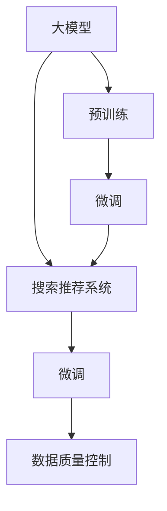

                 

# 电商平台的AI 大模型战略：搜索推荐系统是核心，数据质量控制是关键

## 1. 背景介绍

在当今数字化和全球化的电商市场中，各大电商平台纷纷引入人工智能技术以提升用户体验，驱动业务增长。无论是亚马逊、淘宝，还是国内的京东、拼多多，都已将AI技术应用于搜索、推荐、个性化广告等多个业务环节，旨在为用户提供更精准、更个性化的服务。

大模型（如BERT、GPT-3）由于其强大的语言理解和生成能力，迅速成为AI电商解决方案中的重要组成部分。但大模型并非万能药，其在电商平台的实际应用效果，受到多个因素的影响。本文章将从搜索推荐系统的核心地位和数据质量控制的重要性出发，探讨如何在大模型战略中发挥最大的效能。

## 2. 核心概念与联系

为了更好地理解AI大模型在电商平台中的应用，我们首先需要了解几个关键概念及其相互联系。

### 2.1 核心概念概述

- **大模型（Large Model）**：指参数规模达数亿甚至数十亿的深度学习模型，如BERT、GPT-3等。这些模型通常由大规模无监督学习预训练得到，具备强大的语言理解和生成能力。

- **搜索推荐系统（Search & Recommendation System）**：电商平台的核心模块之一，通过分析用户行为数据，推荐符合用户需求的商品或服务。

- **数据质量控制（Data Quality Control）**：指对输入到模型中的数据进行清洗、标注、处理，以确保数据的质量，避免因数据质量问题导致模型性能下降。

- **模型微调（Fine-Tuning）**：在大模型基础上，使用电商平台特定的标注数据进行有监督学习，使其能够更好地适配电商平台的业务需求。

这些概念之间的逻辑关系可以通过以下Mermaid流程图展示：



这个流程图展示了从预训练模型到大模型微调、数据质量控制，最后到搜索推荐系统的整个流程。

## 3. 核心算法原理 & 具体操作步骤

### 3.1 算法原理概述

电商平台利用大模型的核心算法流程包括以下几个步骤：

1. **预训练**：在大规模无标签数据上训练大模型，学习通用的语言表示。
2. **微调**：在电商平台特定任务上使用少量有标签数据进行有监督学习，使模型适配电商平台的数据和业务场景。
3. **搜索推荐**：将微调后的模型应用于搜索和推荐系统，为用户提供个性化的搜索结果和推荐内容。

### 3.2 算法步骤详解

#### 3.2.1 预训练步骤

预训练步骤主要包括选择合适的预训练数据集，如维基百科、大规模新闻、社交媒体等，然后通过自监督任务（如语言模型、掩码语言模型等）训练大模型，使其学习到通用的语言表示。

#### 3.2.2 微调步骤

微调步骤包括：
- 收集电商平台特有的标注数据集，如用户行为数据、商品评价数据等。
- 使用微调算法（如AdamW、SGD等）和大模型进行有监督学习，更新模型参数，使其适应电商平台的具体业务需求。
- 在微调过程中，选择合适的学习率、批量大小、迭代次数等超参数，并应用正则化技术（如L2正则、Dropout等）防止过拟合。

#### 3.2.3 搜索推荐系统

微调后的模型应用于搜索推荐系统，主要用于以下几个方面：
- 文本匹配：通过计算用户查询与商品描述之间的相似度，推荐符合用户需求的商品。
- 用户行为分析：通过分析用户的历史行为数据，预测用户的未来需求，实现个性化推荐。
- 广告投放：通过预测用户可能感兴趣的商品类别，优化广告投放策略，提升广告点击率和转化率。

### 3.3 算法优缺点

#### 3.3.1 优点

- **泛化能力强**：大模型通过大规模预训练，具有强大的泛化能力，能够在多种任务和数据集上取得优秀表现。
- **灵活性强**：微调过程可以根据电商平台的具体需求进行调整，使模型更加适配业务场景。
- **性能提升明显**：在大模型的基础上进行微调，能够显著提升搜索推荐系统的精度和召回率。

#### 3.3.2 缺点

- **资源消耗大**：预训练和微调过程需要大量的计算资源，训练时间和成本较高。
- **数据依赖强**：微调效果依赖于标注数据的质量和数量，标注成本较高。
- **模型复杂度高**：大模型的结构复杂，维护和调试难度较大。

### 3.4 算法应用领域

大模型和微调技术在电商平台的搜索推荐系统中得到了广泛应用。以下是几个具体的应用场景：

- **商品搜索**：利用大模型对用户查询进行语义理解，推荐与查询语义相似的搜索结果。
- **个性化推荐**：基于用户的历史行为数据，通过大模型进行个性化推荐，提升用户满意度。
- **广告投放**：通过分析用户的行为数据，预测用户可能感兴趣的商品类别，优化广告投放策略。
- **用户意图识别**：利用大模型识别用户的意图，实现更精准的推荐和服务。

## 4. 数学模型和公式 & 详细讲解

### 4.1 数学模型构建

假设我们有一个电商平台，收集到用户查询 $q$ 和商品描述 $d$，希望根据这些数据训练一个大模型 $M$，用于搜索推荐。构建的数学模型为：

$$ M(q, d) = f(q; \theta) + g(d; \phi) $$

其中 $f$ 和 $g$ 分别表示查询和描述的表示函数，$\theta$ 和 $\phi$ 为模型的参数。

### 4.2 公式推导过程

以用户意图识别为例，我们需要构建一个二分类模型，将用户查询 $q$ 映射到两个意图 $c_1$ 和 $c_2$。假设构建的模型为 $M(q; \theta)$，输出为 $p(q; \theta)$，其中 $p(q; \theta)$ 表示查询 $q$ 属于 $c_1$ 的概率。构建的数学模型为：

$$ p(q; \theta) = \sigma(W^T[\text{embed}(q; \theta)] + b) $$

其中 $W$ 和 $b$ 为模型的权重和偏置，$\text{embed}(q; \theta)$ 为查询 $q$ 的嵌入表示。

### 4.3 案例分析与讲解

以淘宝搜索推荐系统为例，假设收集到的用户查询为 "无线充电器"，商品描述为 "苹果无线充电器黑色"。使用大模型对用户查询和商品描述进行处理，得到嵌入表示，并通过对比查询和商品描述的相似度，推荐符合用户需求的商品。

具体实现步骤如下：
1. 对用户查询和商品描述进行预处理，如去除停用词、分词等。
2. 使用大模型对查询和商品描述进行嵌入表示。
3. 计算查询和商品描述之间的余弦相似度，得到相似度得分。
4. 根据相似度得分排序，推荐相似度得分最高的商品。

## 5. 项目实践：代码实例和详细解释说明

### 5.1 开发环境搭建

进行大模型和搜索推荐系统开发前，需要搭建好开发环境。以下是搭建环境的详细步骤：

1. **安装Python**：从官网下载并安装Python 3.8。
2. **安装PyTorch**：
```bash
pip install torch torchvision torchaudio
```
3. **安装Hugging Face Transformers库**：
```bash
pip install transformers
```
4. **安装TensorFlow**：
```bash
pip install tensorflow
```
5. **安装相关库**：
```bash
pip install pandas numpy scikit-learn torchtext jupyter notebook
```

完成上述步骤后，即可在Python环境中进行大模型和搜索推荐系统的开发。

### 5.2 源代码详细实现

以下是一个基于大模型进行用户意图识别的代码实现：

```python
import torch
import torch.nn as nn
import torch.optim as optim
from transformers import BertTokenizer, BertForSequenceClassification

class BertIntentClassifier(nn.Module):
    def __init__(self, num_labels):
        super(BertIntentClassifier, self).__init__()
        self.bert = BertForSequenceClassification.from_pretrained('bert-base-uncased', num_labels=num_labels)
        self.dropout = nn.Dropout(0.1)
        
    def forward(self, input_ids, attention_mask, labels=None):
        output = self.bert(input_ids, attention_mask=attention_mask)
        output = self.dropout(output)
        logits = output[0]
        return logits

# 设置模型参数
num_labels = 2
model = BertIntentClassifier(num_labels)
optimizer = optim.Adam(model.parameters(), lr=2e-5)
device = torch.device('cuda' if torch.cuda.is_available() else 'cpu')
model.to(device)

# 定义训练函数
def train_epoch(model, train_dataset, batch_size, optimizer):
    model.train()
    total_loss = 0
    for batch in train_dataset:
        input_ids = batch['input_ids'].to(device)
        attention_mask = batch['attention_mask'].to(device)
        labels = batch['labels'].to(device)
        optimizer.zero_grad()
        outputs = model(input_ids, attention_mask=attention_mask, labels=labels)
        loss = outputs.loss
        total_loss += loss.item()
        loss.backward()
        optimizer.step()
    return total_loss / len(train_dataset)

# 定义评估函数
def evaluate(model, test_dataset, batch_size):
    model.eval()
    total_correct = 0
    for batch in test_dataset:
        input_ids = batch['input_ids'].to(device)
        attention_mask = batch['attention_mask'].to(device)
        labels = batch['labels'].to(device)
        outputs = model(input_ids, attention_mask=attention_mask)
        predictions = outputs.argmax(dim=1).to('cpu').tolist()
        for pred, label in zip(predictions, labels):
            if pred == label:
                total_correct += 1
    accuracy = total_correct / len(test_dataset)
    return accuracy

# 训练模型
train_dataset = ...
test_dataset = ...
epochs = 5
batch_size = 16

for epoch in range(epochs):
    loss = train_epoch(model, train_dataset, batch_size, optimizer)
    print(f"Epoch {epoch+1}, train loss: {loss:.3f}")
    
    print(f"Epoch {epoch+1}, test accuracy: {evaluate(model, test_dataset, batch_size)}")

```

### 5.3 代码解读与分析

**BertIntentClassifier类**：
- 继承自nn.Module，用于定义模型结构。
- `__init__`方法：初始化BertForSequenceClassification层和Dropout层，并设置学习率。
- `forward`方法：定义模型前向传播过程，通过BertForSequenceClassification层计算输出，并进行Dropout处理。

**模型训练函数**：
- 定义训练函数`train_epoch`，在每个epoch中，对训练集进行迭代，计算损失，并更新模型参数。
- 使用Adam优化器进行参数更新。
- 在每个epoch结束时，计算平均损失，并评估模型在验证集上的表现。

**模型评估函数**：
- 定义评估函数`evaluate`，在测试集上计算模型准确率。
- 使用模型的前向传播输出，计算预测值和真实标签的准确率。

**训练流程**：
- 设置总的epoch数和批量大小，开始循环迭代
- 每个epoch内，在训练集上训练，输出平均损失
- 在验证集上评估，输出模型准确率
- 所有epoch结束后，在测试集上评估，给出最终测试结果

## 6. 实际应用场景

### 6.1 智能客服系统

智能客服系统是大模型在电商平台中的应用之一。利用大模型和微调技术，可以构建出能够理解用户意图、提供个性化服务的智能客服机器人。

智能客服系统的构建流程如下：
1. 收集用户与客服的对话数据，标注用户意图和客服回复。
2. 使用大模型进行意图识别，对用户查询进行处理，识别用户意图。
3. 根据用户意图，从知识库中检索出相应的回复，进行生成和输出。

### 6.2 个性化推荐系统

个性化推荐系统是电商平台中的重要组成部分，旨在为用户推荐符合其需求的商品。利用大模型和微调技术，可以实现更精准的个性化推荐。

推荐系统的构建流程如下：
1. 收集用户历史行为数据，如浏览记录、点击记录、购买记录等。
2. 使用大模型对用户行为数据进行处理，学习用户的兴趣和偏好。
3. 根据用户的兴趣和偏好，生成个性化推荐列表。

### 6.3 用户行为分析

用户行为分析是电商平台中的另一重要应用场景，通过分析用户行为数据，可以预测用户未来的购买行为，实现更精准的营销策略。

用户行为分析的构建流程如下：
1. 收集用户历史行为数据，如搜索记录、点击记录、购买记录等。
2. 使用大模型对用户行为数据进行处理，学习用户的兴趣和偏好。
3. 根据用户的兴趣和偏好，预测用户未来的购买行为。

## 7. 工具和资源推荐

### 7.1 学习资源推荐

为了帮助开发者系统掌握大模型和搜索推荐系统的理论基础和实践技巧，这里推荐一些优质的学习资源：

1. **《深度学习与推荐系统》课程**：斯坦福大学开设的课程，涵盖了深度学习在推荐系统中的应用。
2. **《推荐系统实战》书籍**：介绍了推荐系统的理论和实践，涵盖了大模型在推荐系统中的应用。
3. **《自然语言处理综述》论文**：总结了自然语言处理领域的最新进展，包括大模型和微调技术。
4. **Hugging Face官方文档**：提供了多种大模型的实现，以及微调样例代码。
5. **Kaggle竞赛**：Kaggle上有很多推荐系统相关的竞赛，可以帮助开发者实际应用大模型进行推荐。

### 7.2 开发工具推荐

大模型和搜索推荐系统的开发需要依赖一些高效的工具，以下是几个常用的开发工具：

1. **PyTorch**：基于Python的开源深度学习框架，适合快速迭代研究。
2. **TensorFlow**：由Google主导开发的开源深度学习框架，适合大规模工程应用。
3. **Hugging Face Transformers库**：提供了多种大模型的实现，以及微调样例代码。
4. **TensorBoard**：TensorFlow配套的可视化工具，可以实时监测模型训练状态，并提供丰富的图表呈现方式。
5. **Weights & Biases**：模型训练的实验跟踪工具，可以记录和可视化模型训练过程中的各项指标。

### 7.3 相关论文推荐

大模型和搜索推荐技术的发展源于学界的持续研究。以下是几篇奠基性的相关论文，推荐阅读：

1. **Attention is All You Need**：提出了Transformer结构，开启了NLP领域的预训练大模型时代。
2. **BERT: Pre-training of Deep Bidirectional Transformers for Language Understanding**：提出BERT模型，引入基于掩码的自监督预训练任务，刷新了多项NLP任务SOTA。
3. **Deep Cross-Entropy Multi-task Learning for Recommendation**：提出跨任务多目标学习，提升了推荐系统的效果。
4. **Learning to Recommend with Distributed Rank Prediction**：提出分布式排序学习，提高了推荐系统的计算效率和效果。

## 8. 总结：未来发展趋势与挑战

### 8.1 总结

本文对基于大模型和微调的搜索推荐系统进行了全面系统的介绍。首先阐述了搜索推荐系统在电商平台中的核心地位和数据质量控制的重要性，明确了大模型在适配电商平台的业务需求方面所具备的强大能力。其次，从算法原理到实际操作，详细讲解了大模型的训练和微调步骤，给出了具体的代码实例和分析。同时，本文还广泛探讨了大模型在智能客服、个性化推荐、用户行为分析等多个领域的应用前景，展示了其在电商平台中的应用潜力。

通过本文的系统梳理，可以看到，大模型和微调技术在电商平台中的应用前景广阔，不仅能提升用户体验，还能驱动业务增长。未来，伴随大模型和微调技术的持续演进，将进一步推动电商平台的智能化升级，带来更多业务突破和创新。

### 8.2 未来发展趋势

展望未来，大模型和微调技术在电商平台中的应用将呈现以下几个发展趋势：

1. **多模态数据融合**：未来的推荐系统将更多地融合图像、视频、语音等多模态数据，提升推荐系统的表现力。
2. **分布式训练**：随着模型规模的不断增大，分布式训练将成为主流，实现高效的模型训练。
3. **实时化推荐**：通过高效的模型训练和推理，实现实时化的个性化推荐，提升用户体验。
4. **跨平台协同**：不同平台之间的数据和模型可以协同工作，实现更加精准的推荐。
5. **元学习**：通过元学习技术，模型能够快速适应新的数据和任务，提升推荐系统的适应性。

这些趋势将进一步拓展大模型在电商平台中的应用范围，带来更多业务价值和用户体验提升。

### 8.3 面临的挑战

尽管大模型和微调技术已经取得了显著成效，但在实际应用中，仍然面临诸多挑战：

1. **数据隐私问题**：在收集用户行为数据时，如何保护用户隐私，防止数据泄露。
2. **模型可解释性**：大模型的决策过程难以解释，用户和监管方对其缺乏信任。
3. **资源消耗高**：大模型的训练和推理消耗大量的计算资源，如何在资源有限的条件下提升模型效果。
4. **模型泛化性不足**：大模型在不同电商平台上的泛化能力不足，难以应对新业务场景。
5. **用户接受度低**：用户对推荐结果的不满意可能导致信任度下降，影响平台的用户体验。

### 8.4 研究展望

未来的研究需要在以下几个方面寻求新的突破：

1. **隐私保护技术**：发展隐私保护技术，保护用户数据隐私，提升用户对推荐系统的信任度。
2. **模型可解释性**：开发可解释性强的推荐模型，提高模型的透明性和可信度。
3. **资源优化技术**：发展高效的分布式训练和推理技术，优化资源使用，提升模型效率。
4. **跨平台协同**：实现不同平台之间的数据和模型协同，提升推荐系统的表现力。
5. **元学习技术**：发展元学习技术，使推荐模型具备快速适应新业务场景的能力。

这些研究方向的探索，将引领大模型和微调技术迈向更高的台阶，为电商平台带来更多的业务突破和用户价值。

## 9. 附录：常见问题与解答

**Q1：大模型在电商平台的推荐系统中如何发挥作用？**

A: 大模型在电商平台的推荐系统中主要发挥以下作用：
1. 用户意图识别：通过大模型识别用户的查询意图，实现更精准的推荐。
2. 商品分类：利用大模型对商品进行分类，提升推荐的准确性。
3. 商品相似度计算：通过大模型计算用户查询和商品描述之间的相似度，实现个性化的推荐。

**Q2：如何确保大模型的数据质量？**

A: 确保大模型的数据质量需要从数据收集、数据清洗、数据标注等多个环节进行严格控制。
1. 数据收集：选择高质量的数据源，确保数据的代表性。
2. 数据清洗：去除无关、重复、低质量的数据，确保数据的一致性和准确性。
3. 数据标注：对数据进行准确的标注，确保标注结果的正确性。
4. 数据验证：对标注数据进行验证，确保标注结果的可靠性。

**Q3：在电商平台的推荐系统中，大模型微调需要注意哪些问题？**

A: 在电商平台的推荐系统中，大模型微调需要注意以下几个问题：
1. 标注数据不足：微调依赖标注数据，标注数据不足会影响微调效果。
2. 过拟合问题：微调过程中容易发生过拟合，需要应用正则化技术进行控制。
3. 模型泛化能力不足：微调模型需要具备较强的泛化能力，才能应对新业务场景。
4. 模型资源消耗高：大模型的训练和推理消耗大量的计算资源，需要优化资源使用。
5. 模型可解释性差：大模型的决策过程难以解释，需要提高模型的透明性和可信度。

**Q4：如何提高大模型在电商平台的推荐系统的性能？**

A: 提高大模型在电商平台的推荐系统的性能需要从多个方面进行优化：
1. 选择合适的大模型：根据电商平台的具体业务需求，选择合适的预训练模型。
2. 微调策略优化：应用参数高效微调技术，减少模型训练时间和成本。
3. 数据质量控制：确保输入到模型中的数据高质量，提升模型性能。
4. 算法优化：应用先进的算法，如分布式训练、元学习等，提升模型效果。
5. 用户反馈机制：通过用户反馈机制，及时调整推荐策略，提升用户体验。

这些优化措施将有助于提升大模型在电商平台的推荐系统的性能，带来更好的用户体验和业务价值。

---

作者：禅与计算机程序设计艺术 / Zen and the Art of Computer Programming

