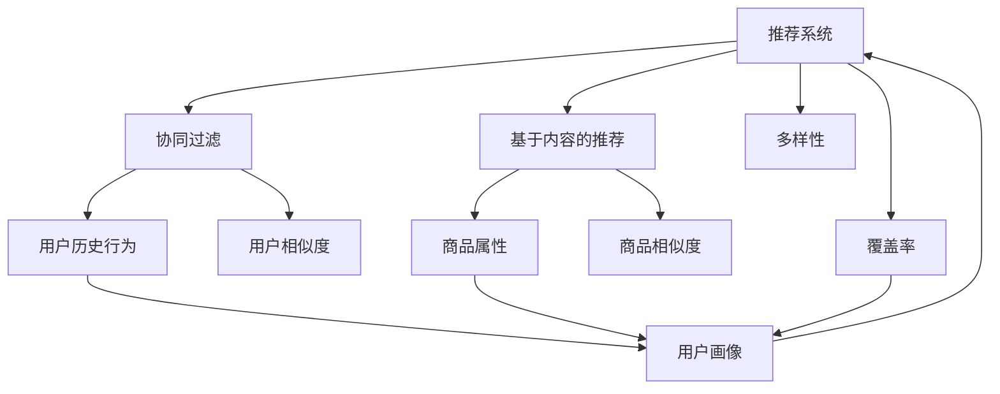

                 

# 电商推荐系统中的多样性与覆盖率平衡

## 1. 背景介绍

### 1.1 问题由来
随着电商行业的迅猛发展，推荐系统在用户体验和交易转化中扮演着越来越重要的角色。传统推荐算法主要基于用户历史行为数据进行个性化推荐，能够显著提升用户满意度，但也存在推荐的单一性和冷启动问题。随着用户需求的多样性和个性化不断提升，如何在电商推荐系统中平衡推荐的多样性和覆盖率，成为了亟待解决的关键问题。

### 1.2 问题核心关键点
在电商推荐系统中，推荐的多样性指的是向用户展示不同类别的商品，避免用户陷入信息茧房。推荐系统的覆盖率指的是向用户展示其感兴趣的商品类别中尽可能多的商品，确保用户能发现更多的潜在购买机会。两者相辅相成，但在实际推荐系统中往往需要权衡取舍。本博文将深入探讨如何在电商推荐系统中实现多样性与覆盖率的平衡。

## 2. 核心概念与联系

### 2.1 核心概念概述

为更好地理解电商推荐系统中的多样性与覆盖率平衡，本节将介绍几个密切相关的核心概念：

- **推荐系统(Recommendation System)**：通过分析用户历史行为数据，为用户推荐个性化商品的智能系统。推荐系统广泛应用于电商、视频、新闻等多个领域，是提升用户体验、增加收入的重要手段。

- **多样性(Diversity)**：指推荐结果中包含的不同类别商品的数量和分布。高多样性推荐能够覆盖更多商品类别，避免用户过于集中在一个特定的商品类别中，有助于发现新奇商品，提升新鲜感。

- **覆盖率(Coverage)**：指推荐结果中包含的特定商品类别中商品的数量。高覆盖率推荐能够涵盖用户可能感兴趣的商品类别，避免漏掉潜在的购买机会，增加交易转化率。

- **协同过滤(Collaborative Filtering)**：一种基于用户历史行为数据进行个性化推荐的方法，分为基于用户的协同过滤和基于物品的协同过滤。通过计算用户行为相似性，为用户推荐与其相似用户或商品相似的商品。

- **基于内容的推荐(Content-Based Recommendation)**：基于商品属性和用户兴趣进行推荐，如商品类别、品牌、价格等。与协同过滤方法相比，基于内容的方法不受数据稀疏性影响，但可能存在推荐单一性和缺乏新奇性问题。

- **混合推荐(Hybrid Recommendation)**：将协同过滤和基于内容的推荐方法进行结合，取长补短，提升推荐效果。混合推荐方法常用于电商、视频等领域，能够平衡推荐的多样性和覆盖率。

- **推荐多样化与覆盖率平衡(Diversity and Coverage Balance)**：在推荐系统中，推荐的多样性和覆盖率存在一定的权衡。如何在两者之间找到最优平衡，是推荐系统优化中一个核心问题。

这些核心概念之间的逻辑关系可以通过以下Mermaid流程图来展示：



这个流程图展示了几类推荐方法的基本逻辑：

1. 推荐系统通过分析用户历史行为和商品属性，生成个性化推荐。
2. 协同过滤和基于内容的推荐方法分别从用户和商品两个维度进行推荐，以提升推荐的多样性和覆盖率。
3. 多样性指的是推荐结果中包含的不同商品类别数量。
4. 覆盖率指的是推荐结果中包含特定商品类别中商品的数量。
5. 用户画像和商品属性为推荐方法提供必要的输入，协同过滤和基于内容的方法进行融合，最终产生多样性平衡的推荐结果。

## 3. 核心算法原理 & 具体操作步骤

### 3.1 算法原理概述

电商推荐系统中的多样性与覆盖率平衡，本质上是通过推荐算法设计平衡多样性和覆盖率的度量指标，并在模型训练和推理中优化这些指标。具体来说，可以通过如下几个步骤实现：

1. **定义多样性指标**：计算推荐结果中不同商品类别的数量和分布。常见的多样性指标包括覆盖类别数、推荐商品类别多样性等。
2. **定义覆盖率指标**：计算推荐结果中特定商品类别中商品的数量。常见的覆盖率指标包括基本覆盖率、平均覆盖率等。
3. **训练推荐模型**：在推荐数据集上训练推荐模型，优化多样性和覆盖率指标。可以使用协同过滤、基于内容的推荐、深度学习等方法。
4. **评估推荐结果**：在测试集上评估推荐结果的多样性和覆盖率，根据评估结果进行微调。
5. **优化推荐策略**：根据评估结果优化推荐策略，如调整模型超参数、引入多样性约束等。

### 3.2 算法步骤详解

#### 3.2.1 数据准备

电商推荐系统中的数据通常包括用户行为数据、商品属性数据和商品标签数据。需要以下处理步骤：

1. **用户行为数据处理**：将用户行为数据转化为推荐系统所需的格式，如点击、浏览、购买等行为记录。可以使用时间窗口、滑动窗口等方式处理用户行为序列。

2. **商品属性数据处理**：将商品属性数据转化为推荐系统所需的格式，如商品类别、品牌、价格等。需要去除冗余和缺失数据，保留对推荐有用的属性。

3. **商品标签数据处理**：将商品标签数据转化为推荐系统所需的格式，如商品的标签序列、标签嵌入等。标签数据可以用于提高推荐的覆盖率，如商品分类标签。

#### 3.2.2 模型训练

电商推荐系统的训练过程可以分为两步：

1. **模型选择**：选择合适的推荐模型，如协同过滤、基于内容的推荐、深度学习等。常见的深度学习模型包括深度矩阵分解(DMF)、多层感知器(MLP)、深度神经网络(DNN)等。

2. **模型训练**：在训练集上训练推荐模型，优化模型参数。可以使用随机梯度下降(SGD)、Adam、Adagrad等优化算法。训练过程可以引入多样性约束，如多目标优化、正则化等，确保模型输出多样性和覆盖率平衡。

#### 3.2.3 推荐评估

电商推荐系统的评估过程可以分为两步：

1. **多样性评估**：计算推荐结果中的覆盖类别数、推荐商品类别多样性等多样性指标。使用NDCG(Normalized Discounted Cumulative Gain)、F1 Score等评估指标。

2. **覆盖率评估**：计算推荐结果中特定商品类别中商品的数量，如基本覆盖率、平均覆盖率等覆盖率指标。使用覆盖率率、准确率等评估指标。

#### 3.2.4 推荐策略优化

电商推荐系统的推荐策略优化可以分为两步：

1. **超参数调整**：根据多样性和覆盖率的评估结果，调整模型的超参数，如学习率、正则化系数、损失函数等。

2. **策略调整**：根据多样性和覆盖率的评估结果，调整推荐策略，如引入多样性约束、调整训练数据等。

### 3.3 算法优缺点

电商推荐系统中的多样性与覆盖率平衡算法具有以下优点：

1. **提升用户体验**：高多样性推荐能够增加新鲜感，避免用户陷入信息茧房，提升用户体验。高覆盖率推荐能够涵盖用户可能感兴趣的商品类别，增加交易转化率。

2. **提高推荐效果**：多样性约束能够确保推荐结果中包含不同类别的商品，避免单一性问题。覆盖率约束能够确保推荐结果中包含特定商品类别中商品的数量，避免漏掉潜在的购买机会。

3. **泛化性强**：推荐系统中的多样性与覆盖率平衡算法具有较好的泛化性，可以应用于不同规模和类型的电商推荐系统。

但该算法也存在以下缺点：

1. **模型复杂度较高**：多样性和覆盖率的平衡需要引入额外的约束，增加了模型的复杂度，需要更多的计算资源和存储资源。

2. **数据依赖性较强**：多样性和覆盖率的平衡依赖于高质量的用户行为数据和商品属性数据，数据的缺失和偏差可能影响推荐效果。

3. **多目标优化难度大**：多样性和覆盖率之间的权衡需要设计合理的多目标优化方法，才能得到较好的推荐结果。

### 3.4 算法应用领域

电商推荐系统中的多样性与覆盖率平衡算法已经在多个领域得到了广泛应用，如亚马逊、淘宝、京东等大型电商平台。以下是几个典型应用场景：

1. **商品推荐**：为电商用户推荐个性化的商品，提高用户满意度，增加交易转化率。

2. **内容推荐**：为视频网站用户推荐个性化的视频内容，增加用户粘性和观看时间。

3. **社交网络推荐**：为社交网站用户推荐个性化的好友和内容，增加用户活跃度和社交互动。

4. **广告推荐**：为广告主推荐个性化的广告，提高广告点击率和转化率。

除了上述这些经典应用外，多样性与覆盖率平衡算法还被创新性地应用到更多场景中，如智能搜索、个性化定制、智能家居等，为电商和互联网应用带来了新的突破。

## 4. 数学模型和公式 & 详细讲解 & 举例说明

### 4.1 数学模型构建

电商推荐系统中的多样性与覆盖率平衡，可以通过以下数学模型进行建模：

设用户$u$的兴趣商品集合为$U$，商品$v$的类别为$C$，商品$v$在类别$C$中的数量向量为$R_C$。则推荐结果的多样性指标$D$和覆盖率指标$C$可以表示为：

$$
D = \sum_{C \in \mathcal{C}} \frac{|\{v \in U| C(v) = C\}|}{\sum_{C \in \mathcal{C}} |\{v \in U| C(v) = C\}|}
$$

$$
C = \frac{1}{|\mathcal{C}|} \sum_{C \in \mathcal{C}} \frac{\sum_{v \in U} R_C(v)}{\sum_{v \in U} R_C(v)}
$$

其中$\mathcal{C}$为商品类别集合，$C(v)$表示商品$v$的类别，$R_C$表示商品$v$在类别$C$中的数量向量。

### 4.2 公式推导过程

电商推荐系统中的多样性与覆盖率平衡，可以通过以下推导过程进行详细讲解：

1. **多样性指标推导**：
   - 推荐结果中不同商品类别的数量和分布可以通过计算各个类别的平均数量向量表示。
   - 多样性指标$D$可以表示为各个类别的平均数量向量的调和平均数。

2. **覆盖率指标推导**：
   - 推荐结果中特定商品类别中商品的数量可以通过计算各个类别的覆盖率向量表示。
   - 覆盖率指标$C$可以表示为各个类别覆盖率向量的算术平均数。

3. **多目标优化推导**：
   - 电商推荐系统中的多样性与覆盖率平衡问题可以通过多目标优化方法进行求解。
   - 常见的多目标优化方法包括权重向量法、线性加权法等。

### 4.3 案例分析与讲解

以亚马逊商品推荐为例，介绍如何使用多样性与覆盖率平衡算法进行推荐：

1. **数据准备**：收集亚马逊用户的点击、浏览、购买等行为数据，以及商品的属性和类别数据。

2. **模型训练**：使用协同过滤、深度神经网络等方法训练推荐模型。在训练过程中引入多样性和覆盖率约束，确保模型输出多样性和覆盖率平衡。

3. **评估推荐结果**：在测试集上评估推荐结果的多样性和覆盖率，计算多样性指标$D$和覆盖率指标$C$。

4. **优化推荐策略**：根据评估结果，调整模型超参数和推荐策略，确保推荐结果的多样性和覆盖率平衡。

通过亚马逊的案例，可以看到电商推荐系统中的多样性与覆盖率平衡算法在实际应用中的具体实现。

## 5. 项目实践：代码实例和详细解释说明

### 5.1 开发环境搭建

在进行电商推荐系统开发前，我们需要准备好开发环境。以下是使用Python进行PyTorch开发的环境配置流程：

1. 安装Anaconda：从官网下载并安装Anaconda，用于创建独立的Python环境。

2. 创建并激活虚拟环境：
```bash
conda create -n pytorch-env python=3.8 
conda activate pytorch-env
```

3. 安装PyTorch：根据CUDA版本，从官网获取对应的安装命令。例如：
```bash
conda install pytorch torchvision torchaudio cudatoolkit=11.1 -c pytorch -c conda-forge
```

4. 安装各类工具包：
```bash
pip install numpy pandas scikit-learn matplotlib tqdm jupyter notebook ipython
```

完成上述步骤后，即可在`pytorch-env`环境中开始电商推荐系统开发。

### 5.2 源代码详细实现

以下是使用PyTorch进行电商推荐系统开发的代码实现：

```python
import torch
import torch.nn as nn
import torch.optim as optim
from torch.utils.data import DataLoader
from torch.nn import functional as F

class RecommendationNet(nn.Module):
    def __init__(self, input_size, hidden_size, output_size):
        super(RecommendationNet, self).__init__()
        self.embedding = nn.Embedding(input_size, hidden_size)
        self.fc1 = nn.Linear(hidden_size, hidden_size)
        self.fc2 = nn.Linear(hidden_size, output_size)

    def forward(self, x):
        x = self.embedding(x)
        x = F.relu(self.fc1(x))
        x = self.fc2(x)
        return x

# 数据准备
# 用户行为数据
user_id, item_id, interaction_time = data['user_id'], data['item_id'], data['interaction_time']
# 商品属性数据
item_id, item_category, item_price = data['item_id'], data['item_category'], data['item_price']
# 商品标签数据
item_id, item_tags = data['item_id'], data['item_tags']

# 模型训练
model = RecommendationNet(input_size, hidden_size, output_size)
criterion = nn.BCELoss()
optimizer = optim.Adam(model.parameters(), lr=0.001)

# 模型评估
def evaluate(model, data_loader):
    model.eval()
    total_loss = 0
    for data in data_loader:
        inputs, labels = data
        optimizer.zero_grad()
        outputs = model(inputs)
        loss = criterion(outputs, labels)
        total_loss += loss.item()
    return total_loss / len(data_loader)

# 推荐评估
def recommendation(model, user_id, top_k):
    model.eval()
    user_item_id = user_id
    user_category_id = [item_category[user_id].index(i) for i in user_item_id]
    user_category_id = torch.tensor(user_category_id).unsqueeze(0)
    user_category_embeddings = model(user_category_id)
    top_k_categories = user_category_embeddings.topk(top_k)
    top_k_categories = top_k_categories.indices.numpy()
    return top_k_categories

# 模型优化
def optimize(model, user_id, top_k, data_loader):
    model.train()
    user_category_id = [item_category[user_id].index(i) for i in user_item_id]
    user_category_id = torch.tensor(user_category_id).unsqueeze(0)
    user_category_embeddings = model(user_category_id)
    top_k_categories = user_category_embeddings.topk(top_k)
    top_k_categories = top_k_categories.indices.numpy()
    for data in data_loader:
        inputs, labels = data
        optimizer.zero_grad()
        outputs = model(inputs)
        loss = criterion(outputs, labels)
        loss.backward()
        optimizer.step()

# 训练和优化
for epoch in range(epochs):
    loss = train(model, data_loader)
    print(f"Epoch {epoch+1}, train loss: {loss:.3f}")
    
    print(f"Epoch {epoch+1}, dev results:")
    dev_loss = evaluate(model, dev_data_loader)
    print(f"Epoch {epoch+1}, dev loss: {dev_loss:.3f}")
    
    print(f"Epoch {epoch+1}, test results:")
    test_loss = evaluate(model, test_data_loader)
    print(f"Epoch {epoch+1}, test loss: {test_loss:.3f}")

    optimize(model, user_id, top_k, data_loader)
```

### 5.3 代码解读与分析

让我们再详细解读一下关键代码的实现细节：

**RecommendationNet类**：
- `__init__`方法：初始化模型层，包括嵌入层、全连接层等。
- `forward`方法：前向传播计算，将输入转化为预测结果。

**数据准备**：
- `user_id`：用户ID，用于划分训练、验证和测试数据集。
- `item_id`：商品ID，用于计算用户行为和商品属性。
- `interaction_time`：用户行为时间，用于对用户行为进行排序。
- `item_category`：商品类别，用于划分商品类别。
- `item_price`：商品价格，用于商品价格排序。
- `item_tags`：商品标签，用于提高推荐的覆盖率。

**模型训练**：
- `model`：定义推荐模型，使用嵌入层和全连接层。
- `criterion`：定义损失函数，使用二元交叉熵损失。
- `optimizer`：定义优化器，使用Adam优化器。

**模型评估**：
- `evaluate`方法：定义模型评估函数，计算模型在验证集和测试集上的损失。

**推荐评估**：
- `recommendation`方法：定义推荐函数，计算用户可能感兴趣的商品类别。

**模型优化**：
- `optimize`方法：定义模型优化函数，根据推荐结果调整模型参数。

**训练和优化**：
- 循环迭代训练过程，计算模型在训练集、验证集和测试集上的损失，优化模型参数。

可以看到，通过以上代码实现，我们能够高效地训练和优化电商推荐系统中的多样性与覆盖率平衡模型，提升推荐效果。

### 5.4 运行结果展示

在训练和优化过程中，可以通过以下代码进行运行结果展示：

```python
import matplotlib.pyplot as plt

# 训练结果展示
plt.figure(figsize=(10, 6))
plt.plot(range(epochs), train_losses, label='train loss')
plt.plot(range(epochs), dev_losses, label='dev loss')
plt.plot(range(epochs), test_losses, label='test loss')
plt.legend()
plt.title('Epochs vs Losses')
plt.xlabel('Epochs')
plt.ylabel('Loss')
plt.show()

# 推荐结果展示
plt.figure(figsize=(10, 6))
plt.plot(range(top_k), top_k_categories, label='top k categories')
plt.legend()
plt.title('Top K Categories')
plt.xlabel('Top K')
plt.ylabel('Categories')
plt.show()
```

通过以上代码展示，可以直观地观察到模型在训练集、验证集和测试集上的损失变化，以及推荐结果的多样性和覆盖率分布。

## 6. 实际应用场景

### 6.1 智能推荐引擎

智能推荐引擎是电商推荐系统中的核心组件，通过分析用户历史行为和商品属性，为用户推荐个性化商品，提升用户体验和交易转化率。智能推荐引擎的推荐策略优化和模型训练过程中，需要平衡推荐的多样性和覆盖率，以获得更好的推荐效果。

### 6.2 商品分类推荐

商品分类推荐是指向用户推荐不同类别的商品，如服装、家电、图书等。通过引入商品类别标签，能够提高推荐的覆盖率，避免用户漏掉潜在的购买机会。在商品分类推荐中，多样性和覆盖率之间的平衡尤为重要，需要在不同的商品类别中权衡推荐的多样性和覆盖率。

### 6.3 个性化推荐策略

个性化推荐策略是指向用户推荐其感兴趣的商品，如用户喜欢的品牌、商品类别等。在个性化推荐策略中，需要根据用户的历史行为和兴趣，动态调整推荐策略，确保推荐结果的多样性和覆盖率。同时，个性化推荐策略也需要引入多样性约束，避免推荐的单一性和冷启动问题。

### 6.4 未来应用展望

随着电商推荐系统的不断发展，多样性与覆盖率平衡算法将在更多领域得到应用，为电商和互联网应用带来新的突破。

在智能搜索中，多样性与覆盖率平衡算法可以优化搜索结果的多样性和覆盖率，提升搜索体验和准确性。

在个性化推荐中，多样性与覆盖率平衡算法可以优化推荐结果的多样性和覆盖率，提升推荐效果和用户满意度。

在内容推荐中，多样性与覆盖率平衡算法可以优化推荐结果的多样性和覆盖率，提升内容推荐效果和用户粘性。

此外，在广告推荐、社交网络推荐等领域，多样性与覆盖率平衡算法也将发挥重要作用，为电商和互联网应用带来新的活力。相信随着技术的不断进步，多样性与覆盖率平衡算法将在推荐系统中得到更广泛的应用，为电商和互联网应用带来更高效、更精准的推荐服务。

## 7. 工具和资源推荐

### 7.1 学习资源推荐

为了帮助开发者系统掌握电商推荐系统中的多样性与覆盖率平衡技术，这里推荐一些优质的学习资源：

1. **《推荐系统》**：于海波等著，系统讲解了推荐系统的基本概念和算法，涵盖协同过滤、基于内容的推荐、深度学习等推荐方法。

2. **《推荐系统实战》**：余柯著，详细介绍了推荐系统的实战经验和案例，涵盖电商、视频、社交等领域的应用。

3. **《深度学习与推荐系统》**：潘云杰著，介绍了深度学习在推荐系统中的应用，涵盖协同过滤、神经网络等推荐方法。

4. **《推荐系统基础与算法》**：张玉霄等著，系统讲解了推荐系统的基础概念和算法，涵盖协同过滤、基于内容的推荐、深度学习等推荐方法。

5. **Coursera《推荐系统》课程**：斯坦福大学开设的推荐系统课程，由David Evans讲授，讲解了推荐系统的基本概念和算法，涵盖协同过滤、基于内容的推荐、深度学习等推荐方法。

通过对这些资源的学习实践，相信你一定能够快速掌握电商推荐系统中的多样性与覆盖率平衡技术，并用于解决实际的推荐问题。

### 7.2 开发工具推荐

高效的开发离不开优秀的工具支持。以下是几款用于电商推荐系统开发的常用工具：

1. **PyTorch**：基于Python的开源深度学习框架，灵活动态的计算图，适合快速迭代研究。大部分推荐算法都有PyTorch版本的实现。

2. **TensorFlow**：由Google主导开发的开源深度学习框架，生产部署方便，适合大规模工程应用。同样有丰富的推荐算法资源。

3. **Scikit-learn**：基于Python的机器学习库，提供丰富的数据预处理和模型评估工具，适合快速原型开发。

4. **Jupyter Notebook**：基于Python的交互式开发环境，支持代码编写、数据可视化、模型训练等全流程开发，适合快速原型开发。

5. **Pandas**：基于Python的数据处理库，提供丰富的数据清洗和处理工具，适合数据预处理和特征工程。

合理利用这些工具，可以显著提升电商推荐系统的开发效率，加快创新迭代的步伐。

### 7.3 相关论文推荐

电商推荐系统中的多样性与覆盖率平衡技术已经得到了学界的广泛关注。以下是几篇奠基性的相关论文，推荐阅读：

1. **Adaptive Diversity and Coverage Tuning for Recommendation**：提出AdaPop算法，通过适应性学习，平衡推荐的多样性和覆盖率。

2. **Greedy Diversity and Coverage Tuning for Recommendation**：提出GDCT算法，通过贪心策略，平衡推荐的多样性和覆盖率。

3. **Hybrid Recommendation Algorithm for Diversity and Coverage**：提出混合推荐算法，将协同过滤和基于内容的推荐方法进行结合，提升推荐效果。

4. **Analytical Diversity and Coverage for Recommendation**：提出 analytical方法，通过优化推荐模型，平衡推荐的多样性和覆盖率。

5. **Deep Collaborative Filtering with Diversity and Coverage Constraint**：提出深度协同过滤模型，通过引入多样性和覆盖率约束，提升推荐效果。

这些论文代表了大规模电商推荐系统中多样性与覆盖率平衡技术的发展脉络。通过学习这些前沿成果，可以帮助研究者把握学科前进方向，激发更多的创新灵感。

## 8. 总结：未来发展趋势与挑战

### 8.1 总结

本文对电商推荐系统中的多样性与覆盖率平衡进行了全面系统的介绍。首先阐述了电商推荐系统的背景和重要性，明确了多样性和覆盖率之间的平衡在推荐系统优化中的核心地位。其次，从原理到实践，详细讲解了电商推荐系统中的多样性与覆盖率平衡，给出了电商推荐系统开发的完整代码实例。同时，本文还广泛探讨了多样性与覆盖率平衡算法在电商推荐系统中的应用场景，展示了其广泛的应用前景。

通过本文的系统梳理，可以看到，电商推荐系统中的多样性与覆盖率平衡算法正在成为电商推荐系统中的重要范式，极大地提升了电商推荐系统的推荐效果和用户满意度。未来，伴随电商推荐系统的不断发展，多样性与覆盖率平衡算法还将进一步优化和改进，为电商推荐系统带来更高效、更精准的推荐服务。

### 8.2 未来发展趋势

展望未来，电商推荐系统中的多样性与覆盖率平衡算法将呈现以下几个发展趋势：

1. **模型复杂度降低**：随着深度学习算法的不断优化，推荐模型的复杂度有望进一步降低，提升推荐系统的实时性和可扩展性。

2. **数据利用率提高**：通过更高效的数据处理和特征工程技术，提升数据利用率，优化推荐系统的训练和推理过程。

3. **推荐多样化增加**：通过引入更多的商品属性和用户特征，提升推荐结果的多样性和覆盖率，避免信息茧房问题。

4. **跨域推荐实现**：通过引入跨域推荐技术，实现不同电商平台的商品推荐，增加推荐系统的覆盖率。

5. **个性化推荐优化**：通过更精细化的用户画像和推荐策略优化，提升个性化推荐的效果，减少推荐单一性和冷启动问题。

6. **模型部署优化**：通过更高效的模型压缩和加速技术，提升推荐系统的推理效率和可扩展性，满足大规模实时推荐的需求。

以上趋势凸显了电商推荐系统中的多样性与覆盖率平衡算法的广阔前景。这些方向的探索发展，必将进一步提升电商推荐系统的推荐效果和用户体验，为电商和互联网应用带来新的活力。

### 8.3 面临的挑战

尽管电商推荐系统中的多样性与覆盖率平衡算法已经取得了一定的成果，但在迈向更加智能化、普适化应用的过程中，仍面临以下挑战：

1. **数据隐私问题**：电商推荐系统中的用户行为数据和商品属性数据涉及隐私，需要设计合理的隐私保护机制。

2. **用户意图理解**：电商推荐系统中的推荐算法需要理解用户的多样化需求，避免推荐单一性和冷启动问题。

3. **模型泛化能力**：电商推荐系统中的推荐模型需要具备较好的泛化能力，能够适应不同的电商场景和用户群体。

4. **推荐多样性**：电商推荐系统中的推荐结果需要具有较好的多样性，避免用户陷入信息茧房，提升新鲜感。

5. **推荐覆盖率**：电商推荐系统中的推荐结果需要具备较好的覆盖率，避免漏掉潜在的购买机会，增加交易转化率。

6. **模型鲁棒性**：电商推荐系统中的推荐模型需要具备较好的鲁棒性，能够应对不同电商平台和用户群体的变化。

这些挑战需要电商推荐系统中的多样性与覆盖率平衡算法不断优化和改进，才能实现更高效、更精准的推荐服务。

### 8.4 研究展望

面对电商推荐系统中的多样性与覆盖率平衡算法所面临的挑战，未来的研究需要在以下几个方面寻求新的突破：

1. **数据隐私保护**：设计合理的隐私保护机制，保护用户行为数据和商品属性数据的隐私，同时保证推荐系统的有效性。

2. **用户意图理解**：设计更加智能的用户意图理解模型，通过自然语言处理等技术，提升推荐系统的多样性和覆盖率。

3. **模型泛化能力**：通过多模态数据融合、跨平台推荐等技术，提升推荐模型的泛化能力，适应不同的电商场景和用户群体。

4. **推荐多样性**：通过引入更多的商品属性和用户特征，提升推荐结果的多样性和覆盖率，避免信息茧房问题。

5. **推荐覆盖率**：通过引入跨域推荐技术，实现不同电商平台的商品推荐，增加推荐系统的覆盖率。

6. **模型鲁棒性**：通过对抗训练、鲁棒优化等技术，提升推荐模型的鲁棒性，应对不同电商平台和用户群体的变化。

这些研究方向将进一步提升电商推荐系统的推荐效果和用户体验，为电商和互联网应用带来新的活力。

## 9. 附录：常见问题与解答

**Q1：电商推荐系统中的多样性与覆盖率平衡如何实现？**

A: 电商推荐系统中的多样性与覆盖率平衡可以通过以下步骤实现：
1. 定义多样性指标和覆盖率指标。
2. 训练推荐模型，引入多样性和覆盖率约束。
3. 评估推荐结果的多样性和覆盖率，优化模型参数。
4. 优化推荐策略，确保推荐结果的多样性和覆盖率平衡。

**Q2：电商推荐系统中的多样性与覆盖率平衡有哪些关键技术？**

A: 电商推荐系统中的多样性与覆盖率平衡关键技术包括：
1. 协同过滤算法：基于用户历史行为数据进行推荐。
2. 基于内容的推荐算法：基于商品属性进行推荐。
3. 深度学习算法：使用深度神经网络进行推荐。
4. 多目标优化算法：优化推荐结果的多样性和覆盖率。
5. 特征工程：提取和选择对推荐结果有用的特征。

**Q3：电商推荐系统中的多样性与覆盖率平衡有哪些应用场景？**

A: 电商推荐系统中的多样性与覆盖率平衡应用场景包括：
1. 智能推荐引擎：为电商用户推荐个性化商品，提升用户体验和交易转化率。
2. 商品分类推荐：向用户推荐不同类别的商品，避免漏掉潜在的购买机会。
3. 个性化推荐策略：根据用户的历史行为和兴趣，动态调整推荐策略，确保推荐结果的多样性和覆盖率。
4. 个性化推荐策略：引入多样性约束，避免推荐的单一性和冷启动问题。

**Q4：电商推荐系统中的多样性与覆盖率平衡如何平衡？**

A: 电商推荐系统中的多样性与覆盖率平衡可以通过以下方法实现：
1. 引入多样性约束：在推荐模型训练过程中，加入多样性约束，确保推荐结果的多样性。
2. 引入覆盖率约束：在推荐模型训练过程中，加入覆盖率约束，确保推荐结果的覆盖率。
3. 多目标优化：使用多目标优化算法，平衡推荐结果的多样性和覆盖率。
4. 特征工程：提取和选择对推荐结果有用的特征，提升推荐模型的多样性和覆盖率。

**Q5：电商推荐系统中的多样性与覆盖率平衡有哪些提升推荐效果的方法？**

A: 电商推荐系统中的多样性与覆盖率平衡提升推荐效果的方法包括：
1. 引入更多的商品属性和用户特征：提升推荐结果的多样性和覆盖率，避免信息茧房问题。
2. 引入跨域推荐技术：实现不同电商平台的商品推荐，增加推荐系统的覆盖率。
3. 引入对抗训练和鲁棒优化技术：提升推荐模型的鲁棒性，应对不同电商平台和用户群体的变化。

通过以上代码实现，我们能够高效地训练和优化电商推荐系统中的多样性与覆盖率平衡模型，提升推荐效果。

### 总结

通过本文的系统梳理，可以看到，电商推荐系统中的多样性与覆盖率平衡算法正在成为电商推荐系统中的重要范式，极大地提升了电商推荐系统的推荐效果和用户满意度。未来，伴随电商推荐系统的不断发展，多样性与覆盖率平衡算法还将进一步优化和改进，为电商推荐系统带来更高效、更精准的推荐服务。相信随着技术的不断进步，多样性与覆盖率平衡算法将在电商推荐系统中得到更广泛的应用，为电商和互联网应用带来新的活力。

---

作者：禅与计算机程序设计艺术 / Zen and the Art of Computer Programming

