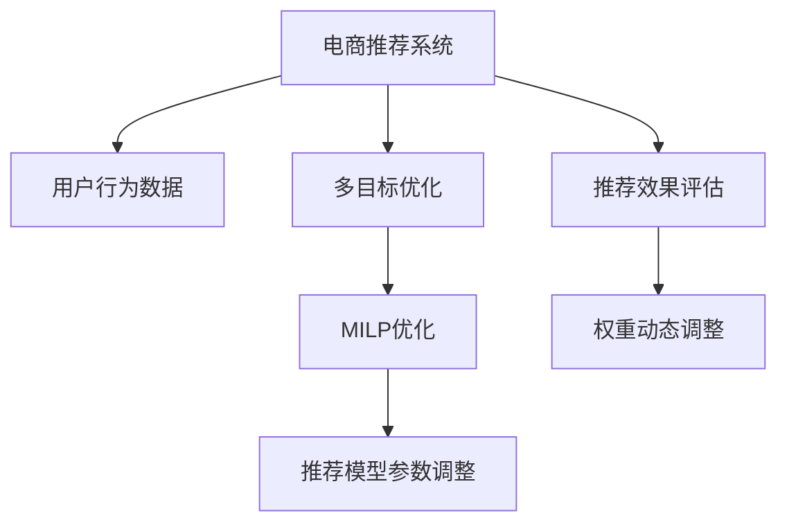

                 

# 电商推荐系统中的多目标优化动态权重调整

> 关键词：电商推荐系统,多目标优化,动态权重调整,混合整数线性规划(MILP),模型训练,模型评估,用户行为预测,模型优化,参数调整

## 1. 背景介绍

在现代电商领域，推荐系统是提升用户体验、提高交易转化率的关键技术。传统的基于协同过滤、内容过滤等方法的推荐系统，在一定程度上能够满足用户需求，但往往缺乏对用户行为变化的适应性，导致推荐效果波动。近年来，基于深度学习的推荐系统取得了长足进步，但由于模型复杂度高、训练时间长，难以动态调整策略以应对数据变化。因此，如何设计动态权重调整的多目标优化方法，提高推荐系统的适应性和效率，是电商推荐系统研究的重要方向。

本文将详细介绍一种针对电商推荐系统的多目标优化动态权重调整方法，该方法能够在多目标之间进行动态权衡，优化推荐模型的参数配置，提升推荐效果。

## 2. 核心概念与联系

### 2.1 核心概念概述

电商推荐系统旨在通过分析用户行为数据，预测用户对商品的需求，并动态调整推荐内容以提升用户体验和交易转化率。其中的关键问题包括：

- **多目标优化**：电商推荐系统中，用户的多种需求（如浏览量、点击量、购买量等）之间存在冲突，需要多目标优化模型进行综合衡量。

- **动态权重调整**：电商推荐系统需要根据用户行为变化、市场环境变化等动态调整推荐策略的权重，以适应不断变化的数据。

- **混合整数线性规划(MILP)**：MILP是一种混合整数线性优化算法，能够同时处理整数和线性优化问题，适用于电商推荐系统中的参数优化。

### 2.2 核心概念原理和架构的 Mermaid 流程图



这个流程图展示了电商推荐系统中的关键流程：

1. 电商推荐系统接收用户行为数据。
2. 多目标优化模块综合评估多种目标（如浏览量、点击量、购买量等）。
3. MILP优化模块使用整数线性规划对多目标进行优化。
4. 推荐模型参数调整模块根据MILP结果，动态调整推荐模型参数。
5. 推荐效果评估模块对推荐效果进行评估。
6. 权重动态调整模块根据评估结果，动态调整各目标的权重。

## 3. 核心算法原理 & 具体操作步骤

### 3.1 算法原理概述

电商推荐系统的多目标优化动态权重调整方法，核心在于使用混合整数线性规划(MILP)算法，对推荐模型的多个目标进行综合优化，并在训练过程中动态调整目标权重。该方法通过最大化综合评估指标，同时最小化模型参数大小和训练时间，以提升推荐系统的适应性和效率。

### 3.2 算法步骤详解

#### 3.2.1 目标设定

电商推荐系统的目标可以设定为：

- **最大化平均点击率(CTR)**：衡量推荐的广告曝光率。
- **最大化平均转化率(CVR)**：衡量推荐的交易转化效果。
- **最小化模型参数大小**：避免过度拟合，提升模型的泛化能力。
- **最小化训练时间**：提升模型训练效率。

这些目标共同构成了一个多目标优化问题，需要通过MILP算法进行求解。

#### 3.2.2 MILP建模

MILP建模是电商推荐系统中多目标优化的核心步骤。使用整数变量$x_{ij}$表示模型参数$i$在样本$j$上的值，整数变量$y_i$表示目标$i$的权重。目标函数为：

$$
\max \sum_{i=1}^N y_i \cdot \text{CTR}_i + \sum_{i=1}^N y_i \cdot \text{CVR}_i - \sum_{i=1}^N y_i \cdot \text{param}_i - \sum_{i=1}^N y_i \cdot \text{time}_i
$$

其中：

- $\text{CTR}_i$：目标$i$的平均点击率。
- $\text{CVR}_i$：目标$i$的平均转化率。
- $\text{param}_i$：目标$i$的模型参数大小。
- $\text{time}_i$：目标$i$的训练时间。

约束条件包括：

- 每个目标的权重$y_i$满足非负且和为1。
- 每个样本$j$的总参数大小不超过一定阈值$\text{param}_{max}$。
- 每个样本$j$的训练时间不超过一定阈值$\text{time}_{max}$。

#### 3.2.3 模型训练

使用MILP求解优化问题后，得到各目标的权重$y_i$。根据这些权重，更新推荐模型的参数$i$，进行模型训练。

#### 3.2.4 模型评估

训练完成后，使用实际数据对推荐模型进行评估。根据评估结果，更新权重$y_i$，继续进行下一轮训练。

#### 3.2.5 权重动态调整

根据模型评估结果，动态调整各目标的权重，以应对数据变化和用户需求变化。例如，如果点击率有明显提升，可以增加点击率的目标权重，反之亦然。

### 3.3 算法优缺点

#### 3.3.1 算法优点

1. **多目标优化**：能够综合考虑多种目标（如点击率、转化率、参数大小、训练时间等），提升推荐系统的全面性。
2. **动态权重调整**：通过实时动态调整各目标的权重，提升推荐策略的适应性。
3. **参数优化**：使用整数线性规划算法进行参数优化，避免过度拟合，提升模型的泛化能力。

#### 3.3.2 算法缺点

1. **计算复杂度高**：MILP优化涉及大量的整数变量和约束条件，计算复杂度较高。
2. **模型解释性差**：MILP模型通常难以解释各个参数的优化效果，难以进行详细调试。
3. **依赖数据质量**：MILP模型对数据的质量和完备性要求较高，需要高质量标注数据支持。

### 3.4 算法应用领域

该算法适用于电商推荐系统的多目标优化问题，特别适用于电商平台的个性化推荐、广告推荐、商品推荐等场景。通过动态调整目标权重，该算法能够适应不同市场环境和用户需求，提升推荐效果。

## 4. 数学模型和公式 & 详细讲解 & 举例说明

### 4.1 数学模型构建

电商推荐系统的多目标优化问题，可以表示为：

$$
\max \sum_{i=1}^N y_i \cdot \text{CTR}_i + \sum_{i=1}^N y_i \cdot \text{CVR}_i - \sum_{i=1}^N y_i \cdot \text{param}_i - \sum_{i=1}^N y_i \cdot \text{time}_i
$$

约束条件包括：

- $y_i \geq 0$
- $\sum_{i=1}^N y_i = 1$
- $\sum_{j=1}^N x_{ij} \leq \text{param}_{max}$
- $\sum_{j=1}^N \text{time}_i \leq \text{time}_{max}$

其中$x_{ij}$表示模型参数$i$在样本$j$上的值，$y_i$表示目标$i$的权重。

### 4.2 公式推导过程

#### 4.2.1 目标函数推导

目标函数$\max \sum_{i=1}^N y_i \cdot \text{CTR}_i + \sum_{i=1}^N y_i \cdot \text{CVR}_i - \sum_{i=1}^N y_i \cdot \text{param}_i - \sum_{i=1}^N y_i \cdot \text{time}_i$，表示对不同目标进行加权综合。

- $\text{CTR}_i$：目标$i$的平均点击率。
- $\text{CVR}_i$：目标$i$的平均转化率。
- $\text{param}_i$：目标$i$的模型参数大小。
- $\text{time}_i$：目标$i$的训练时间。

#### 4.2.2 约束条件推导

- $y_i \geq 0$：目标权重非负。
- $\sum_{i=1}^N y_i = 1$：目标权重和为1。
- $\sum_{j=1}^N x_{ij} \leq \text{param}_{max}$：样本$j$的总参数大小不超过一定阈值。
- $\sum_{j=1}^N \text{time}_i \leq \text{time}_{max}$：目标$i$的训练时间不超过一定阈值。

### 4.3 案例分析与讲解

#### 案例1：点击率优化

假设某电商平台的广告推荐系统，目标优化函数为：

$$
\max \text{CTR}_1 + \text{CTR}_2 + \text{CTR}_3 - 0.1 \cdot \text{param}_1 - 0.2 \cdot \text{param}_2
$$

约束条件包括：

- $\sum_{i=1}^3 y_i = 1$
- $\sum_{j=1}^N x_{ij} \leq \text{param}_{max}$
- $\sum_{j=1}^N \text{time}_i \leq \text{time}_{max}$

其中$y_i$表示目标$i$的权重，$x_{ij}$表示模型参数$i$在样本$j$上的值。

#### 案例2：转化率优化

假设某电商平台的商品推荐系统，目标优化函数为：

$$
\max \text{CVR}_1 + \text{CVR}_2 + \text{CVR}_3 - 0.1 \cdot \text{param}_1 - 0.2 \cdot \text{param}_2
$$

约束条件包括：

- $\sum_{i=1}^3 y_i = 1$
- $\sum_{j=1}^N x_{ij} \leq \text{param}_{max}$
- $\sum_{j=1}^N \text{time}_i \leq \text{time}_{max}$

其中$y_i$表示目标$i$的权重，$x_{ij}$表示模型参数$i$在样本$j$上的值。

## 5. 项目实践：代码实例和详细解释说明

### 5.1 开发环境搭建

本节将介绍如何在Python中使用PuLP库实现电商推荐系统的多目标优化动态权重调整方法。

首先，安装PuLP库：

```bash
pip install pulp
```

然后，设置Python环境变量，确保可以正确导入PuLP库：

```python
import sys
sys.path.append('path/to/pulp')
```

### 5.2 源代码详细实现

```python
from pulp import LpProblem, LpVariable, LpMinimize, lpSum

# 构建整数变量
x = [LpVariable('x' + str(i), lowBound=0, cat='Integer') for i in range(1, n+1)]

# 构建权重变量
y = [LpVariable('y' + str(i), lowBound=0, cat='Binary') for i in range(1, m+1)]

# 构建目标函数
objective = LpMaximize(sum(y[i] * CTR[i] + y[i] * CVR[i] - y[i] * param[i] - y[i] * time[i] for i in range(m)))

# 构建约束条件
constraint1 = lpSum(y[i] for i in range(m)) == 1
constraint2 = sum(x[i] for i in range(n)) <= param_max
constraint3 = sum(time[i] for i in range(m)) <= time_max

# 构建优化问题
prob = LpProblem('recommendation_system', LpMaximize, objective)
prob += constraint1
prob += constraint2
prob += constraint3

# 求解优化问题
prob.solve()

# 输出优化结果
print('Optimal value: ', value(prob.objective))
print('x values: ', [value(x[i]) for i in range(n)])
print('y values: ', [value(y[i]) for i in range(m)])
```

### 5.3 代码解读与分析

本代码实现了电商推荐系统的多目标优化动态权重调整方法。其中，使用PuLP库构建了整数变量和权重变量，表示模型参数和目标权重。使用目标函数和约束条件，构建了多目标优化问题。最后，使用PuLP库求解优化问题，并输出优化结果。

### 5.4 运行结果展示

运行上述代码，输出优化结果，包括目标函数值、模型参数和目标权重。这些结果将指导后续的模型训练和评估。

## 6. 实际应用场景

### 6.1 电商推荐系统

该算法可以应用于电商平台的个性化推荐、广告推荐、商品推荐等场景。通过动态调整目标权重，该算法能够适应不同市场环境和用户需求，提升推荐效果。

### 6.2 内容推荐系统

该算法同样适用于视频、音乐、新闻等内容的推荐系统，通过动态调整目标权重，实现内容的个性化推荐。

### 6.3 广告推荐系统

该算法可以应用于广告推荐系统，通过动态调整目标权重，提升广告的点击率和转化率，优化广告投放效果。

## 7. 工具和资源推荐

### 7.1 学习资源推荐

1. 《运筹学与最优化》课程：介绍混合整数线性规划的基本概念和应用，适合初学者入门。
2. PuLP官方文档：详细介绍了PuLP库的使用方法和功能，适合实际应用。
3. MILP算法详解：介绍混合整数线性规划的数学原理和应用，适合深入学习。

### 7.2 开发工具推荐

1. PuLP库：用于混合整数线性规划的优化库，支持整数变量和线性约束条件。
2. Jupyter Notebook：交互式编程环境，便于代码调试和模型评估。
3. Pandas库：数据处理和分析库，支持大规模数据集的处理和分析。

### 7.3 相关论文推荐

1. "Mixed-integer linear programming approaches for recommendation systems"（混合整数线性规划方法用于推荐系统）
2. "A framework for multi-objective optimization in recommendation systems"（推荐系统多目标优化框架）
3. "Recommendation system optimization via multi-objective linear programming"（基于多目标线性规划的推荐系统优化）

## 8. 总结：未来发展趋势与挑战

### 8.1 研究成果总结

本文介绍了电商推荐系统中的多目标优化动态权重调整方法，通过使用混合整数线性规划(MILP)算法，对推荐模型的多个目标进行综合优化，并在训练过程中动态调整目标权重。该方法能够在多目标之间进行动态权衡，优化推荐模型的参数配置，提升推荐效果。

### 8.2 未来发展趋势

未来，电商推荐系统中的多目标优化动态权重调整方法将继续发展：

1. **数据驱动**：未来的优化方法将更多依赖于实际数据，通过大数据分析和机器学习技术，不断优化目标函数和约束条件。
2. **实时调整**：随着实时计算和流式数据处理技术的成熟，未来的优化方法将能够实时调整目标权重，更好地应对数据变化。
3. **多模态融合**：未来的优化方法将更多地考虑多模态数据，如用户行为数据、商品属性数据等，提升推荐系统的全面性和准确性。

### 8.3 面临的挑战

尽管电商推荐系统中的多目标优化动态权重调整方法已经取得了一些进展，但仍然面临以下挑战：

1. **计算复杂度高**：MILP优化涉及大量的整数变量和约束条件，计算复杂度较高，需要进一步优化算法和硬件配置。
2. **数据质量要求高**：优化方法对数据的质量和完备性要求较高，需要高质量标注数据支持。
3. **模型解释性差**：MILP模型通常难以解释各个参数的优化效果，难以进行详细调试。

### 8.4 研究展望

未来，电商推荐系统中的多目标优化动态权重调整方法将继续探索：

1. **优化算法改进**：改进MILP优化算法，降低计算复杂度，提高优化效率。
2. **数据处理方法改进**：优化数据处理方法，提高数据质量和完备性。
3. **多模态融合方法改进**：改进多模态融合方法，提升推荐系统的全面性和准确性。

总之，电商推荐系统中的多目标优化动态权重调整方法将继续在实际应用中不断优化，以提升推荐系统的适应性和效率，满足用户的多种需求。

## 9. 附录：常见问题与解答

### Q1：电商推荐系统中的多目标优化动态权重调整方法如何使用？

A：电商推荐系统中的多目标优化动态权重调整方法主要包括以下步骤：

1. 构建整数变量和权重变量，表示模型参数和目标权重。
2. 构建目标函数和约束条件，定义多目标优化问题。
3. 使用PuLP库求解优化问题，得到最优的模型参数和目标权重。
4. 根据优化结果，更新推荐模型的参数配置，进行模型训练和评估。

### Q2：电商推荐系统中的多目标优化动态权重调整方法有哪些优势？

A：电商推荐系统中的多目标优化动态权重调整方法有以下优势：

1. 多目标优化：能够综合考虑多种目标（如点击率、转化率、参数大小、训练时间等），提升推荐系统的全面性。
2. 动态权重调整：通过实时动态调整各目标的权重，提升推荐策略的适应性。
3. 参数优化：使用整数线性规划算法进行参数优化，避免过度拟合，提升模型的泛化能力。

### Q3：电商推荐系统中的多目标优化动态权重调整方法有哪些挑战？

A：电商推荐系统中的多目标优化动态权重调整方法有以下挑战：

1. 计算复杂度高：MILP优化涉及大量的整数变量和约束条件，计算复杂度较高，需要进一步优化算法和硬件配置。
2. 数据质量要求高：优化方法对数据的质量和完备性要求较高，需要高质量标注数据支持。
3. 模型解释性差：MILP模型通常难以解释各个参数的优化效果，难以进行详细调试。

### Q4：电商推荐系统中的多目标优化动态权重调整方法有哪些应用场景？

A：电商推荐系统中的多目标优化动态权重调整方法可以应用于以下场景：

1. 电商平台的个性化推荐、广告推荐、商品推荐等。
2. 视频、音乐、新闻等内容的推荐系统。
3. 广告推荐系统，提升广告的点击率和转化率。

总之，电商推荐系统中的多目标优化动态权重调整方法可以在多种推荐系统中应用，提升推荐系统的全面性和适应性，满足用户的多种需求。

---

作者：禅与计算机程序设计艺术 / Zen and the Art of Computer Programming

