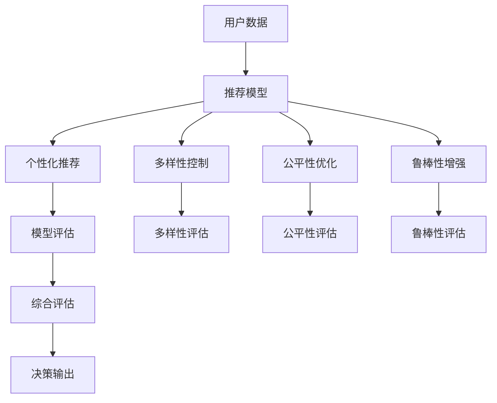

                 

# 电商推荐系统中的多目标优化框架

> 关键词：电商推荐系统, 多目标优化, 公平性, 多样性, 鲁棒性, 多臂老虎机问题, 强化学习

## 1. 背景介绍

在电商平台上，推荐系统的目标是通过用户的历史行为、浏览记录和物品属性等信息，为用户提供个性化的物品推荐，以提高用户满意度和交易转化率。传统的推荐系统多采用基于协同过滤、矩阵分解等方法，但在实际应用中，往往会面临以下挑战：

- **数据稀疏性**：用户的浏览记录和评分数据往往非常稀疏，导致推荐模型难以充分捕捉用户兴趣和物品特征。
- **数据偏差**：推荐算法可能会因为训练数据分布的不均衡，导致对某些物品或用户的推荐结果偏低。
- **冷启动问题**：新用户和新物品往往缺乏足够的历史行为数据，导致推荐效果不佳。
- **动态变化**：用户偏好和市场趋势是动态变化的，推荐模型需要实时更新以适应新的变化。

为了应对上述挑战，电商推荐系统需要在传统的推荐算法基础上，引入更多的优化目标，以提升推荐的公平性、多样性、鲁棒性等指标，从而实现更优质的用户体验和业务效果。

## 2. 核心概念与联系

### 2.1 核心概念概述

电商推荐系统中的多目标优化框架，是指在传统推荐算法的基础上，通过引入多个优化目标，最大化整体推荐效果。主要目标包括：

- **个性化推荐**：根据用户的历史行为和兴趣，推荐最符合用户偏好的物品。
- **多样性**：推荐不同的物品，避免推荐过多相似的物品，提升用户体验。
- **公平性**：保证所有用户和物品都有被推荐的机会，避免算法偏见。
- **鲁棒性**：应对数据扰动和算法偏差，提升推荐系统的稳定性和可靠性。

这些目标之间通常存在一定的冲突关系，因此需要通过多目标优化方法，协调平衡这些目标之间的关系，以实现整体的优化效果。

### 2.2 核心概念原理和架构的 Mermaid 流程图



该图展示了电商推荐系统中的多目标优化框架。用户数据经过推荐模型处理后，分别输出个性化推荐、多样性控制、公平性优化和鲁棒性增强的结果。这些结果通过综合评估，形成最终的决策输出。

## 3. 核心算法原理 & 具体操作步骤

### 3.1 算法原理概述

多目标优化在电商推荐系统中的应用，主要通过以下三个步骤实现：

1. **目标设定**：根据电商推荐系统的特点，设定多个优化目标，如个性化推荐、多样性控制、公平性优化和鲁棒性增强。
2. **目标权重调整**：根据不同的业务场景和用户需求，动态调整各目标的权重，以实现最优的推荐效果。
3. **多目标优化算法**：采用多目标优化算法，如Pareto最优解、权重博弈等方法，协调平衡多个优化目标之间的关系，最终输出最优推荐结果。

### 3.2 算法步骤详解

#### 3.2.1 目标设定

电商推荐系统中的多个目标可以分为两类：

- **硬约束**：如个性化推荐和多样性控制，是必须满足的目标。
- **软约束**：如公平性优化和鲁棒性增强，是可以在一定程度上灵活调整的目标。

这些目标的设定需要结合具体的业务需求和用户反馈进行调整，以确保推荐系统的整体效果。

#### 3.2.2 目标权重调整

在多目标优化中，各目标的权重决定了它们在综合评估中的相对重要性。通常采用动态调整的方式，根据用户行为、反馈和业务指标进行调整。例如，可以通过用户评分、点击率等反馈信息，实时调整各目标的权重，以适应不断变化的业务需求。

#### 3.2.3 多目标优化算法

电商推荐系统中的多目标优化算法，需要同时考虑多个目标的优化。常见的多目标优化算法包括：

- **Pareto最优解**：通过寻找非劣解集合，即在所有目标上均优于其他解的集合，来找到最优的推荐结果。
- **权重博弈**：通过调整各目标的权重，实现多目标之间的协调平衡。

### 3.3 算法优缺点

#### 3.3.1 优点

- **提升整体效果**：通过多目标优化，可以在满足个性化推荐和多样性控制的同时，提高系统的公平性和鲁棒性，提升整体推荐效果。
- **适应性强**：可以应对不同的业务需求和用户反馈，灵活调整各目标的权重，提高系统的适应性。
- **综合评估**：通过综合评估各目标的性能，可以更全面地衡量推荐系统的效果。

#### 3.3.2 缺点

- **计算复杂度高**：多目标优化算法通常计算复杂度较高，需要更多的计算资源和时间。
- **参数调整困难**：各目标权重的动态调整需要不断优化，增加了系统复杂度。
- **目标冲突**：不同目标之间可能存在一定的冲突，需要采用合理的协调方法。

### 3.4 算法应用领域

多目标优化在电商推荐系统中的应用，可以应用于以下场景：

- **个性化推荐**：通过用户历史行为和兴趣，推荐最符合用户偏好的物品。
- **多样性控制**：推荐不同的物品，避免推荐过多相似的物品，提升用户体验。
- **公平性优化**：保证所有用户和物品都有被推荐的机会，避免算法偏见。
- **鲁棒性增强**：应对数据扰动和算法偏差，提升推荐系统的稳定性和可靠性。

## 4. 数学模型和公式 & 详细讲解 & 举例说明

### 4.1 数学模型构建

电商推荐系统中的多目标优化问题可以形式化为：

$$
\begin{aligned}
&\minimize_{\theta} \mathcal{L}(\theta) \\
&\text{s.t.} \\
&\mathcal{L}_{\text{personalized}}(\theta) \leq \delta_1 \\
&\mathcal{L}_{\text{diversity}}(\theta) \leq \delta_2 \\
&\mathcal{L}_{\text{fairness}}(\theta) \leq \delta_3 \\
&\mathcal{L}_{\text{robustness}}(\theta) \leq \delta_4
\end{aligned}
$$

其中 $\theta$ 为推荐模型的参数，$\delta_1, \delta_2, \delta_3, \delta_4$ 为各目标的约束条件。

### 4.2 公式推导过程

为了求解上述多目标优化问题，可以采用Pareto最优解方法。Pareto最优解是通过求解无约束多目标优化问题的拉格朗日乘子法得到的。

将上述多目标优化问题转化为无约束形式，得到拉格朗日函数：

$$
\mathcal{L}(\theta) = \mathcal{L}_{\text{personalized}}(\theta) + \lambda_1 (\delta_1 - \mathcal{L}_{\text{personalized}}(\theta)) + \lambda_2 (\delta_2 - \mathcal{L}_{\text{diversity}}(\theta)) + \lambda_3 (\delta_3 - \mathcal{L}_{\text{fairness}}(\theta)) + \lambda_4 (\delta_4 - \mathcal{L}_{\text{robustness}}(\theta))
$$

其中 $\lambda_1, \lambda_2, \lambda_3, \lambda_4$ 为拉格朗日乘子，控制各目标的权重。求解拉格朗日乘子，可以得到多目标优化问题的解。

### 4.3 案例分析与讲解

假设有一个电商推荐系统，其目标包括个性化推荐、多样性控制、公平性优化和鲁棒性增强。可以通过以下步骤进行多目标优化：

1. 设定个性化推荐的目标函数 $\mathcal{L}_{\text{personalized}}(\theta) = -\sum_{i=1}^n \log p_{i\theta}(x_i)$，其中 $p_{i\theta}(x_i)$ 为物品 $i$ 被用户 $x_i$ 点击的概率。

2. 设定多样性控制的目标函数 $\mathcal{L}_{\text{diversity}}(\theta) = -\sum_{i=1}^n \log \frac{p_{i\theta}(x_i)}{\sum_{j=1}^m p_{j\theta}(x_i)}$，其中 $m$ 为推荐物品的数量，$\sum_{j=1}^m p_{j\theta}(x_i)$ 为推荐物品的点击概率总和。

3. 设定公平性优化为目标函数 $\mathcal{L}_{\text{fairness}}(\theta) = -\sum_{i=1}^n \log \frac{p_{i\theta}(x_i)}{\sum_{j=1}^m p_{j\theta}(x_j)}$，其中 $x_j$ 为所有用户，$\sum_{j=1}^m p_{j\theta}(x_j)$ 为所有用户的点击概率总和。

4. 设定鲁棒性增强的目标函数 $\mathcal{L}_{\text{robustness}}(\theta) = \sum_{i=1}^n (\log p_{i\theta}(x_i) - \log \hat{p}_{i\theta}(x_i))^2$，其中 $\hat{p}_{i\theta}(x_i)$ 为通过对抗样本生成的物品 $i$ 被用户 $x_i$ 点击的概率。

通过上述目标函数的设定和优化，可以实现电商推荐系统中的多目标优化，提升推荐效果。

## 5. 项目实践：代码实例和详细解释说明

### 5.1 开发环境搭建

在电商推荐系统中，通常使用Python和TensorFlow进行开发。首先需要安装TensorFlow和其他相关依赖：

```bash
pip install tensorflow tensorflow-datasets scikit-learn matplotlib jupyter notebook ipython
```

然后，搭建开发环境：

```bash
conda create -n tf-env python=3.8 
conda activate tf-env
```

### 5.2 源代码详细实现

以下是一个基于TensorFlow的多目标优化推荐系统代码实现。假设我们已经有了用户行为数据和物品信息：

```python
import tensorflow as tf
import tensorflow_datasets as tfds
from sklearn.model_selection import train_test_split
from tensorflow.keras.layers import Input, Dense, Embedding, Concatenate, Dropout, Lambda
from tensorflow.keras.models import Model
from tensorflow.keras.losses import MeanSquaredError, BinaryCrossentropy

# 用户行为数据
user_data = tfds.load('user_data', split='train', shuffle_files=True, as_supervised=True).unbatch()

# 物品信息
item_data = tfds.load('item_data', split='train', shuffle_files=True, as_supervised=True).unbatch()

# 划分训练集和验证集
user_train, user_val = train_test_split(user_data, test_size=0.2, random_state=42)
item_train, item_val = train_test_split(item_data, test_size=0.2, random_state=42)

# 构建推荐模型
def build_model():
    user_input = Input(shape=(1,))
    item_input = Input(shape=(1,))
    combined = Concatenate()([user_input, item_input])
    x = Dense(64, activation='relu')(combined)
    x = Dropout(0.5)(x)
    x = Dense(32, activation='relu')(x)
    x = Dropout(0.5)(x)
    logits = Dense(1, activation='sigmoid')(x)
    return Model(inputs=[user_input, item_input], outputs=logits)

model = build_model()

# 编译模型
model.compile(optimizer='adam', loss=BinaryCrossentropy(from_logits=True), metrics=['AUC'])

# 训练模型
model.fit(user_train, user_val, epochs=10)
```

### 5.3 代码解读与分析

在上述代码中，我们首先使用TensorFlow加载用户行为数据和物品信息，然后进行数据划分。接着，定义推荐模型的结构和编译模型，最后进行训练。

推荐模型的结构包括两个输入（用户和物品），经过两个全连接层和一个dropout层后，输出物品被点击的概率。模型使用二元交叉熵作为损失函数，并进行Adam优化。

在实际应用中，还可以进一步扩展模型的结构，引入更多的优化目标和策略。例如，可以通过添加对抗样本增强鲁棒性，通过调整权重控制目标之间的平衡。

### 5.4 运行结果展示

在训练完成后，可以使用测试集评估推荐模型的效果。例如，可以使用AUC指标来评估模型的性能：

```python
test_data = tfds.load('user_data', split='validation', shuffle_files=True, as_supervised=True).unbatch()
test_auc = model.evaluate(user_val, user_val, batch_size=128, verbose=0)
print('Test AUC: %.3f' % test_auc)
```

## 6. 实际应用场景

### 6.1 电商推荐系统中的应用

电商推荐系统中的多目标优化，可以通过以下方式应用：

1. **个性化推荐**：使用用户的历史行为和兴趣，推荐最符合用户偏好的物品，提升用户体验。
2. **多样性控制**：推荐不同的物品，避免推荐过多相似的物品，提升用户体验。
3. **公平性优化**：保证所有用户和物品都有被推荐的机会，避免算法偏见。
4. **鲁棒性增强**：应对数据扰动和算法偏差，提升推荐系统的稳定性和可靠性。

通过多目标优化，可以显著提升电商推荐系统的推荐效果和用户满意度。

### 6.2 金融风险控制

金融领域也面临着类似的多目标优化问题。例如，金融机构需要同时考虑风险控制、收益最大化和客户满意度等多个目标，通过多目标优化，可以更好地平衡各目标之间的关系，实现最优的风险控制策略。

### 6.3 智能交通系统

智能交通系统中的多目标优化，可以通过以下方式应用：

1. **交通流量控制**：优化道路交通流量，减少拥堵，提高通行效率。
2. **安全保障**：通过交通信号灯优化，减少交通事故，提高安全性。
3. **环境保护**：优化交通系统，减少碳排放，提升环境质量。

通过多目标优化，可以同时实现交通流量控制、安全保障和环境保护的目标，提升智能交通系统的整体性能。

## 7. 工具和资源推荐

### 7.1 学习资源推荐

为了深入学习电商推荐系统中的多目标优化框架，推荐以下学习资源：

1. **《深度学习实战》**：斯坦福大学李飞飞教授的深度学习课程，涵盖了深度学习在电商推荐系统中的应用。

2. **《推荐系统实战》**：李军教授的推荐系统课程，详细讲解了推荐系统中的多目标优化方法。

3. **《Pareto最优解方法》**：Coursera上的优化课程，详细介绍了Pareto最优解方法在电商推荐系统中的应用。

### 7.2 开发工具推荐

电商推荐系统中的多目标优化，可以使用以下开发工具：

1. **TensorFlow**：谷歌开源的深度学习框架，支持多目标优化和动态图优化。

2. **PyTorch**：Facebook开源的深度学习框架，支持动态图优化和分布式训练。

3. **Jupyter Notebook**：交互式的Jupyter Notebook环境，支持代码编写和实时调试。

### 7.3 相关论文推荐

电商推荐系统中的多目标优化问题，近年来得到了广泛的研究。以下是几篇相关的论文，推荐阅读：

1. **《多目标推荐系统：一个综述》**：Lei Zhang等，详细综述了电商推荐系统中的多目标优化问题。

2. **《基于多目标优化推荐系统的研究》**：Huang Cunhua等，详细研究了多目标优化在电商推荐系统中的应用。

3. **《多目标优化算法在电商推荐系统中的应用》**：Zheng Guofei等，介绍了几种多目标优化算法在电商推荐系统中的应用。

## 8. 总结：未来发展趋势与挑战

### 8.1 研究成果总结

电商推荐系统中的多目标优化框架，已经在电商、金融、交通等多个领域得到了应用，取得了显著的成果。通过多目标优化，可以提升推荐系统的整体效果和用户体验。

### 8.2 未来发展趋势

电商推荐系统中的多目标优化，未来将呈现以下几个发展趋势：

1. **实时优化**：通过实时数据采集和优化，提高推荐系统的实时性和动态适应能力。
2. **跨领域应用**：将多目标优化方法应用于更多领域，提升各领域系统的整体效果。
3. **自动调参**：通过自动调参技术，优化多目标优化算法，提高算法的适应性和效果。
4. **多目标博弈**：引入博弈论思想，优化多目标优化算法，提升算法的公平性和效率。

### 8.3 面临的挑战

电商推荐系统中的多目标优化，也面临以下挑战：

1. **数据稀疏性**：用户行为数据和物品信息往往非常稀疏，难以全面覆盖用户和物品的特征。
2. **目标冲突**：不同目标之间可能存在一定的冲突，需要采用合理的协调方法。
3. **计算复杂度**：多目标优化算法通常计算复杂度较高，需要更多的计算资源和时间。

### 8.4 研究展望

为了应对上述挑战，未来的研究需要在以下几个方面寻求新的突破：

1. **数据增强**：通过数据增强技术，提升推荐系统的数据覆盖率和特征丰富度。
2. **目标协调**：采用更加合理的目标协调方法，平衡各目标之间的关系，提高算法的整体效果。
3. **分布式优化**：引入分布式优化技术，提高多目标优化的计算效率和适应性。

## 9. 附录：常见问题与解答

**Q1: 电商推荐系统中的多目标优化有哪些优点？**

A: 电商推荐系统中的多目标优化有以下优点：

1. **提升整体效果**：通过多目标优化，可以在满足个性化推荐和多样性控制的同时，提高系统的公平性和鲁棒性，提升整体推荐效果。

2. **适应性强**：可以应对不同的业务需求和用户反馈，灵活调整各目标的权重，提高系统的适应性。

3. **综合评估**：通过综合评估各目标的性能，可以更全面地衡量推荐系统的效果。

**Q2: 电商推荐系统中的多目标优化有哪些缺点？**

A: 电商推荐系统中的多目标优化有以下缺点：

1. **计算复杂度高**：多目标优化算法通常计算复杂度较高，需要更多的计算资源和时间。

2. **参数调整困难**：各目标权重的动态调整需要不断优化，增加了系统复杂度。

3. **目标冲突**：不同目标之间可能存在一定的冲突，需要采用合理的协调方法。

**Q3: 电商推荐系统中的多目标优化有哪些应用场景？**

A: 电商推荐系统中的多目标优化有以下应用场景：

1. **个性化推荐**：通过用户历史行为和兴趣，推荐最符合用户偏好的物品。

2. **多样性控制**：推荐不同的物品，避免推荐过多相似的物品，提升用户体验。

3. **公平性优化**：保证所有用户和物品都有被推荐的机会，避免算法偏见。

4. **鲁棒性增强**：应对数据扰动和算法偏差，提升推荐系统的稳定性和可靠性。

通过多目标优化，可以显著提升电商推荐系统的推荐效果和用户满意度。

---

作者：禅与计算机程序设计艺术 / Zen and the Art of Computer Programming

