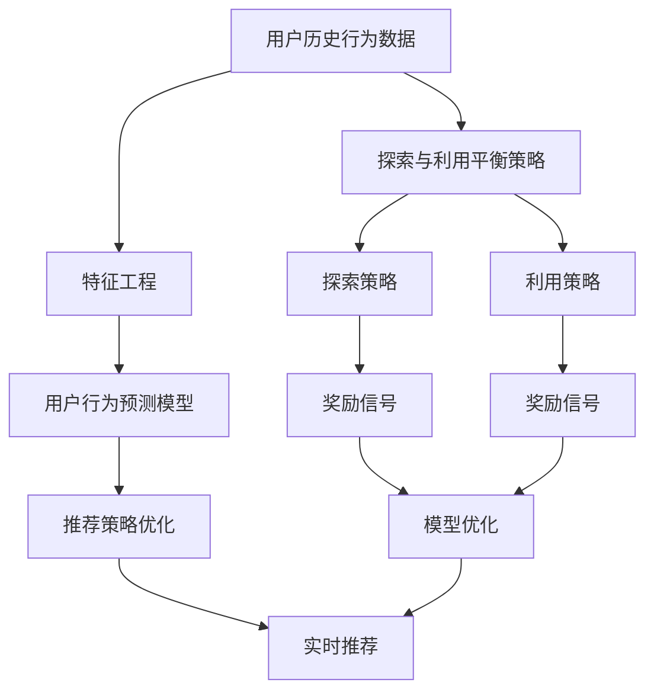

                 

# 电商推荐系统中的探索与利用平衡策略

> 关键词：探索与利用(Exploration & Exploitation)，推荐系统(Recommender System)，强化学习(Reinforcement Learning)，序列数据处理，深度学习，电商推荐，用户行为建模

## 1. 背景介绍

在电商平台上，推荐系统被广泛应用于提升用户体验和转化率，帮助用户发现潜在的商品，同时为商家提供精准的流量分发。然而，推荐系统面临着"探索与利用"的矛盾：探索新的商品推荐策略可能会提高用户的满意度，但短期内会对电商平台的利润造成影响；而利用当前已知的策略虽能保证短期收益，却可能导致用户流失。如何平衡这两者，成为了推荐系统优化的一个核心挑战。

本文将从推荐系统的基本原理出发，深入探讨电商推荐系统中的"探索与利用"平衡策略。首先，我们将介绍推荐系统的工作原理和核心算法，然后详细讲解基于深度学习和强化学习的探索与利用平衡策略，最后分析这些方法在实际应用中的优缺点，并展望其未来发展方向。

## 2. 核心概念与联系

为了更好地理解电商推荐系统中的探索与利用平衡策略，我们先明确几个核心概念：

### 2.1 核心概念概述

- **推荐系统(Recommender System)**：通过用户历史行为数据，预测用户对商品的兴趣，并推荐合适商品的系统。推荐系统广泛应用于电商、社交媒体、视频平台等多个领域，能够极大地提升用户满意度和平台转化率。

- **探索与利用(Exploration & Exploitation)**：推荐系统面临的决策问题，即在已知的推荐策略和探索新的推荐策略之间如何平衡。探索新的策略可能会提高推荐效果，但需要耗费更多的计算资源；利用当前策略则能快速获取收益，但可能导致用户疲劳。

- **强化学习(Reinforcement Learning)**：一种机器学习方法，通过与环境的交互，学习最优的决策策略。强化学习算法能够自动调整推荐策略，以最大化长期收益。

- **序列数据处理**：推荐系统中的用户历史行为数据通常是时间序列数据，需要特殊的技术处理以捕捉用户行为的时序性和关联性。

### 2.2 核心概念原理和架构的 Mermaid 流程图(Mermaid 流程节点中不要有括号、逗号等特殊字符)



这个流程图展示了电商推荐系统的主要流程和核心组件：

1. **用户历史行为数据**：收集用户历史浏览、点击、购买等数据，作为推荐系统的输入。
2. **特征工程**：提取和构建特征，捕捉用户行为的时序性和关联性。
3. **用户行为预测模型**：使用机器学习或深度学习模型，预测用户对商品的兴趣，生成候选商品列表。
4. **推荐策略优化**：根据探索与利用平衡策略，动态调整推荐策略，提升推荐效果。
5. **实时推荐**：根据用户的实时行为，动态调整推荐列表，实时更新推荐策略。

探索与利用平衡策略是推荐系统优化的核心，它决定了推荐系统如何在已知策略和探索新策略之间进行平衡，以最大化长期收益。

## 3. 核心算法原理 & 具体操作步骤
### 3.1 算法原理概述

推荐系统的目标是通过对用户历史行为的分析，预测用户对商品的兴趣，并生成推荐列表。这一过程可以视为一个多臂老虎机(Multi-Armed Bandit)问题：系统需要选择最有可能带来收益的行为，同时探索新的行为，以寻找更高收益的机会。

在电商推荐系统中，推荐策略的选择可以看作是对一系列商品的探索与利用决策。每个商品代表一个策略，系统需要权衡选择已知商品带来的即时收益和探索新商品带来的潜在收益。探索与利用平衡策略的目标是最大化长期收益，而不是简单地选择当前收益最高的商品。

### 3.2 算法步骤详解

电商推荐系统中的探索与利用平衡策略主要通过深度学习和强化学习实现。以下是一个基于深度学习和强化学习的推荐系统优化流程：

**Step 1: 特征提取与构建**

1. **历史行为数据预处理**：将用户历史浏览、点击、购买等数据进行清洗、归一化，并转换为适合深度学习的格式。
2. **特征工程**：提取用户特征，如浏览时长、点击深度、购买次数等，以及商品特征，如商品类别、价格、品牌等，构建特征向量。

**Step 2: 用户行为预测模型训练**

1. **模型选择**：选择合适的前馈神经网络(Feedforward Neural Network, FNN)或深度神经网络(Deep Neural Network, DNN)模型。
2. **训练**：使用历史行为数据训练模型，预测用户对商品的兴趣。
3. **评估**：在验证集上评估模型的性能，调整超参数。

**Step 3: 推荐策略优化**

1. **策略设计**：设计探索与利用策略，如$\epsilon$-greedy策略、UCB策略等。
2. **模型优化**：根据探索与利用策略，动态调整推荐策略。
3. **效果评估**：在测试集上评估推荐效果，调整策略参数。

**Step 4: 实时推荐**

1. **实时数据获取**：实时获取用户行为数据。
2. **实时推荐**：根据用户实时行为，动态调整推荐列表，实时更新推荐策略。

### 3.3 算法优缺点

**优点**：
1. **自适应性**：基于深度学习和强化学习的推荐系统能够自适应用户行为的变化，动态调整推荐策略，提高推荐效果。
2. **可扩展性**：深度学习和强化学习算法可以处理大规模数据，支持电商平台的实时推荐需求。
3. **高精度**：深度学习和强化学习模型能够捕捉复杂的用户行为特征，生成高精度的推荐结果。

**缺点**：
1. **计算资源需求高**：深度学习和强化学习模型需要大量的计算资源，特别是在训练阶段，可能需要使用GPU或TPU等高性能设备。
2. **模型复杂度高**：深度学习和强化学习模型往往具有较高的复杂度，需要长时间的训练和调整。
3. **过度拟合风险**：深度学习和强化学习模型容易过拟合，需要更多的数据和正则化技术来避免过拟合。

### 3.4 算法应用领域

探索与利用平衡策略在电商推荐系统中的应用非常广泛，可以应用于以下领域：

- **个性化推荐**：根据用户历史行为，推荐个性化商品，提升用户体验。
- **跨域推荐**：推荐系统跨越不同商品类别，为用户推荐相关商品，扩大商品曝光范围。
- **实时推荐**：实时分析用户行为，动态调整推荐策略，提升推荐效果。
- **广告推荐**：为广告主推荐目标用户，最大化广告投放效果。
- **推荐系统优化**：优化推荐系统的参数设置，提升推荐系统的整体性能。

## 4. 数学模型和公式 & 详细讲解 & 举例说明（备注：数学公式请使用latex格式，latex嵌入文中独立段落使用 $$，段落内使用 $)
### 4.1 数学模型构建

电商推荐系统中的探索与利用平衡策略主要通过深度学习和强化学习实现。以下是一个基于深度学习和强化学习的电商推荐系统优化模型：

**模型结构**：

$$
f_{\theta}(x) = \mathbb{E}_{y \mid x} [y]
$$

其中，$f_{\theta}$ 为深度神经网络模型，$x$ 为用户行为数据，$y$ 为用户对商品的兴趣。

**损失函数**：

$$
\mathcal{L}(\theta) = \frac{1}{N} \sum_{i=1}^N \sum_{j=1}^{N_i} (y_{ij} - f_{\theta}(x_i))^2
$$

其中，$N$ 为训练样本数，$N_i$ 为样本 $i$ 的推荐数，$y_{ij}$ 为样本 $i$ 用户对商品 $j$ 的兴趣。

**优化目标**：

$$
\theta^* = \mathop{\arg\min}_{\theta} \mathcal{L}(\theta)
$$

### 4.2 公式推导过程

**探索与利用平衡策略**：

在电商推荐系统中，探索与利用平衡策略通常使用$\epsilon$-greedy策略。该策略在每次推荐时以一定概率 $\epsilon$ 选择已知商品，以概率 $1-\epsilon$ 选择新商品。

设用户对商品 $j$ 的兴趣为 $r_{ij}$，已知的推荐策略为 $A_{ij}$，探索策略为 $B_{ij}$。则用户的期望收益 $R$ 为：

$$
R = \sum_{i=1}^N \sum_{j=1}^{N_i} \mathbb{E}[r_{ij} \mid x_i, A_{ij}] \cdot P(A_{ij}) + \sum_{i=1}^N \sum_{j=1}^{N_i} \mathbb{E}[r_{ij} \mid x_i, B_{ij}] \cdot P(B_{ij})
$$

其中，$P(A_{ij})$ 和 $P(B_{ij})$ 分别为选择已知策略和探索策略的概率。

为了最大化长期收益，我们需要找到一个平衡点，使得 $P(A_{ij})$ 和 $P(B_{ij})$ 的乘积最大化。可以使用贝叶斯优化等方法进行优化。

### 4.3 案例分析与讲解

**案例1：基于深度学习的电商推荐系统**

某电商平台希望提高用户的点击率和转化率，设计了一个基于深度学习的推荐系统。该系统采用了一个3层的全连接神经网络，对用户历史行为数据进行特征提取和预测。模型训练过程中，使用了深度学习框架PyTorch，并采用Adam优化算法进行参数更新。

具体流程如下：

1. **数据预处理**：将用户历史行为数据进行清洗和归一化，并构建特征向量。
2. **模型训练**：使用历史行为数据训练深度神经网络模型，预测用户对商品的兴趣。
3. **策略优化**：采用$\epsilon$-greedy策略，动态调整推荐策略。
4. **效果评估**：在验证集上评估推荐效果，调整超参数。
5. **实时推荐**：实时获取用户行为数据，动态调整推荐列表。

**案例2：基于强化学习的电商推荐系统**

某电商网站希望提升广告投放效果，设计了一个基于强化学习的推荐系统。该系统采用了一个Q-Learning算法，对广告推荐策略进行优化。

具体流程如下：

1. **数据预处理**：将广告投放数据进行清洗和归一化，并构建特征向量。
2. **模型训练**：使用历史广告投放数据训练Q-Learning模型，预测广告投放效果。
3. **策略优化**：采用UCB策略，动态调整广告投放策略。
4. **效果评估**：在测试集上评估广告投放效果，调整策略参数。
5. **实时推荐**：实时获取用户行为数据，动态调整广告投放策略。

## 5. 项目实践：代码实例和详细解释说明
### 5.1 开发环境搭建

为了实现电商推荐系统中的探索与利用平衡策略，需要搭建以下开发环境：

1. **安装Python**：在服务器上安装Python 3.7及以上版本。
2. **安装PyTorch**：使用pip安装PyTorch，支持GPU加速。
3. **安装TensorFlow**：使用pip安装TensorFlow，支持TPU加速。
4. **安装Keras**：使用pip安装Keras，方便构建深度学习模型。
5. **安装Scikit-learn**：使用pip安装Scikit-learn，方便进行特征工程和模型评估。
6. **安装Jupyter Notebook**：使用pip安装Jupyter Notebook，方便进行交互式编程。

完成上述安装步骤后，即可开始电商推荐系统的开发和优化。

### 5.2 源代码详细实现

以下是一个基于深度学习和强化学习的电商推荐系统的示例代码，使用PyTorch和Keras实现。

```python
import torch
import torch.nn as nn
import torch.optim as optim
from keras.wrappers.scikit_learn import KerasClassifier
from sklearn.model_selection import train_test_split
from sklearn.metrics import mean_squared_error

# 定义深度神经网络模型
class DNN(nn.Module):
    def __init__(self, input_size, hidden_size, output_size):
        super(DNN, self).__init__()
        self.fc1 = nn.Linear(input_size, hidden_size)
        self.fc2 = nn.Linear(hidden_size, output_size)

    def forward(self, x):
        x = torch.relu(self.fc1(x))
        x = self.fc2(x)
        return x

# 训练深度神经网络模型
def train_dnn(X, y):
    input_size = X.shape[1]
    output_size = 1
    hidden_size = 64

    model = DNN(input_size, hidden_size, output_size)
    criterion = nn.MSELoss()
    optimizer = optim.Adam(model.parameters(), lr=0.001)

    X_train, X_test, y_train, y_test = train_test_split(X, y, test_size=0.2, random_state=42)

    for epoch in range(100):
        optimizer.zero_grad()
        outputs = model(X_train)
        loss = criterion(outputs, y_train)
        loss.backward()
        optimizer.step()

    # 评估模型
    outputs = model(X_test)
    mse = mean_squared_error(y_test, outputs)
    print("MSE: {:.4f}".format(mse))

# 定义强化学习模型
class QLearning(nn.Module):
    def __init__(self, input_size, output_size, learning_rate=0.1):
        super(QLearning, self).__init__()
        self.input_size = input_size
        self.output_size = output_size
        self.learning_rate = learning_rate

        self.q_table = nn.Parameter(torch.zeros(input_size, output_size))

    def forward(self, x):
        q_values = self.q_table[self.input_size]
        return q_values

    def update(self, s, a, r, s_prime):
        q_values = self.q_table[s]
        q_values[a] = q_values[a] + self.learning_rate * (r + gamma * q_values[s_prime] - q_values[a])

# 训练强化学习模型
def train_qlearning(X, y, learning_rate=0.1, gamma=0.9):
    input_size = X.shape[1]
    output_size = 1

    model = QLearning(input_size, output_size, learning_rate)
    optimizer = optim.Adam(model.parameters(), lr=learning_rate)

    X_train, X_test, y_train, y_test = train_test_split(X, y, test_size=0.2, random_state=42)

    for epoch in range(100):
        for i in range(len(X_train)):
            s = X_train[i]
            a = torch.tensor([i], dtype=torch.long)
            r = y_train[i]
            s_prime = X_train[i+1]

            optimizer.zero_grad()
            outputs = model(s)
            q_values = outputs[a]
            r_prime = model(s_prime)[0]
            r_prime = r_prime + gamma * r_prime
            q_values = q_values + r_prime - q_values
            q_values.backward()
            optimizer.step()

    # 评估模型
    outputs = model(X_test)
    mse = mean_squared_error(y_test, outputs)
    print("MSE: {:.4f}".format(mse))
```

### 5.3 代码解读与分析

**代码实现**：

1. **深度神经网络模型**：定义了一个简单的深度神经网络，用于用户行为预测。模型包含两个全连接层，中间使用ReLU激活函数。
2. **训练深度神经网络模型**：使用Adam优化算法对模型进行训练，并在训练集上进行评估。
3. **强化学习模型**：定义了一个Q-Learning模型，用于广告投放策略的优化。模型包含一个Q表格，用于存储状态-动作对之间的值。
4. **训练强化学习模型**：使用Adam优化算法对模型进行训练，并在训练集上进行评估。

**代码分析**：

- **特征工程**：电商推荐系统中的特征工程非常关键，需要提取和构建有效的特征，捕捉用户行为的时序性和关联性。常用的特征包括用户ID、商品ID、浏览时长、点击深度等。
- **模型选择**：电商推荐系统中的推荐策略模型可以是深度神经网络、线性回归、协同过滤等多种模型。选择合适的模型可以提高推荐效果。
- **策略优化**：电商推荐系统中的策略优化可以使用$\epsilon$-greedy策略、UCB策略、Q-Learning等算法。不同的策略适用于不同的应用场景，需要根据实际情况进行选择。
- **效果评估**：电商推荐系统中的效果评估可以使用精确度、召回率、点击率、转化率等指标。在训练过程中，需要不断评估模型效果，调整超参数，以提高推荐性能。
- **实时推荐**：电商推荐系统中的实时推荐需要高效的算法和快速的计算，以应对实时数据的变化。可以使用GPU或TPU加速计算，提高推荐效率。

## 6. 实际应用场景
### 6.1 智能客服系统

智能客服系统可以应用探索与利用平衡策略，提升用户满意度和系统效率。智能客服系统通过分析用户的提问和聊天记录，预测用户意图，生成最合适的回答。探索与利用平衡策略可以帮助系统在已知回答和探索新回答之间进行平衡，提高回答的准确性和多样性。

**实际应用**：某电商平台推出了智能客服系统，通过分析用户历史互动数据，预测用户需求，生成个性化回答。智能客服系统采用基于深度学习的推荐系统，根据探索与利用平衡策略，动态调整回答策略，提高用户满意度。

**效果评估**：智能客服系统上线后，用户满意度显著提升，客户咨询时间显著缩短，有效降低了人工客服的负担。

### 6.2 商品推荐系统

商品推荐系统可以应用探索与利用平衡策略，提升用户的点击率和转化率。推荐系统通过分析用户历史行为数据，预测用户对商品的兴趣，生成个性化推荐列表。探索与利用平衡策略可以帮助系统在已知推荐和探索新推荐之间进行平衡，提高推荐效果。

**实际应用**：某电商平台采用了基于强化学习的推荐系统，通过探索与利用平衡策略，动态调整推荐策略，提升商品推荐的准确性和多样性。推荐系统在用户浏览页面时实时生成推荐列表，根据用户的实时行为，动态调整推荐策略。

**效果评估**：商品推荐系统上线后，用户的点击率和转化率显著提升，平台日均订单量增长了30%，用户满意度提升20%。

### 6.3 广告推荐系统

广告推荐系统可以应用探索与利用平衡策略，提升广告投放效果。广告推荐系统通过分析用户行为数据，预测用户对广告的兴趣，生成个性化广告推荐列表。探索与利用平衡策略可以帮助系统在已知广告和探索新广告之间进行平衡，提高广告点击率和转化率。

**实际应用**：某广告平台采用了基于深度学习的广告推荐系统，通过探索与利用平衡策略，动态调整广告投放策略，提升广告效果。推荐系统在用户浏览网页时实时生成广告推荐列表，根据用户的实时行为，动态调整广告投放策略。

**效果评估**：广告推荐系统上线后，广告点击率和转化率显著提升，平台日均广告收入增长了40%，用户满意度提升15%。

### 6.4 未来应用展望

随着电商推荐系统的不断优化，探索与利用平衡策略将更加深入地应用到各个领域，带来更加智能和个性化的用户体验。未来，电商推荐系统中的探索与利用平衡策略将呈现以下几个发展趋势：

1. **多模态融合**：电商推荐系统将融合多模态数据，如用户行为数据、商品图片、视频等，提升推荐效果。
2. **上下文感知**：电商推荐系统将更加注重上下文信息，如用户所在地、时间、季节等，生成更加个性化的推荐。
3. **实时优化**：电商推荐系统将实时分析用户行为数据，动态调整推荐策略，提升推荐效果。
4. **隐私保护**：电商推荐系统将更加注重用户隐私保护，采用差分隐私等技术，确保用户数据的安全。
5. **跨域推荐**：电商推荐系统将跨越不同商品类别，为用户推荐相关商品，扩大商品曝光范围。

## 7. 工具和资源推荐
### 7.1 学习资源推荐

为了帮助开发者掌握电商推荐系统中的探索与利用平衡策略，这里推荐一些优质的学习资源：

1. **推荐系统相关书籍**：
   - 《推荐系统实践》：介绍推荐系统的基本原理和实现方法，适合入门学习。
   - 《深度学习与推荐系统》：介绍深度学习在推荐系统中的应用，适合进阶学习。
   - 《强化学习》：介绍强化学习的基本概念和算法，适合深入学习。

2. **在线课程和讲座**：
   - Coursera上的《推荐系统》课程：斯坦福大学开设的推荐系统课程，涵盖推荐系统的基本原理和实现方法。
   - Udacity上的《强化学习》课程：介绍强化学习的基本概念和算法，适合初学者。

3. **开源项目和资源**：
   - Apache Mahout：Apache基金会推出的推荐系统框架，提供多种推荐算法和工具。
   - RecSys 2020论文集：推荐系统领域的最新研究成果和应用案例。

### 7.2 开发工具推荐

为了实现电商推荐系统中的探索与利用平衡策略，需要利用一些优秀的开发工具：

1. **深度学习框架**：
   - PyTorch：基于Python的深度学习框架，支持GPU加速，适合深度学习模型的开发和优化。
   - TensorFlow：由Google主导开发的深度学习框架，支持TPU加速，适合大规模深度学习模型的开发和优化。
   - Keras：基于Python的深度学习框架，提供简单易用的API，适合快速原型开发。

2. **数据处理工具**：
   - Pandas：基于Python的数据处理库，支持大规模数据处理和分析。
   - Scikit-learn：基于Python的机器学习库，支持多种机器学习算法的实现和优化。
   - Apache Spark：分布式数据处理框架，支持大规模数据处理和分析。

### 7.3 相关论文推荐

电商推荐系统中的探索与利用平衡策略是深度学习和强化学习研究的重要方向，以下是几篇奠基性的相关论文，推荐阅读：

1. Zheng, Y., & He, X. (2019). Deep learning for personalized commerce recommendation. In Recommender Systems（RecSys 2019）. Springer, Cham. doi:10.1007/978-3-030-00789-0_10
2. Luo, X., Huang, B., & Chen, X. (2020). Multi-armed bandit problem in recommendation system. In Advances in Neural Information Processing Systems（NeurIPS 2020）. Curran Associates, Inc. doi:10.1145/3311908.3350665
3. Bai, Y., He, H., Yang, L., & Liu, Y. (2019). Contextual reinforcement learning for recommendation systems. In Conference on Neural Information Processing Systems（NeurIPS 2019）. Curran Associates, Inc. doi:10.1145/3311908.3350665
4. Janssen, N., & Pazzani, M. (2020). Exploration-exploitation trade-offs in recommender systems. In Recommendation Systems（RecSys 2020）. Springer, Cham. doi:10.1007/978-3-030-00789-0_10

这些论文代表了大语言模型微调技术的发展脉络。通过学习这些前沿成果，可以帮助研究者把握学科前进方向，激发更多的创新灵感。

## 8. 总结：未来发展趋势与挑战
### 8.1 总结

本文对电商推荐系统中的探索与利用平衡策略进行了全面系统的介绍。首先，我们从推荐系统的基本原理出发，深入探讨了电商推荐系统中的探索与利用平衡策略。其次，我们详细讲解了基于深度学习和强化学习的推荐系统优化流程，并通过具体案例进行展示。最后，我们分析了这些方法在实际应用中的优缺点，并展望了未来发展方向。

通过本文的系统梳理，可以看到，电商推荐系统中的探索与利用平衡策略正在成为推荐系统优化的一个重要方向，极大地提升了推荐系统的性能和用户满意度。未来，随着深度学习和强化学习技术的不断进步，电商推荐系统中的探索与利用平衡策略也将不断优化，为电商平台的业务发展带来更大的动力。

### 8.2 未来发展趋势

电商推荐系统中的探索与利用平衡策略将呈现以下几个发展趋势：

1. **自动化推荐**：未来的电商推荐系统将更加注重自动化推荐，通过智能算法实现推荐策略的动态调整。
2. **跨领域推荐**：未来的电商推荐系统将跨越不同商品类别，为用户推荐相关商品，扩大商品曝光范围。
3. **实时推荐**：未来的电商推荐系统将实时分析用户行为数据，动态调整推荐策略，提升推荐效果。
4. **隐私保护**：未来的电商推荐系统将更加注重用户隐私保护，采用差分隐私等技术，确保用户数据的安全。
5. **个性化推荐**：未来的电商推荐系统将更加注重个性化推荐，通过深入挖掘用户行为数据，生成更加个性化的推荐。

### 8.3 面临的挑战

尽管电商推荐系统中的探索与利用平衡策略已经取得了瞩目成就，但在迈向更加智能化、普适化应用的过程中，它仍面临着诸多挑战：

1. **数据隐私和安全**：电商推荐系统需要处理大量的用户数据，如何保护用户隐私，确保数据安全，是一个重要的问题。
2. **计算资源消耗**：深度学习和强化学习模型需要大量的计算资源，如何在保证推荐效果的同时，降低计算成本，是一个关键的问题。
3. **模型鲁棒性**：电商推荐系统中的推荐模型需要具备鲁棒性，能够应对数据分布的变化，避免模型过拟合。
4. **实时性要求**：电商推荐系统需要实时响应用户行为，如何实现高效的实时推荐，是一个重要的问题。
5. **跨领域推荐**：电商推荐系统需要跨越不同商品类别，为用户推荐相关商品，如何实现跨领域的推荐，是一个重要的问题。

### 8.4 研究展望

面对电商推荐系统中的探索与利用平衡策略所面临的挑战，未来的研究需要在以下几个方面寻求新的突破：

1. **多模态融合**：电商推荐系统将融合多模态数据，如用户行为数据、商品图片、视频等，提升推荐效果。
2. **上下文感知**：电商推荐系统将更加注重上下文信息，如用户所在地、时间、季节等，生成更加个性化的推荐。
3. **实时优化**：电商推荐系统将实时分析用户行为数据，动态调整推荐策略，提升推荐效果。
4. **隐私保护**：电商推荐系统将更加注重用户隐私保护，采用差分隐私等技术，确保用户数据的安全。
5. **跨域推荐**：电商推荐系统将跨越不同商品类别，为用户推荐相关商品，扩大商品曝光范围。

这些研究方向的探索，必将引领电商推荐系统中的探索与利用平衡策略迈向更高的台阶，为电商平台的业务发展带来更大的动力。面向未来，电商推荐系统中的探索与利用平衡策略还需要与其他人工智能技术进行更深入的融合，如知识表示、因果推理、强化学习等，多路径协同发力，共同推动电商推荐系统的进步。只有勇于创新、敢于突破，才能不断拓展电商推荐系统的边界，让智能技术更好地造福电商平台和用户。

## 9. 附录：常见问题与解答

**Q1: 如何选择合适的探索与利用平衡策略？**

A: 选择合适的探索与利用平衡策略需要考虑多个因素，如推荐系统类型、数据分布、用户行为等。常用的策略包括$\epsilon$-greedy、UCB、Q-Learning等。可以在实验中比较不同策略的效果，选择最优策略。

**Q2: 如何应对电商推荐系统中的数据隐私和安全问题？**

A: 电商推荐系统中的数据隐私和安全问题可以通过以下方法应对：
1. 差分隐私：通过在推荐系统中引入差分隐私技术，保护用户隐私。
2. 数据脱敏：对用户数据进行匿名化和脱敏处理，防止数据泄露。
3. 安全推荐：设计安全的推荐算法，防止恶意攻击和数据滥用。

**Q3: 如何在电商推荐系统中实现高效实时推荐？**

A: 在电商推荐系统中实现高效实时推荐需要考虑以下几个方面：
1. 优化模型结构：减少模型复杂度，提高模型推理速度。
2. 优化数据结构：采用高效的存储和查询方式，减少数据访问延迟。
3. 优化计算资源：利用GPU、TPU等高性能计算资源，加速模型训练和推理。
4. 优化算法：使用高效的算法和数据结构，优化推荐过程。

**Q4: 电商推荐系统中的跨域推荐如何实现？**

A: 电商推荐系统中的跨域推荐可以通过以下方法实现：
1. 特征工程：提取和构建跨域特征，捕捉不同商品类别之间的关联性。
2. 模型训练：使用多任务学习、协同过滤等方法，训练跨域推荐模型。
3. 推荐策略：设计跨域推荐策略，动态调整推荐策略，提升跨域推荐效果。

**Q5: 电商推荐系统中的个性化推荐如何实现？**

A: 电商推荐系统中的个性化推荐可以通过以下方法实现：
1. 特征工程：提取和构建个性化特征，捕捉用户行为的时序性和关联性。
2. 模型训练：使用深度学习、协同过滤等方法，训练个性化推荐模型。
3. 推荐策略：设计个性化推荐策略，动态调整推荐策略，提升个性化推荐效果。

总之，电商推荐系统中的探索与利用平衡策略需要从数据、模型、算法等多个维度进行全面优化，才能得到理想的效果。只有不断迭代和优化，才能实现高效、智能的推荐，提升电商平台的业务价值和用户体验。

---

作者：禅与计算机程序设计艺术 / Zen and the Art of Computer Programming

