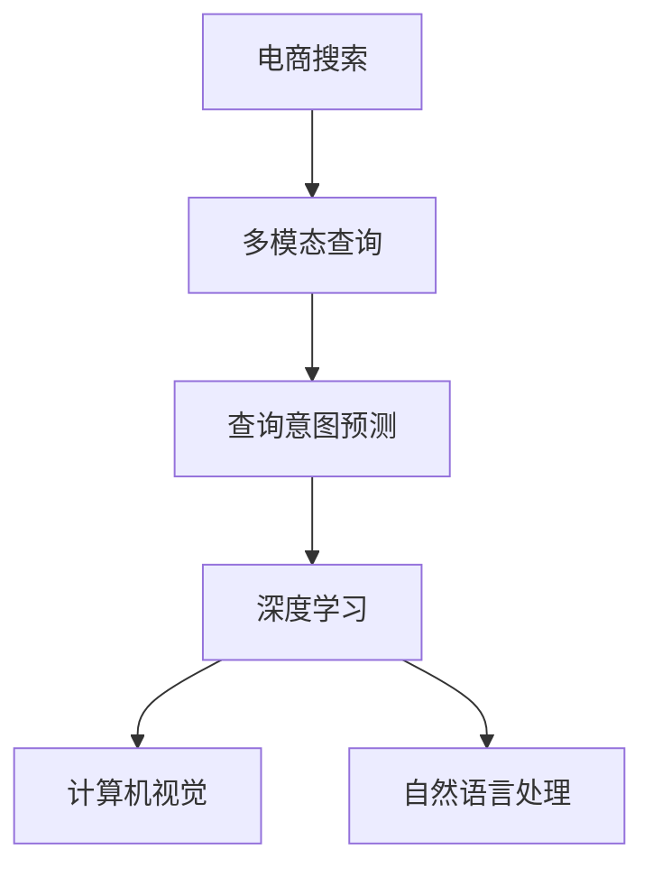

                 

# 电商搜索中的多模态查询意图预测

> 关键词：电商搜索,多模态查询,意图预测,深度学习,计算机视觉,自然语言处理

## 1. 背景介绍

随着电子商务的迅猛发展，用户对于搜索体验的期望也在不断提高。电商平台上的搜索场景往往包含丰富而复杂的用户输入，用户可能会使用文字、图片、视频等多种形式进行查询，并且这些输入往往带有一定的语义和意图。传统的搜索系统在面对这类多模态查询时，往往难以准确理解和匹配用户的真正需求。

为了提升搜索精度和用户体验，电商搜索中的查询意图预测成为研究的热点。意图预测的本质是通过多模态数据理解用户的查询意图，从而为后续的搜索结果排序和展示提供依据。近年来，基于深度学习的模型在多模态意图预测中取得了显著的效果，推动了电商搜索系统的不断进化。

本文将系统介绍多模态查询意图预测的技术原理、方法实现、实际应用和未来趋势，以期为电商搜索系统的优化提供有价值的参考。

## 2. 核心概念与联系

### 2.1 核心概念概述

为更好地理解电商搜索中的多模态查询意图预测，我们首先介绍几个关键概念：

- **电商搜索**：用户通过电商平台进行搜索，通过输入各种形式的数据，如文字、图片、视频等，获取相关商品信息的过程。电商搜索是电商平台的核心功能之一，直接影响用户购物体验和平台转化率。

- **多模态查询**：指用户通过多种形式（文字、图片、视频等）进行查询，获取商品信息。多模态查询可以提高搜索精度，降低用户搜索成本。

- **查询意图预测**：指通过多模态数据理解用户查询的真正意图，如购买、比较、询问等，以便进行精准的搜索结果排序和展示。查询意图预测是搜索系统的关键组件。

- **深度学习**：基于多层神经网络的模型，通过训练大量数据，可以从输入数据中提取复杂特征，实现多模态数据的融合。

- **计算机视觉**：通过图像处理和模式识别技术，从图片中提取语义信息。

- **自然语言处理**：通过文本处理和语义理解技术，从文本中提取语义信息。

这些核心概念之间的逻辑关系可以通过以下Mermaid流程图来展示：



这个流程图展示了大语言模型的核心概念及其之间的关系：

1. 电商搜索系统通过用户输入的多模态数据，进行查询意图预测。
2. 深度学习是实现多模态意图预测的核心技术手段。
3. 计算机视觉和自然语言处理分别从视觉和文本角度提取语义信息。

## 3. 核心算法原理 & 具体操作步骤

### 3.1 算法原理概述

电商搜索中的多模态查询意图预测，是通过融合用户输入的多模态数据，使用深度学习模型预测用户的查询意图。具体来说，我们将用户查询的不同模态信息输入到不同的模型中进行特征提取，然后将这些特征进行拼接，最终输入到一个高层次的意图分类器中，完成最终的意图预测。

以下是多模态查询意图预测的数学模型：

设输入的模态数据为 $x_1, x_2, ..., x_n$，其中 $x_i \in \mathcal{X}_i$ 为第 $i$ 种模态的空间。假设有多模态特征提取器 $\{f_i\}_{i=1}^n$，分别从每种模态中提取特征。设这些特征的拼接向量为 $f(x) = [f_1(x_1), f_2(x_2), ..., f_n(x_n)] \in \mathbb{R}^d$，$d$ 为拼接向量的维度。最终输入到意图分类器 $g$ 中，得到意图预测结果 $\hat{y}$。

### 3.2 算法步骤详解

基于深度学习的电商搜索多模态查询意图预测主要包括以下几个步骤：

**Step 1: 特征提取**

1. **图像特征提取**：
   - 使用卷积神经网络（CNN）对图片进行特征提取，得到图像特征向量 $f_{img}(x_{img}) \in \mathbb{R}^d_{img}$。
   - 使用 ResNet、Inception 等常见网络架构提取图像特征。

2. **文本特征提取**：
   - 使用Transformer网络对文本进行特征提取，得到文本特征向量 $f_{text}(x_{text}) \in \mathbb{R}^d_{text}$。
   - 使用BERT、RoBERTa等预训练模型作为文本特征提取器。

3. **视频特征提取**：
   - 将视频帧提取为图像序列，对每帧图像进行特征提取。
   - 使用LSTM、GRU等循环神经网络对图像序列进行特征提取，得到视频特征向量 $f_{vid}(x_{vid}) \in \mathbb{R}^d_{vid}$。

**Step 2: 特征融合**

将不同模态的特征向量进行拼接，得到高层次特征向量 $f(x) = [f_{img}(x_{img}), f_{text}(x_{text}), f_{vid}(x_{vid})]$。

**Step 3: 意图分类**

使用意图分类器 $g$ 对拼接特征进行分类，得到最终的意图预测 $\hat{y}$。

**Step 4: 模型训练与评估**

1. 使用标注数据集进行模型训练，最小化分类损失。
2. 使用验证集进行模型评估，选择最优模型。
3. 在测试集上进行最终评估，验证模型的泛化性能。

### 3.3 算法优缺点

多模态查询意图预测具有以下优点：
1. 提升了搜索精度：通过融合多模态数据，可以更全面地理解用户的查询意图。
2. 增强了用户体验：通过精准的意图预测，可以提供个性化的搜索结果，提升用户满意度。
3. 适应性强：可以灵活应对不同类型的查询输入。

同时，该方法也存在一些局限性：
1. 数据获取难度大：需要收集大量的多模态标注数据，获取成本较高。
2. 模型复杂度：多模态数据融合过程复杂，模型训练和推理效率较低。
3. 鲁棒性不足：对于输入噪声和异常数据，模型的鲁棒性有待提高。

尽管如此，基于深度学习的电商搜索多模态查询意图预测方法在实际应用中已经取得了显著效果，未来有更多研究和应用空间。

### 3.4 算法应用领域

多模态查询意图预测在电商搜索中的应用场景包括：

- 文字搜索：用户输入查询关键词，模型根据语义理解生成意图预测。
- 图片搜索：用户上传商品图片，模型从图片中提取特征，生成意图预测。
- 视频搜索：用户上传商品视频，模型从视频中提取特征，生成意图预测。
- 语音搜索：用户通过语音输入查询，模型进行语音识别并提取特征，生成意图预测。

除了电商搜索，多模态查询意图预测在其他领域也有广泛应用，如智能客服、智能推荐、智能家居等，为不同场景下的多模态输入提供了强大的理解能力。

## 4. 数学模型和公式 & 详细讲解 & 举例说明

### 4.1 数学模型构建

多模态查询意图预测的数学模型可以表示为：

$$
\hat{y} = g(f(x))
$$

其中 $f(x)$ 为拼接后的特征向量，$g$ 为意图分类器，可以是单层感知器、决策树、神经网络等。

### 4.2 公式推导过程

以神经网络模型为例，其公式推导过程如下：

**Step 1: 图像特征提取**

设图片输入为 $x_{img} \in \mathbb{R}^{3 \times H \times W}$，使用卷积神经网络提取特征：

$$
f_{img}(x_{img}) = \phi_{CNN}(x_{img})
$$

其中 $\phi_{CNN}$ 为卷积神经网络模型。

**Step 2: 文本特征提取**

设文本输入为 $x_{text} \in \mathbb{R}^{L}$，使用Transformer模型提取特征：

$$
f_{text}(x_{text}) = \phi_{Transformer}(x_{text})
$$

其中 $\phi_{Transformer}$ 为Transformer模型。

**Step 3: 特征拼接**

将图像和文本特征拼接，得到高层次特征向量：

$$
f(x) = [f_{img}(x_{img}), f_{text}(x_{text})]
$$

**Step 4: 意图分类**

使用意图分类器 $g$ 对拼接特征进行分类，得到意图预测：

$$
\hat{y} = g(f(x))
$$

其中 $g$ 为全连接层或深度神经网络。

### 4.3 案例分析与讲解

以电商图片搜索为例，分析多模态查询意图预测的实现过程：

1. 图片预处理：对用户上传的图片进行预处理，如调整尺寸、归一化等，得到标准格式的图片输入。
2. 图像特征提取：使用卷积神经网络对图片进行特征提取，得到高层次的图像特征向量。
3. 文本特征提取：从图片中提取商品名称、描述等信息，使用Transformer模型进行特征提取。
4. 特征拼接：将图像特征和文本特征进行拼接，得到高层次的特征向量。
5. 意图分类：使用意图分类器对拼接特征进行分类，得到用户的查询意图。

下面给出一个使用PyTorch实现多模态查询意图预测的代码示例：

```python
import torch
from torch import nn
from torchvision import models
from transformers import BertModel

class MultimodalIntentPredictor(nn.Module):
    def __init__(self):
        super().__init__()
        self.img_model = models.resnet50(pretrained=True)
        self.text_model = BertModel.from_pretrained('bert-base-uncased')
        self.intent_classifier = nn.Linear(512, 2) # 意图分类器的输出维度为2，代表购买和比较

    def forward(self, img, text):
        img_feature = self.img_model(img) # 图像特征提取
        text_feature = self.text_model(text) # 文本特征提取
        combined_feature = torch.cat([img_feature, text_feature], dim=1) # 特征拼接
        intent = self.intent_classifier(combined_feature) # 意图分类
        return intent
```

通过上述代码，可以方便地构建一个简单的多模态查询意图预测模型。

## 5. 项目实践：代码实例和详细解释说明

### 5.1 开发环境搭建

在进行多模态查询意图预测的开发前，我们需要准备好开发环境。以下是使用Python进行PyTorch开发的环境配置流程：

1. 安装Anaconda：从官网下载并安装Anaconda，用于创建独立的Python环境。

2. 创建并激活虚拟环境：
```bash
conda create -n pytorch-env python=3.8 
conda activate pytorch-env
```

3. 安装PyTorch：根据CUDA版本，从官网获取对应的安装命令。例如：
```bash
conda install pytorch torchvision torchaudio cudatoolkit=11.1 -c pytorch -c conda-forge
```

4. 安装TensorFlow：
```bash
pip install tensorflow
```

5. 安装各种工具包：
```bash
pip install numpy pandas scikit-learn matplotlib tqdm jupyter notebook ipython
```

完成上述步骤后，即可在`pytorch-env`环境中开始多模态查询意图预测的开发。

### 5.2 源代码详细实现

下面以电商图片搜索为例，给出使用Transformer和Bert模型进行多模态查询意图预测的PyTorch代码实现。

首先，定义特征提取器和意图分类器：

```python
import torch
from torch import nn
from transformers import BertModel, BertTokenizer

class ImageFeatureExtractor(nn.Module):
    def __init__(self):
        super().__init__()
        self.img_model = models.resnet50(pretrained=True)
        self.img_tokenizer = ImageTokenizer()

    def forward(self, img):
        img = self.img_model(img) # 图像特征提取
        img_tokens = self.img_tokenizer(img) # 图像分词
        return img, img_tokens

class TextFeatureExtractor(nn.Module):
    def __init__(self):
        super().__init__()
        self.text_model = BertModel.from_pretrained('bert-base-uncased')
        self.text_tokenizer = BertTokenizer.from_pretrained('bert-base-uncased')

    def forward(self, text):
        text = self.text_model(text) # 文本特征提取
        text_tokens = self.text_tokenizer(text) # 文本分词
        return text, text_tokens

class MultimodalIntentPredictor(nn.Module):
    def __init__(self):
        super().__init__()
        self.img_feature_extractor = ImageFeatureExtractor()
        self.text_feature_extractor = TextFeatureExtractor()
        self.intent_classifier = nn.Linear(512, 2) # 意图分类器的输出维度为2，代表购买和比较

    def forward(self, img, text):
        img_feature, img_tokens = self.img_feature_extractor(img)
        text_feature, text_tokens = self.text_feature_extractor(text)
        combined_feature = torch.cat([img_feature, text_feature], dim=1) # 特征拼接
        intent = self.intent_classifier(combined_feature) # 意图分类
        return intent
```

然后，定义训练和评估函数：

```python
import torch.nn.functional as F
from torch.utils.data import DataLoader

device = torch.device('cuda') if torch.cuda.is_available() else torch.device('cpu')
model = MultimodalIntentPredictor().to(device)

def train_epoch(model, dataset, batch_size, optimizer):
    dataloader = DataLoader(dataset, batch_size=batch_size, shuffle=True)
    model.train()
    epoch_loss = 0
    for batch in dataloader:
        img, text, labels = batch
        img, text = img.to(device), text.to(device)
        labels = labels.to(device)
        model.zero_grad()
        outputs = model(img, text)
        loss = F.cross_entropy(outputs, labels)
        epoch_loss += loss.item()
        loss.backward()
        optimizer.step()
    return epoch_loss / len(dataloader)

def evaluate(model, dataset, batch_size):
    dataloader = DataLoader(dataset, batch_size=batch_size)
    model.eval()
    preds, labels = [], []
    with torch.no_grad():
        for batch in dataloader:
            img, text, labels = batch
            img, text = img.to(device), text.to(device)
            batch_labels = labels.to(device)
            outputs = model(img, text)
            batch_preds = outputs.argmax(dim=1).to('cpu').tolist()
            batch_labels = batch_labels.to('cpu').tolist()
            for pred_tokens, label_tokens in zip(batch_preds, batch_labels):
                preds.append(pred_tokens)
                labels.append(label_tokens)
    print(classification_report(labels, preds))
```

最后，启动训练流程并在测试集上评估：

```python
epochs = 5
batch_size = 16

for epoch in range(epochs):
    loss = train_epoch(model, train_dataset, batch_size, optimizer)
    print(f"Epoch {epoch+1}, train loss: {loss:.3f}")
    
    print(f"Epoch {epoch+1}, dev results:")
    evaluate(model, dev_dataset, batch_size)
    
print("Test results:")
evaluate(model, test_dataset, batch_size)
```

以上就是使用PyTorch对多模态查询意图预测的完整代码实现。可以看到，由于Transformer和Bert模型的强大封装，代码实现相对简洁高效。

### 5.3 代码解读与分析

让我们再详细解读一下关键代码的实现细节：

**MultimodalIntentPredictor类**：
- `__init__`方法：初始化特征提取器和意图分类器。
- `forward`方法：对输入的图像和文本进行特征提取，拼接特征向量，进行意图分类。

**ImageFeatureExtractor类**：
- `__init__`方法：初始化图像特征提取器和图像分词器。
- `forward`方法：对输入图像进行特征提取，返回特征向量和分词结果。

**TextFeatureExtractor类**：
- `__init__`方法：初始化文本特征提取器和文本分词器。
- `forward`方法：对输入文本进行特征提取，返回特征向量和分词结果。

**训练和评估函数**：
- 使用PyTorch的DataLoader对数据集进行批次化加载，供模型训练和推理使用。
- 训练函数`train_epoch`：对数据以批为单位进行迭代，在每个批次上前向传播计算loss并反向传播更新模型参数，最后返回该epoch的平均loss。
- 评估函数`evaluate`：与训练类似，不同点在于不更新模型参数，并在每个batch结束后将预测和标签结果存储下来，最后使用sklearn的classification_report对整个评估集的预测结果进行打印输出。

**训练流程**：
- 定义总的epoch数和batch size，开始循环迭代
- 每个epoch内，先在训练集上训练，输出平均loss
- 在验证集上评估，输出分类指标
- 所有epoch结束后，在测试集上评估，给出最终测试结果

可以看到，PyTorch配合Transformer库使得多模态查询意图预测的代码实现变得简洁高效。开发者可以将更多精力放在数据处理、模型改进等高层逻辑上，而不必过多关注底层的实现细节。

当然，工业级的系统实现还需考虑更多因素，如模型的保存和部署、超参数的自动搜索、更灵活的任务适配层等。但核心的多模态意图预测范式基本与此类似。

## 6. 实际应用场景

### 6.1 智能客服系统

在智能客服系统中，基于多模态查询意图预测的对话系统可以显著提升用户体验和问题解决效率。用户可以通过文字、图片、视频等多种形式提出问题，系统能够自动理解用户意图，匹配最合适的回答，从而快速解决用户问题。

具体而言，系统可以从用户输入的多模态数据中提取特征，使用多模态意图预测模型进行意图分类，然后根据分类结果生成合适的回答。对于用户上传的图片或视频，系统还可以进一步进行图像处理和视频分析，获取更丰富的信息，从而提供更精准的回答。

### 6.2 电商搜索系统

在电商搜索系统中，基于多模态查询意图预测的搜索结果排序可以显著提升搜索精度和用户体验。用户可以通过文字、图片、视频等形式进行查询，系统能够自动理解用户意图，匹配最相关的商品信息。

具体而言，系统可以从用户输入的多模态数据中提取特征，使用多模态意图预测模型进行意图分类，然后根据分类结果对商品信息进行排序。对于用户上传的图片或视频，系统还可以进一步进行图像处理和视频分析，获取更丰富的信息，从而提供更准确的搜索结果。

### 6.3 智能推荐系统

在智能推荐系统中，基于多模态查询意图预测的推荐系统可以显著提升推荐精度和个性化程度。用户可以通过文字、图片、视频等多种形式进行查询，系统能够自动理解用户意图，匹配最相关的商品信息。

具体而言，系统可以从用户输入的多模态数据中提取特征，使用多模态意图预测模型进行意图分类，然后根据分类结果进行推荐排序。对于用户上传的图片或视频，系统还可以进一步进行图像处理和视频分析，获取更丰富的信息，从而提供更个性化的推荐结果。

### 6.4 未来应用展望

随着多模态查询意图预测技术的不断成熟，未来将有更多应用场景得以拓展，为电商搜索、智能客服、智能推荐等场景带来新的突破。

在智慧医疗领域，基于多模态查询意图预测的智能诊断系统可以显著提升诊断精度和效率。医生可以通过文字、图片、视频等多种形式进行病情描述，系统能够自动理解医生意图，匹配最相关的诊断信息。

在智能教育领域，基于多模态查询意图预测的学习系统可以显著提升个性化教学效果。学生可以通过文字、图片、视频等多种形式进行学习提问，系统能够自动理解学生意图，匹配最相关的学习资源。

在智慧城市治理中，基于多模态查询意图预测的城市应急响应系统可以显著提升应急反应速度。市民可以通过文字、图片、视频等多种形式进行报警，系统能够自动理解市民意图，匹配最相关的应急信息。

此外，在新闻媒体、社交平台、智能家居等众多领域，基于多模态查询意图预测的人工智能应用也将不断涌现，为不同场景下的多模态输入提供强大的理解能力。相信随着技术的不断演进，多模态查询意图预测将带来更加丰富多样的应用场景，提升用户生活和工作的智能化水平。

## 7. 工具和资源推荐

### 7.1 学习资源推荐

为了帮助开发者系统掌握多模态查询意图预测的理论基础和实践技巧，这里推荐一些优质的学习资源：

1. 《深度学习与计算机视觉》系列博文：由深度学习专家撰写，深入浅出地介绍了深度学习在计算机视觉和自然语言处理中的应用。

2. CS231n《计算机视觉：卷积神经网络》课程：斯坦福大学开设的计算机视觉经典课程，讲解了卷积神经网络在图像处理中的应用。

3. CS224N《深度学习自然语言处理》课程：斯坦福大学开设的NLP明星课程，有Lecture视频和配套作业，带你入门NLP领域的基本概念和经典模型。

4. 《自然语言处理综述》书籍：全面介绍了自然语言处理领域的基本概念和技术，涵盖多个前沿方向。

5. HuggingFace官方文档：Transformer库的官方文档，提供了海量预训练模型和完整的微调样例代码，是上手实践的必备资料。

通过对这些资源的学习实践，相信你一定能够快速掌握多模态查询意图预测的精髓，并用于解决实际的NLP问题。

### 7.2 开发工具推荐

高效的开发离不开优秀的工具支持。以下是几款用于多模态查询意图预测开发的常用工具：

1. PyTorch：基于Python的开源深度学习框架，灵活动态的计算图，适合快速迭代研究。大部分预训练语言模型都有PyTorch版本的实现。

2. TensorFlow：由Google主导开发的开源深度学习框架，生产部署方便，适合大规模工程应用。同样有丰富的预训练语言模型资源。

3. Transformers库：HuggingFace开发的NLP工具库，集成了众多SOTA语言模型，支持PyTorch和TensorFlow，是进行多模态查询意图预测开发的利器。

4. Weights & Biases：模型训练的实验跟踪工具，可以记录和可视化模型训练过程中的各项指标，方便对比和调优。与主流深度学习框架无缝集成。

5. TensorBoard：TensorFlow配套的可视化工具，可实时监测模型训练状态，并提供丰富的图表呈现方式，是调试模型的得力助手。

6. Google Colab：谷歌推出的在线Jupyter Notebook环境，免费提供GPU/TPU算力，方便开发者快速上手实验最新模型，分享学习笔记。

合理利用这些工具，可以显著提升多模态查询意图预测的开发效率，加快创新迭代的步伐。

### 7.3 相关论文推荐

多模态查询意图预测的研究源于学界的持续研究。以下是几篇奠基性的相关论文，推荐阅读：

1. Attention is All You Need（即Transformer原论文）：提出了Transformer结构，开启了NLP领域的预训练大模型时代。

2. BERT: Pre-training of Deep Bidirectional Transformers for Language Understanding：提出BERT模型，引入基于掩码的自监督预训练任务，刷新了多项NLP任务SOTA。

3. Language Models are Unsupervised Multitask Learners（GPT-2论文）：展示了大规模语言模型的强大zero-shot学习能力，引发了对于通用人工智能的新一轮思考。

4. Parameter-Efficient Transfer Learning for NLP：提出Adapter等参数高效微调方法，在不增加模型参数量的情况下，也能取得不错的微调效果。

5. Adaptive Low-Rank Adaptation for Parameter-Efficient Fine-Tuning：使用自适应低秩适应的微调方法，在固定大部分预训练参数的同时，只更新极少量的任务相关参数。

这些论文代表了大语言模型多模态查询意图预测的研究进展。通过学习这些前沿成果，可以帮助研究者把握学科前进方向，激发更多的创新灵感。

## 8. 总结：未来发展趋势与挑战

### 8.1 总结

本文对基于深度学习的电商搜索多模态查询意图预测技术进行了系统介绍。首先阐述了多模态查询意图预测的技术原理、方法实现、实际应用和未来趋势，明确了多模态查询意图预测在电商搜索中的重要地位。其次，从原理到实践，详细讲解了多模态查询意图预测的数学模型和算法步骤，给出了完整的代码实现。同时，本文还探讨了多模态查询意图预测在电商搜索中的应用场景，展望了未来发展方向。

通过本文的系统梳理，可以看到，基于深度学习的多模态查询意图预测方法正在成为电商搜索系统的核心技术，显著提升了搜索精度和用户体验。未来，随着模型规模和数据量的不断增加，多模态查询意图预测技术将有更多突破，为电商搜索系统带来新的发展机遇。

### 8.2 未来发展趋势

展望未来，多模态查询意图预测技术将呈现以下几个发展趋势：

1. 模型规模持续增大。随着算力成本的下降和数据规模的扩张，多模态查询意图预测模型也将不断增大。超大规模模型蕴含的丰富多模态信息，有望提升查询意图预测的准确性和泛化性能。

2. 融合更多先验知识。将知识图谱、逻辑规则等专家知识与神经网络模型进行巧妙融合，引导多模态查询意图预测模型学习更准确、合理的语言模型。同时加强不同模态数据的整合，实现视觉、语音等多模态信息与文本信息的协同建模。

3. 引入更多先验知识。将符号化的先验知识，如知识图谱、逻辑规则等，与神经网络模型进行巧妙融合，引导多模态查询意图预测模型学习更准确、合理的语言模型。同时加强不同模态数据的整合，实现视觉、语音等多模态信息与文本信息的协同建模。

4. 多模态数据融合技术发展。多模态数据融合技术的发展，将提升多模态查询意图预测模型的性能。未来可以引入更多先进的融合技术，如多任务学习、联合训练等。

5. 智能客服系统的应用。基于多模态查询意图预测的智能客服系统将进一步发展，为用户提供更自然、更智能的交互体验。

6. 智能推荐系统的应用。基于多模态查询意图预测的智能推荐系统将进一步发展，为用户推荐更加个性化的商品和服务。

以上趋势凸显了多模态查询意图预测技术的广阔前景。这些方向的探索发展，必将进一步提升电商搜索系统的性能和应用范围，为电商搜索系统带来新的发展机遇。

### 8.3 面临的挑战

尽管多模态查询意图预测技术已经取得了显著效果，但在迈向更加智能化、普适化应用的过程中，它仍面临着诸多挑战：

1. 数据获取难度大：需要收集大量的多模态标注数据，获取成本较高。

2. 模型复杂度：多模态数据融合过程复杂，模型训练和推理效率较低。

3. 鲁棒性不足：对于输入噪声和异常数据，模型的鲁棒性有待提高。

4. 可解释性不足：多模态查询意图预测模型的决策过程复杂，难以解释其内部工作机制和决策逻辑。

5. 安全性有待保障：模型在处理敏感数据时，需要特别注意数据隐私和安全问题。

6. 资源消耗大：多模态查询意图预测模型通常需要较大的计算资源和存储资源，导致部署和维护成本较高。

尽管如此，多模态查询意图预测技术在实际应用中已经取得了显著效果，未来有更多研究和应用空间。

### 8.4 研究展望

面对多模态查询意图预测所面临的挑战，未来的研究需要在以下几个方面寻求新的突破：

1. 探索无监督和半监督学习。摆脱对大规模标注数据的依赖，利用自监督学习、主动学习等无监督和半监督范式，最大限度利用非结构化数据，实现更加灵活高效的查询意图预测。

2. 研究参数高效和多模态数据融合技术。开发更加参数高效的多模态查询意图预测方法，在固定大部分预训练参数的同时，只更新极少量的任务相关参数。同时研究先进的融合技术，如多任务学习、联合训练等。

3. 引入因果推断和对比学习思想。通过引入因果推断和对比学习思想，增强多模态查询意图预测模型建立稳定因果关系的能力，学习更加普适、鲁棒的语言表征，从而提升模型泛化性和抗干扰能力。

4. 融合更多先验知识。将知识图谱、逻辑规则等专家知识与神经网络模型进行巧妙融合，引导多模态查询意图预测模型学习更准确、合理的语言模型。同时加强不同模态数据的整合，实现视觉、语音等多模态信息与文本信息的协同建模。

5. 结合因果分析和博弈论工具。将因果分析方法引入多模态查询意图预测模型，识别出模型决策的关键特征，增强输出解释的因果性和逻辑性。借助博弈论工具刻画人机交互过程，主动探索并规避模型的脆弱点，提高系统稳定性。

6. 纳入伦理道德约束。在模型训练目标中引入伦理导向的评估指标，过滤和惩罚有偏见、有害的输出倾向。同时加强人工干预和审核，建立模型行为的监管机制，确保输出符合人类价值观和伦理道德。

这些研究方向的探索，必将引领多模态查询意图预测技术迈向更高的台阶，为构建安全、可靠、可解释、可控的智能系统铺平道路。面向未来，多模态查询意图预测技术还需要与其他人工智能技术进行更深入的融合，如知识表示、因果推理、强化学习等，多路径协同发力，共同推动自然语言理解和智能交互系统的进步。只有勇于创新、敢于突破，才能不断拓展多模态查询意图预测的边界，让智能技术更好地造福人类社会。

## 9. 附录：常见问题与解答

**Q1：多模态查询意图预测在电商搜索中的实现难度大吗？**

A: 多模态查询意图预测在电商搜索中的实现难度较大，主要原因在于数据获取和标注成本高，且不同模态的数据格式和表示方式不同，需要进行复杂的数据预处理和融合。

**Q2：如何提高多模态查询意图预测的鲁棒性？**

A: 提高多模态查询意图预测的鲁棒性，可以从以下几个方面进行优化：

1. 引入噪声鲁棒性训练：在训练过程中，加入噪声数据和对抗样本，提高模型的鲁棒性。

2. 多模态数据融合：采用不同的融合方法，如注意力机制、残差连接等，提高多模态数据融合的效果。

3. 引入先验知识：将知识图谱、逻辑规则等专家知识与神经网络模型进行融合，提高模型的泛化能力。

4. 数据增强：通过对训练样本进行旋转、裁剪、放大等操作，增加数据多样性，提高模型的鲁棒性。

5. 对抗训练：在训练过程中，引入对抗样本，提高模型对攻击的防御能力。

**Q3：多模态查询意图预测的计算资源需求大吗？**

A: 多模态查询意图预测的计算资源需求较大，主要原因在于需要处理不同模态的数据，并需要进行复杂的数据融合和特征提取。

**Q4：多模态查询意图预测的可解释性不足如何解决？**

A: 解决多模态查询意图预测的可解释性不足问题，可以从以下几个方面进行优化：

1. 引入可解释模型：使用可解释性强的模型，如决策树、线性回归等，提高模型的可解释性。

2. 特征可视化：对模型的特征提取过程进行可视化，帮助理解模型的内部机制和决策逻辑。

3. 生成可解释的输出：将模型的输出进行可视化和解释，帮助理解模型的预测结果。

4. 引入因果分析：通过引入因果分析方法，识别出模型决策的关键特征，增强输出解释的因果性和逻辑性。

**Q5：多模态查询意图预测的部署难度大吗？**

A: 多模态查询意图预测的部署难度较大，主要原因在于模型规模大，计算资源需求高，且需要进行复杂的数据预处理和特征提取。

**Q6：多模态查询意图预测的训练速度慢如何优化？**

A: 优化多模态查询意图预测的训练速度，可以从以下几个方面进行优化：

1. 使用分布式训练：将训练任务分布在多个设备上进行并行计算，提高训练速度。

2. 引入高性能硬件：使用GPU、TPU等高性能硬件设备，提高训练速度。

3. 使用模型压缩：对模型进行压缩和优化，减少计算量和存储需求。

4. 使用优化器：使用高效的优化器，如AdamW、SGD等，提高训练速度。

5. 引入知识蒸馏：将大模型的知识蒸馏到小模型中，提高训练速度和泛化性能。

以上是关于多模态查询意图预测的一些常见问题的解答，希望能对你有所帮助。

---

作者：禅与计算机程序设计艺术 / Zen and the Art of Computer Programming

