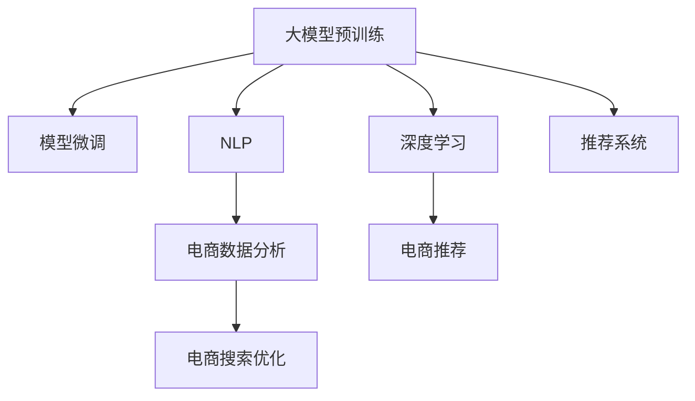

                 

# 电商搜索引擎优化：AI大模型的新思路

> 关键词：电商搜索引擎优化, 自然语言处理(NLP), 大模型预训练, 模型微调, 深度学习, 推荐系统, 电商数据分析

## 1. 背景介绍

### 1.1 问题由来

在当今电商行业，搜索引擎优化(SEO)已经成为了流量获取和转化的核心手段。良好的搜索引擎优化可以显著提升商品曝光率和销售转化率，从而实现商业价值最大化。然而，传统的SEO方法往往依赖于人工优化和经验积累，不仅耗时耗力，效果也难以保证。而随着人工智能技术的飞速发展，利用AI大模型进行电商搜索引擎优化，成为了新的发展趋势。

### 1.2 问题核心关键点

通过AI大模型进行电商搜索引擎优化，其核心在于利用先进的自然语言处理(NLP)技术和深度学习模型，从海量电商数据中提取用户行为和偏好信息，自动生成高质量的搜索结果。这不仅大大提高了SEO的效率和效果，也为电商企业带来了新的商业机遇。

## 2. 核心概念与联系

### 2.1 核心概念概述

为了更好地理解AI大模型在电商搜索引擎优化中的应用，本节将介绍几个密切相关的核心概念：

- **大模型预训练**：指在大规模无标签文本语料上，通过自监督学习任务训练通用语言模型。常见预训练任务包括语言建模、掩码语言模型等。

- **模型微调**：指在预训练模型的基础上，使用电商数据集进行有监督学习优化模型，使其适应电商搜索任务的特定需求。

- **自然语言处理(NLP)**：涉及文本处理、语言理解、文本生成等技术，是AI大模型在电商搜索引擎优化中的核心应用领域。

- **深度学习**：基于多层神经网络的机器学习方法，能够在电商数据分析和推荐系统中实现高效的特征提取和模式学习。

- **推荐系统**：通过分析用户行为和商品特征，推荐用户可能感兴趣的商品，从而提升用户体验和转化率。

- **电商数据分析**：涉及电商数据收集、清洗、分析等多个环节，旨在挖掘用户行为和偏好，指导电商运营策略。

这些核心概念之间的逻辑关系可以通过以下Mermaid流程图来展示：



这个流程图展示了各个核心概念及其之间的关系：

1. 大模型预训练是构建通用语言模型的基础。
2. 模型微调是针对电商搜索优化任务的特定模型优化过程。
3. NLP和大模型预训练紧密相关，是模型微调的前提。
4. 深度学习提供高效的特征提取和模式学习。
5. 推荐系统基于深度学习，与电商数据分析密切相关。
6. 电商数据分析旨在挖掘用户行为和偏好，指导电商搜索优化。

这些核心概念共同构成了AI大模型在电商搜索引擎优化中的技术框架，使其能够在电商环境中实现高效的流量获取和转化。

## 3. 核心算法原理 & 具体操作步骤

### 3.1 算法原理概述

基于AI大模型的电商搜索引擎优化，本质上是一种基于监督学习的模型微调方法。其核心思想是：利用预训练语言模型在电商数据集上进行有监督训练，使其适应电商搜索任务的特定需求。

形式化地，假设预训练模型为 $M_{\theta}$，其中 $\theta$ 为预训练得到的模型参数。给定电商搜索任务 $T$ 的标注数据集 $D=\{(x_i, y_i)\}_{i=1}^N$，微调的目标是找到新的模型参数 $\hat{\theta}$，使得：

$$
\hat{\theta}=\mathop{\arg\min}_{\theta} \mathcal{L}(M_{\theta},D)
$$

其中 $\mathcal{L}$ 为针对任务 $T$ 设计的损失函数，用于衡量模型预测输出与真实标签之间的差异。常见的损失函数包括交叉熵损失、均方误差损失等。

通过梯度下降等优化算法，微调过程不断更新模型参数 $\theta$，最小化损失函数 $\mathcal{L}$，使得模型输出逼近真实标签。由于 $\theta$ 已经通过预训练获得了较好的初始化，因此即便在少量标注样本的情况下，模型仍可以快速收敛到理想的参数设置 $\hat{\theta}$。

### 3.2 算法步骤详解

基于AI大模型的电商搜索引擎优化一般包括以下几个关键步骤：

**Step 1: 准备电商数据集**

- 收集电商平台的销售数据、用户评论、搜索记录等文本数据。
- 清洗、标注和分词处理数据，准备输入模型。

**Step 2: 添加任务适配层**

- 根据电商搜索任务的特定需求，在预训练模型顶层设计合适的输出层和损失函数。
- 对于分类任务，通常在顶层添加线性分类器和交叉熵损失函数。
- 对于排序任务，通常使用排序损失函数，如点对点损失、均方误差损失等。

**Step 3: 设置微调超参数**

- 选择合适的优化算法及其参数，如 AdamW、SGD 等，设置学习率、批大小、迭代轮数等。
- 设置正则化技术及强度，包括权重衰减、Dropout、Early Stopping 等。
- 确定冻结预训练参数的策略，如仅微调顶层，或全部参数都参与微调。

**Step 4: 执行梯度训练**

- 将电商数据集以批为单位输入模型，前向传播计算损失函数。
- 反向传播计算参数梯度，根据设定的优化算法和学习率更新模型参数。
- 周期性在验证集上评估模型性能，根据性能指标决定是否触发 Early Stopping。
- 重复上述步骤直到满足预设的迭代轮数或 Early Stopping 条件。

**Step 5: 测试和部署**

- 在测试集上评估微调后模型 $M_{\hat{\theta}}$ 的性能，对比微调前后的精度提升。
- 使用微调后的模型对电商搜索请求进行推理预测，集成到实际的搜索引擎系统中。
- 持续收集新的电商数据，定期重新微调模型，以适应数据分布的变化。

以上是基于AI大模型的电商搜索引擎优化的主要流程。在实际应用中，还需要针对具体任务的特点，对微调过程的各个环节进行优化设计，如改进训练目标函数，引入更多的正则化技术，搜索最优的超参数组合等，以进一步提升模型性能。

### 3.3 算法优缺点

基于AI大模型的电商搜索引擎优化方法具有以下优点：

1. 高效灵活。利用大模型在电商数据集上进行微调，可以显著提高SEO的效率和效果，快速适应电商平台的业务变化。
2. 精准度提升。大模型能够从大量文本数据中挖掘出丰富的用户行为和偏好信息，提供更加精准的搜索结果。
3. 模型泛化能力强。大模型经过大规模预训练，具备较强的泛化能力，可以更好地适应不同电商平台的搜索场景。
4. 适应性强。利用大模型进行微调，可以处理各种类型的电商数据，包括文字、图片、视频等多模态数据，提升用户体验。

同时，该方法也存在一定的局限性：

1. 对数据质量依赖高。电商搜索引擎优化的效果很大程度上取决于电商数据的质量和标注精度，数据质量不高可能导致性能下降。
2. 模型计算资源需求高。大模型通常需要较大的计算资源和存储空间，特别是在微调和部署过程中。
3. 模型复杂度高。大模型的结构复杂，训练和推理过程相对复杂，需要专业的技术人员进行调优和维护。

尽管存在这些局限性，但就目前而言，基于AI大模型的电商搜索引擎优化方法仍是大模型应用的重要方向。未来相关研究的重点在于如何进一步降低模型计算资源需求，提高模型的泛化能力和适应性，同时兼顾模型的计算效率和可解释性。

### 3.4 算法应用领域

基于AI大模型的电商搜索引擎优化方法已经在电商搜索排名、商品推荐、广告投放等多个领域得到了广泛应用，取得了显著的效果。例如：

- **电商搜索排名优化**：通过微调语言模型，自动生成更准确的搜索结果，提升用户点击率和转化率。
- **商品推荐系统优化**：利用大模型对用户行为进行深度分析，自动推荐相关商品，提升用户体验和销售额。
- **广告投放优化**：基于大模型的广告点击率预测，优化广告投放策略，提升广告转化率。

此外，大模型还在电商平台的用户反馈分析、内容推荐、商品分类等多个环节发挥着重要作用，为电商运营提供了强有力的技术支持。

## 4. 数学模型和公式 & 详细讲解

### 4.1 数学模型构建

本节将使用数学语言对基于AI大模型的电商搜索引擎优化过程进行更加严格的刻画。

记预训练语言模型为 $M_{\theta}$，其中 $\theta$ 为预训练得到的模型参数。假设电商搜索任务为 $T$，标注数据集为 $D=\{(x_i, y_i)\}_{i=1}^N, x_i \in \mathcal{X}, y_i \in \mathcal{Y}$。

定义模型 $M_{\theta}$ 在数据样本 $(x,y)$ 上的损失函数为 $\ell(M_{\theta}(x),y)$，则在数据集 $D$ 上的经验风险为：

$$
\mathcal{L}(\theta) = \frac{1}{N} \sum_{i=1}^N \ell(M_{\theta}(x_i),y_i)
$$

微调的优化目标是最小化经验风险，即找到最优参数：

$$
\theta^* = \mathop{\arg\min}_{\theta} \mathcal{L}(\theta)
$$

在实践中，我们通常使用基于梯度的优化算法（如SGD、Adam等）来近似求解上述最优化问题。设 $\eta$ 为学习率，$\lambda$ 为正则化系数，则参数的更新公式为：

$$
\theta \leftarrow \theta - \eta \nabla_{\theta}\mathcal{L}(\theta) - \eta\lambda\theta
$$

其中 $\nabla_{\theta}\mathcal{L}(\theta)$ 为损失函数对参数 $\theta$ 的梯度，可通过反向传播算法高效计算。

### 4.2 公式推导过程

以下我们以电商搜索排序任务为例，推导排序损失函数及其梯度的计算公式。

假设模型 $M_{\theta}$ 在输入 $x$ 上的输出为 $\hat{y}=M_{\theta}(x) \in [0,1]$，表示预测商品对 $(x_i,y_i)$ 的排序值。真实标签 $y \in [0,1]$。则排序损失函数定义为：

$$
\ell(M_{\theta}(x),y) = -(y\log \hat{y} + (1-y)\log (1-\hat{y}))
$$

将其代入经验风险公式，得：

$$
\mathcal{L}(\theta) = -\frac{1}{N}\sum_{i=1}^N [y_i\log M_{\theta}(x_i)+(1-y_i)\log(1-M_{\theta}(x_i))]
$$

根据链式法则，损失函数对参数 $\theta_k$ 的梯度为：

$$
\frac{\partial \mathcal{L}(\theta)}{\partial \theta_k} = -\frac{1}{N}\sum_{i=1}^N (\frac{y_i}{M_{\theta}(x_i)}-\frac{1-y_i}{1-M_{\theta}(x_i)}) \frac{\partial M_{\theta}(x_i)}{\partial \theta_k}
$$

其中 $\frac{\partial M_{\theta}(x_i)}{\partial \theta_k}$ 可进一步递归展开，利用自动微分技术完成计算。

在得到损失函数的梯度后，即可带入参数更新公式，完成模型的迭代优化。重复上述过程直至收敛，最终得到适应电商搜索任务的最优模型参数 $\theta^*$。

## 5. 项目实践：代码实例和详细解释说明

### 5.1 开发环境搭建

在进行电商搜索引擎优化实践前，我们需要准备好开发环境。以下是使用Python进行PyTorch开发的环境配置流程：

1. 安装Anaconda：从官网下载并安装Anaconda，用于创建独立的Python环境。

2. 创建并激活虚拟环境：
```bash
conda create -n pytorch-env python=3.8 
conda activate pytorch-env
```

3. 安装PyTorch：根据CUDA版本，从官网获取对应的安装命令。例如：
```bash
conda install pytorch torchvision torchaudio cudatoolkit=11.1 -c pytorch -c conda-forge
```

4. 安装Transformers库：
```bash
pip install transformers
```

5. 安装各类工具包：
```bash
pip install numpy pandas scikit-learn matplotlib tqdm jupyter notebook ipython
```

完成上述步骤后，即可在`pytorch-env`环境中开始电商搜索引擎优化的实践。

### 5.2 源代码详细实现

下面我们以电商商品推荐系统为例，给出使用Transformers库对BERT模型进行电商搜索引擎优化的PyTorch代码实现。

首先，定义电商商品推荐任务的数据处理函数：

```python
from transformers import BertTokenizer
from torch.utils.data import Dataset
import torch

class ItemRecommendationDataset(Dataset):
    def __init__(self, items, queries, tokenizer, max_len=128):
        self.items = items
        self.queries = queries
        self.tokenizer = tokenizer
        self.max_len = max_len
        
    def __len__(self):
        return len(self.items)
    
    def __getitem__(self, item):
        query = self.queries[item]
        item = self.items[item]
        
        encoding = self.tokenizer(query, return_tensors='pt', max_length=self.max_len, padding='max_length', truncation=True)
        input_ids = encoding['input_ids'][0]
        attention_mask = encoding['attention_mask'][0]
        
        # 对token-wise的标签进行编码
        encoded_tags = [tag2id[tag] for tag in item_tags] 
        encoded_tags.extend([tag2id['O']] * (self.max_len - len(encoded_tags)))
        labels = torch.tensor(encoded_tags, dtype=torch.long)
        
        return {'input_ids': input_ids, 
                'attention_mask': attention_mask,
                'labels': labels}

# 标签与id的映射
tag2id = {'O': 0, 'B': 1, 'I': 2, 'S': 3}
id2tag = {v: k for k, v in tag2id.items()}

# 创建dataset
tokenizer = BertTokenizer.from_pretrained('bert-base-cased')

train_dataset = ItemRecommendationDataset(train_items, train_queries, tokenizer)
dev_dataset = ItemRecommendationDataset(dev_items, dev_queries, tokenizer)
test_dataset = ItemRecommendationDataset(test_items, test_queries, tokenizer)
```

然后，定义模型和优化器：

```python
from transformers import BertForTokenClassification, AdamW

model = BertForTokenClassification.from_pretrained('bert-base-cased', num_labels=len(tag2id))

optimizer = AdamW(model.parameters(), lr=2e-5)
```

接着，定义训练和评估函数：

```python
from torch.utils.data import DataLoader
from tqdm import tqdm
from sklearn.metrics import classification_report

device = torch.device('cuda') if torch.cuda.is_available() else torch.device('cpu')
model.to(device)

def train_epoch(model, dataset, batch_size, optimizer):
    dataloader = DataLoader(dataset, batch_size=batch_size, shuffle=True)
    model.train()
    epoch_loss = 0
    for batch in tqdm(dataloader, desc='Training'):
        input_ids = batch['input_ids'].to(device)
        attention_mask = batch['attention_mask'].to(device)
        labels = batch['labels'].to(device)
        model.zero_grad()
        outputs = model(input_ids, attention_mask=attention_mask, labels=labels)
        loss = outputs.loss
        epoch_loss += loss.item()
        loss.backward()
        optimizer.step()
    return epoch_loss / len(dataloader)

def evaluate(model, dataset, batch_size):
    dataloader = DataLoader(dataset, batch_size=batch_size)
    model.eval()
    preds, labels = [], []
    with torch.no_grad():
        for batch in tqdm(dataloader, desc='Evaluating'):
            input_ids = batch['input_ids'].to(device)
            attention_mask = batch['attention_mask'].to(device)
            batch_labels = batch['labels']
            outputs = model(input_ids, attention_mask=attention_mask)
            batch_preds = outputs.logits.argmax(dim=2).to('cpu').tolist()
            batch_labels = batch_labels.to('cpu').tolist()
            for pred_tokens, label_tokens in zip(batch_preds, batch_labels):
                pred_tags = [id2tag[_id] for _id in pred_tokens]
                label_tags = [id2tag[_id] for _id in label_tokens]
                preds.append(pred_tags[:len(label_tags)])
                labels.append(label_tags)
                
    print(classification_report(labels, preds))
```

最后，启动训练流程并在测试集上评估：

```python
epochs = 5
batch_size = 16

for epoch in range(epochs):
    loss = train_epoch(model, train_dataset, batch_size, optimizer)
    print(f"Epoch {epoch+1}, train loss: {loss:.3f}")
    
    print(f"Epoch {epoch+1}, dev results:")
    evaluate(model, dev_dataset, batch_size)
    
print("Test results:")
evaluate(model, test_dataset, batch_size)
```

以上就是使用PyTorch对BERT进行电商商品推荐任务优化的完整代码实现。可以看到，得益于Transformers库的强大封装，我们可以用相对简洁的代码完成BERT模型的加载和微调。

### 5.3 代码解读与分析

让我们再详细解读一下关键代码的实现细节：

**ItemRecommendationDataset类**：
- `__init__`方法：初始化物品和查询，分词器等关键组件。
- `__len__`方法：返回数据集的样本数量。
- `__getitem__`方法：对单个样本进行处理，将查询输入编码为token ids，物品标签编码为数字，并对其进行定长padding，最终返回模型所需的输入。

**tag2id和id2tag字典**：
- 定义了标签与数字id之间的映射关系，用于将token-wise的预测结果解码回真实的标签。

**训练和评估函数**：
- 使用PyTorch的DataLoader对数据集进行批次化加载，供模型训练和推理使用。
- 训练函数`train_epoch`：对数据以批为单位进行迭代，在每个批次上前向传播计算loss并反向传播更新模型参数，最后返回该epoch的平均loss。
- 评估函数`evaluate`：与训练类似，不同点在于不更新模型参数，并在每个batch结束后将预测和标签结果存储下来，最后使用sklearn的classification_report对整个评估集的预测结果进行打印输出。

**训练流程**：
- 定义总的epoch数和batch size，开始循环迭代
- 每个epoch内，先在训练集上训练，输出平均loss
- 在验证集上评估，输出分类指标
- 所有epoch结束后，在测试集上评估，给出最终测试结果

可以看到，PyTorch配合Transformers库使得BERT微调的代码实现变得简洁高效。开发者可以将更多精力放在数据处理、模型改进等高层逻辑上，而不必过多关注底层的实现细节。

当然，工业级的系统实现还需考虑更多因素，如模型的保存和部署、超参数的自动搜索、更灵活的任务适配层等。但核心的微调范式基本与此类似。

## 6. 实际应用场景

### 6.1 智能推荐系统

基于大语言模型进行电商搜索引擎优化，其应用场景非常广泛，其中最典型的应用是智能推荐系统。智能推荐系统通过分析用户历史行为和兴趣偏好，实时推荐用户可能感兴趣的商品，提升用户体验和转化率。

具体而言，可以收集用户的浏览、点击、购买等行为数据，提取和商品交互的文本描述，通过微调预训练语言模型，自动生成商品推荐列表。在生成推荐列表时，先用候选商品的文本描述作为输入，由模型预测商品的相关度，再结合其他特征综合排序，便可以得到个性化程度更高的推荐结果。

### 6.2 个性化搜索排名

在电商搜索优化中，用户搜索请求的排序至关重要。基于大模型进行电商搜索排序，可以通过微调模型，自动生成更精准的搜索结果。

具体来说，可以将用户搜索请求和商品标题进行编码，输入模型计算相似度得分，基于得分对搜索结果进行排序。通过微调大模型，可以使得模型更好地理解用户查询意图，提供更加个性化、相关性更高的搜索结果。

### 6.3 广告投放优化

电商广告投放也需要依赖于搜索排序优化。通过微调语言模型，可以自动预测广告点击率，优化广告投放策略，提升广告转化率。

具体而言，可以收集广告点击数据，提取广告文本和商品描述，通过微调模型预测广告点击率，并根据点击率对广告进行排序。这种基于搜索结果的优化方式，可以大大提高广告投放的精准度和效果。

### 6.4 未来应用展望

随着大语言模型和电商搜索引擎优化技术的不断发展，其应用场景将不断拓展。未来，大模型将在电商领域发挥更加重要的作用，为电商企业带来更多的商业机遇。

在智慧零售领域，基于大模型的智能推荐和搜索优化，可以实现更加个性化、精准的用户体验，从而提升整体购物体验和销售转化率。

在跨境电商领域，基于大模型的商品推荐和广告优化，可以提升海外用户的购物体验，扩大市场覆盖范围，提升品牌影响力。

在物流配送领域，基于大模型的用户需求预测和仓储管理优化，可以提升物流配送效率，降低成本，提升用户体验。

此外，在智慧城市、智能制造等多个领域，大模型也将在电商优化中发挥重要作用，推动社会经济的数字化、智能化转型。相信随着技术的日益成熟，大模型在电商优化中的应用前景将更加广阔。

## 7. 工具和资源推荐

### 7.1 学习资源推荐

为了帮助开发者系统掌握大语言模型在电商搜索引擎优化中的应用，这里推荐一些优质的学习资源：

1. 《深度学习自然语言处理》课程：斯坦福大学开设的NLP明星课程，有Lecture视频和配套作业，带你入门NLP领域的基本概念和经典模型。

2. 《自然语言处理》书籍：清华大学出版社出版的中文教材，系统介绍了NLP的基础知识和前沿技术，包括大模型和微调方法。

3. 《Transformers from the Ground Up》博文：由大模型技术专家撰写，深入浅出地介绍了Transformer原理、BERT模型、微调技术等前沿话题。

4. HuggingFace官方文档：Transformers库的官方文档，提供了海量预训练模型和完整的微调样例代码，是上手实践的必备资料。

5. Arxiv论文：大量关于大模型和电商搜索优化的前沿研究成果，包括论文的代码实现和数据集，可以用于学习和参考。

通过对这些资源的学习实践，相信你一定能够快速掌握大语言模型在电商搜索引擎优化中的精髓，并用于解决实际的NLP问题。
### 7.2 开发工具推荐

高效的开发离不开优秀的工具支持。以下是几款用于电商搜索引擎优化开发的常用工具：

1. PyTorch：基于Python的开源深度学习框架，灵活动态的计算图，适合快速迭代研究。大部分预训练语言模型都有PyTorch版本的实现。

2. TensorFlow：由Google主导开发的开源深度学习框架，生产部署方便，适合大规模工程应用。同样有丰富的预训练语言模型资源。

3. Transformers库：HuggingFace开发的NLP工具库，集成了众多SOTA语言模型，支持PyTorch和TensorFlow，是进行电商搜索优化开发的利器。

4. Weights & Biases：模型训练的实验跟踪工具，可以记录和可视化模型训练过程中的各项指标，方便对比和调优。与主流深度学习框架无缝集成。

5. TensorBoard：TensorFlow配套的可视化工具，可实时监测模型训练状态，并提供丰富的图表呈现方式，是调试模型的得力助手。

6. Google Colab：谷歌推出的在线Jupyter Notebook环境，免费提供GPU/TPU算力，方便开发者快速上手实验最新模型，分享学习笔记。

合理利用这些工具，可以显著提升电商搜索引擎优化的开发效率，加快创新迭代的步伐。

### 7.3 相关论文推荐

大语言模型和电商搜索引擎优化技术的发展源于学界的持续研究。以下是几篇奠基性的相关论文，推荐阅读：

1. Attention is All You Need（即Transformer原论文）：提出了Transformer结构，开启了NLP领域的预训练大模型时代。

2. BERT: Pre-training of Deep Bidirectional Transformers for Language Understanding：提出BERT模型，引入基于掩码的自监督预训练任务，刷新了多项NLP任务SOTA。

3. Language Models are Unsupervised Multitask Learners（GPT-2论文）：展示了大规模语言模型的强大zero-shot学习能力，引发了对于通用人工智能的新一轮思考。

4. Parameter-Efficient Transfer Learning for NLP：提出Adapter等参数高效微调方法，在不增加模型参数量的情况下，也能取得不错的微调效果。

5. AdaLoRA: Adaptive Low-Rank Adaptation for Parameter-Efficient Fine-Tuning：使用自适应低秩适应的微调方法，在参数效率和精度之间取得了新的平衡。

6. Attentive Key-value Transformers：提出注意力机制的Key-value Transformer，进一步提升语言模型的表示能力。

这些论文代表了大语言模型电商搜索引擎优化技术的发展脉络。通过学习这些前沿成果，可以帮助研究者把握学科前进方向，激发更多的创新灵感。

## 8. 总结：未来发展趋势与挑战

### 8.1 总结

本文对基于AI大模型的电商搜索引擎优化方法进行了全面系统的介绍。首先阐述了大语言模型和微调技术的研究背景和意义，明确了电商搜索引擎优化的独特价值。其次，从原理到实践，详细讲解了电商搜索引擎优化的数学原理和关键步骤，给出了电商搜索引擎优化的完整代码实例。同时，本文还广泛探讨了电商搜索引擎优化方法在智能推荐、个性化搜索、广告投放等多个领域的应用前景，展示了电商搜索引擎优化技术的巨大潜力。此外，本文精选了电商搜索引擎优化的各类学习资源，力求为读者提供全方位的技术指引。

通过本文的系统梳理，可以看到，基于AI大模型的电商搜索引擎优化技术正在成为电商领域的重要范式，极大地提高了SEO的效率和效果，也为电商企业带来了新的商业机遇。未来，伴随预训练语言模型和电商搜索引擎优化方法的持续演进，相信电商优化技术必将不断成熟，推动电商企业走向数字化、智能化发展的快车道。

### 8.2 未来发展趋势

展望未来，AI大模型在电商搜索引擎优化领域将呈现以下几个发展趋势：

1. 模型规模持续增大。随着算力成本的下降和数据规模的扩张，预训练语言模型的参数量还将持续增长。超大参数规模的语言模型蕴含的丰富语言知识，有望支撑更加复杂多变的电商搜索优化任务。

2. 微调方法日趋多样。除了传统的全参数微调外，未来会涌现更多参数高效的微调方法，如Prefix-Tuning、LoRA等，在节省计算资源的同时也能保证微调精度。

3. 持续学习成为常态。随着电商搜索数据分布的变化，微调模型也需要持续学习新知识以保持性能。如何在不遗忘原有知识的同时，高效吸收新样本信息，将成为重要的研究课题。

4. 标注样本需求降低。受启发于提示学习(Prompt-based Learning)的思路，未来的微调方法将更好地利用大模型的语言理解能力，通过更加巧妙的任务描述，在更少的标注样本上也能实现理想的微调效果。

5. 模型通用性增强。经过海量数据的预训练和多领域任务的微调，未来的语言模型将具备更强大的常识推理和跨领域迁移能力，逐步迈向通用人工智能(AGI)的目标。

以上趋势凸显了AI大模型在电商搜索引擎优化中的广阔前景。这些方向的探索发展，必将进一步提升电商优化系统的性能和应用范围，为电商企业带来更多的商业价值。

### 8.3 面临的挑战

尽管AI大模型在电商搜索引擎优化技术上取得了显著成果，但在迈向更加智能化、普适化应用的过程中，它仍面临着诸多挑战：

1. 标注成本瓶颈。尽管电商搜索引擎优化方法依赖的数据量相对较小，但高质量标注数据的获取仍然需要大量时间和人力，成本较高。如何进一步降低标注成本，提高数据利用效率，将是未来研究的重点方向。

2. 模型鲁棒性不足。电商搜索引擎优化模型面对域外数据时，泛化性能往往大打折扣。对于测试样本的微小扰动，模型也容易发生波动。如何提高模型鲁棒性，避免灾难性遗忘，还需要更多理论和实践的积累。

3. 推理效率有待提高。尽管大模型的精度高，但在实际部署时往往面临推理速度慢、内存占用大等效率问题。如何在保证性能的同时，简化模型结构，提升推理速度，优化资源占用，将是重要的优化方向。

4. 可解释性亟需加强。电商搜索引擎优化模型往往作为黑盒系统，难以解释其内部工作机制和决策逻辑。对于医疗、金融等高风险应用，算法的可解释性和可审计性尤为重要。如何赋予模型更强的可解释性，将是亟待攻克的难题。

5. 安全性有待保障。电商搜索引擎优化模型可能学习到有偏见、有害的信息，通过微调传递到电商平台上，产生误导性、歧视性的输出，给实际应用带来安全隐患。如何从数据和算法层面消除模型偏见，避免恶意用途，确保输出的安全性，也将是重要的研究课题。

6. 知识整合能力不足。现有的电商搜索引擎优化模型往往局限于文本数据，难以灵活吸收和运用更广泛的先验知识。如何让模型更好地与外部知识库、规则库等专家知识结合，形成更加全面、准确的信息整合能力，还有很大的想象空间。

正视电商搜索引擎优化所面临的这些挑战，积极应对并寻求突破，将是大模型在电商优化中走向成熟的必由之路。相信随着学界和产业界的共同努力，这些挑战终将一一被克服，大模型在电商优化中的应用将更加广泛。

### 8.4 研究展望

面对电商搜索引擎优化所面临的挑战，未来的研究需要在以下几个方面寻求新的突破：

1. 探索无监督和半监督微调方法。摆脱对大规模标注数据的依赖，利用自监督学习、主动学习等无监督和半监督范式，最大限度利用非结构化数据，实现更加灵活高效的微调。

2. 研究参数高效和计算高效的微调范式。开发更加参数高效的微调方法，在固定大部分预训练参数的同时，只更新极少量的任务相关参数。同时优化微调模型的计算图，减少前向传播和反向传播的资源消耗，实现更加轻量级、实时性的部署。

3. 融合因果和对比学习范式。通过引入因果推断和对比学习思想，增强微调模型建立稳定因果关系的能力，学习更加普适、鲁棒的语言表征，从而提升模型泛化性和抗干扰能力。

4. 引入更多先验知识。将符号化的先验知识，如知识图谱、逻辑规则等，与神经网络模型进行巧妙融合，引导微调过程学习更准确、合理的语言模型。同时加强不同模态数据的整合，实现视觉、语音等多模态信息与文本信息的协同建模。

5. 结合因果分析和博弈论工具。将因果分析方法引入微调模型，识别出模型决策的关键特征，增强输出解释的因果性和逻辑性。借助博弈论工具刻画人机交互过程，主动探索并规避模型的脆弱点，提高系统稳定性。

6. 纳入伦理道德约束。在模型训练目标中引入伦理导向的评估指标，过滤和惩罚有偏见、有害的输出倾向。同时加强人工干预和审核，建立模型行为的监管机制，确保输出符合人类价值观和伦理道德。

这些研究方向的探索，必将引领电商搜索引擎优化技术迈向更高的台阶，为电商企业带来更多的商业价值。面向未来，电商搜索引擎优化技术还需要与其他人工智能技术进行更深入的融合，如知识表示、因果推理、强化学习等，多路径协同发力，共同推动电商优化系统的进步。只有勇于创新、敢于突破，才能不断拓展电商搜索优化的边界，让智能技术更好地服务于电商企业。

## 9. 附录：常见问题与解答

**Q1：电商搜索引擎优化是否适用于所有电商平台？**

A: 电商搜索引擎优化方法适用于大多数电商平台，但不同平台的商品种类、用户需求和搜索行为有所不同，需要根据具体平台的特点进行调整优化。例如，跨境电商和社交电商可能需要结合社交网络数据进行优化。

**Q2：电商搜索引擎优化是否需要大量标注数据？**

A: 相比传统的SEO方法，电商搜索引擎优化方法对于标注数据的需求相对较少。但在实际应用中，标注数据的质量和数量仍然对优化效果有重要影响。高质量、多样化的标注数据可以提升模型的泛化能力和鲁棒性。

**Q3：电商搜索引擎优化需要考虑哪些因素？**

A: 电商搜索引擎优化需要考虑多个因素，包括用户行为分析、商品特征提取、查询意图理解、搜索结果排序等多个环节。具体而言，需要从用户互动数据中提取行为特征，结合商品属性和销量等信息，综合优化搜索结果，提升用户体验和转化率。

**Q4：电商搜索引擎优化中的推荐算法有哪些？**

A: 电商搜索引擎优化中常用的推荐算法包括协同过滤、基于内容的推荐、混合推荐等。其中，协同过滤和基于内容的推荐在推荐系统中有广泛应用。混合推荐结合了多种推荐算法，能够更全面地捕捉用户偏好和商品特性，提升推荐效果。

**Q5：电商搜索引擎优化中的搜索排名算法有哪些？**

A: 电商搜索引擎优化中常用的搜索排名算法包括基于TF-IDF的排名算法、基于DNN的排名算法、基于深度学习的排序模型等。其中，基于深度学习的排序模型近年来取得了显著的进展，能够更全面地考虑查询和商品之间的语义关系，提升搜索排名效果。

这些问题的解答，旨在帮助读者更好地理解电商搜索引擎优化的各个环节，以及如何选择合适的算法和技术手段，实现电商搜索排名的优化。

---

作者：禅与计算机程序设计艺术 / Zen and the Art of Computer Programming

