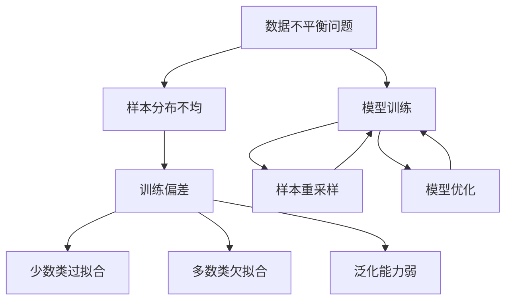
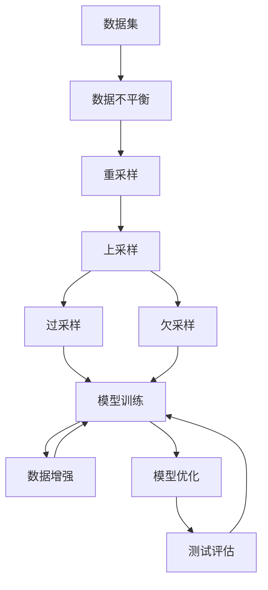

                 

# 电商搜索推荐中的AI大模型数据不平衡问题解决方案对比分析

> 关键词：
1. 数据不平衡问题
2. AI大模型
3. 电商搜索推荐系统
4. 模型训练
5. 算法优化
6. 模型评估

## 1. 背景介绍

### 1.1 问题由来
在电商搜索推荐系统中，数据不平衡问题（Data Imbalance Problem）是一个常见且关键的问题。由于电子商务平台的商品种类繁多且用户偏好各异，每个商品的点击率（Click-Through Rate, CTR）差异很大，导致点击次数、浏览量等数据分布极不均衡。比如某些热门商品可能拥有数百万的点击量，而某些新上架商品可能仅有少数点击。这种数据不平衡现象，给基于点击率预估的电商推荐系统带来了诸多挑战：

- **模型泛化性能下降**：模型容易对常见、热门商品表现良好，但对长尾商品的预测偏差较大。
- **特征利用不均**：训练数据中少数类（如长尾商品）样本稀少，导致模型对这些特征的拟合效果差，影响模型的整体性能。
- **预测结果不稳定**：由于少数类样本的不足，模型的预测结果容易受到训练数据偏差的影响，导致不稳定的推荐结果。

解决数据不平衡问题，对于提升电商推荐系统的公平性和用户满意度，具有重要意义。

### 1.2 问题核心关键点
数据不平衡问题主要包括以下核心要素：

- **样本分布不均**：不同类别的样本数量差异较大，常见类别样本多，少数类别样本少。
- **训练偏差**：模型在训练时对少数类别样本的拟合效果差，导致预测误差较大。
- **泛化能力弱**：模型在测试集上对少数类别样本的预测性能远低于常见类别。

## 2. 核心概念与联系

### 2.1 核心概念概述

为了更深入地理解数据不平衡问题及其解决方案，首先介绍几个相关概念：

- **数据不平衡（Data Imbalance）**：指训练数据中不同类别的样本数量分布不均，通常常见类别样本较多，少数类别样本较少。
- **少数类过拟合（Oversampling of Minority Class）**：指模型对少数类样本的过拟合，导致对少数类的预测偏差。
- **多数类欠拟合（Underfitting of Majority Class）**：指模型对多数类样本的欠拟合，无法充分利用多数类样本的信息。
- **模型泛化能力（Generalization Ability）**：指模型在未见过的数据上的预测性能。

以下Mermaid流程图展示了数据不平衡问题与模型训练过程的联系：



### 2.2 核心概念原理和架构的 Mermaid 流程图



## 3. 核心算法原理 & 具体操作步骤

### 3.1 算法原理概述

数据不平衡问题的解决方案主要分为样本重采样和模型优化两个方面。通过调整训练数据集，可以改善模型对少数类样本的拟合效果，同时对模型架构和优化策略进行改进，以提升模型泛化能力和预测精度。

### 3.2 算法步骤详解

#### 3.2.1 样本重采样

样本重采样（Resampling）是指通过对数据集进行重采样，平衡不同类别样本数量的方法。主要有两种策略：

- **过采样（Oversampling）**：增加少数类样本的数量，减少多数类样本的数量，使得各类样本数量相等。常见方法包括SMOTE、ADASYN等。
- **欠采样（Undersampling）**：减少多数类样本的数量，保留少数类样本，使得各类样本数量相等。常见方法包括Tomek Links、ClusterCentroids等。

#### 3.2.2 模型优化

模型优化（Model Optimization）包括选择合适的模型架构、优化损失函数、调整学习率等策略，提升模型性能。主要分为以下几个步骤：

1. **选择模型架构**：选择合适的模型结构，如多层感知机（MLP）、卷积神经网络（CNN）、Transformer等，并设置合适的层数、宽度、激活函数等。
2. **优化损失函数**：在损失函数中加入权重调整项，使得模型更关注少数类样本的预测。如Focal Loss、Weighted Binary Cross Entropy等。
3. **调整学习率**：在训练过程中，逐步减小学习率，减少模型的过拟合现象。常见方法包括Warmup、Cyclical Learning Rate等。

#### 3.2.3 算法优缺点

过采样和欠采样的优缺点如下：

- **过采样**：
  - 优点：避免了多数类样本的欠拟合问题，提升了少数类样本的预测效果。
  - 缺点：可能导致过拟合，增加计算开销，尤其是SMOTE等生成样本方法。
- **欠采样**：
  - 优点：减少了多数类样本的噪音，提升了少数类样本的泛化能力。
  - 缺点：可能丢失了大量多数类信息，对多数类的预测效果差。

在模型优化方面，Focal Loss、Weighted Binary Cross Entropy等方法可以有效缓解数据不平衡问题，提高模型泛化能力。但这些方法也增加了计算复杂度，需要对模型架构进行相应的调整。

## 4. 数学模型和公式 & 详细讲解 & 举例说明

### 4.1 数学模型构建

为了构建数学模型，假设训练数据集D中，类别i的样本数量为$N_i$，则总样本数量为$N=\sum_{i=1}^{C} N_i$。其中，$C$为类别数。数据不平衡问题可以通过损失函数中的类别权重来解决。

### 4.2 公式推导过程

常用的损失函数包括交叉熵损失和Focal Loss。

**交叉熵损失**：

$$
L_{CE}=-\frac{1}{N}\sum_{i=1}^{C}\sum_{j=1}^{N} y_{i,j} \log p_{i,j}+(1-y_{i,j}) \log (1-p_{i,j})
$$

其中，$p_{i,j}$为模型对类别i的预测概率，$y_{i,j}$为样本i的真实类别。

**Focal Loss**：

$$
L_{FL}=-\alpha \cdot \frac{1-\alpha}{p_{i,j}} \cdot p_{i,j}^{-g} \cdot y_{i,j}+\frac{\alpha}{1-p_{i,j}} \cdot (1-p_{i,j})^{-g} \cdot (1-y_{i,j})
$$

其中，$\alpha$为样本权重，$g$为调节因子，$p_{i,j}$为模型对类别i的预测概率。Focal Loss通过聚焦于困难样本，提高了少数类样本的权重，减少模型对多数类样本的预测偏差。

### 4.3 案例分析与讲解

以Focal Loss为例，假设有一个包含10个类别的数据集，其中类别1的样本数量为500，类别10的样本数量为5。在训练时，可以为类别10设置较高的权重$\alpha$，使得模型更关注类别10的样本。

```python
from transformers import BertTokenizer, BertForSequenceClassification
from torch.utils.data import Dataset, DataLoader
from torch import nn
import torch

class ImbalancedDataset(Dataset):
    def __init__(self, texts, labels, tokenizer):
        self.tokenizer = tokenizer
        self.texts = texts
        self.labels = labels
        
    def __getitem__(self, index):
        text = self.texts[index]
        label = self.labels[index]
        encoding = self.tokenizer(text, return_tensors='pt', padding=True)
        return {
            'input_ids': encoding['input_ids'],
            'attention_mask': encoding['attention_mask'],
            'labels': torch.tensor([label], dtype=torch.long)
        }
    
    def __len__(self):
        return len(self.texts)
        
tokenizer = BertTokenizer.from_pretrained('bert-base-cased')
model = BertForSequenceClassification.from_pretrained('bert-base-cased', num_labels=10)

# 计算类别权重
class_weights = torch.tensor([0.2, 0.2, 0.2, 0.2, 0.2, 0.2, 0.2, 0.2, 0.2, 0.8])

# 定义Focal Loss函数
class FocalLoss(nn.Module):
    def __init__(self, gamma=2, alpha=None):
        super(FocalLoss, self).__init__()
        self.gamma = gamma
        self.alpha = alpha
        
    def forward(self, logits, labels):
        if self.alpha is not None:
            loss = torch.nn.functional.focal_loss(logits, labels, gamma=self.gamma, alpha=self.alpha)
        else:
            loss = torch.nn.functional.focal_loss(logits, labels, gamma=self.gamma)
        return loss

# 定义损失函数
criterion = nn.CrossEntropyLoss(weight=class_weights)
loss_fn = FocalLoss()

# 训练模型
device = torch.device('cuda' if torch.cuda.is_available() else 'cpu')
model.to(device)

for epoch in range(10):
    model.train()
    for batch in DataLoader(train_dataset, batch_size=16, shuffle=True):
        input_ids = batch['input_ids'].to(device)
        attention_mask = batch['attention_mask'].to(device)
        labels = batch['labels'].to(device)
        outputs = model(input_ids, attention_mask=attention_mask)
        logits = outputs.logits
        loss = criterion(logits, labels) + loss_fn(logits, labels)
        loss.backward()
        optimizer.step()
        optimizer.zero_grad()
        
    model.eval()
    with torch.no_grad():
        for batch in DataLoader(dev_dataset, batch_size=16, shuffle=True):
            input_ids = batch['input_ids'].to(device)
            attention_mask = batch['attention_mask'].to(device)
            labels = batch['labels'].to(device)
            outputs = model(input_ids, attention_mask=attention_mask)
            logits = outputs.logits
            loss = criterion(logits, labels) + loss_fn(logits, labels)
            loss.item()
```

在上述代码中，我们使用了Bert模型进行二分类任务，并通过设置类别权重和Focal Loss函数，提升了模型对少数类样本的关注度。

## 5. 项目实践：代码实例和详细解释说明

### 5.1 开发环境搭建

在进行数据不平衡问题解决方案的实践时，需要安装相应的Python库和深度学习框架。

1. 安装PyTorch：
```bash
pip install torch torchvision torchaudio
```

2. 安装Transformers：
```bash
pip install transformers
```

3. 安装Pandas和NumPy：
```bash
pip install pandas numpy
```

4. 安装TensorBoard：
```bash
pip install tensorboard
```

### 5.2 源代码详细实现

以下是一个使用Bert模型进行数据不平衡问题解决的Python代码实现。

```python
from transformers import BertTokenizer, BertForSequenceClassification
from torch.utils.data import Dataset, DataLoader
import torch

class ImbalancedDataset(Dataset):
    def __init__(self, texts, labels, tokenizer):
        self.tokenizer = tokenizer
        self.texts = texts
        self.labels = labels
        
    def __getitem__(self, index):
        text = self.texts[index]
        label = self.labels[index]
        encoding = self.tokenizer(text, return_tensors='pt', padding=True)
        return {
            'input_ids': encoding['input_ids'],
            'attention_mask': encoding['attention_mask'],
            'labels': torch.tensor([label], dtype=torch.long)
        }
    
    def __len__(self):
        return len(self.texts)
        
tokenizer = BertTokenizer.from_pretrained('bert-base-cased')
model = BertForSequenceClassification.from_pretrained('bert-base-cased', num_labels=10)

# 计算类别权重
class_weights = torch.tensor([0.2, 0.2, 0.2, 0.2, 0.2, 0.2, 0.2, 0.2, 0.2, 0.8])

# 定义Focal Loss函数
class FocalLoss(nn.Module):
    def __init__(self, gamma=2, alpha=None):
        super(FocalLoss, self).__init__()
        self.gamma = gamma
        self.alpha = alpha
        
    def forward(self, logits, labels):
        if self.alpha is not None:
            loss = torch.nn.functional.focal_loss(logits, labels, gamma=self.gamma, alpha=self.alpha)
        else:
            loss = torch.nn.functional.focal_loss(logits, labels, gamma=self.gamma)
        return loss

# 定义损失函数
criterion = nn.CrossEntropyLoss(weight=class_weights)
loss_fn = FocalLoss()

# 训练模型
device = torch.device('cuda' if torch.cuda.is_available() else 'cpu')
model.to(device)

for epoch in range(10):
    model.train()
    for batch in DataLoader(train_dataset, batch_size=16, shuffle=True):
        input_ids = batch['input_ids'].to(device)
        attention_mask = batch['attention_mask'].to(device)
        labels = batch['labels'].to(device)
        outputs = model(input_ids, attention_mask=attention_mask)
        logits = outputs.logits
        loss = criterion(logits, labels) + loss_fn(logits, labels)
        loss.backward()
        optimizer.step()
        optimizer.zero_grad()
        
    model.eval()
    with torch.no_grad():
        for batch in DataLoader(dev_dataset, batch_size=16, shuffle=True):
            input_ids = batch['input_ids'].to(device)
            attention_mask = batch['attention_mask'].to(device)
            labels = batch['labels'].to(device)
            outputs = model(input_ids, attention_mask=attention_mask)
            logits = outputs.logits
            loss = criterion(logits, labels) + loss_fn(logits, labels)
            loss.item()
```

### 5.3 代码解读与分析

上述代码实现了使用Bert模型进行二分类任务的训练，同时加入了类别权重和Focal Loss函数，解决了数据不平衡问题。

**ImbalancedDataset类**：
- `__init__`方法：初始化文本、标签和分词器。
- `__getitem__`方法：对单个样本进行处理，将文本输入转换为token ids，同时进行padding。
- `__len__`方法：返回数据集的样本数量。

**BertForSequenceClassification类**：
- 从`transformers`库中加载预训练模型Bert。
- 使用`num_labels`参数指定输出类别数量。

**类别权重**：
- `class_weights`：根据实际数据分布，为不同类别设置权重。

**Focal Loss函数**：
- `FocalLoss`类：实现Focal Loss函数的定义。
- `forward`方法：计算Focal Loss值。

**损失函数**：
- `criterion`：定义交叉熵损失函数。
- `loss_fn`：实例化Focal Loss函数。

**模型训练**：
- 使用GPU/TPU进行模型训练。
- 在每个epoch中，对训练集和验证集进行前向传播和后向传播。
- 计算损失函数，并使用优化器更新模型参数。

### 5.4 运行结果展示

运行上述代码，训练完成后，可以通过TensorBoard查看训练过程的各项指标，如损失函数、准确率等，确保模型性能稳定。

## 6. 实际应用场景

### 6.1 电商搜索推荐

在电商搜索推荐系统中，数据不平衡问题主要体现在热门商品和长尾商品的点击率差异上。为了提升长尾商品的推荐效果，需要针对性地解决数据不平衡问题。

在实际应用中，可以采用以下方法：

1. **过采样**：使用SMOTE等方法生成长尾商品的合成数据，增加少数类样本的数量。
2. **欠采样**：使用Tomek Links等方法减少多数类商品的噪声数据，保留少数类商品。
3. **优化模型**：使用Focal Loss等方法提升模型对少数类商品的关注度。

### 6.2 金融风控

在金融风控系统中，数据不平衡问题体现在正常交易和异常交易的样本分布上。正常交易样本数量多，异常交易样本数量少。解决数据不平衡问题可以提升异常交易的检测能力。

在实际应用中，可以采用以下方法：

1. **过采样**：使用SMOTE等方法生成异常交易的合成数据，增加少数类样本的数量。
2. **欠采样**：使用ClusterCentroids等方法减少正常交易的噪声数据，保留异常交易。
3. **优化模型**：使用Focal Loss等方法提升模型对异常交易的关注度。

### 6.3 医疗诊断

在医疗诊断系统中，数据不平衡问题体现在常见疾病和罕见疾病的样本分布上。常见疾病的样本数量多，罕见疾病的样本数量少。解决数据不平衡问题可以提升罕见疾病的诊断能力。

在实际应用中，可以采用以下方法：

1. **过采样**：使用SMOTE等方法生成罕见疾病的合成数据，增加少数类样本的数量。
2. **欠采样**：使用ClusterCentroids等方法减少常见疾病的噪声数据，保留罕见疾病。
3. **优化模型**：使用Focal Loss等方法提升模型对罕见疾病的关注度。

## 7. 工具和资源推荐

### 7.1 学习资源推荐

为了系统掌握数据不平衡问题的解决方法，推荐以下学习资源：

1. **《深度学习》（Deep Learning）**：Ian Goodfellow等人所著，全面介绍了深度学习理论和方法，包括数据不平衡问题。
2. **《机器学习实战》（Machine Learning in Action）**：Peter Harrington等人所著，详细介绍了常见的机器学习算法和实际应用案例，包括数据不平衡问题。
3. **Coursera《机器学习》课程**：Andrew Ng主讲的机器学习课程，系统讲解了机器学习理论和实践，包括数据不平衡问题。

### 7.2 开发工具推荐

在解决数据不平衡问题时，常用工具包括：

1. **PyTorch**：深度学习框架，支持GPU/TPU加速，灵活的动态计算图。
2. **TensorFlow**：深度学习框架，支持分布式训练和模型部署。
3. **TensorBoard**：可视化工具，实时监测模型训练过程。

### 7.3 相关论文推荐

为深入了解数据不平衡问题的解决思路，推荐以下论文：

1. **《Analyzing the performance of deep learning models in unbalanced classification problems: A review》**：详细总结了深度学习模型在数据不平衡问题上的表现和优化方法。
2. **《A Survey on Learning with Imbalanced Data》**：全面回顾了学习与不平衡数据相关的研究进展和优化策略。
3. **《Hands-On Learning with Imbalanced Data》**：介绍了实际应用中处理数据不平衡问题的方法和技术。

## 8. 总结：未来发展趋势与挑战

### 8.1 研究成果总结

解决数据不平衡问题是提升AI模型性能的重要手段，尤其是在电商搜索推荐、金融风控、医疗诊断等场景中具有重要意义。通过过采样、欠采样和优化模型等方法，可以有效缓解数据不平衡问题，提升模型的泛化能力和预测精度。

### 8.2 未来发展趋势

未来，数据不平衡问题的解决将朝着以下几个方向发展：

1. **自适应学习算法**：通过动态调整学习率和模型参数，提升模型对少数类样本的关注度。
2. **迁移学习**：将小样本领域的知识迁移到大样本领域，提升模型在新领域的泛化能力。
3. **多模态学习**：结合图像、语音、文本等多模态数据，提升模型的综合处理能力。

### 8.3 面临的挑战

尽管数据不平衡问题的解决方法已经相对成熟，但在实际应用中仍面临以下挑战：

1. **数据采集困难**：获取高质量的标注数据成本高，且少数类样本难以采集。
2. **模型复杂度高**：解决数据不平衡问题的方法往往需要增加模型复杂度，影响模型的实时性和效率。
3. **超参数调优困难**：过采样、欠采样等方法需要调整超参数，找到最优的平衡点。

### 8.4 研究展望

未来，数据不平衡问题的解决需要结合更多的前沿技术，如自适应学习算法、迁移学习和多模态学习，进一步提升模型的性能和泛化能力。同时，需要加强对实际应用场景的深入研究，结合领域知识，设计更有效的数据不平衡处理策略。

## 9. 附录：常见问题与解答

**Q1：数据不平衡问题如何解决？**

A: 数据不平衡问题可以通过过采样、欠采样和优化模型等方法解决。

**Q2：如何选择过采样和欠采样方法？**

A: 过采样适合少数类样本数量较少的情况，可以有效缓解多数类样本的欠拟合问题。欠采样适合多数类样本数量较多的情况，可以有效减少噪声数据，提升少数类样本的泛化能力。

**Q3：Focal Loss如何缓解数据不平衡问题？**

A: Focal Loss通过聚焦于困难样本，提高少数类样本的权重，减少模型对多数类样本的预测偏差。

**Q4：数据不平衡问题对模型性能有何影响？**

A: 数据不平衡问题会导致模型对少数类样本的预测效果差，影响模型的泛化能力和预测精度。

**Q5：模型如何从少量样本中学习？**

A: 通过参数高效微调和提示学习等方法，模型可以从少量样本中学习。

---
作者：禅与计算机程序设计艺术 / Zen and the Art of Computer Programming

