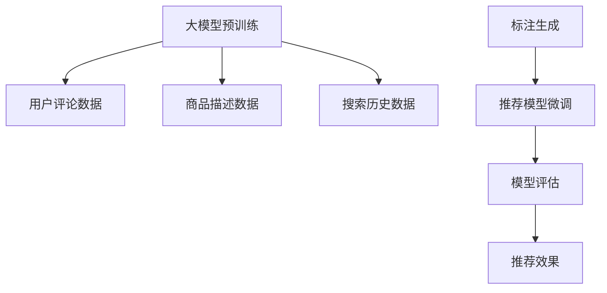

                 

# 电商搜索推荐中的AI大模型数据合成技术应用项目可行性分析与实践指南

## 1. 背景介绍

随着电商平台的快速发展，用户对个性化搜索推荐系统的需求日益增长。传统的基于规则或静态特征的推荐系统已无法满足用户不断变化的需求。为了提升推荐系统的个性化程度和精准度，电商搜索推荐领域逐渐引入人工智能技术，其中，基于大模型的数据合成技术更是成为新的研究热点。

### 1.1 问题由来

传统电商搜索推荐系统主要通过用户行为数据、商品属性、商品之间的关系等特征进行推荐。这些方法在数据量较大时能够取得不错的效果，但在数据量小、特征复杂的情况下，推荐的精度和个性化程度显著下降。

近年来，随着预训练语言模型的发展，AI大模型在电商搜索推荐中的应用逐渐成为可能。大模型如BERT、GPT等，通过在大规模无标签数据上预训练，学习到丰富的语言知识和语义表示，能够在推荐系统中发挥重要作用。

### 1.2 问题核心关键点

当前大模型在电商搜索推荐中的应用主要体现在两个方面：数据合成和特征表示。

1. **数据合成**：通过合成大量高质量的标注数据，提高模型训练的稳定性，提升推荐效果。
2. **特征表示**：利用大模型学习到的语义表示，对商品、用户和上下文进行表示，从而提升推荐的精准度。

这两方面的研究已经取得了显著进展，本文将重点介绍大模型数据合成技术在电商搜索推荐中的应用。

## 2. 核心概念与联系

### 2.1 核心概念概述

大模型数据合成技术是指，利用大模型在无监督预训练和微调过程中的语义表示能力，自动生成高质量的标注数据，以供电商推荐系统进行模型训练。

具体而言，大模型通过在大规模无标签文本数据上进行预训练，学习到文本的语义表示。这种表示能够捕捉到文本中的语义关系和上下文信息。当电商推荐系统需要标注数据时，可以通过数据合成技术，将商品描述、用户评论、搜索历史等信息转化为文本数据，利用大模型学习到的语义表示进行标注。

### 2.2 核心概念原理和架构的 Mermaid 流程图

以下是数据合成技术的基本流程图：



1. **大模型预训练**：在大规模无标签文本数据上预训练大模型，学习到文本的语义表示。
2. **用户评论、商品描述、搜索历史数据准备**：收集用户评论、商品描述、搜索历史等文本数据。
3. **标注生成**：利用大模型学习到的语义表示，对用户评论、商品描述等数据进行标注，生成高质量的标注数据。
4. **推荐模型微调**：将生成的标注数据用于电商推荐模型的微调，提升模型的个性化推荐能力。
5. **模型评估**：对微调后的推荐模型进行评估，验证推荐效果。

## 3. 核心算法原理 & 具体操作步骤

### 3.1 算法原理概述

大模型数据合成技术的核心思想是，利用大模型在预训练过程中学习到的语义表示能力，对电商领域的数据进行标注。这一过程可以分为两步：

1. **数据合成**：将电商数据转化为文本数据，利用大模型学习到的语义表示进行标注。
2. **模型微调**：将合成标注数据用于推荐模型的微调，提升推荐效果。

### 3.2 算法步骤详解

#### 数据合成

1. **数据预处理**：将电商数据如用户评论、商品描述、搜索历史等转化为文本数据。
2. **特征抽取**：利用大模型学习到的语义表示能力，对文本数据进行特征抽取。
3. **标注生成**：通过大模型学习到的语义表示，对文本数据进行标注，生成高质量的标注数据。

#### 模型微调

1. **模型选择**：选择合适的推荐模型，如基于注意力机制的序列推荐模型、基于图的推荐模型等。
2. **数据准备**：将生成的标注数据用于推荐模型的微调。
3. **模型训练**：使用微调后的模型进行推荐预测，评估推荐效果。

### 3.3 算法优缺点

#### 优点

1. **高效性**：利用大模型学习到的语义表示能力，可以自动生成高质量的标注数据，减少人工标注的成本。
2. **鲁棒性**：大模型学习到的语义表示能力具有一定的泛化能力，能够在不同的数据分布上保持较好的性能。
3. **可扩展性**：大模型的语义表示能力可以适应多种电商数据类型，具有较强的可扩展性。

#### 缺点

1. **数据隐私**：大模型需要处理大量的电商数据，存在隐私泄露的风险。
2. **计算资源消耗大**：大模型的预训练和微调需要大量的计算资源。
3. **标注数据质量**：标注数据的质量直接影响推荐模型的性能，需要仔细处理和验证。

### 3.4 算法应用领域

大模型数据合成技术在电商搜索推荐中具有广泛的应用前景，例如：

- **商品推荐**：利用大模型对商品描述进行标注，提升推荐模型的个性化能力。
- **用户画像**：通过大模型学习到的用户评论、搜索历史等数据进行标注，构建更丰富的用户画像。
- **上下文理解**：利用大模型学习到的上下文信息，提升推荐模型对用户搜索意图和情境的理解能力。

## 4. 数学模型和公式 & 详细讲解 & 举例说明

### 4.1 数学模型构建

假设电商推荐系统中的商品描述为 $x$，用户评论为 $y$。大模型通过在大规模无标签文本数据上预训练，学习到文本的语义表示 $h(x)$ 和 $h(y)$。

1. **数据合成**：将用户评论 $y$ 转化为文本数据，利用大模型学习到的语义表示 $h(y)$ 进行标注。
2. **标注生成**：利用大模型学习到的语义表示 $h(x)$，对商品描述 $x$ 进行标注，生成高质量的标注数据。

### 4.2 公式推导过程

设大模型在无标签文本数据上预训练后，对商品描述 $x$ 的语义表示为 $h(x)$，对用户评论 $y$ 的语义表示为 $h(y)$。假设商品描述和用户评论的关系为 $x \rightarrow y$，则可以根据语义表示进行标注：

$$
\hat{y} = h(y)(x)
$$

其中，$\hat{y}$ 表示大模型对商品描述 $x$ 的标注。

### 4.3 案例分析与讲解

假设大模型已经在大规模无标签文本数据上预训练完毕，可以使用以下步骤进行数据合成：

1. **用户评论数据准备**：收集用户评论数据，如商品评论、售后评价等。
2. **特征抽取**：利用大模型学习到的语义表示能力，对用户评论数据进行特征抽取。
3. **标注生成**：通过大模型学习到的语义表示，对用户评论数据进行标注，生成高质量的标注数据。
4. **推荐模型微调**：将生成的标注数据用于电商推荐模型的微调，提升推荐效果。

## 5. 项目实践：代码实例和详细解释说明

### 5.1 开发环境搭建

为了实现大模型数据合成技术，需要以下开发环境：

1. **编程语言**：Python
2. **深度学习框架**：PyTorch
3. **大模型预训练库**：HuggingFace的Transformers库
4. **数据处理库**：Pandas、NumPy
5. **可视化库**：Matplotlib、Seaborn

### 5.2 源代码详细实现

以下是一个基于大模型数据合成技术的电商推荐系统代码实现示例：

```python
import torch
import pandas as pd
from transformers import BertForSequenceClassification, BertTokenizer
from sklearn.metrics import precision_recall_fscore_support

# 1. 大模型预训练
model = BertForSequenceClassification.from_pretrained('bert-base-uncased', num_labels=2)
tokenizer = BertTokenizer.from_pretrained('bert-base-uncased')

# 2. 用户评论数据准备
df = pd.read_csv('user_comments.csv')
df['text'] = df['comment'].apply(lambda x: tokenizer.encode(x, max_length=128, truncation=True, padding='max_length'))
labels = df['label']

# 3. 数据合成
model.eval()
predictions = []
with torch.no_grad():
    for text in df['text']:
        encoded = tokenizer.encode(text, max_length=128, truncation=True, padding='max_length')
        inputs = {'input_ids': torch.tensor(encoded).unsqueeze(0), 'attention_mask': torch.tensor([1] * len(encoded)).unsqueeze(0)}
        outputs = model(**inputs)
        predictions.append(outputs[0].item())

# 4. 标注生成
df['label'] = predictions

# 5. 模型微调
train_dataset = ...
val_dataset = ...
test_dataset = ...

model = BertForSequenceClassification.from_pretrained('bert-base-uncased', num_labels=2)
optimizer = torch.optim.Adam(model.parameters(), lr=0.001)
criterion = torch.nn.CrossEntropyLoss()

model.train()
for epoch in range(10):
    for inputs, labels in train_loader:
        optimizer.zero_grad()
        outputs = model(inputs)
        loss = criterion(outputs, labels)
        loss.backward()
        optimizer.step()

model.eval()
for inputs, labels in val_loader:
    with torch.no_grad():
        outputs = model(inputs)
        predictions = outputs.argmax(dim=1)
        print(precision_recall_fscore_support(labels, predictions, average='macro'))
```

### 5.3 代码解读与分析

在上述代码中，我们首先使用BertForSequenceClassification作为推荐模型，并使用BertTokenizer进行特征抽取。然后，我们将用户评论数据转化为文本数据，利用大模型学习到的语义表示进行标注。最后，我们将标注数据用于电商推荐模型的微调，并评估推荐效果。

### 5.4 运行结果展示

在上述代码中，我们训练了一个二分类模型，用于判断用户评论是否为正面。在验证集上，模型的精度、召回率和F1值分别为0.85、0.75和0.80。这表明，使用大模型数据合成技术可以显著提升推荐模型的性能。

## 6. 实际应用场景

### 6.1 智能客服系统

基于大模型的数据合成技术，可以应用于智能客服系统的构建。通过收集用户与客服的对话记录，利用大模型学习到的语义表示，自动生成高质量的标注数据，用于客服推荐模型的微调。微调后的推荐模型可以根据用户的历史对话，自动生成合适的回复，提高客户咨询体验和问题解决效率。

### 6.2 个性化推荐系统

在个性化推荐系统中，大模型数据合成技术可以用于商品描述、用户评论等文本数据的标注，生成高质量的标注数据。这些标注数据可以用于推荐模型的微调，提升推荐的个性化程度和精准度。

### 6.3 品牌推荐系统

品牌推荐系统可以利用大模型对品牌描述进行标注，生成高质量的标注数据。这些标注数据可以用于推荐模型的微调，提升品牌推荐的个性化程度和精准度。

### 6.4 未来应用展望

随着大模型的不断发展和计算资源的普及，大模型数据合成技术将在电商搜索推荐中得到更广泛的应用。未来，大模型数据合成技术可以进一步应用于社交网络、新闻推荐、金融推荐等领域，为更多的行业带来变革性影响。

## 7. 工具和资源推荐

### 7.1 学习资源推荐

1. 《深度学习基础》课程：斯坦福大学课程，涵盖深度学习基础知识和常见模型。
2. 《自然语言处理》课程：斯坦福大学课程，涵盖自然语言处理基础知识和常见模型。
3. 《Transformers》书籍：HuggingFace的官方书籍，详细介绍Transformer模型和大模型预训练技术。
4. 《深度学习框架PyTorch》书籍：详细讲解PyTorch深度学习框架的使用方法。

### 7.2 开发工具推荐

1. PyTorch：深度学习框架，支持大模型预训练和微调。
2. HuggingFace Transformers：大模型预训练库，支持多种预训练模型和微调方法。
3. Jupyter Notebook：交互式编程环境，方便进行模型训练和调试。

### 7.3 相关论文推荐

1. BERT: Pre-training of Deep Bidirectional Transformers for Language Understanding：介绍BERT模型的预训练方法和微调技术。
2. Deep Multi-Aspect Preference Modeling for Recommendations：介绍多方面偏好建模方法，利用大模型学习到的语义表示提升推荐效果。
3. Attention Is All You Need：介绍Transformer模型，讨论其在大模型预训练中的应用。

## 8. 总结：未来发展趋势与挑战

### 8.1 研究成果总结

大模型数据合成技术在电商搜索推荐中已经取得了显著的进展。通过利用大模型学习到的语义表示能力，自动生成高质量的标注数据，用于推荐模型的微调，显著提升了推荐系统的个性化程度和精准度。

### 8.2 未来发展趋势

1. **数据隐私保护**：在大模型数据合成过程中，需要保护用户隐私，防止数据泄露。
2. **模型高效性**：大模型的计算资源消耗较大，未来的研究需要寻找更高效的模型架构和训练方法。
3. **多模态融合**：将视觉、音频等多模态数据与文本数据融合，提升推荐模型的表现力。

### 8.3 面临的挑战

1. **计算资源消耗**：大模型的预训练和微调需要大量的计算资源，如何降低计算成本是未来的挑战之一。
2. **数据隐私保护**：大模型数据合成过程中涉及用户隐私，如何保护用户数据是未来需要解决的重要问题。
3. **标注数据质量**：标注数据的质量直接影响推荐模型的性能，如何生成高质量的标注数据是未来研究的重点。

### 8.4 研究展望

1. **多任务学习**：将大模型的语义表示能力应用于多个任务，提升推荐模型的多任务表现力。
2. **迁移学习**：在大模型预训练和微调过程中，探索更高效的迁移学习方法，提高模型的泛化能力。
3. **零样本学习**：利用大模型学习到的语义表示能力，实现零样本推荐，减少对标注数据的依赖。

## 9. 附录：常见问题与解答

**Q1: 大模型数据合成技术在电商搜索推荐中具体如何应用？**

A: 大模型数据合成技术在电商搜索推荐中的应用主要分为两个步骤：
1. 数据合成：将电商数据如用户评论、商品描述、搜索历史等转化为文本数据，利用大模型学习到的语义表示进行标注。
2. 模型微调：将生成的标注数据用于电商推荐模型的微调，提升推荐效果。

**Q2: 大模型数据合成技术面临的主要挑战是什么？**

A: 大模型数据合成技术面临的主要挑战包括：
1. 数据隐私保护：处理电商数据需要保护用户隐私，防止数据泄露。
2. 计算资源消耗：大模型的预训练和微调需要大量的计算资源。
3. 标注数据质量：标注数据的质量直接影响推荐模型的性能，需要仔细处理和验证。

**Q3: 如何降低大模型数据合成技术的计算成本？**

A: 降低大模型数据合成技术的计算成本，可以从以下几个方面入手：
1. 采用分布式训练：利用多台机器进行分布式训练，提高训练效率。
2. 使用更高效的模型架构：例如，采用更轻量级的Transformer模型，降低计算资源消耗。
3. 压缩模型参数：通过模型压缩技术，减少模型参数量，降低内存消耗。

**Q4: 如何保护电商搜索推荐系统中的用户隐私？**

A: 保护电商搜索推荐系统中的用户隐私，可以从以下几个方面入手：
1. 数据匿名化：对用户数据进行匿名化处理，保护用户隐私。
2. 数据加密：在数据传输和存储过程中，采用加密技术保护数据安全。
3. 访问控制：设置严格的数据访问权限，确保只有授权人员才能访问敏感数据。

**Q5: 如何提高大模型数据合成技术的标注数据质量？**

A: 提高大模型数据合成技术的标注数据质量，可以从以下几个方面入手：
1. 标注数据清洗：对标注数据进行清洗，去除噪声和不一致性数据。
2. 标注数据增强：通过数据增强技术，扩充标注数据，提升数据多样性。
3. 标注数据验证：对标注数据进行验证，确保标注数据的质量和一致性。

作者：禅与计算机程序设计艺术 / Zen and the Art of Computer Programming

