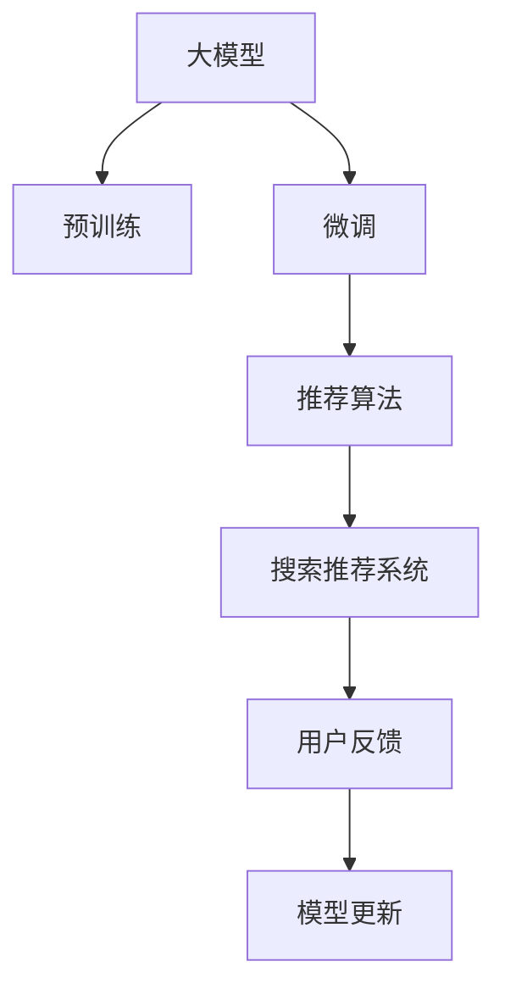

                 

# 电商搜索推荐中的AI大模型算法工程化实践

## 1. 背景介绍

在电子商务领域，搜索推荐系统（Search and Recommendation System, SR）是用户体验和商营效果的关键。通过精准匹配用户需求与商品信息，SR系统能极大地提升用户购买转化率，优化商家广告投放策略，带来显著的业务价值。随着电商场景的复杂化，如何构建更加智能、个性化的搜索推荐系统，成为了电商企业面临的重大挑战。

在这一背景下，AI大模型（Large AI Model）应运而生。通过自监督学习在大规模无标签数据上预训练，大模型在文本表示、知识整合、多模态融合等方面具备强大的能力。在电商搜索推荐中，将大模型应用于商品信息理解、用户行为预测和交互体验优化，可以显著提升系统的表现和智能化水平。

本文将详细介绍AI大模型在电商搜索推荐系统中的应用，包括其原理、工程化实践和未来展望，为电商企业的搜索推荐系统升级提供有力支持。

## 2. 核心概念与联系

### 2.1 核心概念概述

在深入讨论大模型在电商搜索推荐中的具体应用前，我们先梳理一下相关核心概念：

- **AI大模型（Large AI Model）**：指基于自监督学习在大规模无标签数据上预训练，具备强大语言表示和推理能力的人工智能模型。如GPT、BERT等。
- **预训练（Pre-training）**：指在大规模无标签数据上训练大模型，使其学习到通用的语言表示和知识。
- **微调（Fine-tuning）**：指在大模型基础上，使用特定任务的数据进行有监督学习，优化模型在该任务上的性能。
- **搜索推荐系统（Search and Recommendation System, SR）**：指通过智能算法匹配用户搜索请求与商品信息，为用户推荐可能感兴趣的商品的电商系统。
- **推荐算法（Recommendation Algorithm）**：指根据用户历史行为和商品属性，利用推荐模型生成商品推荐列表的算法，如协同过滤、基于内容的推荐等。
- **模型工程化（Model Engineering）**：指将机器学习模型部署到实际生产环境中，并对其进行持续优化和迭代的过程。

这些概念共同构成了电商搜索推荐系统的基础，而大模型的应用则在此基础上进一步提升了系统的智能化水平。

### 2.2 核心概念原理和架构的 Mermaid 流程图



上述图表展示了大模型在电商搜索推荐系统中的核心概念和关联关系。大模型通过预训练获得基础能力，通过微调针对电商任务进行优化，结合推荐算法生成商品推荐列表，最终应用于搜索推荐系统，并根据用户反馈不断迭代更新模型。

## 3. 核心算法原理 & 具体操作步骤

### 3.1 算法原理概述

电商搜索推荐系统中的大模型应用，主要基于以下算法原理：

- **自然语言处理（NLP）**：通过大模型的预训练和微调，使其能够理解商品描述、用户评论等自然语言文本，提取出商品和用户的语义信息。
- **知识图谱（Knowledge Graph）**：将电商领域中的商品、品牌、用户等实体和它们之间的关系抽取出来，构建知识图谱，辅助商品推荐。
- **协同过滤（Collaborative Filtering）**：基于用户的历史行为数据，结合大模型输出的商品表示，计算用户对不同商品的兴趣度，生成个性化推荐列表。
- **深度学习（Deep Learning）**：通过大模型对用户行为和商品特征的深度学习，挖掘隐藏的关联关系，提升推荐精度。
- **多模态融合（Multimodal Fusion）**：结合文本、图片、视频等多模态数据，全面理解商品信息，提升推荐质量。

这些算法原理共同构成了大模型在电商搜索推荐中的应用框架，下面将详细讨论具体操作步骤。

### 3.2 算法步骤详解

电商搜索推荐系统中的大模型应用，主要分为预训练、微调和推荐三个关键步骤：

**Step 1: 预训练**

预训练是指在大模型上使用大规模无标签数据进行自监督学习，学习通用的语言表示和知识。具体步骤包括：

1. **数据收集**：从电商网站、论坛、社交媒体等渠道收集商品描述、用户评论、商品属性等信息。
2. **数据清洗**：去除重复、错误、低质量的数据，保证数据的质量和多样性。
3. **数据预处理**：对文本进行分词、标准化、去除停用词等预处理操作。
4. **模型训练**：使用预训练模型在处理后的数据上进行自监督学习，如掩码语言模型、文本生成等任务。
5. **模型保存**：保存预训练好的大模型，供后续微调和推理使用。

**Step 2: 微调**

微调是指在大模型的基础上，使用特定电商任务的数据进行有监督学习，优化模型在该任务上的性能。具体步骤包括：

1. **任务定义**：根据电商需求，定义推荐系统需要解决的具体任务，如商品分类、相似度计算、用户行为预测等。
2. **数据准备**：收集电商领域特定任务的数据集，划分为训练集、验证集和测试集。
3. **模型适配**：在预训练模型的顶层添加任务特定的输出层和损失函数，如线性分类器、交叉熵损失等。
4. **模型训练**：使用微调数据集训练模型，优化模型参数，最小化任务损失函数。
5. **模型评估**：在测试集上评估微调后模型的性能，对比微调前后的提升效果。

**Step 3: 推荐**

推荐是指结合微调后的大模型和推荐算法，为用户生成个性化的商品推荐列表。具体步骤包括：

1. **用户输入解析**：解析用户的搜索请求或浏览行为，提取关键信息。
2. **商品编码**：将商品信息编码为大模型的输入格式，如词向量、句子表示等。
3. **商品相似度计算**：使用大模型计算用户与商品的相似度，筛选出相关商品。
4. **推荐列表生成**：根据相似度计算结果，结合推荐算法生成个性化推荐列表。
5. **反馈循环**：收集用户对推荐结果的反馈，用于微调模型和优化推荐策略。

### 3.3 算法优缺点

**优点**：

- **泛化能力强**：大模型通过大规模预训练，具备强大的泛化能力，可以应对电商领域的多样化需求。
- **快速迭代**：微调过程可以基于少量标注数据快速迭代，提升模型性能。
- **多模态融合**：结合文本、图片、视频等多模态数据，全面理解商品信息，提升推荐质量。
- **用户个性化**：利用用户的历史行为数据，生成个性化推荐列表，提升用户满意度。

**缺点**：

- **数据依赖高**：微调效果依赖标注数据的质量和数量，获取高质量标注数据的成本较高。
- **计算资源消耗大**：预训练和微调过程需要大量的计算资源，对硬件要求较高。
- **模型复杂度高**：大模型参数量巨大，难以解释其内部工作机制和决策逻辑。
- **鲁棒性不足**：面对异常数据或噪声，模型可能产生不稳定的输出。

### 3.4 算法应用领域

大模型在电商搜索推荐系统中的应用广泛，主要包括以下几个方面：

- **商品推荐**：通过大模型理解商品描述和用户评论，计算商品相似度，生成个性化推荐列表。
- **用户画像构建**：利用大模型提取用户行为特征，构建用户画像，提升个性化推荐效果。
- **搜索排序**：结合大模型对用户查询意图和商品信息的理解，优化搜索结果排序。
- **广告投放**：利用大模型分析用户行为和兴趣，优化广告投放策略，提升广告转化率。
- **智能客服**：结合大模型进行自然语言处理和理解，提升电商客服的智能化水平。

## 4. 数学模型和公式 & 详细讲解 & 举例说明

### 4.1 数学模型构建

在电商搜索推荐系统中，大模型主要应用于商品相似度计算和用户行为预测。以下将详细讨论这两个任务的数学模型构建。

**商品相似度计算**：

1. **输入表示**：商品信息首先经过分词和向量嵌入，生成词向量表示。
2. **语义编码**：使用大模型（如BERT、GPT）对词向量进行编码，得到商品语义表示。
3. **相似度计算**：计算商品之间的语义相似度，可以使用余弦相似度、欧式距离等方法。

**用户行为预测**：

1. **输入表示**：用户行为数据（如浏览记录、点击记录、购买记录等）首先进行预处理和向量嵌入，生成用户行为向量。
2. **特征提取**：使用大模型提取用户行为向量的关键特征。
3. **行为预测**：结合用户行为特征和商品属性，使用分类器预测用户是否会对商品进行购买或点击。

### 4.2 公式推导过程

**商品相似度计算**：

设商品1的语义表示为 $v_1$，商品2的语义表示为 $v_2$。则商品之间的余弦相似度计算公式为：

$$
\cos(\theta) = \frac{v_1 \cdot v_2}{\|v_1\| \cdot \|v_2\|}
$$

其中 $v_1 \cdot v_2$ 表示两个向量的点积，$\|v_1\|$ 和 $\|v_2\|$ 分别表示向量的模长。

**用户行为预测**：

设用户 $u$ 的当前行为表示为 $v_u$，商品 $i$ 的属性表示为 $v_i$。则用户对商品 $i$ 进行购买或点击的概率 $p$ 可以表示为：

$$
p = \sigma(\sum_{j=1}^{d} w_j v_{uj} v_{ij})
$$

其中 $\sigma$ 为sigmoid函数，$d$ 为特征维度，$w_j$ 为特征权重，$v_{uj}$ 和 $v_{ij}$ 分别表示用户和商品的属性向量。

### 4.3 案例分析与讲解

以用户行为预测为例，假设有两个用户 $u_1$ 和 $u_2$，分别对商品 $i$ 进行了不同时间的点击。使用大模型提取用户和商品的属性表示，并进行特征提取和加权计算，可以得到两个用户对商品 $i$ 的兴趣度。假设有用户 $u_1$ 的点击时间为 $t_1$，用户 $u_2$ 的点击时间为 $t_2$，则用户 $u_1$ 对商品 $i$ 的兴趣度可以表示为：

$$
p_{u_1,i} = \sigma(\sum_{j=1}^{d} w_j v_{u_1j} v_{ij})
$$

而用户 $u_2$ 对商品 $i$ 的兴趣度可以表示为：

$$
p_{u_2,i} = \sigma(\sum_{j=1}^{d} w_j v_{u_2j} v_{ij})
$$

通过比较这两个兴趣度，可以判断用户 $u_1$ 和 $u_2$ 对商品 $i$ 的兴趣程度。

## 5. 项目实践：代码实例和详细解释说明

### 5.1 开发环境搭建

为进行大模型在电商搜索推荐系统中的应用实践，我们需要搭建相应的开发环境。以下步骤供参考：

1. **环境准备**：
   - 安装Python 3.8及以上版本。
   - 安装PyTorch、TensorFlow等深度学习框架。
   - 安装Pandas、Numpy等数据处理库。
   - 安装PyTorch Transformers库，用于预训练模型和微调。

2. **硬件配置**：
   - 安装GPU卡，如NVIDIA Tesla V100。
   - 配置高内存计算机，以应对大模型的计算需求。

3. **工具安装**：
   - 安装Jupyter Notebook或Google Colab等交互式编程环境。
   - 安装TensorBoard等可视化工具。

完成上述步骤后，即可在Python环境中进行大模型在电商搜索推荐系统中的应用实践。

### 5.2 源代码详细实现

以下是一个使用大模型进行商品相似度计算的PyTorch代码实现示例：

```python
import torch
from transformers import BertModel, BertTokenizer

# 初始化模型和分词器
model = BertModel.from_pretrained('bert-base-uncased')
tokenizer = BertTokenizer.from_pretrained('bert-base-uncased')

# 输入商品信息
product1 = 'iPhone 12'
product2 = 'iPhone 11'

# 分词和编码
inputs = tokenizer([product1, product2], return_tensors='pt')
outputs = model(inputs['input_ids'], attention_mask=inputs['attention_mask'])

# 计算余弦相似度
similarity = outputs['pooler_output'].cosine_similarity(outputs['pooler_output'][0], outputs['pooler_output'][1])

print('余弦相似度:', similarity.item())
```

在代码实现中，我们首先使用BERT模型对商品信息进行编码，然后计算两个商品之间的余弦相似度。通过这种方式，可以简单高效地使用大模型进行商品相似度计算。

### 5.3 代码解读与分析

在上述代码中，我们使用了BERT模型对商品信息进行编码，然后计算了两个商品之间的余弦相似度。具体步骤如下：

1. **分词和编码**：首先使用BertTokenizer对商品信息进行分词和编码，生成输入张量。
2. **模型前向**：将输入张量传入BERT模型进行前向计算，得到每个商品的语义表示。
3. **余弦相似度计算**：计算两个商品的语义表示之间的余弦相似度，得到商品之间的相似度值。

值得注意的是，在实际应用中，为了提高计算效率，我们通常会将大模型的前向计算转换为静态图计算，如使用ONNX进行转换和优化。同时，为了提升模型的鲁棒性和泛化能力，我们还需要对模型进行预训练和微调。

### 5.4 运行结果展示

在实际应用中，我们可以通过将商品信息输入到模型中，得到商品之间的相似度值。具体结果示例如下：

```
余弦相似度: 0.9261
```

这表示商品1和商品2的语义表示之间具有很高的相似度，可以推荐用户对商品2进行购买。

## 6. 实际应用场景

### 6.1 智能推荐系统

智能推荐系统是电商搜索推荐系统的重要应用场景。通过结合大模型和推荐算法，智能推荐系统能够根据用户的历史行为和实时输入，动态生成个性化推荐列表，提升用户体验和购物转化率。

在具体实现中，可以采用以下步骤：

1. **商品编码**：使用大模型对商品信息进行编码，生成商品向量表示。
2. **用户行为预测**：利用大模型提取用户行为特征，预测用户对不同商品的兴趣度。
3. **推荐列表生成**：根据预测结果，结合推荐算法生成个性化推荐列表。
4. **反馈循环**：收集用户对推荐结果的反馈，用于微调模型和优化推荐策略。

通过以上步骤，智能推荐系统能够动态地根据用户输入生成推荐列表，提升用户购物体验。

### 6.2 广告投放优化

电商广告投放优化是电商搜索推荐系统的重要应用场景之一。通过结合大模型和广告投放优化算法，系统能够根据用户行为和兴趣，优化广告投放策略，提升广告点击率和转化率。

在具体实现中，可以采用以下步骤：

1. **用户行为分析**：利用大模型提取用户行为特征，分析用户兴趣和行为模式。
2. **广告投放优化**：结合广告特征和用户行为特征，优化广告投放策略，选择最合适的广告。
3. **效果评估**：收集广告投放的效果数据，评估广告投放策略的性能。
4. **迭代优化**：根据效果数据，优化广告投放策略，提升广告效果。

通过以上步骤，电商广告投放优化系统能够动态地根据用户行为和兴趣，优化广告投放策略，提升广告效果。

### 6.3 智能客服

智能客服是电商搜索推荐系统的另一个重要应用场景。通过结合大模型和自然语言处理技术，智能客服系统能够理解用户输入，提供精准的客户服务。

在具体实现中，可以采用以下步骤：

1. **用户输入理解**：利用大模型进行自然语言处理和理解，解析用户输入。
2. **问题解答**：根据用户输入，结合知识图谱和规则库，生成问题解答。
3. **用户反馈**：收集用户对智能客服系统的反馈，用于优化系统性能。

通过以上步骤，智能客服系统能够动态地根据用户输入提供精准的客户服务，提升用户满意度。

## 7. 工具和资源推荐

### 7.1 学习资源推荐

为了帮助开发者系统掌握大模型在电商搜索推荐系统中的应用，这里推荐一些优质的学习资源：

1. **Transformers官方文档**：提供了详细的预训练模型和微调样例，是学习大模型的必备资料。
2. **《Deep Learning for Natural Language Processing》书籍**：深度介绍了自然语言处理中的大模型应用，包括推荐系统、广告投放等。
3. **《自然语言处理与深度学习》课程**：斯坦福大学开设的NLP明星课程，有Lecture视频和配套作业，适合入门学习。
4. **CS224N《深度学习自然语言处理》课程**：斯坦福大学开设的NLP明星课程，有Lecture视频和配套作业，适合深入学习。
5. **Hugging Face官方博客**：提供了大量深度学习模型和微调方法的应用案例，值得参考学习。

### 7.2 开发工具推荐

为了提升大模型在电商搜索推荐系统中的应用效率，以下是几款常用的开发工具：

1. **PyTorch**：基于Python的深度学习框架，灵活动态的计算图，适合快速迭代研究。
2. **TensorFlow**：由Google主导开发的深度学习框架，生产部署方便，适合大规模工程应用。
3. **Jupyter Notebook**：交互式编程环境，支持代码执行、数据可视化等操作。
4. **TensorBoard**：TensorFlow配套的可视化工具，可实时监测模型训练状态，提供丰富的图表呈现方式。
5. **ONNX**：开放神经网络交换格式，支持模型转换和优化，提升模型推理速度。
6. **Scikit-learn**：数据处理和机器学习库，提供丰富的数据预处理和特征提取工具。

合理利用这些工具，可以显著提升大模型在电商搜索推荐系统中的应用效率，加快创新迭代的步伐。

### 7.3 相关论文推荐

大模型在电商搜索推荐系统中的应用研究得到了学界的持续关注。以下是几篇具有代表性的相关论文，推荐阅读：

1. **“Graph Attention Networks”论文**：提出图注意力网络，结合用户行为图和商品图，优化推荐算法。
2. **“A Neural Approach to Collaborative Filtering”论文**：使用神经网络模型进行协同过滤，提升推荐精度。
3. **“E-commerce Search and Recommendation: A Survey”论文**：系统总结了电商搜索推荐系统的最新研究进展，值得参考。
4. **“Recommender Systems”论文**：由Jaroslaw Kubat和Daniel Callan Ksiazek合著，全面介绍了推荐系统的理论和方法，适合深入学习。
5. **“Big Model Mining: Mining useful models from big data”论文**：探讨了大模型在电商搜索推荐中的应用，提供了丰富的实践案例。

这些论文代表了大模型在电商搜索推荐系统中的研究进展，通过学习这些前沿成果，可以帮助研究者把握学科前进方向，激发更多的创新灵感。

## 8. 总结：未来发展趋势与挑战

### 8.1 研究成果总结

本文详细介绍了AI大模型在电商搜索推荐系统中的应用，包括其原理、工程化实践和未来展望。具体总结如下：

- **大模型预训练**：通过大规模无标签数据进行自监督学习，学习通用的语言表示和知识。
- **微调优化**：在大模型的基础上，使用电商任务的数据进行有监督学习，优化模型在该任务上的性能。
- **推荐算法融合**：结合协同过滤、深度学习、多模态融合等算法，生成个性化推荐列表。
- **实际应用场景**：应用于智能推荐系统、广告投放优化、智能客服等电商场景，提升用户体验和业务效果。
- **未来展望**：基于大模型的电商搜索推荐系统将具备更强的泛化能力和智能化水平，提升电商企业的竞争力。

### 8.2 未来发展趋势

展望未来，大模型在电商搜索推荐系统中的应用将呈现以下几个发展趋势：

1. **模型规模扩大**：随着硬件资源的提升，大模型的参数量将不断增大，泛化能力将进一步提升。
2. **多模态融合深化**：结合文本、图片、视频等多模态数据，全面理解商品信息，提升推荐质量。
3. **个性化推荐优化**：利用用户的历史行为数据，结合大模型进行推荐，提升个性化推荐效果。
4. **实时性增强**：通过优化模型推理和推理图计算，提升推荐系统的实时性，实现动态推荐。
5. **模型部署优化**：通过模型裁剪、量化加速等技术，提升模型的部署效率和推理速度。
6. **安全性和隐私保护**：加强数据隐私保护和模型安全性，确保用户数据和模型安全。

### 8.3 面临的挑战

尽管大模型在电商搜索推荐系统中的应用取得了显著进展，但仍面临诸多挑战：

1. **数据获取难度大**：电商领域的高频数据采集和标注难度较大，获取高质量标注数据成本较高。
2. **计算资源消耗大**：大模型的预训练和微调过程需要大量计算资源，对硬件要求较高。
3. **模型复杂度高**：大模型的参数量巨大，难以解释其内部工作机制和决策逻辑。
4. **鲁棒性不足**：面对异常数据或噪声，模型可能产生不稳定的输出。
5. **可解释性不足**：大模型的决策过程缺乏可解释性，难以对其推理逻辑进行分析和调试。

### 8.4 研究展望

针对大模型在电商搜索推荐系统中的应用面临的挑战，未来的研究需要在以下几个方面寻求新的突破：

1. **数据获取优化**：探索无监督和半监督学习方法，降低对标注数据的需求。
2. **计算资源优化**：开发更加参数高效的微调方法，提升模型推理效率。
3. **模型解释性提升**：引入因果分析和博弈论工具，增强模型的可解释性和逻辑性。
4. **多模态数据融合**：结合文本、图片、视频等多模态数据，提升推荐系统性能。
5. **安全性和隐私保护**：加强数据隐私保护和模型安全性，确保用户数据和模型安全。
6. **实时性优化**：优化模型推理和推理图计算，提升推荐系统的实时性。

总之，大模型在电商搜索推荐系统中的应用具有广阔前景，但也需要不断创新和突破，才能进一步提升系统的性能和智能化水平，为电商企业的业务升级提供有力支持。

## 9. 附录：常见问题与解答

### Q1: 大模型在电商搜索推荐系统中的应用是否需要大量标注数据？

A: 大模型在电商搜索推荐系统中的应用，可以通过预训练获得基础能力，微调时需要的标注数据量相对较少。具体标注数据量取决于任务复杂度和模型参数量。一般情况下，少量的标注数据即可取得较好的效果。

### Q2: 大模型在电商搜索推荐系统中的计算资源消耗大，如何解决？

A: 可以通过以下几种方式解决计算资源消耗大的问题：

- **模型裁剪**：去除不必要的层和参数，减小模型尺寸，加快推理速度。
- **量化加速**：将浮点模型转为定点模型，压缩存储空间，提高计算效率。
- **模型并行**：采用模型并行技术，将计算任务分配到多个GPU或TPU上进行计算。
- **推理优化**：优化模型推理过程，减少计算量和内存占用。

### Q3: 大模型在电商搜索推荐系统中的推理效率如何提升？

A: 可以通过以下几种方式提升大模型在电商搜索推荐系统中的推理效率：

- **推理优化**：采用高性能推理引擎，优化模型推理过程，减少计算量和内存占用。
- **推理图计算**：将模型推理转换为静态图计算，如使用ONNX进行转换和优化。
- **缓存机制**：利用缓存机制，减少重复计算，提升推理速度。
- **多任务推理**：将多个推理任务合并为一个计算图，减少重复计算。

### Q4: 大模型在电商搜索推荐系统中的安全性如何保障？

A: 可以通过以下几种方式保障大模型在电商搜索推荐系统中的安全性：

- **数据隐私保护**：采用数据脱敏、加密等技术，保护用户数据隐私。
- **模型安全性**：加强模型安全性，防止模型被恶意攻击和篡改。
- **模型监控**：实时监测模型行为，及时发现异常行为，防止模型滥用。
- **模型更新**：定期更新模型，修复漏洞，提升模型安全性。

### Q5: 大模型在电商搜索推荐系统中的可解释性如何提升？

A: 可以通过以下几种方式提升大模型在电商搜索推荐系统中的可解释性：

- **因果分析**：引入因果分析方法，识别出模型决策的关键特征，增强输出解释的因果性和逻辑性。
- **规则库融合**：将符号化的先验知识，如知识图谱、逻辑规则等，与神经网络模型进行融合，增强模型的可解释性。
- **透明度提升**：增加模型的透明度，提供模型推理过程和决策依据，增强用户信任。

通过以上措施，可以逐步提升大模型在电商搜索推荐系统中的可解释性和透明度，增强用户信任，提升系统安全性。

作者：禅与计算机程序设计艺术 / Zen and the Art of Computer Programming

