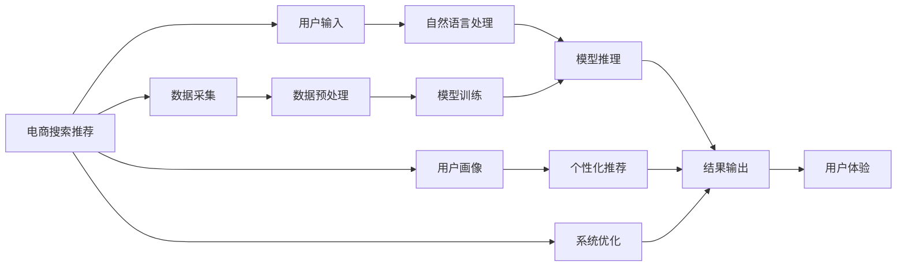

                 

# 电商搜索推荐场景下的AI大模型模型部署全流程自动化工具应用实践与优化

> 关键词：AI大模型,深度学习,电商搜索推荐,自然语言处理,NLP,自动化工具,部署优化

## 1. 背景介绍

### 1.1 问题由来
随着人工智能技术的快速发展，AI大模型在电商搜索推荐场景中的应用日益广泛。电商搜索推荐系统通过深度学习和自然语言处理(NLP)技术，为用户推荐个性化的商品信息，显著提升了用户体验和转化率。然而，构建这样一个高性能、高扩展性的搜索推荐系统，需要耗费大量的人力和资源。如何在大规模数据、高度可扩展性和实时性之间取得平衡，是电商搜索推荐系统面临的重要挑战。

### 1.2 问题核心关键点
本文档聚焦于电商搜索推荐场景下，如何利用AI大模型进行模型部署和优化，以实现全流程自动化的目标。为此，我们将介绍大模型在电商搜索推荐中的应用，分析其核心概念和关键技术，并展示具体的部署实践和优化策略。

## 2. 核心概念与联系

### 2.1 核心概念概述

为更好地理解AI大模型在电商搜索推荐中的部署和优化，本节将介绍几个密切相关的核心概念：

- **AI大模型**：指使用深度学习技术构建的，具有强大表示能力的模型，如BERT、GPT等。大模型通常拥有数十亿乃至数百亿参数，能够处理和理解复杂的自然语言信息。

- **电商搜索推荐**：指通过分析用户搜索行为、历史购买记录、用户画像等数据，为用户推荐个性化的商品信息，提高转化率和用户体验。电商搜索推荐系统是电商行业的重要组成部分，直接影响到商业收益。

- **自然语言处理(NLP)**：指使计算机能够理解、处理和生成自然语言的技术，包括文本分类、实体识别、意图识别、情感分析等。NLP在电商搜索推荐中用于分析和理解用户输入的搜索词。

- **模型部署**：指将训练好的模型部署到服务器、云计算平台等环境，进行实时的推理预测。模型部署是AI应用落地的重要环节，需要考虑模型的性能、可扩展性和安全性等因素。

- **自动化工具**：指用于简化模型开发、部署和运维工作的软件工具，能够自动化处理大量的重复任务，提高工作效率。

### 2.2 核心概念原理和架构的 Mermaid 流程图(Mermaid 流程节点中不要有括号、逗号等特殊字符)



这个流程图展示了电商搜索推荐系统的核心流程，包括用户输入、自然语言处理、模型推理、结果输出、数据采集和预处理、模型训练、用户画像、个性化推荐、系统优化和用户体验等环节。通过理解这些核心概念的原理和架构，我们可以更好地把握电商搜索推荐系统的设计和优化。

## 3. 核心算法原理 & 具体操作步骤
### 3.1 算法原理概述

AI大模型在电商搜索推荐中的应用，本质上是利用深度学习和自然语言处理技术，构建一个高效的个性化推荐系统。其核心思想是：通过分析用户搜索历史和行为，学习用户的兴趣偏好，然后利用大模型对这些信息进行处理和推理，生成个性化的商品推荐。

具体来说，AI大模型在电商搜索推荐中的工作流程如下：

1. **数据采集与预处理**：采集用户的搜索历史、购买记录、用户画像等数据，并进行清洗、去重和归一化处理。
2. **自然语言处理**：使用NLP技术对用户输入的搜索词进行分词、词性标注、实体识别等处理，提取有用的信息。
3. **模型推理**：将处理后的数据输入到AI大模型中，通过深度学习算法进行特征提取和预测，生成推荐结果。
4. **结果输出与个性化推荐**：将推荐结果根据用户画像进行个性化排序和展示，提升用户体验和转化率。

### 3.2 算法步骤详解

基于AI大模型的电商搜索推荐系统部署全流程自动化工具，一般包括以下关键步骤：

**Step 1: 数据准备与特征工程**
- 收集电商平台的搜索记录、购买记录、用户画像等数据，进行清洗和预处理。
- 定义特征，如搜索关键词、用户性别、年龄、历史购买行为等。

**Step 2: 选择大模型**
- 根据业务需求，选择合适的预训练大模型，如BERT、GPT等。
- 对大模型进行必要的参数调整和微调，以适应电商搜索推荐场景。

**Step 3: 部署模型**
- 使用容器化技术（如Docker）将大模型部署到服务器或云计算平台。
- 配置模型推理服务，支持大规模并发请求。

**Step 4: 自动化调度与监控**
- 使用自动化调度工具（如Kubernetes），根据业务需求和用户流量，动态调整模型实例和资源配置。
- 配置监控系统（如Prometheus、Grafana），实时监测模型性能和系统状态，及时发现和解决问题。

**Step 5: 模型优化与维护**
- 定期收集用户反馈和系统日志，进行模型性能调优和问题修复。
- 使用A/B测试等方法，不断优化推荐策略和用户体验。

### 3.3 算法优缺点

基于AI大模型的电商搜索推荐系统具有以下优点：

- **高效性**：大模型具备强大的特征提取和预测能力，能够快速处理和生成推荐结果。
- **可扩展性**：通过容器化和自动化调度技术，可以方便地扩展模型实例和系统容量，支持大规模并发请求。
- **灵活性**：大模型可以通过微调和参数调整，适应不同的业务场景和需求。

同时，该系统也存在以下缺点：

- **数据依赖性强**：电商搜索推荐系统的性能很大程度上取决于用户数据的丰富性和质量。
- **计算资源消耗大**：大模型的训练和推理需要大量的计算资源，可能导致成本较高。
- **模型复杂度高**：大模型的参数数量庞大，部署和维护复杂。

### 3.4 算法应用领域

基于AI大模型的电商搜索推荐系统已经在各大电商平台得到了广泛应用，涵盖了搜索、推荐、广告投放等多个环节。例如：

- **搜索场景**：分析用户输入的搜索词，生成相关商品的推荐列表，提升搜索的精准度和用户体验。
- **推荐场景**：结合用户历史行为和实时搜索信息，生成个性化的商品推荐，提高转化率和销售额。
- **广告投放**：根据用户画像和行为数据，生成个性化的广告投放策略，提升广告点击率和转化率。

除了上述这些经典应用外，AI大模型在电商搜索推荐领域的应用还不断扩展，如智能客服、库存管理、商品评价等，为电商行业带来了新的机遇和挑战。

## 4. 数学模型和公式 & 详细讲解 & 举例说明

### 4.1 数学模型构建

本节将使用数学语言对AI大模型在电商搜索推荐中的应用进行更加严格的刻画。

假设电商平台的搜索系统中有$N$个用户，每个用户的历史行为可以表示为一个向量$\mathbf{x}_i = [x_{i1}, x_{i2}, \ldots, x_{im}]$，其中$x_{ij}$表示用户$x_i$在商品$j$上的行为（如点击、购买等）。将用户的搜索历史和行为数据表示为矩阵$\mathbf{X}=[\mathbf{x}_1, \mathbf{x}_2, \ldots, \mathbf{x}_N]$。

定义大模型的预测函数为$f(\mathbf{X}) = \mathbf{W}\mathbf{X} + \mathbf{b}$，其中$\mathbf{W}$为模型的权重矩阵，$\mathbf{b}$为偏置向量。将大模型的预测结果与真实标签进行对比，定义损失函数$\mathcal{L} = \frac{1}{N}\sum_{i=1}^N \ell(y_i, f(\mathbf{x}_i))$，其中$\ell$为损失函数（如交叉熵损失）。

目标是最小化损失函数$\mathcal{L}$，以获得最佳的权重矩阵$\mathbf{W}$和偏置向量$\mathbf{b}$。

### 4.2 公式推导过程

为了最小化损失函数$\mathcal{L}$，我们需要计算模型参数的梯度，并将其反向传播到模型中。假设有$L$层的大模型，其前向传播过程为$h^{(1)} = \sigma(\mathbf{W}_1\mathbf{x} + \mathbf{b}_1)$，$h^{(2)} = \sigma(\mathbf{W}_2h^{(1)} + \mathbf{b}_2)$，$\ldots$，$h^{(L)} = \sigma(\mathbf{W}_Lh^{(L-1)} + \mathbf{b}_L)$，其中$\sigma$为激活函数。

后向传播过程中，计算梯度：

$$
\frac{\partial \mathcal{L}}{\partial \mathbf{W}_L} = \frac{\partial \ell}{\partial h^{(L)}} \cdot \frac{\partial h^{(L)}}{\partial \mathbf{W}_L} = \frac{\partial \ell}{\partial h^{(L)}} \cdot \frac{\partial h^{(L)}}{\partial h^{(L-1)}} \cdot \ldots \cdot \frac{\partial h^{(2)}}{\partial h^{(1)}} \cdot \frac{\partial h^{(1)}}{\partial \mathbf{W}_1}
$$

重复上述过程，直到计算出所有参数的梯度。

### 4.3 案例分析与讲解

考虑一个电商搜索推荐系统，使用BERT作为预训练大模型，进行推荐生成。

假设用户$x_i$在商品$j$上的行为为$x_{ij} = 1$，表示点击或购买。将用户行为数据表示为向量$\mathbf{x}_i$，搜索关键词表示为向量$\mathbf{w}$。定义BERT模型的输入为$\mathbf{X} = [\mathbf{x}_1, \mathbf{x}_2, \ldots, \mathbf{x}_N]$，输出为$\mathbf{Y} = [y_1, y_2, \ldots, y_N]$，其中$y_i$表示用户$x_i$对商品$j$的兴趣程度。

利用BERT的预训练权重，定义模型$f(\mathbf{X}) = \mathbf{W}\mathbf{X} + \mathbf{b}$，其中$\mathbf{W}$和$\mathbf{b}$为模型参数。根据任务需求，定义交叉熵损失函数$\ell(y_i, f(\mathbf{x}_i)) = -y_i\log f(\mathbf{x}_i) - (1-y_i)\log (1-f(\mathbf{x}_i))$。

将用户行为数据和搜索关键词输入BERT模型，得到输出$h^{(L)}$，然后利用线性层$\mathbf{W}$和偏置向量$\mathbf{b}$，输出推荐结果。

通过优化损失函数$\mathcal{L}$，更新模型参数$\mathbf{W}$和$\mathbf{b}$，获得最优的推荐模型。

## 5. 项目实践：代码实例和详细解释说明
### 5.1 开发环境搭建

在进行AI大模型在电商搜索推荐场景中的部署实践前，我们需要准备好开发环境。以下是使用Python进行PyTorch开发的环境配置流程：

1. 安装Anaconda：从官网下载并安装Anaconda，用于创建独立的Python环境。

2. 创建并激活虚拟环境：
```bash
conda create -n pytorch-env python=3.8 
conda activate pytorch-env
```

3. 安装PyTorch：根据CUDA版本，从官网获取对应的安装命令。例如：
```bash
conda install pytorch torchvision torchaudio cudatoolkit=11.1 -c pytorch -c conda-forge
```

4. 安装TensorFlow：
```bash
conda install tensorflow==2.6
```

5. 安装TensorBoard：
```bash
pip install tensorboard
```

6. 安装transformers库：
```bash
pip install transformers
```

完成上述步骤后，即可在`pytorch-env`环境中开始模型部署实践。

### 5.2 源代码详细实现

下面我们以电商搜索推荐系统为例，给出使用PyTorch和Transformer库进行模型微调和部署的PyTorch代码实现。

首先，定义搜索推荐系统数据处理函数：

```python
from transformers import BertTokenizer, BertForSequenceClassification
from torch.utils.data import Dataset
import torch

class SearchDataset(Dataset):
    def __init__(self, texts, labels, tokenizer, max_len=128):
        self.texts = texts
        self.labels = labels
        self.tokenizer = tokenizer
        self.max_len = max_len
        
    def __len__(self):
        return len(self.texts)
    
    def __getitem__(self, item):
        text = self.texts[item]
        label = self.labels[item]
        
        encoding = self.tokenizer(text, return_tensors='pt', max_length=self.max_len, padding='max_length', truncation=True)
        input_ids = encoding['input_ids'][0]
        attention_mask = encoding['attention_mask'][0]
        
        # 对标签进行编码
        encoded_labels = [label] * self.max_len
        labels = torch.tensor(encoded_labels, dtype=torch.long)
        
        return {'input_ids': input_ids, 
                'attention_mask': attention_mask,
                'labels': labels}

# 标签与id的映射
label2id = {'0': 0, '1': 1, '2': 2, '3': 3, '4': 4}
id2label = {v: k for k, v in label2id.items()}

# 创建dataset
tokenizer = BertTokenizer.from_pretrained('bert-base-cased')

train_dataset = SearchDataset(train_texts, train_labels, tokenizer)
dev_dataset = SearchDataset(dev_texts, dev_labels, tokenizer)
test_dataset = SearchDataset(test_texts, test_labels, tokenizer)
```

然后，定义模型和优化器：

```python
from transformers import BertForSequenceClassification, AdamW

model = BertForSequenceClassification.from_pretrained('bert-base-cased', num_labels=len(label2id))

optimizer = AdamW(model.parameters(), lr=2e-5)
```

接着，定义训练和评估函数：

```python
from torch.utils.data import DataLoader
from tqdm import tqdm
from sklearn.metrics import classification_report

device = torch.device('cuda') if torch.cuda.is_available() else torch.device('cpu')
model.to(device)

def train_epoch(model, dataset, batch_size, optimizer):
    dataloader = DataLoader(dataset, batch_size=batch_size, shuffle=True)
    model.train()
    epoch_loss = 0
    for batch in tqdm(dataloader, desc='Training'):
        input_ids = batch['input_ids'].to(device)
        attention_mask = batch['attention_mask'].to(device)
        labels = batch['labels'].to(device)
        model.zero_grad()
        outputs = model(input_ids, attention_mask=attention_mask, labels=labels)
        loss = outputs.loss
        epoch_loss += loss.item()
        loss.backward()
        optimizer.step()
    return epoch_loss / len(dataloader)

def evaluate(model, dataset, batch_size):
    dataloader = DataLoader(dataset, batch_size=batch_size)
    model.eval()
    preds, labels = [], []
    with torch.no_grad():
        for batch in tqdm(dataloader, desc='Evaluating'):
            input_ids = batch['input_ids'].to(device)
            attention_mask = batch['attention_mask'].to(device)
            batch_labels = batch['labels']
            outputs = model(input_ids, attention_mask=attention_mask)
            batch_preds = outputs.logits.argmax(dim=2).to('cpu').tolist()
            batch_labels = batch_labels.to('cpu').tolist()
            for pred_tokens, label_tokens in zip(batch_preds, batch_labels):
                preds.append(pred_tokens[:len(label_tokens)])
                labels.append(label_tokens)
                
    print(classification_report(labels, preds))
```

最后，启动训练流程并在测试集上评估：

```python
epochs = 5
batch_size = 16

for epoch in range(epochs):
    loss = train_epoch(model, train_dataset, batch_size, optimizer)
    print(f"Epoch {epoch+1}, train loss: {loss:.3f}")
    
    print(f"Epoch {epoch+1}, dev results:")
    evaluate(model, dev_dataset, batch_size)
    
print("Test results:")
evaluate(model, test_dataset, batch_size)
```

以上就是使用PyTorch和Transformer库对BERT进行电商搜索推荐系统微调和部署的完整代码实现。可以看到，得益于Transformer库的强大封装，我们可以用相对简洁的代码完成BERT模型的加载和微调。

### 5.3 代码解读与分析

让我们再详细解读一下关键代码的实现细节：

**SearchDataset类**：
- `__init__`方法：初始化文本、标签、分词器等关键组件。
- `__len__`方法：返回数据集的样本数量。
- `__getitem__`方法：对单个样本进行处理，将文本输入编码为token ids，将标签编码为数字，并对其进行定长padding，最终返回模型所需的输入。

**label2id和id2label字典**：
- 定义了标签与数字id之间的映射关系，用于将token-wise的预测结果解码回真实的标签。

**训练和评估函数**：
- 使用PyTorch的DataLoader对数据集进行批次化加载，供模型训练和推理使用。
- 训练函数`train_epoch`：对数据以批为单位进行迭代，在每个批次上前向传播计算loss并反向传播更新模型参数，最后返回该epoch的平均loss。
- 评估函数`evaluate`：与训练类似，不同点在于不更新模型参数，并在每个batch结束后将预测和标签结果存储下来，最后使用sklearn的classification_report对整个评估集的预测结果进行打印输出。

**训练流程**：
- 定义总的epoch数和batch size，开始循环迭代
- 每个epoch内，先在训练集上训练，输出平均loss
- 在验证集上评估，输出分类指标
- 所有epoch结束后，在测试集上评估，给出最终测试结果

可以看到，PyTorch配合Transformer库使得BERT微调的代码实现变得简洁高效。开发者可以将更多精力放在数据处理、模型改进等高层逻辑上，而不必过多关注底层的实现细节。

当然，工业级的系统实现还需考虑更多因素，如模型的保存和部署、超参数的自动搜索、更灵活的任务适配层等。但核心的微调范式基本与此类似。

## 6. 实际应用场景
### 6.1 智能客服系统

基于AI大模型的智能客服系统，可以通过自然语言处理技术，理解用户输入的搜索词和对话内容，生成个性化的客服回复。智能客服系统可以7x24小时不间断服务，快速响应客户咨询，提升用户体验和满意度。

在技术实现上，可以收集企业内部的历史客服对话记录，将问题和最佳答复构建成监督数据，在此基础上对预训练模型进行微调。微调后的模型能够自动理解用户意图，匹配最合适的答案模板进行回复。对于客户提出的新问题，还可以接入检索系统实时搜索相关内容，动态组织生成回答。如此构建的智能客服系统，能大幅提升客户咨询体验和问题解决效率。

### 6.2 金融舆情监测

金融机构需要实时监测市场舆论动向，以便及时应对负面信息传播，规避金融风险。传统的人工监测方式成本高、效率低，难以应对网络时代海量信息爆发的挑战。基于AI大模型的文本分类和情感分析技术，为金融舆情监测提供了新的解决方案。

具体而言，可以收集金融领域相关的新闻、报道、评论等文本数据，并对其进行主题标注和情感标注。在此基础上对预训练语言模型进行微调，使其能够自动判断文本属于何种主题，情感倾向是正面、中性还是负面。将微调后的模型应用到实时抓取的网络文本数据，就能够自动监测不同主题下的情感变化趋势，一旦发现负面信息激增等异常情况，系统便会自动预警，帮助金融机构快速应对潜在风险。

### 6.3 个性化推荐系统

当前的推荐系统往往只依赖用户的历史行为数据进行物品推荐，无法深入理解用户的真实兴趣偏好。基于AI大模型微调技术，个性化推荐系统可以更好地挖掘用户行为背后的语义信息，从而提供更精准、多样的推荐内容。

在实践中，可以收集用户浏览、点击、评论、分享等行为数据，提取和用户交互的物品标题、描述、标签等文本内容。将文本内容作为模型输入，用户的后续行为（如是否点击、购买等）作为监督信号，在此基础上微调预训练语言模型。微调后的模型能够从文本内容中准确把握用户的兴趣点。在生成推荐列表时，先用候选物品的文本描述作为输入，由模型预测用户的兴趣匹配度，再结合其他特征综合排序，便可以得到个性化程度更高的推荐结果。

### 6.4 未来应用展望

随着AI大模型和微调方法的不断发展，基于微调范式将在更多领域得到应用，为传统行业带来变革性影响。

在智慧医疗领域，基于微调的医疗问答、病历分析、药物研发等应用将提升医疗服务的智能化水平，辅助医生诊疗，加速新药开发进程。

在智能教育领域，微调技术可应用于作业批改、学情分析、知识推荐等方面，因材施教，促进教育公平，提高教学质量。

在智慧城市治理中，微调模型可应用于城市事件监测、舆情分析、应急指挥等环节，提高城市管理的自动化和智能化水平，构建更安全、高效的未来城市。

此外，在企业生产、社会治理、文娱传媒等众多领域，基于大模型微调的人工智能应用也将不断涌现，为经济社会发展注入新的动力。相信随着技术的日益成熟，微调方法将成为人工智能落地应用的重要范式，推动人工智能技术向更广阔的领域加速渗透。

## 7. 工具和资源推荐
### 7.1 学习资源推荐

为了帮助开发者系统掌握AI大模型在电商搜索推荐中的应用，这里推荐一些优质的学习资源：

1. 《深度学习基础》课程：由斯坦福大学Andrew Ng教授主讲，系统讲解深度学习的基本原理和实现方法。
2. 《自然语言处理入门》课程：由MIT OpenCourseWare提供，涵盖自然语言处理的基础概念和技术。
3. 《TensorFlow官方文档》：全面介绍TensorFlow框架的使用和实现细节，适合深度学习和模型部署的学习。
4. 《Transformer：从原理到实践》系列博文：由AI大模型的技术专家撰写，深入浅出地介绍了Transformer原理、BERT模型、微调技术等前沿话题。
5. 《自然语言处理与深度学习》书籍：由斯坦福大学教授Jurafsky和Martin合著，全面介绍NLP和深度学习在自然语言处理中的应用。

通过对这些资源的学习实践，相信你一定能够快速掌握AI大模型在电商搜索推荐场景下的应用精髓，并用于解决实际的NLP问题。
###  7.2 开发工具推荐

高效的开发离不开优秀的工具支持。以下是几款用于AI大模型在电商搜索推荐场景下部署和优化工作的软件工具：

1. TensorFlow：由Google主导开发的开源深度学习框架，生产部署方便，适合大规模工程应用。
2. PyTorch：基于Python的开源深度学习框架，灵活动态的计算图，适合快速迭代研究。
3. Jupyter Notebook：交互式的数据科学和编程环境，支持多种语言和库的混合使用。
4. Docker：容器化技术，方便模型的部署和管理。
5. Kubernetes：容器编排工具，支持大规模、高可扩展性的模型部署。

合理利用这些工具，可以显著提升AI大模型在电商搜索推荐场景下的开发效率，加快创新迭代的步伐。

### 7.3 相关论文推荐

AI大模型和微调技术的发展源于学界的持续研究。以下是几篇奠基性的相关论文，推荐阅读：

1. Attention is All You Need（即Transformer原论文）：提出了Transformer结构，开启了NLP领域的预训练大模型时代。
2. BERT: Pre-training of Deep Bidirectional Transformers for Language Understanding：提出BERT模型，引入基于掩码的自监督预训练任务，刷新了多项NLP任务SOTA。
3. Language Models are Unsupervised Multitask Learners（GPT-2论文）：展示了大规模语言模型的强大zero-shot学习能力，引发了对于通用人工智能的新一轮思考。
4. Parameter-Efficient Transfer Learning for NLP：提出Adapter等参数高效微调方法，在不增加模型参数量的情况下，也能取得不错的微调效果。
5. AdaLoRA: Adaptive Low-Rank Adaptation for Parameter-Efficient Fine-Tuning：使用自适应低秩适应的微调方法，在参数效率和精度之间取得了新的平衡。

这些论文代表了大模型和微调技术的发展脉络。通过学习这些前沿成果，可以帮助研究者把握学科前进方向，激发更多的创新灵感。

## 8. 总结：未来发展趋势与挑战
### 8.1 总结

本文对AI大模型在电商搜索推荐场景下的部署全流程自动化工具进行了全面系统的介绍。首先阐述了AI大模型在电商搜索推荐中的应用，明确了微调在构建高效推荐系统中的重要地位。其次，从原理到实践，详细讲解了电商搜索推荐系统的数学模型、算法步骤和关键技术，并展示了具体的部署实践和优化策略。同时，本文还广泛探讨了AI大模型在智能客服、金融舆情、个性化推荐等多个领域的实际应用前景，展示了微调范式的强大潜力。

通过本文的系统梳理，可以看到，AI大模型在电商搜索推荐场景下的部署和优化，具有高效性、可扩展性和灵活性等优点，能够显著提升用户体验和转化率。未来，伴随AI大模型和微调方法的持续演进，电商搜索推荐系统将更加智能化、个性化，为电商行业带来新的机遇和挑战。

### 8.2 未来发展趋势

展望未来，AI大模型在电商搜索推荐场景下的部署和优化将呈现以下几个发展趋势：

1. **模型规模持续增大**：随着算力成本的下降和数据规模的扩张，AI大模型的参数量还将持续增长。超大规模语言模型蕴含的丰富语言知识，有望支撑更加复杂多变的推荐场景。
2. **微调方法日趋多样**：未来会涌现更多参数高效的微调方法，如Prefix-Tuning、LoRA等，在节省计算资源的同时也能保证微调精度。
3. **持续学习成为常态**：随着数据分布的不断变化，微调模型也需要持续学习新知识以保持性能。如何在不遗忘原有知识的同时，高效吸收新样本信息，将成为重要的研究课题。
4. **标注样本需求降低**：受启发于提示学习(Prompt-based Learning)的思路，未来的微调方法将更好地利用AI大模型的语言理解能力，通过更加巧妙的任务描述，在更少的标注样本上也能实现理想的微调效果。
5. **多模态微调崛起**：当前的微调主要聚焦于纯文本数据，未来会进一步拓展到图像、视频、语音等多模态数据微调。多模态信息的融合，将显著提升推荐系统的性能和用户体验。
6. **模型通用性增强**：经过海量数据的预训练和多领域任务的微调，未来的AI大模型将具备更强大的常识推理和跨领域迁移能力，逐步迈向通用人工智能(AGI)的目标。

以上趋势凸显了AI大模型在电商搜索推荐场景下的广阔前景。这些方向的探索发展，必将进一步提升推荐系统的性能和应用范围，为电商行业带来新的机遇和挑战。

### 8.3 面临的挑战

尽管AI大模型在电商搜索推荐场景下的部署和优化取得了显著进展，但在迈向更加智能化、普适化应用的过程中，它仍面临着诸多挑战：

1. **数据依赖性强**：电商搜索推荐系统的性能很大程度上取决于用户数据的丰富性和质量。对于长尾应用场景，难以获得充足的高质量标注数据，成为制约微调性能的瓶颈。
2. **计算资源消耗大**：AI大模型的训练和推理需要大量的计算资源，可能导致成本较高。
3. **模型复杂度高**：AI大模型的参数数量庞大，部署和维护复杂。
4. **过拟合问题**：在训练过程中，模型容易过拟合用户历史行为数据，导致在新数据上的泛化能力不足。
5. **安全性和隐私保护**：在处理用户隐私数据时，需要确保数据的安全性和隐私保护，避免泄露用户个人信息。

### 8.4 研究展望

面对AI大模型在电商搜索推荐场景下部署和优化所面临的挑战，未来的研究需要在以下几个方面寻求新的突破：

1. **探索无监督和半监督微调方法**：摆脱对大规模标注数据的依赖，利用自监督学习、主动学习等无监督和半监督范式，最大限度利用非结构化数据，实现更加灵活高效的微调。
2. **研究参数高效和计算高效的微调范式**：开发更加参数高效的微调方法，在固定大部分预训练参数的同时，只更新极少量的任务相关参数。同时优化微调模型的计算图，减少前向传播和反向传播的资源消耗，实现更加轻量级、实时性的部署。
3. **引入因果分析和博弈论工具**：将因果分析方法引入微调模型，识别出模型决策的关键特征，增强输出解释的因果性和逻辑性。借助博弈论工具刻画人机交互过程，主动探索并规避模型的脆弱点，提高系统稳定性。
4. **纳入伦理道德约束**：在模型训练目标中引入伦理导向的评估指标，过滤和惩罚有偏见、有害的输出倾向。同时加强人工干预和审核，建立模型行为的监管机制，确保输出符合人类价值观和伦理道德。
5. **多模态微调技术**：将视觉、语音等多模态数据与文本数据进行融合，实现多模态信息的协同建模，提升推荐系统的性能和用户体验。

这些研究方向的探索，必将引领AI大模型在电商搜索推荐场景下的部署和优化走向更高的台阶，为构建高效、智能、安全的推荐系统铺平道路。

---

作者：禅与计算机程序设计艺术 / Zen and the Art of Computer Programming

