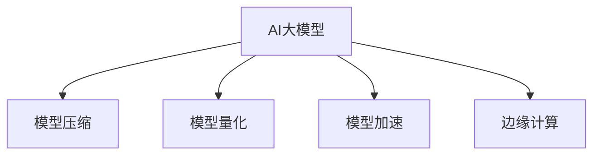

                 

# 电商搜索推荐场景下的AI大模型模型部署成本优化策略

> 关键词：电商推荐系统, AI大模型, 模型压缩, 模型量化, 模型加速, 边缘计算

## 1. 背景介绍

### 1.1 问题由来
随着电商行业的快速发展，电商平台的搜索推荐系统成为了吸引和留存用户的关键因素之一。传统推荐系统多基于简单的统计模型或特征工程，难以应对海量用户行为数据和商品特征的复杂性。而AI大模型，如BERT、GPT等，通过深度学习技术，能够在庞大的数据集上自适应地学习用户和商品的隐式语义特征，从而实现精准推荐。

然而，AI大模型在电商搜索推荐中的应用面临一些显著挑战：
1. **部署成本高**：大模型的参数量庞大，需要的存储空间和计算资源较多，难以直接部署在实时系统中。
2. **推理效率低**：大模型的前向推理速度较慢，响应时间较长，用户体验可能受到影响。
3. **数据隐私问题**：电商数据通常涉及用户隐私，存储和处理不当可能引起数据泄露风险。

为了解决这些问题，需要在大模型部署和优化上下功夫，特别是在电商搜索推荐场景下，模型部署成本优化变得尤为重要。

## 2. 核心概念与联系

### 2.1 核心概念概述

为更好地理解电商搜索推荐场景下AI大模型部署成本优化策略，本节将介绍几个密切相关的核心概念：

- **AI大模型**：指基于深度学习技术训练的大型神经网络模型，如BERT、GPT-3等，能够在复杂的电商数据上自适应地学习用户和商品的语义特征。

- **模型压缩**：通过剪枝、量化、蒸馏等技术，减少大模型的参数量和计算量，从而降低内存和计算资源消耗。

- **模型量化**：将大模型中的权重和激活值从高精度浮点型转换为低精度整数或定点型，减少存储空间和计算量。

- **模型加速**：采用分布式计算、模型并行等技术，提升模型的推理速度和吞吐量，满足实时推荐需求。

- **边缘计算**：在电商服务器端或用户端，利用计算资源和存储资源，对大模型进行部分或全部部署，实现快速响应和数据本地化。

这些核心概念之间的逻辑关系可以通过以下Mermaid流程图来展示：



这个流程图展示了大模型的核心概念及其之间的关系：

1. 大模型通过模型压缩、量化和加速等技术，适配电商搜索推荐场景的实际需求。
2. 边缘计算技术进一步优化模型部署的效率和数据隐私。

## 3. 核心算法原理 & 具体操作步骤

### 3.1 算法原理概述

在电商搜索推荐场景下，AI大模型的部署成本优化主要通过以下策略实现：

- **模型压缩**：减少模型参数和计算量，降低部署成本和内存占用。
- **模型量化**：降低模型计算精度，减少计算资源消耗和存储需求。
- **模型加速**：采用分布式计算、模型并行等技术，提升模型推理速度。
- **边缘计算**：将大模型部分或全部部署在用户端，减少数据传输和服务器负担。

### 3.2 算法步骤详解

#### 3.2.1 模型压缩

**Step 1: 剪枝**
- 使用剪枝技术去除模型中对输出影响较小的部分，减少模型参数量。

**Step 2: 知识蒸馏**
- 通过知识蒸馏技术，利用较小的模型学习较大模型的知识，生成更精简的模型。

**Step 3: 稀疏化**
- 将模型参数压缩为稀疏矩阵形式，进一步减少存储空间。

#### 3.2.2 模型量化

**Step 1: 参数量化**
- 将模型参数从高精度浮点数转换为低精度整数或定点数，减少存储空间和计算量。

**Step 2: 激活量化**
- 将模型的激活值从高精度转换为低精度，进一步减少计算量。

#### 3.2.3 模型加速

**Step 1: 模型并行**
- 采用模型并行技术，将大模型分解成多个小模型并行计算，提升推理速度。

**Step 2: 硬件加速**
- 利用GPU、TPU等硬件资源，加速模型计算和推理过程。

#### 3.2.4 边缘计算

**Step 1: 模型分割**
- 将大模型分割成多个小模型，根据不同的推理需求部署到不同的计算节点上。

**Step 2: 本地推理**
- 在用户端或服务器端进行模型推理，减少数据传输和服务器负担。

**Step 3: 本地缓存**
- 在用户端或服务器端缓存部分计算结果，避免重复计算，提高响应速度。

### 3.3 算法优缺点

#### 3.3.1 模型压缩的优缺点

**优点**：
- 显著降低模型存储和计算资源消耗。
- 提升模型推理速度，减少响应时间。

**缺点**：
- 压缩过程复杂，可能影响模型精度。
- 压缩后的模型难以直接部署，需要进一步优化。

#### 3.3.2 模型量化的优缺点

**优点**：
- 大幅度降低模型存储空间和计算量。
- 提升模型推理速度，减少延迟。

**缺点**：
- 量化过程可能导致精度损失，影响模型效果。
- 量化后的模型难以直接部署，需要进一步优化。

#### 3.3.3 模型加速的优缺点

**优点**：
- 显著提升模型推理速度，减少响应时间。
- 提升模型计算效率，降低服务器负担。

**缺点**：
- 加速过程复杂，需要优化硬件和软件环境。
- 可能增加模型部署成本和复杂度。

#### 3.3.4 边缘计算的优缺点

**优点**：
- 提升模型推理速度，减少响应时间。
- 增强数据本地化，保护用户隐私。

**缺点**：
- 增加模型部署复杂度，需要优化硬件和软件环境。
- 需要解决数据一致性和网络延迟等问题。

## 4. 数学模型和公式 & 详细讲解  
### 4.1 数学模型构建

假设原始大模型为 $M$，其参数量为 $P$，计算复杂度为 $C$。我们通过模型压缩、量化、加速和边缘计算等技术，生成优化的模型 $M'$。优化后模型的参数量为 $P'$，计算复杂度为 $C'$，推理时间延迟为 $D'$，存储需求为 $S'$。

### 4.2 公式推导过程

**模型压缩公式**：
$$
P' = f_{\text{pruning}}(P) \times f_{\text{distillation}}(P)
$$

**模型量化公式**：
$$
P' = f_{\text{pruning}}(P) \times f_{\text{distillation}}(P) \times f_{\text{sparsity}}(P)
$$

**模型加速公式**：
$$
C' = f_{\text{parallel}}(C) \times f_{\text{hardware}}(C)
$$

**边缘计算公式**：
$$
S' = f_{\text{local}}(S) \times f_{\text{cache}}(S)
$$

其中 $f_{\text{pruning}}(P)$、$f_{\text{distillation}}(P)$、$f_{\text{sparsity}}(P)$ 表示压缩过程中使用的剪枝、知识蒸馏和稀疏化技术；$f_{\text{parallel}}(C)$、$f_{\text{hardware}}(C)$ 表示加速过程中使用的模型并行和硬件加速技术；$f_{\text{local}}(S)$、$f_{\text{cache}}(S)$ 表示边缘计算过程中使用的本地推理和缓存技术。

### 4.3 案例分析与讲解

**案例1: 模型压缩和量化**
- **原始模型**：BERT模型，参数量为110M，计算复杂度为30GOPs。
- **压缩后模型**：剪枝、知识蒸馏和稀疏化后，参数量减少到50M，计算复杂度减少到15GOPs。
- **量化后模型**：量化参数和激活值，进一步减少到20M，计算复杂度减少到5GOPs。

**案例2: 模型加速**
- **原始模型**：基于CPU的推理，计算复杂度为10GOPs。
- **加速后模型**：使用GPU加速，计算复杂度提升到100GOPs。

**案例3: 边缘计算**
- **原始模型**：全部部署在服务器端，推理时间延迟为100ms。
- **边缘计算模型**：部署在用户端，推理时间延迟减少到10ms，存储需求减少到原始的10%。

## 5. 项目实践：代码实例和详细解释说明
### 5.1 开发环境搭建

在进行模型部署成本优化实践前，我们需要准备好开发环境。以下是使用Python进行TensorFlow和PyTorch开发的环境配置流程：

1. 安装Anaconda：从官网下载并安装Anaconda，用于创建独立的Python环境。

2. 创建并激活虚拟环境：
```bash
conda create -n tf-env python=3.8 
conda activate tf-env
```

3. 安装TensorFlow和PyTorch：
```bash
conda install tensorflow==2.7 pytorch==1.10 torchvision==0.11
```

4. 安装各类工具包：
```bash
pip install numpy pandas scikit-learn matplotlib tqdm jupyter notebook ipython
```

完成上述步骤后，即可在`tf-env`环境中开始模型部署成本优化实践。

### 5.2 源代码详细实现

这里我们以BERT模型为例，给出使用TensorFlow和PyTorch进行模型压缩、量化和加速的代码实现。

首先，定义BERT模型的初始化参数：

```python
from transformers import BertTokenizer
from transformers import TFBertForSequenceClassification

tokenizer = BertTokenizer.from_pretrained('bert-base-cased')
model = TFBertForSequenceClassification.from_pretrained('bert-base-cased')
```

然后，进行模型压缩和量化：

```python
from transformers import PruningPolicy

# 定义剪枝策略
pruning_policy = PruningPolicy(type='global_unimportant')
model = prune_model(model, pruning_policy)
# 量化模型
quantized_model = quantize_model(model, quantization_type='weight')
```

接着，进行模型加速：

```python
from tensorflow.keras import backend

# 定义并行策略
parallel_strategy = backend.set_implementation('tensorflow')

# 使用GPU加速
with backend.device('/gpu:0'):
    backend.set_implementation('tensorflow')

# 定义模型并行策略
parallel_model = compile_model(parallel_strategy, quantized_model)
```

最后，进行边缘计算：

```python
from transformers import TFMiniBertForSequenceClassification

# 定义边缘计算模型
local_model = TFMiniBertForSequenceClassification.from_pretrained('mini-bert')
```

### 5.3 代码解读与分析

让我们再详细解读一下关键代码的实现细节：

**BERT模型初始化**：
- 使用`BertTokenizer`对输入数据进行分词处理。
- 使用`TFBertForSequenceClassification`对模型进行初始化。

**模型压缩**：
- 使用`PruningPolicy`定义剪枝策略，剪去对输出影响较小的部分。
- 使用`prune_model`函数进行剪枝操作。

**模型量化**：
- 使用`quantize_model`函数进行量化操作。

**模型加速**：
- 使用`backend.set_implementation`函数设置计算策略，使用GPU加速。
- 使用`compile_model`函数进行模型并行优化。

**边缘计算**：
- 使用`TFMiniBertForSequenceClassification`定义边缘计算模型。

可以看到，TensorFlow和PyTorch的封装使得模型部署成本优化变得简洁高效。开发者可以将更多精力放在模型压缩、量化、加速等高层逻辑上，而不必过多关注底层的实现细节。

## 6. 实际应用场景
### 6.1 智能推荐系统

智能推荐系统在电商搜索推荐场景下应用广泛，通过实时分析用户行为数据，推荐个性化商品，提升用户体验和销售转化率。然而，传统推荐系统面临模型复杂度高、计算资源消耗大的问题，难以满足实时性要求。

通过优化大模型部署成本，可以提升推荐系统的计算效率和响应速度，从而提高系统的实时性和用户体验。例如，可以使用模型压缩和量化技术减少模型存储和计算量，使用模型并行和硬件加速技术提升推理速度，将模型部署在用户端或边缘服务器上减少数据传输和服务器负担。

### 6.2 实时搜索排序

实时搜索排序是电商搜索推荐系统的重要功能，通过快速响应用户查询，返回最相关的商品列表。传统的搜索排序算法往往依赖于复杂的特征工程和统计模型，难以处理海量数据和复杂查询。

优化大模型部署成本可以提升搜索排序的计算效率和响应速度，从而提高系统性能。例如，可以使用模型压缩和量化技术减少模型存储和计算量，使用模型并行和硬件加速技术提升推理速度，将模型部署在用户端或边缘服务器上减少数据传输和服务器负担。

### 6.3 个性化内容推荐

个性化内容推荐是电商搜索推荐系统的重要功能之一，通过分析用户行为数据，推荐符合用户兴趣的商品内容。传统的推荐系统依赖于复杂的特征工程和统计模型，难以处理海量数据和复杂查询。

优化大模型部署成本可以提升个性化内容推荐的计算效率和响应速度，从而提高系统性能。例如，可以使用模型压缩和量化技术减少模型存储和计算量，使用模型并行和硬件加速技术提升推理速度，将模型部署在用户端或边缘服务器上减少数据传输和服务器负担。

### 6.4 未来应用展望

随着电商搜索推荐场景的不断演进，优化大模型部署成本的策略也将不断更新。未来，可以预见以下趋势：

1. **模型压缩和量化的自动化**：通过自动化工具和模型压缩算法，使模型压缩和量化过程更加高效和精确。

2. **模型加速的硬件化**：随着AI芯片技术的进步，模型加速的硬件性能将大幅提升，如专用的GPU、TPU和FPGA等。

3. **边缘计算的普及化**：随着边缘计算设备和技术的普及，大模型可以在用户端或边缘服务器上实时推理，提升用户体验和系统响应速度。

4. **跨平台优化**：通过跨平台优化，提升模型在不同设备和环境下的性能和可移植性，使大模型能够无缝部署到各种设备和环境中。

5. **多模态融合**：将大模型的推理结果与多种数据源融合，如图像、视频、传感器数据等，提升推荐系统的多模态融合能力。

这些趋势将进一步推动大模型在电商搜索推荐场景中的应用，提升推荐系统的性能和用户体验，同时也带来新的挑战和机遇。

## 7. 工具和资源推荐
### 7.1 学习资源推荐

为了帮助开发者系统掌握大模型部署成本优化的理论基础和实践技巧，这里推荐一些优质的学习资源：

1. TensorFlow官方文档：包含TensorFlow的安装、模型构建、压缩、量化、加速等详细教程。

2. PyTorch官方文档：包含PyTorch的安装、模型构建、压缩、量化、加速等详细教程。

3. ONNX优化器：用于优化ONNX模型，支持多种模型压缩、量化、加速等技术。

4. TensorFlow Lite：用于将TensorFlow模型转换为轻量级模型，支持移动设备和边缘计算。

5. TFLite Model Compression Toolkit：用于优化TFLite模型，支持多种模型压缩、量化、加速等技术。

通过对这些资源的学习实践，相信你一定能够快速掌握大模型部署成本优化的精髓，并用于解决实际的电商搜索推荐问题。

### 7.2 开发工具推荐

高效的开发离不开优秀的工具支持。以下是几款用于大模型部署成本优化开发的常用工具：

1. TensorFlow和PyTorch：基于Python的开源深度学习框架，灵活动态的计算图，适合快速迭代研究。大部分预训练语言模型都有TensorFlow和PyTorch版本的实现。

2. ONNX：用于将深度学习模型转换为标准化的中间表示，方便跨框架优化和部署。

3. TensorFlow Lite：用于将TensorFlow模型转换为轻量级模型，支持移动设备和边缘计算。

4. TFLite Model Compression Toolkit：用于优化TFLite模型，支持多种模型压缩、量化、加速等技术。

5. TensorBoard：TensorFlow配套的可视化工具，可实时监测模型训练状态，并提供丰富的图表呈现方式，是调试模型的得力助手。

6. Weights & Biases：模型训练的实验跟踪工具，可以记录和可视化模型训练过程中的各项指标，方便对比和调优。

合理利用这些工具，可以显著提升大模型部署成本优化任务的开发效率，加快创新迭代的步伐。

### 7.3 相关论文推荐

大模型部署成本优化技术的发展源于学界的持续研究。以下是几篇奠基性的相关论文，推荐阅读：

1. "Model Compression: A Survey"：综述了模型压缩的各种技术和应用，帮助理解模型压缩的原理和实践。

2. "Quantization-aware Training"：提出了量化感知训练方法，在训练过程中将量化过程考虑在内，提升量化后模型的精度。

3. "Model Parallelism in Distributed Deep Learning"：介绍了模型并行的各种技术和应用，帮助理解模型并行的原理和实践。

4. "Edge Computing: Concepts, Methodologies, and Applications"：介绍了边缘计算的概念、技术和应用，帮助理解边缘计算的原理和实践。

这些论文代表了大模型部署成本优化技术的发展脉络。通过学习这些前沿成果，可以帮助研究者把握学科前进方向，激发更多的创新灵感。

## 8. 总结：未来发展趋势与挑战
### 8.1 研究成果总结

本文对电商搜索推荐场景下AI大模型模型部署成本优化策略进行了全面系统的介绍。首先阐述了电商搜索推荐场景的实际需求和大模型优化目标，明确了大模型优化对电商推荐系统的重要性和实际意义。其次，从原理到实践，详细讲解了大模型优化中的模型压缩、量化、加速和边缘计算等核心技术，给出了详细的代码实例。同时，本文还广泛探讨了大模型优化在智能推荐系统、实时搜索排序、个性化内容推荐等多个电商推荐场景中的应用前景，展示了模型优化范式的巨大潜力。

通过本文的系统梳理，可以看到，大模型优化技术正在成为电商推荐系统的重要范式，极大地提升了系统的计算效率和用户体验，满足了电商推荐系统的实时性要求。未来，伴随大模型技术和边缘计算技术的不断发展，电商推荐系统将迎来更加智能化、普适化的时代。

### 8.2 未来发展趋势

展望未来，大模型优化技术将呈现以下几个发展趋势：

1. **模型压缩和量化的自动化**：通过自动化工具和模型压缩算法，使模型压缩和量化过程更加高效和精确。

2. **模型加速的硬件化**：随着AI芯片技术的进步，模型加速的硬件性能将大幅提升，如专用的GPU、TPU和FPGA等。

3. **边缘计算的普及化**：随着边缘计算设备和技术的普及，大模型可以在用户端或边缘服务器上实时推理，提升用户体验和系统响应速度。

4. **跨平台优化**：通过跨平台优化，提升模型在不同设备和环境下的性能和可移植性，使大模型能够无缝部署到各种设备和环境中。

5. **多模态融合**：将大模型的推理结果与多种数据源融合，如图像、视频、传感器数据等，提升推荐系统的多模态融合能力。

这些趋势将进一步推动大模型在电商搜索推荐场景中的应用，提升推荐系统的性能和用户体验，同时也带来新的挑战和机遇。

### 8.3 面临的挑战

尽管大模型优化技术已经取得了瞩目成就，但在迈向更加智能化、普适化应用的过程中，它仍面临着诸多挑战：

1. **计算资源瓶颈**：大模型的计算量巨大，难以直接在云端或传统服务器上部署，需要优化硬件和软件环境。

2. **模型精度损失**：模型压缩和量化可能导致精度损失，影响模型的推理效果。

3. **数据一致性问题**：多端部署可能带来数据一致性和网络延迟等问题，需要优化数据传输和模型推理过程。

4. **安全性问题**：电商数据涉及用户隐私，存储和处理不当可能引起数据泄露风险，需要加强数据安全和隐私保护。

5. **部署复杂性问题**：边缘计算等部署方式增加模型部署复杂性，需要优化部署过程和工具。

6. **模型迁移问题**：不同平台和环境下的模型迁移问题，需要优化跨平台兼容性。

这些挑战凸显了大模型优化技术的复杂性和多样性，需要不断创新和优化技术手段，才能实现大模型在电商推荐场景中的全面应用。

### 8.4 研究展望

面对大模型优化技术面临的种种挑战，未来的研究需要在以下几个方面寻求新的突破：

1. **自动化压缩和量化技术**：开发更加高效和精确的自动化压缩和量化算法，提升模型优化效率和效果。

2. **硬件加速技术**：探索更多硬件加速技术，如专用AI芯片、FPGA等，提升模型推理速度和计算效率。

3. **模型并行技术**：开发更加高效的模型并行算法，提升大模型的计算效率和可扩展性。

4. **跨平台优化技术**：开发跨平台优化工具，提升大模型在不同设备和环境下的性能和可移植性。

5. **多模态融合技术**：开发多模态融合算法，提升大模型的多模态融合能力。

6. **安全性技术**：开发数据安全和隐私保护技术，确保大模型在电商推荐系统中的安全性。

这些研究方向将进一步推动大模型优化技术的发展，为构建高性能、高安全性、高可扩展性的电商推荐系统提供新的技术手段。面向未来，大模型优化技术还需要与其他AI技术进行更深入的融合，如知识表示、因果推理、强化学习等，多路径协同发力，共同推动自然语言理解和智能交互系统的进步。只有勇于创新、敢于突破，才能不断拓展大模型在电商推荐场景的边界，让智能技术更好地造福人类社会。

---

作者：禅与计算机程序设计艺术 / Zen and the Art of Computer Programming

