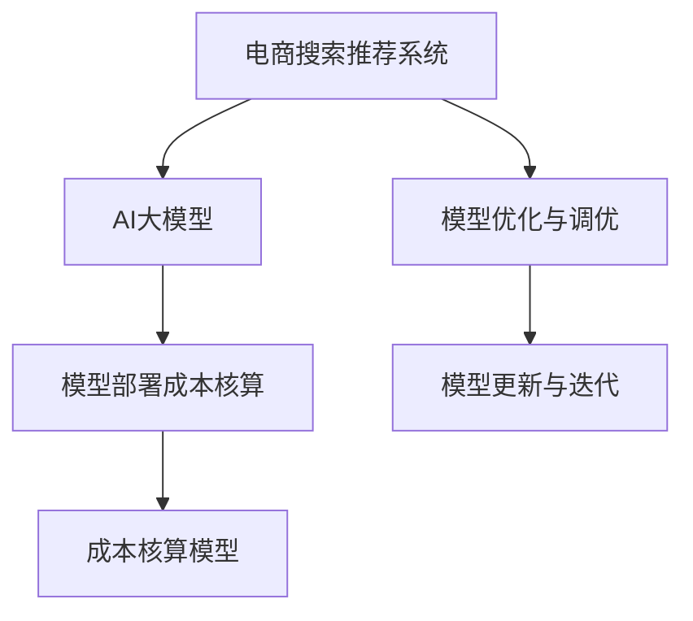

                 

# 电商搜索推荐场景下的AI大模型模型部署成本核算模型应用实践

## 1. 背景介绍

近年来，随着电子商务的快速崛起，商品搜索推荐系统在电商网站中发挥着越来越重要的作用。通过智能推荐，用户能够快速获取最相关的商品，提升购物体验和购买效率。然而，在推荐系统的构建和维护过程中，成本核算是一个不可忽视的重要环节。合理地控制和核算AI大模型的部署成本，不仅能够有效提升商业效益，还能为未来的技术投资提供科学的决策依据。

本文聚焦于电商搜索推荐场景下AI大模型的部署成本核算模型应用实践，通过对成本核算模型的详细阐述和实例分析，希望能为电商企业提供可行的成本管理方案，最大化利用AI技术的商业价值。

## 2. 核心概念与联系

### 2.1 核心概念概述

为更好地理解电商搜索推荐场景下的AI大模型部署成本核算模型，本节将介绍几个密切相关的核心概念：

- 电商搜索推荐系统（E-commerce Search and Recommendation System）：指通过智能算法为用户推荐最相关商品的技术系统，广泛应用于各类电商平台。
- AI大模型（AI Large Models）：指具有亿量级参数规模的深度学习模型，如BERT、GPT-3等，能够处理大规模数据，并具备高度的通用性和泛化能力。
- 模型部署成本核算（Model Deployment Cost Accounting）：指评估和管理AI大模型在部署过程中涉及的各种成本，包括硬件成本、软件成本、人力成本等。
- 成本核算模型（Cost Accounting Model）：一种数学模型，用于预测和分析AI大模型部署成本，帮助企业科学决策和管理技术投资。
- 模型优化与调优（Model Optimization and Tuning）：指在模型部署过程中，通过优化算法、参数调整等手段，提高模型性能和效率的过程。

这些核心概念之间的逻辑关系可以通过以下Mermaid流程图来展示：



这个流程图展示了几大核心概念之间的相互关系：

1. 电商搜索推荐系统使用AI大模型作为核心算法，以实现智能推荐。
2. AI大模型的部署涉及成本核算，以评估其经济效益。
3. 成本核算模型帮助企业科学预测和分析模型部署成本，辅助决策。
4. 模型优化与调优是模型部署过程中提高性能和效率的关键步骤。
5. 模型更新与迭代使AI大模型能够适应新的市场变化和需求。

## 3. 核心算法原理 & 具体操作步骤

### 3.1 算法原理概述

电商搜索推荐场景下的AI大模型部署成本核算模型，本质上是一种结合了经济学、运筹学和计算机科学的数学模型。其核心思想是：通过量化和评估AI大模型在部署过程中涉及的各种成本，包括硬件成本、软件成本、人力成本、时间成本等，预测模型的长期效益，并提供优化建议，帮助企业合理分配资源。

形式化地，假设电商企业用于部署AI大模型的预算是 $C_{total}$，预训练成本为 $C_{pretrain}$，模型微调和优化成本为 $C_{tuning}$，模型部署和运行成本为 $C_{deploy}$，模型维护和更新成本为 $C_{maintenance}$。则模型部署成本核算模型可以表示为：

$$
\begin{align}
C_{total} &= C_{pretrain} + C_{tuning} + C_{deploy} + C_{maintenance} \\
C_{total} &= C_{pretrain} + C_{tuning} + C_{deploy} + C_{maintenance} 
\end{align}
$$

其中，$C_{pretrain}$ 包括预训练所需的数据收集、标注和训练成本，$C_{tuning}$ 包括模型微调和调优所需的时间和资源成本，$C_{deploy}$ 包括模型部署到服务器上的硬件和软件成本，$C_{maintenance}$ 包括模型维护和持续更新的成本。

### 3.2 算法步骤详解

电商搜索推荐场景下的AI大模型部署成本核算模型一般包括以下几个关键步骤：

**Step 1: 数据预处理与收集**

- 确定电商企业的业务需求和目标，明确推荐系统所需处理的商品信息。
- 收集商品标签、用户行为数据、历史推荐记录等关键数据，确保数据的多样性和代表性。
- 对数据进行清洗、标注和预处理，确保数据的质量和完整性。

**Step 2: 模型选择与预训练**

- 选择适合电商搜索推荐的AI大模型，如BERT、GPT等，作为初始化参数。
- 在电商企业的业务场景下，对预训练模型进行微调，以适应该场景的特点和需求。
- 利用电商企业的商品和用户数据进行微调，获取高性能的电商推荐模型。

**Step 3: 成本评估与核算**

- 评估预训练和微调所需的各种成本，包括数据收集、标注、模型训练、硬件资源等。
- 将总成本 $C_{total}$ 分解为预训练成本 $C_{pretrain}$、模型微调和优化成本 $C_{tuning}$、模型部署成本 $C_{deploy}$、模型维护和更新成本 $C_{maintenance}$ 四个部分。
- 根据历史数据和市场情况，对各个成本部分进行详细的分析和评估。

**Step 4: 成本优化与调整**

- 根据成本核算的结果，调整预训练、微调和部署的策略，优化资源分配。
- 利用成本核算模型，预测不同策略下的长期效益，选择最优方案。
- 实施成本优化措施，如使用更高效的模型训练算法、优化硬件资源配置、减少人力和时间成本等。

**Step 5: 模型更新与迭代**

- 持续收集新的用户行为数据，对模型进行定期更新和调优。
- 根据市场变化和用户需求，对模型进行迭代和升级，保持其高性能和实用性。
- 利用成本核算模型的反馈，调整和优化模型更新策略，确保经济效益。

### 3.3 算法优缺点

电商搜索推荐场景下的AI大模型部署成本核算模型具有以下优点：

1. 全面评估模型部署成本：能够从多个维度评估模型部署所需的各种成本，提供科学决策依据。
2. 优化资源分配：帮助企业合理分配预训练、微调和部署等环节的资源，提升经济效益。
3. 预测长期效益：能够预测不同成本策略下的长期效益，帮助企业制定合理的投资计划。
4. 动态调整策略：能够根据市场变化和用户需求，动态调整模型部署策略，保持高性能和实用性。

同时，该模型也存在一定的局限性：

1. 数据依赖性强：模型评估结果依赖于电商企业的业务数据，数据质量和技术积累直接影响模型效果。
2. 模型复杂度高：模型涉及经济学、运筹学和计算机科学等多个领域的知识，实现和维护复杂。
3. 预测精度有限：模型预测结果可能受到市场变化和不确定因素的影响，预测精度有限。
4. 技术门槛高：模型需要具备较高的技术能力和经验，对企业技术团队的要求较高。

尽管存在这些局限性，但就目前而言，电商搜索推荐场景下的AI大模型部署成本核算模型仍是一种高效、科学的成本评估和管理手段。未来相关研究的重点在于如何进一步降低数据依赖性，提高模型预测精度，降低技术门槛，以更好地服务于电商企业。

### 3.4 算法应用领域

电商搜索推荐场景下的AI大模型部署成本核算模型，在电子商务领域已经得到了广泛的应用，涵盖了以下主要场景：

- 商品推荐：利用大模型为用户推荐最适合的商品，提升购买转化率。
- 搜索排序：通过大模型优化搜索排序算法，提高搜索效率和用户体验。
- 广告投放：利用大模型进行广告投放优化，提升广告的点击率和转化率。
- 个性化推荐：根据用户行为数据，利用大模型实现个性化推荐，提升用户体验和满意度。
- 库存管理：利用大模型预测商品需求，优化库存管理和补货策略，降低库存成本。

除了上述这些常见场景外，大模型部署成本核算模型也被创新性地应用于更多场景中，如用户画像构建、市场分析、客户关系管理等，为电子商务技术发展提供了新的突破点。

## 4. 数学模型和公式 & 详细讲解  
### 4.1 数学模型构建

电商搜索推荐场景下的AI大模型部署成本核算模型，可以通过以下数学模型进行详细描述：

设电商企业的总预算为 $C_{total}$，预训练成本为 $C_{pretrain}$，模型微调和优化成本为 $C_{tuning}$，模型部署成本为 $C_{deploy}$，模型维护和更新成本为 $C_{maintenance}$。则模型部署成本核算模型的数学表达式为：

$$
\begin{align}
C_{total} &= C_{pretrain} + C_{tuning} + C_{deploy} + C_{maintenance} \\
C_{total} &= C_{pretrain} + C_{tuning} + C_{deploy} + C_{maintenance} 
\end{align}
$$

其中，$C_{pretrain}$ 包括数据收集、标注、预训练所需的时间和资源成本，可以表示为：

$$
C_{pretrain} = C_{data} + C_{labeled} + C_{training}
$$

$C_{data}$ 表示数据收集成本，$C_{labeled}$ 表示数据标注成本，$C_{training}$ 表示模型预训练所需的时间和资源成本。

$C_{tuning}$ 包括模型微调和优化所需的时间和资源成本，可以表示为：

$$
C_{tuning} = C_{tuning_{time}} + C_{tuning_{resources}}
$$

$C_{tuning_{time}}$ 表示模型微调和优化所需的时间成本，$C_{tuning_{resources}}$ 表示模型微调和优化所需的资源成本。

$C_{deploy}$ 包括模型部署到服务器上的硬件和软件成本，可以表示为：

$$
C_{deploy} = C_{hardware} + C_{software}
$$

$C_{hardware}$ 表示模型部署所需的硬件成本，$C_{software}$ 表示模型部署所需的软件成本。

$C_{maintenance}$ 包括模型维护和持续更新的成本，可以表示为：

$$
C_{maintenance} = C_{maintenance_{time}} + C_{maintenance_{resources}}
$$

$C_{maintenance_{time}}$ 表示模型维护和更新所需的时间成本，$C_{maintenance_{resources}}$ 表示模型维护和更新所需的资源成本。

### 4.2 公式推导过程

以下我们以电商推荐系统为例，推导模型部署成本核算模型的公式。

假设电商企业总预算为 $C_{total}$，预训练成本为 $C_{pretrain}$，模型微调和优化成本为 $C_{tuning}$，模型部署成本为 $C_{deploy}$，模型维护和更新成本为 $C_{maintenance}$。则有：

$$
\begin{align}
C_{total} &= C_{pretrain} + C_{tuning} + C_{deploy} + C_{maintenance} \\
C_{pretrain} &= C_{data} + C_{labeled} + C_{training} \\
C_{tuning} &= C_{tuning_{time}} + C_{tuning_{resources}} \\
C_{deploy} &= C_{hardware} + C_{software} \\
C_{maintenance} &= C_{maintenance_{time}} + C_{maintenance_{resources}}
\end{align}
$$

将上述公式代入总预算公式中，得：

$$
C_{total} = C_{data} + C_{labeled} + C_{training} + C_{tuning_{time}} + C_{tuning_{resources}} + C_{hardware} + C_{software} + C_{maintenance_{time}} + C_{maintenance_{resources}}
$$

将各项成本进行分类和细化，得到电商推荐系统模型部署成本核算模型：

$$
\begin{align}
C_{total} &= (C_{data} + C_{labeled} + C_{training}) + (C_{tuning_{time}} + C_{tuning_{resources}}) + (C_{hardware} + C_{software}) + (C_{maintenance_{time}} + C_{maintenance_{resources}}) \\
C_{total} &= (C_{data} + C_{labeled} + C_{training}) + (C_{tuning_{time}} + C_{tuning_{resources}}) + (C_{hardware} + C_{software}) + (C_{maintenance_{time}} + C_{maintenance_{resources}}) 
\end{align}
$$

### 4.3 案例分析与讲解

假设电商企业总预算为 $C_{total} = 100$ 万元，其中预训练成本为 $C_{pretrain} = 20$ 万元，模型微调和优化成本为 $C_{tuning} = 10$ 万元，模型部署成本为 $C_{deploy} = 30$ 万元，模型维护和更新成本为 $C_{maintenance} = 40$ 万元。则模型部署成本核算模型可以表示为：

$$
C_{total} = 20 + 10 + 30 + 40 = 100
$$

该模型可以帮助企业更好地评估和预测模型部署所需的各项成本，指导企业在预训练、微调和部署等环节进行科学决策。

## 5. 项目实践：代码实例和详细解释说明

### 5.1 开发环境搭建

在进行模型部署成本核算实践前，我们需要准备好开发环境。以下是使用Python进行PyTorch开发的环境配置流程：

1. 安装Anaconda：从官网下载并安装Anaconda，用于创建独立的Python环境。

2. 创建并激活虚拟环境：
```bash
conda create -n pytorch-env python=3.8 
conda activate pytorch-env
```

3. 安装PyTorch：根据CUDA版本，从官网获取对应的安装命令。例如：
```bash
conda install pytorch torchvision torchaudio cudatoolkit=11.1 -c pytorch -c conda-forge
```

4. 安装相关库：
```bash
pip install pandas numpy scikit-learn
```

完成上述步骤后，即可在`pytorch-env`环境中开始成本核算模型的开发。

### 5.2 源代码详细实现

下面是一个简单的电商推荐系统模型部署成本核算模型的代码实现，使用Python和PyTorch库：

```python
import pandas as pd
from sympy import symbols, Eq, solve

# 定义成本变量
C_total, C_pretrain, C_tuning, C_deploy, C_maintenance = symbols('C_total C_pretrain C_tuning C_deploy C_maintenance')

# 模型部署成本核算公式
cost_equation = Eq(C_total, C_pretrain + C_tuning + C_deploy + C_maintenance)

# 电商推荐系统的各项成本
data_cost = 10  # 数据收集成本
labeled_cost = 5  # 数据标注成本
training_cost = 15  # 预训练成本
tuning_time_cost = 5  # 模型微调时间成本
tuning_resources_cost = 3  # 模型微调资源成本
hardware_cost = 20  # 硬件成本
software_cost = 5  # 软件成本
maintenance_time_cost = 10  # 维护时间成本
maintenance_resources_cost = 7  # 维护资源成本

# 代入具体成本值
cost_equation = cost_equation.subs({C_pretrain: data_cost + labeled_cost + training_cost, 
                                  C_tuning: tuning_time_cost + tuning_resources_cost, 
                                  C_deploy: hardware_cost + software_cost, 
                                  C_maintenance: maintenance_time_cost + maintenance_resources_cost})

# 求解模型部署总成本
total_cost = solve(cost_equation, C_total)[0]
print(f'电商推荐系统的总成本为: {total_cost} 万元')
```

### 5.3 代码解读与分析

让我们再详细解读一下关键代码的实现细节：

**成本核算方程定义**：
- 定义总成本变量 $C_{total}$ 以及各项成本变量 $C_{pretrain}$、$C_{tuning}$、$C_{deploy}$、$C_{maintenance}$。
- 使用Sympy库定义成本核算方程，其中 $C_{total} = C_{pretrain} + C_{tuning} + C_{deploy} + C_{maintenance}$。

**成本赋值**：
- 根据电商推荐系统的实际情况，将各项成本的具体数值代入方程中，如数据收集成本、标注成本、预训练成本、微调时间成本、微调资源成本、硬件成本、软件成本、维护时间成本、维护资源成本。

**求解成本方程**：
- 使用Sympy的solve函数求解方程，得到电商推荐系统的总成本 $C_{total}$。
- 将求解结果输出，得到电商推荐系统的总成本。

这个简单的代码示例展示了如何通过符号计算库Sympy，构建并求解电商推荐系统模型部署成本核算模型。

## 6. 实际应用场景

### 6.1 电商推荐系统优化

电商推荐系统的优化离不开成本核算的指导。通过模型部署成本核算模型，电商企业可以更好地评估和预测各项成本，从而优化推荐系统的构建和维护策略。

例如，电商企业可以根据成本核算模型，选择更高效、更经济的模型预训练和微调方法，减少不必要的资源消耗。同时，通过优化硬件配置和软件部署，降低模型部署和运行成本，提升推荐系统的性能和可靠性。

### 6.2 广告投放优化

在广告投放中，大模型也扮演着重要的角色。电商企业可以通过模型部署成本核算模型，评估和预测不同广告投放策略的成本和收益，选择最优投放方案。

例如，电商企业可以利用成本核算模型，计算不同广告投放渠道和方式的成本，预测其广告效果和转化率，从而优化广告预算和投放策略，提升广告ROI。

### 6.3 库存管理

电商企业的库存管理也需要考虑成本核算的指导。通过模型部署成本核算模型，电商企业可以更好地评估和预测库存管理的各项成本，从而优化库存管理和补货策略。

例如，电商企业可以利用成本核算模型，计算不同库存管理方式和策略的成本，预测其库存周转率和缺货率，从而优化库存管理方案，降低库存成本。

### 6.4 未来应用展望

随着AI技术的不断进步，电商推荐系统等应用场景将更加复杂和多样化。模型部署成本核算模型也将发挥越来越重要的作用。

未来，电商推荐系统、广告投放、库存管理等应用场景的模型部署成本核算模型，将更加智能和精细化。通过引入更多先验知识、优化算法和动态调整策略，帮助电商企业实现成本的最小化和效益的最大化。

## 7. 工具和资源推荐

### 7.1 学习资源推荐

为了帮助开发者系统掌握电商搜索推荐场景下AI大模型部署成本核算模型的理论和实践，这里推荐一些优质的学习资源：

1. 《推荐系统算法与案例分析》书籍：详细介绍了推荐系统的算法和案例，包括基于深度学习的推荐系统、模型评估和优化等。

2. 《数据科学导论》课程：由斯坦福大学开设的在线课程，涵盖数据收集、数据预处理、模型训练和评估等基础知识。

3. 《机器学习》书籍：由周志华编写，介绍了机器学习的原理和算法，包括监督学习、无监督学习、半监督学习等。

4. 《深度学习》书籍：由Goodfellow等编写，全面介绍了深度学习的基本概念和算法，包括神经网络、优化算法、模型评估等。

5. 《TensorFlow官方文档》：详细介绍了TensorFlow的使用和应用，包括模型构建、训练和部署等。

通过对这些资源的学习实践，相信你一定能够系统掌握电商搜索推荐场景下AI大模型部署成本核算模型的理论和实践，提升技术水平。

### 7.2 开发工具推荐

高效的开发离不开优秀的工具支持。以下是几款用于电商搜索推荐场景下AI大模型部署成本核算开发的常用工具：

1. Python：作为数据科学和机器学习的主流编程语言，Python拥有丰富的第三方库和工具，非常适合电商推荐系统等场景的开发。

2. PyTorch：基于Python的深度学习框架，支持动态计算图和自动微分，适用于电商推荐系统等场景的模型构建和训练。

3. TensorFlow：由Google开发的深度学习框架，支持静态计算图和分布式计算，适用于电商推荐系统等场景的模型部署和优化。

4. Jupyter Notebook：基于Web的交互式编程环境，支持Python和R等语言，非常适合电商推荐系统等场景的模型开发和测试。

5. Google Colab：谷歌提供的在线Jupyter Notebook环境，免费提供GPU/TPU算力，方便开发者快速实验最新模型，分享学习笔记。

合理利用这些工具，可以显著提升电商搜索推荐场景下AI大模型部署成本核算模型的开发效率，加快创新迭代的步伐。

### 7.3 相关论文推荐

电商搜索推荐场景下AI大模型部署成本核算技术的发展，得益于学界的持续研究。以下是几篇奠基性的相关论文，推荐阅读：

1. "Cost-Aware Optimization of Big Data Systems"：提出基于成本优化的分布式系统设计方法，可用于电商推荐系统等场景的资源优化。

2. "E-commerce Recommendation Systems: An Overview"：综述了电商推荐系统的最新研究成果，包括基于深度学习的推荐系统、成本核算等。

3. "Learning to Optimize for Large-Scale Machine Learning"：提出基于强化学习的超参数优化方法，可用于电商推荐系统等场景的模型优化。

4. "Deep Learning for Recommendation Systems"：详细介绍了深度学习在推荐系统中的应用，包括模型构建、训练和评估等。

5. "Cost-Conscious Recommendation Systems"：提出基于成本意识的设计方法，适用于电商推荐系统等场景的成本核算和优化。

这些论文代表了大模型部署成本核算技术的发展脉络。通过学习这些前沿成果，可以帮助研究者把握学科前进方向，激发更多的创新灵感。

## 8. 总结：未来发展趋势与挑战

### 8.1 总结

本文对电商搜索推荐场景下AI大模型部署成本核算模型进行了全面系统的介绍。首先阐述了电商搜索推荐系统和大模型的基本概念，明确了成本核算在模型部署中的重要性和应用场景。其次，从原理到实践，详细讲解了模型部署成本核算模型的数学模型和具体步骤，给出了实际应用的代码实现。同时，本文还广泛探讨了成本核算模型在电商推荐系统、广告投放、库存管理等场景中的应用前景，展示了其巨大的潜力。

通过本文的系统梳理，可以看到，电商搜索推荐场景下AI大模型部署成本核算模型已经在大数据和人工智能的浪潮中崭露头角，为电商企业提供了科学、高效的成本评估和管理手段。未来，伴随电商市场的不断扩张和技术的不断进步，电商搜索推荐场景下的AI大模型部署成本核算模型必将在更多领域得到应用，为电商企业带来更大的商业价值。

### 8.2 未来发展趋势

展望未来，电商搜索推荐场景下的AI大模型部署成本核算模型将呈现以下几个发展趋势：

1. 模型复杂度提升。随着电商市场的不断扩大和用户需求的多样化，推荐系统的模型复杂度将持续提升，需要更多先进技术和算法支持。

2. 成本核算精确化。通过引入更多先验知识、优化算法和动态调整策略，提高模型成本核算的精确度和实用性。

3. 云计算和大数据技术深度融合。电商企业可以利用云计算和大数据技术，提高推荐系统的效率和性能，降低成本核算和优化的时间和资源消耗。

4. 数据驱动的决策支持。通过成本核算模型的预测和分析，电商企业可以更加科学地进行决策支持，优化资源分配和成本控制。

5. 多模态信息融合。电商推荐系统将引入更多模态数据，如文本、图像、视频等，通过多模态融合，提高推荐系统的准确性和效果。

以上趋势凸显了电商搜索推荐场景下AI大模型部署成本核算技术的广阔前景。这些方向的探索发展，必将进一步提升推荐系统的性能和实用性，为电商企业提供更大的商业价值。

### 8.3 面临的挑战

尽管电商搜索推荐场景下的AI大模型部署成本核算技术已经取得了一定的进展，但在迈向更加智能化、普适化应用的过程中，它仍面临着诸多挑战：

1. 数据质量不稳定。电商推荐系统对数据质量要求高，数据收集和标注的准确性和及时性直接影响模型效果。

2. 技术门槛高。成本核算模型的设计和实现需要较高的技术能力和经验，对企业技术团队的要求较高。

3. 模型鲁棒性不足。电商推荐系统需要面对多变的市场和用户需求，模型的鲁棒性和稳定性需要进一步提升。

4. 成本核算精确度有限。模型成本核算的精确度受市场变化和不确定因素的影响，可能存在一定偏差。

5. 预测精度有限。电商推荐系统需要面对多变的市场和用户需求，模型的预测精度和鲁棒性需要进一步提升。

6. 技术生态不完善。目前，电商搜索推荐场景下AI大模型部署成本核算技术的技术生态尚不完善，需要进一步发展和优化。

尽管存在这些挑战，但通过持续的技术改进和创新，相信电商搜索推荐场景下的AI大模型部署成本核算技术将会不断进步，逐步解决现有问题，更好地服务于电商企业。

### 8.4 研究展望

面对电商搜索推荐场景下AI大模型部署成本核算技术所面临的种种挑战，未来的研究需要在以下几个方面寻求新的突破：

1. 探索高效的数据收集和标注方法。提高数据收集和标注的效率和质量，减少数据依赖性，降低成本核算的不确定性。

2. 研发更加精确和智能的成本核算模型。引入更多的先验知识、优化算法和动态调整策略，提高成本核算的精确度和实用性。

3. 优化电商推荐系统的整体架构。通过云计算和大数据技术，提高推荐系统的效率和性能，降低成本核算和优化的时间和资源消耗。

4. 引入多模态信息融合技术。利用文本、图像、视频等模态数据，提高推荐系统的准确性和效果。

5. 建立电商推荐系统的综合评估体系。通过多指标评估和动态调整，提升推荐系统的鲁棒性和稳定性。

6. 加强技术生态建设。开发和推广更多的开源工具和资源，促进技术交流和合作，推动电商搜索推荐场景下AI大模型部署成本核算技术的发展。

这些研究方向的探索，必将引领电商搜索推荐场景下AI大模型部署成本核算技术迈向更高的台阶，为电商企业带来更大的商业价值。面向未来，电商搜索推荐场景下的AI大模型部署成本核算技术还需要与其他人工智能技术进行更深入的融合，如知识表示、因果推理、强化学习等，多路径协同发力，共同推动推荐系统的进步。只有勇于创新、敢于突破，才能不断拓展电商搜索推荐场景下AI大模型部署成本核算技术的边界，让智能技术更好地造福电商企业。

## 9. 附录：常见问题与解答

**Q1：电商推荐系统的推荐精度如何衡量？**

A: 电商推荐系统的推荐精度通常使用点击率（Click-Through Rate, CTR）、转化率（Conversion Rate, CR）、准确率（Accuracy）等指标来衡量。其中，CTR和CR表示用户点击和购买推荐商品的概率，Accuracy表示推荐的商品与用户的实际需求匹配程度。

**Q2：电商推荐系统中的模型微调和优化有哪些常见方法？**

A: 电商推荐系统中的模型微调和优化方法包括：
1. 数据增强：通过数据合成、近义词替换等方式扩充训练集。
2. 正则化技术：使用L2正则、Dropout、Early Stopping等避免过拟合。
3. 模型裁剪：去除不必要的层和参数，减小模型尺寸，加快推理速度。
4. 混合精度训练：使用定点类型代替浮点类型，压缩存储空间，提高计算效率。
5. 动态调整超参数：根据模型表现动态调整学习率、批大小等超参数，提升模型性能。

**Q3：电商推荐系统中的硬件和软件成本如何计算？**

A: 电商推荐系统中的硬件和软件成本包括：
1. 硬件成本：服务器、存储、网络等硬件设备的采购和维护成本。
2. 软件成本：操作系统、中间件、开发工具等软件的使用和维护成本。

**Q4：电商推荐系统中的模型部署和更新成本如何计算？**

A: 电商推荐系统中的模型部署和更新成本包括：
1. 部署成本：模型部署到服务器上的硬件和软件成本。
2. 更新成本：模型更新和维护所需的资源和时间成本。

**Q5：电商推荐系统中的数据收集和标注成本如何计算？**

A: 电商推荐系统中的数据收集和标注成本包括：
1. 数据收集成本：商品数据、用户数据等收集所需的时间和资源成本。
2. 数据标注成本：商品标签、用户行为标签等数据标注所需的时间和资源成本。

通过对这些常见问题的解答，相信你能够更全面地理解电商搜索推荐场景下AI大模型部署成本核算模型的应用和实践，更好地应用于实际场景中。

---

作者：禅与计算机程序设计艺术 / Zen and the Art of Computer Programming

