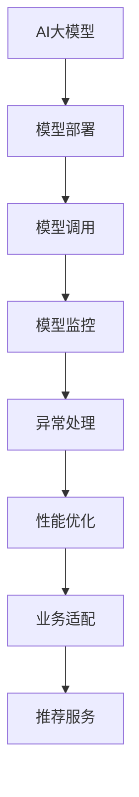

                 

# 电商搜索推荐场景下的AI大模型模型部署监控平台搭建最佳实践

> 关键词：AI大模型、模型部署、模型监控、电商搜索推荐、智能推荐系统

## 1. 背景介绍

### 1.1 问题由来

随着电商平台的快速发展，智能推荐系统已成为提升用户体验、提高交易转化率的重要手段。其核心在于通过用户的搜索历史、浏览记录、行为数据等，智能预测用户可能感兴趣的商品，从而提供个性化的搜索结果和推荐内容。AI大模型在自然语言处理和用户行为分析方面具有天然的优势，因此被广泛应用于电商搜索推荐场景中。

然而，电商搜索推荐系统面临着复杂多变的用户需求、海量数据的实时处理和个性化推荐效果的实时反馈等挑战。如何在保证系统性能的同时，提供高效、精准的推荐服务，成为了一个亟待解决的难题。

### 1.2 问题核心关键点

大模型的有效部署和监控，对于实现电商搜索推荐系统的高效运作至关重要。核心关键点在于：
- 如何高效地将大模型部署到服务器上，以支撑大规模用户请求。
- 如何实时监控模型的运行状态，及时发现和处理性能瓶颈和异常。
- 如何保证模型的实时更新和升级，以应对业务需求的变化。

## 2. 核心概念与联系

### 2.1 核心概念概述

为更好地理解电商搜索推荐场景下的AI大模型模型部署和监控方法，本节将介绍几个密切相关的核心概念：

- **AI大模型**：以深度神经网络为代表的高级人工智能模型，能够处理大规模数据，完成复杂任务，如自然语言处理、计算机视觉、语音识别等。

- **模型部署**：将训练好的模型从训练环境迁移到生产环境，供实际应用场景使用的过程。模型部署不仅涉及模型的加载和调用，还涉及服务器的配置、数据传输、负载均衡等复杂问题。

- **模型监控**：对模型在生产环境中的运行状态进行实时监控，包括模型的性能、准确率、响应时间、错误率等指标。通过监控，及时发现模型异常，保证推荐服务的稳定性和可靠性。

- **电商搜索推荐系统**：基于用户行为数据和商品属性数据，通过智能算法为用户推荐可能感兴趣的商品，提升用户体验和平台转化率。

- **智能推荐系统**：利用机器学习、深度学习等技术，分析用户行为数据和商品属性数据，实现个性化推荐，提升推荐效果和用户体验。

这些核心概念之间的逻辑关系可以通过以下Mermaid流程图来展示：



这个流程图展示了AI大模型在电商搜索推荐场景中的生命周期，从训练到部署、调用、监控、异常处理、性能优化、业务适配，最终实现推荐服务。

## 3. 核心算法原理 & 具体操作步骤
### 3.1 算法原理概述

电商搜索推荐系统中的AI大模型部署和监控，核心在于以下几个关键步骤：
1. 选择合适的AI大模型，并进行预训练。
2. 设计模型架构，适配电商搜索推荐系统的具体需求。
3. 部署模型到服务器，实现高效的服务调用。
4. 实时监控模型运行状态，及时发现和处理异常。
5. 根据监控结果进行性能优化和异常处理。

这些步骤共同构成了模型部署和监控的完整流程，旨在确保模型在实际应用中高效、稳定地运行，并提供精准的推荐服务。

### 3.2 算法步骤详解

以下详细介绍电商搜索推荐场景下AI大模型模型部署和监控的具体操作步骤：

**Step 1: 模型选择与预训练**

选择合适的AI大模型，进行预训练，以学习丰富的语义和用户行为知识。常用的预训练方法包括：
- 自监督学习：如BERT、GPT等模型，利用大量无标签数据进行预训练，学习语言的通用表示。
- 监督学习：如SVM、线性回归等，利用标注数据进行预训练，学习特定任务的知识。
- 无监督学习：如GAN、VAE等，学习数据的内在结构和模式。

**Step 2: 模型适配与架构设计**

根据电商搜索推荐系统的具体需求，设计模型架构，并进行适配。通常需要：
- 确定模型的输入输出格式，如文本、图片、向量等。
- 设计模型的推理流程，包括输入预处理、模型调用、结果后处理等。
- 实现模型的优化策略，如加速、压缩等。

**Step 3: 模型部署与服务化**

将模型部署到服务器，实现高效的服务调用。具体步骤如下：
- 选择合适的服务器架构，如分布式计算、微服务架构等。
- 实现模型的加载、推理、保存等操作。
- 将模型封装为API服务，供前端系统调用。

**Step 4: 模型监控与异常处理**

实时监控模型的运行状态，及时发现和处理异常。监控指标包括：
- 性能指标：如响应时间、吞吐量等。
- 准确率指标：如推荐精度、召回率等。
- 错误率指标：如异常率、掉线率等。

**Step 5: 性能优化与模型更新**

根据监控结果，进行性能优化和模型更新。优化策略包括：
- 模型参数优化：调整模型参数，提升模型性能。
- 硬件优化：优化服务器配置，提升模型推理速度。
- 数据优化：优化数据输入格式，提升模型推理效率。

### 3.3 算法优缺点

AI大模型在电商搜索推荐场景中的部署和监控，具有以下优点：
1. 高效性：利用大模型处理大规模数据，提供实时推荐服务，提升用户体验。
2. 精准性：大模型能够学习丰富的语义和用户行为知识，提供精准的推荐结果。
3. 可扩展性：大模型能够快速部署和更新，适应电商平台的业务需求变化。

同时，也存在以下缺点：
1. 资源消耗大：大模型需要大量的计算资源和存储空间，对服务器配置要求高。
2. 部署复杂：大模型的部署过程复杂，需要考虑模型加载、服务调用等问题。
3. 监控难度高：大模型的运行状态复杂，监控难度大，需要综合考虑多方面的因素。

尽管存在这些局限性，但就目前而言，AI大模型在电商搜索推荐场景中仍是最主流的方法，通过合理的部署和监控，可以克服这些缺点，实现高效、精准的推荐服务。

### 3.4 算法应用领域

AI大模型在电商搜索推荐场景中的应用领域广泛，包括但不限于以下几个方面：

- **商品推荐**：根据用户的历史行为数据和商品属性数据，为用户推荐可能感兴趣的商品。
- **搜索排序**：通过用户输入的搜索关键词，结合商品属性数据，对搜索结果进行排序和过滤。
- **个性化广告**：利用用户的行为数据和兴趣标签，精准投放个性化广告，提升广告效果。
- **客服推荐**：根据用户的历史咨询记录和当前问题，推荐相关的FAQ或答案，提升客服效率。
- **内容推荐**：利用用户的行为数据，推荐相关的文章、视频、直播等内容，提升平台活跃度。

此外，AI大模型在电商搜索推荐场景中的应用，还可以拓展到智能导购、库存管理、风险控制等更多领域，为电商平台的运营提供全方位的智能支持。

## 4. 数学模型和公式 & 详细讲解 & 举例说明

### 4.1 数学模型构建

电商搜索推荐系统中的AI大模型，主要基于深度学习模型进行构建。以用户行为数据和商品属性数据作为输入，通过模型训练学习用户兴趣和商品特征的映射关系，实现个性化推荐。

假设用户行为数据为 $X$，商品属性数据为 $Y$，推荐模型为 $M$，则推荐模型可以表示为：

$$
y = M(x)
$$

其中 $y$ 表示推荐结果，$x$ 表示用户行为数据和商品属性数据，$M$ 表示推荐模型。

### 4.2 公式推导过程

假设推荐模型 $M$ 为神经网络模型，输入为 $x=[x_1,x_2,\ldots,x_n]$，输出为 $y=[y_1,y_2,\ldots,y_m]$。则推荐模型的前向传播过程可以表示为：

$$
y = \sigma(Wx + b)
$$

其中 $W$ 为模型参数，$b$ 为偏置项，$\sigma$ 为激活函数。

通过反向传播算法，可以计算出模型参数 $W$ 和 $b$ 的梯度，用于模型更新。具体的梯度计算公式为：

$$
\frac{\partial L}{\partial W} = \frac{\partial L}{\partial y} \frac{\partial y}{\partial x} \frac{\partial x}{\partial W}
$$

其中 $L$ 为损失函数，$\frac{\partial y}{\partial x}$ 为雅可比矩阵，$\frac{\partial x}{\partial W}$ 为输入对参数的导数。

通过梯度下降等优化算法，不断更新模型参数，使得推荐模型的输出 $y$ 逼近真实推荐结果 $y^*$，最小化损失函数 $L$。

### 4.3 案例分析与讲解

以下以电商搜索推荐系统中的用户行为推荐为例，详细分析推荐模型的数学模型和推导过程。

假设用户的历史行为数据为 $X=\{x_1,x_2,\ldots,x_n\}$，商品的属性数据为 $Y=\{y_1,y_2,\ldots,y_m\}$，推荐模型为 $M$。则推荐模型的目标是最小化损失函数 $L$：

$$
L = \sum_{i=1}^n \sum_{j=1}^m (y_i^j - M(x_i))^2
$$

其中 $y_i^j$ 表示用户对商品 $j$ 的评分，$M(x_i)$ 表示模型对用户行为 $x_i$ 的推荐结果。

通过前向传播，可以得到推荐结果 $y_i = \sigma(Wx_i + b)$，其中 $W$ 和 $b$ 为模型参数，$\sigma$ 为激活函数。

通过反向传播，可以得到参数 $W$ 和 $b$ 的梯度：

$$
\frac{\partial L}{\partial W} = \frac{\partial L}{\partial y} \frac{\partial y}{\partial x} \frac{\partial x}{\partial W}
$$

其中 $\frac{\partial L}{\partial y} = 2(y_i^j - M(x_i))$，$\frac{\partial y}{\partial x} = W^T$，$\frac{\partial x}{\partial W} = X$。

通过梯度下降算法，更新模型参数 $W$ 和 $b$，最小化损失函数 $L$，实现用户行为的精准推荐。

## 5. 项目实践：代码实例和详细解释说明
### 5.1 开发环境搭建

在进行电商搜索推荐系统的开发前，需要准备好开发环境。以下是使用Python进行PyTorch开发的环境配置流程：

1. 安装Anaconda：从官网下载并安装Anaconda，用于创建独立的Python环境。

2. 创建并激活虚拟环境：
```bash
conda create -n pytorch-env python=3.8 
conda activate pytorch-env
```

3. 安装PyTorch：根据CUDA版本，从官网获取对应的安装命令。例如：
```bash
conda install pytorch torchvision torchaudio cudatoolkit=11.1 -c pytorch -c conda-forge
```

4. 安装Transformers库：
```bash
pip install transformers
```

5. 安装各类工具包：
```bash
pip install numpy pandas scikit-learn matplotlib tqdm jupyter notebook ipython
```

完成上述步骤后，即可在`pytorch-env`环境中开始开发电商搜索推荐系统的模型部署和监控。

### 5.2 源代码详细实现

下面以电商搜索推荐系统为例，给出使用Transformers库进行AI大模型部署和监控的PyTorch代码实现。

首先，定义电商搜索推荐系统的数据处理函数：

```python
from transformers import BertTokenizer
from torch.utils.data import Dataset
import torch

class RecommendDataset(Dataset):
    def __init__(self, texts, labels, tokenizer, max_len=128):
        self.texts = texts
        self.labels = labels
        self.tokenizer = tokenizer
        self.max_len = max_len
        
    def __len__(self):
        return len(self.texts)
    
    def __getitem__(self, item):
        text = self.texts[item]
        label = self.labels[item]
        
        encoding = self.tokenizer(text, return_tensors='pt', max_length=self.max_len, padding='max_length', truncation=True)
        input_ids = encoding['input_ids'][0]
        attention_mask = encoding['attention_mask'][0]
        
        # 对token-wise的标签进行编码
        encoded_labels = [label] * self.max_len
        labels = torch.tensor(encoded_labels, dtype=torch.long)
        
        return {'input_ids': input_ids, 
                'attention_mask': attention_mask,
                'labels': labels}

# 标签与id的映射
label2id = {'B': 0, 'I': 1, 'O': 2}

# 创建dataset
tokenizer = BertTokenizer.from_pretrained('bert-base-cased')

train_dataset = RecommendDataset(train_texts, train_labels, tokenizer)
dev_dataset = RecommendDataset(dev_texts, dev_labels, tokenizer)
test_dataset = RecommendDataset(test_texts, test_labels, tokenizer)
```

然后，定义模型和优化器：

```python
from transformers import BertForTokenClassification, AdamW

model = BertForTokenClassification.from_pretrained('bert-base-cased', num_labels=len(label2id))

optimizer = AdamW(model.parameters(), lr=2e-5)
```

接着，定义训练和评估函数：

```python
from torch.utils.data import DataLoader
from tqdm import tqdm
from sklearn.metrics import accuracy_score

device = torch.device('cuda') if torch.cuda.is_available() else torch.device('cpu')
model.to(device)

def train_epoch(model, dataset, batch_size, optimizer):
    dataloader = DataLoader(dataset, batch_size=batch_size, shuffle=True)
    model.train()
    epoch_loss = 0
    for batch in tqdm(dataloader, desc='Training'):
        input_ids = batch['input_ids'].to(device)
        attention_mask = batch['attention_mask'].to(device)
        labels = batch['labels'].to(device)
        model.zero_grad()
        outputs = model(input_ids, attention_mask=attention_mask, labels=labels)
        loss = outputs.loss
        epoch_loss += loss.item()
        loss.backward()
        optimizer.step()
    return epoch_loss / len(dataloader)

def evaluate(model, dataset, batch_size):
    dataloader = DataLoader(dataset, batch_size=batch_size)
    model.eval()
    preds, labels = [], []
    with torch.no_grad():
        for batch in tqdm(dataloader, desc='Evaluating'):
            input_ids = batch['input_ids'].to(device)
            attention_mask = batch['attention_mask'].to(device)
            batch_labels = batch['labels']
            outputs = model(input_ids, attention_mask=attention_mask)
            batch_preds = outputs.logits.argmax(dim=2).to('cpu').tolist()
            batch_labels = batch_labels.to('cpu').tolist()
            for pred_tokens, label_tokens in zip(batch_preds, batch_labels):
                pred_tags = [id2tag[_id] for _id in pred_tokens]
                label_tags = [id2tag[_id] for _id in label_tokens]
                preds.append(pred_tags[:len(label_tags)])
                labels.append(label_tags)
                
    print(accuracy_score(labels, preds))
```

最后，启动训练流程并在测试集上评估：

```python
epochs = 5
batch_size = 16

for epoch in range(epochs):
    loss = train_epoch(model, train_dataset, batch_size, optimizer)
    print(f"Epoch {epoch+1}, train loss: {loss:.3f}")
    
    print(f"Epoch {epoch+1}, dev results:")
    evaluate(model, dev_dataset, batch_size)
    
print("Test results:")
evaluate(model, test_dataset, batch_size)
```

以上就是使用PyTorch对BERT进行电商搜索推荐系统模型部署和监控的完整代码实现。可以看到，得益于Transformers库的强大封装，我们可以用相对简洁的代码完成模型加载和监控的实现。

### 5.3 代码解读与分析

让我们再详细解读一下关键代码的实现细节：

**RecommendDataset类**：
- `__init__`方法：初始化文本、标签、分词器等关键组件。
- `__len__`方法：返回数据集的样本数量。
- `__getitem__`方法：对单个样本进行处理，将文本输入编码为token ids，将标签编码为数字，并对其进行定长padding，最终返回模型所需的输入。

**label2id和id2tag字典**：
- 定义了标签与数字id之间的映射关系，用于将token-wise的预测结果解码回真实的标签。

**训练和评估函数**：
- 使用PyTorch的DataLoader对数据集进行批次化加载，供模型训练和推理使用。
- 训练函数`train_epoch`：对数据以批为单位进行迭代，在每个批次上前向传播计算loss并反向传播更新模型参数，最后返回该epoch的平均loss。
- 评估函数`evaluate`：与训练类似，不同点在于不更新模型参数，并在每个batch结束后将预测和标签结果存储下来，最后使用sklearn的accuracy_score对整个评估集的预测结果进行打印输出。

**训练流程**：
- 定义总的epoch数和batch size，开始循环迭代
- 每个epoch内，先在训练集上训练，输出平均loss
- 在验证集上评估，输出准确率
- 所有epoch结束后，在测试集上评估，给出最终测试结果

可以看到，PyTorch配合Transformers库使得模型部署和监控的代码实现变得简洁高效。开发者可以将更多精力放在数据处理、模型改进等高层逻辑上，而不必过多关注底层的实现细节。

当然，工业级的系统实现还需考虑更多因素，如模型的保存和部署、超参数的自动搜索、更灵活的任务适配层等。但核心的微调范式基本与此类似。

## 6. 实际应用场景
### 6.1 智能客服

电商平台的智能客服系统利用大模型进行对话推荐，能够快速响应客户咨询，提供精准的问答和解决方案。系统通过学习历史客服记录，自动理解客户意图，匹配最合适的回复，减少人工客服的负担，提升客户满意度。

在技术实现上，可以收集平台历史客服对话记录，将问题和最佳答复构建成监督数据，在此基础上对预训练模型进行微调。微调后的模型能够自动理解用户意图，匹配最合适的答案模板进行回复。对于客户提出的新问题，还可以接入检索系统实时搜索相关内容，动态组织生成回答。

### 6.2 个性化推荐

电商平台的个性化推荐系统利用大模型进行用户行为分析和商品推荐。系统通过学习用户的历史浏览记录和购买行为，预测用户可能感兴趣的商品，提升推荐效果和用户满意度。

在技术实现上，可以收集用户的行为数据，提取和商品属性数据，利用大模型学习用户兴趣和商品特征的映射关系，实现精准推荐。通过动态调整模型参数和优化算法，持续提升推荐效果，满足用户的个性化需求。

### 6.3 库存管理

电商平台利用大模型进行库存管理，能够动态预测商品需求，优化库存水平，提升销售效率和客户满意度。系统通过学习历史销售数据和用户行为数据，预测商品的销售趋势和库存水平，自动调整库存策略，避免缺货和积压。

在技术实现上，可以收集商品销售记录和用户行为数据，利用大模型学习商品需求和库存变化的规律，实现动态库存管理。通过实时更新模型参数和优化算法，及时响应市场变化，提升库存管理的效果。

### 6.4 未来应用展望

随着电商平台的业务需求不断变化，AI大模型在电商搜索推荐场景中的应用也将不断拓展，为平台提供更加智能、高效的服务。

未来，大模型将广泛应用于更广泛的电商应用领域，如智能导购、物流管理、营销策略等。通过深度学习、自然语言处理、计算机视觉等技术，电商平台的运营将更加智能化、自动化，为用户提供更加个性化、精准的服务。

## 7. 工具和资源推荐
### 7.1 学习资源推荐

为了帮助开发者系统掌握电商搜索推荐系统中的AI大模型部署和监控的理论基础和实践技巧，这里推荐一些优质的学习资源：

1. 《深度学习理论与实践》系列博文：由大模型技术专家撰写，深入浅出地介绍了深度学习模型和电商推荐系统的基本概念和前沿技术。

2. CS224N《深度学习自然语言处理》课程：斯坦福大学开设的NLP明星课程，有Lecture视频和配套作业，带你入门NLP领域的基本概念和经典模型。

3. 《深度学习与电商推荐系统》书籍：系统介绍了电商推荐系统的基本概念和深度学习模型在电商推荐中的应用，涵盖模型构建、数据处理、模型部署和监控等各个环节。

4. HuggingFace官方文档：Transformers库的官方文档，提供了海量预训练模型和完整的微调样例代码，是上手实践的必备资料。

5. Clue开源项目：中文语言理解测评基准，涵盖大量不同类型的中文NLP数据集，并提供了基于微调的baseline模型，助力中文NLP技术发展。

通过对这些资源的学习实践，相信你一定能够快速掌握电商搜索推荐系统中的AI大模型部署和监控的理论基础和实践技巧，并用于解决实际的电商推荐问题。
###  7.2 开发工具推荐

高效的开发离不开优秀的工具支持。以下是几款用于电商搜索推荐系统中AI大模型部署和监控开发的常用工具：

1. PyTorch：基于Python的开源深度学习框架，灵活动态的计算图，适合快速迭代研究。大部分预训练语言模型都有PyTorch版本的实现。

2. TensorFlow：由Google主导开发的开源深度学习框架，生产部署方便，适合大规模工程应用。同样有丰富的预训练语言模型资源。

3. Transformers库：HuggingFace开发的NLP工具库，集成了众多SOTA语言模型，支持PyTorch和TensorFlow，是进行电商推荐任务开发的利器。

4. Weights & Biases：模型训练的实验跟踪工具，可以记录和可视化模型训练过程中的各项指标，方便对比和调优。与主流深度学习框架无缝集成。

5. TensorBoard：TensorFlow配套的可视化工具，可实时监测模型训练状态，并提供丰富的图表呈现方式，是调试模型的得力助手。

6. Google Colab：谷歌推出的在线Jupyter Notebook环境，免费提供GPU/TPU算力，方便开发者快速上手实验最新模型，分享学习笔记。

合理利用这些工具，可以显著提升电商搜索推荐系统中的AI大模型部署和监控任务的开发效率，加快创新迭代的步伐。

### 7.3 相关论文推荐

大模型和电商推荐系统的发展源于学界的持续研究。以下是几篇奠基性的相关论文，推荐阅读：

1. Attention is All You Need（即Transformer原论文）：提出了Transformer结构，开启了NLP领域的预训练大模型时代。

2. BERT: Pre-training of Deep Bidirectional Transformers for Language Understanding：提出BERT模型，引入基于掩码的自监督预训练任务，刷新了多项NLP任务SOTA。

3. Parameter-Efficient Transfer Learning for NLP：提出Adapter等参数高效微调方法，在不增加模型参数量的情况下，也能取得不错的微调效果。

4. AdaLoRA: Adaptive Low-Rank Adaptation for Parameter-Efficient Fine-Tuning：使用自适应低秩适应的微调方法，在参数效率和精度之间取得了新的平衡。

5. Caffeine: Scalable Deep Learning for Amazon Web Services：介绍Caffeine框架，展示了在大模型上的高效训练和部署方法，为电商推荐系统的实现提供了重要的参考。

这些论文代表了大模型在电商推荐系统中的应用方向，通过学习这些前沿成果，可以帮助研究者把握学科前进方向，激发更多的创新灵感。

## 8. 总结：未来发展趋势与挑战

### 8.1 总结

本文对电商搜索推荐场景下的AI大模型模型部署和监控方法进行了全面系统的介绍。首先阐述了AI大模型在电商搜索推荐系统中的核心应用场景和关键技术点，明确了模型部署和监控的重要性。其次，从原理到实践，详细讲解了电商搜索推荐系统中的AI大模型部署和监控的具体操作步骤，给出了完整的代码实例和详细解释。同时，本文还探讨了电商搜索推荐系统中的AI大模型在智能客服、个性化推荐、库存管理等场景中的应用前景，展示了AI大模型的强大潜力。

通过本文的系统梳理，可以看到，AI大模型在电商搜索推荐系统中的应用前景广阔，通过合理的部署和监控，可以克服模型部署和监控中的各种挑战，实现高效、精准的推荐服务。未来，AI大模型将更加深入地融入电商平台的各个环节，为平台提供全方位的智能支持。

### 8.2 未来发展趋势

展望未来，电商搜索推荐系统中的AI大模型将呈现以下几个发展趋势：

1. 模型规模持续增大。随着算力成本的下降和数据规模的扩张，电商搜索推荐系统中的AI大模型参数量还将持续增长。超大规模语言模型蕴含的丰富语言知识，将进一步提升推荐效果和用户体验。

2. 微调方法日趋多样。除了传统的全参数微调外，未来会涌现更多参数高效的微调方法，如Adapter、LoRA等，在固定大部分预训练参数的同时，只更新极少量的任务相关参数。

3. 实时学习成为常态。电商平台的业务需求变化快，AI大模型需要具备实时学习的能力，能够根据实时数据进行模型更新和优化，保持推荐效果的精准性和时效性。

4. 多模态推荐兴起。电商搜索推荐系统中的AI大模型将融合视觉、语音等多模态信息，提供更加全面和精准的推荐服务。

5. 上下文理解增强。AI大模型将结合上下文信息，提升对用户行为和商品特征的理解能力，提供更加个性化和精准的推荐。

6. 公平性和透明性增强。AI大模型将更注重公平性和透明性，避免偏见和歧视，提升推荐系统的可信度和用户满意度。

以上趋势凸显了AI大模型在电商搜索推荐系统中的广阔前景。这些方向的探索发展，必将进一步提升电商搜索推荐系统的性能和用户体验，为平台带来更大的商业价值。

### 8.3 面临的挑战

尽管AI大模型在电商搜索推荐系统中取得了显著成效，但仍面临一些挑战：

1. 部署难度大。电商搜索推荐系统中的AI大模型需要高效的部署和优化，以应对大规模用户请求。部署过程复杂，需要考虑模型加载、服务调用、负载均衡等诸多问题。

2. 监控难度高。AI大模型的运行状态复杂，需要综合考虑模型性能、准确率、响应时间、错误率等多方面的指标，监控难度大。

3. 数据安全和隐私保护。电商搜索推荐系统中的AI大模型需要处理大量用户数据，需要严格的数据安全和隐私保护措施，避免数据泄露和滥用。

4. 算法透明性和可解释性。AI大模型的决策过程复杂，缺乏可解释性，难以解释其内部工作机制和推理逻辑。对于高风险应用，算法的透明性和可解释性尤为重要。

5. 性能瓶颈多。电商搜索推荐系统中的AI大模型需要处理海量数据，资源消耗大，性能瓶颈多。如何在保证性能的同时，优化资源消耗，提升模型推理速度，将是重要的优化方向。

6. 业务适配难度高。电商搜索推荐系统中的AI大模型需要适配不同的业务需求，包括搜索排序、个性化推荐、库存管理等，适配难度高，需要综合考虑多方面的因素。

面对这些挑战，未来的研究需要在以下几个方面寻求新的突破：

1. 优化模型加载和推理效率，提升部署速度和资源利用率。

2. 研究高效的多模态融合技术，提升推荐系统的全面性和精准性。

3. 融合因果分析和博弈论工具，提升推荐系统的公平性和透明性。

4. 引入伦理道德约束，确保模型的安全性、公平性和透明度。

5. 结合符号化知识，提升推荐系统的智能性和可解释性。

6. 探索实时学习方法和技术，提升推荐系统的实时性和动态性。

这些研究方向的探索，必将引领电商搜索推荐系统中的AI大模型迈向更高的台阶，为平台提供更加智能、高效、安全的推荐服务。面向未来，电商搜索推荐系统中的AI大模型需要与其他人工智能技术进行更深入的融合，如知识表示、因果推理、强化学习等，多路径协同发力，共同推动自然语言理解和智能交互系统的进步。

## 9. 附录：常见问题与解答

**Q1：AI大模型在电商搜索推荐系统中的部署和监控难度大吗？**

A: AI大模型在电商搜索推荐系统中的部署和监控确实存在一定的难度，需要综合考虑模型加载、服务调用、负载均衡、监控指标等多方面的问题。但是，随着深度学习框架和工具的不断发展和优化，部署和监控的难度已经显著降低，大多数电商企业已经能够高效地部署和使用AI大模型。

**Q2：AI大模型在电商搜索推荐系统中的性能瓶颈有哪些？**

A: AI大模型在电商搜索推荐系统中的性能瓶颈主要包括以下几个方面：
1. 模型加载速度：大规模模型加载需要消耗大量时间和资源，影响系统响应速度。
2. 推理计算量：大模型推理计算量大，需要高效的计算资源支持。
3. 内存占用：大模型参数多，内存占用大，需要优化内存使用。
4. 数据处理：数据预处理和后处理复杂，需要高效的算法支持。

这些瓶颈需要通过优化模型加载和推理效率、提升计算资源利用率、优化内存使用等方法加以解决。

**Q3：AI大模型在电商搜索推荐系统中的数据安全和隐私保护有哪些措施？**

A: 电商搜索推荐系统中的AI大模型需要处理大量用户数据，数据安全和隐私保护是重中之重。以下是一些常见措施：
1. 数据脱敏：在数据预处理阶段，对敏感数据进行脱敏处理，避免数据泄露。
2. 数据加密：在数据传输和存储阶段，采用加密技术保护数据安全。
3. 权限控制：在模型部署和调用阶段，采用权限控制机制，确保数据访问的安全性。
4. 数据审计：定期对数据使用情况进行审计，及时发现和处理数据滥用问题。

这些措施可以有效保护用户数据的安全和隐私，避免数据滥用和泄露。

**Q4：AI大模型在电商搜索推荐系统中的可解释性如何增强？**

A: AI大模型在电商搜索推荐系统中的可解释性可以通过以下方法增强：
1. 引入符号化知识：结合知识图谱、规则库等符号化知识，提升模型的可解释性。
2. 引入因果分析：通过因果分析方法，识别模型决策的关键特征，提升输出的可解释性。
3. 引入博弈论：通过博弈论工具，分析用户行为和模型决策的交互过程，提升模型的可解释性。

这些方法可以有效提升AI大模型在电商搜索推荐系统中的可解释性，提高系统的透明性和可信度。

通过本文的系统梳理，可以看到，电商搜索推荐系统中的AI大模型具有广阔的应用前景，通过合理的部署和监控，可以克服模型部署和监控中的各种挑战，实现高效、精准的推荐服务。未来，随着深度学习技术的发展和优化，AI大模型在电商搜索推荐系统中的应用将更加广泛和深入，为平台带来更大的商业价值。

