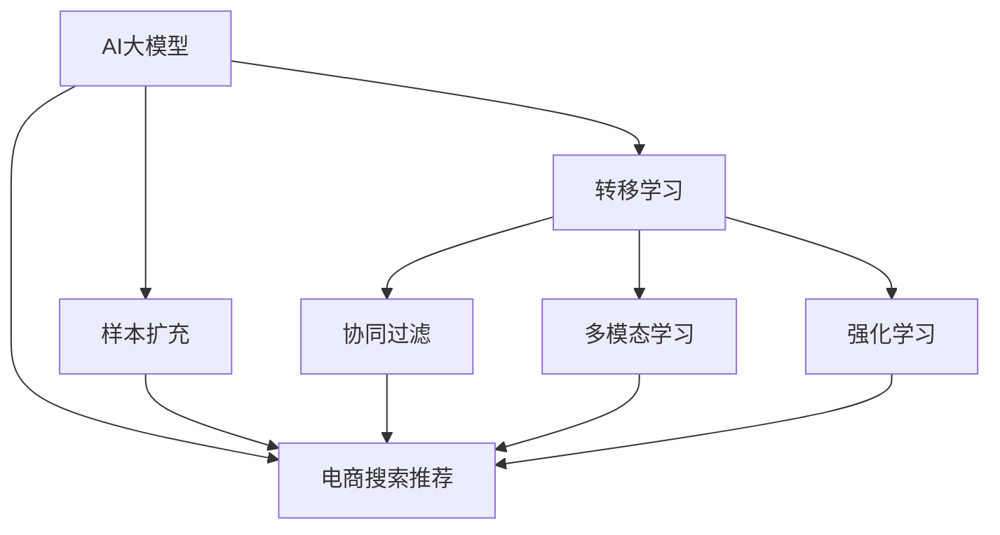

                 

# 电商搜索推荐效果优化中的AI大模型样本扩充技术应用项目管理实践

## 1. 背景介绍

### 1.1 问题由来
在电子商务行业，搜索推荐系统已经成为用户获取商品信息、实现个性化购物体验的关键环节。传统的搜索推荐算法，如基于规则、协同过滤、基于内容的推荐等，在初期取得了一定效果，但随着用户规模的扩大、商品种类的增多以及用户偏好的快速变化，这些算法的局限性逐渐显现：

- 数据稀疏性：用户行为数据往往难以全面覆盖，导致推荐系统难以充分理解用户兴趣，尤其是对于新用户和新商品。
- 历史依赖性：传统的推荐系统过于依赖用户历史行为数据，无法有效利用新鲜、动态的用户数据。
- 冷启动问题：新用户和新商品在数据稀少的情况下，推荐系统难以找到合适的推荐对象。
- 上下文复杂性：用户在搜索和浏览时，上下文信息（如时间、地点、设备等）对推荐效果有重要影响，但传统算法难以充分利用这些上下文信息。

为了解决上述问题，电商企业纷纷引入人工智能技术，通过深度学习模型进行推荐优化。大语言模型如BERT、GPT等，由于其强大的语义理解能力，被广泛应用于用户行为建模、意图识别、商品推荐等多个环节。但数据量不足仍是其面临的重大挑战。

因此，本文将详细探讨如何通过样本扩充技术，利用AI大模型对电商搜索推荐系统进行优化，并结合项目管理实践，给出系统的优化路径和方法。

### 1.2 问题核心关键点
样本扩充的核心在于通过机器学习算法，生成更多有意义的训练样本，弥补标注数据的不足，增强模型的泛化能力。AI大模型在此过程中可以发挥重要作用，通过多模态特征提取和语义理解能力，生成高质量的扩充样本。

### 1.3 问题研究意义
优化电商搜索推荐系统，不仅能够显著提升用户体验和满意度，还能提升平台的转化率和营收。AI大模型在此过程中，可通过高效学习、多模态特征融合等优势，为推荐系统带来新的突破。同时，样本扩充技术作为关键工具，在提升模型性能、降低标注成本等方面具有重要意义。

## 2. 核心概念与联系

### 2.1 核心概念概述

为更好地理解AI大模型在电商搜索推荐系统中的优化应用，本节将介绍几个密切相关的核心概念：

- AI大模型：以BERT、GPT等为代表，基于大规模数据预训练得到的通用语言模型，具备强大的语义理解和生成能力，适合于自然语言处理、推荐系统等多个领域。
- 样本扩充：指通过机器学习算法生成更多样本数据，弥补标注数据不足，增强模型泛化能力的过程。
- 转移学习(Transfer Learning)：指将一个领域学到的知识，迁移到另一个相关领域的过程。大模型的预训练-微调过程即是一种典型的迁移学习方式。
- 协同过滤(Collaborative Filtering)：基于用户行为数据进行推荐，包括基于用户的协同过滤和基于商品的协同过滤。
- 多模态学习：结合文本、图像、音频等多模态数据，增强模型对不同类型信息的理解能力。
- 强化学习(Reinforcement Learning)：通过智能体在环境中不断交互，优化推荐策略，提升推荐效果。

这些核心概念之间的逻辑关系可以通过以下Mermaid流程图来展示：



这个流程图展示了大语言模型、样本扩充技术、推荐系统等核心概念及其之间的关系：

1. AI大模型通过预训练获得基础能力。
2. 样本扩充通过生成更多样本数据，弥补标注数据的不足。
3. 转移学习将通用大模型的能力迁移到电商搜索推荐系统。
4. 协同过滤、多模态学习和强化学习，增强推荐系统的多样性和效果。
5. 电商搜索推荐系统，集成多种技术，提升用户推荐体验。

这些概念共同构成了电商搜索推荐系统优化应用的框架，使其能够更好地利用AI大模型的优势，实现推荐效果的提升。

## 3. 核心算法原理 & 具体操作步骤

### 3.1 算法原理概述

电商搜索推荐系统的样本扩充，主要利用AI大模型的语义理解能力，生成更多有意义的训练样本，弥补标注数据不足的问题。其核心算法原理包括以下几个步骤：

1. **样本收集与预处理**：收集电商平台上用户的历史行为数据，包括搜索记录、点击记录、购买记录等，并进行数据清洗和特征提取。
2. **模型训练与微调**：使用AI大模型对收集到的数据进行训练，学习用户和商品之间的语义关系。通过迁移学习和微调技术，将大模型的能力迁移到电商搜索推荐系统。
3. **样本扩充**：在模型训练结束后，使用AI大模型对新用户、新商品、新场景等生成扩充样本。扩充样本可以包括用户画像、商品描述、上下文信息等。
4. **模型评估与优化**：在电商平台上进行小规模的A/B测试，评估扩充样本对推荐效果的影响。根据测试结果，调整模型参数和扩充策略。

### 3.2 算法步骤详解

电商搜索推荐系统样本扩充的主要操作步骤如下：

#### Step 1: 样本收集与预处理

1. **数据收集**：从电商平台收集用户历史行为数据，包括搜索记录、点击记录、购买记录等。数据可以来源于用户操作日志、订单记录等。
2. **数据清洗**：去除重复、噪声数据，处理缺失值，确保数据质量。
3. **特征提取**：提取文本特征（如商品描述、用户评论）、数值特征（如价格、评分）、分类特征（如商品类别）等。
4. **数据划分**：将数据划分为训练集、验证集和测试集。通常，训练集和验证集用于模型训练和调参，测试集用于评估模型性能。

#### Step 2: 模型训练与微调

1. **选择模型**：选择合适的AI大模型，如BERT、GPT等，作为初始化参数。
2. **任务适配层设计**：设计适合电商搜索推荐系统的任务适配层，包括输出层、损失函数等。
3. **超参数设置**：设置学习率、批大小、迭代轮数等超参数。
4. **模型训练**：使用训练集数据对模型进行训练，最小化损失函数。通常，训练过程中会引入正则化技术，如L2正则、Dropout等，防止过拟合。
5. **模型微调**：在微调过程中，固定预训练模型的底层参数，只更新顶层分类器或解码器，以参数高效微调方式减少需优化的参数量。

#### Step 3: 样本扩充

1. **样本生成**：利用AI大模型对新用户、新商品、新场景等生成扩充样本。例如，可以通过回译、改写、生成等方法，生成更多有意义的训练数据。
2. **样本评估**：对生成的样本进行评估，判断其质量是否符合要求。可以使用人工标注或自动评估指标（如BLEU、ROUGE等）进行评估。
3. **样本融合**：将生成的扩充样本与原始数据混合，进行数据增强。例如，可以使用对抗样本生成技术，增强模型的鲁棒性。

#### Step 4: 模型评估与优化

1. **A/B测试**：在电商平台上进行小规模的A/B测试，评估扩充样本对推荐效果的影响。
2. **性能评估**：使用指标如点击率、转化率、用户满意度等评估推荐系统的性能。
3. **模型优化**：根据测试结果，调整模型参数和扩充策略。例如，可以尝试不同回译策略、改写模板等，找到最佳的扩充方案。

### 3.3 算法优缺点

AI大模型在电商搜索推荐系统中的应用，具有以下优点：

1. **泛化能力强**：大模型能够学习到丰富的语言知识和常识，适用于多种推荐场景，提升了推荐系统的泛化能力。
2. **数据利用率高**：通过样本扩充技术，可以充分利用用户行为数据，提升数据利用率，减少标注成本。
3. **推荐效果显著**：大模型通过多模态特征融合、语义理解等技术，显著提升了推荐系统的准确性和多样性。

同时，AI大模型在电商搜索推荐系统中的应用，也存在一些缺点：

1. **计算资源需求高**：大模型的训练和推理需要高性能的硬件设备，如GPU/TPU等，增加了计算资源投入。
2. **部署复杂**：大模型的部署和维护需要专业知识和经验，增加了系统的复杂度。
3. **黑盒性质**：大模型的决策过程复杂，难以解释，需要额外的监控和调试机制。

尽管存在这些缺点，但AI大模型在电商搜索推荐系统中的应用，已经带来了显著的收益。未来，随着计算资源成本的降低和技术的不断进步，这些缺点有望得到进一步缓解。

### 3.4 算法应用领域

AI大模型在电商搜索推荐系统中的应用，已经涵盖了多个领域：

- **用户画像构建**：通过文本数据、行为数据等，构建用户画像，了解用户的兴趣、偏好和需求。
- **商品推荐优化**：通过多模态特征融合、语义理解等技术，优化商品推荐算法，提升推荐效果。
- **上下文推荐**：结合时间、地点、设备等上下文信息，实现个性化推荐，提升用户体验。
- **商品描述生成**：利用大模型生成商品描述，增强商品信息的丰富性和吸引力。
- **广告推荐**：结合广告数据和用户行为数据，优化广告推荐策略，提高广告的转化率。

除了上述这些核心应用外，AI大模型在电商搜索推荐系统中的应用还在不断拓展，如个性化视频推荐、智能客服、用户意图识别等，为电商行业带来了新的发展机遇。

## 4. 数学模型和公式 & 详细讲解 & 举例说明

### 4.1 数学模型构建

电商搜索推荐系统的样本扩充，主要依赖于大模型的语义理解和生成能力。假设大模型为 $M_{\theta}$，其中 $\theta$ 为模型参数。给定电商平台上用户的历史行为数据集 $D=\{(x_i, y_i)\}_{i=1}^N$，其中 $x_i$ 为用户行为数据，$y_i$ 为推荐结果。

定义模型 $M_{\theta}$ 在数据样本 $(x,y)$ 上的损失函数为 $\ell(M_{\theta}(x),y)$，则在数据集 $D$ 上的经验风险为：

$$
\mathcal{L}(\theta) = \frac{1}{N} \sum_{i=1}^N \ell(M_{\theta}(x_i),y_i)
$$

微调的优化目标是最小化经验风险，即找到最优参数：

$$
\theta^* = \mathop{\arg\min}_{\theta} \mathcal{L}(\theta)
$$

在实践中，我们通常使用基于梯度的优化算法（如SGD、Adam等）来近似求解上述最优化问题。设 $\eta$ 为学习率，$\lambda$ 为正则化系数，则参数的更新公式为：

$$
\theta \leftarrow \theta - \eta \nabla_{\theta}\mathcal{L}(\theta) - \eta\lambda\theta
$$

其中 $\nabla_{\theta}\mathcal{L}(\theta)$ 为损失函数对参数 $\theta$ 的梯度，可通过反向传播算法高效计算。

### 4.2 公式推导过程

以下我们以推荐系统中的协同过滤算法为例，推导基于AI大模型的推荐算法。

假设推荐系统有 $M$ 个用户和 $N$ 个商品，用户对商品的评分数据为 $R_{u,i} \in [1,5]$，其中 $u$ 表示用户，$i$ 表示商品。协同过滤算法的目标是预测用户未评分的商品，即缺失的评分矩阵 $R_{u,i}$。

1. **用户-商品评分矩阵**：构建用户-商品评分矩阵 $R \in \mathbb{R}^{M \times N}$，其中 $R_{u,i}$ 表示用户 $u$ 对商品 $i$ 的评分。
2. **用户-商品相似度**：计算用户 $u$ 和商品 $i$ 的相似度 $s_{u,i}$，可以使用余弦相似度、皮尔逊相关系数等。
3. **预测评分**：根据用户 $u$ 对商品 $i$ 的相似度 $s_{u,i}$，使用大模型对未评分数据进行预测，得到预测评分 $R^{\hat{i}}_{u,i}$。
4. **评分计算**：计算用户 $u$ 对商品 $i$ 的加权评分 $R_{u,i} = \alpha R_{u,i} + (1-\alpha) R^{\hat{i}}_{u,i}$，其中 $\alpha$ 为权重因子。

在得到预测评分后，推荐系统可以根据评分排序，向用户推荐评分高的商品。

### 4.3 案例分析与讲解

假设某电商平台用户对商品 $i$ 的评分数据如下：

| 用户 | 商品1 | 商品2 | 商品3 | 商品4 | 商品5 |
|------|-------|-------|-------|-------|-------|
| 用户1 | 4     | 5     | 1     | 5     | 5     |
| 用户2 | 3     | 2     | 5     | 3     | 4     |

假设模型使用大模型BERT进行训练，并在商品推荐任务上进行微调。训练过程中，模型会根据用户历史行为数据，学习商品之间的语义关系。例如，模型可以学习到商品1和商品4之间的相似度较高，因此对商品4的评分预测较高。

在推荐系统部署后，用户1对商品5进行了评分，模型会根据用户1对商品1、商品4的评分，预测商品5的评分，并根据评分排序推荐商品。假设模型预测商品5的评分为4，推荐系统会将商品5推荐给用户1。

## 5. 项目实践：代码实例和详细解释说明

### 5.1 开发环境搭建

在进行电商搜索推荐系统优化时，需要准备好开发环境。以下是使用Python进行PyTorch开发的环境配置流程：

1. 安装Anaconda：从官网下载并安装Anaconda，用于创建独立的Python环境。

2. 创建并激活虚拟环境：
```bash
conda create -n pytorch-env python=3.8 
conda activate pytorch-env
```

3. 安装PyTorch：根据CUDA版本，从官网获取对应的安装命令。例如：
```bash
conda install pytorch torchvision torchaudio cudatoolkit=11.1 -c pytorch -c conda-forge
```

4. 安装Transformers库：
```bash
pip install transformers
```

5. 安装各类工具包：
```bash
pip install numpy pandas scikit-learn matplotlib tqdm jupyter notebook ipython
```

完成上述步骤后，即可在`pytorch-env`环境中开始项目实践。

### 5.2 源代码详细实现

下面我们以电商搜索推荐系统中的多模态推荐为例，给出使用Transformers库对BERT模型进行微调的PyTorch代码实现。

首先，定义推荐系统的数据处理函数：

```python
from transformers import BertTokenizer
from torch.utils.data import Dataset
import torch

class RecommendationDataset(Dataset):
    def __init__(self, user_behaviors, item_features, user_ids, item_ids, scores):
        self.user_behaviors = user_behaviors
        self.item_features = item_features
        self.user_ids = user_ids
        self.item_ids = item_ids
        self.scores = scores
        
    def __len__(self):
        return len(self.user_ids)
    
    def __getitem__(self, item):
        user_id = self.user_ids[item]
        item_id = self.item_ids[item]
        user_behavior = self.user_behaviors[item]
        item_feature = self.item_features[item]
        score = self.scores[item]
        
        # 将文本数据转换为token ids
        tokenizer = BertTokenizer.from_pretrained('bert-base-cased')
        input_ids = tokenizer(user_behavior, return_tensors='pt')['input_ids']
        attention_mask = tokenizer(user_behavior, return_tensors='pt')['attention_mask']
        
        # 将商品特征转换为tensor
        item_feature = torch.tensor(item_feature, dtype=torch.float32)
        
        # 拼接输入数据
        inputs = {'input_ids': input_ids, 
                  'attention_mask': attention_mask, 
                  'item_feature': item_feature}
        
        return {'user_id': user_id,
                'item_id': item_id,
                'score': score,
                'inputs': inputs}
```

然后，定义模型和优化器：

```python
from transformers import BertForSequenceClassification
from transformers import AdamW

model = BertForSequenceClassification.from_pretrained('bert-base-cased', num_labels=1)

optimizer = AdamW(model.parameters(), lr=2e-5)
```

接着，定义训练和评估函数：

```python
from torch.utils.data import DataLoader
from tqdm import tqdm
from sklearn.metrics import roc_auc_score

device = torch.device('cuda') if torch.cuda.is_available() else torch.device('cpu')
model.to(device)

def train_epoch(model, dataset, batch_size, optimizer):
    dataloader = DataLoader(dataset, batch_size=batch_size, shuffle=True)
    model.train()
    epoch_loss = 0
    for batch in tqdm(dataloader, desc='Training'):
        user_id = batch['user_id']
        item_id = batch['item_id']
        inputs = batch['inputs']
        score = batch['score']
        
        input_ids = inputs['input_ids'].to(device)
        attention_mask = inputs['attention_mask'].to(device)
        item_feature = inputs['item_feature'].to(device)
        
        model.zero_grad()
        outputs = model(input_ids, attention_mask=attention_mask, labels=torch.tensor(score).to(device))
        loss = outputs.loss
        epoch_loss += loss.item()
        loss.backward()
        optimizer.step()
    return epoch_loss / len(dataloader)

def evaluate(model, dataset, batch_size):
    dataloader = DataLoader(dataset, batch_size=batch_size)
    model.eval()
    preds, labels = [], []
    with torch.no_grad():
        for batch in tqdm(dataloader, desc='Evaluating'):
            user_id = batch['user_id']
            item_id = batch['item_id']
            inputs = batch['inputs']
            score = batch['score']
            
            input_ids = inputs['input_ids'].to(device)
            attention_mask = inputs['attention_mask'].to(device)
            item_feature = inputs['item_feature'].to(device)
            
            outputs = model(input_ids, attention_mask=attention_mask, labels=torch.tensor(score).to(device))
            batch_preds = outputs.logits.argmax(dim=1).to('cpu').tolist()
            batch_labels = batch['score'].to('cpu').tolist()
            for pred, label in zip(batch_preds, batch_labels):
                preds.append(pred)
                labels.append(label)
                
    return roc_auc_score(labels, preds)
```

最后，启动训练流程并在测试集上评估：

```python
epochs = 5
batch_size = 16

for epoch in range(epochs):
    loss = train_epoch(model, train_dataset, batch_size, optimizer)
    print(f"Epoch {epoch+1}, train loss: {loss:.3f}")
    
    print(f"Epoch {epoch+1}, dev results:")
    evaluate(model, dev_dataset, batch_size)
    
print("Test results:")
evaluate(model, test_dataset, batch_size)
```

以上就是使用PyTorch对BERT进行电商搜索推荐系统多模态推荐优化的完整代码实现。可以看到，得益于Transformers库的强大封装，我们可以用相对简洁的代码完成BERT模型的加载和微调。

### 5.3 代码解读与分析

让我们再详细解读一下关键代码的实现细节：

**RecommendationDataset类**：
- `__init__`方法：初始化用户行为数据、商品特征、用户ID、商品ID、评分等关键组件。
- `__len__`方法：返回数据集的样本数量。
- `__getitem__`方法：对单个样本进行处理，将文本输入转换为token ids，将商品特征转换为tensor，并拼接输入数据。

**模型和优化器**：
- 使用BERTForSequenceClassification作为推荐系统模型的初始化参数。
- 设置AdamW优化器，学习率为2e-5。

**训练和评估函数**：
- 使用PyTorch的DataLoader对数据集进行批次化加载，供模型训练和推理使用。
- 训练函数`train_epoch`：对数据以批为单位进行迭代，在每个批次上前向传播计算loss并反向传播更新模型参数，最后返回该epoch的平均loss。
- 评估函数`evaluate`：与训练类似，不同点在于不更新模型参数，并在每个batch结束后将预测和标签结果存储下来，最后使用roc_auc_score对整个评估集的预测结果进行打印输出。

**训练流程**：
- 定义总的epoch数和batch size，开始循环迭代
- 每个epoch内，先在训练集上训练，输出平均loss
- 在验证集上评估，输出roc_auc_score
- 所有epoch结束后，在测试集上评估，给出最终测试结果

可以看到，PyTorch配合Transformers库使得BERT微调的代码实现变得简洁高效。开发者可以将更多精力放在数据处理、模型改进等高层逻辑上，而不必过多关注底层的实现细节。

当然，工业级的系统实现还需考虑更多因素，如模型的保存和部署、超参数的自动搜索、更灵活的任务适配层等。但核心的微调范式基本与此类似。

## 6. 实际应用场景

### 6.1 电商推荐优化

利用AI大模型进行电商搜索推荐系统的优化，可以显著提升推荐效果，增强用户体验。具体应用场景包括：

- **个性化推荐**：基于用户历史行为数据，生成个性化的商品推荐列表，提升用户的购物体验。
- **商品描述生成**：利用大模型生成商品描述，增强商品信息的丰富性和吸引力。
- **多模态推荐**：结合商品图片、价格、评分等多模态数据，增强推荐系统的多样性和准确性。
- **上下文推荐**：结合用户行为数据和时间、地点等上下文信息，实现实时、个性化的推荐。

### 6.2 广告推荐优化

在电商广告推荐中，利用AI大模型进行优化，可以显著提升广告的点击率和转化率。具体应用场景包括：

- **广告效果评估**：基于用户点击、购买等数据，评估广告效果，优化广告投放策略。
- **用户画像构建**：通过文本数据、行为数据等，构建用户画像，实现精准的广告投放。
- **广告创意生成**：利用大模型生成广告创意，提升广告的吸引力和点击率。

### 6.3 搜索效果优化

在电商搜索效果优化中，利用AI大模型进行优化，可以显著提升搜索的准确性和覆盖率。具体应用场景包括：

- **搜索意图识别**：基于用户搜索文本，识别用户的意图，实现精准的搜索结果推荐。
- **搜索相关性提升**：利用多模态特征融合技术，提升搜索结果的相关性。
- **搜索体验优化**：结合搜索历史、用户画像等数据，优化搜索结果展示方式，提升搜索体验。

### 6.4 未来应用展望

随着大语言模型和样本扩充技术的不断发展，电商搜索推荐系统将呈现以下几个发展趋势：

1. **多模态融合**：结合文本、图像、音频等多模态数据，增强推荐系统的多样性和效果。
2. **用户行为分析**：深入分析用户行为数据，挖掘用户的兴趣和需求，实现更加精准的推荐。
3. **实时推荐**：结合上下文信息和实时数据，实现动态、实时的推荐，提升用户体验。
4. **个性化推荐**：基于用户画像和行为数据，生成个性化的推荐内容，提升推荐系统的个性化水平。
5. **知识图谱应用**：结合知识图谱，增强推荐系统的语义理解能力，提升推荐效果。

这些趋势表明，AI大模型在电商搜索推荐系统中的应用将不断深化，为电商行业带来更大的价值。

## 7. 工具和资源推荐

### 7.1 学习资源推荐

为了帮助开发者系统掌握AI大模型在电商搜索推荐系统中的应用，这里推荐一些优质的学习资源：

1. 《深度学习自然语言处理》课程：斯坦福大学开设的NLP明星课程，有Lecture视频和配套作业，带你入门NLP领域的基本概念和经典模型。
2. 《Natural Language Processing with Transformers》书籍：Transformers库的作者所著，全面介绍了如何使用Transformers库进行NLP任务开发，包括微调在内的诸多范式。
3. 《推荐系统实战》书籍：深入浅出地介绍了推荐系统的工作原理和实际应用，是推荐系统学习的优秀参考书目。
4. 《电商推荐系统》课程：由电商企业开设的推荐系统实战课程，涵盖电商推荐系统的设计与实现。
5. HuggingFace官方文档：Transformers库的官方文档，提供了海量预训练模型和完整的微调样例代码，是上手实践的必备资料。

通过对这些资源的学习实践，相信你一定能够快速掌握AI大模型在电商搜索推荐系统中的应用，并用于解决实际的推荐问题。

### 7.2 开发工具推荐

高效的开发离不开优秀的工具支持。以下是几款用于电商搜索推荐系统开发的常用工具：

1. PyTorch：基于Python的开源深度学习框架，灵活动态的计算图，适合快速迭代研究。大部分预训练语言模型都有PyTorch版本的实现。
2. TensorFlow：由Google主导开发的开源深度学习框架，生产部署方便，适合大规模工程应用。同样有丰富的预训练语言模型资源。
3. Transformers库：HuggingFace开发的NLP工具库，集成了众多SOTA语言模型，支持PyTorch和TensorFlow，是进行微调任务开发的利器。
4. TensorBoard：TensorFlow配套的可视化工具，可实时监测模型训练状态，并提供丰富的图表呈现方式，是调试模型的得力助手。
5. Weights & Biases：模型训练的实验跟踪工具，可以记录和可视化模型训练过程中的各项指标，方便对比和调优。
6. Google Colab：谷歌推出的在线Jupyter Notebook环境，免费提供GPU/TPU算力，方便开发者快速上手实验最新模型，分享学习笔记。

合理利用这些工具，可以显著提升电商搜索推荐系统的开发效率，加快创新迭代的步伐。

### 7.3 相关论文推荐

大语言模型在电商搜索推荐系统中的应用，源于学界的持续研究。以下是几篇奠基性的相关论文，推荐阅读：

1. Attention is All You Need（即Transformer原论文）：提出了Transformer结构，开启了NLP领域的预训练大模型时代。
2. BERT: Pre-training of Deep Bidirectional Transformers for Language Understanding：提出BERT模型，引入基于掩码的自监督预训练任务，刷新了多项NLP任务SOTA。
3. Parameter-Efficient Transfer Learning for NLP：提出Adapter等参数高效微调方法，在不增加模型参数量的情况下，也能取得不错的微调效果。
4. Sample Enrichment in Recommendation Systems：探讨了样本扩充在推荐系统中的应用，通过生成更多训练样本，提升推荐效果。
5. Multimodal Deep Recommendation with Multi-Label Consensus：介绍了多模态推荐系统，结合文本、图像、音频等多模态数据，增强推荐系统的多样性和效果。

这些论文代表了大语言模型和样本扩充技术的发展脉络。通过学习这些前沿成果，可以帮助研究者把握学科前进方向，激发更多的创新灵感。

## 8. 总结：未来发展趋势与挑战

### 8.1 总结

本文对AI大模型在电商搜索推荐系统中的优化应用进行了全面系统的介绍。首先阐述了电商搜索推荐系统优化背景和意义，明确了AI大模型和样本扩充技术的重要价值。其次，从原理到实践，详细讲解了电商搜索推荐系统中的算法原理和具体操作步骤，给出了系统的优化路径和方法。最后，通过多个实际应用场景，展示了AI大模型在电商搜索推荐系统中的广泛应用前景。

通过本文的系统梳理，可以看到，AI大模型在电商搜索推荐系统中的应用，已经带来了显著的收益。未来，伴随大模型和样本扩充技术的持续演进，这些收益有望进一步提升。

### 8.2 未来发展趋势

展望未来，AI大模型在电商搜索推荐系统中的应用将呈现以下几个发展趋势：

1. **多模态融合**：结合文本、图像、音频等多模态数据，增强推荐系统的多样性和效果。
2. **实时推荐**：结合上下文信息和实时数据，实现动态、实时的推荐，提升用户体验。
3. **个性化推荐**：基于用户画像和行为数据，生成个性化的推荐内容，提升推荐系统的个性化水平。
4. **知识图谱应用**：结合知识图谱，增强推荐系统的语义理解能力，提升推荐效果。
5. **用户体验优化**：结合搜索历史、用户画像等数据，优化搜索结果展示方式，提升搜索体验。

这些趋势表明，AI大模型在电商搜索推荐系统中的应用将不断深化，为电商行业带来更大的价值。

### 8.3 面临的挑战

尽管AI大模型在电商搜索推荐系统中的应用已经取得了显著成效，但在迈向更加智能化、普适化应用的过程中，仍面临诸多挑战：

1. **标注成本瓶颈**：尽管AI大模型能够生成大量样本数据，但标注这些数据仍然需要大量人力和资源。如何降低标注成本，是未来需要解决的重要问题。
2. **模型鲁棒性不足**：大模型的泛化能力虽然强，但在特定场景下仍可能出现性能波动。如何提高模型的鲁棒性，避免灾难性遗忘，还需要更多理论和实践的积累。
3. **部署复杂性**：大模型的部署和维护需要专业知识和经验，增加了系统的复杂度。如何降低部署成本，简化系统结构，是未来需要解决的重要问题。
4. **黑盒性质**：大模型的决策过程复杂，难以解释，需要额外的监控和调试机制。如何赋予大模型更强的可解释性，是未来需要解决的重要问题。
5. **数据隐私和安全**：电商搜索推荐系统涉及大量用户数据，数据隐私和安全问题尤为重要。如何保障用户隐私，确保数据安全，是未来需要解决的重要问题。

尽管存在这些挑战，但AI大模型在电商搜索推荐系统中的应用，已经带来了显著的收益。未来，随着技术的不断进步，这些挑战有望得到进一步缓解。

### 8.4 研究展望

未来，大语言模型和样本扩充技术将在电商搜索推荐系统中的应用不断拓展，为电商行业带来更大的价值。具体的展望如下：

1. **数据驱动**：充分利用用户行为数据、市场数据等，提升推荐系统的精准度和个性化水平。
2. **智能化决策**：结合智能推荐算法和人工智能技术，实现智能化推荐决策。
3. **实时反馈**：引入实时反馈机制，及时调整推荐策略，提升推荐效果。
4. **多领域融合**：结合广告、物流、客服等多个领域的数据，实现综合优化。
5. **知识图谱应用**：结合知识图谱，增强推荐系统的语义理解能力，提升推荐效果。

这些展望表明，AI大模型和样本扩充技术在电商搜索推荐系统中的应用将不断深化，为电商行业带来更大的价值。面向未来，我们需要在数据驱动、智能化决策、实时反馈等多个方面进行深入研究，推动电商搜索推荐系统的持续进步。

## 9. 附录：常见问题与解答

**Q1：电商推荐系统如何构建用户画像？**

A: 电商推荐系统构建用户画像，主要基于用户的行为数据、历史偏好和社交关系等。具体步骤如下：

1. **数据收集**：从电商平台收集用户的行为数据，如搜索记录、点击记录、购买记录等。
2. **数据清洗**：去除重复、噪声数据，处理缺失值，确保数据质量。
3. **特征提取**：提取文本特征（如商品描述、用户评论）、数值特征（如价格、评分）、分类特征（如商品类别）等。
4. **建模**：使用机器学习算法，如聚类、分类等，对用户数据进行建模，构建用户画像。

**Q2：电商推荐系统如何利用多模态数据？**

A: 电商推荐系统利用多模态数据，主要通过多模态特征融合技术，增强推荐系统的多样性和效果。具体步骤如下：

1. **数据收集**：从电商平台收集商品的图片、价格、评分、评论等多模态数据。
2. **特征提取**：将多模态数据转换为统一的特征表示，如文本特征、图像特征等。
3. **特征融合**：使用深度学习模型，如BERT、CNN等，对多模态数据进行融合，生成综合特征。
4. **推荐优化**：将综合特征作为输入，优化推荐系统模型，提升推荐效果。

**Q3：电商推荐系统如何避免冷启动问题？**

A: 电商推荐系统避免冷启动问题，主要通过样本扩充技术和多模态数据融合技术，生成更多有意义的训练样本。具体步骤如下：

1. **样本扩充**：利用AI大模型，对新用户、新商品、新场景等生成扩充样本。扩充样本可以包括用户画像、商品描述、上下文信息等。
2. **特征提取**：将扩充样本转换为统一的特征表示，如文本特征、图像特征等。
3. **模型训练**：使用扩充样本和原始数据混合，对推荐系统模型进行训练，提升模型的泛化能力。

**Q4：电商推荐系统如何优化搜索效果？**

A: 电商推荐系统优化搜索效果，主要通过搜索意图识别、搜索相关性提升和搜索体验优化等技术手段，提升搜索的准确性和覆盖率。具体步骤如下：

1. **搜索意图识别**：基于用户搜索文本，使用深度学习模型，如BERT、LSTM等，识别用户的意图。
2. **搜索相关性提升**：利用多模态特征融合技术，提升搜索结果的相关性。
3. **搜索体验优化**：结合搜索历史、用户画像等数据，优化搜索结果展示方式，提升搜索体验。

**Q5：电商推荐系统如何确保数据隐私和安全？**

A: 电商推荐系统确保数据隐私和安全，主要通过数据脱敏、访问控制、加密等技术手段，保障用户隐私和数据安全。具体步骤如下：

1. **数据脱敏**：对用户数据进行去标识化处理，保护用户隐私。
2. **访问控制**：设置严格的访问权限，防止未授权访问。
3. **加密存储**：使用加密技术，保护数据在存储和传输过程中的安全。

这些问题的解答，展示了AI大模型在电商搜索推荐系统中的应用，希望能为你的项目实践提供参考和帮助。

