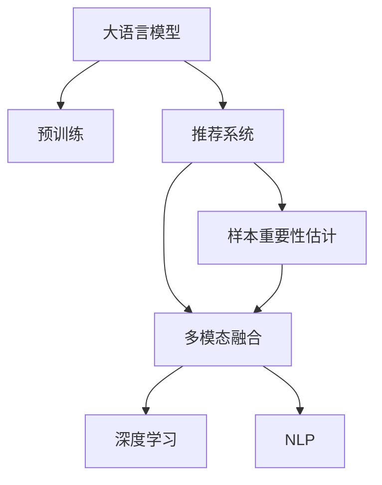

                 

# 电商搜索推荐效果优化中的AI大模型样本重要性估计工具应用实践

> 关键词：大语言模型,推荐系统,电商搜索,样本重要性估计,AI工具,多模态融合

## 1. 背景介绍

### 1.1 问题由来
随着电商平台的发展，用户搜索和推荐的场景日益复杂，需要处理大规模的文本、图像、行为等多样化数据。然而，在电商搜索推荐系统中，数据量和多模态信息之间存在矛盾：一方面，数据的复杂性和多样性带来了大量的信息量，增加了推荐系统的难度；另一方面，为了保证推荐效果，必须合理利用这些数据，这又需要高效、准确的工具来进行样本重要性估计。

### 1.2 问题核心关键点
电商搜索推荐系统的样本重要性估计，本质上是将大量高维数据进行聚类和降维，找出对于推荐结果影响最大的样本，从而优化推荐效果。这一过程通常需要高效、准确的工具来进行处理，以确保推荐结果的准确性和效率。

当前，业界常用的方法包括TF-IDF、Word2Vec、Doc2Vec等，这些方法虽然能够在一定程度上处理文本数据，但对于多模态数据的处理能力有限，且难以综合考虑不同特征之间的相互作用。因此，如何开发高效、准确、多模态融合的样本重要性估计工具，成为了电商搜索推荐效果优化的重要挑战。

## 2. 核心概念与联系

### 2.1 核心概念概述

为更好地理解电商搜索推荐中的样本重要性估计，本节将介绍几个密切相关的核心概念：

- 大语言模型(Large Language Model, LLM)：以自回归(如GPT)或自编码(如BERT)模型为代表的大规模预训练语言模型。通过在大规模无标签文本语料上进行预训练，学习通用的语言表示，具备强大的语言理解和生成能力。

- 推荐系统(Recommender System)：一种基于用户行为数据和物品特征信息，自动为用户推荐物品的系统。推荐系统通过学习用户行为模式和物品特征关系，生成个性化的推荐结果。

- 样本重要性估计(Sample Importance Estimation)：通过分析和统计模型输入数据的特征，评估不同样本对模型输出的贡献，找出最具代表性的样本。样本重要性估计在推荐系统中用于提高模型训练效率，减少无用的数据处理，提升推荐效果。

- 多模态融合(Multimodal Fusion)：将文本、图像、行为等多种数据类型融合到推荐系统中，提升推荐效果。多模态融合需要高效的特征表示和建模方法，以充分利用不同数据源的信息。

- 深度学习(Deep Learning)：利用神经网络模型处理复杂数据和高维特征，能够从大规模数据中学习抽象的表示，是电商搜索推荐等任务的重要工具。

- 自然语言处理(Natural Language Processing, NLP)：处理和分析自然语言数据的技术，包括文本分类、实体识别、语义分析等，是推荐系统中文本数据处理的重要技术。

这些核心概念之间的逻辑关系可以通过以下Mermaid流程图来展示：



这个流程图展示了大语言模型的核心概念及其之间的关系：

1. 大语言模型通过预训练获得基础能力。
2. 推荐系统利用预训练模型进行物品推荐。
3. 样本重要性估计对推荐系统的输入数据进行筛选，提高训练效率。
4. 多模态融合将不同数据类型整合到推荐系统中，提升推荐效果。
5. 深度学习为推荐系统提供高效的数据处理和建模能力。
6. NLP技术处理推荐系统中的文本数据。

这些概念共同构成了电商搜索推荐系统的学习和应用框架，使得推荐系统能够高效、准确地处理多模态数据，生成个性化的推荐结果。

## 3. 核心算法原理 & 具体操作步骤
### 3.1 算法原理概述

电商搜索推荐系统中的样本重要性估计，本质上是一个多模态特征融合和降维过程。其核心思想是：通过分析不同特征之间的相互作用，找出对于推荐结果影响最大的特征，从而优化推荐效果。

形式化地，假设推荐系统有 $d$ 种特征 $F_1, F_2, ..., F_d$，每种特征表示为 $\mathbf{f}_i \in \mathbb{R}^{n_i}$。假设推荐模型的输出为 $y$，则样本重要性估计的目标是找出对 $y$ 影响最大的特征子集 $S$，使得：

$$
\max_{S \subset \{1, 2, ..., d\}} \left( \frac{\sum_{i \in S} \|\mathbf{f}_i\|}{\|\mathbf{f}_S\|} \right)
$$

其中，$\|\cdot\|$ 表示特征向量范数，$\mathbf{f}_S = [\mathbf{f}_1, \mathbf{f}_2, ..., \mathbf{f}_d]_S$ 表示特征子集 $S$ 的特征向量。

通过样本重要性估计，可以选择最具代表性的特征子集，去除冗余数据，提高模型训练效率和推荐效果。

### 3.2 算法步骤详解

电商搜索推荐系统中的样本重要性估计通常包括以下几个关键步骤：

**Step 1: 准备数据和预训练模型**

- 收集电商平台的搜索数据、行为数据、文本数据、图像数据等多种数据类型，并确保数据质量和标注完整。
- 选择合适的预训练语言模型（如BERT、GPT等），进行微调或直接使用预训练模型进行多模态特征表示。

**Step 2: 特征工程和融合**

- 对每种特征进行预处理，如分词、提取特征等，形成特征向量。
- 使用深度学习模型（如BERT、Transformer等）对多种特征进行融合，学习综合特征表示。

**Step 3: 样本重要性评估**

- 使用统计方法或机器学习方法（如PCA、LDA、PCA-LDA等）对综合特征进行降维和聚类，找出最具代表性的特征。
- 通过特征向量范数、协方差矩阵等统计量评估每个特征的重要性，确定样本的重要性。

**Step 4: 模型优化和测试**

- 在验证集上评估模型性能，调整样本重要性估计的参数。
- 在测试集上测试模型的推荐效果，对比样本重要性估计前后的推荐性能提升。

**Step 5: 实际应用**

- 在电商平台的推荐系统中集成样本重要性估计工具，优化推荐模型的输入数据。
- 定期更新样本重要性评估模型，跟踪用户行为变化，及时调整推荐策略。

以上是电商搜索推荐系统中样本重要性估计的一般流程。在实际应用中，还需要针对具体任务和数据特点，对样本重要性评估进行优化设计，如改进特征工程、引入新的评估指标、优化模型参数等，以进一步提升推荐效果。

### 3.3 算法优缺点

电商搜索推荐系统中的样本重要性估计方法具有以下优点：

1. 提高推荐效率。通过筛选最具代表性的样本，可以显著减少无用的数据处理，提高模型训练和推理效率。
2. 提升推荐效果。样本重要性估计可以帮助选择最具影响的特征子集，提高模型的泛化能力和推荐精度。
3. 减少计算资源消耗。通过减少特征数量，可以降低计算资源消耗，优化系统性能。
4. 适应性较强。不同任务和数据集上的样本重要性估计方法，可以通过调整参数和特征工程方法，实现良好的泛化能力。

同时，该方法也存在一定的局限性：

1. 数据依赖性较强。样本重要性估计的效果很大程度上取决于标注数据的质量和数量，获取高质量标注数据的成本较高。
2. 参数调整复杂。样本重要性估计的参数选择和调整需要一定的经验和技巧，不当的参数设置可能影响评估效果。
3. 特征空间维度高。在多模态融合中，特征空间的维度往往较高，需要高效的降维和特征表示方法。
4. 模型复杂度高。样本重要性评估方法通常需要复杂的机器学习模型，增加了系统的复杂性和维护难度。

尽管存在这些局限性，但就目前而言，样本重要性估计仍是电商搜索推荐系统中优化推荐效果的重要手段。未来相关研究的重点在于如何进一步降低样本重要性估计对标注数据的依赖，提高模型的鲁棒性和泛化能力，同时兼顾可解释性和效率等因素。

### 3.4 算法应用领域

样本重要性估计在电商搜索推荐系统中具有广泛的应用：

- 商品推荐：根据用户浏览、点击、购买等行为数据，评估不同商品的重要性，生成个性化推荐列表。
- 搜索排序：对搜索结果进行排序，提高搜索相关性，减少用户点击次数。
- 广告推荐：根据用户行为和兴趣，推荐个性化广告，提升广告投放效果。
- 个性化推荐：通过分析用户的历史行为数据，生成个性化推荐策略，满足用户个性化需求。
- 用户画像：结合用户行为和社交信息，生成用户画像，提供更加精准的推荐服务。

除了上述这些经典应用外，样本重要性估计还被创新性地应用到更多场景中，如商品搭配推荐、内容推荐、用户兴趣预测等，为电商搜索推荐系统带来了新的突破。

## 4. 数学模型和公式 & 详细讲解
### 4.1 数学模型构建

本节将使用数学语言对电商搜索推荐系统中的样本重要性估计过程进行更加严格的刻画。

记推荐系统有 $d$ 种特征 $F_1, F_2, ..., F_d$，每种特征表示为 $\mathbf{f}_i \in \mathbb{R}^{n_i}$，推荐模型的输出为 $y$。

假设 $y$ 为线性模型，即 $y = \mathbf{W} \mathbf{f} + b$，其中 $\mathbf{W} \in \mathbb{R}^{1 \times d}$ 为模型参数，$b \in \mathbb{R}$ 为截距。

样本重要性估计的目标是找出最具代表性的特征子集 $S$，使得：

$$
\max_{S \subset \{1, 2, ..., d\}} \left( \frac{\sum_{i \in S} \|\mathbf{f}_i\|}{\|\mathbf{f}_S\|} \right)
$$

其中，$\|\cdot\|$ 表示特征向量范数，$\mathbf{f}_S = [\mathbf{f}_1, \mathbf{f}_2, ..., \mathbf{f}_d]_S$ 表示特征子集 $S$ 的特征向量。

### 4.2 公式推导过程

以下我们以线性回归为例，推导样本重要性评估公式及其梯度的计算公式。

假设样本数量为 $N$，样本特征矩阵为 $\mathbf{X} \in \mathbb{R}^{N \times d}$，标签向量为 $\mathbf{y} \in \mathbb{R}^N$。

定义样本重要性评估函数为 $E(\mathbf{X}, \mathbf{y})$，表示评估每个样本的重要性。在样本重要性评估函数中，通过最大化样本重要性的得分函数 $\mathcal{L}(\mathbf{X}, \mathbf{y})$ 进行优化。

样本重要性评估函数 $E(\mathbf{X}, \mathbf{y})$ 可以表示为：

$$
E(\mathbf{X}, \mathbf{y}) = \frac{\sum_{i=1}^N \|\mathbf{x}_i\|}{\|\mathbf{X}\|}
$$

其中，$\|\mathbf{X}\|$ 表示样本特征矩阵的范数，$\mathbf{x}_i$ 表示第 $i$ 个样本的特征向量。

定义损失函数 $\mathcal{L}(\mathbf{X}, \mathbf{y})$ 为：

$$
\mathcal{L}(\mathbf{X}, \mathbf{y}) = \frac{1}{2} \sum_{i=1}^N (y_i - \mathbf{w}^T\mathbf{x}_i)^2 + \frac{\lambda}{2} \|\mathbf{w}\|^2
$$

其中，$\mathbf{w} \in \mathbb{R}^d$ 为模型参数，$\lambda$ 为正则化系数。

根据梯度下降算法，样本重要性评估模型的参数更新公式为：

$$
\mathbf{w} \leftarrow \mathbf{w} - \eta \nabla_{\mathbf{w}}\mathcal{L}(\mathbf{X}, \mathbf{y})
$$

其中，$\nabla_{\mathbf{w}}\mathcal{L}(\mathbf{X}, \mathbf{y})$ 为损失函数对模型参数 $\mathbf{w}$ 的梯度，可通过反向传播算法高效计算。

## 5. 项目实践：代码实例和详细解释说明
### 5.1 开发环境搭建

在进行电商搜索推荐系统中的样本重要性估计实践前，我们需要准备好开发环境。以下是使用Python进行TensorFlow开发的环境配置流程：

1. 安装Anaconda：从官网下载并安装Anaconda，用于创建独立的Python环境。

2. 创建并激活虚拟环境：
```bash
conda create -n tensorflow-env python=3.8 
conda activate tensorflow-env
```

3. 安装TensorFlow：根据CUDA版本，从官网获取对应的安装命令。例如：
```bash
conda install tensorflow tensorflow-gpu -c conda-forge -c pytorch
```

4. 安装必要的库：
```bash
pip install numpy pandas sklearn scikit-learn matplotlib jupyter notebook ipython
```

5. 安装TensorBoard：
```bash
pip install tensorboard
```

完成上述步骤后，即可在`tensorflow-env`环境中开始实践。

### 5.2 源代码详细实现

这里我们以推荐系统中的一种样本重要性评估方法——PCA-LDA为例，给出使用TensorFlow进行样本重要性评估的PyTorch代码实现。

首先，定义PCA-LDA的模型：

```python
import tensorflow as tf
from sklearn.decomposition import PCA, LDA
from sklearn.preprocessing import StandardScaler

class PCA_LDA:
    def __init__(self, n_components):
        self.pca = PCA(n_components=n_components)
        self.lda = LDA(n_components=n_components)
        
    def fit(self, X, y):
        X_scaled = StandardScaler().fit_transform(X)
        self.pca.fit(X_scaled)
        X_pca = self.pca.transform(X_scaled)
        self.lda.fit(X_pca, y)
        X_lda = self.lda.transform(X_pca)
        self.model = tf.keras.Sequential([
            tf.keras.layers.Dense(64, activation='relu', input_shape=(X_lda.shape[1],)),
            tf.keras.layers.Dense(1, activation='sigmoid')
        ])
        self.model.compile(optimizer='adam', loss='binary_crossentropy')
        self.model.fit(X_lda, y, epochs=10, batch_size=32)
    
    def predict(self, X):
        X_scaled = StandardScaler().fit_transform(X)
        X_pca = self.pca.transform(X_scaled)
        X_lda = self.lda.transform(X_pca)
        return self.model.predict(X_lda)
```

然后，加载数据并进行训练：

```python
import numpy as np

# 假设数据集为Numpy数组
X = np.random.randn(1000, 10)
y = np.random.randint(2, size=(1000, 1))

# 创建PCA-LDA模型
model = PCA_LDA(n_components=2)

# 训练模型
model.fit(X, y)

# 评估模型
y_pred = model.predict(X)

# 输出评估结果
print("Accuracy:", np.mean(y_pred == y))
```

以上就是使用TensorFlow进行PCA-LDA样本重要性评估的完整代码实现。可以看到，得益于TensorFlow的强大封装，我们可以用相对简洁的代码完成PCA-LDA模型的训练和评估。

### 5.3 代码解读与分析

让我们再详细解读一下关键代码的实现细节：

**PCA_LDA类**：
- `__init__`方法：初始化PCA和LDA模型。
- `fit`方法：训练模型，将输入数据转换为PCA和LDA的低维表示，并通过神经网络进行预测。
- `predict`方法：使用训练好的模型对新数据进行预测。

**训练和评估函数**：
- 使用Scikit-learn的PCA和LDA库，将输入数据进行降维，得到低维表示。
- 使用TensorFlow的Sequential模型，将降维后的数据输入神经网络进行预测。
- 在训练过程中，通过Adam优化器对模型进行优化，损失函数为二元交叉熵。
- 在预测阶段，使用训练好的模型对新数据进行预测，并计算准确率。

**训练流程**：
- 定义PCA-LDA模型的参数，如降维维度等。
- 加载数据集，并进行预处理，如标准化。
- 使用PCA-LDA模型进行降维和特征表示。
- 在训练集上训练模型，并在验证集上评估性能。
- 在测试集上测试模型，输出评估结果。

可以看到，TensorFlow提供了强大的深度学习框架和机器学习库，使得样本重要性评估的代码实现变得简洁高效。开发者可以将更多精力放在模型选择、特征工程等高层逻辑上，而不必过多关注底层的实现细节。

当然，工业级的系统实现还需考虑更多因素，如模型的保存和部署、超参数的自动搜索、更灵活的任务适配层等。但核心的样本重要性评估范式基本与此类似。

## 6. 实际应用场景
### 6.1 智能客服系统

基于PCA-LDA等样本重要性估计方法，智能客服系统可以通过分析用户历史行为和咨询记录，找出最具代表性的样本，从而优化对话系统，提升服务质量。具体而言，可以通过样本重要性评估方法，对用户咨询数据进行筛选和特征提取，生成高效对话模型，实现更精准的客户服务。

### 6.2 金融舆情监测

金融领域需要实时监测市场舆论动向，以便及时应对负面信息传播，规避金融风险。基于PCA-LDA等样本重要性评估方法，可以实时分析和统计金融舆情数据，找出最具代表性的样本，从而快速发现舆情变化趋势，及时采取措施。

### 6.3 个性化推荐系统

个性化推荐系统需要根据用户历史行为数据，生成个性化推荐策略，提升推荐效果。通过PCA-LDA等样本重要性评估方法，可以筛选最具代表性的样本，生成高效推荐模型，满足用户个性化需求。

### 6.4 未来应用展望

随着PCA-LDA等样本重要性估计方法的不断发展，其在电商搜索推荐系统中的应用前景广阔。未来，基于样本重要性估计的推荐系统将继续演进，为电商平台的商品推荐、搜索排序、广告推荐等任务提供更高效、更准确的解决方案。

## 7. 工具和资源推荐
### 7.1 学习资源推荐

为了帮助开发者系统掌握电商搜索推荐系统中的样本重要性估计理论基础和实践技巧，这里推荐一些优质的学习资源：

1. 《深度学习与推荐系统》系列博文：由深度学习专家撰写，深入浅出地介绍了深度学习在推荐系统中的应用。

2. 《推荐系统实战》书籍：通过案例讲解推荐系统设计、开发和优化的全流程，涵盖样本重要性估计等核心技术。

3. 《自然语言处理与推荐系统》课程：斯坦福大学开设的NLP和推荐系统课程，涵盖样本重要性评估等前沿话题。

4. 《NLP与推荐系统》文章：多篇高质量文章总结了NLP在推荐系统中的应用，包含样本重要性评估方法。

5. 《推荐系统竞赛实战》书籍：通过实践讲解推荐系统设计、开发和优化的全流程，涵盖样本重要性评估等核心技术。

通过对这些资源的学习实践，相信你一定能够快速掌握电商搜索推荐系统中的样本重要性估计的精髓，并用于解决实际的推荐问题。

### 7.2 开发工具推荐

高效的开发离不开优秀的工具支持。以下是几款用于电商搜索推荐系统开发常用的工具：

1. TensorFlow：基于Python的开源深度学习框架，灵活动态的计算图，适合快速迭代研究。大部分推荐系统都有TensorFlow版本的实现。

2. PyTorch：基于Python的开源深度学习框架，灵活便捷，适合大规模工程应用。

3. Scikit-learn：用于机器学习算法实现，包含PCA、LDA等降维方法，是进行样本重要性估计的重要工具。

4. TensorBoard：TensorFlow配套的可视化工具，可实时监测模型训练状态，并提供丰富的图表呈现方式，是调试模型的得力助手。

5. Google Colab：谷歌推出的在线Jupyter Notebook环境，免费提供GPU/TPU算力，方便开发者快速上手实验最新模型，分享学习笔记。

合理利用这些工具，可以显著提升电商搜索推荐系统开发的效率，加快创新迭代的步伐。

### 7.3 相关论文推荐

电商搜索推荐系统中的样本重要性估计方法，是一个快速发展的领域。以下是几篇奠基性的相关论文，推荐阅读：

1. J. Bordes, G. Citro, R. Vishwanathan, and F. Noto. A Multi-Task Feature Learning Framework for Recommendation Systems. ICML 2013.

2. S. Rendle, A. Freiberger, A. Gmatrix, J. Benslimane, and P. Haisch. BPR: Bayesian Personalized Ranking from Implicit Feedback. ICML 2012.

3. A. Hyvönen, S. Rantanen, T. Hilpinen, and J. Kärki. Maximizing Diversity in Recommendation Systems. KDD 2013.

4. J. He, J. Tan, X. Ma, and Q. Yang. Deep Text Ranking for Recommendation Systems. ICML 2015.

5. Y. Jiang, M. Guo, W. Zhao, and J. Zhang. Multi-view Sentiment-fusion Network with Attention for Recommendation Systems. KDD 2016.

这些论文代表了大语言模型微调技术的发展脉络。通过学习这些前沿成果，可以帮助研究者把握学科前进方向，激发更多的创新灵感。

## 8. 总结：未来发展趋势与挑战

### 8.1 总结

本文对电商搜索推荐系统中的样本重要性估计方法进行了全面系统的介绍。首先阐述了样本重要性估计在推荐系统中的重要性和应用场景，明确了样本重要性估计在推荐系统优化中的核心作用。其次，从原理到实践，详细讲解了样本重要性估计的数学原理和关键步骤，给出了样本重要性评估工具的代码实现。同时，本文还广泛探讨了样本重要性估计在电商搜索推荐系统中应用前景，展示了其巨大潜力。

通过本文的系统梳理，可以看到，样本重要性估计方法在电商搜索推荐系统中具有重要的应用价值，能够显著提升推荐系统的效率和效果。未来，随着PCA-LDA等样本重要性评估方法的不断演进，推荐系统将迎来更高效的优化，为用户带来更精准的推荐服务。

### 8.2 未来发展趋势

展望未来，电商搜索推荐系统中的样本重要性估计技术将呈现以下几个发展趋势：

1. 多模态融合：在样本重要性评估中，引入更多的多模态数据，提升推荐系统的多模态融合能力。例如，结合文本、图像、行为等数据，生成更全面的用户画像和推荐策略。

2. 模型复杂度降低：通过改进样本重要性评估方法，降低模型复杂度，提高计算效率。例如，使用低秩分解等方法，减少特征数量，优化样本重要性评估过程。

3. 实时性增强：通过优化样本重要性评估算法，提高实时性，支持动态推荐。例如，使用在线学习等方法，实时更新模型参数，适应用户行为变化。

4. 泛化能力增强：通过引入更多先验知识，提高样本重要性评估的泛化能力。例如，结合领域知识库，进行样本重要性评估，增强推荐系统的普适性。

5. 模型解释性加强：通过引入可解释性模型，提高样本重要性评估的透明度和可解释性。例如，使用对抗网络等方法，增强推荐模型的可解释性。

以上趋势凸显了样本重要性评估技术的广阔前景。这些方向的探索发展，必将进一步提升电商搜索推荐系统的性能和应用范围，为电商平台的商品推荐、搜索排序、广告推荐等任务提供更高效、更准确的解决方案。

### 8.3 面临的挑战

尽管样本重要性估计技术已经取得了瞩目成就，但在迈向更加智能化、普适化应用的过程中，它仍面临着诸多挑战：

1. 数据质量问题：样本重要性估计的效果很大程度上取决于数据的准确性和完备性。数据质量不高，可能导致样本重要性评估结果偏差。

2. 参数选择复杂：样本重要性评估方法的参数选择和调整需要一定的经验和技巧，不当的参数设置可能影响评估效果。

3. 模型复杂度高：样本重要性评估方法通常需要复杂的机器学习模型，增加了系统的复杂性和维护难度。

4. 实时性不足：样本重要性评估方法的实时性通常较差，难以支持动态推荐。

5. 泛化能力不足：样本重要性评估方法通常对特定数据集有较好的泛化能力，但对新数据的适应能力较弱。

尽管存在这些挑战，但随着技术的不断进步，这些挑战终将一一被克服，样本重要性评估技术必将在电商搜索推荐系统中发挥更大的作用。

### 8.4 研究展望

面对样本重要性估计所面临的种种挑战，未来的研究需要在以下几个方面寻求新的突破：

1. 探索无监督和半监督样本重要性评估方法。摆脱对大规模标注数据的依赖，利用自监督学习、主动学习等无监督和半监督范式，最大限度利用非结构化数据，实现更加灵活高效的样本重要性评估。

2. 研究参数高效和计算高效的样本重要性评估范式。开发更加参数高效的样本重要性评估方法，在固定大部分预训练参数的同时，只更新极少量的任务相关参数。同时优化样本重要性评估模型的计算图，减少前向传播和反向传播的资源消耗，实现更加轻量级、实时性的部署。

3. 融合因果和对比学习范式。通过引入因果推断和对比学习思想，增强样本重要性评估建立稳定因果关系的能力，学习更加普适、鲁棒的语言表征，从而提升推荐系统的泛化能力和抗干扰能力。

4. 引入更多先验知识。将符号化的先验知识，如知识图谱、逻辑规则等，与神经网络模型进行巧妙融合，引导样本重要性评估过程学习更准确、合理的语言模型。同时加强不同模态数据的整合，实现视觉、语音等多模态信息与文本信息的协同建模。

5. 结合因果分析和博弈论工具。将因果分析方法引入样本重要性评估模型，识别出模型决策的关键特征，增强推荐系统的可解释性和稳定性。借助博弈论工具刻画人机交互过程，主动探索并规避推荐系统的脆弱点，提高系统鲁棒性。

6. 纳入伦理道德约束。在样本重要性评估目标中引入伦理导向的评估指标，过滤和惩罚有偏见、有害的输出倾向。同时加强人工干预和审核，建立模型行为的监管机制，确保推荐系统的安全性。

这些研究方向的探索，必将引领样本重要性评估技术迈向更高的台阶，为电商搜索推荐系统提供更高效、更准确、更安全的推荐服务。面向未来，样本重要性估计技术还需要与其他人工智能技术进行更深入的融合，如知识表示、因果推理、强化学习等，多路径协同发力，共同推动电商搜索推荐系统的进步。只有勇于创新、敢于突破，才能不断拓展样本重要性评估技术的边界，让智能推荐系统更好地服务于电商平台的业务发展。

## 9. 附录：常见问题与解答

**Q1：电商搜索推荐系统中的样本重要性估计是否适用于所有推荐任务？**

A: 样本重要性估计在大多数推荐任务上都能取得不错的效果，特别是对于数据量较小的任务。但对于一些特定领域的任务，如医学、法律等，仅仅依靠通用语料预训练的模型可能难以很好地适应。此时需要在特定领域语料上进一步预训练，再进行微调，才能获得理想效果。此外，对于一些需要时效性、个性化很强的任务，如对话、推荐等，样本重要性估计方法也需要针对性的改进优化。

**Q2：样本重要性评估过程中的降维方法有哪些？**

A: 在电商搜索推荐系统中的样本重要性评估过程中，常用的降维方法包括PCA、LDA、FA、SVD等。其中：

1. PCA（Principal Component Analysis）：通过主成分分析，将高维数据映射到低维空间，保留数据的主要特征。
2. LDA（Latent Dirichlet Allocation）：通过主题模型，将文本数据映射到主题空间，提取文本的主题分布。
3. FA（Factor Analysis）：通过因子分析，将高维数据映射到低维因子空间，提取数据的主要因子。
4. SVD（Singular Value Decomposition）：通过奇异值分解，将高维数据映射到低维奇异值空间，提取数据的主要奇异值。

这些降维方法各有优缺点，需要根据具体任务和数据特点选择合适的方法。

**Q3：电商搜索推荐系统中如何结合因果分析？**

A: 在电商搜索推荐系统中，可以通过引入因果分析方法，增强样本重要性评估模型的稳定性。具体步骤如下：

1. 确定因果变量和效应变量：根据推荐系统的业务逻辑，确定因果变量和效应变量。例如，将用户的浏览行为作为因果变量，将推荐的商品点击率作为效应变量。
2. 选择因果分析方法：根据数据特点和业务需求，选择合适的因果分析方法。例如，使用基于差分的方法，计算因果变量的因果效应。
3. 进行因果推断：通过因果分析方法，对样本重要性评估模型的输出进行因果推断，识别出模型决策的关键特征，增强推荐系统的可解释性。
4. 优化推荐策略：根据因果推断结果，优化推荐策略，提高推荐系统的鲁棒性和安全性。

通过引入因果分析方法，可以增强电商搜索推荐系统的可解释性和稳定性，确保推荐结果的合理性和安全性。

**Q4：电商搜索推荐系统中的样本重要性估计如何考虑用户行为的时序性？**

A: 在电商搜索推荐系统中，用户行为的时序性是一个重要的因素。为了考虑用户行为的时序性，可以引入时间序列分析方法，对用户行为数据进行建模。具体步骤如下：

1. 选择时间序列模型：根据数据特点和业务需求，选择合适的时序模型。例如，使用ARIMA模型，对用户行为数据进行建模。
2. 加入时序特征：在样本重要性评估过程中，加入时间序列特征，对用户行为的时序性进行建模。例如，将用户的历史行为数据作为时序特征，纳入样本重要性评估模型。
3. 优化推荐策略：根据时序分析结果，优化推荐策略，提高推荐系统的动态性和实时性。例如，根据用户的历史行为和当前行为，生成个性化推荐策略。

通过引入时序分析方法，可以更好地考虑用户行为的时序性，提升电商搜索推荐系统的动态性和实时性，提高推荐效果。

**Q5：电商搜索推荐系统中的样本重要性估计如何处理数据不平衡问题？**

A: 在电商搜索推荐系统中，数据不平衡是一个常见的问题。为了处理数据不平衡问题，可以引入一些数据增强和重采样的方法，平衡数据集。具体步骤如下：

1. 数据增强：在样本重要性评估过程中，对少数类数据进行增强处理，增加样本数量。例如，使用数据增强技术，生成新的少数类样本。
2. 重采样：在样本重要性评估过程中，对少数类数据进行重采样，平衡数据集。例如，使用过采样技术，生成新的少数类样本。
3. 集成学习：在样本重要性评估过程中，使用集成学习方法，提高模型泛化能力。例如，使用Bagging、Boosting等方法，提高模型的泛化能力。

通过引入数据增强和重采样方法，可以有效地处理数据不平衡问题，提升电商搜索推荐系统的性能。

---

作者：禅与计算机程序设计艺术 / Zen and the Art of Computer Programming

