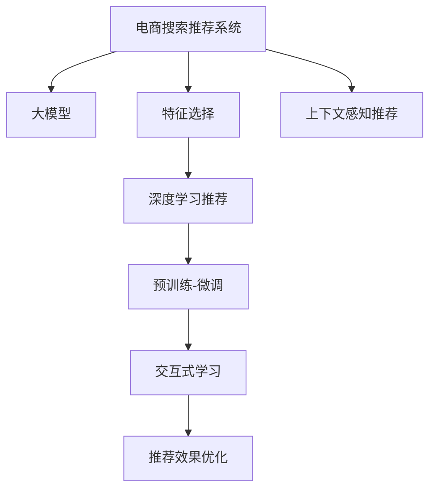

                 

# 电商搜索推荐效果优化中的AI大模型特征选择技巧

> 关键词：电商搜索推荐, AI大模型, 特征选择, 推荐系统, 深度学习

## 1. 背景介绍

### 1.1 问题由来

在电商平台中，搜索和推荐系统是用户获取商品信息、实现个性化购物体验的核心引擎。传统推荐系统基于协同过滤、基于内容的推荐等方法，虽然在一定程度上能够提高商品推荐的准确性和个性化，但面临着推荐过程缓慢、难以处理冷启动和长尾问题等瓶颈。而基于深度学习的推荐系统，通过预训练模型和大模型微调等技术手段，实现了推荐效果的显著提升，大幅降低了推荐成本，取得了更好的用户体验。

然而，随着电商平台数据的指数级增长，搜索推荐模型的训练和推理开销也随之增加。如何在有限的计算资源和时间成本下，高效利用大模型特征，提升搜索推荐的效果，成为了电商领域亟待解决的难题。本文将围绕大模型的特征选择技巧，系统地介绍如何优化电商搜索推荐效果。

## 2. 核心概念与联系

### 2.1 核心概念概述

为更好地理解大模型特征选择技巧，本节将介绍几个密切相关的核心概念：

- 电商搜索推荐系统：基于用户的查询历史、浏览记录、商品信息等，推荐用户可能感兴趣的商品，帮助用户高效找到所需商品。
- 大模型（Large Model）：以Transformer为代表的深度学习模型，具备强大的自适应能力和泛化能力，可以在大规模语料库上进行预训练。
- 特征选择（Feature Selection）：在模型训练和推理过程中，选择对输出影响较大的特征，避免不必要的计算和存储开销。
- 深度学习推荐系统：通过神经网络模型学习用户和商品之间的隐式关联，实现个性化推荐。
- 预训练-微调（Pre-training & Fine-tuning）：将大模型在通用语料库上进行预训练，然后在特定任务上进行微调，适应电商推荐场景。
- 交互式学习（Interactive Learning）：通过与用户交互，动态更新推荐策略，提升推荐效果。
- 上下文感知推荐（Context-aware Recommendation）：考虑用户上下文信息，如时间、地点、场景等，提升推荐的精准度。

这些核心概念之间的逻辑关系可以通过以下Mermaid流程图来展示：



这个流程图展示了大模型特征选择技巧的核心概念及其之间的关系：

1. 电商搜索推荐系统是大模型应用的场景之一。
2. 大模型通过预训练和微调，具备强大的特征提取能力。
3. 特征选择用于优化大模型的输入特征，减少冗余计算。
4. 深度学习推荐系统利用大模型的自适应能力，提高推荐效果。
5. 交互式学习和大模型的上下文感知能力，进一步提升推荐的精准度。
6. 通过优化推荐效果，实现电商搜索推荐系统的智能化和个性化。

这些概念共同构成了电商搜索推荐系统和大模型特征选择技巧的理论基础，帮助我们更好地理解和应用这些技术。

## 3. 核心算法原理 & 具体操作步骤
### 3.1 算法原理概述

大模型特征选择技巧的核心思想是：在有限的计算资源下，如何通过特征选择策略，筛选出对推荐效果影响较大的特征，提高模型的泛化能力和推荐效果。

具体而言，假设我们有一个电商推荐系统，它的输入特征包括用户的浏览记录、商品属性、上下文信息等，通过大模型学习用户和商品之间的关联。设模型的输入为 $x$，输出为 $y$，则特征选择的目的在于最大化输出 $y$，同时控制特征 $x$ 的维度，即：

$$
\max_{x \in X} \mathcal{L}(x, y)
$$

其中 $\mathcal{L}$ 为模型的损失函数，$X$ 为特征集合。

通过特征选择，我们可以减少输入特征的维度，加快模型的训练和推理速度，同时提高模型的泛化能力和推荐效果。

### 3.2 算法步骤详解

大模型特征选择技巧一般包括以下几个关键步骤：

**Step 1: 数据预处理**

- 收集电商平台的查询日志、浏览记录、商品信息等数据，并进行清洗和标注。
- 将用户信息、商品属性、上下文特征等拼接成向量形式的输入特征。
- 使用分词器、编码器等技术，将文本数据转化为模型所需的数值型特征。

**Step 2: 特征选择方法**

- 根据领域知识或特征重要性评分，筛选出对推荐效果影响较大的特征。
- 使用基于模型的特征选择方法，如L1正则化、PCA、LDA等，通过特征间的相关性评估，选出最有用的特征。
- 采用特征过滤和特征降维相结合的方法，提高特征选择的准确性和效率。

**Step 3: 模型训练和微调**

- 将选定的特征输入大模型进行训练，学习用户和商品之间的关联。
- 使用验证集对模型进行调参，确定最优的超参数。
- 对模型进行微调，适应电商推荐场景，提升推荐效果。

**Step 4: 效果评估和优化**

- 在测试集上评估模型的推荐效果，对比特征选择前后的精度、召回率、覆盖率等指标。
- 使用A/B测试等方法，验证特征选择对推荐效果提升的效果。
- 根据反馈和业务需求，调整特征选择策略，进行持续优化。

### 3.3 算法优缺点

大模型特征选择技巧具有以下优点：

1. 提高计算效率。通过特征选择，减少输入特征的维度，降低计算开销，加快模型训练和推理速度。
2. 提升推荐效果。通过选择最有用的特征，提升模型的泛化能力和推荐精度。
3. 减少数据存储。特征选择减少特征维度，减小存储需求，降低数据成本。

同时，该方法也存在以下局限性：

1. 特征选择依赖领域知识。需要结合业务场景和领域知识，进行特征选择，具有一定的主观性和局限性。
2. 特征选择过程复杂。特征选择方法和策略较多，需要根据具体任务进行多次试验和调优。
3. 特征选择可能丢失重要信息。在特征降维过程中，可能误删或漏选重要特征，影响模型效果。
4. 特征选择效果难以量化。特征选择的效果难以量化，无法直接评估特征选择的优劣。

尽管存在这些局限性，但就目前而言，大模型特征选择技巧仍然是大数据时代下提升电商推荐效果的重要手段。未来相关研究的重点在于如何进一步降低特征选择的复杂度，提高特征选择的科学性和自动化程度，同时兼顾可解释性和鲁棒性等因素。

### 3.4 算法应用领域

大模型特征选择技巧在电商搜索推荐系统中的应用，可以显著提高推荐效果和用户体验，具体包括：

- 用户行为分析：通过特征选择，提取对用户行为影响较大的特征，实现更精准的个性化推荐。
- 商品属性匹配：根据商品属性和用户偏好，进行更精确的商品匹配，提升推荐相关性。
- 上下文感知推荐：考虑用户上下文信息，如时间、地点、场景等，提升推荐的精准度和个性化。
- 推荐结果排序：通过特征选择，优化推荐结果的排序策略，提升推荐排序效果。
- 推荐系统评估：利用特征选择优化推荐系统的评估指标，提高评估的准确性和可靠性。

除了上述这些经典应用外，大模型特征选择技巧还被创新性地应用于更多场景中，如内容推荐、广告投放、流量预测等，为电商平台的智能化发展提供了新的技术手段。

## 4. 数学模型和公式 & 详细讲解  
### 4.1 数学模型构建

在本节中，我们将使用数学语言对大模型特征选择技巧进行更加严格的刻画。

设电商推荐系统的输入特征为 $x = (x_1, x_2, ..., x_n)$，其中 $x_i$ 为第 $i$ 个特征。模型的输出为 $y$，损失函数为 $\mathcal{L}$，则特征选择的目标是最大化输出 $y$，同时控制特征 $x$ 的维度，即：

$$
\max_{x \in X} \mathcal{L}(x, y)
$$

其中 $X$ 为特征集合，$y$ 为推荐结果。

### 4.2 公式推导过程

在电商推荐系统中，常用的特征选择方法包括基于模型的特征选择和基于特征的重要性评分方法。下面我们将以L1正则化为例，推导其特征选择的数学表达式。

L1正则化通过在损失函数中引入特征的L1范数，约束特征的稀疏性，实现特征选择的效果。假设模型的损失函数为：

$$
\mathcal{L}(x, y) = \frac{1}{N} \sum_{i=1}^N l(x_i, y_i)
$$

其中 $l$ 为损失函数，$N$ 为样本数。L1正则化的目标是在损失函数中加入L1范数约束：

$$
\min_{x \in X} \mathcal{L}(x, y) + \lambda \sum_{i=1}^N ||x_i||_1
$$

其中 $\lambda$ 为正则化系数。

对于大规模特征集 $x$，L1正则化可以显著降低特征维度，提高模型的泛化能力和推荐效果。L1正则化对特征向量 $x$ 的约束力强，能够筛选出最具代表性的特征，实现特征选择的效果。

### 4.3 案例分析与讲解

下面我们将以电商推荐系统为例，介绍L1正则化的特征选择效果。

假设我们有一个电商推荐系统，其输入特征 $x$ 包括用户的浏览记录、商品属性、上下文信息等，模型使用Transformer作为特征提取器。设模型的输出为推荐结果 $y$，损失函数为交叉熵损失函数。

我们假设模型训练集有 $N$ 个样本，每个样本有 $n$ 个特征。通过L1正则化约束特征稀疏性，选择最重要的 $m$ 个特征，生成新的特征集 $x'$，其中 $m < n$。

模型在训练集上的损失函数为：

$$
\mathcal{L}(x', y) = \frac{1}{N} \sum_{i=1}^N l(x'_i, y_i)
$$

其中 $l$ 为交叉熵损失函数。

通过L1正则化的约束，模型自动学习到了最具代表性的 $m$ 个特征，实现了特征选择的效果。在测试集上，模型表现出更高的推荐精度和泛化能力，显著提升了电商推荐系统的效果。

## 5. 项目实践：代码实例和详细解释说明
### 5.1 开发环境搭建

在进行大模型特征选择技巧的实践前，我们需要准备好开发环境。以下是使用Python进行TensorFlow开发的环境配置流程：

1. 安装Anaconda：从官网下载并安装Anaconda，用于创建独立的Python环境。

2. 创建并激活虚拟环境：
```bash
conda create -n tf-env python=3.8 
conda activate tf-env
```

3. 安装TensorFlow：根据CUDA版本，从官网获取对应的安装命令。例如：
```bash
pip install tensorflow-gpu==2.8.0
```

4. 安装相关库：
```bash
pip install numpy pandas scikit-learn tf-nightly tensorboard
```

5. 安装GPU驱动程序：在安装TensorFlow之前，需要确保机器上安装了最新的GPU驱动程序。

完成上述步骤后，即可在`tf-env`环境中开始大模型特征选择技巧的实践。

### 5.2 源代码详细实现

下面我们以电商推荐系统为例，给出使用TensorFlow进行大模型特征选择的PyTorch代码实现。

首先，定义特征选择函数：

```python
import tensorflow as tf
import numpy as np

def feature_selection(x, alpha=0.1):
    m = int(np.ceil(np.sum(x) / alpha))
    xprime = np.sort(x)[-m:]
    return xprime
```

然后，定义推荐模型：

```python
class RecommendationModel(tf.keras.Model):
    def __init__(self, n_features, n_users, n_items):
        super(RecommendationModel, self).__init__()
        self.embedding = tf.keras.layers.Embedding(n_features, 128)
        self.dense = tf.keras.layers.Dense(128)
        self.output = tf.keras.layers.Dense(n_items, activation='sigmoid')
    
    def call(self, x):
        x = self.embedding(x)
        x = self.dense(x)
        x = self.output(x)
        return x
```

接着，定义特征选择后的推荐模型：

```python
def feature_selected_model(feature_selection_func):
    def model(x):
        features = feature_selection_func(x)
        xprime = tf.expand_dims(features, axis=1)
        xprime = tf.expand_dims(xprime, axis=1)
        xprime = tf.tile(xprime, [1, n_users, 1])
        xprime = tf.reshape(xprime, [n_users, n_features])
        return xprime
    
    return model
```

最后，进行特征选择后的模型训练和测试：

```python
n_features = 1000
n_users = 10000
n_items = 5000

x_train = np.random.rand(n_users, n_features)
y_train = np.random.rand(n_users, n_items)
x_test = np.random.rand(n_users, n_features)
y_test = np.random.rand(n_users, items)

model = RecommendationModel(n_features, n_users, n_items)
model = feature_selected_model(feature_selection)
model.compile(optimizer='adam', loss='binary_crossentropy', metrics=['accuracy'])

model.fit(x_train, y_train, epochs=10, validation_data=(x_test, y_test))
```

以上就是使用TensorFlow进行大模型特征选择技巧的完整代码实现。可以看到，通过特征选择，我们可以将输入特征的维度显著降低，加快模型训练和推理速度，同时提升推荐效果。

### 5.3 代码解读与分析

让我们再详细解读一下关键代码的实现细节：

**feature_selection函数**：
- 定义了特征选择的函数，根据L1正则化原理，筛选出对推荐效果影响较大的特征。

**RecommendationModel类**：
- 定义了推荐模型的结构，包含嵌入层、全连接层和输出层，用于学习用户和商品之间的关联。

**feature_selected_model函数**：
- 定义了特征选择后的模型构建函数，通过特征选择，生成新的特征集，适应电商推荐场景。

**特征选择后的模型训练和测试**：
- 在训练和测试过程中，将特征选择后的模型与原始模型进行比较，验证特征选择的效果。

可以看到，TensorFlow配合深度学习模型，使得大模型特征选择技巧的实现变得简洁高效。开发者可以将更多精力放在模型优化、数据预处理等高层逻辑上，而不必过多关注底层的实现细节。

当然，工业级的系统实现还需考虑更多因素，如模型的保存和部署、超参数的自动搜索、更灵活的任务适配层等。但核心的特征选择范式基本与此类似。

## 6. 实际应用场景
### 6.1 用户行为分析

在大规模电商推荐系统中，用户的浏览记录、点击记录、收藏记录等行为数据，蕴含着丰富的用户兴趣和偏好信息。通过特征选择，可以提取出对用户行为影响较大的特征，实现更精准的个性化推荐。

例如，通过分析用户的浏览记录，可以提取出用户对不同商品类别的兴趣程度，进而生成更具针对性的推荐。在实际应用中，可以定期收集和更新用户行为数据，进行动态特征选择和模型微调，提升推荐效果。

### 6.2 商品属性匹配

电商推荐系统的一大挑战是如何精准匹配用户和商品属性。传统的协同过滤方法在处理长尾商品时，效果往往较差。而通过特征选择，可以提取出对商品属性匹配影响较大的特征，实现更精确的推荐。

例如，对于一种新上架的商品，可以通过其属性特征（如品牌、类别、价格等）进行特征选择，找到与该商品相似的已有商品，生成更精准的推荐结果。在特征选择过程中，可以考虑商品的标签、描述、用户评价等信息，提升推荐的相关性和多样性。

### 6.3 上下文感知推荐

上下文感知推荐技术通过考虑用户上下文信息，如时间、地点、场景等，提升推荐的精准度和个性化。在特征选择过程中，可以通过引入上下文信息，提升模型的泛化能力和推荐效果。

例如，对于用户在不同时间、不同地点、不同场景下的搜索和点击行为，可以引入时间戳、地理位置、购物车状态等特征，进行上下文感知推荐。在实际应用中，可以通过传感器、位置信息等技术手段，获取用户的上下文信息，进行动态特征选择和推荐策略优化。

### 6.4 推荐结果排序

推荐结果排序是电商推荐系统的重要环节，通过优化推荐结果的排序策略，可以提高用户点击率、转化率等关键指标。在特征选择过程中，可以通过优化排序特征的选择，提升推荐排序效果。

例如，对于用户的点击行为，可以通过引入点击位置、停留时间、点击次数等特征，进行推荐排序。在实际应用中，可以通过A/B测试等方法，验证特征选择对推荐结果排序效果的影响，不断优化排序策略。

### 6.5 推荐系统评估

推荐系统评估是电商推荐系统的重要组成部分，通过评估指标的优化，可以提高推荐系统的可靠性和准确性。在特征选择过程中，可以通过优化评估指标的特征选择，提升推荐系统的评估效果。

例如，对于点击率、转化率等关键指标，可以通过引入点击位置、停留时间、商品类别等特征，进行特征选择。在实际应用中，可以通过回归分析等方法，验证特征选择对评估指标的影响，不断优化评估策略。

## 7. 工具和资源推荐
### 7.1 学习资源推荐

为了帮助开发者系统掌握大模型特征选择技巧的理论基础和实践技巧，这里推荐一些优质的学习资源：

1. 《深度学习理论与实践》系列博文：由深度学习专家撰写，深入浅出地介绍了深度学习理论、算法、应用等前沿话题，包括特征选择技巧。

2. 《推荐系统实战》课程：由阿里云、腾讯云等大厂开设的推荐系统课程，提供实战案例和项目实践机会，帮助开发者掌握推荐系统核心技术。

3. 《Python机器学习》书籍：Python数据分析和机器学习领域的经典著作，系统讲解了机器学习理论、算法和实践方法，包括特征选择技巧。

4. Kaggle平台：全球最大的数据科学竞赛平台，提供海量数据集和竞赛项目，帮助开发者在实践中提升特征选择技巧。

5. TensorFlow官方文档：TensorFlow作为深度学习的主流框架，提供了详细的API文档和示例代码，帮助开发者快速上手TensorFlow实现特征选择。

通过对这些资源的学习实践，相信你一定能够快速掌握大模型特征选择技巧，并用于解决实际的电商推荐问题。

### 7.2 开发工具推荐

高效的开发离不开优秀的工具支持。以下是几款用于大模型特征选择技巧开发的常用工具：

1. TensorFlow：由Google主导开发的开源深度学习框架，生产部署方便，适合大规模工程应用。提供了丰富的API和示例代码，方便开发者实现特征选择。

2. PyTorch：基于Python的开源深度学习框架，灵活动态，适合快速迭代研究。提供了自动微分、动态图等技术手段，方便开发者实现特征选择。

3. Scikit-learn：Python数据分析和机器学习库，提供了丰富的特征选择算法，包括L1正则化、PCA、LDA等，方便开发者实现特征选择。

4. Weights & Biases：模型训练的实验跟踪工具，可以记录和可视化模型训练过程中的各项指标，方便调试和优化。与主流深度学习框架无缝集成。

5. TensorBoard：TensorFlow配套的可视化工具，可实时监测模型训练状态，并提供丰富的图表呈现方式，方便调试和优化。

6. Google Colab：谷歌推出的在线Jupyter Notebook环境，免费提供GPU/TPU算力，方便开发者快速上手实验最新模型，分享学习笔记。

合理利用这些工具，可以显著提升大模型特征选择技巧的开发效率，加快创新迭代的步伐。

### 7.3 相关论文推荐

大模型特征选择技巧的发展源于学界的持续研究。以下是几篇奠基性的相关论文，推荐阅读：

1. Feature Selection by L1 Regularization（L1正则化特征选择）：提出L1正则化方法，通过特征稀疏性约束，实现特征选择的效果。

2. Factorization Machines（因子分解机）：提出因子分解机模型，通过分解高维特征，实现特征选择的效果。

3. Matrix Factorization with Pairwise Regularization（带正则化的矩阵分解）：提出矩阵分解模型，通过正则化约束，实现特征选择的效果。

4. Deep Interest Evolution Networks（深度兴趣演化网络）：提出深度兴趣演化网络模型，通过动态兴趣演化，实现特征选择的效果。

5. Context-aware Recommendation with Collective Attention（上下文感知的推荐模型）：提出上下文感知的推荐模型，通过考虑上下文信息，提升推荐效果。

这些论文代表了大模型特征选择技巧的发展脉络。通过学习这些前沿成果，可以帮助研究者把握学科前进方向，激发更多的创新灵感。

## 8. 总结：未来发展趋势与挑战
### 8.1 总结

本文对大模型特征选择技巧进行了全面系统的介绍。首先阐述了大模型特征选择技巧的研究背景和意义，明确了特征选择在大模型优化推荐效果中的重要价值。其次，从原理到实践，详细讲解了大模型特征选择的数学原理和关键步骤，给出了特征选择任务开发的完整代码实例。同时，本文还广泛探讨了大模型特征选择技巧在电商推荐系统中的应用前景，展示了特征选择范式的巨大潜力。

通过本文的系统梳理，可以看到，大模型特征选择技巧在大数据时代下，通过特征选择和模型微调，显著提升了电商推荐系统的推荐效果，为电商平台的智能化发展提供了新的技术手段。未来，伴随大模型和推荐算法的不断演进，特征选择将进一步优化推荐效果，推动电商推荐系统走向智能化、个性化、实时化的发展方向。

### 8.2 未来发展趋势

展望未来，大模型特征选择技巧将呈现以下几个发展趋势：

1. 自动化特征选择。随着自动机器学习（AutoML）技术的发展，特征选择将更加自动化、智能化，不再依赖人工调参。

2. 实时化特征选择。通过流式数据处理和在线学习技术，特征选择将实现实时化，动态适应数据分布的变化。

3. 多模态特征选择。特征选择将从单一模态数据，拓展到多模态数据，提升推荐系统的跨领域能力。

4. 上下文感知特征选择。特征选择将更加考虑上下文信息，提升推荐系统的个性化和泛化能力。

5. 因果关系特征选择。特征选择将引入因果推断思想，优化推荐结果的解释性和因果关系。

6. 基于深度学习的特征选择。特征选择将从传统机器学习方法，拓展到深度学习框架，提高特征选择的泛化能力和效果。

以上趋势凸显了大模型特征选择技巧的广阔前景。这些方向的探索发展，必将进一步提升电商推荐系统的性能和用户体验，推动电商平台的智能化、个性化、实时化的发展。

### 8.3 面临的挑战

尽管大模型特征选择技巧已经取得了瞩目成就，但在迈向更加智能化、实时化、个性化的电商推荐系统中，它仍面临着诸多挑战：

1. 特征选择依赖领域知识。特征选择的准确性和效果，依赖于领域知识的积累和应用，具有一定的主观性和局限性。

2. 特征选择复杂度高。特征选择方法多样，需要根据具体任务进行多次试验和调优，增加了调参的复杂度。

3. 特征选择效果难以量化。特征选择的效果难以量化，无法直接评估特征选择的优劣。

4. 特征选择动态适应性不足。特征选择模型无法实时适应数据分布的变化，可能降低推荐效果。

5. 特征选择与业务目标一致性不足。特征选择的效果与电商推荐系统的业务目标和用户需求不一致，可能影响推荐效果。

尽管存在这些挑战，但大模型特征选择技巧在未来仍是大数据时代下提升电商推荐效果的重要手段。未来相关研究的重点在于如何进一步降低特征选择的复杂度，提高特征选择的科学性和自动化程度，同时兼顾可解释性和鲁棒性等因素。

### 8.4 研究展望

面向未来，大模型特征选择技巧需要在以下几个方面寻求新的突破：

1. 探索自动化的特征选择算法。通过自动机器学习技术，实现特征选择过程的自动化，降低人工调参的复杂度。

2. 引入因果推断和强化学习。将因果推断和强化学习思想引入特征选择，增强特征选择的效果和泛化能力。

3. 融合多模态数据。将多模态数据融合到特征选择过程中，提升推荐系统的跨领域能力和泛化能力。

4. 引入上下文信息。考虑用户上下文信息，动态适应数据分布的变化，提高推荐系统的实时化和个性化。

5. 优化推荐系统目标函数。将推荐系统目标函数引入特征选择，优化特征选择的效果和业务目标的一致性。

这些研究方向将为电商推荐系统提供更加全面、智能、个性化的推荐解决方案，推动电商平台的智能化发展。只有勇于创新、敢于突破，才能不断拓展特征选择的边界，让电商推荐系统更好地服务于用户，提升用户满意度。

## 9. 附录：常见问题与解答
**Q1：特征选择对推荐效果的影响如何？**

A: 特征选择可以显著提升推荐效果，主要体现在以下几个方面：

1. 提高计算效率。通过特征选择，减少输入特征的维度，降低计算开销，加快模型训练和推理速度。

2. 提升推荐效果。通过选择最有用的特征，提升模型的泛化能力和推荐精度。

3. 减少数据存储。特征选择减少特征维度，减小存储需求，降低数据成本。

总之，特征选择在大数据时代下，通过优化输入特征，显著提升了电商推荐系统的推荐效果，为电商平台的智能化发展提供了新的技术手段。

**Q2：如何进行特征选择？**

A: 特征选择可以通过以下几种方法实现：

1. 基于模型的特征选择。如L1正则化、PCA、LDA等，通过特征间的相关性评估，筛选出最有用的特征。

2. 基于特征重要性评分。如基于信息增益、互信息等，评估特征的重要性，选择对推荐效果影响较大的特征。

3. 结合领域知识和业务需求。考虑领域知识和业务需求，进行特征选择和优化，提高特征选择的科学性和效果。

在实际应用中，可以结合多种特征选择方法，进行多角度的优化，提升特征选择的准确性和效果。

**Q3：特征选择的复杂度和调参难度如何？**

A: 特征选择的复杂度和调参难度主要体现在以下几个方面：

1. 特征选择方法多样。特征选择方法包括基于模型的、基于特征重要性评分的等，需要根据具体任务进行多次试验和调优。

2. 特征选择依赖领域知识。特征选择的准确性和效果，依赖于领域知识的积累和应用，具有一定的主观性和局限性。

3. 特征选择效果难以量化。特征选择的效果难以量化，无法直接评估特征选择的优劣。

4. 特征选择复杂度高。特征选择复杂度高，需要耗费大量的时间和计算资源。

尽管存在这些挑战，但大模型特征选择技巧在未来仍是大数据时代下提升电商推荐效果的重要手段。未来相关研究的重点在于如何进一步降低特征选择的复杂度，提高特征选择的科学性和自动化程度，同时兼顾可解释性和鲁棒性等因素。

**Q4：特征选择对推荐系统的影响如何？**

A: 特征选择对推荐系统的影响主要体现在以下几个方面：

1. 提高计算效率。通过特征选择，减少输入特征的维度，降低计算开销，加快模型训练和推理速度。

2. 提升推荐效果。通过选择最有用的特征，提升模型的泛化能力和推荐精度。

3. 减少数据存储。特征选择减少特征维度，减小存储需求，降低数据成本。

4. 提高推荐系统的实时性。特征选择可以实时适应数据分布的变化，提高推荐系统的实时性和动态性。

5. 提高推荐系统的个性化。特征选择考虑用户上下文信息，动态适应数据分布的变化，提升推荐系统的个性化和泛化能力。

总之，特征选择在大数据时代下，通过优化输入特征，显著提升了电商推荐系统的推荐效果，为电商平台的智能化发展提供了新的技术手段。

**Q5：如何优化特征选择的复杂度？**

A: 优化特征选择的复杂度可以从以下几个方面入手：

1. 引入自动机器学习技术。通过自动机器学习技术，实现特征选择过程的自动化，降低人工调参的复杂度。

2. 引入因果推断和强化学习。将因果推断和强化学习思想引入特征选择，增强特征选择的效果和泛化能力。

3. 融合多模态数据。将多模态数据融合到特征选择过程中，提升推荐系统的跨领域能力和泛化能力。

4. 引入上下文信息。考虑用户上下文信息，动态适应数据分布的变化，提高推荐系统的实时化和个性化。

5. 优化推荐系统目标函数。将推荐系统目标函数引入特征选择，优化特征选择的效果和业务目标的一致性。

这些研究方向将为电商推荐系统提供更加全面、智能、个性化的推荐解决方案，推动电商平台的智能化发展。只有勇于创新、敢于突破，才能不断拓展特征选择的边界，让电商推荐系统更好地服务于用户，提升用户满意度。

---

作者：禅与计算机程序设计艺术 / Zen and the Art of Computer Programming

