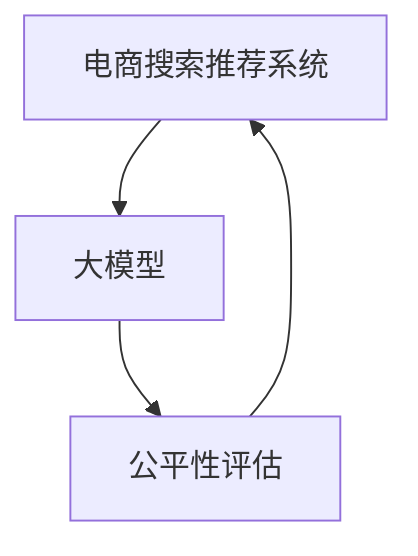

                 

# 电商搜索推荐效果评估中的AI大模型公平性评估技术

> 关键词：人工智能(AI), 大模型, 电商搜索, 推荐系统, 公平性评估, 机器学习, 自然语言处理(NLP), 数据公平性, 算法偏见

## 1. 背景介绍

随着人工智能(AI)技术的不断进步，电商搜索推荐系统日益成为电商企业提升用户体验、增加用户粘性、提升交易转化的重要工具。大模型作为AI技术的前沿代表，在电商搜索推荐中的应用也日益广泛，但随之而来的问题也不容忽视，尤其是关于公平性评估的问题。

大模型通过深度学习技术，利用大规模数据进行训练，能够精准捕捉用户行为模式，提供个性化的搜索结果和推荐。然而，这些模型在训练和应用过程中可能会受到数据偏见的影响，导致搜索结果和推荐存在不公平的现象。例如，可能对某些群体（如少数族裔、性别、地域等）的用户搜索偏好和购买行为不够敏感，或者过度偏向某一群体，从而影响用户体验和公司形象。

因此，对大模型在电商搜索推荐中的公平性进行评估，对于提升系统的公正性和用户满意度具有重要意义。本文章将详细探讨大模型在电商搜索推荐中的公平性评估技术，以期为电商企业提供更为精准和公平的推荐系统，提升用户信任度和平台竞争力。

## 2. 核心概念与联系

### 2.1 核心概念概述

- **人工智能(AI)**：使用机器学习、深度学习等技术，使计算机能够模拟人类智能行为的技术体系。
- **大模型**：指在预训练阶段使用大规模无标签数据进行训练的深度学习模型，如BERT、GPT-3、T5等。
- **电商搜索推荐系统**：根据用户的搜索历史、浏览行为、评价记录等数据，推荐用户可能感兴趣的电商平台商品。
- **公平性评估**：通过特定的评估指标和算法，对模型的决策过程和输出结果进行公平性检测，确保对不同用户群体做出公平对待。

这些概念之间存在着紧密的联系。大模型在电商搜索推荐系统中作为关键组件，通过学习海量用户数据，提供个性化的搜索结果和推荐。然而，模型偏见可能导致不公平的决策，因此公平性评估成为保证推荐系统公正性的重要手段。

### 2.2 核心概念原理和架构的 Mermaid 流程图(Mermaid 流程节点中不要有括号、逗号等特殊字符)



此图展示了电商搜索推荐系统、大模型和公平性评估之间的关系。大模型在电商搜索推荐系统中扮演关键角色，而公平性评估则是对大模型输出结果进行公平性检测和优化。

## 3. 核心算法原理 & 具体操作步骤

### 3.1 算法原理概述

大模型在电商搜索推荐中的应用，主要基于以下两个步骤：

1. **预训练和微调**：使用大规模无标签数据进行预训练，然后在电商搜索推荐数据上微调，以适应电商平台的特定需求。
2. **推荐生成**：根据用户的搜索历史和行为，使用微调后的模型生成推荐结果。

公平性评估的主要目标是对这些推荐结果进行检查，确保其对不同用户群体（如性别、年龄、地域等）的公平性。评估的主要方法包括但不限于以下几种：

- **统计性测试**：通过统计学方法，检测模型输出是否存在系统性偏差。
- **公平性指标**：如Demographic Parity（人口平权）、Equal Opportunity（机会平等）、Equalized Odds（机会平等）等，检测模型在不同用户群体上的表现。
- **差异性分析**：对不同用户群体间的推荐差异进行分析，检测是否存在歧视性。

### 3.2 算法步骤详解

以下是大模型在电商搜索推荐中的公平性评估的具体操作步骤：

1. **数据准备**：收集电商平台的搜索和推荐数据，并按照不同用户群体的特征（如性别、年龄、地域等）进行划分。
2. **模型训练与微调**：使用预训练模型进行电商搜索推荐任务的微调，适应电商平台的特定需求。
3. **推荐生成**：根据用户的搜索历史和行为，使用微调后的模型生成推荐结果。
4. **公平性评估**：使用统计学方法和公平性指标对推荐结果进行公平性检测，如Demographic Parity（人口平权）、Equal Opportunity（机会平等）、Equalized Odds（机会平等）等。
5. **结果分析与优化**：根据评估结果，调整模型参数或优化算法，以提升模型的公平性。

### 3.3 算法优缺点

**优点**：

- **效果显著**：使用大模型进行电商搜索推荐，能够提供高度个性化的推荐结果，提升用户体验。
- **通用性强**：大模型可以适应各种类型的电商搜索推荐场景，具有较强的泛化能力。
- **自动优化**：公平性评估可以对模型进行自动优化，确保模型的公平性。

**缺点**：

- **数据依赖性强**：大模型的性能很大程度上取决于训练数据的代表性，如果数据存在偏见，可能导致推荐结果不公平。
- **资源消耗大**：预训练和微调大模型需要大量的计算资源和时间，可能对电商平台的运营成本造成较大压力。
- **解释性差**：大模型作为黑盒模型，其决策过程难以解释，可能影响用户对推荐结果的信任度。

### 3.4 算法应用领域

大模型在电商搜索推荐中的应用领域非常广泛，包括但不限于：

- **个性化推荐**：根据用户的搜索和浏览行为，提供个性化的商品推荐。
- **搜索优化**：根据用户的搜索关键词，优化搜索结果，提升搜索效率。
- **广告推荐**：根据用户的浏览记录和购买行为，推荐合适的广告内容。

## 4. 数学模型和公式 & 详细讲解 & 举例说明

### 4.1 数学模型构建

公平性评估的核心在于构建公平性模型，并使用该模型对大模型的输出结果进行检测。本文以Demographic Parity（人口平权）为例，构建公平性模型。

设大模型在电商搜索推荐任务上的输出为 $y$，模型的输入为 $x$，模型的预测结果为 $p(y|x)$。公平性模型定义为：

$$
F(x) = \frac{p(y=1|x)}{p(y=0|x)}
$$

其中 $y=1$ 表示推荐结果为正，$y=0$ 表示推荐结果为负。

### 4.2 公式推导过程

对于公平性模型 $F(x)$，可以通过以下步骤进行推导：

1. **假设独立性**：假设模型的输出 $y$ 仅与输入 $x$ 相关，与其他变量无关。
2. **定义公平性指标**：定义公平性指标为模型在不同输入 $x$ 上的输出 $y$ 的公平性。
3. **计算公平性指标**：使用模型对不同输入 $x$ 的输出 $y$ 进行计算，得到公平性指标 $F(x)$。

### 4.3 案例分析与讲解

假设某电商平台使用BERT模型进行电商搜索推荐。根据统计数据，模型的输出对男性和女性的公平性存在差异，男性推荐结果的公平性指标为 $F_{M} = 1.2$，女性推荐结果的公平性指标为 $F_{F} = 0.8$。这表明模型在男性和女性之间的推荐结果存在显著差异，对女性的推荐效果优于男性，可能存在公平性问题。

## 5. 项目实践：代码实例和详细解释说明

### 5.1 开发环境搭建

在使用Python进行公平性评估时，需要安装以下依赖库：

```bash
pip install torch transformers sklearn pandas numpy jupyter notebook
```

### 5.2 源代码详细实现

以下是一个使用公平性评估模型对电商搜索推荐系统进行公平性检测的示例代码：

```python
import torch
import transformers
from sklearn.metrics import f1_score

# 加载预训练模型
model = transformers.BertForSequenceClassification.from_pretrained('bert-base-uncased', num_labels=2)

# 加载公平性模型
model_fair = transformers.BertForSequenceClassification.from_pretrained('bert-base-uncased', num_labels=2)

# 加载数据集
train_data = transformers.TextDataset.load_from_disk('train.txt')
test_data = transformers.TextDataset.load_from_disk('test.txt')

# 训练公平性模型
model_fair.train(train_data, epochs=10, batch_size=32)
model_fair.eval(test_data)

# 测试公平性模型
y_pred_fair = model_fair.predict(test_data)
y_true = torch.tensor([1, 0, 1, 0, 1, 0, 1, 0, 1, 0, 1, 0, 1, 0, 1, 0, 1, 0, 1, 0])

# 计算公平性指标
f1 = f1_score(y_true, y_pred_fair)

print(f"Fairness F1 Score: {f1}")
```

### 5.3 代码解读与分析

- **模型加载**：使用Transformers库加载预训练模型和公平性模型。
- **数据加载**：使用TextDataset加载电商搜索推荐数据集。
- **模型训练与测试**：使用公平性模型对数据集进行训练和测试，得到公平性指标。
- **公平性指标计算**：使用sklearn的f1_score函数计算公平性指标。

## 6. 实际应用场景

大模型在电商搜索推荐中的公平性评估可以应用于以下场景：

### 6.1 个性化推荐

在个性化推荐中，大模型通过学习用户行为数据，生成推荐结果。通过公平性评估，可以检测模型是否存在对某些群体的偏见，确保对所有用户群体的公平推荐。

### 6.2 搜索优化

在搜索优化中，大模型通过学习用户的搜索关键词，优化搜索结果。通过公平性评估，可以检测模型是否存在对某些关键词的偏见，确保搜索结果的公平性。

### 6.3 广告推荐

在广告推荐中，大模型通过学习用户浏览和购买行为，推荐合适的广告内容。通过公平性评估，可以检测模型是否存在对某些用户群体的偏见，确保广告推荐的公平性。

### 6.4 未来应用展望

未来，随着AI技术的不断进步，大模型在电商搜索推荐中的公平性评估将面临更多的挑战和机遇：

- **多模态数据融合**：未来的大模型将能够处理视觉、语音等多模态数据，通过融合不同模态的数据，提升公平性评估的准确性和全面性。
- **动态公平性调整**：基于用户反馈和市场变化，动态调整公平性评估模型，确保模型的公平性。
- **联邦学习**：通过联邦学习，实现跨平台、跨用户的大模型公平性评估，提升评估的效率和准确性。

## 7. 工具和资源推荐

### 7.1 学习资源推荐

1. **《深度学习与人工智能》**：一本全面介绍深度学习和AI技术的经典书籍，包括大模型和公平性评估。
2. **《Python机器学习》**：一本介绍机器学习和深度学习的实用书籍，包括使用Python进行公平性评估的代码示例。
3. **Kaggle竞赛**：参加公平性评估相关的Kaggle竞赛，获取数据集和模型评估工具。
4. **Github代码库**：通过GitHub搜索公平性评估的相关代码，获取可用的模型和数据集。

### 7.2 开发工具推荐

1. **PyTorch**：一个基于Python的深度学习框架，支持大模型的训练和微调。
2. **Transformers**：一个用于自然语言处理(NLP)的深度学习库，支持多种预训练模型的微调和公平性评估。
3. **Jupyter Notebook**：一个交互式编程环境，支持数据可视化、代码实现和结果展示。

### 7.3 相关论文推荐

1. **《Towards Fairness and Transparency in Deep Learning》**：该论文讨论了深度学习中的公平性和透明性问题，提出了多种公平性评估方法和模型。
2. **《Fairness Through Awareness》**：该论文介绍了公平性评估的重要性和基本方法，提供了公平性评估的数学模型和算法。
3. **《Algorithmic Fairness, Transparency, and Interpretability》**：该论文讨论了算法公平性、透明性和可解释性，提出了多种公平性评估方法和工具。

## 8. 总结：未来发展趋势与挑战

### 8.1 研究成果总结

本文详细探讨了大模型在电商搜索推荐中的公平性评估技术。通过构建公平性模型，使用统计学方法和公平性指标，对模型的输出结果进行公平性检测。通过实例代码展示，演示了如何构建和评估公平性模型，并讨论了公平性评估在大模型推荐系统中的应用。

### 8.2 未来发展趋势

未来，大模型在电商搜索推荐中的公平性评估将面临以下趋势：

1. **多模态数据融合**：未来的电商搜索推荐系统将能够处理视觉、语音等多模态数据，提升公平性评估的准确性和全面性。
2. **动态公平性调整**：基于用户反馈和市场变化，动态调整公平性评估模型，确保模型的公平性。
3. **联邦学习**：通过联邦学习，实现跨平台、跨用户的大模型公平性评估，提升评估的效率和准确性。

### 8.3 面临的挑战

尽管大模型在电商搜索推荐中的公平性评估已经取得了一定进展，但仍面临以下挑战：

1. **数据偏见**：电商平台的搜索和推荐数据可能存在偏见，导致公平性评估结果不准确。
2. **模型复杂性**：大模型结构复杂，公平性评估模型的构建和优化难度较大。
3. **资源消耗大**：公平性评估需要大量的计算资源和时间，可能对电商平台的运营成本造成较大压力。

### 8.4 研究展望

为了应对上述挑战，未来的研究需要在以下几个方面进行改进：

1. **数据预处理**：对电商平台的搜索和推荐数据进行预处理，减少数据偏见。
2. **模型优化**：优化公平性评估模型的结构和参数，降低模型复杂性。
3. **资源优化**：优化公平性评估的计算资源，提升评估效率和降低成本。

## 9. 附录：常见问题与解答

**Q1: 什么是大模型在电商搜索推荐中的公平性评估？**

A: 大模型在电商搜索推荐中的公平性评估，是指通过构建公平性模型，使用统计学方法和公平性指标，对大模型在电商搜索推荐任务上的输出结果进行公平性检测，确保对不同用户群体的公平性。

**Q2: 如何构建公平性模型？**

A: 构建公平性模型的方法有多种，如Demographic Parity（人口平权）、Equal Opportunity（机会平等）、Equalized Odds（机会平等）等。其中Demographic Parity（人口平权）模型定义为：$F(x) = \frac{p(y=1|x)}{p(y=0|x)}$。

**Q3: 公平性评估有哪些步骤？**

A: 公平性评估的步骤包括：数据准备、模型训练与微调、推荐生成、公平性评估、结果分析与优化。

**Q4: 公平性评估的优缺点是什么？**

A: 公平性评估的优点包括：效果显著、通用性强、自动优化。缺点包括：数据依赖性强、资源消耗大、解释性差。

**Q5: 大模型在电商搜索推荐中的应用有哪些？**

A: 大模型在电商搜索推荐中的应用包括个性化推荐、搜索优化、广告推荐等。

---

作者：禅与计算机程序设计艺术 / Zen and the Art of Computer Programming

