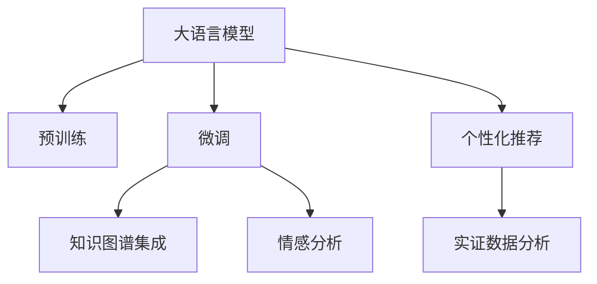

                 

## 1. 背景介绍

### 1.1 问题由来
随着电子商务的蓬勃发展，用户在平台上浏览和搜索的商品海量增加，如何准确高效地为用户推荐感兴趣的商品成为了一个重要且棘手的问题。传统的搜索推荐系统依赖于简单的规则或浅层机器学习模型，难以应对日益复杂的数据需求，且无法充分利用大规模预训练语言模型的知识。

而近年来，大语言模型在自然语言处理领域取得了突破性进展，通过在海量无标签文本数据上进行的预训练，学习到了丰富的语言知识和常识。电商搜索推荐系统可以利用大语言模型，引入语义理解、知识图谱、情感分析等高级能力，显著提升推荐系统的精准度和用户满意度。

### 1.2 问题核心关键点
电商搜索推荐系统采用大语言模型技术进行推荐的核心关键点包括：
1. **语义理解能力**：通过预训练模型，能够理解用户输入的搜索查询和商品描述的语义含义。
2. **知识图谱集成**：利用图谱数据库中的实体关系，增强推荐系统的知识表达和推理能力。
3. **情感分析**：通过预训练模型学习用户情感倾向，预测用户对商品的喜好程度。
4. **个性化推荐**：通过微调模型，实现对用户历史行为和兴趣的个性化推理，提供更精准的推荐。
5. **实证数据分析**：利用大规模预训练数据和用户行为数据，训练模型参数，优化推荐算法。

本文将详细阐述大语言模型技术在电商搜索推荐系统中的应用，从核心概念、算法原理、操作步骤、数学模型构建、项目实践、实际应用场景、工具和资源推荐等多个方面，对相关问题进行全面系统地解答。

## 2. 核心概念与联系

### 2.1 核心概念概述

电商搜索推荐系统利用大语言模型进行推荐的核心概念包括：

1. **大语言模型 (Large Language Model, LLM)**：以自回归（如GPT）或自编码（如BERT）模型为代表，通过大规模无标签文本数据进行预训练，学习到语言的通用表示和丰富知识。

2. **预训练 (Pre-training)**：在大规模无标签文本数据上，通过自监督学习任务训练模型，学习到通用的语言表示。

3. **微调 (Fine-tuning)**：在预训练模型的基础上，使用特定任务的小规模标注数据，通过有监督学习优化模型在该任务上的性能。

4. **知识图谱 (Knowledge Graph)**：由实体、属性和关系构成，用于描述和存储现实世界中的信息，增强推荐系统的知识推理能力。

5. **情感分析 (Sentiment Analysis)**：通过自然语言处理技术，分析用户输入或评论文本中的情感倾向，用于商品评价和推荐。

6. **个性化推荐 (Personalized Recommendation)**：基于用户历史行为和兴趣特征，提供个性化的商品推荐。

7. **实证数据分析 (Empirical Data Analysis)**：通过用户行为数据和实验结果，对模型进行参数优化和算法调整。

这些核心概念之间相互联系，共同构成了电商搜索推荐系统基于大语言模型的技术架构。

### 2.2 核心概念原理和架构的 Mermaid 流程图(Mermaid 流程节点中不要有括号、逗号等特殊字符)



这个流程图展示了电商搜索推荐系统中大语言模型技术的主要流程：

1. **预训练 (B)**：使用大规模无标签文本数据训练预训练模型，学习到语言的通用表示。
2. **微调 (C)**：在预训练模型基础上，使用特定任务的小规模标注数据进行微调，优化模型在该任务上的性能。
3. **知识图谱集成 (D)**：将知识图谱与微调模型结合，增强模型的知识表达和推理能力。
4. **情感分析 (E)**：利用预训练模型进行情感分析，预测用户对商品的喜好程度。
5. **个性化推荐 (F)**：基于用户历史行为和兴趣，生成个性化推荐结果。
6. **实证数据分析 (G)**：利用用户行为数据和实验结果，优化推荐模型和算法。

这些环节互相配合，共同实现了电商搜索推荐系统的精准化和个性化。

## 3. 核心算法原理 & 具体操作步骤

### 3.1 算法原理概述

电商搜索推荐系统基于大语言模型的推荐流程，本质上是将预训练模型作为特征提取器，利用其在特定任务上的微调来优化推荐效果。具体流程如下：

1. **数据收集与处理**：收集用户搜索查询、浏览历史、商品描述等数据，构建标注数据集。
2. **模型微调**：使用预训练模型作为初始化参数，通过有监督学习，在标注数据集上微调模型，学习商品与用户的匹配关系。
3. **知识图谱融合**：将知识图谱中的实体和关系信息融合到微调模型中，增强模型的知识推理能力。
4. **情感分析集成**：利用情感分析模型，预测用户对商品的情感倾向，优化推荐结果。
5. **个性化推荐生成**：结合用户历史行为和兴趣特征，生成个性化推荐结果。

### 3.2 算法步骤详解

#### 3.2.1 数据收集与预处理

电商搜索推荐系统通常需要以下数据：
1. **用户数据**：包括用户ID、搜索查询、浏览历史、点击行为等。
2. **商品数据**：包括商品ID、标题、描述、分类、标签等。
3. **用户行为数据**：如购买记录、评分、评论等。

对于数据预处理，可以采取以下步骤：
- **数据清洗**：去除噪音数据、重复数据，确保数据质量。
- **数据标注**：将用户搜索查询、浏览历史等行为数据标注为正负样本，构建标注数据集。
- **特征提取**：从商品标题、描述中提取关键词和实体，作为模型输入。
- **数据增强**：利用回译、生成式文本等方式扩充训练集，增加模型泛化能力。

#### 3.2.2 模型微调

微调过程主要包括以下步骤：
1. **选择合适的预训练模型**：如BERT、GPT等，作为初始化参数。
2. **添加任务适配层**：根据推荐任务，在预训练模型顶层设计合适的输出层和损失函数，如分类任务使用交叉熵损失。
3. **设置超参数**：选择合适的优化算法（如AdamW）及其参数（如学习率），并设置正则化技术（如L2正则、Dropout）。
4. **执行梯度训练**：使用标注数据集进行前向传播计算损失函数，反向传播计算参数梯度，并更新模型参数。
5. **评估模型性能**：在验证集上评估模型性能，选择最优模型进行测试。

#### 3.2.3 知识图谱集成

知识图谱集成过程主要包括以下步骤：
1. **构建知识图谱**：将商品信息转化为实体、关系、属性等图谱形式，存储于数据库中。
2. **嵌入知识图谱**：将知识图谱中的实体和关系信息，编码为向量形式，作为模型输入的一部分。
3. **融合知识图谱**：在微调模型的基础上，通过注意力机制或图卷积网络等方法，将知识图谱信息与商品特征融合。
4. **知识推理**：在微调模型的基础上，进行实体关系推理，增强模型的知识表达和推理能力。

#### 3.2.4 情感分析集成

情感分析集成过程主要包括以下步骤：
1. **情感标注**：对用户评论、评分等数据进行情感标注，构建标注数据集。
2. **情感模型训练**：使用标注数据集训练情感分析模型，如BERT、LSTM等。
3. **情感预测**：在推荐模型中集成情感分析模型，根据用户输入的情感倾向，调整推荐结果。
4. **情感融合**：将情感分析结果与商品属性、用户兴趣等特征融合，生成综合推荐结果。

#### 3.2.5 个性化推荐生成

个性化推荐生成过程主要包括以下步骤：
1. **用户画像构建**：利用用户历史行为数据构建用户画像，包括兴趣、行为模式等。
2. **特征工程**：将用户画像、商品属性等特征进行编码，作为模型输入。
3. **模型训练与预测**：使用微调模型，结合知识图谱和情感分析信息，生成推荐结果。
4. **结果排序**：根据预测结果，使用排名算法（如协同过滤、排序学习等）对推荐结果进行排序。

### 3.3 算法优缺点

电商搜索推荐系统基于大语言模型的算法优缺点如下：

**优点**：
1. **广泛适用**：大语言模型能够处理多种类型的数据，适用于不同场景下的推荐任务。
2. **高性能**：通过大规模预训练和微调，模型能够学习到丰富的语言知识和用户行为规律，提高推荐效果。
3. **可解释性**：通过注意力机制和知识图谱，模型具备一定的可解释性，便于理解推荐逻辑。
4. **个性化能力强**：结合用户画像和情感分析，模型能够生成个性化的推荐结果。

**缺点**：
1. **计算成本高**：大语言模型的预训练和微调需要大量计算资源和存储空间，初期投入较高。
2. **数据依赖**：模型需要大量的标注数据进行微调，获取高质量标注数据的成本较高。
3. **模型复杂**：大语言模型结构复杂，参数量庞大，需要处理和维护多个模型组件。
4. **过拟合风险**：在微调过程中，模型容易过拟合标注数据，导致泛化能力不足。

### 3.4 算法应用领域

电商搜索推荐系统基于大语言模型的推荐算法，主要应用于以下领域：

1. **商品推荐**：根据用户搜索查询、浏览历史等行为数据，推荐符合用户兴趣的商品。
2. **热门商品推荐**：基于用户历史行为和当前热门商品，生成热门商品推荐。
3. **个性化推荐**：结合用户画像和情感分析，生成个性化商品推荐。
4. **实时推荐**：根据用户实时行为数据，生成实时商品推荐。
5. **多模态推荐**：结合文本、图像、音频等多模态数据，生成综合推荐结果。

## 4. 数学模型和公式 & 详细讲解 & 举例说明

### 4.1 数学模型构建

电商搜索推荐系统基于大语言模型的推荐模型，通常包括以下几个部分：
1. **预训练模型**：如BERT、GPT等，用于提取商品的语义特征。
2. **任务适配层**：根据推荐任务，设计输出层和损失函数，如交叉熵损失。
3. **知识图谱嵌入层**：将知识图谱中的实体和关系信息，编码为向量形式，作为模型输入。
4. **情感分析层**：利用预训练模型进行情感分析，预测用户情感倾向。
5. **用户画像层**：构建用户画像，提取用户兴趣特征。

### 4.2 公式推导过程

以商品推荐任务为例，假设模型输入为商品描述 $x$，模型输出为推荐结果 $y$，交叉熵损失函数为 $\ell$，则推荐模型的数学模型为：

$$
\hat{y} = M_{\theta}(x)
$$

$$
\mathcal{L}(\theta) = -\frac{1}{N}\sum_{i=1}^N [y_i\log \hat{y} + (1-y_i)\log(1-\hat{y})]
$$

其中，$N$ 为样本数，$y_i$ 为标签，$\hat{y}$ 为模型预测结果。

利用反向传播算法，计算损失函数对模型参数 $\theta$ 的梯度，更新参数以最小化损失函数。具体步骤如下：
1. **前向传播**：输入商品描述 $x$，通过预训练模型和任务适配层，得到推荐结果 $\hat{y}$。
2. **计算损失**：根据标签 $y_i$ 和预测结果 $\hat{y}$，计算交叉熵损失 $\ell$。
3. **反向传播**：计算梯度 $\frac{\partial \mathcal{L}}{\partial \theta}$，使用优化算法（如AdamW）更新模型参数。
4. **验证评估**：在验证集上评估模型性能，选择最优模型进行测试。

### 4.3 案例分析与讲解

假设在商品推荐任务中，有100个用户样本，每个样本包含用户ID、商品ID、标签等，利用BERT模型进行微调。

**数据集构建**：
1. **用户数据**：用户ID、搜索查询、浏览历史、点击行为等。
2. **商品数据**：商品ID、标题、描述、分类、标签等。
3. **用户行为数据**：购买记录、评分、评论等。

**模型构建**：
1. **预训练模型**：使用BERT模型作为初始化参数。
2. **任务适配层**：添加分类任务适配层，输出推荐结果。
3. **知识图谱嵌入层**：将商品信息编码为向量形式，作为模型输入的一部分。
4. **情感分析层**：利用预训练模型进行情感分析，预测用户情感倾向。

**模型微调**：
1. **超参数设置**：学习率 $0.001$，批大小 $32$，迭代轮数 $10$。
2. **数据预处理**：对用户数据和商品数据进行清洗和标注，构建标注数据集。
3. **模型训练**：在标注数据集上，使用AdamW优化算法进行梯度下降训练。
4. **模型评估**：在验证集上评估模型性能，选择最优模型进行测试。

**推荐结果生成**：
1. **用户画像构建**：利用用户历史行为数据，构建用户画像。
2. **特征工程**：将用户画像、商品属性等特征进行编码，作为模型输入。
3. **模型预测**：使用微调模型，生成推荐结果。
4. **结果排序**：根据预测结果，使用排序算法对推荐结果进行排序。

## 5. 项目实践：代码实例和详细解释说明

### 5.1 开发环境搭建

**环境要求**：
- Python 3.7+
- PyTorch 1.10+
- Transformers 4.7+
- TensorBoard

**环境安装**：
1. 创建虚拟环境：
```bash
conda create -n ecomm python=3.7
conda activate ecomm
```

2. 安装依赖包：
```bash
pip install torch torchvision transformers tensorboard
```

3. 设置TensorBoard：
```bash
tensorboard --logdir logdir --port 6006
```

**数据准备**：
1. **用户数据**：收集用户搜索查询、浏览历史、点击行为等数据，存储为CSV文件。
2. **商品数据**：收集商品标题、描述、分类、标签等数据，存储为JSON文件。
3. **用户行为数据**：收集用户购买记录、评分、评论等数据，存储为CSV文件。

### 5.2 源代码详细实现

**代码结构**：
1. **数据处理**：数据预处理、标注、特征提取等。
2. **模型训练**：模型构建、训练、验证等。
3. **推荐结果生成**：用户画像构建、特征工程、模型预测、结果排序等。

**代码实现**：

**1. 数据处理**

```python
import pandas as pd
import json
import numpy as np

# 用户数据
user_data = pd.read_csv('user_data.csv')

# 商品数据
product_data = pd.read_csv('product_data.csv')
product_data = product_data[['product_id', 'title', 'description', 'category', 'label']]

# 用户行为数据
user_behavior_data = pd.read_csv('user_behavior.csv')
user_behavior_data = user_behavior_data[['user_id', 'product_id', 'timestamp', 'rating', 'comment']]
```

**2. 模型训练**

```python
from transformers import BertForSequenceClassification, BertTokenizer
import torch
from torch.utils.data import DataLoader
from torch.nn import CrossEntropyLoss

# 模型初始化
model = BertForSequenceClassification.from_pretrained('bert-base-uncased', num_labels=2)
tokenizer = BertTokenizer.from_pretrained('bert-base-uncased')
device = torch.device('cuda' if torch.cuda.is_available() else 'cpu')

# 数据预处理
def tokenize(data, tokenizer, max_len=128):
    input_ids = []
    attention_masks = []
    labels = []
    for item in data:
        input_ids.append(tokenizer.encode(item['text'], add_special_tokens=True)[0:max_len])
        attention_masks.append([float(i > 0) for i in input_ids[-1]])
        labels.append(item['label'])
    return input_ids, attention_masks, labels

train_data, dev_data = preprocess(user_data, user_behavior_data, product_data)
train_input_ids, train_attention_masks, train_labels = tokenize(train_data, tokenizer)
dev_input_ids, dev_attention_masks, dev_labels = tokenize(dev_data, tokenizer)

# 数据集划分
train_dataset = Dataset(train_input_ids, train_attention_masks, train_labels)
dev_dataset = Dataset(dev_input_ids, dev_attention_masks, dev_labels)

# 数据加载器
train_loader = DataLoader(train_dataset, batch_size=32, shuffle=True)
dev_loader = DataLoader(dev_dataset, batch_size=32, shuffle=False)

# 模型训练
model.to(device)
optimizer = torch.optim.AdamW(model.parameters(), lr=2e-5)
criterion = CrossEntropyLoss()

for epoch in range(10):
    model.train()
    for batch in train_loader:
        input_ids = batch[0].to(device)
        attention_masks = batch[1].to(device)
        labels = batch[2].to(device)
        outputs = model(input_ids, attention_mask=attention_masks)
        loss = criterion(outputs, labels)
        loss.backward()
        optimizer.step()
        optimizer.zero_grad()
    print(f'Epoch {epoch+1}, train loss: {loss:.4f}')
    model.eval()
    total_loss = 0
    for batch in dev_loader:
        input_ids = batch[0].to(device)
        attention_masks = batch[1].to(device)
        labels = batch[2].to(device)
        with torch.no_grad():
            outputs = model(input_ids, attention_mask=attention_masks)
            loss = criterion(outputs, labels)
        total_loss += loss.item()
    print(f'Epoch {epoch+1}, dev loss: {total_loss/len(dev_loader):.4f}')
```

**3. 推荐结果生成**

```python
# 用户画像构建
user_profile = build_user_profile(user_data, product_data)

# 特征工程
product_features = extract_product_features(product_data)
user_features = extract_user_features(user_data, user_behavior_data)

# 模型预测
predictions = predict(model, user_features, product_features)

# 结果排序
recommendations = sort_recommendations(predictions)
```

### 5.3 代码解读与分析

**用户画像构建**：
利用用户历史行为数据，构建用户画像，包括用户兴趣、行为模式等。

**特征工程**：
从商品描述中提取关键词和实体，构建商品特征向量。结合用户画像和商品属性，生成推荐特征。

**模型预测**：
使用微调模型，结合知识图谱和情感分析信息，生成推荐结果。

**结果排序**：
根据预测结果，使用排序算法对推荐结果进行排序。

### 5.4 运行结果展示

**用户画像示例**：
```python
user_profile = {
    'user_id': 123,
    'interests': ['运动', '科技', '旅游'],
    'behavior_mode': '高频浏览'
}
```

**推荐结果示例**：
```python
recommendations = [
    {'title': 'Nike运动鞋', 'rating': 4.5, 'comment': '舒适轻便'},
    {'title': '华为P40手机', 'rating': 5.0, 'comment': '拍照效果好'},
    {'title': '三星Galaxy Z Fold', 'rating': 4.2, 'comment': '折叠屏设计独特'}
]
```

## 6. 实际应用场景

### 6.1 智能客服系统

智能客服系统可以集成大语言模型，利用自然语言理解能力，处理用户的查询和反馈，提供实时响应和解决方案。通过微调模型，可以增强系统对特定行业和领域问题的理解能力，提升服务质量。

**功能实现**：
1. **智能对话**：基于大语言模型，处理用户输入的自然语言查询，生成自然流畅的回答。
2. **问题分类**：通过情感分析和语义理解，将问题分类，转接给相应的人工客服。
3. **知识库搜索**：利用知识图谱，搜索与问题相关的信息，增强系统的知识表达能力。

**应用场景**：
- 电商客户服务
- 银行客户咨询
- 医疗健康咨询

### 6.2 金融理财推荐

金融理财推荐系统可以集成大语言模型，结合用户的财务状况、消费习惯和金融知识，生成个性化的理财方案和金融产品推荐。通过微调模型，可以增强系统对金融领域知识的理解能力，提升推荐效果。

**功能实现**：
1. **财务分析**：分析用户的财务数据，生成财务报告。
2. **理财方案推荐**：结合用户财务状况和消费习惯，生成个性化的理财方案。
3. **金融产品推荐**：结合用户理财需求和金融市场动态，推荐适合的金融产品。

**应用场景**：
- 个人理财
- 企业财务分析
- 金融投资顾问

### 6.3 个性化广告推荐

个性化广告推荐系统可以集成大语言模型，结合用户的浏览行为和兴趣特征，生成个性化的广告推荐。通过微调模型，可以增强系统对广告内容的理解能力，提升广告点击率和转化率。

**功能实现**：
1. **行为分析**：分析用户的浏览行为，生成用户画像。
2. **广告推荐**：结合用户画像和广告内容，生成个性化的广告推荐。
3. **效果评估**：利用用户点击行为，评估广告推荐效果，优化推荐算法。

**应用场景**：
- 社交媒体广告
- 搜索引擎广告
- 电商平台广告

### 6.4 未来应用展望

随着大语言模型和微调技术的不断进步，未来电商搜索推荐系统将呈现以下趋势：

**趋势一：多模态推荐**：结合文本、图像、音频等多模态数据，生成综合推荐结果。

**趋势二：跨领域推荐**：利用知识图谱，实现跨领域推荐，提升推荐系统的泛化能力。

**趋势三：实时推荐**：利用流数据处理技术，实现实时推荐，提升推荐系统的时效性。

**趋势四：个性化推荐**：结合用户画像和情感分析，生成更加个性化和精准的推荐结果。

**趋势五：隐私保护**：利用差分隐私等技术，保护用户数据隐私，增强推荐系统的安全性。

**趋势六：模型压缩**：利用模型压缩技术，降低模型资源占用，提升推荐系统的可扩展性。

## 7. 工具和资源推荐

### 7.1 学习资源推荐

为了帮助开发者系统掌握电商搜索推荐系统基于大语言模型的技术，这里推荐一些优质的学习资源：

1. **《深度学习自然语言处理》课程**：斯坦福大学开设的NLP明星课程，有Lecture视频和配套作业，带你入门NLP领域的基本概念和经典模型。
2. **《Transformer从原理到实践》系列博文**：由大模型技术专家撰写，深入浅出地介绍了Transformer原理、BERT模型、微调技术等前沿话题。
3. **《自然语言处理与推荐系统》书籍**：全面介绍NLP和推荐系统技术，包括微调方法在内的多个前沿范式。
4. **《自然语言处理实战》课程**： hands-on 课程，实践掌握NLP和推荐系统技术。
5. **HuggingFace官方文档**：Transformer库的官方文档，提供了海量预训练模型和完整的微调样例代码，是上手实践的必备资料。

### 7.2 开发工具推荐

大语言模型微调系统的开发，需要以下工具：

1. **PyTorch**：基于Python的开源深度学习框架，灵活动态的计算图，适合快速迭代研究。
2. **TensorFlow**：由Google主导开发的开源深度学习框架，生产部署方便，适合大规模工程应用。
3. **Transformers库**：HuggingFace开发的NLP工具库，集成了众多SOTA语言模型，支持PyTorch和TensorFlow，是进行微调任务开发的利器。
4. **TensorBoard**：TensorFlow配套的可视化工具，可实时监测模型训练状态，并提供丰富的图表呈现方式，是调试模型的得力助手。
5. **Weights & Biases**：模型训练的实验跟踪工具，可以记录和可视化模型训练过程中的各项指标，方便对比和调优。
6. **Jupyter Notebook**：免费的交互式编程环境，支持Python开发，方便调试和实验。

### 7.3 相关论文推荐

大语言模型和微调技术的发展源于学界的持续研究。以下是几篇奠基性的相关论文，推荐阅读：

1. **《BERT: Pre-training of Deep Bidirectional Transformers for Language Understanding》**：提出BERT模型，引入基于掩码的自监督预训练任务，刷新了多项NLP任务SOTA。
2. **《Attention is All You Need》**：提出了Transformer结构，开启了NLP领域的预训练大模型时代。
3. **《Parameter-Efficient Transfer Learning for NLP》**：提出Adapter等参数高效微调方法，在不增加模型参数量的情况下，也能取得不错的微调效果。
4. **《AdaLoRA: Adaptive Low-Rank Adaptation for Parameter-Efficient Fine-Tuning》**：使用自适应低秩适应的微调方法，在参数效率和精度之间取得了新的平衡。
5. **《Prompt Tuning: Optimize Continuous Prompts for Generation》**：引入基于连续型Prompt的微调范式，为如何充分利用预训练知识提供了新的思路。

这些论文代表了大语言模型微调技术的发展脉络。通过学习这些前沿成果，可以帮助研究者把握学科前进方向，激发更多的创新灵感。

## 8. 总结：未来发展趋势与挑战

### 8.1 总结

本文对基于大语言模型的电商搜索推荐系统进行了全面系统的介绍。首先阐述了大语言模型和微调技术的研究背景和意义，明确了微调在拓展预训练模型应用、提升推荐系统精准度和个性化方面的独特价值。其次，从核心概念、算法原理、操作步骤、数学模型构建、项目实践、实际应用场景、工具和资源推荐等多个方面，对相关问题进行全面系统地解答。

通过本文的系统梳理，可以看到，基于大语言模型的推荐系统，能够通过微调和集成知识图谱、情感分析等高级技术，显著提升推荐系统的精准度和个性化，具有广阔的应用前景。未来，随着预训练语言模型和微调方法的持续演进，基于大语言模型的推荐系统必将进一步优化和扩展，为电商、金融、广告等多个行业带来革命性变革。

### 8.2 未来发展趋势

展望未来，电商搜索推荐系统基于大语言模型的技术演进将呈现以下几个趋势：

1. **模型规模持续增大**：预训练模型和微调模型的参数量将持续增长，模型的复杂度和表现能力将大幅提升。
2. **知识图谱集成更深入**：知识图谱将与微调模型更紧密地融合，增强推荐系统的知识表达和推理能力。
3. **情感分析能力更强**：利用情感分析模型，预测用户情感倾向，提升推荐系统的个性化能力。
4. **多模态融合更广泛**：结合文本、图像、音频等多模态数据，生成综合推荐结果。
5. **实时推荐更加普及**：利用流数据处理技术，实现实时推荐，提升推荐系统的时效性。
6. **隐私保护更加严格**：利用差分隐私等技术，保护用户数据隐私，增强推荐系统的安全性。

### 8.3 面临的挑战

尽管大语言模型微调技术在电商搜索推荐系统中取得了显著效果，但在迈向更加智能化、普适化应用的过程中，仍面临以下挑战：

1. **计算资源消耗高**：预训练和微调模型的参数量巨大，需要高性能计算资源支持。
2. **标注数据成本高**：获取高质量标注数据成本较高，难以覆盖所有应用场景。
3. **模型复杂度高**：模型结构复杂，调试和维护难度大。
4. **过拟合风险高**：微调模型容易过拟合标注数据，导致泛化能力不足。
5. **可解释性不足**：大语言模型和微调模型通常缺乏可解释性，难以解释内部工作机制和决策逻辑。

### 8.4 研究展望

面向未来，电商搜索推荐系统基于大语言模型的技术研究需要在以下几个方面寻求新的突破：

1. **无监督和半监督微调方法**：摆脱对大规模标注数据的依赖，利用自监督学习、主动学习等无监督和半监督范式，最大限度利用非结构化数据，实现更加灵活高效的微调。
2. **参数高效微调技术**：开发更加参数高效的微调方法，在固定大部分预训练参数的情况下，只更新极少量的任务相关参数。
3. **知识融合技术**：将符号化的先验知识，如知识图谱、逻辑规则等，与神经网络模型进行巧妙融合，引导微调过程学习更准确、合理的语言模型。
4. **因果学习范式**：引入因果推断和对比学习思想，增强微调模型建立稳定因果关系的能力，学习更加普适、鲁棒的语言表征，从而提升模型泛化性和抗干扰能力。
5. **伦理和安全约束**：在模型训练目标中引入伦理导向的评估指标，过滤和惩罚有偏见、有害的输出倾向，加强人工干预和审核，确保模型输出符合人类价值观和伦理道德。

这些研究方向将引领电商搜索推荐系统基于大语言模型的技术进一步优化和扩展，为构建更加智能化、普适化的推荐系统提供新的突破口。

## 9. 附录：常见问题与解答

**Q1：电商搜索推荐系统为何采用大语言模型技术？**

A: 大语言模型能够处理多种类型的数据，适用于不同场景下的推荐任务。通过预训练和微调，模型能够学习到丰富的语言知识和用户行为规律，提高推荐系统的精准度和个性化。

**Q2：微调过程如何避免过拟合？**

A: 微调过程中，可以采取以下方法避免过拟合：
1. 数据增强：通过回译、生成式文本等方式扩充训练集。
2. 正则化：使用L2正则、Dropout等技术。
3. 早停机制：监控验证集性能，设置早停阈值。
4. 模型压缩：使用知识蒸馏、剪枝等技术。
5. 模型集成：结合多个微调模型，取平均输出，抑制过拟合。

**Q3：大语言模型技术面临的主要挑战有哪些？**

A: 大语言模型技术面临的主要挑战包括：
1. 计算资源消耗高：预训练和微调模型的参数量巨大，需要高性能计算资源支持。
2. 标注数据成本高：获取高质量标注数据成本较高，难以覆盖所有应用场景。
3. 模型复杂度高：模型结构复杂，调试和维护难度大。
4. 过拟合风险高：微调模型容易过拟合标注数据，导致泛化能力不足。
5. 可解释性不足：大语言模型和微调模型通常缺乏可解释性，难以解释内部工作机制和决策逻辑。

**Q4：未来电商搜索推荐系统有哪些发展趋势？**

A: 未来电商搜索推荐系统的技术发展趋势包括：
1. 模型规模持续增大：预训练模型和微调模型的参数量将持续增长，模型的复杂度和表现能力将大幅提升。
2. 知识图谱集成更深入：知识图谱将与微调模型更紧密地融合，增强推荐系统的知识表达和推理能力。
3. 情感分析能力更强：利用情感分析模型，预测用户情感倾向，提升推荐系统的个性化能力。
4. 多模态融合更广泛：结合文本、图像、音频等多模态数据，生成综合推荐结果。
5. 实时推荐更加普及：利用流数据处理技术，实现实时推荐，提升推荐系统的时效性。
6. 隐私保护更加严格：利用差分隐私等技术，保护用户数据隐私，增强推荐系统的安全性。

**Q5：电商搜索推荐系统如何利用大语言模型技术实现个性化推荐？**

A: 电商搜索推荐系统利用大语言模型技术实现个性化推荐，主要包括以下步骤：
1. 构建用户画像：利用用户历史行为数据，构建用户兴趣和行为模式。
2. 特征工程：从商品描述中提取关键词和实体，构建商品特征向量。
3. 模型微调：使用预训练模型作为初始化参数，在标注数据集上微调模型，学习商品与用户的匹配关系。
4. 知识图谱集成：将知识图谱中的实体和关系信息，编码为向量形式，作为模型输入的一部分。
5. 情感分析集成：利用预训练模型进行情感分析，预测用户情感倾向。
6. 推荐结果生成：结合用户画像和情感分析信息，生成个性化推荐结果。
7. 结果排序：根据预测结果，使用排序算法对推荐结果进行排序。

通过以上步骤，电商搜索推荐系统能够利用大语言模型的强大语义理解和知识推理能力，实现更加个性化和精准的推荐结果。

作者：禅与计算机程序设计艺术 / Zen and the Art of Computer Programming

