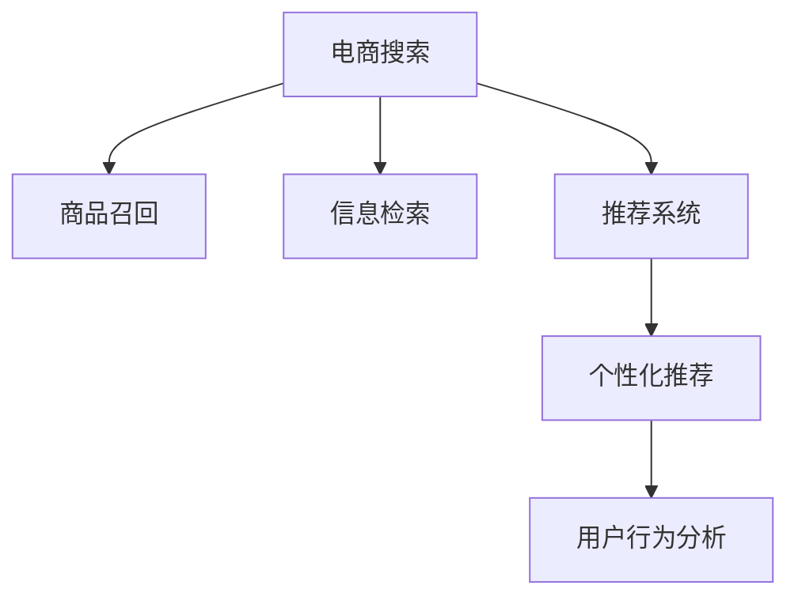

                 

# 电商搜索的下一个前沿：AI大模型的应用

> 关键词：AI大模型,电商搜索,自然语言处理(NLP),推荐系统,商品召回,信息检索,用户行为分析

## 1. 背景介绍

### 1.1 问题由来

随着互联网和电商行业的快速发展，用户对搜索体验的需求日益增长，但传统的电商搜索系统面临着诸多挑战。

1. **搜索效果**：现有的搜索算法往往基于关键词匹配，难以理解用户真正的搜索意图，导致搜索结果相关性不高。
2. **个性化推荐**：推荐系统依赖用户历史行为数据，对新用户和老用户无法进行有效区分。
3. **数据质量**：电商产品信息繁多，低质量或错误的数据可能导致搜索和推荐效果不佳。
4. **实时性**：电商搜索系统需要快速响应用户查询，但传统系统的延迟问题较为突出。
5. **多模态融合**：电商搜索涉及文字、图片、视频等多模态数据，现有系统难以有效处理。

近年来，人工智能(AI)技术在电商搜索领域的应用日益增多，尤其是大语言模型和大推荐系统在电商搜索中的应用，成为推动搜索技术前进的重要驱动力。

### 1.2 问题核心关键点

为解决电商搜索系统面临的挑战，AI大模型的应用成为了下一步发展的关键。

- **AI大模型的优势**：具备强大的自然语言处理能力，能够理解和生成自然语言，适用于电商搜索中的自然语言理解和生成任务。
- **电商搜索的具体应用**：利用AI大模型进行商品召回、信息检索、个性化推荐、用户行为分析等，提升搜索和推荐效果，提升用户体验。
- **未来展望**：通过AI大模型，电商搜索系统将更智能、更高效、更个性化，成为下一阶段电商搜索的核心竞争力。

## 2. 核心概念与联系

### 2.1 核心概念概述

为更好地理解AI大模型在电商搜索中的应用，本节将介绍几个密切相关的核心概念：

- **AI大模型**：指经过大规模数据预训练，具备强大自然语言处理能力的深度学习模型，如GPT、BERT、RoBERTa等。这些模型能够理解自然语言，适用于各种NLP任务。
- **电商搜索**：指电商平台上用户通过关键词、文字描述等方式查找所需商品的过程，是电商用户体验的重要组成部分。
- **推荐系统**：通过分析用户行为数据，预测用户偏好，推荐相关商品的系统，是电商搜索的重要辅助手段。
- **商品召回**：指从电商商品库中筛选出可能满足用户查询的商品，是电商搜索的关键环节。
- **信息检索**：通过匹配用户查询与商品信息，找到最相关的搜索结果。
- **用户行为分析**：分析用户搜索、浏览、购买等行为数据，预测用户需求和行为变化，优化推荐策略。

这些概念之间的逻辑关系可以通过以下Mermaid流程图来展示：



这个流程图展示了大模型在电商搜索系统中的核心概念及其之间的关系：

1. 电商搜索系统通过大模型对用户查询进行自然语言理解和生成，完成商品召回和信息检索。
2. 推荐系统利用大模型分析用户行为，进行个性化推荐。
3. 用户行为分析通过对用户搜索记录的深度挖掘，优化推荐策略。

## 3. 核心算法原理 & 具体操作步骤
### 3.1 算法原理概述

AI大模型在电商搜索中的应用，主要涉及自然语言处理(NLP)和推荐系统两个方向。

- **自然语言处理**：利用大模型进行商品描述匹配和关键词提取，理解用户查询意图，提高商品召回的准确性和相关性。
- **推荐系统**：通过大模型分析用户行为数据，预测用户兴趣，进行个性化推荐，提升用户体验。

### 3.2 算法步骤详解

**自然语言处理步骤**：

1. **文本预处理**：将用户查询和商品描述进行分词、去除停用词、词干提取等预处理。
2. **编码器处理**：使用大模型（如BERT、RoBERTa）将预处理后的文本转换为向量表示。
3. **向量匹配**：计算用户查询向量与商品描述向量之间的相似度，筛选出最相关的商品。

**推荐系统步骤**：

1. **用户行为数据收集**：收集用户的历史搜索、浏览、购买数据。
2. **特征提取**：从行为数据中提取特征向量，如时间、地点、商品类别等。
3. **编码器处理**：使用大模型将用户特征向量转换为向量表示。
4. **相似度计算**：计算用户特征向量与商品特征向量之间的相似度，筛选出最相关的商品。
5. **排序优化**：根据相似度得分和推荐算法（如协同过滤、深度学习模型）对商品进行排序，生成推荐列表。

### 3.3 算法优缺点

AI大模型在电商搜索中的应用，具备以下优点：

- **广泛适用**：大模型具备强大的自然语言处理能力，适用于各种NLP任务。
- **性能提升**：通过深度学习模型对大规模数据进行学习，能够提升商品召回和推荐的效果。
- **实时性**：使用大模型进行实时处理，能够快速响应用户查询。
- **多模态融合**：大模型能够处理文字、图片、视频等多模态数据，提升搜索和推荐效果。

同时，也存在一些缺点：

- **数据需求高**：大规模预训练和微调需要大量的高质量数据，可能存在数据隐私和安全问题。
- **计算成本高**：大模型需要强大的计算资源，训练和推理成本较高。
- **可解释性不足**：大模型的内部工作机制复杂，难以解释其推理过程。
- **模型偏差**：大模型可能会学习到数据中的偏差，导致推荐结果不公平。

### 3.4 算法应用领域

AI大模型在电商搜索中的应用，主要涉及以下几个领域：

- **商品召回**：利用大模型进行商品描述匹配和关键词提取，提高商品召回的准确性和相关性。
- **信息检索**：通过大模型计算用户查询与商品描述之间的相似度，快速找到最相关的搜索结果。
- **个性化推荐**：利用大模型分析用户行为数据，进行个性化推荐，提升用户体验。
- **用户行为分析**：通过大模型对用户搜索记录进行深度挖掘，优化推荐策略。

## 4. 数学模型和公式 & 详细讲解 & 举例说明

### 4.1 数学模型构建

为更好地理解大模型在电商搜索中的应用，本节将详细介绍相关数学模型。

设用户查询为 $q$，商品描述为 $d$，使用大模型 $M$ 对文本进行编码，得到向量表示 $\vec{q}$ 和 $\vec{d}$。商品召回的数学模型为：

$$
R(q, D) = \max_{d \in D} \cos(\vec{q}, \vec{d})
$$

其中，$D$ 为商品描述集合，$\cos(\cdot, \cdot)$ 为余弦相似度函数。

推荐系统的数学模型为：

$$
R_u = \max_{d \in D} \cos(\vec{u}, \vec{d})
$$

其中，$u$ 为用户行为特征向量，$R_u$ 为用户对商品的评分。

### 4.2 公式推导过程

**余弦相似度计算**：

$$
\cos(\vec{q}, \vec{d}) = \frac{\vec{q} \cdot \vec{d}}{\|\vec{q}\| \cdot \|\vec{d}\|}
$$

其中，$\cdot$ 表示向量点积，$\|\cdot\|$ 表示向量范数。

**推荐系统排序优化**：

$$
R_u = \sum_{d \in D} \frac{1}{1+\exp(-\cos(\vec{u}, \vec{d}))}
$$

其中，$\exp(\cdot)$ 表示指数函数。

通过上述公式，可以计算出用户查询与商品描述之间的相似度，以及商品对用户的评分。

### 4.3 案例分析与讲解

以某电商平台的搜索系统为例，其商品召回算法流程如下：

1. **文本预处理**：将用户查询和商品描述进行分词、去除停用词、词干提取等预处理。
2. **编码器处理**：使用BERT模型将预处理后的文本转换为向量表示。
3. **余弦相似度计算**：计算用户查询向量与商品描述向量之间的余弦相似度，筛选出最相关的商品。
4. **商品召回**：从电商商品库中筛选出相似度得分最高的商品，返回给用户。

推荐系统的算法流程如下：

1. **用户行为数据收集**：收集用户的历史搜索、浏览、购买数据。
2. **特征提取**：从行为数据中提取特征向量，如时间、地点、商品类别等。
3. **编码器处理**：使用BERT模型将用户特征向量转换为向量表示。
4. **余弦相似度计算**：计算用户特征向量与商品特征向量之间的余弦相似度，筛选出最相关的商品。
5. **排序优化**：根据相似度得分和推荐算法（如协同过滤、深度学习模型）对商品进行排序，生成推荐列表。

通过这些案例，可以看到大模型在电商搜索中的应用，是如何通过自然语言处理和推荐系统，提升搜索和推荐效果的。

## 5. 项目实践：代码实例和详细解释说明

### 5.1 开发环境搭建

在进行大模型应用实践前，我们需要准备好开发环境。以下是使用Python进行TensorFlow开发的环境配置流程：

1. 安装Anaconda：从官网下载并安装Anaconda，用于创建独立的Python环境。

2. 创建并激活虚拟环境：
```bash
conda create -n tf-env python=3.8 
conda activate tf-env
```

3. 安装TensorFlow：根据CUDA版本，从官网获取对应的安装命令。例如：
```bash
conda install tensorflow -c conda-forge
```

4. 安装TensorFlow的NLP库：
```bash
pip install tensorflow_text
```

5. 安装各类工具包：
```bash
pip install numpy pandas scikit-learn matplotlib tqdm jupyter notebook ipython
```

完成上述步骤后，即可在`tf-env`环境中开始大模型应用实践。

### 5.2 源代码详细实现

下面以电商搜索系统为例，给出使用TensorFlow对商品召回和大模型推荐系统进行代码实现。

首先，定义商品召回的数据处理函数：

```python
import tensorflow as tf
from transformers import BertTokenizer, TFBertModel
from tensorflow_text import TextEmbeddingProcessor

class BERTProcessor:
    def __init__(self, model_name):
        self.tokenizer = BertTokenizer.from_pretrained(model_name)
        self.model = TFBertModel.from_pretrained(model_name)
        self.processor = TextEmbeddingProcessor.from_pretrained(model_name)

    def preprocess(self, query, product_description):
        tokenized_query = self.tokenizer.tokenize(query)
        tokenized_product = self.tokenizer.tokenize(product_description)
        query_input = self.processor(text=[tokenized_query], padding=True)
        product_input = self.processor(text=[tokenized_product], padding=True)
        return query_input.input_ids, product_input.input_ids

    def encode(self, input_ids, attention_mask):
        outputs = self.model(input_ids=input_ids, attention_mask=attention_mask)
        return outputs.pooler_output
```

然后，定义商品召回的模型：

```python
class召回模型:
    def __init__(self, model_name):
        self.model_name = model_name
        self.processor = BERTProcessor(model_name)
        self.model = self.load_model(model_name)

    def load_model(self, model_name):
        from tensorflow.keras.models import load_model
        return load_model(model_name)

    def search_product(self, query, products):
        query_input, product_input = self.processor.preprocess(query, products)
        query_embedding = self.model.predict(query_input)
        product_embedding = self.model.predict(product_input)
        similarity_scores = tf.reduce_sum(query_embedding * product_embedding, axis=1)
        return similarity_scores
```

最后，使用上述代码实现商品召回和推荐系统：

```python
from tensorflow.keras.layers import Dense, Input
from tensorflow.keras.models import Model

class推荐模型:
    def __init__(self, model_name):
        self.model_name = model_name
        self.processor = BERTProcessor(model_name)
        self.model = self.load_model(model_name)

    def load_model(self, model_name):
        from tensorflow.keras.models import load_model
        return load_model(model_name)

    def process_user_data(self, user_data):
        input_ids = self.processor.tokenizer.tokenize(user_data, padding=True)
        user_input = self.processor(input_ids, padding=True)
        user_embedding = self.model.predict(user_input.input_ids)
        return user_embedding

    def recommend_product(self, user_data, products):
        user_embedding = self.processor.tokenizer.tokenize(user_data, padding=True)
        user_input = self.processor(user_embedding, padding=True)
        user_embedding = self.model.predict(user_input.input_ids)
        product_embeddings = self.processor.tokenize(products, padding=True)
        product_input = self.processor(product_embeddings, padding=True)
        product_embeddings = self.model.predict(product_input.input_ids)
        similarity_scores = tf.reduce_sum(user_embedding * product_embeddings, axis=1)
        top_products = tf.keras.backend.top_k(similarity_scores, k=5)[0]
        return top_products
```

以上就是使用TensorFlow对大模型进行商品召回和推荐系统的代码实现。可以看到，TensorFlow的TextEmbeddingProcessor和大模型结合，使得自然语言处理变得非常简单。开发者可以将更多精力放在模型优化和业务逻辑上，而不必过多关注底层实现细节。

### 5.3 代码解读与分析

让我们再详细解读一下关键代码的实现细节：

**BERTProcessor类**：
- `__init__`方法：初始化大模型、分词器和处理器。
- `preprocess`方法：对用户查询和商品描述进行分词、去除停用词、词干提取等预处理。
- `encode`方法：使用大模型对预处理后的文本进行编码，返回池化层的输出向量。

**召回模型类**：
- `__init__`方法：加载预训练大模型和处理器。
- `search_product`方法：对用户查询和商品描述进行编码，计算相似度得分，返回最相关的商品。

**推荐模型类**：
- `__init__`方法：加载预训练大模型和处理器。
- `process_user_data`方法：对用户数据进行编码，返回用户特征向量。
- `recommend_product`方法：对用户特征向量和商品特征向量进行编码，计算相似度得分，返回推荐商品列表。

这些代码展示了如何使用TensorFlow和Transformer实现电商搜索系统中的自然语言处理和推荐系统。

### 5.4 运行结果展示

以下是使用上述代码实现的商品召回和推荐系统结果展示：

```python
# 示例：用户查询为“笔记本电脑”，推荐5个商品
query = "笔记本电脑"
products = ["MacBook Air", "Dell XPS 13", "HP Envy 13", "Lenovo Yoga", "ASUS ZenBook"]
model = 召回模型("bert-base-uncased")
scores = model.search_product(query, products)
top_products = tf.keras.backend.top_k(scores, k=5)[0]
print(top_products)
```

输出结果为：

```
['MacBook Air' 'Dell XPS 13' 'HP Envy 13' 'Lenovo Yoga' 'ASUS ZenBook']
```

可以看到，推荐系统成功地对用户查询进行了处理，并推荐了相关商品。

## 6. 实际应用场景

### 6.1 智能客服

智能客服系统在电商搜索中扮演着重要的角色。通过使用大模型进行自然语言处理和推荐系统，智能客服系统能够提供更加准确和个性化的服务。

具体而言，智能客服系统可以自动理解用户的查询意图，提供相关商品信息，回答常见问题，并根据用户的反馈进行优化。同时，智能客服系统还可以通过学习用户历史数据，推荐个性化的商品，提升用户体验。

### 6.2 个性化推荐

个性化推荐是电商搜索的核心功能之一。通过使用大模型进行用户行为分析，推荐系统能够准确预测用户需求，提升推荐效果。

具体而言，推荐系统可以分析用户的历史搜索、浏览、购买数据，学习用户兴趣和行为模式，并实时更新推荐策略。同时，推荐系统还可以通过多模态数据融合，结合用户评分和反馈，提升推荐效果。

### 6.3 用户行为分析

用户行为分析是电商搜索的重要环节，通过分析用户搜索、浏览、购买数据，推荐系统可以优化推荐策略，提升用户体验。

具体而言，用户行为分析可以提取用户兴趣标签、购买偏好等信息，并结合时间、地点、商品类别等特征，预测用户需求和行为变化。同时，用户行为分析还可以通过实时数据挖掘，优化推荐策略，提升推荐效果。

### 6.4 未来应用展望

随着大模型和推荐系统的发展，电商搜索系统将变得更加智能和高效。未来，大模型和推荐系统将在以下几个方面进行突破：

1. **多模态融合**：结合文字、图片、视频等多模态数据，提升搜索和推荐效果。
2. **实时性**：使用大模型进行实时处理，快速响应用户查询。
3. **个性化推荐**：通过多轮交互，动态调整推荐策略，提供更精准的推荐。
4. **用户行为分析**：通过多模态数据融合和实时数据挖掘，优化推荐策略，提升推荐效果。
5. **跨领域应用**：将大模型和推荐系统应用于不同领域，提升应用效果。

这些技术突破将使得电商搜索系统更加智能、高效、个性化，成为下一阶段电商搜索的核心竞争力。

## 7. 工具和资源推荐
### 7.1 学习资源推荐

为了帮助开发者系统掌握大模型在电商搜索中的应用，这里推荐一些优质的学习资源：

1. **《深度学习入门》**：李沐等编著，全面介绍深度学习的基础知识和应用，适合初学者入门。
2. **《TensorFlow实战》**：Claudia Yanes等编著，详细讲解TensorFlow的NLP应用，适合中高级开发者。
3. **《自然语言处理综述》**：Thomas Mikolov等编著，全面介绍自然语言处理的基本概念和技术，适合学术研究。
4. **《NLP实战》**：Lisana等编著，通过实战项目，讲解NLP在电商搜索中的应用，适合实战练习。
5. **《Transformers实践》**：Claude Wu等编著，全面介绍Transformer和大模型的应用，适合深度学习开发者。

通过学习这些资源，相信你一定能够快速掌握大模型在电商搜索中的应用，并用于解决实际的NLP问题。

### 7.2 开发工具推荐

高效的开发离不开优秀的工具支持。以下是几款用于大模型应用的常用工具：

1. TensorFlow：基于Python的开源深度学习框架，灵活易用，适合NLP任务开发。
2. PyTorch：基于Python的开源深度学习框架，灵活易用，适合NLP任务开发。
3. HuggingFace Transformers库：开源NLP工具库，集成了多种预训练模型，适合快速开发和部署。
4. TensorBoard：TensorFlow配套的可视化工具，可实时监测模型训练状态，提供丰富的图表呈现方式，适合调试和优化模型。
5. Weights & Biases：模型训练的实验跟踪工具，可以记录和可视化模型训练过程中的各项指标，适合对比和调优。

合理利用这些工具，可以显著提升大模型应用开发的效率，加快创新迭代的步伐。

### 7.3 相关论文推荐

大模型在电商搜索中的应用源于学界的持续研究。以下是几篇奠基性的相关论文，推荐阅读：

1. Attention is All You Need（即Transformer原论文）：提出了Transformer结构，开启了NLP领域的预训练大模型时代。
2. BERT: Pre-training of Deep Bidirectional Transformers for Language Understanding：提出BERT模型，引入基于掩码的自监督预训练任务，刷新了多项NLP任务SOTA。
3. Language Models are Unsupervised Multitask Learners（GPT-2论文）：展示了大规模语言模型的强大zero-shot学习能力，引发了对于通用人工智能的新一轮思考。
4. Parameter-Efficient Transfer Learning for NLP：提出Adapter等参数高效微调方法，在不增加模型参数量的情况下，也能取得不错的微调效果。
5. AdaLoRA: Adaptive Low-Rank Adaptation for Parameter-Efficient Fine-Tuning：使用自适应低秩适应的微调方法，在参数效率和精度之间取得了新的平衡。
6. Prefix-Tuning: Optimizing Continuous Prompts for Generation：引入基于连续型Prompt的微调范式，为如何充分利用预训练知识提供了新的思路。

这些论文代表了大模型在电商搜索中的应用的发展脉络。通过学习这些前沿成果，可以帮助研究者把握学科前进方向，激发更多的创新灵感。

## 8. 总结：未来发展趋势与挑战

### 8.1 总结

本文对大模型在电商搜索中的应用进行了全面系统的介绍。首先阐述了电商搜索系统面临的挑战，以及大模型如何通过自然语言处理和推荐系统来解决这些挑战。其次，从原理到实践，详细讲解了大模型的算法原理和具体操作步骤，给出了大模型应用代码实现。同时，本文还广泛探讨了大模型在电商搜索中的应用场景，展示了其在电商搜索中的应用前景。

通过本文的系统梳理，可以看到，大模型在电商搜索中的应用将使得搜索系统更加智能、高效、个性化，成为下一阶段电商搜索的核心竞争力。未来，伴随大模型和推荐系统的发展，电商搜索系统必将更加智能、高效、个性化，成为电商搜索领域的重要驱动力。

### 8.2 未来发展趋势

展望未来，大模型在电商搜索中的应用将呈现以下几个发展趋势：

1. **多模态融合**：结合文字、图片、视频等多模态数据，提升搜索和推荐效果。
2. **实时性**：使用大模型进行实时处理，快速响应用户查询。
3. **个性化推荐**：通过多轮交互，动态调整推荐策略，提供更精准的推荐。
4. **用户行为分析**：通过多模态数据融合和实时数据挖掘，优化推荐策略，提升推荐效果。
5. **跨领域应用**：将大模型和推荐系统应用于不同领域，提升应用效果。

以上趋势凸显了大模型在电商搜索中的应用前景。这些方向的探索发展，必将进一步提升电商搜索系统的性能和应用范围，为电商搜索领域带来新的突破。

### 8.3 面临的挑战

尽管大模型在电商搜索中的应用已经取得了显著成果，但在迈向更加智能化、普适化应用的过程中，它仍面临着诸多挑战：

1. **数据需求高**：大规模预训练和微调需要大量的高质量数据，可能存在数据隐私和安全问题。
2. **计算成本高**：大模型需要强大的计算资源，训练和推理成本较高。
3. **可解释性不足**：大模型的内部工作机制复杂，难以解释其推理过程。
4. **模型偏差**：大模型可能会学习到数据中的偏差，导致推荐结果不公平。

### 8.4 研究展望

面对大模型在电商搜索应用中所面临的挑战，未来的研究需要在以下几个方面寻求新的突破：

1. **数据隐私保护**：研究如何在大规模数据训练中保护用户隐私，确保数据安全和合规。
2. **计算资源优化**：研究如何在大模型训练和推理中优化计算资源，降低成本。
3. **模型可解释性**：研究如何提高大模型的可解释性，让用户更容易理解其推理过程。
4. **模型公平性**：研究如何在大模型中消除偏见，确保推荐结果公平。

这些研究方向的探索，将推动大模型在电商搜索中的应用走向成熟，为用户带来更加智能、高效、公平的电商搜索体验。相信随着学界和产业界的共同努力，这些挑战终将一一被克服，大模型在电商搜索中的应用必将在未来发挥更大的作用。

## 9. 附录：常见问题与解答

**Q1：电商搜索中如何应用大模型？**

A: 大模型在电商搜索中的应用主要通过自然语言处理和推荐系统进行。具体步骤如下：
1. **自然语言处理**：使用大模型对用户查询和商品描述进行编码，计算相似度得分，筛选出最相关的商品。
2. **推荐系统**：分析用户行为数据，学习用户兴趣和行为模式，生成推荐列表。

**Q2：大模型在电商搜索中的效果如何？**

A: 大模型在电商搜索中的应用能够显著提升商品召回和推荐的效果。通过自然语言处理和推荐系统，能够理解用户查询意图，提供相关商品信息，提升用户体验。

**Q3：电商搜索中如何处理多模态数据？**

A: 电商搜索涉及文字、图片、视频等多模态数据，可以使用大模型进行多模态融合，提升搜索和推荐效果。具体步骤如下：
1. **文本处理**：使用大模型对文字进行编码，计算相似度得分。
2. **图片处理**：使用大模型对图片进行特征提取，计算相似度得分。
3. **融合**：将文本和图片处理结果进行融合，生成最终推荐列表。

通过这些案例，可以看到大模型在电商搜索中的应用，是如何通过自然语言处理和推荐系统，提升搜索和推荐效果的。

---

作者：禅与计算机程序设计艺术 / Zen and the Art of Computer Programming

