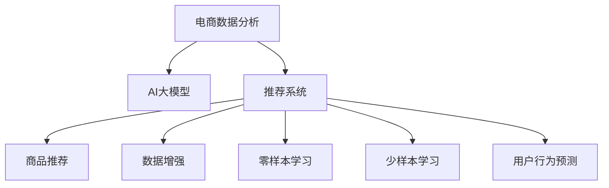

                 

# 电商数据分析：AI大模型的新思路

> 关键词：电商数据分析, AI大模型, 推荐系统, 商品推荐, 数据增强, 零样本学习, 少样本学习, 用户行为预测

## 1. 背景介绍

### 1.1 问题由来

随着互联网电商市场的迅猛发展，各大电商平台积累的海量交易数据、用户行为数据日益丰富。如何从这些数据中提取有价值的商业洞察，指导店铺运营、产品推荐、库存管理，成为电商公司关注的焦点。传统的数据分析方法已经难以满足电商场景的实时性、个性化、多维度分析需求，迫切需要引入先进的AI技术，特别是大语言模型，来处理海量数据，挖掘用户的深层次需求。

### 1.2 问题核心关键点

电商数据分析的核心问题在于：如何利用有限的标注数据，快速准确地建立用户行为预测模型，为用户推荐个性化商品，提升用户满意度和平台转化率。这其中涉及以下关键点：

- 数据预处理：对大规模用户行为数据进行清洗、特征工程和转换，提取出有意义的特征。
- 模型构建：选择合适的AI模型框架，训练个性化推荐系统。
- 模型微调：在大模型上进行微调，学习特定电商场景的特征。
- 应用部署：将训练好的模型部署到实际电商系统中，实现实时推荐。

### 1.3 问题研究意义

电商数据分析的AI大模型范式，能够快速从海量数据中提取模式，预测用户行为，为电商平台提供个性化推荐服务，减少用户流失，提高销售额。该方法不仅降低了数据分析的时间和成本，还能持续学习新数据，保持模型的时效性和适应性，具有重要的应用价值：

1. **提升用户体验**：通过个性化推荐，满足用户需求，提升购物体验。
2. **增加用户粘性**：定期推送个性化内容，增强用户平台粘性。
3. **优化库存管理**：准确预测商品需求，减少库存积压和缺货情况。
4. **提高转化率**：通过精准推荐，增加用户下单转化率。
5. **促进复购**：个性化推荐用户感兴趣的商品，增加用户复购率。

## 2. 核心概念与联系

### 2.1 核心概念概述

为更好地理解电商数据分析的AI大模型方法，本节将介绍几个密切相关的核心概念：

- **电商数据分析**：通过分析电商平台积累的各类数据，挖掘用户行为模式，指导电商平台进行运营决策。
- **AI大模型**：基于深度学习的大型神经网络模型，如BERT、GPT-3等，具备强大的语言理解、生成和推理能力。
- **推荐系统**：根据用户行为数据和商品属性信息，为用户推荐个性化商品的系统。
- **商品推荐**：通过分析用户历史购买记录、浏览记录、评分数据等，预测用户可能感兴趣的商品。
- **数据增强**：通过对原始数据进行各种变换，如回译、重采样等，扩充训练数据集。
- **零样本学习**：在不使用任何标注数据的情况下，利用大模型进行预测。
- **少样本学习**：在只有少量标注数据的情况下，通过微调使模型快速适应新任务。
- **用户行为预测**：通过分析用户行为数据，预测用户未来的行为，如购买意向、流失风险等。

这些核心概念之间的逻辑关系可以通过以下Mermaid流程图来展示：



这个流程图展示了大语言模型在电商数据分析中的应用路径：

1. 电商数据分析通过数据预处理，提取用户行为特征。
2. AI大模型作为推荐系统的核心，通过微调学习电商场景的特征。
3. 推荐系统使用微调后的模型，进行商品推荐。
4. 数据增强、零样本学习、少样本学习、用户行为预测等技术，进一步提升推荐系统的效果。

## 3. 核心算法原理 & 具体操作步骤

### 3.1 算法原理概述

电商数据分析中的AI大模型微调方法，是基于监督学习的推荐系统构建过程。其核心思想是：利用大语言模型作为初始化参数，通过有监督的微调方法，学习电商平台上的用户行为模式，构建个性化推荐模型，实现高效的商品推荐。

形式化地，假设电商平台的历史数据集为 $D=\{(x_i,y_i)\}_{i=1}^N$，其中 $x_i$ 为用户行为数据，$y_i$ 为商品推荐结果。模型的目标是最小化损失函数 $\mathcal{L}(M_{\theta},D)$，以使得模型输出 $M_{\theta}(x)$ 能够逼近真实标签 $y$。常见的损失函数包括交叉熵损失、均方误差损失等。

### 3.2 算法步骤详解

电商数据分析中的AI大模型微调一般包括以下几个关键步骤：

**Step 1: 准备电商数据集**

- 收集电商平台的交易数据、用户行为数据、商品属性数据等，进行清洗、转换和标注。
- 将标注数据划分为训练集、验证集和测试集，以用于模型训练、调优和评估。

**Step 2: 构建推荐模型**

- 选择合适的AI模型框架，如深度学习、图神经网络等。
- 在模型中嵌入用户行为数据和商品属性数据，设计合适的特征提取和融合机制。
- 设计任务适配层，如线性分类器、回归器等，用于输出预测结果。

**Step 3: 设置微调超参数**

- 选择合适的优化算法及其参数，如AdamW、SGD等，设置学习率、批大小、迭代轮数等。
- 设置正则化技术及强度，包括权重衰减、Dropout、Early Stopping等。
- 确定冻结预训练参数的策略，如仅微调顶层，或全部参数都参与微调。

**Step 4: 执行梯度训练**

- 将训练集数据分批次输入模型，前向传播计算损失函数。
- 反向传播计算参数梯度，根据设定的优化算法和学习率更新模型参数。
- 周期性在验证集上评估模型性能，根据性能指标决定是否触发 Early Stopping。
- 重复上述步骤直到满足预设的迭代轮数或 Early Stopping 条件。

**Step 5: 测试和部署**

- 在测试集上评估微调后模型的推荐效果，对比微调前后的精度提升。
- 使用微调后的模型对新用户进行推荐，集成到实际的电商推荐系统中。
- 持续收集新的用户行为数据，定期重新微调模型，以适应数据分布的变化。

以上是电商数据分析中AI大模型微调的一般流程。在实际应用中，还需要针对具体电商场景，对微调过程的各个环节进行优化设计，如改进训练目标函数，引入更多的正则化技术，搜索最优的超参数组合等，以进一步提升模型性能。

### 3.3 算法优缺点

电商数据分析中的AI大模型微调方法具有以下优点：

1. **效率高**：利用预训练大模型的强大表示能力，可以大幅降低数据标注和特征工程的成本，快速构建推荐模型。
2. **效果显著**：在少量标注数据下，通过微调也能显著提升模型的推荐精度。
3. **适应性强**：大模型具备良好的泛化能力，可以适应不同电商平台和商品类别。
4. **实时性**：通过构建轻量级的微调模型，可以实现实时推荐，提升用户体验。

但该方法也存在一定的局限性：

1. **数据隐私问题**：电商平台的数据隐私问题较为敏感，需要严格遵守数据保护法规。
2. **计算资源需求高**：大规模数据集和复杂模型需要大量计算资源。
3. **模型复杂度高**：大模型的复杂度较高，推理速度较慢。
4. **模型解释性不足**：大模型的黑盒特性难以解释推荐过程。
5. **对抗攻击风险**：大模型容易受到对抗样本的攻击，影响推荐结果。

尽管存在这些局限性，但就目前而言，基于大模型微调的电商数据分析范式仍是最主流的方法。未来相关研究的重点在于如何进一步降低数据标注成本，提高模型的实时性和可解释性，同时兼顾隐私和安全。

### 3.4 算法应用领域

电商数据分析中的AI大模型微调方法在多个电商场景中得到了广泛的应用，包括：

- **商品推荐**：通过分析用户历史行为数据，预测用户可能感兴趣的商品，推荐个性化商品。
- **用户画像构建**：根据用户浏览和购买数据，构建用户兴趣标签，实现更精准的用户画像。
- **库存管理**：通过预测商品需求，优化库存管理，减少缺货和过剩情况。
- **营销活动策划**：利用用户行为数据，预测用户对营销活动的响应，优化广告投放策略。
- **客户服务**：通过分析用户互动记录，预测用户问题类型，提供个性化客服解决方案。

这些应用场景展示了AI大模型在电商数据分析中的巨大潜力，为电商平台的运营和营销提供了强有力的技术支持。

## 4. 数学模型和公式 & 详细讲解 & 举例说明

### 4.1 数学模型构建

电商数据分析中的AI大模型微调过程，可以通过以下数学模型进行描述：

假设电商平台的历史数据集为 $D=\{(x_i,y_i)\}_{i=1}^N$，其中 $x_i$ 为用户行为数据，$y_i$ 为商品推荐结果。模型的目标是最小化损失函数 $\mathcal{L}(M_{\theta},D)$，以使得模型输出 $M_{\theta}(x)$ 能够逼近真实标签 $y$。

令 $M_{\theta}(x)$ 为电商推荐模型，$y$ 为推荐结果。假设模型的输出为 $\hat{y}$，则损失函数定义为：

$$
\mathcal{L}(M_{\theta},D) = \frac{1}{N}\sum_{i=1}^N \ell(M_{\theta}(x_i),y_i)
$$

其中 $\ell$ 为损失函数，常见的有交叉熵损失、均方误差损失等。

### 4.2 公式推导过程

以交叉熵损失为例，假设推荐模型的输出为 $\hat{y} \in [0,1]$，真实标签为 $y \in \{0,1\}$，则交叉熵损失函数为：

$$
\ell(M_{\theta}(x),y) = -[y\log \hat{y} + (1-y)\log (1-\hat{y})]
$$

将其代入损失函数公式，得：

$$
\mathcal{L}(\theta) = -\frac{1}{N}\sum_{i=1}^N [y_i\log M_{\theta}(x_i)+(1-y_i)\log(1-M_{\theta}(x_i))]
$$

根据链式法则，损失函数对模型参数 $\theta$ 的梯度为：

$$
\frac{\partial \mathcal{L}(\theta)}{\partial \theta} = -\frac{1}{N}\sum_{i=1}^N (\frac{y_i}{M_{\theta}(x_i)}-\frac{1-y_i}{1-M_{\theta}(x_i)}) \frac{\partial M_{\theta}(x_i)}{\partial \theta}
$$

其中 $\frac{\partial M_{\theta}(x_i)}{\partial \theta}$ 可进一步递归展开，利用自动微分技术完成计算。

在得到损失函数的梯度后，即可带入参数更新公式，完成模型的迭代优化。重复上述过程直至收敛，最终得到适应电商推荐任务的最优模型参数 $\theta^*$。

### 4.3 案例分析与讲解

以电商平台中的商品推荐为例，通过微调大语言模型进行推荐系统构建。

假设电商平台收集了用户历史购买记录、浏览记录、评分数据等，将这些数据作为训练集 $D$。使用BERT作为预训练语言模型，在其顶层添加一个线性分类器，用于输出商品推荐的概率。

定义损失函数为交叉熵损失，则微调的优化目标为：

$$
\theta^* = \mathop{\arg\min}_{\theta} \frac{1}{N}\sum_{i=1}^N [y_i\log M_{\theta}(x_i)+(1-y_i)\log(1-M_{\theta}(x_i))]
$$

模型输出 $M_{\theta}(x)$ 为 $x$ 通过BERT计算的向量表示与分类器输出的概率值。通过梯度下降等优化算法，不断更新模型参数 $\theta$，最小化损失函数 $\mathcal{L}(\theta)$，直至收敛。

在模型训练过程中，需要设置合适的学习率、批大小、迭代轮数等超参数。常用的优化算法包括AdamW、SGD等，可以通过交叉验证选择最优参数组合。

## 5. 项目实践：代码实例和详细解释说明

### 5.1 开发环境搭建

在进行电商数据分析的AI大模型微调实践前，我们需要准备好开发环境。以下是使用Python进行PyTorch开发的环境配置流程：

1. 安装Anaconda：从官网下载并安装Anaconda，用于创建独立的Python环境。

2. 创建并激活虚拟环境：
```bash
conda create -n pytorch-env python=3.8 
conda activate pytorch-env
```

3. 安装PyTorch：根据CUDA版本，从官网获取对应的安装命令。例如：
```bash
conda install pytorch torchvision torchaudio cudatoolkit=11.1 -c pytorch -c conda-forge
```

4. 安装TensorFlow：由Google主导开发的开源深度学习框架，生产部署方便，适合大规模工程应用。同样有丰富的预训练语言模型资源。

5. 安装Transformers库：
```bash
pip install transformers
```

6. 安装各类工具包：
```bash
pip install numpy pandas scikit-learn matplotlib tqdm jupyter notebook ipython
```

完成上述步骤后，即可在`pytorch-env`环境中开始微调实践。

### 5.2 源代码详细实现

下面我们以电商平台中的商品推荐为例，给出使用Transformers库对BERT模型进行微调的PyTorch代码实现。

首先，定义商品推荐任务的数据处理函数：

```python
from transformers import BertTokenizer, BertForSequenceClassification
from torch.utils.data import Dataset
import torch

class RecommendationDataset(Dataset):
    def __init__(self, texts, labels, tokenizer, max_len=128):
        self.texts = texts
        self.labels = labels
        self.tokenizer = tokenizer
        self.max_len = max_len
        
    def __len__(self):
        return len(self.texts)
    
    def __getitem__(self, item):
        text = self.texts[item]
        label = self.labels[item]
        
        encoding = self.tokenizer(text, return_tensors='pt', max_length=self.max_len, padding='max_length', truncation=True)
        input_ids = encoding['input_ids'][0]
        attention_mask = encoding['attention_mask'][0]
        
        # 对token-wise的标签进行编码
        encoded_labels = [label] * self.max_len
        labels = torch.tensor(encoded_labels, dtype=torch.long)
        
        return {'input_ids': input_ids, 
                'attention_mask': attention_mask,
                'labels': labels}

# 标签与id的映射
label2id = {'1': 1, '0': 0}
id2label = {1: '1', 0: '0'}

# 创建dataset
tokenizer = BertTokenizer.from_pretrained('bert-base-cased')

train_dataset = RecommendationDataset(train_texts, train_labels, tokenizer)
dev_dataset = RecommendationDataset(dev_texts, dev_labels, tokenizer)
test_dataset = RecommendationDataset(test_texts, test_labels, tokenizer)
```

然后，定义模型和优化器：

```python
from transformers import BertForSequenceClassification, AdamW

model = BertForSequenceClassification.from_pretrained('bert-base-cased', num_labels=len(label2id))

optimizer = AdamW(model.parameters(), lr=2e-5)
```

接着，定义训练和评估函数：

```python
from torch.utils.data import DataLoader
from tqdm import tqdm
from sklearn.metrics import accuracy_score

device = torch.device('cuda') if torch.cuda.is_available() else torch.device('cpu')
model.to(device)

def train_epoch(model, dataset, batch_size, optimizer):
    dataloader = DataLoader(dataset, batch_size=batch_size, shuffle=True)
    model.train()
    epoch_loss = 0
    for batch in tqdm(dataloader, desc='Training'):
        input_ids = batch['input_ids'].to(device)
        attention_mask = batch['attention_mask'].to(device)
        labels = batch['labels'].to(device)
        model.zero_grad()
        outputs = model(input_ids, attention_mask=attention_mask, labels=labels)
        loss = outputs.loss
        epoch_loss += loss.item()
        loss.backward()
        optimizer.step()
    return epoch_loss / len(dataloader)

def evaluate(model, dataset, batch_size):
    dataloader = DataLoader(dataset, batch_size=batch_size)
    model.eval()
    preds, labels = [], []
    with torch.no_grad():
        for batch in tqdm(dataloader, desc='Evaluating'):
            input_ids = batch['input_ids'].to(device)
            attention_mask = batch['attention_mask'].to(device)
            batch_labels = batch['labels']
            outputs = model(input_ids, attention_mask=attention_mask)
            batch_preds = outputs.logits.argmax(dim=1).to('cpu').tolist()
            batch_labels = batch_labels.to('cpu').tolist()
            for pred, label in zip(batch_preds, batch_labels):
                preds.append(pred)
                labels.append(label)
                
    return accuracy_score(labels, preds)
```

最后，启动训练流程并在测试集上评估：

```python
epochs = 5
batch_size = 16

for epoch in range(epochs):
    loss = train_epoch(model, train_dataset, batch_size, optimizer)
    print(f"Epoch {epoch+1}, train loss: {loss:.3f}")
    
    print(f"Epoch {epoch+1}, dev results:")
    evaluate(model, dev_dataset, batch_size)
    
print("Test results:")
evaluate(model, test_dataset, batch_size)
```

以上就是使用PyTorch对BERT进行电商平台商品推荐任务微调的完整代码实现。可以看到，得益于Transformers库的强大封装，我们可以用相对简洁的代码完成BERT模型的加载和微调。

### 5.3 代码解读与分析

让我们再详细解读一下关键代码的实现细节：

**RecommendationDataset类**：
- `__init__`方法：初始化文本、标签、分词器等关键组件。
- `__len__`方法：返回数据集的样本数量。
- `__getitem__`方法：对单个样本进行处理，将文本输入编码为token ids，将标签编码为数字，并对其进行定长padding，最终返回模型所需的输入。

**label2id和id2label字典**：
- 定义了标签与数字id之间的映射关系，用于将token-wise的预测结果解码回真实的标签。

**训练和评估函数**：
- 使用PyTorch的DataLoader对数据集进行批次化加载，供模型训练和推理使用。
- 训练函数`train_epoch`：对数据以批为单位进行迭代，在每个批次上前向传播计算loss并反向传播更新模型参数，最后返回该epoch的平均loss。
- 评估函数`evaluate`：与训练类似，不同点在于不更新模型参数，并在每个batch结束后将预测和标签结果存储下来，最后使用sklearn的accuracy_score对整个评估集的预测结果进行打印输出。

**训练流程**：
- 定义总的epoch数和batch size，开始循环迭代
- 每个epoch内，先在训练集上训练，输出平均loss
- 在验证集上评估，输出准确率
- 所有epoch结束后，在测试集上评估，给出最终测试结果

可以看到，PyTorch配合Transformers库使得BERT微调的代码实现变得简洁高效。开发者可以将更多精力放在数据处理、模型改进等高层逻辑上，而不必过多关注底层的实现细节。

当然，工业级的系统实现还需考虑更多因素，如模型的保存和部署、超参数的自动搜索、更灵活的任务适配层等。但核心的微调范式基本与此类似。

## 6. 实际应用场景

### 6.1 电商推荐系统

基于大语言模型微调的推荐系统，可以广泛应用于电商平台的商品推荐。传统推荐系统往往只依赖用户历史行为数据进行推荐，难以覆盖用户的深层次需求。而使用微调后的推荐系统，可以学习到电商场景的复杂模式，实现更精准的个性化推荐。

在技术实现上，可以收集电商平台的商品数据、用户行为数据，构建标注数据集，在此基础上对预训练语言模型进行微调。微调后的模型能够自动理解商品属性和用户偏好，匹配最合适的推荐结果。对于用户提出的新商品，还可以接入检索系统实时搜索相关内容，动态组织生成推荐列表。如此构建的推荐系统，能大幅提升用户购物体验，增加平台转化率。

### 6.2 用户画像构建

电商平台的个性化推荐系统通常需要构建详细的用户画像，以便更好地匹配商品。传统的画像构建方法依赖手动标注，成本高且不够准确。利用大语言模型微调技术，可以通过用户行为数据自动学习用户兴趣，构建精准的用户画像。

具体而言，可以收集用户的浏览记录、购买记录、评分数据等，将这些数据作为微调的监督数据。微调后的模型能够自动生成用户兴趣标签，实现更精准的用户画像构建。这将有助于电商平台进行更精准的推荐和营销活动策划。

### 6.3 库存管理优化

电商平台的库存管理是一个复杂的问题，需要实时预测商品需求，减少缺货和过剩情况。传统的库存管理方法依赖简单的统计模型，难以应对市场波动和个性化需求。通过大语言模型微调技术，可以构建更精确的库存预测模型。

具体而言，可以收集历史销售数据、用户行为数据等，作为微调的监督数据。微调后的模型能够学习到商品的销售趋势和用户需求模式，提供更准确的库存预测结果。电商平台可以根据预测结果，调整采购计划，优化库存管理。

### 6.4 未来应用展望

随着大语言模型和微调方法的不断发展，基于微调的电商数据分析技术将呈现以下几个发展趋势：

1. **用户行为建模**：通过大语言模型微调，构建更复杂的用户行为模型，预测用户未来的行为，如购买意向、流失风险等。
2. **商品推荐创新**：引入更多先验知识，如知识图谱、逻辑规则等，引导微调过程学习更准确、合理的商品推荐。
3. **多模态融合**：将视觉、语音等多模态信息与文本信息进行协同建模，实现更全面、准确的商品推荐。
4. **模型解释性提升**：通过因果分析方法和博弈论工具，增强模型输出的解释性，确保系统决策透明、可控。
5. **模型部署优化**：采用轻量级微调模型和推理优化技术，提升推荐系统的实时性和可扩展性。

以上趋势凸显了大语言模型微调技术的广阔前景。这些方向的探索发展，必将进一步提升电商推荐系统的性能和用户体验，为电商平台带来更大的商业价值。

## 7. 工具和资源推荐

### 7.1 学习资源推荐

为了帮助开发者系统掌握大语言模型微调的理论基础和实践技巧，这里推荐一些优质的学习资源：

1. 《深度学习》系列课程：由斯坦福大学和Coursera合作的深度学习课程，涵盖深度学习基础和最新研究成果。
2. 《Python深度学习》书籍：使用Python语言，详细介绍了深度学习模型的构建和训练方法，适合初学者入门。
3. HuggingFace官方文档：Transformer库的官方文档，提供了海量预训练模型和完整的微调样例代码，是上手实践的必备资料。
4. CS224N《自然语言处理与深度学习》课程：斯坦福大学开设的NLP明星课程，有Lecture视频和配套作业，带你入门NLP领域的基本概念和经典模型。
5. 《自然语言处理》书籍：全面介绍了自然语言处理的基本概念和前沿技术，适合深入学习。

通过对这些资源的学习实践，相信你一定能够快速掌握大语言模型微调的精髓，并用于解决实际的NLP问题。

### 7.2 开发工具推荐

高效的开发离不开优秀的工具支持。以下是几款用于大语言模型微调开发的常用工具：

1. PyTorch：基于Python的开源深度学习框架，灵活动态的计算图，适合快速迭代研究。大部分预训练语言模型都有PyTorch版本的实现。
2. TensorFlow：由Google主导开发的开源深度学习框架，生产部署方便，适合大规模工程应用。同样有丰富的预训练语言模型资源。
3. Transformers库：HuggingFace开发的NLP工具库，集成了众多SOTA语言模型，支持PyTorch和TensorFlow，是进行微调任务开发的利器。
4. Weights & Biases：模型训练的实验跟踪工具，可以记录和可视化模型训练过程中的各项指标，方便对比和调优。与主流深度学习框架无缝集成。
5. Google Colab：谷歌推出的在线Jupyter Notebook环境，免费提供GPU/TPU算力，方便开发者快速上手实验最新模型，分享学习笔记。
6. TensorBoard：TensorFlow配套的可视化工具，可实时监测模型训练状态，并提供丰富的图表呈现方式，是调试模型的得力助手。

合理利用这些工具，可以显著提升大语言模型微调任务的开发效率，加快创新迭代的步伐。

### 7.3 相关论文推荐

大语言模型和微调技术的发展源于学界的持续研究。以下是几篇奠基性的相关论文，推荐阅读：

1. Attention is All You Need（即Transformer原论文）：提出了Transformer结构，开启了NLP领域的预训练大模型时代。
2. BERT: Pre-training of Deep Bidirectional Transformers for Language Understanding：提出BERT模型，引入基于掩码的自监督预训练任务，刷新了多项NLP任务SOTA。
3. Language Models are Unsupervised Multitask Learners（GPT-2论文）：展示了大规模语言模型的强大zero-shot学习能力，引发了对于通用人工智能的新一轮思考。
4. Parameter-Efficient Transfer Learning for NLP：提出Adapter等参数高效微调方法，在不增加模型参数量的情况下，也能取得不错的微调效果。
5. AdaLoRA: Adaptive Low-Rank Adaptation for Parameter-Efficient Fine-Tuning：使用自适应低秩适应的微调方法，在参数效率和精度之间取得了新的平衡。
6. Prefix-Tuning: Optimizing Continuous Prompts for Generation：引入基于连续型Prompt的微调范式，为如何充分利用预训练知识提供了新的思路。

这些论文代表了大语言模型微调技术的发展脉络。通过学习这些前沿成果，可以帮助研究者把握学科前进方向，激发更多的创新灵感。

## 8. 总结：未来发展趋势与挑战

### 8.1 总结

本文对基于大语言模型的电商数据分析方法进行了全面系统的介绍。首先阐述了电商数据分析的背景和意义，明确了AI大模型微调在电商推荐系统中的应用价值。其次，从原理到实践，详细讲解了电商数据分析的AI大模型微调过程，给出了电商推荐系统的完整代码实现。同时，本文还广泛探讨了电商数据分析的实际应用场景，展示了AI大模型在电商推荐、用户画像、库存管理等领域的巨大潜力。此外，本文精选了电商数据分析的相关学习资源，力求为读者提供全方位的技术指引。

通过本文的系统梳理，可以看到，基于大语言模型的电商数据分析方法正在成为电商推荐系统的重要范式，极大地提升了推荐系统的精度和实时性，为电商平台带来了显著的商业价值。未来，伴随大语言模型和微调方法的持续演进，电商推荐系统必将进一步优化，更好地服务于用户，创造更高的业务价值。

### 8.2 未来发展趋势

展望未来，电商数据分析中的AI大模型微调技术将呈现以下几个发展趋势：

1. **用户行为建模**：通过大语言模型微调，构建更复杂的用户行为模型，预测用户未来的行为，如购买意向、流失风险等。
2. **商品推荐创新**：引入更多先验知识，如知识图谱、逻辑规则等，引导微调过程学习更准确、合理的商品推荐。
3. **多模态融合**：将视觉、语音等多模态信息与文本信息进行协同建模，实现更全面、准确的商品推荐。
4. **模型解释性提升**：通过因果分析方法和博弈论工具，增强模型输出的解释性，确保系统决策透明、可控。
5. **模型部署优化**：采用轻量级微调模型和推理优化技术，提升推荐系统的实时性和可扩展性。

以上趋势凸显了大语言模型微调技术的广阔前景。这些方向的探索发展，必将进一步提升电商推荐系统的性能和用户体验，为电商平台带来更大的商业价值。

### 8.3 面临的挑战

尽管电商数据分析中的AI大模型微调技术已经取得了瞩目成就，但在迈向更加智能化、普适化应用的过程中，它仍面临着诸多挑战：

1. **数据隐私问题**：电商平台的数据隐私问题较为敏感，需要严格遵守数据保护法规。
2. **计算资源需求高**：大规模数据集和复杂模型需要大量计算资源。
3. **模型复杂度高**：大模型的复杂度较高，推理速度较慢。
4. **模型解释性不足**：大模型的黑盒特性难以解释推荐过程。
5. **对抗攻击风险**：大模型容易受到对抗样本的攻击，影响推荐结果。
6. **知识整合能力不足**：现有的微调模型往往局限于任务内数据，难以灵活吸收和运用更广泛的先验知识。

尽管存在这些局限性，但就目前而言，基于大模型微调的电商数据分析范式仍是最主流的方法。未来相关研究的重点在于如何进一步降低数据标注成本，提高模型的实时性和可解释性，同时兼顾隐私和安全。

### 8.4 研究展望

面对电商数据分析中的AI大模型微调所面临的挑战，未来的研究需要在以下几个方面寻求新的突破：

1. **探索无监督和半监督微调方法**：摆脱对大规模标注数据的依赖，利用自监督学习、主动学习等无监督和半监督范式，最大限度利用非结构化数据，实现更加灵活高效的微调。
2. **研究参数高效和计算高效的微调范式**：开发更加参数高效的微调方法，在固定大部分预训练参数的同时，只更新极少量的任务相关参数。同时优化微调模型的计算图，减少前向传播和反向传播的资源消耗，实现更加轻量级、实时性的部署。
3. **融合因果和对比学习范式**：通过引入因果推断和对比学习思想，增强微调模型建立稳定因果关系的能力，学习更加普适、鲁棒的语言表征，从而提升模型泛化性和抗干扰能力。
4. **引入更多先验知识**：将符号化的先验知识，如知识图谱、逻辑规则等，与神经网络模型进行巧妙融合，引导微调过程学习更准确、合理的商品推荐。同时加强不同模态数据的整合，实现视觉、语音等多模态信息与文本信息的协同建模。
5. **结合因果分析和博弈论工具**：将因果分析方法引入微调模型，识别出模型决策的关键特征，增强输出解释的因果性和逻辑性。借助博弈论工具刻画人机交互过程，主动探索并规避模型的脆弱点，提高系统稳定性。
6. **纳入伦理道德约束**：在模型训练目标中引入伦理导向的评估指标，过滤和惩罚有偏见、有害的输出倾向。同时加强人工干预和审核，建立模型行为的监管机制，确保输出符合人类价值观和伦理道德。

这些研究方向的探索，必将引领大语言模型微调技术迈向更高的台阶，为构建安全、可靠、可解释、可控的智能系统铺平道路。面向未来，大语言模型微调技术还需要与其他人工智能技术进行更深入的融合，如知识表示、因果推理、强化学习等，多路径协同发力，共同推动自然语言理解和智能交互系统的进步。只有勇于创新、敢于突破，才能不断拓展语言模型的边界，让智能技术更好地造福人类社会。

## 9. 附录：常见问题与解答

**Q1：电商数据分析是否需要大规模标注数据？**

A: 电商数据分析的AI大模型微调方法，可以通过在预训练模型上微调来适应电商场景，不需要大规模标注数据。但为了获得更好的性能，在微调前需要对原始数据进行数据增强，如回译、重采样等，以扩充训练数据集。

**Q2：如何选择合适的超参数？**

A: 电商数据分析中的AI大模型微调方法，需要选择合适的学习率、批大小、迭代轮数等超参数。建议通过交叉验证方法，在不同超参数组合中寻找最优性能。常用的优化算法包括AdamW、SGD等，可以通过预设的超参数空间进行搜索。

**Q3：电商数据分析中的AI大模型微调方法有哪些优势？**

A: 电商数据分析中的AI大模型微调方法具有以下优势：
1. **效率高**：利用预训练大模型的强大表示能力，可以大幅降低数据标注和特征工程的成本，快速构建推荐模型。
2. **效果显著**：在少量标注数据下，通过微调也能显著提升模型的推荐精度。
3. **适应性强**：大模型具备良好的泛化能力，可以适应不同电商平台和商品类别。
4. **实时性**：通过构建轻量级的微调模型，可以实现实时推荐，提升用户体验。

尽管存在这些优势，但该方法也存在数据隐私、计算资源需求高、模型复杂度高、模型解释性不足等问题，需要进一步优化。

**Q4：电商数据分析中的AI大模型微调方法有哪些应用场景？**

A: 电商数据分析中的AI大模型微调方法在多个电商场景中得到了广泛的应用，包括：
1. **商品推荐**：通过分析用户历史行为数据，预测用户可能感兴趣的商品，推荐个性化商品。
2. **用户画像构建**：根据用户浏览记录、购买记录、评分数据等，自动学习用户兴趣，构建精准的用户画像。
3. **库存管理优化**：通过预测商品需求，优化库存管理，减少缺货和过剩情况。
4. **营销活动策划**：利用用户行为数据，预测用户对营销活动的响应，优化广告投放策略。

这些应用场景展示了AI大模型在电商数据分析中的巨大潜力，为电商平台的运营和营销提供了强有力的技术支持。

**Q5：电商数据分析中的AI大模型微调方法有哪些挑战？**

A: 电商数据分析中的AI大模型微调方法在实际应用中，也面临着一些挑战：
1. **数据隐私问题**：电商平台的数据隐私问题较为敏感，需要严格遵守数据保护法规。
2. **计算资源需求高**：大规模数据集和复杂模型需要大量计算资源。
3. **模型复杂度高**：大模型的复杂度较高，推理速度较慢。
4. **模型解释性不足**：大模型的黑盒特性难以解释推荐过程。
5. **对抗攻击风险**：大模型容易受到对抗样本的攻击，影响推荐结果。
6. **知识整合能力不足**：现有的微调模型往往局限于任务内数据，难以灵活吸收和运用更广泛的先验知识。

这些挑战需要进一步研究和解决，以推动电商数据分析技术的进一步发展。

**Q6：如何缓解电商数据分析中的AI大模型微调方法的过拟合问题？**

A: 电商数据分析中的AI大模型微调方法，可以通过以下方式缓解过拟合问题：
1. **数据增强**：通过回译、重采样等方式扩充训练集。
2. **正则化**：使用L2正则、Dropout、Early Stopping等避免过拟合。
3. **对抗训练**：引入对抗样本，提高模型鲁棒性。
4. **参数高效微调**：只调整少量参数(如Adapter、Prefix等)，减小过拟合风险。
5. **多模型集成**：训练多个微调模型，取平均输出，抑制过拟合。

这些方法可以灵活组合，根据具体任务和数据特点进行优化，以最大程度提高电商数据分析的效果。

---

作者：禅与计算机程序设计艺术 / Zen and the Art of Computer Programming

