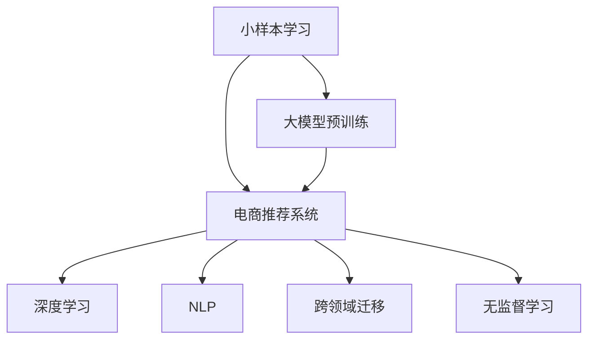
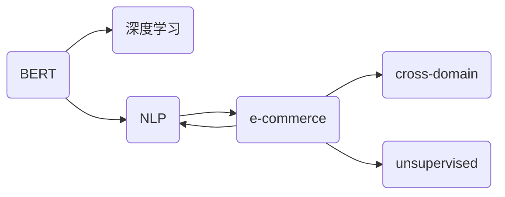

                 

# 电商行业中的小样本学习：大模型在新品推荐中的应用

> 关键词：大模型,小样本学习,电商推荐系统,深度学习,自然语言处理,NLP,Transformer,BERT,跨领域迁移,无监督学习

## 1. 背景介绍

### 1.1 问题由来

随着电子商务的迅猛发展，如何精准、高效地向用户推荐新商品，提升用户体验和商家收益，成为了电商企业亟需解决的问题。传统的推荐系统依赖用户行为数据进行建模，但在实际应用中，用户行为数据往往存在稀疏性、非均衡性等问题，导致模型难以有效覆盖长尾商品。

近年来，随着深度学习和大模型的兴起，一种基于小样本学习的方法开始得到广泛关注。大模型如BERT、GPT等，通过预训练获取丰富的语言知识，能够在少量标注数据上快速提升推荐效果。特别是在电商领域，通过小样本学习实现的新品推荐，不仅能够提升推荐精度，还能有效缓解数据稀疏性问题，从而显著降低推荐系统的开发和运营成本。

### 1.2 问题核心关键点

小样本学习旨在通过少量标注数据训练出高效、泛化的推荐模型，提升电商平台的商品推荐效果。与传统基于大规模用户行为数据训练推荐模型的方法不同，小样本学习方法可以充分利用大模型的预训练能力，通过精妙的设计实现少样本下的高精度推荐。

主要包括以下关键点：
- 小样本学习：在少量标注数据上进行模型训练，提升推荐精度和泛化能力。
- 大模型预训练：通过大规模无标签数据预训练，获取丰富的语言知识和特征表示。
- 跨领域迁移：将通用语言知识迁移应用到电商推荐任务，提升模型的泛化能力。
- 无监督学习：利用大模型的预训练能力和自动编码任务，从少量标注数据中挖掘更多信息，提高推荐效果。

## 2. 核心概念与联系

### 2.1 核心概念概述

为更好地理解小样本学习在大模型推荐系统中的应用，本节将介绍几个关键概念：

- 小样本学习(Learning from Small Sample)：指在数据量有限的情况下，通过优化算法和模型设计，提高模型泛化能力和学习效率。小样本学习可以应用于图像、文本、音频等多种数据类型，在NLP领域特别受到关注。
- 大模型(Large Model)：指具有亿级或更大参数量的预训练语言模型，如BERT、GPT-3等。大模型通过大规模无标签数据预训练，学习到丰富的语言知识和特征表示。
- 电商推荐系统(E-commerce Recommendation System)：指通过分析用户行为数据，向用户推荐商品或服务的系统。推荐系统旨在提升用户满意度，增加商家收益。
- 深度学习(Deep Learning)：指利用神经网络模型处理复杂数据，实现高效、准确的预测和分类任务。深度学习在图像、语言、声音等众多领域都取得了突破性进展。
- 自然语言处理(Natural Language Processing, NLP)：指利用计算技术处理、理解和生成自然语言的任务，是大模型推荐系统的重要应用方向。
- 跨领域迁移(Cross-Domain Transfer)：指将在一个领域学到的知识，应用到另一个领域的新任务上，提升模型在新任务上的表现。

这些概念之间相互联系，共同构成了小样本学习在大模型推荐系统中的基本框架。下面通过一个简单的Mermaid流程图来展示这些概念之间的联系：



### 2.2 核心概念原理和架构的 Mermaid 流程图



## 3. 核心算法原理 & 具体操作步骤

### 3.1 算法原理概述

小样本学习在大模型推荐系统中的应用，本质上是利用大模型的预训练能力，通过少量标注数据进行模型微调，提升推荐精度和泛化能力。其主要思想包括：

- 利用大模型预训练获取通用语言知识，减少推荐系统对数据量的依赖。
- 在少量标注数据上微调模型，学习特定任务下的特征表示。
- 通过跨领域迁移，利用通用语言知识提升特定任务的推荐效果。
- 结合无监督学习，从少量标注数据中挖掘更多信息，提升推荐模型泛化能力。

### 3.2 算法步骤详解

小样本学习在大模型推荐系统中的应用一般包括以下关键步骤：

**Step 1: 准备数据集和模型**

- 收集电商平台的商品数据和用户行为数据，构建标注数据集。
- 选择合适的预训练语言模型，如BERT、GPT等，作为推荐模型初始化参数。
- 对预训练模型进行微调，使其适应电商推荐任务。

**Step 2: 设计任务适配层**

- 根据电商推荐任务的特点，在预训练模型的顶层设计合适的任务适配层。
- 对于分类任务，通常使用交叉熵损失函数进行训练。
- 对于回归任务，使用均方误差损失函数进行训练。

**Step 3: 设置微调超参数**

- 选择合适的优化算法及其参数，如AdamW、SGD等，设置学习率、批大小、迭代轮数等。
- 设置正则化技术及强度，包括权重衰减、Dropout、Early Stopping等。
- 确定冻结预训练参数的策略，如仅微调顶层，或全部参数都参与微调。

**Step 4: 执行梯度训练**

- 将标注数据分批次输入模型，前向传播计算损失函数。
- 反向传播计算参数梯度，根据设定的优化算法和学习率更新模型参数。
- 周期性在验证集上评估模型性能，根据性能指标决定是否触发 Early Stopping。
- 重复上述步骤直至满足预设的迭代轮数或 Early Stopping 条件。

**Step 5: 测试和部署**

- 在测试集上评估微调后模型在新品推荐任务上的性能，对比微调前后的精度提升。
- 使用微调后的模型对新商品进行推荐，集成到电商平台的推荐系统中。
- 持续收集新的用户行为数据，定期重新微调模型，以适应数据分布的变化。

### 3.3 算法优缺点

小样本学习在大模型推荐系统中的应用具有以下优点：
1. 数据需求低：相比传统方法，小样本学习仅需少量标注数据，显著降低了数据收集和标注的成本。
2. 泛化能力强：大模型的预训练知识使得小样本学习模型具有较强的泛化能力，能够处理长尾商品。
3. 灵活性高：小样本学习方法可以灵活调整模型结构和超参数，适应不同的电商场景。

但同时也存在一些局限性：
1. 过拟合风险：在少量标注数据上微调模型，容易过拟合，影响模型泛化能力。
2. 精度不稳定：由于标注样本的限制，小样本学习的推荐精度可能不如全标注数据训练的模型。
3. 模型复杂度：大模型的复杂度较高，可能导致计算资源消耗较大，部署和维护成本较高。

### 3.4 算法应用领域

小样本学习在大模型推荐系统中的应用广泛，已经应用于多个电商平台的商品推荐任务中，具体包括：

- 品类推荐：根据用户历史行为数据，推荐特定品类下的商品。
- 新品推荐：推荐平台新上架的商品，提升商品曝光率。
- 跨品类推荐：将用户的喜好从已购买商品跨品类迁移到新商品上，增加推荐多样性。
- 个性化推荐：根据用户画像和行为特征，推荐个性化商品，提升用户满意度。

此外，小样本学习方法还在社交电商、垂直电商等特定领域得到了应用，为电商推荐系统带来了新的创新思路。

## 4. 数学模型和公式 & 详细讲解 & 举例说明

### 4.1 数学模型构建

在本节中，我们将使用数学语言对小样本学习在大模型推荐系统中的应用进行更加严格的刻画。

记预训练语言模型为 $M_{\theta}$，其中 $\theta$ 为预训练得到的模型参数。假设电商推荐任务 $T$ 的标注数据集为 $D=\{(x_i,y_i)\}_{i=1}^N, x_i \in \mathcal{X}, y_i \in \mathcal{Y}$。

定义模型 $M_{\theta}$ 在输入 $x$ 上的输出为 $M_{\theta}(x) \in \mathcal{Y}$，其中 $\mathcal{Y}$ 为推荐结果的集合。假设电商推荐任务为二分类任务，即用户是否点击了推荐商品。则任务适配层的输出层设计为：

$$
\hat{y} = \text{softmax}(M_{\theta}(x))
$$

其中 $\text{softmax}$ 函数将模型输出转化为概率分布。在标注数据集上，通过交叉熵损失函数进行训练：

$$
\mathcal{L}(\theta) = -\frac{1}{N}\sum_{i=1}^N \ell(M_{\theta}(x_i),y_i)
$$

其中 $\ell$ 为交叉熵损失函数，$\ell(y,\hat{y})=-y\log(\hat{y})-(1-y)\log(1-\hat{y})$。

### 4.2 公式推导过程

根据上述定义，我们推导交叉熵损失函数及其梯度的计算公式：

$$
\ell(M_{\theta}(x_i),y_i) = -y_i\log(M_{\theta}(x_i))-(1-y_i)\log(1-M_{\theta}(x_i))
$$

在标注数据集上，经验风险为：

$$
\mathcal{L}(\theta) = -\frac{1}{N}\sum_{i=1}^N \ell(M_{\theta}(x_i),y_i)
$$

根据链式法则，损失函数对参数 $\theta_k$ 的梯度为：

$$
\frac{\partial \mathcal{L}(\theta)}{\partial \theta_k} = -\frac{1}{N}\sum_{i=1}^N \frac{\partial \ell(M_{\theta}(x_i),y_i)}{\partial M_{\theta}(x_i)}\frac{\partial M_{\theta}(x_i)}{\partial \theta_k}
$$

其中 $\frac{\partial \ell(M_{\theta}(x_i),y_i)}{\partial M_{\theta}(x_i)}$ 为交叉熵损失函数对模型输出的偏导数。在实际计算中，可以通过自动微分技术高效计算。

### 4.3 案例分析与讲解

假设电商推荐任务 $T$ 为二分类任务，其中 $x$ 为商品描述文本，$y$ 为推荐结果（0表示未点击，1表示点击）。为了评估模型在推荐任务上的性能，我们选取四个指标进行评估：准确率、召回率、F1分数和AUC。

具体而言，假设模型在测试集上对 $N$ 个推荐样本进行预测，其中正确预测 $P$ 个样本，则准确率为：

$$
\text{Accuracy} = \frac{P}{N}
$$

召回率为：

$$
\text{Recall} = \frac{P}{N}
$$

F1分数为：

$$
\text{F1} = 2\times\frac{\text{Precision}\times\text{Recall}}{\text{Precision}+\text{Recall}}
$$

其中 Precision 为模型预测为正类的样本中，真正为正类的样本比例。AUC 为曲线下面积，用于评估模型分类能力。

## 5. 项目实践：代码实例和详细解释说明

### 5.1 开发环境搭建

在进行小样本学习实践前，我们需要准备好开发环境。以下是使用Python进行PyTorch开发的环境配置流程：

1. 安装Anaconda：从官网下载并安装Anaconda，用于创建独立的Python环境。

2. 创建并激活虚拟环境：
```bash
conda create -n pytorch-env python=3.8 
conda activate pytorch-env
```

3. 安装PyTorch：根据CUDA版本，从官网获取对应的安装命令。例如：
```bash
conda install pytorch torchvision torchaudio cudatoolkit=11.1 -c pytorch -c conda-forge
```

4. 安装Transformers库：
```bash
pip install transformers
```

5. 安装各类工具包：
```bash
pip install numpy pandas scikit-learn matplotlib tqdm jupyter notebook ipython
```

完成上述步骤后，即可在`pytorch-env`环境中开始小样本学习实践。

### 5.2 源代码详细实现

下面我们以小样本学习在电商推荐系统中的应用为例，给出使用Transformers库进行BERT模型微调的PyTorch代码实现。

首先，定义电商推荐任务的数据处理函数：

```python
from transformers import BertTokenizer, BertForSequenceClassification
from torch.utils.data import Dataset
import torch

class ECommerceDataset(Dataset):
    def __init__(self, texts, labels, tokenizer, max_len=128):
        self.texts = texts
        self.labels = labels
        self.tokenizer = tokenizer
        self.max_len = max_len
        
    def __len__(self):
        return len(self.texts)
    
    def __getitem__(self, item):
        text = self.texts[item]
        label = self.labels[item]
        
        encoding = self.tokenizer(text, return_tensors='pt', max_length=self.max_len, padding='max_length', truncation=True)
        input_ids = encoding['input_ids'][0]
        attention_mask = encoding['attention_mask'][0]
        
        # 对label进行编码
        encoded_label = label2id[label] 
        encoded_label = [encoded_label] * self.max_len
        labels = torch.tensor(encoded_label, dtype=torch.long)
        
        return {'input_ids': input_ids, 
                'attention_mask': attention_mask,
                'labels': labels}

# 标签与id的映射
label2id = {'0': 0, '1': 1}
id2label = {v: k for k, v in label2id.items()}
```

然后，定义模型和优化器：

```python
from transformers import AdamW

model = BertForSequenceClassification.from_pretrained('bert-base-cased', num_labels=2)

optimizer = AdamW(model.parameters(), lr=2e-5)
```

接着，定义训练和评估函数：

```python
from torch.utils.data import DataLoader
from tqdm import tqdm
from sklearn.metrics import classification_report

device = torch.device('cuda') if torch.cuda.is_available() else torch.device('cpu')
model.to(device)

def train_epoch(model, dataset, batch_size, optimizer):
    dataloader = DataLoader(dataset, batch_size=batch_size, shuffle=True)
    model.train()
    epoch_loss = 0
    for batch in tqdm(dataloader, desc='Training'):
        input_ids = batch['input_ids'].to(device)
        attention_mask = batch['attention_mask'].to(device)
        labels = batch['labels'].to(device)
        model.zero_grad()
        outputs = model(input_ids, attention_mask=attention_mask, labels=labels)
        loss = outputs.loss
        epoch_loss += loss.item()
        loss.backward()
        optimizer.step()
    return epoch_loss / len(dataloader)

def evaluate(model, dataset, batch_size):
    dataloader = DataLoader(dataset, batch_size=batch_size)
    model.eval()
    preds, labels = [], []
    with torch.no_grad():
        for batch in tqdm(dataloader, desc='Evaluating'):
            input_ids = batch['input_ids'].to(device)
            attention_mask = batch['attention_mask'].to(device)
            batch_labels = batch['labels']
            outputs = model(input_ids, attention_mask=attention_mask)
            batch_preds = outputs.logits.argmax(dim=1).to('cpu').tolist()
            batch_labels = batch_labels.to('cpu').tolist()
            for pred, label in zip(batch_preds, batch_labels):
                preds.append(pred)
                labels.append(label)
                
    print(classification_report(labels, preds))
```

最后，启动训练流程并在测试集上评估：

```python
epochs = 5
batch_size = 16

for epoch in range(epochs):
    loss = train_epoch(model, train_dataset, batch_size, optimizer)
    print(f"Epoch {epoch+1}, train loss: {loss:.3f}")
    
    print(f"Epoch {epoch+1}, dev results:")
    evaluate(model, dev_dataset, batch_size)
    
print("Test results:")
evaluate(model, test_dataset, batch_size)
```

以上就是使用PyTorch对BERT进行电商推荐任务小样本学习的完整代码实现。可以看到，得益于Transformers库的强大封装，我们可以用相对简洁的代码完成BERT模型的加载和微调。

### 5.3 代码解读与分析

让我们再详细解读一下关键代码的实现细节：

**ECommerceDataset类**：
- `__init__`方法：初始化文本、标签、分词器等关键组件。
- `__len__`方法：返回数据集的样本数量。
- `__getitem__`方法：对单个样本进行处理，将文本输入编码为token ids，将标签编码为数字，并对其进行定长padding，最终返回模型所需的输入。

**label2id和id2label字典**：
- 定义了标签与数字id之间的映射关系，用于将label进行编码和解码。

**训练和评估函数**：
- 使用PyTorch的DataLoader对数据集进行批次化加载，供模型训练和推理使用。
- 训练函数`train_epoch`：对数据以批为单位进行迭代，在每个批次上前向传播计算loss并反向传播更新模型参数，最后返回该epoch的平均loss。
- 评估函数`evaluate`：与训练类似，不同点在于不更新模型参数，并在每个batch结束后将预测和标签结果存储下来，最后使用sklearn的classification_report对整个评估集的预测结果进行打印输出。

**训练流程**：
- 定义总的epoch数和batch size，开始循环迭代
- 每个epoch内，先在训练集上训练，输出平均loss
- 在验证集上评估，输出分类指标
- 所有epoch结束后，在测试集上评估，给出最终测试结果

可以看到，PyTorch配合Transformers库使得BERT微调的代码实现变得简洁高效。开发者可以将更多精力放在数据处理、模型改进等高层逻辑上，而不必过多关注底层的实现细节。

当然，工业级的系统实现还需考虑更多因素，如模型的保存和部署、超参数的自动搜索、更灵活的任务适配层等。但核心的微调范式基本与此类似。

## 6. 实际应用场景

### 6.1 智能客服系统

小样本学习在大模型推荐系统中的应用不仅限于电商推荐，还可以扩展到智能客服系统的构建。传统客服往往需要配备大量人力，高峰期响应缓慢，且一致性和专业性难以保证。而使用小样本学习实现的新品推荐，可以7x24小时不间断服务，快速响应客户咨询，用自然流畅的语言解答各类常见问题。

在技术实现上，可以收集企业内部的历史客服对话记录，将问题和最佳答复构建成监督数据，在此基础上对预训练对话模型进行微调。微调后的对话模型能够自动理解用户意图，匹配最合适的答案模板进行回复。对于客户提出的新问题，还可以接入检索系统实时搜索相关内容，动态组织生成回答。如此构建的智能客服系统，能大幅提升客户咨询体验和问题解决效率。

### 6.2 金融舆情监测

小样本学习在金融领域同样有广泛的应用。金融机构需要实时监测市场舆论动向，以便及时应对负面信息传播，规避金融风险。传统的人工监测方式成本高、效率低，难以应对网络时代海量信息爆发的挑战。小样本学习的文本分类和情感分析技术，为金融舆情监测提供了新的解决方案。

具体而言，可以收集金融领域相关的新闻、报道、评论等文本数据，并对其进行主题标注和情感标注。在此基础上对预训练语言模型进行微调，使其能够自动判断文本属于何种主题，情感倾向是正面、中性还是负面。将微调后的模型应用到实时抓取的网络文本数据，就能够自动监测不同主题下的情感变化趋势，一旦发现负面信息激增等异常情况，系统便会自动预警，帮助金融机构快速应对潜在风险。

### 6.3 个性化推荐系统

小样本学习还在个性化推荐系统中得到了广泛应用。当前的推荐系统往往只依赖用户的历史行为数据进行建模，无法深入理解用户的真实兴趣偏好。小样本学习可以实现更好的个性化推荐，提升推荐系统的精准度和多样性。

在实践中，可以收集用户浏览、点击、评论、分享等行为数据，提取和用户交互的物品标题、描述、标签等文本内容。将文本内容作为模型输入，用户的后续行为（如是否点击、购买等）作为监督信号，在此基础上微调预训练语言模型。微调后的模型能够从文本内容中准确把握用户的兴趣点。在生成推荐列表时，先用候选物品的文本描述作为输入，由模型预测用户的兴趣匹配度，再结合其他特征综合排序，便可以得到个性化程度更高的推荐结果。

### 6.4 未来应用展望

随着小样本学习和大模型的不断发展，基于小样本学习的方法将在更多领域得到应用，为各行各业带来变革性影响。

在智慧医疗领域，小样本学习可以帮助构建精准的医疗问答、病历分析、药物研发等系统，提升医疗服务的智能化水平，辅助医生诊疗，加速新药开发进程。

在智能教育领域，小样本学习可应用于作业批改、学情分析、知识推荐等方面，因材施教，促进教育公平，提高教学质量。

在智慧城市治理中，小样本学习可用于城市事件监测、舆情分析、应急指挥等环节，提高城市管理的自动化和智能化水平，构建更安全、高效的未来城市。

此外，在企业生产、社会治理、文娱传媒等众多领域，小样本学习技术也将不断涌现，为传统行业数字化转型升级提供新的技术路径。相信随着技术的日益成熟，小样本学习必将在构建智能推荐系统、智能客服、智能舆情监测等方面发挥重要作用，推动人工智能技术更好地服务于社会生产和日常生活。

## 7. 工具和资源推荐

### 7.1 学习资源推荐

为了帮助开发者系统掌握小样本学习和大模型推荐系统理论基础和实践技巧，这里推荐一些优质的学习资源：

1. 《自然语言处理综述》系列博文：由大模型技术专家撰写，深入浅出地介绍了自然语言处理的基本概念和经典模型。

2. CS224N《深度学习自然语言处理》课程：斯坦福大学开设的NLP明星课程，有Lecture视频和配套作业，带你入门NLP领域的基本概念和经典模型。

3. 《Natural Language Processing with Transformers》书籍：Transformers库的作者所著，全面介绍了如何使用Transformers库进行NLP任务开发，包括小样本学习的范式。

4. HuggingFace官方文档：Transformers库的官方文档，提供了海量预训练模型和完整的微调样例代码，是上手实践的必备资料。

5. CLUE开源项目：中文语言理解测评基准，涵盖大量不同类型的中文NLP数据集，并提供了基于小样本学习的baseline模型，助力中文NLP技术发展。

通过对这些资源的学习实践，相信你一定能够快速掌握小样本学习和大模型推荐系统的精髓，并用于解决实际的NLP问题。

### 7.2 开发工具推荐

高效的开发离不开优秀的工具支持。以下是几款用于小样本学习和大模型推荐系统开发的常用工具：

1. PyTorch：基于Python的开源深度学习框架，灵活动态的计算图，适合快速迭代研究。大部分预训练语言模型都有PyTorch版本的实现。

2. TensorFlow：由Google主导开发的开源深度学习框架，生产部署方便，适合大规模工程应用。同样有丰富的预训练语言模型资源。

3. Transformers库：HuggingFace开发的NLP工具库，集成了众多SOTA语言模型，支持PyTorch和TensorFlow，是进行小样本学习任务开发的利器。

4. Weights & Biases：模型训练的实验跟踪工具，可以记录和可视化模型训练过程中的各项指标，方便对比和调优。与主流深度学习框架无缝集成。

5. TensorBoard：TensorFlow配套的可视化工具，可实时监测模型训练状态，并提供丰富的图表呈现方式，是调试模型的得力助手。

6. Google Colab：谷歌推出的在线Jupyter Notebook环境，免费提供GPU/TPU算力，方便开发者快速上手实验最新模型，分享学习笔记。

合理利用这些工具，可以显著提升小样本学习和大模型推荐系统的开发效率，加快创新迭代的步伐。

### 7.3 相关论文推荐

小样本学习和大模型推荐系统的发展源于学界的持续研究。以下是几篇奠基性的相关论文，推荐阅读：

1. Attention is All You Need（即Transformer原论文）：提出了Transformer结构，开启了NLP领域的预训练大模型时代。

2. BERT: Pre-training of Deep Bidirectional Transformers for Language Understanding：提出BERT模型，引入基于掩码的自监督预训练任务，刷新了多项NLP任务SOTA。

3. Learning from Small Sample Size Data: A Survey and Outlook on the Future Challenges：综述了小样本学习的最新进展和未来挑战，是领域内必读文献。

4. Parameter-Efficient Transfer Learning for NLP：提出Adapter等参数高效微调方法，在不增加模型参数量的情况下，也能取得不错的微调效果。

5. Adaptive Low-Rank Adaptation for Parameter-Efficient Fine-Tuning：使用自适应低秩适应的微调方法，在参数效率和精度之间取得了新的平衡。

这些论文代表了大样本学习和大模型推荐系统的发展脉络。通过学习这些前沿成果，可以帮助研究者把握学科前进方向，激发更多的创新灵感。

## 8. 总结：未来发展趋势与挑战

### 8.1 总结

本文对小样本学习在大模型推荐系统中的应用进行了全面系统的介绍。首先阐述了小样本学习和大模型的研究背景和意义，明确了小样本学习在电商推荐系统中的应用价值。其次，从原理到实践，详细讲解了小样本学习的数学模型和关键步骤，给出了小样本学习任务开发的完整代码实例。同时，本文还广泛探讨了小样本学习在智能客服、金融舆情、个性化推荐等多个领域的应用前景，展示了小样本学习范式的巨大潜力。此外，本文精选了小样本学习的各类学习资源，力求为读者提供全方位的技术指引。

通过本文的系统梳理，可以看到，小样本学习在大模型推荐系统中的应用前景广阔，可以显著提升电商平台的商品推荐效果，降低数据收集和标注成本，具有重要的实用价值。未来，伴随小样本学习技术的不断演进，基于小样本学习的大模型推荐系统必将在电商、客服、金融等更多行业领域中发挥重要作用，为各行各业带来深远影响。

### 8.2 未来发展趋势

展望未来，小样本学习和大模型推荐系统将呈现以下几个发展趋势：

1. 模型规模持续增大。随着算力成本的下降和数据规模的扩张，预训练语言模型的参数量还将持续增长。超大规模语言模型蕴含的丰富语言知识，有望支撑更加复杂多变的电商推荐任务。

2. 微调方法日趋多样。除了传统的全参数微调外，未来会涌现更多参数高效的微调方法，如Prefix-Tuning、LoRA等，在节省计算资源的同时也能保证小样本学习模型的性能。

3. 持续学习成为常态。随着数据分布的不断变化，小样本学习模型也需要持续学习新知识以保持性能。如何在不遗忘原有知识的同时，高效吸收新样本信息，将成为重要的研究课题。

4. 标注样本需求降低。受启发于提示学习(Prompt-based Learning)的思路，未来的微调方法将更好地利用大模型的预训练知识，通过更加巧妙的任务描述，在更少的标注样本上也能实现理想的小样本学习效果。

5. 多模态小样本学习崛起。当前的微调主要聚焦于纯文本数据，未来会进一步拓展到图像、视频、语音等多种模态数据小样本学习。多模态信息的融合，将显著提升小样本学习模型的泛化能力和推荐精度。

6. 模型通用性增强。经过海量数据的预训练和多领域任务的微调，小样本学习模型将具备更强大的跨领域迁移能力，逐步迈向通用人工智能(AGI)的目标。

以上趋势凸显了小样本学习和大模型推荐系统的广阔前景。这些方向的探索发展，必将进一步提升NLP系统的性能和应用范围，为构建安全、可靠、可解释、可控的智能系统铺平道路。

### 8.3 面临的挑战

尽管小样本学习和大模型推荐系统已经取得了瞩目成就，但在迈向更加智能化、普适化应用的过程中，它仍面临着诸多挑战：

1. 标注成本瓶颈。虽然小样本学习显著降低了数据需求，但对于长尾应用场景，难以获得充足的高质量标注数据，成为制约小样本学习性能的瓶颈。如何进一步降低小样本学习对标注样本的依赖，将是一大难题。

2. 模型鲁棒性不足。在少量标注数据上微调模型，容易过拟合，影响模型泛化能力。对于测试样本的微小扰动，小样本学习的推荐精度也可能发生波动。如何提高小样本学习模型的鲁棒性，避免过拟合风险，还需要更多理论和实践的积累。

3. 推理效率有待提高。超大规模语言模型虽然精度高，但在实际部署时往往面临推理速度慢、内存占用大等效率问题。如何在保证性能的同时，简化模型结构，提升推理速度，优化资源占用，将是重要的优化方向。

4. 可解释性亟需加强。小样本学习模型的决策过程通常缺乏可解释性，难以对其推理逻辑进行分析和调试。对于金融、医疗等高风险应用，算法的可解释性和可审计性尤为重要。如何赋予小样本学习模型更强的可解释性，将是亟待攻克的难题。

5. 安全性有待保障。小样本学习模型可能会学习到有偏见、有害的信息，通过微调传递到下游任务，产生误导性、歧视性的输出，给实际应用带来安全隐患。如何从数据和算法层面消除模型偏见，避免恶意用途，确保输出的安全性，也将是重要的研究课题。

6. 知识整合能力不足。现有的微调模型往往局限于任务内数据，难以灵活吸收和运用更广泛的先验知识。如何让小样本学习过程更好地与外部知识库、规则库等专家知识结合，形成更加全面、准确的信息整合能力，还有很大的想象空间。

正视小样本学习和大模型推荐系统所面临的这些挑战，积极应对并寻求突破，将是小样本学习走向成熟的必由之路。相信随着学界和产业界的共同努力，这些挑战终将一一被克服，小样本学习必将在构建安全、可靠、可解释、可控的智能系统方面发挥更大的作用。

### 8.4 研究展望

面对小样本学习和大模型推荐系统所面临的种种挑战，未来的研究需要在以下几个方面寻求新的突破：

1. 探索无监督和半监督小样本学习方法。摆脱对大规模标注数据的依赖，利用自监督学习、主动学习等无监督和半监督范式，最大限度利用非结构化数据，实现更加灵活高效的小样本学习。

2. 研究参数高效和小样本学习范式。开发更加参数高效的小样本学习方法，在固定大部分预训练参数的同时，只更新极少量的任务相关参数。同时优化小样本学习模型的计算图，减少前向传播和反向传播的资源消耗，实现更加轻量级、实时性的部署。

3. 融合因果和对比学习范式。通过引入因果推断和对比学习思想，增强小样本学习模型建立稳定因果关系的能力，学习更加普适、鲁棒的语言表征，从而提升模型泛化性和抗干扰能力。

4. 引入更多先验知识。将符号化的先验知识，如知识图谱、逻辑规则等，与神经网络模型进行巧妙融合，引导小样本学习过程学习更准确、合理的语言模型。同时加强不同模态数据的整合，实现视觉、语音等多模态信息与文本信息的协同建模。

5. 结合因果分析和博弈论工具。将因果分析方法引入小样本学习模型，识别出模型决策的关键特征，增强输出解释的因果性和逻辑性。借助博弈论工具刻画人机交互过程，主动探索并规避模型的脆弱点，提高系统稳定性。

6. 纳入伦理道德约束。在小样本学习模型的训练目标中引入伦理导向的评估指标，过滤和惩罚有偏见、有害的输出倾向。同时加强人工干预和审核，建立模型行为的监管机制，确保输出符合人类价值观和伦理道德。

这些研究方向的探索，必将引领小样本学习和大模型推荐系统迈向更高的台阶，为构建安全、可靠、可解释、可控的智能系统铺平道路。面向未来，小样本学习和大模型推荐系统还需要与其他人工智能技术进行更深入的融合，如知识表示、因果推理、强化学习等，多路径协同发力，共同推动自然语言理解和智能交互系统的进步。只有勇于创新、敢于突破，才能不断拓展语言模型的边界，让智能技术更好地造福人类社会。

## 9. 附录：常见问题与解答

**Q1：小样本学习是否适用于所有电商推荐任务？**

A: 小样本学习在大模型推荐系统中的应用虽然广泛，但在一些特定的电商推荐任务上，如精准推荐、实时推荐等，仍面临一定的挑战。相比全标注数据训练的模型，小样本学习的推荐精度和泛化能力可能有所限制。因此，需要根据具体任务特点，灵活选择小样本学习和大模型微调的方法。

**Q2：小样本学习在大模型推荐系统中的应用，如何处理标注样本不足的问题？**

A: 小样本学习在大模型推荐系统中的应用，可以通过数据增强、正则化技术等手段缓解标注样本不足的问题。具体而言：
1. 数据增强：通过回译、近义替换等方式扩充训练集。
2. 正则化技术：使用L2正则、Dropout、Early Stopping等，防止模型过度适应小规模训练集。
3. 对抗训练：加入对抗样本，提高模型鲁棒性。
4. 多模型集成：训练多个小样本学习模型，取平均输出，抑制过拟合。

这些技术手段可以帮助小样本学习模型充分利用少量标注数据，提升推荐精度和泛化能力。

**Q3：小样本学习在大模型推荐系统中的应用，如何缓解过拟合问题？**

A: 小样本学习在大模型推荐系统中的应用，容易面临过拟合问题，特别是在标注样本不足的情况下。缓解过拟合的策略包括：
1. 数据增强：通过回译、近义替换等方式扩充训练集。
2. 正则化技术：使用L2正则、Dropout、Early Stopping等，防止模型过度适应小规模训练集。
3. 对抗训练：加入对抗样本，提高模型鲁棒性。
4. 多模型集成：训练多个小样本学习模型，取平均输出，抑制过拟合。

这些策略往往需要根据具体任务和数据特点进行灵活组合。只有在数据、模型、训练、推理等各环节进行全面优化，才能最大限度地发挥小样本学习的潜力。

**Q4：小样本学习在大模型推荐系统中的应用，如何提升推荐精度？**

A: 小样本学习在大模型推荐系统中的应用，可以通过以下几种方式提升推荐精度：
1. 选择更合适的预训练模型：如BERT、GPT等大模型，可以提供更丰富的语言知识和特征表示。
2. 设计合理的任务适配层：根据电商推荐任务的特点，设计合适的输出层和损失函数。
3. 应用数据增强技术：通过回译、近义替换等方式扩充训练集，增加模型对多样性的适应能力。
4. 应用正则化技术：使用L2正则、Dropout、Early Stopping等，防止模型过度适应小规模训练集。
5. 应用对抗训练：加入对抗样本，提高模型鲁棒性。
6. 应用多模型集成：训练多个小样本学习模型，取平均输出，抑制过拟合。

这些策略可以综合应用，优化小样本学习模型，提升电商推荐系统的推荐精度和泛化能力。

**Q5：小样本学习在大模型推荐系统中的应用，如何提升推荐模型的泛化能力？**

A: 小样本学习在大模型推荐系统中的应用，可以通过以下几种方式提升推荐模型的泛化能力：
1. 选择更合适的预训练模型：如BERT、GPT等大模型，可以提供更丰富的语言知识和特征表示。
2. 设计合理的任务适配层：根据电商推荐任务的特点，设计合适的输出层和损失函数。
3. 应用数据增强技术：通过回译、近义替换等方式扩充训练集，增加模型对多样性的适应能力。
4. 应用正则化技术：使用L2正则、Dropout、Early Stopping等，防止模型过度适应小规模训练集。
5. 应用对抗训练：加入对抗样本，提高模型鲁棒性。
6. 应用多模型集成：训练多个小样本学习模型，取平均输出，抑制过拟合。

这些策略可以综合应用，优化小样本学习模型，提升电商推荐系统的推荐精度和泛化能力。

**Q6：小样本学习在大模型推荐系统中的应用，如何选择合适的学习率？**

A: 小样本学习在大模型推荐系统中的应用，选择合适学习率是至关重要的。一般来说，小样本学习模型使用的学习率应比全标注数据训练的模型更小，以防止过拟合。一般来说，建议从1e-5开始调参，逐步减小学习率，直至收敛。也可以使用warmup策略，在开始阶段使用较小的学习率，再逐渐过渡到预设值。需要注意的是，不同的优化器(如AdamW、Adafactor等)以及不同的学习率调度策略，可能需要设置不同的学习率阈值。

**Q7：小样本学习在大模型推荐系统中的应用，如何设计任务适配层？**

A: 小样本学习在大模型推荐系统中的应用，任务适配层的设计需要根据具体任务进行。一般来说，可以采用以下几种设计方式：
1. 二分类任务：通常使用交叉熵损失函数进行训练。
2. 多分类任务：使用多类交叉熵损失函数进行训练。
3. 回归任务：使用均方误差损失函数进行训练。
4. 序列标注任务：使用标签序列的交叉熵损失函数进行训练。

在实际设计中，还需要考虑标签编码、损失函数等细节，以确保模型的训练效果。

**Q8：小样本学习在大模型推荐系统中的应用，如何评估推荐模型的性能？**

A: 小样本学习在大模型推荐系统中的应用，推荐模型的性能评估可以采用以下几种指标：
1. 准确率：推荐样本中正确预测的比例。
2. 召回率：所有真实正样本中被正确预测的比例。
3. F1分数：准确率和召回率的调和平均。
4. AUC：曲线下面积，用于评估模型分类能力。
5. NDCG：点击率、购买率等指标。
6. HR@N：在推荐列表中前N个商品中找到真实正样本的比例。

在实际评估中，还需要根据具体任务和业务需求选择合适的指标。

**Q9：小样本学习在大模型推荐系统中的应用，如何处理长尾商品？**

A: 小样本学习在大模型推荐系统中的应用，处理长尾商品的方法可以采用以下几种方式：
1. 数据增强：通过回译、近义替换等方式扩充训练集。
2. 正则化技术：使用L2正则、Dropout、Early Stopping等，防止模型过度适应小规模训练集。
3. 对抗训练：加入对抗样本，提高模型鲁棒性。
4. 多模型集成：训练多个小样本学习模型，取平均输出，抑制过拟合。
5. 长尾商品标注：对长尾商品进行重点标注，增加其在模型中的权重。

这些策略可以综合应用，优化小样本学习模型，提升电商推荐系统的推荐精度和泛化能力。

---

作者：禅与计算机程序设计艺术 / Zen and the Art of Computer Programming

