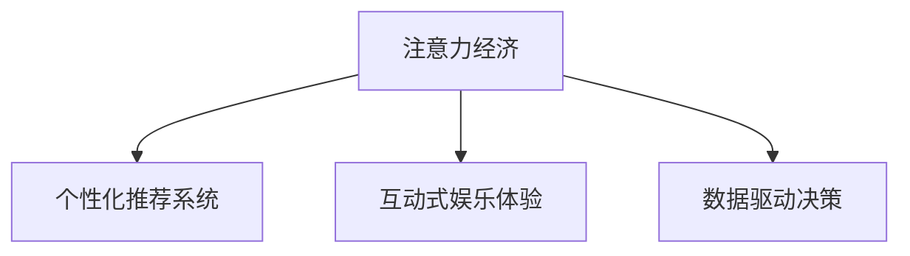

                 

# 电影产业在注意力经济中的新策略

## 1. 背景介绍

### 1.1 问题由来
随着互联网和数字技术的飞速发展，信息爆炸、注意力稀缺成为常态。内容消费者面临着大量信息流冲击，注意力被不断分散。在此背景下，传统的电影产业面临着前所未有的挑战。

1. **传统电影产业的困境**：传统电影通过影院放映、电视播放等形式传递给受众，然而由于信息过载、注意力分散，以及观众对娱乐内容的高度挑剔，传统的单一传播渠道难以有效吸引观众注意力。

2. **注意力经济的新需求**：现代社会对高效信息获取和互动体验的追求，使得传统影视娱乐内容生产与消费模式亟需变革。

### 1.2 问题核心关键点
电影产业在注意力经济中面临的核心问题，主要包括：

- 如何利用新兴技术获取和保持观众的注意力？
- 如何通过个性化推荐、互动式体验，提升内容消费的满足感和粘性？
- 如何通过数据驱动决策，优化内容生产与传播策略？

### 1.3 问题研究意义
研究电影产业在注意力经济中的应用策略，对于提升影视内容的影响力、拓展内容消费新场景、实现产业数字化转型具有重要意义：

1. 提升内容吸引力：通过精准的注意力获取和分析，生产更具吸引力的内容，吸引更多观众，扩大市场影响力。
2. 增强用户体验：通过个性化推荐、互动式体验，提供符合观众期待的内容消费体验，增强用户黏性。
3. 优化运营决策：通过大数据分析，优化内容生产、投放和消费策略，提升产业运营效率和效益。

## 2. 核心概念与联系

### 2.1 核心概念概述

本节将介绍几个密切相关的核心概念：

- **注意力经济(Attention Economy)**：信息时代中，由于注意力资源稀缺，信息生产者通过争夺用户注意力获取经济效益，而消费者通过注意力分配来获取信息和娱乐内容。
- **个性化推荐系统**：基于用户行为数据和模型，为用户推荐感兴趣的内容，提升用户体验和消费粘性。
- **互动式娱乐体验**：通过增强现实(AR)、虚拟现实(VR)、混合现实(MR)等技术，为用户提供沉浸式的娱乐体验，增强用户互动。
- **数据驱动决策**：通过数据挖掘和分析，指导内容生产与传播策略，优化产业运营效率。

这些概念之间的逻辑关系可以通过以下Mermaid流程图来展示：



这个流程图展示了注意力经济对其他三个概念的作用，通过个性化的推荐、互动的体验以及数据驱动的决策，共同提升内容消费的效率和质量。

## 3. 核心算法原理 & 具体操作步骤
### 3.1 算法原理概述

电影产业在注意力经济中的新策略，主要依托于个性化推荐系统、互动式娱乐体验和数据驱动决策三个核心技术。以下是这些技术的算法原理概述：

1. **个性化推荐系统**：基于协同过滤、内容推荐、混合推荐等算法，分析用户行为数据和内容属性数据，为用户推荐个性化内容。

2. **互动式娱乐体验**：利用增强现实(AR)、虚拟现实(VR)、混合现实(MR)等技术，提供沉浸式互动体验，增强用户的情感参与度和体验深度。

3. **数据驱动决策**：通过数据挖掘、分析等技术，优化内容生产与传播策略，提升产业运营效率和效益。

### 3.2 算法步骤详解

以个性化推荐系统为例，其算法步骤包括：

1. **数据收集**：收集用户行为数据（如浏览、点击、评价、分享等）和内容属性数据（如标题、类别、标签等）。

2. **用户建模**：利用协同过滤、用户-物品相似度等算法，构建用户兴趣模型。

3. **物品建模**：利用内容推荐、物品属性等算法，构建物品特征模型。

4. **相似度计算**：计算用户和物品之间的相似度，生成推荐列表。

5. **推荐优化**：结合用户反馈和推荐效果，不断优化推荐算法，提升推荐准确性。

### 3.3 算法优缺点

个性化推荐系统的优点包括：

1. 提高用户体验：通过个性化推荐，用户能够快速找到感兴趣的内容，提升用户体验。
2. 提升内容消费效率：推荐系统能够帮助用户发现隐藏在大量信息中的高质量内容，提高消费效率。
3. 精准营销：通过精准推荐，内容生产商可以更有效地进行营销推广。

缺点包括：

1. 数据隐私问题：用户行为数据的收集和使用可能涉及隐私问题。
2. 推荐冷启动问题：新用户和未覆盖内容的推荐难度较大。
3. 算法偏见问题：推荐算法可能存在偏差，影响推荐公平性。

### 3.4 算法应用领域

个性化推荐系统不仅应用于电影产业，还广泛用于电子商务、社交网络、在线教育等领域。其核心算法在电影产业中的应用场景包括：

1. 电影推荐：为用户推荐适合其兴趣和观影历史的影片。
2. 演员推荐：基于用户对某演员的好评推荐相关演员的影片。
3. 导演推荐：根据用户喜欢的导演，推荐其他导演的影片。

## 4. 数学模型和公式 & 详细讲解 & 举例说明

### 4.1 数学模型构建

个性化推荐系统通常使用协同过滤、内容推荐和混合推荐等模型进行用户和物品的匹配。以下是其中几个常见的数学模型：

- **协同过滤模型**：基于用户-物品相似度计算推荐，公式为：
  $$
  \hat{y} = \mathbf{U}\mathbf{V}^T
  $$
  其中 $\mathbf{U}$ 为用户兴趣矩阵，$\mathbf{V}$ 为物品特征矩阵。

- **内容推荐模型**：基于物品属性和用户属性计算推荐，公式为：
  $$
  \hat{y} = \mathbf{A}^T\mathbf{P}
  $$
  其中 $\mathbf{A}$ 为物品属性矩阵，$\mathbf{P}$ 为用户属性矩阵。

- **混合推荐模型**：结合协同过滤和内容推荐，计算推荐，公式为：
  $$
  \hat{y} = \alpha(\mathbf{U}\mathbf{V}^T) + (1-\alpha)(\mathbf{A}^T\mathbf{P})
  $$

### 4.2 公式推导过程

对于协同过滤模型，其推导过程如下：

1. 构建用户兴趣矩阵 $\mathbf{U} \in \mathbb{R}^{N \times K}$，其中 $N$ 为用户数，$K$ 为物品数。
2. 构建物品特征矩阵 $\mathbf{V} \in \mathbb{R}^{K \times M}$，其中 $M$ 为物品属性数。
3. 计算用户-物品相似度矩阵 $\mathbf{S} \in \mathbb{R}^{N \times K}$，公式为：
   $$
   \mathbf{S} = \mathbf{U}\mathbf{V}^T
   $$
4. 对用户 $i$ 推荐物品 $j$，计算预测值 $\hat{y}_{ij}$，公式为：
   $$
   \hat{y}_{ij} = \mathbf{s}_i^T\mathbf{v}_j
   $$
   其中 $\mathbf{s}_i$ 为第 $i$ 个用户的相似度向量，$\mathbf{v}_j$ 为物品 $j$ 的特征向量。

### 4.3 案例分析与讲解

以Netflix推荐系统为例，Netflix通过收集用户观看记录，构建用户兴趣矩阵 $\mathbf{U}$ 和物品特征矩阵 $\mathbf{V}$。基于协同过滤模型，计算用户-物品相似度矩阵 $\mathbf{S}$，并结合用户评分数据，优化推荐算法。

Netflix的推荐系统在用户和物品之间建立了强关联，通过深度学习和协同过滤的结合，实现了高效的个性化推荐。Netflix的成功案例展示了个性化推荐系统在实际应用中的巨大潜力。

## 5. 项目实践：代码实例和详细解释说明
### 5.1 开发环境搭建

要实现一个简单的个性化推荐系统，需要安装Python、NumPy、SciPy等基础库，以及pandas、scikit-learn等数据处理和机器学习库。

```bash
pip install numpy scipy pandas scikit-learn
```

### 5.2 源代码详细实现

以下是一个简单的协同过滤推荐系统代码示例：

```python
import numpy as np
from sklearn.metrics.pairwise import cosine_similarity

# 构建用户兴趣矩阵 U
U = np.random.rand(1000, 10)

# 构建物品特征矩阵 V
V = np.random.rand(10, 100)

# 计算用户-物品相似度矩阵 S
S = np.dot(U, V.T)

# 计算推荐列表
def recommend(user_id):
    user_vector = S[user_id, :]
    recom_list = cosine_similarity(user_vector.reshape(1, -1), S.T)
    return np.argsort(recom_list)[-10:]
```

该代码实现了一个简单的协同过滤推荐系统，通过计算用户-物品相似度矩阵 $\mathbf{S}$，生成推荐列表。用户输入ID，返回推荐的物品ID列表。

### 5.3 代码解读与分析

**协同过滤推荐系统**：

- **用户兴趣矩阵**：$\mathbf{U}$ 用于表示用户的兴趣向量。
- **物品特征矩阵**：$\mathbf{V}$ 用于表示物品的特征向量。
- **相似度矩阵**：$\mathbf{S}$ 用于计算用户和物品之间的相似度。
- **推荐列表**：利用相似度矩阵，生成推荐列表，并返回排序后的物品ID列表。

**代码实现细节**：

- **用户兴趣矩阵**：随机生成1000个用户，每个用户10个兴趣点。
- **物品特征矩阵**：随机生成10个物品，每个物品100个特征点。
- **相似度矩阵**：计算用户-物品相似度矩阵 $\mathbf{S}$。
- **推荐列表**：利用相似度矩阵计算推荐列表，返回前10个推荐物品ID。

## 6. 实际应用场景

### 6.1 智能推荐系统

智能推荐系统已经成为电影产业不可或缺的一部分。Netflix、Amazon等平台通过个性化推荐系统，大幅提升用户体验，提高内容消费效率。

1. **个性化推荐**：通过用户行为数据和物品属性数据，为用户推荐感兴趣的电影和电视剧。
2. **即时反馈**：利用用户反馈数据，实时优化推荐算法，提升推荐准确性。

### 6.2 互动式娱乐体验

增强现实(AR)、虚拟现实(VR)、混合现实(MR)等技术，为电影产业带来了沉浸式互动体验，增加了用户的参与度和体验感。

1. **互动式电影**：通过AR技术，让用户参与电影剧情，增强沉浸感。
2. **虚拟试镜**：利用VR技术，进行虚拟试镜，提升试镜效率。
3. **混合现实游戏**：结合AR和VR技术，创建混合现实游戏，增加游戏互动性。

### 6.3 数据驱动决策

数据驱动决策在电影产业中的应用，主要体现在内容生产、市场分析、运营管理等方面。

1. **内容生产**：通过分析用户行为数据和市场趋势，优化内容制作策略。
2. **市场分析**：利用用户反馈数据和市场调查数据，分析市场需求和用户偏好。
3. **运营管理**：通过实时监控数据，优化电影投放策略，提升票房收益。

## 7. 工具和资源推荐
### 7.1 学习资源推荐

为了帮助开发者系统掌握电影产业在注意力经济中的应用策略，这里推荐一些优质的学习资源：

1. **Coursera《数据科学》课程**：由斯坦福大学开设，涵盖数据科学基础、机器学习、深度学习等内容，适合初学者和进阶开发者。

2. **Kaggle竞赛平台**：提供大量数据集和竞赛，帮助开发者实战练手，提升数据处理和模型优化能力。

3. **Google AI Blog**：谷歌AI团队撰写的技术博客，分享最新的深度学习、自然语言处理、计算机视觉等领域的研究进展和应用案例。

4. **PyTorch官方文档**：PyTorch作为深度学习框架，提供了丰富的预训练模型和教程，适合进行个性化推荐系统的开发和优化。

5. **TensorFlow官方文档**：TensorFlow是谷歌开源的深度学习框架，提供大量预训练模型和优化算法，适合进行模型训练和推理。

### 7.2 开发工具推荐

高效的开发离不开优秀的工具支持。以下是几款用于电影产业个性化推荐系统开发的常用工具：

1. **Python**：简单易学的编程语言，拥有丰富的第三方库和框架。
2. **NumPy**：高性能的数值计算库，支持高效的矩阵运算。
3. **SciPy**：科学计算库，支持优化、统计分析、信号处理等功能。
4. **pandas**：数据分析库，支持数据清洗、数据处理和数据分析。
5. **scikit-learn**：机器学习库，提供多种推荐算法和模型评估工具。
6. **TensorFlow**：谷歌开源的深度学习框架，适合进行大规模机器学习模型训练。

合理利用这些工具，可以显著提升电影产业个性化推荐系统的开发效率，加快创新迭代的步伐。

### 7.3 相关论文推荐

电影产业在注意力经济中的应用策略涉及多个领域，推荐阅读以下几篇相关论文：

1. **《A Survey on Recommendation Systems》**：总结了推荐系统的历史、技术和应用，是了解推荐系统的经典入门读物。

2. **《Practical Recommendation Systems》**：介绍了推荐系统的实际应用案例，帮助理解推荐系统在实际场景中的运用。

3. **《Deep Learning for Recommendation Systems》**：介绍了深度学习在推荐系统中的应用，包括协同过滤、内容推荐、混合推荐等算法。

4. **《Natural Language Processing with Transformers》**：介绍Transformer模型在推荐系统中的应用，特别是基于深度学习的推荐系统。

5. **《Attention Mechanism in Recommendation Systems》**：介绍注意力机制在推荐系统中的应用，提升了推荐系统的效果和灵活性。

这些论文代表了大语言模型微调技术的发展脉络。通过学习这些前沿成果，可以帮助研究者把握学科前进方向，激发更多的创新灵感。

## 8. 总结：未来发展趋势与挑战

### 8.1 总结

本文对电影产业在注意力经济中的应用策略进行了全面系统的介绍。首先阐述了注意力经济对电影产业的挑战和机遇，明确了个性化推荐系统、互动式娱乐体验和数据驱动决策在电影产业中的核心作用。其次，从原理到实践，详细讲解了个性化推荐系统的算法原理和具体操作步骤，给出了完整的代码实例。同时，本文还广泛探讨了互动式娱乐体验和数据驱动决策在电影产业中的应用前景，展示了注意力经济对影视内容消费的深远影响。此外，本文精选了学习资源，力求为读者提供全方位的技术指引。

通过本文的系统梳理，可以看到，基于注意力经济的影视内容消费模式正在迎来新的变革，个性化推荐系统、互动式娱乐体验和数据驱动决策正在成为电影产业数字化转型的重要驱动力。未来，伴随深度学习、增强现实、虚拟现实等技术的进一步发展，电影产业将展现出更加丰富多彩、沉浸式的内容消费形态。

### 8.2 未来发展趋势

展望未来，电影产业在注意力经济中的应用策略将呈现以下几个发展趋势：

1. **个性化推荐系统的普及**：随着推荐算法和模型的不断优化，个性化推荐系统将广泛应用到电影产业的各个环节，提升内容消费的效率和满意度。

2. **互动式娱乐体验的拓展**：增强现实(AR)、虚拟现实(VR)、混合现实(MR)等技术，将为电影产业带来沉浸式互动体验，增强用户的情感参与度和体验感。

3. **数据驱动决策的深化**：通过大数据分析和人工智能技术，优化内容生产与传播策略，提升产业运营效率和效益。

4. **智能分析工具的开发**：开发智能化的内容分析工具，帮助内容生产商更好地理解和预测市场趋势，优化内容制作和投放策略。

5. **跨界融合的探索**：电影产业与其他行业（如游戏、旅游、教育等）的跨界融合，将带来新的应用场景和增长点。

以上趋势凸显了电影产业在注意力经济中的应用潜力，这些方向的探索发展，将进一步推动影视内容消费模式的创新和产业的数字化转型。

### 8.3 面临的挑战

尽管电影产业在注意力经济中的应用策略取得了显著成效，但在迈向更加智能化、普适化应用的过程中，仍面临诸多挑战：

1. **数据隐私问题**：用户行为数据的收集和使用可能涉及隐私问题，如何保护用户数据隐私，将是一大难题。
2. **推荐算法偏见**：推荐算法可能存在偏差，影响推荐公平性，如何消除算法偏见，确保推荐公正性，仍需深入研究。
3. **计算资源消耗**：大规模数据处理和模型训练需要大量计算资源，如何提高系统效率，降低计算成本，仍需优化。
4. **用户接受度**：新型的娱乐体验和推荐策略可能需要用户接受和适应，如何提升用户接受度，推广新技术，仍需努力。
5. **跨领域整合**：跨行业的应用需要多领域的协同合作，如何实现跨领域的无缝整合，仍需协调和优化。

### 8.4 研究展望

面向未来，电影产业在注意力经济中的应用策略需要在以下几个方面进行深入研究：

1. **隐私保护技术**：研究基于隐私保护的推荐算法和数据处理方法，保护用户数据隐私。

2. **公平性算法**：开发公平性友好的推荐算法，消除算法偏见，确保推荐公正性。

3. **计算效率优化**：探索高效的数据处理和模型训练方法，提高系统效率，降低计算成本。

4. **用户体验优化**：通过交互设计和技术优化，提升用户体验和接受度，推广新型娱乐体验和推荐策略。

5. **跨界融合探索**：加强跨行业合作，探索跨领域的协同创新应用，拓展电影产业的应用场景。

这些研究方向的研究突破，将为电影产业在注意力经济中的应用策略提供新的动力，推动影视内容消费模式的创新和产业的数字化转型。总之，电影产业在注意力经济中的新策略需要多方协同发力，才能在未来的竞争中保持领先地位。

## 9. 附录：常见问题与解答

**Q1：电影产业在注意力经济中的应用策略是否适用于其他行业？**

A: 是的，个性化推荐系统、互动式娱乐体验和数据驱动决策等策略，不仅可以应用于电影产业，还适用于电子商务、社交网络、在线教育等多个领域。不同行业可以根据自身特点，进行有针对性的应用和优化。

**Q2：如何平衡用户隐私保护与个性化推荐的需求？**

A: 在数据收集和处理过程中，需要严格遵守数据隐私保护法规，如GDPR等。采用匿名化处理、差分隐私等技术，保护用户隐私。同时，可以通过差分隐私算法等技术，在不影响隐私的前提下，提升推荐系统的准确性和用户满意度。

**Q3：推荐算法是否会导致信息茧房？**

A: 推荐算法可能导致信息茧房问题，即用户陷入固定的信息圈中，难以接触到多样化内容。通过引入多样性推荐机制，如协同过滤、多目标优化等，可以缓解这一问题。同时，需要定期调整推荐策略，保持内容的多样性和新鲜度。

**Q4：数据驱动决策在实际应用中面临哪些挑战？**

A: 数据驱动决策在实际应用中面临以下挑战：
1. 数据质量和完整性问题：数据收集和处理过程中可能存在数据缺失、错误等问题，影响决策结果。
2. 数据隐私和安全问题：数据收集和存储过程中可能存在数据泄露、滥用等问题，影响决策的公正性和可信度。
3. 数据量和复杂性问题：大规模数据处理和模型训练需要大量计算资源，影响决策的实时性和效率。

这些挑战需要通过技术手段和管理措施进行优化，才能实现数据驱动决策在实际应用中的效果。

**Q5：如何评估推荐系统的效果？**

A: 推荐系统的效果评估可以从多个维度进行：
1. 准确性：通过评估推荐列表的准确性和召回率等指标，衡量推荐系统的准确性。
2. 用户满意度：通过用户满意度调查、用户行为数据等，评估推荐系统的用户满意度。
3. 用户粘性：通过用户停留时间、复购率等指标，衡量推荐系统的用户粘性。

这些评估指标可以帮助开发者全面了解推荐系统的效果，并进行持续优化。

