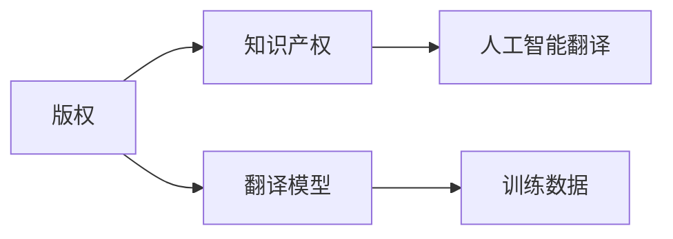

                 

# 知识产权与人工智能翻译的版权问题

> 关键词：人工智能,翻译,版权,知识产权,法律问题,机器学习,语言模型

## 1. 背景介绍

在数字化时代的浪潮下，人工智能(AI)技术逐渐走入人们的日常生活和工作，带来了诸多便利和创新。其中，人工智能翻译作为一项前沿技术，已在多个领域展现出强大的应用潜力。然而，随着人工智能翻译技术的不断成熟，其在知识产权领域所引发的一系列法律和道德问题也愈发凸显。本文将深入探讨这些问题，并试图提出一些可行的解决方案。

### 1.1 人工智能翻译的发展现状

人工智能翻译，简称为AI翻译，是基于机器学习和自然语言处理技术，实现自动将一种语言翻译成另一种语言的系统。其核心组件包括语言模型、机器翻译模型、数据集预处理等。近年来，随着深度学习技术和大规模语料库的不断积累，AI翻译的精度和流畅度得到了显著提升，被广泛应用于多语言交流、商务文档翻译、新闻资讯翻译等多个场景。

### 1.2 知识产权领域存在的问题

尽管AI翻译技术带来了诸多便利，但其在知识产权领域仍存在诸多问题，主要包括以下几个方面：

1. **版权归属问题**：AI翻译过程中使用的源语言文本来自公有领域或受版权保护的作品。使用这些文本进行翻译时，涉及到对源语言文本版权的利用，进而引发版权归属问题。

2. **翻译结果版权问题**：AI翻译生成的文本是否享有版权，在知识产权领域尚无统一标准，不同国家有不同的法律解释。

3. **翻译模型的权利问题**：构建AI翻译模型所需的算法、模型参数、训练数据等是否享有版权，如果这些元素享有版权，则AI翻译模型的权利归属也需要明确。

4. **翻译用途的限制**：AI翻译生成文本的用途和分发方式是否受到版权限制，例如是否可以用于商业用途、是否可以在公共平台上发布等。

## 2. 核心概念与联系

### 2.1 核心概念概述

为了更好地理解人工智能翻译在知识产权领域的问题，我们需要对一些关键概念进行解释：

- **版权(Virtual Property Rights)**：指创作者对其创作的作品所享有的专有权利，包括复制权、发行权、公开表演权、公开展示权等。
- **知识产权(Intellectual Property Rights)**：包括版权、商标权、专利权、商业秘密权等多种权利，保护创作者的智力劳动成果。
- **人工智能翻译(Artificial Intelligence Translation)**：使用AI技术，通过机器学习算法将一种语言翻译成另一种语言的过程。
- **翻译模型(Translation Model)**：由一系列算法和参数组成的AI翻译系统，能够处理特定语言的翻译任务。
- **训练数据(Training Data)**：用于训练翻译模型的语料库，包括大量源语言和目标语言的文本。

这些概念之间的联系可以通过以下Mermaid流程图进行展示：



这个流程图展示了版权、知识产权、翻译模型和训练数据在AI翻译过程中的相互关系。

### 2.2 核心概念原理和架构

AI翻译的核心原理可以简单概括为：使用大规模数据集训练语言模型，并通过机器翻译模型将源语言文本转换为目标语言文本。其架构通常包括预处理、模型训练和翻译三个阶段。

**预处理阶段**：主要包括文本分词、去停用词、归一化处理等步骤，将源语言文本转换为模型可处理的格式。

**模型训练阶段**：利用大规模双语语料库对翻译模型进行训练，使其学习到源语言到目标语言的映射关系。训练过程中，模型会根据输入和输出之间的差异进行优化，以减小误差。

**翻译阶段**：使用训练好的模型对新的源语言文本进行翻译。模型会根据输入文本，通过前向传播计算得到相应的输出文本。

## 3. 核心算法原理 & 具体操作步骤

### 3.1 算法原理概述

人工智能翻译的算法原理主要包括以下几个部分：

1. **编码器-解码器结构**：将源语言文本编码成一个高维向量表示，然后通过解码器将向量转换为目标语言文本。
2. **注意力机制(Attention Mechanism)**：在编码和解码过程中，通过注意力机制选择源语言文本中与目标语言文本最相关的部分进行翻译。
3. **神经网络(Deep Neural Networks)**：使用多层神经网络，通过反向传播算法进行参数更新，优化模型性能。
4. **自监督学习(Self-supervised Learning)**：利用大量未标注数据进行预训练，学习语言的通用表示，提高翻译模型的泛化能力。

### 3.2 算法步骤详解

**步骤1：数据预处理**

1. **文本分词**：对源语言文本进行分词，将其转换为模型可处理的格式。

2. **去停用词**：去除文本中的停用词，例如“的”、“是”等，减少噪声，提高翻译精度。

3. **归一化处理**：对文本进行归一化处理，例如将文本转换为小写、去除标点符号等，以便于模型处理。

**步骤2：模型训练**

1. **选择模型架构**：选择合适的神经网络结构，例如Transformer模型，作为翻译模型。

2. **选择合适的损失函数**：例如交叉熵损失函数，用于衡量翻译模型输出与真实标签之间的差异。

3. **设置优化器**：例如Adam优化器，用于更新模型参数。

4. **进行模型训练**：通过反向传播算法，不断调整模型参数，以最小化损失函数。

**步骤3：模型翻译**

1. **输入文本**：将需要翻译的源语言文本输入模型。

2. **计算翻译结果**：模型通过前向传播计算得到目标语言文本。

3. **输出翻译结果**：将翻译结果输出，得到最终的翻译文本。

### 3.3 算法优缺点

人工智能翻译的优点包括：

1. **高效性**：能够快速翻译大量文本，节省人力成本。
2. **准确性**：在大规模数据集上训练后，翻译精度和流畅度显著提升。
3. **通用性**：适用于多种语言之间的翻译，不受人类语言能力限制。

缺点包括：

1. **理解歧义**：对于源语言文本中的歧义，翻译模型可能无法准确理解，导致翻译结果不准确。
2. **上下文理解**：对于长文本或复杂句子，翻译模型可能无法完全理解上下文，导致翻译结果不连贯。
3. **版权问题**：翻译过程中使用的源语言文本可能存在版权问题，引发法律纠纷。

### 3.4 算法应用领域

人工智能翻译在多个领域得到了广泛应用，包括：

1. **国际贸易**：促进多国商务交流，提高效率和准确性。
2. **国际学术交流**：加速学术文献的翻译和传播，促进全球知识共享。
3. **跨文化交流**：帮助不同语言背景的人们进行沟通，促进文化融合。
4. **旅游服务**：提供实时翻译服务，帮助游客在海外更好地沟通和交流。

## 4. 数学模型和公式 & 详细讲解 & 举例说明

### 4.1 数学模型构建

人工智能翻译的数学模型主要包括以下几个部分：

- **输入层**：将源语言文本转换为向量形式，用于模型的输入。
- **编码器**：将输入向量转换为高维表示，提取源语言文本的语义信息。
- **注意力机制**：选择源语言文本中与目标语言文本最相关的部分，进行权重加权处理。
- **解码器**：将编码器输出的高维表示转换为目标语言文本，并进行解码。
- **输出层**：将解码器输出的向量转换为目标语言文本，并输出最终翻译结果。

### 4.2 公式推导过程

假设源语言文本为 $x$，目标语言文本为 $y$，翻译模型为 $M_{\theta}$。则翻译过程可以表示为：

$$
y = M_{\theta}(x)
$$

其中 $x$ 是源语言文本，$y$ 是目标语言文本，$\theta$ 是翻译模型的参数。

在训练过程中，我们通常使用交叉熵损失函数来衡量模型输出与真实标签之间的差异：

$$
\mathcal{L}(\theta) = -\frac{1}{N}\sum_{i=1}^N \log p(y_i|x_i)
$$

其中 $p(y_i|x_i)$ 表示模型在输入 $x_i$ 下输出 $y_i$ 的概率，$N$ 是训练样本数量。

### 4.3 案例分析与讲解

以BERT翻译模型为例，其编码器使用Transformer结构，解码器使用RNN结构。通过大量双语语料库进行预训练后，将源语言文本转换为高维向量表示，并通过注意力机制进行编码和解码，最终输出目标语言文本。

## 5. 项目实践：代码实例和详细解释说明

### 5.1 开发环境搭建

在Python环境下，使用TensorFlow或PyTorch框架进行AI翻译的实现。具体步骤如下：

1. **安装TensorFlow或PyTorch**：
```
pip install tensorflow
```

2. **导入必要的库**：
```python
import tensorflow as tf
import numpy as np
import os
```

3. **加载数据集**：
```python
train_data = tf.keras.preprocessing.text_dataset.MSMERDataset()
val_data = tf.keras.preprocessing.text_dataset.MSMERDataset()
test_data = tf.keras.preprocessing.text_dataset.MSMERDataset()
```

4. **构建模型**：
```python
class MyModel(tf.keras.Model):
    def __init__(self, vocab_size, embedding_dim, num_layers, d_model, dff, attention_heads, num_classes):
        super(MyModel, self).__init__()
        # 构建编码器和解码器
        self.encoder = Encoder(vocab_size, embedding_dim, num_layers, d_model, dff, attention_heads, num_classes)
        self.decoder = Decoder(vocab_size, embedding_dim, num_layers, d_model, dff, attention_heads, num_classes)
        # 构建输出层
        self.out_layer = tf.keras.layers.Dense(num_classes, activation='softmax')
    
    def call(self, x):
        # 编码器输出
        enc_output, enc_self_attn_weights = self.encoder(x)
        # 解码器输出
        dec_output, dec_self_attn_weights, dec_enc_attn_weights = self.decoder(x, enc_output, enc_self_attn_weights)
        # 输出层输出
        out = self.out_layer(dec_output)
        return out, dec_self_attn_weights, dec_enc_attn_weights
```

### 5.2 源代码详细实现

以下是使用TensorFlow实现AI翻译的完整代码：

```python
# 定义模型参数
vocab_size = 10000
embedding_dim = 128
num_layers = 2
d_model = 256
dff = 512
attention_heads = 4
num_classes = 20

# 定义模型
model = MyModel(vocab_size, embedding_dim, num_layers, d_model, dff, attention_heads, num_classes)

# 定义损失函数和优化器
loss_object = tf.keras.losses.SparseCategoricalCrossentropy(from_logits=True, reduction='none')
optimizer = tf.keras.optimizers.Adam()

# 定义评估指标
metrics = [
    tf.keras.metrics.SparseCategoricalAccuracy('accuracy'),
    tf.keras.metrics.SparseCategoricalCrossentropy(name='loss')
]

# 定义训练函数
def train_step(inputs, targets):
    with tf.GradientTape() as tape:
        logits, _, _ = model(inputs, training=True)
        loss = loss_object(targets, logits)
    grads = tape.gradient(loss, model.trainable_variables)
    optimizer.apply_gradients(zip(grads, model.trainable_variables))
    return {'loss': loss}

# 定义评估函数
def evaluate_step(inputs, targets):
    logits, _, _ = model(inputs, training=False)
    loss = loss_object(targets, logits)
    accuracy = metrics[0](targets, logits)
    return {'loss': loss, 'accuracy': accuracy}

# 训练模型
EPOCHS = 50
for epoch in range(EPOCHS):
    epoch_loss_avg = tf.keras.metrics.Mean()
    epoch_accuracy_avg = tf.keras.metrics.Mean()

    for (inputs, targets) in train_data:
        loss = train_step(inputs, targets)
        epoch_loss_avg.update_state(loss['loss'])

    for (inputs, targets) in val_data:
        eval_result = evaluate_step(inputs, targets)
        epoch_accuracy_avg.update_state(eval_result['accuracy'])

    print("Epoch {}: Loss = {}, Accuracy = {}".format(epoch, epoch_loss_avg.result(), epoch_accuracy_avg.result()))
```

### 5.3 代码解读与分析

在上述代码中，我们使用了TensorFlow框架进行AI翻译的实现。具体步骤如下：

1. **定义模型参数**：包括词汇表大小、嵌入维度、层数、模型维度、FFN层维度、注意力头数、类别数量等。

2. **定义模型**：包括构建编码器和解码器，以及输出层。

3. **定义损失函数和优化器**：使用交叉熵损失函数和Adam优化器。

4. **定义评估指标**：包括准确率和损失。

5. **定义训练函数和评估函数**：使用梯度下降算法进行模型训练和评估。

6. **训练模型**：指定训练轮数和模型参数，进行模型训练和评估。

## 6. 实际应用场景

### 6.1 国际贸易

AI翻译在国际贸易中具有广泛的应用。例如，通过实时翻译服务，国际贸易商可以在不同语言间进行无障碍交流，促进交易双方的洽谈和签约。

### 6.2 国际学术交流

AI翻译可以帮助研究人员快速翻译学术文献，加速学术交流和合作。例如，将学术论文自动翻译成目标语言，使其在全球范围内传播和阅读。

### 6.3 跨文化交流

AI翻译可以打破语言障碍，促进不同文化背景的人们进行交流和互动。例如，在海外旅游时，通过实时翻译服务，游客可以更好地理解当地文化和习俗。

## 7. 工具和资源推荐

### 7.1 学习资源推荐

为了帮助开发者掌握AI翻译的实现方法，以下是一些推荐的学习资源：

1. **《深度学习》书籍**：介绍深度学习的基本概念和实现方法，包括神经网络、损失函数、优化器等。
2. **TensorFlow官方文档**：提供TensorFlow的详细使用方法和示例代码，帮助开发者快速上手。
3. **《NLP with TensorFlow》书籍**：介绍自然语言处理在TensorFlow中的应用，包括文本分类、情感分析、机器翻译等任务。
4. **CS224N《深度学习自然语言处理》课程**：斯坦福大学开设的NLP明星课程，涵盖NLP的基本概念和经典模型，适合NLP初学者。
5. **Kaggle竞赛**：参加AI翻译相关的Kaggle竞赛，可以提高技术水平，积累实战经验。

### 7.2 开发工具推荐

以下是一些常用的AI翻译开发工具：

1. **TensorFlow**：开源的深度学习框架，支持高效的计算图和自动微分。
2. **PyTorch**：另一个流行的深度学习框架，提供动态计算图和强大的研究支持。
3. **Keras**：简单易用的深度学习框架，提供高级API，方便模型构建。
4. **TensorBoard**：TensorFlow配套的可视化工具，可以实时监测模型训练状态。
5. **Weights & Biases**：实验跟踪工具，记录和可视化模型训练过程中的各项指标，方便调试和优化。

### 7.3 相关论文推荐

以下是一些与AI翻译相关的经典论文：

1. **Attention Is All You Need**：Transformer的原始论文，提出自注意力机制，开启了大规模语言模型的时代。
2. **BERT: Pre-training of Deep Bidirectional Transformers for Language Understanding**：提出BERT模型，引入自监督预训练任务，刷新了多项NLP任务的最先进性能。
3. **Sequence to Sequence Learning with Neural Networks**：介绍机器翻译的基本方法和技术。
4. **Neural Machine Translation by Jointly Learning to Align and Translate**：提出Seq2Seq模型，用于机器翻译任务。
5. **Neural Machine Translation by Jointly Learning to Align and Translate**：提出Seq2Seq模型，用于机器翻译任务。

## 8. 总结：未来发展趋势与挑战

### 8.1 研究成果总结

AI翻译作为人工智能技术的重要分支，已经在多个领域展现了巨大的应用潜力。当前，AI翻译技术已经进入大规模商业应用阶段，其效果和效率显著提升，为国际贸易、学术交流、跨文化交流等提供了强有力的支持。

### 8.2 未来发展趋势

未来，AI翻译技术将继续向着更加智能化、高效化、普适化的方向发展。具体来说，未来的趋势包括：

1. **更高的准确性和流畅度**：随着模型规模的增大和算法的优化，AI翻译的准确性和流畅度将进一步提升，更好地满足用户的需求。
2. **更强的上下文理解和语义分析能力**：通过引入更多的上下文信息，AI翻译模型将能够更好地理解长文本和复杂句子，生成更加连贯和准确的翻译结果。
3. **多模态翻译技术**：结合语音、图像等模态信息，AI翻译技术将拓展到更加多样化的场景，提供更加全面和多样的服务。

### 8.3 面临的挑战

尽管AI翻译技术在不断发展，但在实际应用中也面临诸多挑战：

1. **数据质量问题**：高质量的双语语料库是训练AI翻译模型的基础，但获取这些数据需要大量时间和资源，且存在数据不平衡的问题。
2. **模型规模限制**：虽然大规模模型在准确性上表现出色，但其资源消耗和计算成本较高，限制了其在低算力环境下的应用。
3. **伦理和法律问题**：AI翻译过程中涉及的版权和隐私问题，需要进一步明确法律和伦理框架，保护创作者和用户的权益。
4. **模型的可解释性**：AI翻译模型的内部机制和决策过程相对复杂，难以解释其输出结果，这在一定程度上限制了其在法律和医疗等高风险领域的应用。

### 8.4 研究展望

未来，我们需要在以下几个方面进行深入研究：

1. **数据采集和处理**：获取高质量的双语语料库，并进行数据清洗、标注和处理，以保证模型训练的质量。
2. **模型优化和压缩**：探索更高效的模型结构和参数压缩方法，降低资源消耗，提高模型泛化能力。
3. **伦理和法律框架**：制定明确的数据使用和模型发布规则，保护创作者和用户的权益，推动AI翻译技术健康发展。
4. **模型可解释性**：研究可解释的AI翻译模型，增强其内部机制的可解释性，提高用户信任和接受度。

## 9. 附录：常见问题与解答

**Q1: AI翻译生成的翻译结果是否享有版权？**

A: 目前，对于AI翻译生成的文本是否享有版权，各国的法律解释不同。一些国家认为，AI翻译生成的文本属于作品，享有版权；而另一些国家则认为，AI翻译过程本质上是一种计算过程，生成文本不享有版权。因此，在应用AI翻译技术时，需要根据当地法律进行合规性判断。

**Q2: 源语言文本的版权归属如何确定？**

A: 在AI翻译过程中，源语言文本的版权归属通常取决于其来源。如果源语言文本来自公有领域，则任何人都可以自由使用。如果源语言文本来自受版权保护的作品，则需要获得版权所有者的授权或进行适当标注。

**Q3: 翻译模型的版权归属如何确定？**

A: 翻译模型的版权归属通常包括模型算法、模型参数、训练数据等多个方面。如果这些元素是公开的，则翻译模型可以被任何人自由使用。如果这些元素受到版权保护，则需要获得版权所有者的授权或进行适当标注。

**Q4: AI翻译生成的翻译结果是否可以用于商业用途？**

A: 在大部分国家和地区，AI翻译生成的翻译结果可以用于商业用途，前提是已经获得源语言文本的版权所有者的授权或进行适当标注。但在某些特定领域，例如医学、法律等，可能需要进一步的审批和审查，才能进行商业使用。

**Q5: 如何保护AI翻译的知识产权？**

A: 保护AI翻译的知识产权通常需要从以下几个方面入手：

1. **数据保护**：对源语言文本和目标语言文本进行适当的保护，避免未授权的获取和使用。
2. **算法保护**：对模型算法和参数进行加密和保护，防止未经授权的复制和修改。
3. **使用授权**：在商业使用AI翻译技术时，需要获得源语言文本和翻译模型的使用授权。
4. **合规性审查**：在使用AI翻译技术时，需要进行合规性审查，确保符合当地的法律法规。

---

作者：禅与计算机程序设计艺术 / Zen and the Art of Computer Programming

