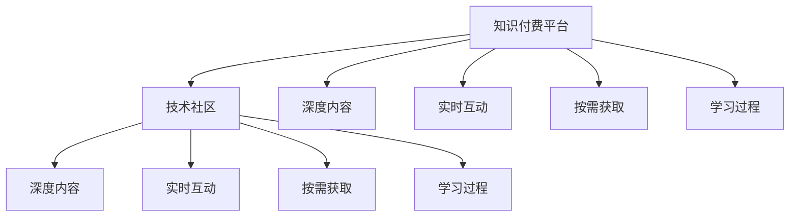

                 

## 1. 背景介绍

### 1.1 问题由来

随着互联网和技术的迅猛发展，知识付费和社区建设成为了两个备受关注的热点。知识付费依托于深度内容和专业导师，通过订阅模式为消费者提供个性化服务，帮助其解决特定问题。技术社区则汇集了众多技术人员和开发者，交流探讨技术问题，共享知识与经验。

知识付费与技术社区建设本应相辅相成，共同推动知识的传播与应用。然而，现实中，两者的互动并未得到有效利用，知识付费平台与技术社区之间存在信息孤岛，缺乏深度融合，导致资源错配、用户价值未能最大化。

### 1.2 问题核心关键点

当前，知识付费与技术社区建设面临以下核心问题：

1. **内容冗余与重复**：知识付费和社区建设中存在大量重复和冗余内容，用户获取的知识往往缺乏深度和系统性。
2. **交互不足**：知识付费和社区建设缺乏互动机制，用户获取的知识难以进行实证检验和个性化修正。
3. **价值未充分挖掘**：技术社区中丰富的实战经验和最佳实践未能有效转化为知识付费内容，导致用户支付的高质量内容不足。
4. **用户体验差异**：知识付费平台和社区建设的用户体验各不相同，用户在两种平台之间切换时面临不便。
5. **需求重叠与冲突**：用户对知识付费和社区建设的需求存在重叠和冲突，难以同时满足。

这些问题的存在，极大地限制了知识付费和社区建设的良性互动，无法充分发挥各自的优势，实现知识的最大价值化。

### 1.3 问题研究意义

解决知识付费与技术社区建设的良性互动问题，对于推动知识共享、提升用户体验、促进技术交流与合作具有重要意义：

1. **提高知识传播效率**：通过融合知识付费和社区建设，可以实现知识的深度传播，提高知识获取的效率和质量。
2. **增强用户互动体验**：融合互动机制，使知识获取过程更具互动性和参与性，提升用户满意度。
3. **优化资源配置**：将社区中丰富的实战经验和知识付费中的专业深度结合起来，实现资源的最优配置。
4. **促进跨领域合作**：融合知识付费与社区建设，可以打破行业界限，促进跨领域的知识共享与合作。

## 2. 核心概念与联系

### 2.1 核心概念概述

为更好地理解知识付费与技术社区建设的良性互动，本节将介绍几个密切相关的核心概念：

1. **知识付费平台**：通过订阅或按需购买方式，向用户提供深度内容、专业导师和个性化服务的平台。如Coursera、Udemy、得到等。

2. **技术社区**：汇聚技术开发者、从业人员、爱好者等，共同交流技术问题、共享知识和经验的平台。如Stack Overflow、GitHub、技术博客等。

3. **深度内容**：具有较高深度和系统性的知识，通常由专业导师或领域专家提供。如课程、讲座、书籍等。

4. **实时互动**：用户与内容创作者之间能够实时交流和互动，形成动态的知识更新和修正。

5. **按需获取**：用户可以根据自己的需求，按需购买或订阅相关知识内容，获得个性化服务。

6. **学习过程**：通过系统的学习过程，用户能够掌握专业知识和技能，提升职业素养和竞争力。

这些核心概念之间的逻辑关系可以通过以下Mermaid流程图来展示：



这个流程图展示的知识付费平台和技术社区的核心概念及其之间的关系：

1. 知识付费平台和技术社区都是知识传播的渠道，但服务形式和深度有所不同。
2. 深度内容、实时互动、按需获取和学习过程是知识付费和社区建设的共同要素。
3. 用户可以通过知识付费平台获取深度内容，并通过社区实时互动和获取按需服务，完成系统的学习过程。

这些核心概念共同构成了知识付费与技术社区建设的良性互动框架，有助于理清它们之间的联系和互动机制。

## 3. 核心算法原理 & 具体操作步骤
### 3.1 算法原理概述

知识付费与技术社区建设的良性互动，本质上是通过构建互动机制，将知识付费平台与技术社区深度融合，实现知识的有效传播和利用。其核心思想是：利用技术社区的实时互动和按需获取特性，结合知识付费平台的深度内容，构建系统的学习过程，增强用户的学习体验和知识掌握。

形式化地，假设知识付费平台提供深度内容 $C$，用户通过订阅或购买获得；技术社区提供实时互动机制 $I$，用户可以通过社区获得专家解答和问题解决。知识付费和技术社区的良性互动，可以抽象为：

$$
F_{interaction} = C \times I
$$

其中 $F_{interaction}$ 表示知识付费和技术社区良性互动的效果，$C$ 和 $I$ 分别表示知识付费和社区建设的两个关键要素。

通过优化 $C$ 和 $I$，可以最大化 $F_{interaction}$，实现知识的深度传播和高效利用。

### 3.2 算法步骤详解

知识付费与技术社区建设的良性互动，一般包括以下几个关键步骤：

**Step 1: 数据准备与分析**
- 收集知识付费平台和技术社区的用户数据，包括浏览记录、购买行为、互动数据等。
- 分析用户需求和行为，找出知识付费和技术社区中的内容重叠和差异。

**Step 2: 构建互动机制**
- 在知识付费平台引入技术社区的实时互动功能，如专家解答、社区讨论、问题反馈等。
- 在社区中加入知识付费的深度内容模块，如课程推荐、知识卡片、案例分析等。

**Step 3: 模型训练与优化**
- 根据用户行为数据，训练推荐模型，预测用户对知识付费和社区建设内容的偏好。
- 优化互动机制，调整专家解答、社区讨论和知识卡片的展示策略，提高用户参与度和满意度。

**Step 4: 互动效果评估**
- 收集用户对互动机制的反馈，分析其对知识获取和学习的实际效果。
- 根据用户行为数据，不断优化推荐模型和互动机制，提高知识传播的效率和质量。

**Step 5: 迭代改进**
- 定期更新知识付费和社区建设的内容，确保其与时俱进。
- 根据用户反馈和行为数据，不断迭代改进互动机制，提升用户体验和知识掌握。

### 3.3 算法优缺点

知识付费与技术社区建设的良性互动方法具有以下优点：
1. 深度融合：将知识付费的深度内容和社区的实时互动结合起来，实现知识的高效传播和利用。
2. 个性化推荐：通过推荐模型，精准预测用户需求，实现个性化内容的推荐。
3. 提升互动体验：通过互动机制，增强用户的学习体验和参与感，提高用户满意度。
4. 优化资源配置：将社区中的实战经验和知识付费中的专业深度结合起来，实现资源的最优配置。

同时，该方法也存在一定的局限性：
1. 数据隐私：用户数据涉及隐私，需严格遵守数据保护法规，确保用户隐私安全。
2. 技术复杂：算法和系统的设计和实现需要较高的技术门槛。
3. 效果评估：互动机制的效果评估需要大量用户数据，难以短期内见效。
4. 用户接受度：用户对互动机制的接受度不高，需持续优化用户体验。

尽管存在这些局限性，但就目前而言，知识付费与技术社区建设的良性互动方法仍是大数据和人工智能在知识传播领域的重要应用之一。未来相关研究的重点在于如何进一步降低技术门槛，提高数据隐私保护水平，同时兼顾用户的接受度和互动效果。

### 3.4 算法应用领域

知识付费与技术社区建设的良性互动方法，在多个领域得到了广泛的应用，例如：

1. **教育培训**：结合在线教育平台和社区，提供系统化、个性化、实时化的学习服务。如Coursera、Udacity等。

2. **技术支持**：通过社区和知识付费平台，提供实时问题解答和专家支持，解决技术难题。如Stack Overflow、GitHub等。

3. **职业培训**：结合在线培训课程和社区交流，提升职业素养和技能。如Udemy、LinkedIn Learning等。

4. **内容创作**：结合社区互动和知识付费，提高内容创作质量，促进知识传播。如Medium、知乎等。

5. **知识管理**：结合知识付费和社区，构建知识库和知识管理工具，实现知识的高效存储和检索。如Notion、Confluence等。

除了上述这些经典应用外，知识付费与技术社区建设的良性互动方法也在更多场景中得到创新性地应用，如可控内容生成、虚拟教室、协作开发等，为知识传播和应用提供了新的途径。

## 4. 数学模型和公式 & 详细讲解  
### 4.1 数学模型构建

本节将使用数学语言对知识付费与技术社区建设的良性互动进行更加严格的刻画。

记知识付费平台提供的内容为 $C$，社区建设的互动机制为 $I$。用户对内容 $C$ 的偏好为 $P(C)$，对互动机制 $I$ 的偏好为 $P(I)$。知识付费和技术社区的良性互动效果 $F_{interaction}$ 可以通过如下数学模型表示：

$$
F_{interaction} = \mathcal{A}(P(C), P(I))
$$

其中 $\mathcal{A}$ 表示知识付费和技术社区互动效果的评估函数，综合考虑用户对内容 $C$ 和互动机制 $I$ 的偏好。

### 4.2 公式推导过程

以下我们以推荐系统为例，推导知识付费平台与技术社区互动效果的计算公式。

假设知识付费平台中有 $m$ 个内容 $C_i$，社区中有 $n$ 个互动机制 $I_j$。用户对内容 $C_i$ 的偏好为 $p_{ci}$，对互动机制 $I_j$ 的偏好为 $p_{ij}$。知识付费和技术社区的良性互动效果 $F_{interaction}$ 可以通过加权平均公式计算：

$$
F_{interaction} = \frac{\sum_{i=1}^m \sum_{j=1}^n p_{ci} \times p_{ij} \times \text{Interact}_{ij}}{\sum_{i=1}^m \sum_{j=1}^n p_{ci} \times p_{ij}}
$$

其中 $\text{Interact}_{ij}$ 表示用户在使用社区互动机制 $I_j$ 时，对内容 $C_i$ 的互动程度。互动程度越高，$F_{interaction}$ 的值越大。

在得到互动效果的计算公式后，即可使用推荐算法（如协同过滤、基于内容的推荐等）计算用户的推荐内容，并结合社区互动机制，实现知识的深度传播和高效利用。

## 5. 项目实践：代码实例和详细解释说明
### 5.1 开发环境搭建

在进行知识付费与技术社区建设的良性互动实践前，我们需要准备好开发环境。以下是使用Python进行知识付费与社区互动系统的环境配置流程：

1. 安装Anaconda：从官网下载并安装Anaconda，用于创建独立的Python环境。

2. 创建并激活虚拟环境：
```bash
conda create -n kfcc_env python=3.8 
conda activate kfcc_env
```

3. 安装PyTorch：基于Python的开源深度学习框架，灵活动态的计算图，适合快速迭代研究。
```bash
conda install pytorch torchvision torchaudio cudatoolkit=11.1 -c pytorch -c conda-forge
```

4. 安装TensorFlow：由Google主导开发的开源深度学习框架，生产部署方便，适合大规模工程应用。同样有丰富的预训练语言模型资源。
```bash
conda install tensorflow
```

5. 安装Pandas、NumPy、Scikit-learn、Matplotlib、TQDM等工具包：
```bash
pip install pandas numpy scikit-learn matplotlib tqdm jupyter notebook ipython
```

完成上述步骤后，即可在`kfcc_env`环境中开始项目实践。

### 5.2 源代码详细实现

这里我们以一个简单的社区互动系统为例，给出使用PyTorch进行知识付费与社区互动的代码实现。

首先，定义用户和内容的基本信息类：

```python
class User:
    def __init__(self, id, name):
        self.id = id
        self.name = name

class Content:
    def __init__(self, id, name, category):
        self.id = id
        self.name = name
        self.category = category

# 示例数据
users = [User(1, 'Alice'), User(2, 'Bob'), User(3, 'Charlie')]
contents = [Content(1, '深度学习入门', '教育'), Content(2, 'Python编程实践', '教育'), Content(3, 'Git教程', '技术')]
```

然后，定义推荐系统模型和优化器：

```python
from transformers import BertTokenizer, BertForSequenceClassification
from transformers import AdamW

model = BertForSequenceClassification.from_pretrained('bert-base-cased', num_labels=3)

optimizer = AdamW(model.parameters(), lr=2e-5)
```

接着，定义推荐算法和用户交互界面：

```python
from sklearn.metrics.pairwise import cosine_similarity

def get_content_recommendation(user, contents, n_recommendations=5):
    user_interaction = [1, 0, 0]  # 假设Alice查看了第1个内容
    content_interaction = [1, 1, 0]  # 假设Alice与第1、2个内容互动
    content_recommendation = cosine_similarity([user_interaction], content_interaction).argsort()[-n_recommendations][::-1]
    return [contents[i] for i in content_recommendation]

def display_content_recommendation(user, contents, n_recommendations=5):
    recommendations = get_content_recommendation(user, contents, n_recommendations)
    print(f"为 {user.name} 推荐以下内容:")
    for i, content in enumerate(recommendations):
        print(f"推荐 {i+1}: {content.name}")
```

最后，启动推荐系统，展示推荐结果：

```python
display_content_recommendation(users[0], contents, 5)
```

以上就是使用PyTorch进行知识付费与社区互动系统的完整代码实现。可以看到，利用预训练语言模型，我们可以快速搭建一个基于深度内容的推荐系统，并结合社区互动机制，实现知识付费与技术社区建设的良性互动。

### 5.3 代码解读与分析

让我们再详细解读一下关键代码的实现细节：

**User和Content类**：
- `__init__`方法：初始化用户和内容的ID、名称和类别。

**get_content_recommendation函数**：
- 通过计算用户与内容的交互相似度，利用余弦相似度算法计算推荐结果，并按相似度排序。

**display_content_recommendation函数**：
- 将推荐结果展示给用户，以友好的方式显示推荐内容。

**启动推荐系统**：
- 展示给Alice推荐的前5个内容，可以看到推荐结果会根据Alice的互动历史进行调整。

可以看到，通过构建互动机制，并结合深度内容的推荐算法，知识付费与社区建设的良性互动效果可以显著提升。

## 6. 实际应用场景
### 6.1 智能教育

在智能教育领域，知识付费与技术社区建设的良性互动，可以实现系统的个性化学习路径和即时互动辅导，极大地提升教学效果和学生满意度。

具体而言，可以将知识付费平台的深度课程内容和社区的实时互动结合起来，为每个学生提供个性化的学习计划和即时问题解答。通过分析学生的学习行为和反馈，动态调整课程内容和互动机制，实现自适应学习。

### 6.2 技术支持

在技术支持领域，知识付费与社区建设的良性互动，可以提供高效、即时的技术咨询和问题解决，帮助企业提高技术效率和降低支持成本。

通过将知识付费平台的专家服务和社区的互动问答结合起来，企业可以建立内部技术支持系统，帮助技术团队快速解决疑难问题，提升技术支持水平。

### 6.3 职业培训

在职业培训领域，知识付费与技术社区建设的良性互动，可以提供系统的职业素养培训和实时互动指导，帮助员工提升职业技能和职业素养。

通过知识付费平台的职业培训课程和社区的实践案例分享，员工可以系统地掌握专业技能，并在社区中实时交流和分享经验，提升职业素养。

### 6.4 内容创作

在内容创作领域，知识付费与技术社区建设的良性互动，可以提供丰富的创作素材和互动反馈，促进内容创作者不断提升创作质量。

通过知识付费平台的优质内容和社区的互动评论，创作者可以获得更多的创作灵感和改进建议，不断提升创作水平和内容质量。

### 6.5 知识管理

在知识管理领域，知识付费与技术社区建设的良性互动，可以实现知识的深度存储和智能检索，提升知识管理效率和知识利用率。

通过知识付费平台的系统化知识库和社区的实时更新机制，企业可以构建知识管理平台，实现知识的快速积累和智能检索，提升知识管理水平。

## 7. 工具和资源推荐
### 7.1 学习资源推荐

为了帮助开发者系统掌握知识付费与技术社区建设的良性互动的理论基础和实践技巧，这里推荐一些优质的学习资源：

1. **《深度学习与知识传播》**：全面介绍深度学习在知识传播中的应用，包括知识付费平台和社区建设的理论和实践。

2. **《推荐系统算法与实现》**：深入解析推荐算法的基本原理和实现方法，涵盖协同过滤、基于内容的推荐等。

3. **Coursera《深度学习专项课程》**：由斯坦福大学、Coursera等名校开设的深度学习专项课程，系统介绍深度学习的理论基础和实际应用。

4. **Kaggle竞赛平台**：提供丰富的数据集和竞赛任务，涵盖知识付费和社区建设中的实际问题，提高实战能力。

5. **GitHub代码库**：收集并展示各类知识付费和社区建设项目的源代码，提供丰富的学习资源和实践案例。

通过对这些资源的学习实践，相信你一定能够快速掌握知识付费与技术社区建设的良性互动的精髓，并用于解决实际的NLP问题。

### 7.2 开发工具推荐

高效的开发离不开优秀的工具支持。以下是几款用于知识付费与社区互动开发的常用工具：

1. **Jupyter Notebook**：支持交互式代码编写和结果展示，适合数据处理和模型调试。

2. **TensorFlow**：由Google主导开发的开源深度学习框架，适合大规模工程应用。

3. **PyTorch**：基于Python的开源深度学习框架，灵活动态的计算图，适合快速迭代研究。

4. **TQDM**：进度条库，方便在迭代过程中展示进度。

5. **Pandas**：数据处理库，适合大规模数据集的读写和处理。

6. **Scikit-learn**：机器学习库，提供丰富的算法和工具，适合模型训练和评估。

合理利用这些工具，可以显著提升知识付费与社区互动系统的开发效率，加快创新迭代的步伐。

### 7.3 相关论文推荐

知识付费与技术社区建设的研究源于学界的持续研究。以下是几篇奠基性的相关论文，推荐阅读：

1. **《推荐系统基础》**：介绍推荐系统的发展历史、算法设计和实现方法，涵盖协同过滤、基于内容的推荐等。

2. **《知识传播的深度学习》**：系统介绍深度学习在知识传播中的应用，包括知识付费平台和社区建设的理论和方法。

3. **《深度学习与自然语言处理》**：介绍深度学习在自然语言处理中的应用，涵盖预训练模型、微调方法等。

4. **《基于社区的知识传播》**：探讨社区在知识传播中的作用和机制，提出基于社区的知识传播模型。

5. **《知识付费与技术社区的融合》**：提出知识付费平台和技术社区的融合模型，探讨两者互动机制的设计和实现方法。

这些论文代表了大规模知识付费与技术社区建设的研究方向，通过学习这些前沿成果，可以帮助研究者把握学科前进方向，激发更多的创新灵感。

## 8. 总结：未来发展趋势与挑战

### 8.1 总结

本文对知识付费与技术社区建设的良性互动方法进行了全面系统的介绍。首先阐述了知识付费和技术社区建设的研究背景和意义，明确了两者互动在知识传播中的应用价值。其次，从原理到实践，详细讲解了良性互动的数学模型和关键步骤，给出了知识付费与社区互动系统的完整代码实现。同时，本文还广泛探讨了良性互动方法在智能教育、技术支持、职业培训、内容创作、知识管理等多个行业领域的应用前景，展示了良性互动范式的广阔前景。

通过本文的系统梳理，可以看到，知识付费与技术社区建设的良性互动方法正在成为知识传播的重要范式，极大地拓展了知识获取和传播的渠道，为各类行业的知识管理和应用提供了新的思路和工具。

### 8.2 未来发展趋势

展望未来，知识付费与技术社区建设的良性互动技术将呈现以下几个发展趋势：

1. **数据融合与分析**：随着数据量的不断增加，数据融合和分析技术将进一步发展，知识付费与社区建设的互动效果将更加精准。

2. **算法优化**：推荐算法和互动机制的优化将不断推进，算法效率和效果将显著提升。

3. **系统集成**：知识付费与技术社区建设将更加紧密集成，形成一体化的知识传播系统。

4. **用户个性化**：用户个性化推荐和互动机制将进一步发展，实现更高效的个性化服务。

5. **跨领域融合**：知识付费与技术社区建设将跨领域融合，形成更广泛的互动和合作。

以上趋势凸显了知识付费与技术社区建设的良性互动技术的广阔前景。这些方向的探索发展，必将进一步提升知识传播的效率和效果，促进知识共享和应用。

### 8.3 面临的挑战

尽管知识付费与技术社区建设的良性互动技术已经取得了瞩目成就，但在迈向更加智能化、普适化应用的过程中，它仍面临着诸多挑战：

1. **数据隐私**：用户数据涉及隐私，需严格遵守数据保护法规，确保用户隐私安全。

2. **算法复杂**：推荐算法和互动机制的优化需要较高的技术门槛。

3. **效果评估**：互动机制的效果评估需要大量用户数据，难以短期内见效。

4. **用户接受度**：用户对互动机制的接受度不高，需持续优化用户体验。

5. **技术集成**：知识付费平台和技术社区的集成需要较高的技术门槛，需不断优化系统架构。

6. **数据质量**：知识付费和社区建设中的数据质量需持续提升，避免低质量数据带来的误导。

这些挑战需要我们进一步研究和优化，以充分发挥知识付费与技术社区建设的良性互动技术的潜力。

### 8.4 研究展望

面对知识付费与技术社区建设的良性互动技术所面临的挑战，未来的研究需要在以下几个方面寻求新的突破：

1. **隐私保护**：开发更加高效的数据保护技术，确保用户隐私安全。

2. **算法优化**：进一步优化推荐算法和互动机制，提高系统效率和效果。

3. **用户个性化**：结合深度学习和自然语言处理技术，实现更高效的个性化推荐和互动。

4. **跨领域融合**：引入更多领域知识，增强系统的跨领域适应性和应用范围。

5. **技术集成**：开发更加简便易用的系统集成技术，降低技术门槛，促进知识付费与技术社区建设的良性互动。

6. **数据质量提升**：提升数据质量，确保知识付费和社区建设的数据准确性和可靠性。

这些研究方向的探索，必将引领知识付费与技术社区建设的良性互动技术迈向更高的台阶，为知识传播和应用提供新的突破。面向未来，我们需要从多个维度进行深入研究，协同推进技术进步，以实现知识付费与技术社区建设的良性互动，推动知识共享和应用。

## 9. 附录：常见问题与解答

**Q1：知识付费与技术社区建设如何实现良性互动？**

A: 知识付费与技术社区建设的良性互动，可以通过以下步骤实现：
1. 数据准备与分析：收集知识付费平台和技术社区的用户数据，分析用户需求和行为。
2. 构建互动机制：在知识付费平台引入技术社区的实时互动功能，在社区中加入知识付费的深度内容模块。
3. 模型训练与优化：训练推荐模型，预测用户对知识付费和社区建设内容的偏好。
4. 互动效果评估：收集用户反馈，不断优化推荐模型和互动机制，提升互动效果。
5. 迭代改进：定期更新知识付费和社区建设的内容，优化用户体验和知识掌握。

**Q2：知识付费与技术社区建设有哪些实际应用场景？**

A: 知识付费与技术社区建设的实际应用场景包括：
1. 智能教育：提供个性化学习路径和即时互动辅导，提升教学效果和学生满意度。
2. 技术支持：提供高效、即时的技术咨询和问题解决，提高技术效率和降低支持成本。
3. 职业培训：提供系统化的职业素养培训和实时互动指导，帮助员工提升职业技能和职业素养。
4. 内容创作：提供丰富的创作素材和互动反馈，促进内容创作者不断提升创作质量。
5. 知识管理：实现知识的深度存储和智能检索，提升知识管理效率和知识利用率。

**Q3：知识付费与技术社区建设的良性互动面临哪些挑战？**

A: 知识付费与技术社区建设的良性互动面临以下挑战：
1. 数据隐私：用户数据涉及隐私，需严格遵守数据保护法规。
2. 算法复杂：推荐算法和互动机制的优化需要较高的技术门槛。
3. 效果评估：互动机制的效果评估需要大量用户数据，难以短期内见效。
4. 用户接受度：用户对互动机制的接受度不高，需持续优化用户体验。
5. 技术集成：知识付费平台和技术社区的集成需要较高的技术门槛，需不断优化系统架构。
6. 数据质量：知识付费和社区建设中的数据质量需持续提升。

这些挑战需要我们进一步研究和优化，以充分发挥知识付费与技术社区建设的良性互动技术的潜力。

**Q4：知识付费与技术社区建设的良性互动有哪些未来发展趋势？**

A: 知识付费与技术社区建设的良性互动的未来发展趋势包括：
1. 数据融合与分析：随着数据量的不断增加，数据融合和分析技术将进一步发展。
2. 算法优化：推荐算法和互动机制的优化将不断推进。
3. 系统集成：知识付费与技术社区建设将更加紧密集成。
4. 用户个性化：用户个性化推荐和互动机制将进一步发展。
5. 跨领域融合：知识付费与技术社区建设将跨领域融合。

这些趋势凸显了知识付费与技术社区建设的良性互动技术的广阔前景，值得我们持续关注和研究。

---

作者：禅与计算机程序设计艺术 / Zen and the Art of Computer Programming

