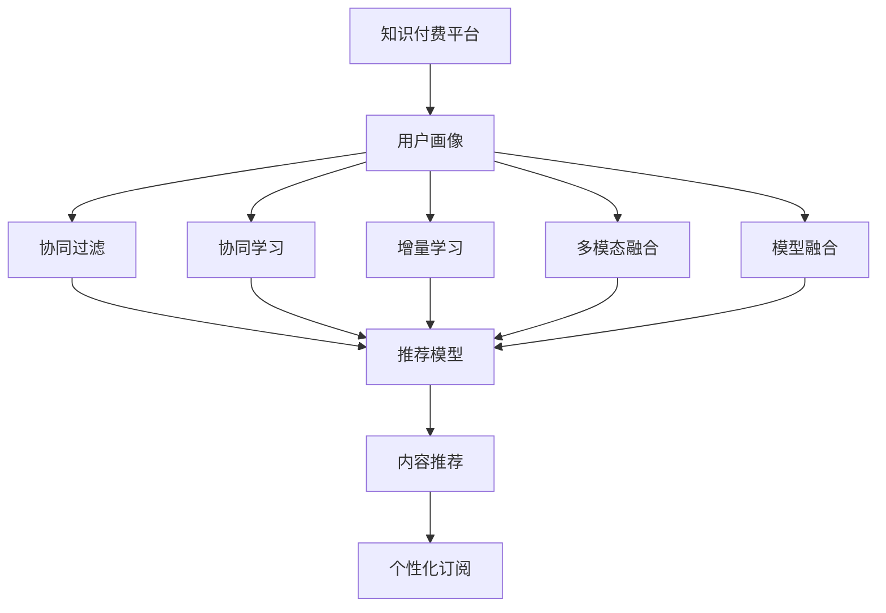

                 

# 知识付费与智能推荐相结合的个性化订阅

> 关键词：知识付费、智能推荐、个性化订阅、用户画像、协同过滤、协同学习、增量学习、多模态融合、模型融合、深度学习、神经网络、用户行为分析、推荐算法、内容推荐系统、个性化推荐、订阅策略优化、精准订阅

## 1. 背景介绍

### 1.1 问题由来

知识付费与智能推荐相结合的个性化订阅，已经成为互联网行业的热门话题。随着知识付费市场的兴起，越来越多的用户在追求高质量内容的同时，希望以更加个性化的方式获取知识。这种需求促使各大知识平台纷纷探索通过智能推荐系统，为用户提供更精准的内容推荐服务。

传统推荐系统通常基于协同过滤或内容召回，但这种基于历史行为和相似度匹配的方式，难以适应个性化和实时性要求更高的场景。而基于深度学习的智能推荐，能够利用用户的行为数据和内容特征，构建更精细化的用户画像，实现更高效的个性化推荐。

### 1.2 问题核心关键点

这一问题的核心关键点在于如何将知识付费平台上的内容推荐与个性化订阅相结合，使用户能够以最低的成本，获取最适合自己的知识内容。主要包括以下几个方面：

- **用户画像构建**：通过收集用户的浏览历史、购买行为等数据，构建精准的用户画像，理解用户兴趣和需求。
- **推荐模型训练**：基于用户画像，设计并训练深度学习推荐模型，预测用户可能感兴趣的课程或书籍。
- **订阅策略优化**：结合推荐结果，设计科学的订阅策略，帮助用户发现和订阅更多高价值内容。
- **实时性提升**：通过增量学习等技术，实时更新推荐模型，保持推荐内容的最新性和相关性。

### 1.3 问题研究意义

研究知识付费与智能推荐相结合的个性化订阅，对于提升用户满意度、增加平台粘性、提高知识转化率具有重要意义。具体而言：

1. **提升用户满意度**：通过个性化推荐，用户能够更快地找到感兴趣的内容，节省搜索时间，提高学习效率。
2. **增加平台粘性**：个性化的订阅服务能够满足用户深层次的需求，增强用户粘性，提升用户留存率。
3. **提高知识转化率**：精准的内容推荐能够提高用户对课程或书籍的购买转化率，增加平台的收入来源。
4. **降低订阅成本**：通过智能推荐，用户能够以最低成本获取最高价值的内容，降低知识付费的门槛。

## 2. 核心概念与联系

### 2.1 核心概念概述

本节将介绍几个密切相关的核心概念：

- **知识付费**：指用户为获取高质量、有价值的知识内容而支付的费用，如课程、书籍、文章等。知识付费平台包括但不限于Coursera、Udemy、得到、喜马拉雅等。

- **智能推荐**：利用机器学习技术，根据用户的历史行为和兴趣，推荐可能感兴趣的内容。智能推荐系统广泛应用于电商、社交、视频等众多领域。

- **个性化订阅**：根据用户的个性化需求，推荐其可能感兴趣的知识内容，并提供灵活的订阅方式，如单篇购买、月卡、年卡等，降低用户订阅成本。

- **用户画像**：通过分析用户的历史行为数据、兴趣标签、社交网络等信息，构建用户画像，用于深度个性化推荐。

- **协同过滤**：通过分析用户和内容的相似性，推荐可能感兴趣的内容，通常分为基于用户的协同过滤和基于内容的协同过滤。

- **协同学习**：通过学习用户和内容的交互数据，不断更新推荐模型，提高模型的预测能力。

- **增量学习**：在每次获取新的数据时，只更新模型的一部分参数，减少计算开销，保持模型实时性。

- **多模态融合**：结合文本、音频、视频等多种信息模态，丰富用户画像和推荐内容。

- **模型融合**：将多个推荐模型结合起来，取其平均值或加权平均，提高推荐准确性。

这些核心概念之间的逻辑关系可以通过以下Mermaid流程图来展示：



这个流程图展示了大语言模型的核心概念及其之间的关系：

1. 知识付费平台通过用户画像，了解用户需求。
2. 利用协同过滤、协同学习、增量学习、多模态融合和模型融合等技术，构建推荐模型。
3. 结合推荐结果，设计个性化订阅策略。
4. 最终通过推荐和订阅相结合，提高用户满意度，增加平台收入。

## 3. 核心算法原理 & 具体操作步骤

### 3.1 算法原理概述

知识付费与智能推荐相结合的个性化订阅，本质上是一个深度学习推荐系统在知识付费场景下的应用。其核心思想是：通过深度学习技术，构建精准的用户画像，并在此基础上，设计并训练推荐模型，为用户提供个性化的内容推荐，并结合推荐结果，设计科学的订阅策略，引导用户进行精准订阅。

形式化地，假设知识付费平台上有 $N$ 个用户，每个用户对 $M$ 个知识内容有 $I$ 次交互历史，其中 $I$ 包括浏览、点击、订阅、支付等行为。定义用户对内容 $j$ 的兴趣程度为 $u_j$，兴趣程度越高，越可能订阅该内容。那么推荐模型的目标是最大化用户对推荐内容的兴趣总和，即：

$$
\max \sum_{i=1}^{I} u_{j_i} \quad \text{s.t.} \quad j_i \in \{1,2,\dots,M\}
$$

其中 $j_i$ 表示用户对内容 $j$ 的第 $i$ 次交互。推荐模型的构建包括数据预处理、模型选择、训练和测试等步骤。

### 3.2 算法步骤详解

基于深度学习的知识付费推荐系统通常包括以下关键步骤：

**Step 1: 数据预处理**

- 收集用户的浏览历史、点击历史、订阅历史、支付历史等数据，构建用户行为数据集。
- 对数据进行清洗、去重、归一化等处理，保证数据质量。
- 使用嵌入式表示等方法，将用户和内容的特征向量进行编码，形成适合深度学习的输入数据。

**Step 2: 用户画像构建**

- 利用协同过滤、协同学习等技术，构建用户画像，了解用户的兴趣和需求。
- 通过多模态融合、模型融合等方法，丰富用户画像，提高推荐模型的准确性。

**Step 3: 推荐模型训练**

- 选择合适的深度学习模型，如矩阵分解、深度神经网络等。
- 定义推荐损失函数，如均方误差、交叉熵等，用于衡量模型预测结果与实际用户行为之间的差距。
- 使用优化器（如Adam、SGD等）对模型进行优化，最小化推荐损失函数。

**Step 4: 订阅策略优化**

- 结合推荐结果，设计灵活的订阅策略，如按需订阅、包月订阅、包年订阅等，满足用户多样化需求。
- 使用A/B测试等方法，评估不同策略的效果，优化订阅策略。

**Step 5: 实时性提升**

- 利用增量学习等技术，实时更新推荐模型，保持推荐内容的最新性和相关性。
- 在每次获取新的数据时，只更新模型的一部分参数，减少计算开销，提高系统的实时性。

### 3.3 算法优缺点

基于深度学习的知识付费推荐系统具有以下优点：

- **高效性**：深度学习模型能够处理大规模数据，实现高精度的推荐，满足个性化和实时性要求。
- **泛化能力**：利用深度学习模型，能够从用户历史行为中学习到更丰富的用户兴趣，提高推荐模型的泛化能力。
- **动态更新**：通过增量学习等技术，能够实时更新推荐模型，保持推荐内容的最新性和相关性。

同时，该方法也存在一些局限性：

- **计算资源需求高**：深度学习模型通常需要大量的计算资源和存储空间，对硬件要求较高。
- **数据隐私问题**：收集用户行为数据时，需要保证用户隐私，避免数据泄露和滥用。
- **模型复杂度**：深度学习模型参数量大，结构复杂，需要较长的训练时间和较多的优化参数调参。

尽管存在这些局限性，但基于深度学习的知识付费推荐系统，在大规模数据和复杂场景下，仍具有不可替代的优势，是实现个性化订阅的重要技术手段。

### 3.4 算法应用领域

基于深度学习的知识付费推荐系统，已经被广泛应用于多个领域，包括但不限于：

- **在线教育平台**：如Coursera、Udemy、得到、网易公开课等，推荐用户感兴趣的课程和教材，优化课程订阅策略。
- **电子书和音频平台**：如Kindle、Apple Books、得到、喜马拉雅等，推荐用户喜欢的书籍和音频内容，优化订阅方案。
- **知识社区平台**：如知乎、Medium、CSDN等，推荐用户感兴趣的文章和话题，提升社区活跃度。

除了上述这些经典应用外，知识付费推荐系统还被创新性地应用到更多场景中，如可控文本生成、阅读推荐、学习路径优化等，为知识付费平台的运营和用户体验优化提供了新的技术路径。

## 4. 数学模型和公式 & 详细讲解 & 举例说明

### 4.1 数学模型构建

本节将使用数学语言对知识付费推荐系统的构建进行更加严格的刻画。

假设知识付费平台上有 $N$ 个用户，每个用户对 $M$ 个知识内容有 $I$ 次交互历史，其中 $I$ 包括浏览、点击、订阅、支付等行为。定义用户对内容 $j$ 的兴趣程度为 $u_j$，兴趣程度越高，越可能订阅该内容。推荐模型的目标是最小化推荐误差，即：

$$
\min_{\theta} \sum_{i=1}^{I} (u_{j_i} - \hat{u}_{j_i})^2
$$

其中 $\hat{u}_{j_i}$ 表示模型预测用户对内容 $j$ 的兴趣程度。

### 4.2 公式推导过程

以下我们以矩阵分解模型为例，推导推荐模型的计算公式。

矩阵分解模型假设用户和内容之间的交互可以表示为矩阵 $U \times V^T$ 的形式，其中 $U$ 为用户特征矩阵，$V$ 为内容特征矩阵，$X$ 为二进制用户-内容交互矩阵。模型的目标是最小化预测矩阵 $X'$ 与实际矩阵 $X$ 之间的差异，即：

$$
\min_{U,V} ||X - UV^T||_F^2
$$

其中 $||\cdot||_F$ 表示矩阵的Frobenius范数。

通过矩阵分解模型，可以将用户和内容的特征矩阵进行分解，得到低维的特征向量，从而实现高精度的推荐。通过设定适当的损失函数和优化器，可以不断优化模型参数，提高推荐精度。

### 4.3 案例分析与讲解

以在线教育平台Coursera为例，分析知识付费推荐系统的构建和应用：

**Step 1: 数据预处理**

- 收集Coursera平台上用户的浏览历史、点击历史、订阅历史、支付历史等数据，构建用户行为数据集。
- 对数据进行清洗、去重、归一化等处理，保证数据质量。
- 使用嵌入式表示等方法，将用户和课程的特征向量进行编码，形成适合深度学习的输入数据。

**Step 2: 用户画像构建**

- 利用协同过滤、协同学习等技术，构建用户画像，了解用户的兴趣和需求。
- 通过多模态融合、模型融合等方法，丰富用户画像，提高推荐模型的准确性。

**Step 3: 推荐模型训练**

- 选择矩阵分解模型作为推荐模型，定义均方误差损失函数，用于衡量模型预测结果与实际用户行为之间的差距。
- 使用Adam优化器对模型进行优化，最小化推荐损失函数。

**Step 4: 订阅策略优化**

- 结合推荐结果，设计灵活的订阅策略，如按需订阅、包月订阅、包年订阅等，满足用户多样化需求。
- 使用A/B测试等方法，评估不同策略的效果，优化订阅策略。

**Step 5: 实时性提升**

- 利用增量学习等技术，实时更新推荐模型，保持推荐内容的最新性和相关性。
- 在每次获取新的数据时，只更新模型的一部分参数，减少计算开销，提高系统的实时性。

通过Coursera平台的推荐系统，能够帮助用户快速发现感兴趣的课程，提高课程订阅率和用户满意度。平台也能够根据用户反馈和行为数据，不断优化推荐模型和订阅策略，提升用户体验和平台收入。

## 5. 项目实践：代码实例和详细解释说明

### 5.1 开发环境搭建

在进行知识付费推荐系统开发前，我们需要准备好开发环境。以下是使用Python进行TensorFlow开发的环境配置流程：

1. 安装Anaconda：从官网下载并安装Anaconda，用于创建独立的Python环境。

2. 创建并激活虚拟环境：
```bash
conda create -n tf-env python=3.8 
conda activate tf-env
```

3. 安装TensorFlow：根据CUDA版本，从官网获取对应的安装命令。例如：
```bash
conda install tensorflow -c conda-forge
```

4. 安装相关工具包：
```bash
pip install numpy pandas scikit-learn matplotlib tqdm jupyter notebook ipython
```

完成上述步骤后，即可在`tf-env`环境中开始推荐系统开发。

### 5.2 源代码详细实现

下面我们以Coursera平台为例，给出使用TensorFlow进行知识付费推荐系统开发的PyTorch代码实现。

首先，定义数据处理函数：

```python
import tensorflow as tf
from tensorflow.keras.layers import Input, Embedding, Dot, Dense, Flatten
from tensorflow.keras.models import Model

def build_model(input_dim, output_dim, embedding_dim=64):
    # 用户特征输入层
    user_input = Input(shape=(input_dim,))
    # 用户特征嵌入层
    user_embed = Embedding(input_dim, embedding_dim)(user_input)
    # 内容特征输入层
    item_input = Input(shape=(input_dim,))
    # 内容特征嵌入层
    item_embed = Embedding(input_dim, embedding_dim)(item_input)
    # 用户和内容的交互层
    interaction = Dot(axes=(1, 1))([user_embed, item_embed])
    # 预测层
    predictions = Dense(output_dim, activation='sigmoid')(interaction)
    # 模型
    model = Model(inputs=[user_input, item_input], outputs=predictions)
    return model
```

然后，定义模型和优化器：

```python
from tensorflow.keras.optimizers import Adam

# 输入维度和输出维度
input_dim = 10000
output_dim = 1
# 定义模型
model = build_model(input_dim, output_dim)
# 定义优化器
optimizer = Adam(learning_rate=0.001)
```

接着，定义训练和评估函数：

```python
from tensorflow.keras.callbacks import EarlyStopping
from tensorflow.keras.metrics import AUC, BinaryAccuracy

def train_model(model, train_data, val_data, epochs=10, batch_size=32):
    model.compile(optimizer=optimizer, loss='binary_crossentropy', metrics=[AUC(), BinaryAccuracy()])
    early_stopping = EarlyStopping(monitor='val_auc', patience=3)
    model.fit(train_data, epochs=epochs, batch_size=batch_size, validation_data=val_data, callbacks=[early_stopping])
    print(f'训练结束，AUC: {model.evaluate(val_data)[1]:.4f}')

def evaluate_model(model, test_data):
    model.evaluate(test_data)
```

最后，启动训练流程并在测试集上评估：

```python
# 训练数据和测试数据
train_data = ...
val_data = ...
test_data = ...

# 开始训练
train_model(model, train_data, val_data)

# 测试模型
evaluate_model(model, test_data)
```

以上就是使用TensorFlow对知识付费推荐系统进行开发的完整代码实现。可以看到，得益于TensorFlow的强大封装，我们可以用相对简洁的代码完成推荐模型的构建和训练。

### 5.3 代码解读与分析

让我们再详细解读一下关键代码的实现细节：

**build_model函数**：
- `Input`层：用于定义输入层，其中`shape`参数指定输入数据的维度。
- `Embedding`层：用于将输入数据映射到低维空间中的嵌入向量。
- `Dot`层：用于计算用户和内容的交互向量。
- `Dense`层：用于进行最终的二元分类预测。
- `Model`类：用于组合上述各层，构建推荐模型。

**train_model函数**：
- 使用`compile`方法定义模型的优化器、损失函数和评价指标。
- 使用`EarlyStopping`回调函数，在模型性能不再提升时停止训练，避免过拟合。
- 使用`fit`方法进行模型的训练，并在验证集上进行性能评估。

**evaluate_model函数**：
- 使用`evaluate`方法在测试集上评估模型的性能，输出AUC和准确率等指标。

这些函数是知识付费推荐系统开发的基础，开发者可以在此基础上，进一步扩展和优化推荐模型的训练、评估和应用。

当然，工业级的系统实现还需考虑更多因素，如模型的保存和部署、超参数的自动搜索、更灵活的任务适配层等。但核心的推荐范式基本与此类似。

## 6. 实际应用场景

### 6.1 在线教育平台

在线教育平台是知识付费推荐系统的重要应用场景之一。通过深度学习推荐系统，平台能够为每位用户提供个性化的课程推荐，优化课程订阅策略，提升用户满意度和平台收入。

在Coursera等平台，推荐系统根据用户的历史浏览、点击和订阅行为，预测用户可能感兴趣的课程，并通过多种订阅方式（如单课购买、包月订阅、包年订阅），降低用户的订阅门槛，提高课程订阅率。平台还能够根据用户反馈和行为数据，不断优化推荐模型和订阅策略，提升用户体验和平台收入。

### 6.2 电子书和音频平台

电子书和音频平台也是知识付费推荐系统的应用领域。通过深度学习推荐系统，平台能够为用户推荐感兴趣的书本和音频内容，优化订阅方案，提升用户粘性。

在Kindle等平台，推荐系统根据用户的历史阅读和下载行为，预测用户可能感兴趣的书本和音频，并通过多种订阅方式（如单本购买、月卡、年卡），降低用户的订阅门槛，提高内容订阅率。平台还能够根据用户反馈和行为数据，不断优化推荐模型和订阅策略，提升用户粘性和平台收入。

### 6.3 知识社区平台

知识社区平台也是知识付费推荐系统的应用场景之一。通过深度学习推荐系统，平台能够为每位用户推荐感兴趣的文章和话题，提升社区活跃度和用户留存率。

在知乎等平台，推荐系统根据用户的历史浏览、点赞和评论行为，预测用户可能感兴趣的文章和话题，并通过多种互动方式（如点赞、评论、分享），提高用户参与度。平台还能够根据用户反馈和行为数据，不断优化推荐模型和互动策略，提升社区活跃度和用户留存率。

### 6.4 未来应用展望

随着深度学习推荐系统的不断发展，未来在知识付费领域的更多应用场景也将不断涌现。

在智慧医疗领域，推荐系统可以帮助医生推荐患者可能感兴趣的科普知识，提升患者的健康意识和自我管理能力。

在智能家居领域，推荐系统可以帮助用户推荐智能设备，优化家居环境，提升生活质量。

在金融理财领域，推荐系统可以帮助用户推荐适合的理财产品，优化投资组合，提高收益。

除了上述这些领域，知识付费推荐系统还将被创新性地应用到更多场景中，为知识付费平台的运营和用户体验优化提供新的技术路径。

## 7. 工具和资源推荐

### 7.1 学习资源推荐

为了帮助开发者系统掌握深度学习推荐系统，这里推荐一些优质的学习资源：

1. 《推荐系统实战》系列博文：由推荐系统专家撰写，深入浅出地介绍了推荐系统原理、算法和实现细节。

2. CS229《机器学习》课程：斯坦福大学开设的机器学习明星课程，涵盖了推荐系统等多个经典应用领域。

3. 《推荐系统》书籍：经典推荐系统教材，由Recommender System专家撰写，系统介绍了推荐系统的原理和算法。

4. Coursera《深度学习推荐系统》课程：由Google大脑的Recommender System专家主讲，涵盖推荐系统的经典算法和深度学习模型。

5. Kaggle推荐系统竞赛：Kaggle平台举办的推荐系统竞赛，提供大量推荐系统实际数据集和解决方案，适合实战练习。

通过对这些资源的学习实践，相信你一定能够快速掌握深度学习推荐系统的精髓，并用于解决实际的推荐问题。

### 7.2 开发工具推荐

高效的开发离不开优秀的工具支持。以下是几款用于深度学习推荐系统开发的常用工具：

1. TensorFlow：由Google主导开发的深度学习框架，生产部署方便，适合大规模工程应用。

2. PyTorch：基于Python的开源深度学习框架，灵活动态的计算图，适合快速迭代研究。

3. Keras：高层次的深度学习框架，易于上手，适合快速原型设计和模型测试。

4. Jupyter Notebook：交互式的Python开发环境，支持代码编写、数据处理和可视化，是推荐系统开发的理想工具。

5. Weights & Biases：模型训练的实验跟踪工具，可以记录和可视化模型训练过程中的各项指标，方便对比和调优。

6. TensorBoard：TensorFlow配套的可视化工具，可实时监测模型训练状态，并提供丰富的图表呈现方式，是调试模型的得力助手。

合理利用这些工具，可以显著提升深度学习推荐系统的开发效率，加快创新迭代的步伐。

### 7.3 相关论文推荐

深度学习推荐系统的发展源于学界的持续研究。以下是几篇奠基性的相关论文，推荐阅读：

1. Parallel Matrix Factorization for Recommender Systems（并行矩阵分解）：提出了矩阵分解的并行化算法，提高了推荐系统的计算效率。

2. The Matrix Factorization Approach to Recommender Systems（矩阵分解推荐系统）：提出矩阵分解模型，成为推荐系统的主流算法之一。

3. Deep Collaborative Filtering（深度协同过滤）：将深度神经网络应用于协同过滤，提高了推荐系统的预测能力。

4. BPR: Bayesian Personalized Ranking from Log-by-Log Data（贝叶斯个性化排序）：提出基于对数损失的推荐模型，优化了推荐系统的目标函数。

5. Contextual Bandits for Content Curation（上下文强化学习）：结合上下文强化学习，优化推荐系统的互动策略。

这些论文代表了大语言模型微调技术的发展脉络。通过学习这些前沿成果，可以帮助研究者把握学科前进方向，激发更多的创新灵感。

## 8. 总结：未来发展趋势与挑战

### 8.1 总结

本文对深度学习推荐系统在知识付费领域的构建和应用进行了全面系统的介绍。首先阐述了知识付费与智能推荐相结合的个性化订阅，明确了推荐系统在知识付费平台中的应用价值。其次，从原理到实践，详细讲解了推荐系统的数学模型和关键步骤，给出了推荐系统开发的完整代码实例。同时，本文还广泛探讨了推荐系统在多个行业领域的应用前景，展示了其广阔的应用前景。此外，本文精选了推荐系统的各类学习资源，力求为读者提供全方位的技术指引。

通过本文的系统梳理，可以看到，深度学习推荐系统在知识付费领域的构建和应用，已经成为提升用户满意度、增加平台粘性、提高知识转化率的重要技术手段。未来，伴随推荐系统的持续演进，其在知识付费平台中的应用将更加广泛，为用户的知识获取和平台运营带来更多可能性。

### 8.2 未来发展趋势

展望未来，深度学习推荐系统将在知识付费领域呈现以下几个发展趋势：

1. **个性化推荐精度提升**：随着深度学习模型的不断优化和改进，推荐系统的个性化推荐精度将进一步提升，用户能够更快地发现感兴趣的内容。

2. **实时性增强**：通过增量学习等技术，推荐系统能够实时更新推荐模型，保持推荐内容的最新性和相关性，满足用户的实时需求。

3. **多模态融合**：结合文本、音频、视频等多种信息模态，丰富用户画像和推荐内容，提升推荐系统的全面性和鲁棒性。

4. **跨领域应用拓展**：推荐系统不仅应用于知识付费领域，还将被广泛应用于电商、社交、视频等多个领域，成为通用推荐技术的重要组成部分。

5. **协同学习与强化学习结合**：结合协同学习与强化学习，优化推荐系统的互动策略，提升用户的参与度和满意度。

6. **智能补贴策略**：通过智能补贴策略，提高推荐系统的推荐效果，减少用户订阅成本，提升平台收入。

以上趋势凸显了深度学习推荐系统在知识付费领域的广阔前景。这些方向的探索发展，必将进一步提升推荐系统的性能和应用范围，为用户的知识获取和平台运营带来更多可能性。

### 8.3 面临的挑战

尽管深度学习推荐系统在知识付费领域取得了显著成效，但在迈向更加智能化、普适化应用的过程中，仍面临诸多挑战：

1. **数据隐私问题**：在收集用户行为数据时，需要保证用户隐私，避免数据泄露和滥用。

2. **计算资源需求高**：深度学习模型通常需要大量的计算资源和存储空间，对硬件要求较高。

3. **模型复杂度**：深度学习模型参数量大，结构复杂，需要较长的训练时间和较多的优化参数调参。

4. **模型鲁棒性不足**：当前推荐模型面对域外数据时，泛化性能往往大打折扣。

5. **实时性有待提高**：推荐系统需要实时更新推荐内容，但目前仍存在一定的延迟，影响用户体验。

6. **可解释性不足**：推荐系统的决策过程缺乏可解释性，难以对其推理逻辑进行分析和调试。

7. **安全性有待保障**：推荐系统可能会受到恶意攻击，如假数据攻击、对抗攻击等，需要建立系统的安全性保障机制。

这些挑战凸显了推荐系统在知识付费领域的发展瓶颈。未来，需要结合更多前沿技术，如隐私保护、联邦学习、模型压缩等，不断提升推荐系统的性能和可靠性。

### 8.4 研究展望

面对深度学习推荐系统面临的诸多挑战，未来的研究需要在以下几个方面寻求新的突破：

1. **隐私保护技术**：结合联邦学习等技术，在保护用户隐私的前提下，提升推荐系统的预测能力。

2. **计算资源优化**：结合模型压缩、稀疏化存储等技术，优化深度学习模型的计算效率，降低硬件需求。

3. **跨领域推荐技术**：结合知识图谱、逻辑规则等专家知识，提升推荐系统的跨领域推荐能力。

4. **实时性提升**：结合增量学习、边缘计算等技术，提高推荐系统的实时性，满足用户实时需求。

5. **可解释性增强**：结合因果分析和博弈论工具，增强推荐系统的可解释性，提高系统的透明性和可信度。

6. **安全性保障**：结合对抗生成网络、异常检测等技术，提升推荐系统的安全性，防范恶意攻击。

这些研究方向将引领深度学习推荐系统迈向更高的台阶，为知识付费平台的运营和用户体验优化提供更多可能性。

## 9. 附录：常见问题与解答

**Q1：深度学习推荐系统是否适用于所有知识付费平台？**

A: 深度学习推荐系统在大多数知识付费平台上都能取得不错的效果，特别是对于数据量较大的平台。但对于一些特定领域的平台，如医学、法律等，仅仅依靠通用语料预训练的模型可能难以很好地适应。此时需要在特定领域语料上进一步预训练，再进行微调，才能获得理想效果。

**Q2：推荐模型如何选择合适的网络结构？**

A: 推荐模型的网络结构需要根据具体任务进行设计和调整。通常来说，简单的全连接网络或矩阵分解网络已经足够应对大多数推荐任务。但在复杂任务中，可以考虑使用卷积神经网络、循环神经网络等深度学习模型，提高推荐精度。同时，还可以通过网络融合、多任务学习等方法，提升模型的泛化能力和鲁棒性。

**Q3：推荐系统如何处理长尾问题？**

A: 长尾问题是推荐系统面临的常见挑战。为应对长尾问题，推荐系统需要结合多模态融合、增量学习等技术，提升对长尾数据的识别和推荐能力。同时，可以通过多样化的推荐策略，如基于内容的推荐、基于兴趣的推荐等，提高长尾数据的曝光率。

**Q4：推荐系统的实时性如何提升？**

A: 推荐系统的实时性可以通过增量学习、边缘计算等技术进行提升。增量学习可以实时更新推荐模型，保持推荐内容的最新性和相关性。边缘计算可以将推荐任务下沉到终端设备进行计算，降低延迟，提高实时性。

**Q5：推荐系统如何处理新用户？**

A: 新用户的推荐可以通过基于内容的推荐和基于协作的推荐相结合的方式进行。基于内容的推荐利用新用户的特征，推荐与用户兴趣相关的商品或内容。基于协作的推荐利用用户的相似行为，推荐用户已经喜欢或可能喜欢的商品或内容。两种方法相结合，可以提高新用户的推荐效果。

这些问题的解答，展示了深度学习推荐系统在知识付费领域的实际应用中的细节和优化方法。通过不断优化推荐模型和推荐策略，未来推荐系统将在知识付费领域发挥更加重要的作用。

---

作者：禅与计算机程序设计艺术 / Zen and the Art of Computer Programming

