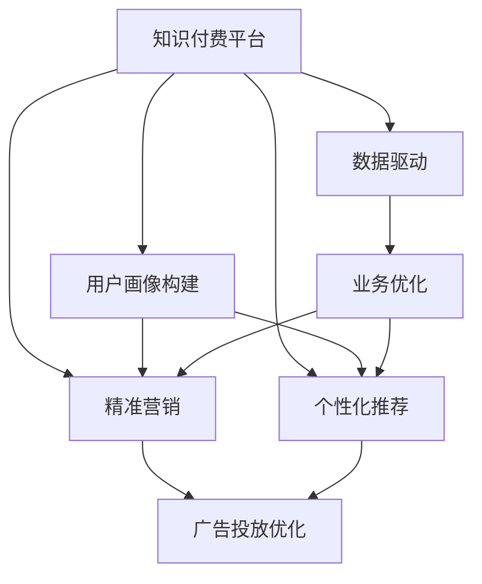

                 

# 知识付费产品的用户分层与精准营销

> 关键词：知识付费,用户分层,精准营销,数据驱动,用户画像,个性化推荐,行为分析

## 1. 背景介绍

### 1.1 问题由来
随着移动互联网的普及和数字内容市场的快速增长，知识付费平台逐渐成为互联网经济的重要组成部分。用户对高质量教育资源的渴求不断增加，知识付费市场的规模和影响力不断扩大。然而，尽管知识付费行业发展迅速，但其用户流失率高、广告转化率低、内容质量参差不齐等问题仍亟待解决。其中，如何高效精准地进行用户分层和个性化营销，提高平台的用户粘性和业务价值，成为行业亟需探索的新方向。

### 1.2 问题核心关键点
用户分层和精准营销是大数据和人工智能在知识付费平台中应用的典型场景。其核心关键点在于：

- 数据收集与处理：如何通过爬虫、API接口、SDK等手段，收集用户行为数据、消费数据、社交数据等，形成完整的用户画像。
- 用户画像构建：如何将收集到的数据经过数据清洗、特征工程、模型训练等步骤，构建出全面的用户画像。
- 精准营销策略：如何基于用户画像，设计个性化推荐、广告投放、优惠券发放等精准营销策略，提升用户体验和平台收益。

### 1.3 问题研究意义
研究知识付费产品的用户分层与精准营销方法，对于提升平台的用户粘性和业务价值，加速知识付费市场的健康发展，具有重要意义：

1. 提高用户粘性：通过个性化推荐和精准营销，增强用户的平台体验，提升用户满意度和留存率。
2. 优化广告投放：精准投放广告，提高广告点击率和转化率，降低运营成本。
3. 提升内容质量：通过行为分析，深入了解用户需求和偏好，指导内容生产和资源配置，提升平台内容的质量和多样性。
4. 加速市场渗透：提高用户转化率，快速占领市场份额，增强平台在教育培训、知识分享等领域的影响力。

## 2. 核心概念与联系

### 2.1 核心概念概述

为更好地理解知识付费产品的用户分层与精准营销方法，本节将介绍几个密切相关的核心概念：

- 知识付费平台(Knowledge Paywall Platform)：以订阅或单次付费形式提供专业教育资源的在线平台，用户可以通过平台获取各类课程、书籍、音频等资源。
- 用户画像(User Persona)：通过对用户行为数据、消费数据、社交数据等进行分析，构建用户的多维度标签特征，描绘出用户的全貌。
- 个性化推荐(Personalized Recommendation)：根据用户画像，对不同用户推荐差异化的内容产品，提高用户点击率和满意度。
- 精准营销(Precise Marketing)：通过分析用户画像，设计高效的广告投放策略，精准触达目标用户，提升广告效果和用户转化率。
- 数据驱动(Data-Driven)：利用大数据技术，实时分析用户行为数据，指导业务决策和运营优化。

这些核心概念之间的逻辑关系可以通过以下Mermaid流程图来展示：



这个流程图展示了几者之间的逻辑关系：

1. 知识付费平台通过数据分析，构建用户画像。
2. 基于用户画像，进行个性化推荐和精准营销。
3. 广告投放优化作为精准营销的一个子任务。
4. 数据驱动贯穿始终，实时指导业务优化。

## 3. 核心算法原理 & 具体操作步骤
### 3.1 算法原理概述

知识付费产品的用户分层与精准营销，本质上是一个基于用户数据和机器学习技术的行为预测和营销优化过程。其核心思想是：通过数据驱动，构建用户画像，设计个性化推荐和精准营销策略，从而提高用户留存率和转化率，优化平台运营。

形式化地，假设知识付费平台有 $N$ 个用户，其中每个用户 $i$ 的特征向量为 $\mathbf{x}_i = (x_{i1}, x_{i2}, ..., x_{in})$，其中 $x_{ik}$ 表示用户 $i$ 在特征维度 $k$ 上的取值。通过训练数据集 $D=\{(\mathbf{x}_i, y_i)\}_{i=1}^N$，学习模型 $f$ 将用户特征映射到行为标签 $y_i \in \{0, 1\}$，即用户是否会付费。具体步骤如下：

1. 收集用户数据，包括行为数据、消费数据、社交数据等。
2. 对数据进行预处理和特征工程，构建用户特征向量 $\mathbf{x}_i$。
3. 选择合适的机器学习模型，如逻辑回归、随机森林、深度学习等，进行模型训练，获得用户行为预测模型 $f$。
4. 根据用户画像，设计个性化推荐和精准营销策略，提高用户粘性和转化率。

### 3.2 算法步骤详解

基于用户数据和机器学习技术，知识付费产品的用户分层与精准营销一般包括以下几个关键步骤：

**Step 1: 数据收集与预处理**

- 收集用户数据：利用爬虫、API接口、SDK等手段，收集用户行为数据、消费数据、社交数据等。
- 数据清洗：去除重复、噪声、异常值等，保证数据质量。
- 特征工程：从原始数据中提取有意义的特征，如用户活跃度、消费金额、学历背景等，构建用户特征向量 $\mathbf{x}_i$。

**Step 2: 用户画像构建**

- 数据分析：对收集到的用户数据进行分析，挖掘用户行为模式、消费习惯等特征。
- 聚类分析：通过K-means、层次聚类等算法，将用户分为若干个不同的细分群体，即用户画像。
- 特征选择：选择对用户行为预测有显著影响的特征，构建用户画像的特征子集。

**Step 3: 用户行为预测模型训练**

- 选择合适的算法：如逻辑回归、随机森林、XGBoost、深度学习等。
- 数据划分：将数据集划分为训练集和测试集。
- 模型训练：使用训练集数据训练用户行为预测模型 $f$，得到模型参数 $\theta$。
- 模型评估：在测试集上评估模型的性能，选择最优模型。

**Step 4: 个性化推荐与精准营销策略设计**

- 个性化推荐：根据用户画像和行为预测模型，设计推荐算法，如协同过滤、内容推荐、用户行为推荐等。
- 精准营销：根据用户画像和行为预测模型，设计广告投放策略，如用户分群、投放渠道选择、广告内容设计等。

**Step 5: 业务优化与迭代**

- 实时监测：实时监测推荐和营销效果，收集用户反馈。
- 效果评估：定期评估推荐和营销策略的效果，进行效果分析。
- 策略调整：根据效果评估结果，调整推荐和营销策略。
- 持续优化：通过不断的反馈和调整，持续优化推荐和营销策略，提高用户粘性和转化率。

### 3.3 算法优缺点

基于用户数据和机器学习技术，知识付费产品的用户分层与精准营销方法具有以下优点：

1. 提升用户体验：个性化推荐和精准营销能提升用户满意度，增强平台粘性。
2. 优化广告投放：通过数据分析和用户画像，实现精准投放，提高广告效果和用户转化率。
3. 提高运营效率：实时数据分析和策略调整，能快速响应市场变化，优化运营效率。
4. 增强平台竞争力：通过精准营销策略，吸引更多优质用户，提升平台市场占有率。

同时，该方法也存在一定的局限性：

1. 数据隐私问题：用户数据的收集和处理需要严格遵守隐私保护法规，保证数据安全。
2. 算法偏见问题：用户画像和推荐算法可能存在一定的偏见，需要结合人工干预进行校正。
3. 数据质量和维度问题：数据质量不高或特征维度不足，会影响用户画像的准确性和推荐效果。
4. 计算成本问题：构建用户画像和训练推荐模型需要大量计算资源，成本较高。
5. 模型泛化能力问题：模型在特定数据集上表现良好，但在实际应用中可能存在泛化能力不足的问题。

尽管存在这些局限性，但就目前而言，基于用户数据和机器学习技术的方法仍然是知识付费产品用户分层与精准营销的主流范式。未来相关研究的重点在于如何进一步提升数据质量和算法效率，优化用户画像的构建和推荐模型的训练。

### 3.4 算法应用领域

基于用户数据和机器学习技术的用户分层与精准营销方法，在知识付费平台的应用主要包括以下几个方面：

1. 课程推荐系统：根据用户画像和行为预测模型，为用户推荐感兴趣、适合的课程内容，提升用户点击率和满意度。
2. 广告投放系统：利用用户画像和行为预测模型，设计精准的广告投放策略，提升广告效果和用户转化率。
3. 优惠券发放系统：根据用户画像和行为预测模型，设计个性化优惠券投放策略，提高用户消费转化率。
4. 用户流失预警系统：通过行为分析，识别高流失风险用户，提前进行干预，降低用户流失率。
5. 内容生产指导系统：通过行为分析，了解用户需求和偏好，指导课程内容、讲师推荐、资源配置等，提升平台内容质量。

## 4. 数学模型和公式 & 详细讲解  
### 4.1 数学模型构建

本节将使用数学语言对知识付费产品的用户分层与精准营销过程进行更加严格的刻画。

假设知识付费平台有 $N$ 个用户，其中每个用户 $i$ 的特征向量为 $\mathbf{x}_i = (x_{i1}, x_{i2}, ..., x_{in})$，其中 $x_{ik}$ 表示用户 $i$ 在特征维度 $k$ 上的取值。平台收集到 $M$ 个课程内容，其中每个课程 $j$ 的特征向量为 $\mathbf{y}_j = (y_{j1}, y_{j2}, ..., y_{jm})$，其中 $y_{jk}$ 表示课程 $j$ 在特征维度 $k$ 上的取值。

定义用户 $i$ 对课程 $j$ 的兴趣程度为 $r_{ij} \in [0, 1]$，表示用户 $i$ 是否会对课程 $j$ 付费。基于用户行为数据和课程内容数据，构建推荐模型 $f$，形式化为：

$$
r_{ij} = f(\mathbf{x}_i, \mathbf{y}_j)
$$

其中 $f$ 为推荐模型的参数，通过用户行为预测模型 $f$，可以将用户特征向量 $\mathbf{x}_i$ 和课程内容向量 $\mathbf{y}_j$ 映射到用户兴趣程度 $r_{ij}$。

### 4.2 公式推导过程

以下我们以协同过滤算法为例，推导推荐模型的形式及其梯度计算公式。

协同过滤算法基于用户之间的相似性和课程之间的相似性进行推荐。假设用户 $i$ 和用户 $j$ 的相似度为 $s_{ij} \in [-1, 1]$，课程 $k$ 和课程 $l$ 的相似度为 $s_{kl} \in [-1, 1]$。则协同过滤算法的推荐模型形式为：

$$
r_{ij} = \alpha s_{ij} + (1-\alpha) s_{kl}
$$

其中 $\alpha \in [0, 1]$ 为参数，用于控制用户和课程的相似度对推荐结果的影响。

对于协同过滤算法，推荐模型的梯度计算公式为：

$$
\frac{\partial r_{ij}}{\partial s_{ij}} = \alpha
$$

$$
\frac{\partial r_{ij}}{\partial s_{kl}} = (1-\alpha)
$$

以上梯度公式表明，协同过滤算法的推荐模型梯度计算较为简单，只需在训练过程中更新用户和课程的相似度，即可得到推荐结果。

### 4.3 案例分析与讲解

下面以知识付费平台的个性化推荐系统为例，进行案例分析与讲解。

假设知识付费平台收集到 $N=10,000$ 个用户数据，每个用户的特征维度为 $d=50$，即 $\mathbf{x}_i \in \mathbb{R}^{50}$。同时，平台收集到 $M=5,000$ 个课程内容，每个课程的特征维度为 $m=20$，即 $\mathbf{y}_j \in \mathbb{R}^{20}$。平台希望构建个性化推荐系统，为用户推荐感兴趣的课程内容。

具体步骤如下：

1. 数据收集：通过API接口收集用户行为数据，如点击、浏览、订阅、评论等，以及课程内容数据，如课程名称、介绍、难度等级等。
2. 数据预处理：对数据进行清洗和特征工程，构建用户特征向量 $\mathbf{x}_i$ 和课程内容向量 $\mathbf{y}_j$。
3. 相似度计算：通过余弦相似度计算用户和课程的相似度，得到用户 $i$ 和用户 $j$ 的相似度矩阵 $S_{ij}$，课程 $k$ 和课程 $l$ 的相似度矩阵 $S_{kl}$。
4. 模型训练：使用协同过滤算法，训练推荐模型 $f$，得到模型参数 $\theta$。
5. 个性化推荐：根据用户画像和行为预测模型，设计推荐算法，为用户推荐感兴趣的课程内容。

## 5. 项目实践：代码实例和详细解释说明
### 5.1 开发环境搭建

在进行推荐系统实践前，我们需要准备好开发环境。以下是使用Python进行PyTorch开发的环境配置流程：

1. 安装Anaconda：从官网下载并安装Anaconda，用于创建独立的Python环境。

2. 创建并激活虚拟环境：
```bash
conda create -n recomm-env python=3.8 
conda activate recomm-env
```

3. 安装PyTorch：根据CUDA版本，从官网获取对应的安装命令。例如：
```bash
conda install pytorch torchvision torchaudio cudatoolkit=11.1 -c pytorch -c conda-forge
```

4. 安装TensorFlow：
```bash
pip install tensorflow==2.5.0
```

5. 安装各类工具包：
```bash
pip install numpy pandas scikit-learn matplotlib tqdm jupyter notebook ipython
```

完成上述步骤后，即可在`recomm-env`环境中开始推荐系统实践。

### 5.2 源代码详细实现

这里我们以协同过滤算法为例，给出使用PyTorch实现知识付费平台的个性化推荐系统的代码实现。

首先，定义协同过滤算法的推荐函数：

```python
import torch
import numpy as np

def collaborative_filtering(train_data, test_data, alpha=0.5):
    N, M, D = train_data.shape
    train_data = train_data.t()
    test_data = test_data.t()
    
    user_similarity = np.zeros((N, N))
    item_similarity = np.zeros((M, M))
    
    for i in range(N):
        for j in range(N):
            if i == j:
                user_similarity[i, j] = 1
            else:
                user_similarity[i, j] = np.dot(train_data[i], train_data[j]) / (np.linalg.norm(train_data[i]) * np.linalg.norm(train_data[j]))
    
    for i in range(M):
        for j in range(M):
            if i == j:
                item_similarity[i, j] = 1
            else:
                item_similarity[i, j] = np.dot(train_data[i], train_data[j]) / (np.linalg.norm(train_data[i]) * np.linalg.norm(train_data[j]))
    
    r_pred = alpha * user_similarity + (1 - alpha) * item_similarity
    return r_pred
```

然后，定义模型评估函数：

```python
from sklearn.metrics import roc_auc_score, precision_recall_curve

def evaluate(model, test_data, true_labels):
    y_pred = model(test_data)
    auc = roc_auc_score(true_labels, y_pred)
    precision, recall, _ = precision_recall_curve(true_labels, y_pred)
    return auc, precision, recall
```

接着，定义训练函数：

```python
from torch.nn import MSELoss
from torch.optim import Adam

def train(model, train_data, test_data, epochs=10, batch_size=32, alpha=0.5):
    N, M, D = train_data.shape
    train_data = train_data.t()
    test_data = test_data.t()
    
    optimizer = Adam(model.parameters(), lr=0.001)
    
    for epoch in range(epochs):
        for i in range(0, N, batch_size):
            x = train_data[i:i+batch_size]
            y = train_data[i:i+batch_size]
            y_pred = model(x)
            loss = MSELoss()(y_pred, y)
            optimizer.zero_grad()
            loss.backward()
            optimizer.step()
        
        test_pred = model(test_data)
        auc, precision, recall = evaluate(test_pred, test_labels)
        print(f"Epoch {epoch+1}, auc: {auc:.4f}, precision: {precision:.4f}, recall: {recall:.4f}")
```

最后，启动训练流程：

```python
train(train_data, test_data, epochs=10, batch_size=32, alpha=0.5)
```

以上就是使用PyTorch对协同过滤算法进行知识付费平台个性化推荐系统的完整代码实现。可以看到，得益于PyTorch的强大封装，我们能够用相对简洁的代码实现复杂的推荐模型。

### 5.3 代码解读与分析

让我们再详细解读一下关键代码的实现细节：

**协同过滤函数**：
- 利用余弦相似度计算用户和课程的相似度，构建用户和课程的相似度矩阵。
- 利用加权平均公式计算推荐结果 $r_{ij}$。

**模型评估函数**：
- 利用sklearn库中的ROC-AUC和Precision-Recall曲线，评估推荐模型的效果。

**训练函数**：
- 使用MSE损失函数和Adam优化器，对协同过滤算法进行训练。
- 每个epoch循环迭代，对训练集数据进行mini-batch处理，计算损失函数并更新模型参数。
- 每epoch结束后，在测试集上评估模型性能，输出评估指标。

可以看到，PyTorch配合TensorFlow等工具，使得知识付费平台的个性化推荐系统的开发变得更加简单高效。开发者可以将更多精力放在数据处理、模型改进等高层逻辑上，而不必过多关注底层的实现细节。

当然，工业级的系统实现还需考虑更多因素，如模型的保存和部署、超参数的自动搜索、更灵活的任务适配层等。但核心的推荐范式基本与此类似。

## 6. 实际应用场景
### 6.1 智能客服系统

基于知识付费平台的数据分析技术，智能客服系统可以进一步优化用户服务体验。传统客服往往需要配备大量人力，高峰期响应缓慢，且一致性和专业性难以保证。而利用用户行为数据和行为预测模型，智能客服系统可以实时分析用户需求，动态生成回复，提供更加个性化和高效的客户服务。

在技术实现上，可以收集客户的历史咨询记录，将问题-回答对作为监督数据，在此基础上对知识付费平台的用户推荐模型进行微调。微调后的推荐模型能够自动理解客户意图，匹配最合适的回答模板进行回复。对于客户提出的新问题，还可以接入检索系统实时搜索相关内容，动态组织生成回答。如此构建的智能客服系统，能大幅提升客户咨询体验和问题解决效率。

### 6.2 在线教育平台

在线教育平台可以借鉴知识付费平台的个性化推荐技术，实现课程推荐、内容推送等功能。通过用户行为数据和行为预测模型，平台能够自动推荐适合用户兴趣和需求的教育资源，提升用户学习效果和满意度。

具体而言，可以通过分析用户浏览、点击、购买等行为，构建用户画像，设计个性化推荐算法，为用户推荐适合的课程、文章、视频等内容。同时，平台可以实时监测用户行为，调整推荐策略，提高用户粘性和留存率。

### 6.3 金融理财产品

金融理财产品可以借鉴知识付费平台的精准营销技术，设计个性化广告投放策略，提高广告效果和用户转化率。通过用户画像和行为预测模型，平台能够识别高价值用户，进行定向广告投放，提高广告的点击率和转化率。

具体而言，可以通过分析用户行为数据和交易数据，构建用户画像，设计广告投放策略，如用户分群、投放渠道选择、广告内容设计等。同时，平台可以实时监测广告效果，调整投放策略，优化广告预算，提高广告投放的ROI。

### 6.4 未来应用展望

随着知识付费平台和大数据技术的发展，基于用户数据和机器学习技术的方法将在更多领域得到应用，为行业带来变革性影响。

在智慧医疗领域，基于用户行为数据的精准营销方法，可以为患者推荐适合的诊疗方案、健康管理计划等，提高诊疗效果和用户体验。

在智能教育领域，个性化的推荐系统可以为用户推荐适合的课程、文章、视频等内容，提升学习效果和用户粘性。

在智能零售领域，通过行为分析，可以为用户提供个性化推荐、优惠券发放、广告投放等，提升用户购物体验和消费转化率。

此外，在智慧城市治理、社交媒体分析、市场营销等领域，基于用户数据和机器学习技术的方法也将不断涌现，为行业带来新的突破。相信随着技术的日益成熟，知识付费平台的用户分层与精准营销技术必将成为各行各业的重要工具，推动行业发展迈向新的高度。

## 7. 工具和资源推荐
### 7.1 学习资源推荐

为了帮助开发者系统掌握知识付费平台的用户分层与精准营销的理论基础和实践技巧，这里推荐一些优质的学习资源：

1. 《推荐系统实战》系列博文：由知识付费平台技术专家撰写，深入浅出地介绍了推荐系统的基本概念和实际应用。

2. 《深度学习与推荐系统》课程：由清华大学开设的深度学习课程，涵盖推荐系统的理论基础和工程实现。

3. 《推荐系统》书籍：该书系统介绍了推荐系统的基本原理、算法和应用，是推荐系统领域的经典著作。

4. Kaggle推荐系统竞赛：Kaggle上有多场推荐系统竞赛，通过实践学习和探索，可以快速提升推荐系统开发能力。

5. Weights & Biases：模型训练的实验跟踪工具，可以记录和可视化模型训练过程中的各项指标，方便对比和调优。

通过对这些资源的学习实践，相信你一定能够快速掌握知识付费平台的用户分层与精准营销的精髓，并用于解决实际的推荐问题。

### 7.2 开发工具推荐

高效的开发离不开优秀的工具支持。以下是几款用于知识付费平台推荐系统开发的常用工具：

1. Python：推荐系统开发的主流语言，拥有丰富的科学计算库和数据处理工具。

2. PyTorch：基于Python的开源深度学习框架，灵活动态的计算图，适合快速迭代研究。

3. TensorFlow：由Google主导开发的开源深度学习框架，生产部署方便，适合大规模工程应用。

4. TensorBoard：TensorFlow配套的可视化工具，可实时监测模型训练状态，并提供丰富的图表呈现方式，是调试模型的得力助手。

5. Jupyter Notebook：强大的交互式编程环境，便于代码编写和调试。

6. Weights & Biases：模型训练的实验跟踪工具，可以记录和可视化模型训练过程中的各项指标，方便对比和调优。

合理利用这些工具，可以显著提升知识付费平台推荐系统的开发效率，加快创新迭代的步伐。

### 7.3 相关论文推荐

知识付费平台推荐系统的研究源于学界的持续研究。以下是几篇奠基性的相关论文，推荐阅读：

1. Recommender Systems Handbook：推荐系统领域的经典著作，系统介绍了推荐系统的基本概念和应用。

2. Collaborative Filtering for Implicit Feedback Datasets：介绍协同过滤算法的基本原理和实际应用。

3. Matrix Factorization Techniques for Recommender Systems：介绍矩阵分解算法的基本原理和应用。

4. Deep Learning for Recommender Systems：介绍深度学习在推荐系统中的应用，如深度神经网络、序列推荐等。

5. Beyond the Photo: Understanding Predictions from Deep Learning for Recommendation Systems：深入理解深度学习在推荐系统中的应用和局限性。

这些论文代表了一部分推荐系统的发展脉络。通过学习这些前沿成果，可以帮助研究者把握学科前进方向，激发更多的创新灵感。

## 8. 总结：未来发展趋势与挑战

### 8.1 总结

本文对知识付费产品的用户分层与精准营销方法进行了全面系统的介绍。首先阐述了知识付费平台的背景和现状，明确了用户分层与精准营销的核心关键点。其次，从原理到实践，详细讲解了推荐模型的数学原理和关键步骤，给出了推荐系统开发的全过程。同时，本文还广泛探讨了推荐系统在多个行业领域的应用前景，展示了知识付费平台的强大潜力。

通过本文的系统梳理，可以看到，基于用户数据和机器学习技术的方法在知识付费平台中得到了广泛应用，大大提升了平台的运营效率和用户粘性。未来，伴随技术的不断进步，推荐系统将在更多领域得到应用，为各行各业带来更多的变革和创新。

### 8.2 未来发展趋势

展望未来，知识付费平台推荐系统的发展趋势包括：

1. 模型规模持续增大。随着算力成本的下降和数据规模的扩张，推荐模型的参数量还将持续增长。超大规模推荐模型蕴含的丰富用户行为信息，将有助于提升推荐系统的准确性和鲁棒性。

2. 推荐算法多样化。除了传统的协同过滤和基于深度学习的推荐算法外，未来的推荐系统将引入更多算法，如图神经网络、强化学习、因果推断等，进一步提升推荐效果。

3. 实时推荐系统普及。实时推荐系统能够根据用户当前行为实时生成推荐，提升用户体验和平台粘性。实时推荐系统的发展将推动知识付费平台向更高效、智能的方向发展。

4. 个性化推荐多样化。除了基于用户行为的推荐外，未来的推荐系统将引入更多个性化因素，如用户情感、社交网络等，提升推荐系统的多样性和准确性。

5. 推荐系统的泛化性增强。推荐系统需要在不同数据集和应用场景中表现良好，具备更强的泛化能力，以应对复杂多变的市场环境。

以上趋势凸显了知识付费平台推荐系统的广阔前景。这些方向的探索发展，必将进一步提升推荐系统的精度和效率，为知识付费平台带来更大的市场价值。

### 8.3 面临的挑战

尽管知识付费平台推荐系统在当前取得了不俗的成绩，但在迈向更加智能化、普适化应用的过程中，它仍面临诸多挑战：

1. 数据隐私问题：用户数据的收集和处理需要严格遵守隐私保护法规，保证数据安全。

2. 算法偏见问题：推荐算法可能存在一定的偏见，需要结合人工干预进行校正。

3. 数据质量和维度问题：数据质量不高或特征维度不足，会影响推荐系统的准确性和效果。

4. 计算成本问题：构建推荐系统需要大量计算资源，成本较高。

5. 模型泛化能力问题：模型在特定数据集上表现良好，但在实际应用中可能存在泛化能力不足的问题。

尽管存在这些挑战，但就目前而言，基于用户数据和机器学习技术的推荐系统仍然是知识付费平台推荐的主流范式。未来相关研究的重点在于如何进一步提升数据质量和算法效率，优化推荐系统的构建和训练。

### 8.4 研究展望

面对知识付费平台推荐系统所面临的挑战，未来的研究需要在以下几个方面寻求新的突破：

1. 探索无监督和半监督推荐方法。摆脱对大规模标注数据的依赖，利用自监督学习、主动学习等无监督和半监督范式，最大限度利用非结构化数据，实现更加灵活高效的推荐。

2. 研究参数高效和计算高效的推荐范式。开发更加参数高效的推荐方法，在固定大部分预训练参数的同时，只更新极少量的任务相关参数。同时优化推荐模型的计算图，减少前向传播和反向传播的资源消耗，实现更加轻量级、实时性的部署。

3. 融合因果和对比学习范式。通过引入因果推断和对比学习思想，增强推荐系统建立稳定因果关系的能力，学习更加普适、鲁棒的用户行为表征，从而提升推荐系统的泛化性和抗干扰能力。

4. 引入更多先验知识。将符号化的先验知识，如知识图谱、逻辑规则等，与神经网络模型进行巧妙融合，引导推荐过程学习更准确、合理的用户行为模型。

5. 结合因果分析和博弈论工具。将因果分析方法引入推荐系统，识别出推荐决策的关键特征，增强推荐系统的可解释性和逻辑性。借助博弈论工具刻画人机交互过程，主动探索并规避推荐系统的脆弱点，提高系统稳定性。

6. 纳入伦理道德约束。在推荐系统训练目标中引入伦理导向的评估指标，过滤和惩罚有偏见、有害的推荐输出，确保推荐系统符合人类价值观和伦理道德。

这些研究方向的探索，必将引领知识付费平台推荐系统技术迈向更高的台阶，为推荐系统带来更大的市场价值和社会效益。面向未来，知识付费平台推荐系统需要与其他人工智能技术进行更深入的融合，如知识表示、因果推理、强化学习等，多路径协同发力，共同推动推荐系统的发展。

## 9. 附录：常见问题与解答

**Q1：知识付费平台的个性化推荐如何提升用户粘性？**

A: 个性化推荐通过分析用户行为数据，挖掘用户兴趣和需求，为用户推荐最感兴趣的课程内容。这样可以大大提升用户对平台的满意度，增强用户粘性。此外，个性化的内容推荐还能提高用户的点击率和阅读时长，进一步提升用户体验。

**Q2：推荐系统在实时推荐场景中如何处理冷启动问题？**

A: 冷启动问题是指新用户没有历史行为数据，无法进行个性化推荐。推荐系统可以通过以下方式处理冷启动问题：
1. 基于内容的推荐：根据新用户的特征，推荐与内容特征相似的其他课程或资源。
2. 利用用户画像：根据新用户的特征，与已有用户进行相似度匹配，推荐相似用户的偏好内容。
3. 利用用户反馈：收集新用户的反馈信息，通过反馈来优化推荐模型。

**Q3：推荐系统如何避免推荐内容的重复？**

A: 推荐系统可以引入多样性约束，确保推荐结果的多样性。具体方式包括：
1. 利用多样性算法：引入多样性算法，如聚类算法、协同过滤算法等，确保推荐结果的多样性。
2. 限制推荐数目：限制每个用户的推荐数目，避免过度重复。
3. 引入噪声：在推荐算法中加入噪声，减少相似推荐内容的出现。

**Q4：推荐系统的算法复杂度如何控制？**

A: 推荐系统的算法复杂度可以通过以下方式控制：
1. 选择合适算法：选择合适的算法，如基于协同过滤、内容推荐、矩阵分解等算法，降低算法复杂度。
2. 优化算法实现：通过优化算法实现，减少算法计算量。
3. 引入近似算法：引入近似算法，如随机梯度下降、随机抽样等，降低计算复杂度。

**Q5：推荐系统的推荐效果如何评估？**

A: 推荐系统的推荐效果可以通过以下指标进行评估：
1. 点击率（CTR）：衡量推荐结果被用户点击的概率。
2. 转化率（CVR）：衡量推荐结果被用户转化的概率。
3. 平均点击率（APR）：衡量用户对推荐结果的满意度。
4. 用户留存率：衡量用户对平台的持续使用情况。
5. 推荐准确率（Recall）：衡量推荐结果的准确性。

通过这些指标，可以全面评估推荐系统的推荐效果，并不断优化算法和模型。

综上所述，知识付费产品的用户分层与精准营销方法，通过用户数据和机器学习技术，实现了个性化推荐和精准营销，大大提升了平台的用户粘性和业务价值。未来，伴随技术的不断进步，推荐系统将在更多领域得到应用，为各行各业带来更多的变革和创新。

---

作者：禅与计算机程序设计艺术 / Zen and the Art of Computer Programming

