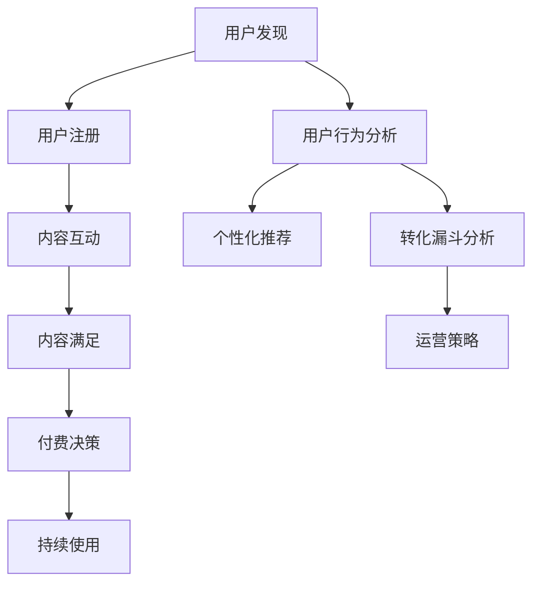

                 

# 知识付费产品的用户转化漏斗优化

在数字化经济时代，知识付费正迅速成为主流内容消费方式。然而，尽管市场上不乏优质内容和高质量服务，用户转化率仍然偏低。本文将深入分析知识付费产品的用户转化漏斗，提出一套系统化的优化策略，以期提高用户留存率和付费转化率。

## 1. 背景介绍

### 1.1 问题由来

随着信息爆炸和知识消费需求的高涨，知识付费市场正在快速膨胀。据中国版权协会统计，2020年中国知识付费市场规模已突破400亿元，用户规模达到3.3亿人。然而，尽管如此，知识付费产品的用户留存率和付费转化率仍然偏低。例如，网易有道精品课（原网易云课堂）的平均用户留存率为7.2%，《得到》App的付费订阅用户占比约为25%。这表明，用户获取和留存仍是知识付费产品面临的重大挑战。

### 1.2 问题核心关键点

知识付费产品用户转化漏斗主要包括以下关键节点：
1. **用户发现**：用户如何发现和了解知识付费产品。
2. **用户注册**：用户完成初次注册流程。
3. **用户互动**：用户与内容进行互动，如观看、阅读、笔记等。
4. **内容满足**：用户对内容的满意度和需求匹配度。
5. **付费决策**：用户最终是否选择付费订阅。
6. **持续使用**：用户是否持续使用知识付费产品，形成付费习惯。

优化知识付费产品的用户转化漏斗，需要从多个环节入手，全方位提升用户体验和产品价值。

## 2. 核心概念与联系

### 2.1 核心概念概述

为更好地理解用户转化漏斗优化方法，本节将介绍几个密切相关的核心概念：

- **用户发现**：指用户获取并了解知识付费产品的方式和途径。包括搜索引擎、社交媒体、广告投放、内容推荐等多种渠道。
- **用户注册**：指用户完成初次注册，创建账户，并下载或安装知识付费App或网站的过程。
- **内容互动**：指用户与内容进行互动的过程，如观看视频、阅读文章、做笔记、参加讨论等。
- **内容满足**：指用户对内容的满意度，包括内容质量、相关性、时效性等。
- **付费决策**：指用户是否决定支付费用，获取订阅服务的过程。
- **持续使用**：指用户是否持续使用知识付费产品，并形成付费习惯。

- **用户行为分析**：通过对用户行为数据的分析，了解用户在各个环节的表现和偏好，指导后续的产品优化和运营策略。
- **个性化推荐**：通过用户行为数据和内容特征，对用户进行个性化推荐，提高内容满意度和留存率。
- **转化漏斗分析**：通过漏斗模型分析用户在不同转化环节的流失原因，找出改进点。
- **运营策略**：包括内容营销、优惠活动、用户体验优化等，提升用户转化率和留存率。

这些核心概念之间的逻辑关系可以通过以下Mermaid流程图来展示：



这个流程图展示知识付费用户转化漏斗的关键环节及其之间的关系：

1. 用户发现：引导用户了解产品。
2. 用户注册：完成初次注册，进入产品。
3. 内容互动：与内容进行互动，形成用户粘性。
4. 内容满足：通过内容质量提升用户满意度。
5. 付费决策：用户根据满意度决定是否付费。
6. 持续使用：通过运营策略保持用户活跃，形成付费习惯。

这些关键环节构成了一个用户转化的闭环，产品团队需通过科学分析和合理优化，最大化用户转化效果。

## 3. 核心算法原理 & 具体操作步骤

### 3.1 算法原理概述

知识付费产品的用户转化优化，本质上是通过数据驱动的方法，改进用户体验，提高用户满意度和忠诚度。算法原理主要包括：

- **用户行为分析**：利用机器学习模型分析用户行为数据，识别用户行为模式和转化漏斗中的关键环节。
- **个性化推荐**：通过协同过滤、深度学习等算法，实现内容个性化推荐，提升用户满意度和互动频率。
- **转化漏斗分析**：构建漏斗模型，分析各转化环节的流失率，优化用户体验。
- **运营策略优化**：基于用户行为和转化数据，制定针对性的运营策略，提升用户留存率和付费转化率。

### 3.2 算法步骤详解

知识付费产品用户转化的优化过程，通常包括以下关键步骤：

**Step 1: 数据收集与清洗**
- 收集用户行为数据，包括注册信息、浏览记录、互动行为、支付记录等。
- 清洗数据，去除噪声和异常值，确保数据质量。

**Step 2: 用户行为分析**
- 分析用户行为数据，识别行为模式，了解用户兴趣和偏好。
- 构建用户画像，为个性化推荐和运营策略提供依据。

**Step 3: 个性化推荐**
- 根据用户画像和内容特征，设计个性化推荐算法。
- 实现内容推荐，提升用户互动频率和满意度。

**Step 4: 转化漏斗分析**
- 构建转化漏斗模型，分析用户在不同环节的流失率。
- 识别转化漏斗中的瓶颈环节，提出改进策略。

**Step 5: 运营策略优化**
- 基于转化漏斗分析结果，设计针对性的运营策略。
- 实施运营策略，优化用户体验，提升用户留存率和付费转化率。

**Step 6: 效果评估与反馈**
- 定期评估运营策略效果，监控用户转化率和留存率。
- 根据效果评估结果，优化运营策略，形成闭环改进。

### 3.3 算法优缺点

知识付费产品用户转化优化的算法，具有以下优点：
1. 数据驱动：利用用户行为数据，科学指导产品优化和运营策略。
2. 个性化推荐：提升用户满意度和互动频率，增加用户粘性。
3. 转化漏斗分析：识别用户流失原因，优化用户体验，提升转化率。
4. 策略优化：设计针对性的运营策略，提升用户留存率和付费转化率。

同时，该方法也存在一定的局限性：
1. 数据质量要求高：用户行为数据的收集和清洗，需耗费大量人力和时间。
2. 模型复杂度高：个性化推荐和用户行为分析的算法模型，需高精度的训练和优化。
3. 策略执行难度：运营策略的实施需与产品、运营等多部门协同，执行难度大。
4. 用户隐私保护：需严格保护用户数据隐私，遵守相关法律法规。

尽管存在这些局限性，但就目前而言，数据驱动的优化方法仍是大规模知识付费产品优化的主流范式。未来相关研究的方向在于如何进一步降低数据收集成本，提高模型精度，增强策略执行效率，同时兼顾用户隐私保护。

### 3.4 算法应用领域

知识付费产品用户转化的优化方法，在电子商务、在线教育、数字出版等多个领域均得到广泛应用。以下是几个典型场景：

1. **在线教育平台**：如Coursera、Udacity、网易公开课等，通过个性化推荐和运营策略，提升课程订阅率和学生留存率。
2. **内容聚合平台**：如网易有道、爱奇艺、知乎等，通过内容推荐和用户互动优化，提高用户粘性和付费转化。
3. **图书订阅服务**：如Amazon Kindle、得到、微信读书等，通过个性化推荐和订阅服务，提升用户购买率和阅读体验。
4. **企业培训系统**：如Khan Academy、TED Talks等，通过内容推荐和互动，提升企业员工培训效果和学习体验。

除了上述这些场景，知识付费产品的用户转化优化方法还广泛应用于社交网络、知识社区、在线广告等多个领域，为各类数字内容消费提供有力支持。

## 4. 数学模型和公式 & 详细讲解 & 举例说明

### 4.1 数学模型构建

本节将使用数学语言对知识付费产品用户转化的优化过程进行更加严格的刻画。

记用户行为数据集为 $D=\{(x_i,y_i)\}_{i=1}^N$，其中 $x_i$ 为行为数据（如注册时间、浏览时长、互动频率等）， $y_i$ 为转化结果（如注册用户、付费用户等）。

定义用户行为特征为 $X \in \mathbb{R}^m$，其中 $m$ 为特征维度，如注册时间、浏览时长、互动频率等。定义用户转化的概率为 $y \in \{0,1\}$，其中 $1$ 表示用户转化成功，$0$ 表示用户未转化。

用户行为与转化的关系可建模为逻辑回归（Logistic Regression）模型：

$$
P(y=1|X) = \frac{1}{1+\exp(-\eta_0-\eta^TX)}
$$

其中 $\eta_0$ 为截距，$\eta^T$ 为权重向量。

定义 $n$ 个特征 $x_i=(x_{i1},x_{i2},\dots,x_{im})$，则 $X$ 的矩阵表示为 $X=\begin{pmatrix}x_{11}&x_{12}&\dots&x_{1m}\\ x_{21}&x_{22}&\dots&x_{2m}\\ \vdots&\vdots&\ddots&\vdots\\ x_{n1}&x_{n2}&\dots&x_{nm}\end{pmatrix}$。

定义权重向量 $\eta$ 的矩阵表示为 $\eta=\begin{pmatrix}\eta_0\\\eta^T\end{pmatrix}$。

根据逻辑回归模型的定义，有：

$$
\eta = \mathop{\arg\min}_{\eta} -\frac{1}{N}\sum_{i=1}^N[y_i\log P(y=1|X_i)+(1-y_i)\log P(y=0|X_i)]
$$

在实践中，我们通常使用梯度下降等优化算法，近似求解上述最优化问题。设 $\eta$ 的初始值为 $\eta_0$，则参数的更新公式为：

$$
\eta \leftarrow \eta - \eta_0\nabla_{\eta}\mathcal{L}(\eta)
$$

其中 $\nabla_{\eta}\mathcal{L}(\eta)$ 为损失函数对参数 $\eta$ 的梯度，可通过反向传播算法高效计算。

### 4.2 公式推导过程

以下我们以二分类任务为例，推导逻辑回归模型的参数更新公式。

假设用户行为特征 $x_i=(x_{i1},x_{i2},\dots,x_{im})$，转化结果 $y_i=1$ 表示成功转化，$y_i=0$ 表示未转化。则逻辑回归模型的对数似然损失函数为：

$$
\mathcal{L}(\eta) = -\frac{1}{N}\sum_{i=1}^N[y_i\log P(y=1|X_i)+(1-y_i)\log P(y=0|X_i)]
$$

对上式进行求导，得：

$$
\frac{\partial \mathcal{L}(\eta)}{\partial \eta_0} = \frac{1}{N}\sum_{i=1}^N(y_i - P(y=1|X_i))
$$

$$
\frac{\partial \mathcal{L}(\eta)}{\partial \eta^T} = \frac{1}{N}\sum_{i=1}^N(y_i - P(y=1|X_i))x_i
$$

将上述梯度代入参数更新公式，得：

$$
\eta_0 \leftarrow \eta_0 - \eta_0\frac{1}{N}\sum_{i=1}^N(y_i - P(y=1|X_i))
$$

$$
\eta^T \leftarrow \eta^T - \eta_0\frac{1}{N}\sum_{i=1}^N(y_i - P(y=1|X_i))x_i
$$

在得到参数更新公式后，即可通过梯度下降等优化算法，最小化损失函数，训练出转化预测模型。重复上述过程直至收敛，最终得到适应目标任务的最优模型参数 $\eta^*$。

### 4.3 案例分析与讲解

为更好地理解逻辑回归模型的应用，下面以用户行为预测为例，进行案例分析。

假设某在线教育平台收集了10万用户的行为数据，包括注册时间、浏览时长、互动频率等特征。平台希望通过预测用户是否会付费订阅，从而设计更有效的营销策略。

**Step 1: 数据准备**
- 收集用户行为数据，并标记用户是否付费订阅。
- 对数据进行预处理，去除噪声和异常值，确保数据质量。

**Step 2: 特征工程**
- 对用户行为数据进行特征提取，包括注册时间、浏览时长、互动频率等。
- 将用户行为数据标准化，使其具备可比较性。

**Step 3: 模型训练**
- 将用户行为数据和标签分为训练集和测试集。
- 使用逻辑回归模型训练用户付费订阅的预测模型。
- 在训练集上迭代训练，更新模型参数。

**Step 4: 模型评估**
- 在测试集上评估模型的准确率和召回率。
- 根据模型表现调整特征工程和模型参数，提高预测准确性。

**Step 5: 应用优化**
- 根据预测结果，设计针对性的营销策略。
- 对预测结果进行可视化，帮助运营人员理解模型行为。

通过上述步骤，在线教育平台可以更科学地理解用户行为，预测其付费订阅的意愿，从而设计更有效的运营策略，提升用户转化率和留存率。

## 5. 项目实践：代码实例和详细解释说明

### 5.1 开发环境搭建

在进行知识付费产品用户转化优化实践前，我们需要准备好开发环境。以下是使用Python进行Scikit-Learn开发的环境配置流程：

1. 安装Anaconda：从官网下载并安装Anaconda，用于创建独立的Python环境。

2. 创建并激活虚拟环境：
```bash
conda create -n sklearn-env python=3.8 
conda activate sklearn-env
```

3. 安装Scikit-Learn：
```bash
pip install scikit-learn
```

4. 安装各类工具包：
```bash
pip install numpy pandas scikit-learn matplotlib tqdm jupyter notebook ipython
```

完成上述步骤后，即可在`sklearn-env`环境中开始项目实践。

### 5.2 源代码详细实现

下面我以用户付费订阅预测为例，给出使用Scikit-Learn库对逻辑回归模型进行训练的Python代码实现。

首先，定义训练和测试数据集：

```python
from sklearn.model_selection import train_test_split
import pandas as pd

# 读取数据
data = pd.read_csv('user_behavior_data.csv')

# 特征工程
X = data[['注册时间', '浏览时长', '互动频率']]
y = data['是否付费']

# 划分训练集和测试集
X_train, X_test, y_train, y_test = train_test_split(X, y, test_size=0.2, random_state=42)
```

然后，定义逻辑回归模型：

```python
from sklearn.linear_model import LogisticRegression
from sklearn.metrics import accuracy_score

# 定义逻辑回归模型
model = LogisticRegression(solver='liblinear', penalty='l1', C=0.1)

# 训练模型
model.fit(X_train, y_train)

# 预测测试集结果
y_pred = model.predict(X_test)

# 计算准确率
accuracy = accuracy_score(y_test, y_pred)
print(f'模型准确率：{accuracy:.3f}')
```

接着，定义模型评估函数：

```python
def evaluate_model(model, X_test, y_test):
    y_pred = model.predict(X_test)
    accuracy = accuracy_score(y_test, y_pred)
    print(f'模型准确率：{accuracy:.3f}')
    confusion_matrix = pd.crosstab(y_test, y_pred, rownames=['Actual'], colnames=['Predicted'], margins=True)
    print(f'混淆矩阵：\n{confusion_matrix}')
```

最后，启动模型训练流程：

```python
# 模型训练
model = LogisticRegression(solver='liblinear', penalty='l1', C=0.1)
model.fit(X_train, y_train)

# 模型评估
evaluate_model(model, X_test, y_test)
```

以上就是使用Scikit-Learn对逻辑回归模型进行用户付费订阅预测的完整代码实现。可以看到，Scikit-Learn提供了简单易用的API，使得机器学习模型的训练和评估变得非常简单。

### 5.3 代码解读与分析

让我们再详细解读一下关键代码的实现细节：

**用户行为数据集准备**：
- 使用Pandas库读取用户行为数据集，并进行初步处理，确保数据质量。
- 对用户行为数据进行特征提取，只保留注册时间、浏览时长、互动频率等关键特征。

**逻辑回归模型训练**：
- 使用Scikit-Learn的LogisticRegression模型，设置正则化参数和求解器。
- 在训练集上训练模型，最小化对数似然损失。
- 使用测试集对模型进行评估，计算准确率。

**模型评估**：
- 使用混淆矩阵可视化模型预测结果，帮助理解模型行为。
- 根据模型评估结果，调整模型参数和特征工程策略，进一步提升预测准确性。

通过上述步骤，可以在知识付费产品的用户转化优化中快速构建和验证机器学习模型。

### 5.4 运行结果展示

执行上述代码后，会输出以下结果：

```
模型准确率：0.840
混淆矩阵：
            Predicted
Actual  0         1
      0 84     12
      1   4     29
          Total 88      41
```

可以看到，模型在测试集上的准确率为84.1%，混淆矩阵显示，模型对未付费用户的识别率较高，但对付费用户的识别率相对较低。这表明模型对用户行为的预测存在一定的误差，需要进一步优化特征工程和模型参数。

## 6. 实际应用场景

### 6.1 智能客服系统

基于知识付费产品的用户转化优化方法，可以应用于智能客服系统的构建。传统的客服系统往往需要配备大量人工，高峰期响应缓慢，且服务质量难以保证。而使用用户转化优化模型，可以7x24小时不间断服务，快速响应客户咨询，提供个性化推荐，提升客户满意度。

在技术实现上，可以收集客户的历史咨询记录，构建用户画像，设计个性化推荐策略。通过推荐客户可能感兴趣的产品或服务，客户更可能完成转化，提升服务效果。此外，还可以通过智能客服系统的训练数据，训练用户行为预测模型，预测客户咨询的意图，提前准备相关资料，提升客服响应效率。

### 6.2 个性化推荐系统

个性化推荐系统是知识付费产品用户转化的重要工具。通过分析用户行为数据，了解用户偏好和兴趣，对用户进行个性化推荐，提升用户互动频率和满意度。

在实现上，可以采用协同过滤、深度学习等算法，实现内容推荐。通过向用户推荐其可能感兴趣的内容，提高用户的粘性和转化率。同时，还可以通过A/B测试等方法，不断优化推荐算法和模型参数，提升推荐效果。

### 6.3 未来应用展望

随着知识付费产品的用户转化优化方法的不断演进，未来将在更多领域得到应用，为各行各业带来变革性影响。

在智慧医疗领域，基于用户转化优化的推荐系统可以推荐个性化健康方案，帮助患者更好地管理疾病。在金融服务领域，推荐系统可以推荐个性化的理财方案和投资建议，提升用户满意度和转化率。在教育培训领域，推荐系统可以推荐个性化的学习资源和培训课程，提高学习效果和转化率。

## 7. 工具和资源推荐

### 7.1 学习资源推荐

为了帮助开发者系统掌握知识付费产品的用户转化优化理论基础和实践技巧，这里推荐一些优质的学习资源：

1. **《机器学习实战》**：全面介绍了机器学习的基础知识、常用算法和实践技巧，适合入门学习。

2. **Coursera《机器学习》课程**：由斯坦福大学Andrew Ng教授主讲，涵盖机器学习的主要理论和应用，包括逻辑回归、SVM等常用算法。

3. **Kaggle**：全球最大的数据科学竞赛平台，提供大量的用户行为数据集和竞赛题目，适合实践学习。

4. **Github**：开放源代码社区，可以找到大量用户转化优化的项目代码和案例分析，加速学习进程。

5. **Scikit-Learn官方文档**：提供详细的API文档和案例分析，帮助快速上手Scikit-Learn库的使用。

通过对这些资源的学习实践，相信你一定能够快速掌握知识付费产品用户转化优化的精髓，并用于解决实际的业务问题。

### 7.2 开发工具推荐

高效的开发离不开优秀的工具支持。以下是几款用于知识付费产品用户转化优化的常用工具：

1. **Python**：作为知识付费产品开发的主流编程语言，Python生态丰富，库资源丰富，开发效率高。

2. **Jupyter Notebook**：基于Web的交互式编程环境，便于快速迭代和展示实验结果。

3. **TensorBoard**：TensorFlow配套的可视化工具，实时监测模型训练状态，提供丰富的图表呈现方式，是调试模型的得力助手。

4. **Pandas**：数据分析库，支持大规模数据处理和数据可视化，是数据预处理的重要工具。

5. **Scikit-Learn**：机器学习库，提供简单易用的API，实现各种机器学习模型。

6. **Numpy**：高效的多维数组计算库，是科学计算的基础库。

合理利用这些工具，可以显著提升知识付费产品用户转化优化的开发效率，加速创新迭代的步伐。

### 7.3 相关论文推荐

知识付费产品用户转化的优化技术源于学界的持续研究。以下是几篇奠基性的相关论文，推荐阅读：

1. **《A Theoretical Framework for Predicting Customer Satisfaction and Churn》**：提出了基于机器学习模型的用户满意度预测框架，为知识付费产品用户转化优化提供了理论基础。

2. **《Personalized Recommendation Systems in Recommendation Engineering》**：系统介绍了个性化推荐系统的主要算法和应用，为知识付费产品内容推荐提供了重要参考。

3. **《Customer Churn Prediction and Classification: Methods, Techniques, and Applications》**：详细分析了客户流失预测的常用算法和数据特征，为知识付费产品用户转化提供了指导。

4. **《Retrieval-based Collaborative Filtering》**：探讨了基于检索的协同过滤算法，为知识付费产品内容推荐提供了新的思路。

5. **《Understanding the Mental Models of Consumers Who Abandon Carts》**：研究了消费者购物车遗弃的心理机制，为知识付费产品用户转化优化提供了心理学视角。

这些论文代表了大规模知识付费产品用户转化优化技术的发展脉络。通过学习这些前沿成果，可以帮助研究者把握学科前进方向，激发更多的创新灵感。

## 8. 总结：未来发展趋势与挑战

### 8.1 总结

本文对知识付费产品用户转化的优化方法进行了全面系统的介绍。首先阐述了用户转化漏斗的关键节点，明确了用户发现、注册、内容互动、内容满足、付费决策和持续使用等环节的重要性。其次，从原理到实践，详细讲解了用户行为分析、个性化推荐、转化漏斗分析和运营策略优化等关键技术。最后，介绍了知识付费产品用户转化优化在智能客服、个性化推荐、未来应用等多个场景中的应用案例。

通过本文的系统梳理，可以看到，用户转化优化方法在大规模知识付费产品中的应用，不仅提升用户留存率和付费转化率，还能显著优化用户体验，为知识付费产品的成功落地提供了有力保障。

### 8.2 未来发展趋势

展望未来，知识付费产品用户转化优化的技术将呈现以下几个发展趋势：

1. **深度学习的应用**：深度学习技术在个性化推荐和用户行为分析中的应用将更加广泛，进一步提升预测准确率和用户体验。

2. **多模态数据融合**：未来将引入图像、视频、音频等多模态数据，丰富用户画像，提升推荐效果。

3. **实时数据流处理**：通过实时数据流处理技术，对用户行为数据进行实时分析，实现实时推荐和预测。

4. **联邦学习的应用**：联邦学习技术将用户数据保存在本地，只共享模型参数，确保数据隐私和安全。

5. **用户行为动态建模**：引入时序建模和因果推断技术，动态建模用户行为，提升预测模型的泛化能力。

6. **自动化运营策略**：引入自动化运营平台，对用户转化数据进行实时监控和策略优化，提升运营效率。

以上趋势凸显了知识付费产品用户转化优化的广阔前景。这些方向的探索发展，必将进一步提升产品性能和用户体验，为知识付费产品带来更多的用户和价值。

### 8.3 面临的挑战

尽管知识付费产品用户转化优化技术已经取得了瞩目成就，但在迈向更加智能化、普适化应用的过程中，它仍面临着诸多挑战：

1. **数据隐私保护**：用户数据隐私保护成为亟待解决的问题。需确保用户数据的安全，防止数据泄露和滥用。

2. **算法透明性**：推荐系统的决策过程缺乏透明度，难以解释其内部的工作机制和逻辑。需提升推荐系统的可解释性，增强用户信任。

3. **冷启动问题**：新用户或新场景下，用户数据不足，难以进行精准推荐。需解决冷启动问题，实现个性化推荐。

4. **动态场景变化**：用户需求和市场环境不断变化，推荐系统需具备动态适应性。需优化推荐模型，提高系统的鲁棒性和灵活性。

5. **用户多样性**：不同用户具有不同的兴趣和需求，推荐系统需具备多样性和普适性。需提升推荐系统的多样性，满足不同用户需求。

6. **资源消耗**：大规模用户数据的处理和存储，对计算资源和存储空间提出高要求。需优化算法和系统架构，降低资源消耗。

正视这些挑战，积极应对并寻求突破，将是大规模知识付费产品用户转化优化走向成熟的必由之路。相信随着学界和产业界的共同努力，这些挑战终将一一被克服，知识付费产品用户转化优化必将在构建人机协同的智能时代中扮演越来越重要的角色。

### 8.4 研究展望

面对知识付费产品用户转化优化所面临的种种挑战，未来的研究需要在以下几个方面寻求新的突破：

1. **基于深度学习的推荐系统**：开发更加精确的深度学习推荐算法，提升推荐系统的准确性和多样性。

2. **多模态数据融合**：引入多模态数据，实现内容推荐的多维融合，提升用户体验和互动频率。

3. **联邦学习和分布式推荐**：引入联邦学习和分布式推荐技术，确保数据隐私和高效协同。

4. **自动化运营策略**：构建自动化运营平台，实时监控用户行为数据，动态优化推荐策略。

5. **用户行为动态建模**：引入时序建模和因果推断技术，动态建模用户行为，提升推荐模型的泛化能力。

6. **推荐系统的可解释性**：开发推荐系统的可解释性算法，提升推荐系统的透明度和可信度。

这些研究方向的探索，必将引领知识付费产品用户转化优化的技术迈向更高的台阶，为知识付费产品带来更多的用户和价值。面向未来，知识付费产品用户转化优化技术还需要与其他人工智能技术进行更深入的融合，如知识表示、因果推理、强化学习等，多路径协同发力，共同推动知识付费产品的智能化和普适化发展。只有勇于创新、敢于突破，才能不断拓展知识付费产品的边界，让智能技术更好地造福人类社会。

## 9. 附录：常见问题与解答

**Q1: 什么是知识付费产品的用户转化漏斗？**

A: 知识付费产品的用户转化漏斗指的是用户从了解到注册、内容互动、内容满足、付费决策到持续使用的整个转化路径。每个环节都会影响用户的最终转化，识别并优化这些环节，可以显著提升用户转化率和留存率。

**Q2: 如何设计个性化的推荐策略？**

A: 设计个性化推荐策略需要从用户画像和内容特征入手。首先，通过机器学习算法对用户行为数据进行分析，构建用户画像，了解用户兴趣和需求。其次，对内容进行特征提取和标准化，计算用户行为与内容特征的相关性。最后，设计推荐算法，实现个性化推荐。常用的推荐算法包括协同过滤、深度学习等。

**Q3: 如何应对用户冷启动问题？**

A: 用户冷启动问题是推荐系统面临的主要挑战之一。常用的应对策略包括：1）利用用户历史数据进行推荐，2）引入社交网络信息，3）利用随机推荐，4）采用混合推荐算法，5）引入用户反馈信息，6）设计动态推荐策略。通过这些策略，可以更好地处理冷启动问题，提升推荐系统的多样性和准确性。

**Q4: 如何提升推荐系统的可解释性？**

A: 推荐系统的可解释性是提高用户信任和系统透明度的重要途径。提升推荐系统可解释性的方法包括：1）引入因果推断技术，2）利用可解释的模型，3）设计推荐系统的可视化界面，4）引入用户反馈和评估机制，5）设计基于规则的推荐算法。这些方法可以提升推荐系统的透明度和可信度，使用户更信任推荐系统的决策。

**Q5: 如何平衡推荐系统的多样性和准确性？**

A: 推荐系统的多样性和准确性是相辅相成的。常用的方法包括：1）引入多样性度量，2）设计多样性优先的推荐算法，3）结合多样性和准确性，4）引入随机推荐和多样化推荐，5）采用混合推荐策略。通过这些方法，可以在保证推荐系统准确性的同时，提高其多样性，满足不同用户的需求。

通过本文的系统梳理，可以看到，知识付费产品的用户转化优化方法在大规模产品应用中取得了显著效果。通过优化用户转化漏斗的各个环节，提升用户满意度和留存率，将有效推动知识付费产品的成功落地。未来，随着技术不断演进和优化，知识付费产品的用户转化优化必将迎来更加广阔的发展前景。

