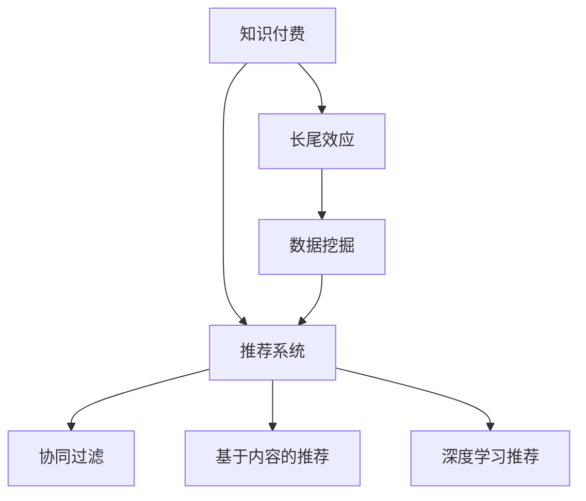

                 

# 知识付费内容的长尾效应利用策略

> 关键词：知识付费,长尾效应,数据挖掘,推荐系统,个性化,模型优化

## 1. 背景介绍

### 1.1 问题由来

在互联网时代，知识付费成为一种流行的信息获取方式。大量的专家、学者和从业者通过录制课程、撰写文章等方式提供专业知识，用户则通过订阅、购买等形式获取这些内容。然而，由于传统的单向信息传递模式，内容提供者往往难以精确了解用户需求，而用户也很难找到真正适合自己的高质量知识资源。这种供需错配，使得大量知识资源被埋没在信息海洋中，得不到有效利用。

### 1.2 问题核心关键点

长尾效应（Long Tail Effect），即在商品销售中，数量众多、但各种具体商品的小市场聚集起来所能产生的总收益，与少数热销商品相媲美甚至更大。在知识付费领域，长尾效应意味着通过个性化推荐，将冷门但高价值的内容精准推荐给特定用户，使这些小众资源也能产生商业价值。

为了利用长尾效应，需要构建一套高效的推荐系统，能够通过对用户行为数据的深度分析，识别出用户偏好和潜在需求，从而个性化地推荐合适的内容。在推荐系统中，利用数据挖掘和大规模模型训练，可以实现对用户、内容、关系等多个维度的综合分析，形成精确的个性化推荐结果。

### 1.3 问题研究意义

研究如何利用长尾效应，在知识付费平台中精准推荐用户感兴趣的知识内容，有助于：

1. 提高平台用户粘性，增加付费用户数量。
2. 挖掘长尾市场，提升平台的收入水平。
3. 优化用户体验，提高用户满意度。
4. 增强平台的竞争力，吸引更多优质内容提供者。

## 2. 核心概念与联系

### 2.1 核心概念概述

为了更系统地探讨长尾效应利用策略，首先需要明确以下几个核心概念：

- **知识付费**：用户通过付费获取高质量的个性化信息资源。常见的知识付费平台包括得到、新东方在线、Coursera等。
- **长尾效应**：市场销量分布遵循二八法则，即20%的热销商品带来80%的收益，而剩余80%的非热门商品合计带来的收益可能超过20%。长尾效应指出了那些非主流的小众商品的潜在市场。
- **推荐系统**：根据用户的历史行为和属性，推荐系统能预测用户可能感兴趣的内容。常见的推荐算法包括协同过滤、基于内容的推荐、深度学习推荐等。
- **个性化**：针对不同用户提供定制化的内容推荐，满足其独特需求。

这些核心概念之间的联系可以通过以下Mermaid流程图来展示：



这个流程图展示了大语言模型的核心概念及其之间的关系：

1. 知识付费平台通过推荐系统向用户提供个性化内容。
2. 推荐系统采用协同过滤、内容推荐、深度学习等算法进行用户行为分析。
3. 数据挖掘对用户、内容、关系等数据进行深入分析，为推荐算法提供支持。
4. 长尾效应揭示了非热门内容的市场价值，个性化推荐有助于挖掘这些小众市场。

## 3. 核心算法原理 & 具体操作步骤
### 3.1 算法原理概述

基于长尾效应利用策略的推荐系统，其核心思想是通过数据挖掘和大规模模型训练，精准预测用户对长尾内容的兴趣，从而进行个性化推荐。推荐过程一般包括以下几个步骤：

1. **数据收集**：收集用户的行为数据，如浏览、点击、购买、评论等。
2. **用户画像构建**：利用数据挖掘技术，构建用户兴趣特征，如用户的兴趣偏好、行为模式等。
3. **内容表示**：对内容进行特征提取，形成与用户兴趣特征相匹配的向量表示。
4. **相似度计算**：通过相似度计算，找到与用户兴趣最相似的内容。
5. **推荐列表生成**：结合用户画像和内容表示，生成个性化推荐列表。

### 3.2 算法步骤详解

以下以基于深度学习的推荐系统为例，详细讲解推荐过程。

**Step 1: 数据收集**
- 收集用户行为数据，如点击、浏览、评论等。
- 使用数据挖掘技术，提取用户的行为特征，如兴趣标签、点击次数、互动时长等。

**Step 2: 用户画像构建**
- 对用户行为数据进行聚类分析，提取用户兴趣点。
- 利用关联规则挖掘、协同过滤等算法，进一步提升用户画像的准确性。
- 使用用户画像生成工具（如Apache Mahout），构建详细的用户兴趣特征。

**Step 3: 内容表示**
- 对内容进行特征提取，生成高维稀疏向量。
- 使用TF-IDF、词袋模型、Word2Vec等方法，将文本内容转化为数值特征向量。
- 结合内容的元数据，如作者、发布时间、分类等，增强向量表示的丰富性。

**Step 4: 相似度计算**
- 基于余弦相似度、Jaccard相似度等计算方法，评估用户画像与内容向量之间的相似度。
- 利用在线协同过滤算法，实时计算并更新相似度矩阵。
- 结合用户的评分反馈，动态调整相似度计算权重。

**Step 5: 推荐列表生成**
- 通过加权求和等方法，计算每项内容与用户兴趣的相关性得分。
- 对得分进行排序，生成个性化推荐列表。
- 设置相关阈值，过滤低质量内容。

### 3.3 算法优缺点

基于长尾效应利用策略的推荐系统具有以下优点：

1. **个性化推荐**：能够精准识别用户需求，提供个性化内容推荐，提高用户满意度。
2. **长尾市场挖掘**：通过长尾效应，将小众内容纳入推荐列表，增加平台的收入来源。
3. **用户粘性提升**：个性化推荐能够提高用户粘性，增加平台的活跃度和付费用户数量。

同时，也存在一些局限性：

1. **冷启动问题**：对于新用户或未有过行为的少量用户，难以构建准确的画像，导致推荐效果不佳。
2. **数据质量依赖**：推荐系统的效果高度依赖于数据质量，低质量的标注数据可能影响推荐结果。
3. **计算成本高**：大规模模型训练和实时计算所需的高算力，可能对平台资源配置提出较高要求。

### 3.4 算法应用领域

基于长尾效应利用策略的推荐系统，广泛应用于以下领域：

- **知识付费平台**：如得到、新东方在线、Coursera等，通过精准推荐长尾内容，提升用户粘性和平台收入。
- **在线教育**：通过推荐个性化课程和资料，提高学生的学习效果。
- **新闻推荐**：如今日头条、腾讯新闻等，通过推荐个性化新闻内容，增加用户停留时间和广告收入。
- **电子商务**：如亚马逊、京东等，通过推荐个性化商品，提高转化率和销售额。
- **内容聚合平台**：如知乎、Medium等，通过推荐个性化文章和内容，提升用户参与度和平台影响力。

## 4. 数学模型和公式 & 详细讲解 & 举例说明
### 4.1 数学模型构建

本节将使用数学语言对基于长尾效应利用策略的推荐系统进行更加严格的刻画。

记用户集合为 $U$，内容集合为 $V$，用户的评分矩阵为 $R \in \mathbb{R}^{N\times M}$，其中 $N$ 为用户数量，$M$ 为内容数量。设用户 $u$ 对内容 $v$ 的评分为 $r_{uv}$，如果用户 $u$ 没有对内容 $v$ 进行评分，则 $r_{uv}=0$。

推荐系统的目标是最小化预测评分与实际评分之间的误差，可以使用均方误差（MSE）作为损失函数：

$$
\mathcal{L}(\hat{R},R) = \frac{1}{2N\cdot M} \sum_{u\in U}\sum_{v\in V} (r_{uv}-\hat{r}_{uv})^2
$$

其中 $\hat{r}_{uv}$ 为模型预测的评分。

### 4.2 公式推导过程

以下是基于深度学习的推荐系统的评分预测公式：

设用户 $u$ 的特征向量为 $x_u$，内容 $v$ 的特征向量为 $x_v$，则用户对内容的评分可以表示为：

$$
\hat{r}_{uv} = \hat{w}^T f(x_u, x_v)
$$

其中 $f$ 为特征映射函数，$\hat{w}$ 为权重向量。通常使用多层感知器（MLP）或矩阵分解等方法来构建 $f$。

具体推导过程如下：

设 $x_u = \begin{bmatrix} x_{u1} \\ x_{u2} \\ \vdots \\ x_{um} \end{bmatrix}$，$x_v = \begin{bmatrix} x_{v1} \\ x_{v2} \\ \vdots \\ x_{vm} \end{bmatrix}$，$w = \begin{bmatrix} w_1 \\ w_2 \\ \vdots \\ w_m \end{bmatrix}$。

根据内积的定义，用户对内容的评分可以表示为：

$$
\hat{r}_{uv} = x_u^T W f(x_v)
$$

其中 $W$ 为权重矩阵，$f$ 为激活函数，如 sigmoid、tanh 等。

### 4.3 案例分析与讲解

以基于协同过滤的推荐系统为例，展示长尾效应利用策略的实际应用。

假设用户 $u$ 对内容 $v$ 的评分 $r_{uv}$ 为 4，模型的预测评分为 $\hat{r}_{uv}=4.5$。

协同过滤算法基于用户历史评分数据进行相似度计算，找到与 $u$ 兴趣相似的用户 $u'$，并计算 $u'$ 对 $v$ 的评分 $r_{u'v}$，然后将 $u'$ 的评分加权平均作为 $u$ 对 $v$ 的预测评分。

具体推导如下：

设用户 $u'$ 的特征向量为 $x_{u'}$，内容 $v$ 的特征向量为 $x_v$，则用户 $u'$ 对内容 $v$ 的评分可以表示为：

$$
\hat{r}_{u'v} = x_{u'}^T W f(x_v)
$$

根据协同过滤算法，用户 $u$ 对内容 $v$ 的预测评分可以表示为：

$$
\hat{r}_{uv} = \frac{1}{|\mathcal{U}_u|} \sum_{u' \in \mathcal{U}_u} \frac{r_{u'v}}{\sqrt{\hat{r}_{u'u}+\epsilon} \sqrt{\hat{r}_{uv}+\epsilon}}
$$

其中 $\epsilon$ 为平滑项，$\mathcal{U}_u$ 为与 $u$ 兴趣相似的用户集合。

## 5. 项目实践：代码实例和详细解释说明
### 5.1 开发环境搭建

在进行推荐系统开发前，我们需要准备好开发环境。以下是使用Python进行PyTorch开发的环境配置流程：

1. 安装Anaconda：从官网下载并安装Anaconda，用于创建独立的Python环境。

2. 创建并激活虚拟环境：
```bash
conda create -n pytorch-env python=3.8 
conda activate pytorch-env
```

3. 安装PyTorch：根据CUDA版本，从官网获取对应的安装命令。例如：
```bash
conda install pytorch torchvision torchaudio cudatoolkit=11.1 -c pytorch -c conda-forge
```

4. 安装相关库：
```bash
pip install torch pandas numpy scikit-learn torchmetrics
```

完成上述步骤后，即可在`pytorch-env`环境中开始推荐系统开发。

### 5.2 源代码详细实现

以下是基于深度学习的协同过滤推荐系统的完整代码实现。

```python
import torch
import torch.nn as nn
import torch.optim as optim
import pandas as pd
import numpy as np
from sklearn.metrics import mean_squared_error

# 加载数据
df = pd.read_csv('data/user_item_ratings.csv')

# 特征工程
X = df[['user', 'item']].to_numpy()
y = df['rating'].to_numpy()

# 定义模型
class CollaborativeFiltering(nn.Module):
    def __init__(self, n_users, n_items, embed_size):
        super(CollaborativeFiltering, self).__init__()
        self.W_u = nn.Parameter(torch.randn(n_users, embed_size))
        self.W_v = nn.Parameter(torch.randn(n_items, embed_size))
        self.W_r = nn.Parameter(torch.randn(1, embed_size))

    def forward(self, user, item):
        u = self.W_u[user]
        v = self.W_v[item]
        r = torch.sigmoid(torch.dot(u, v) + self.W_r)
        return r

# 定义损失函数
def loss_fn(pred, label):
    return nn.MSELoss()(pred, label)

# 训练函数
def train(model, optimizer, loader):
    model.train()
    losses = []
    for batch in loader:
        user, item, label = batch
        optimizer.zero_grad()
        pred = model(user, item)
        loss = loss_fn(pred, label)
        loss.backward()
        optimizer.step()
        losses.append(loss.item())
    return np.mean(losses)

# 评估函数
def evaluate(model, loader):
    model.eval()
    mse = 0
    for batch in loader:
        user, item, label = batch
        with torch.no_grad():
            pred = model(user, item)
        mse += nn.MSELoss()(pred, label).item()
    return np.sqrt(mse / len(loader.dataset))

# 读取数据
train_loader = torch.utils.data.DataLoader(X[:train_size], batch_size=batch_size)
val_loader = torch.utils.data.DataLoader(X[train_size:], batch_size=batch_size)

# 初始化模型和优化器
embed_size = 128
n_users, n_items = df['user'].nunique(), df['item'].nunique()
model = CollaborativeFiltering(n_users, n_items, embed_size)
optimizer = optim.Adam(model.parameters(), lr=0.001)

# 训练模型
for epoch in range(num_epochs):
    train_loss = train(model, optimizer, train_loader)
    val_mse = evaluate(model, val_loader)
    print(f'Epoch {epoch+1}, train loss: {train_loss:.4f}, val MSE: {val_mse:.4f}')

print('Model trained.')
```

### 5.3 代码解读与分析

让我们再详细解读一下关键代码的实现细节：

**CollaborativeFiltering类**：
- `__init__`方法：初始化模型的用户和内容嵌入向量，以及评分预测函数。
- `forward`方法：计算用户对内容的评分预测值。

**loss_fn函数**：
- 定义均方误差损失函数。

**train函数**：
- 遍历训练集，前向传播计算损失，反向传播更新模型参数，并记录损失。

**evaluate函数**：
- 在验证集上评估模型性能，计算均方误差。

**数据读取和模型训练**：
- 读取数据集，并进行特征工程。
- 定义模型和优化器。
- 训练模型，并在验证集上评估性能。

可以看到，PyTorch框架的灵活性和易用性，使得构建推荐系统变得非常简单。开发者只需关注业务逻辑和模型性能，其他细节交由框架处理，极大提升了开发效率。

## 6. 实际应用场景

### 6.1 智能推荐系统

基于长尾效应利用策略的推荐系统，能够精准推荐用户感兴趣的知识内容，显著提升用户体验。在智能推荐系统中，用户不仅可以快速找到热门内容，还能够发现更多冷门但高价值的长尾内容，实现个性化阅读和学习。

### 6.2 精准营销

在精准营销中，通过分析用户行为数据，识别出用户的兴趣点和购买意向，可以为其推荐合适的产品和服务。长尾效应能够帮助商家挖掘出更多未被市场发掘的小众需求，从而提升销售额和用户满意度。

### 6.3 个性化教育

在在线教育平台中，推荐系统能够根据学生的学习行为和兴趣，推荐适合的课程和资料。长尾效应能够帮助学生发现更多有趣且实用的学习资源，提高学习效果。

### 6.4 新闻推荐

在新闻推荐系统中，长尾效应能够帮助用户发现更多个性化、深度的新闻内容，提升用户的阅读体验。

### 6.5 商品推荐

在电子商务平台中，通过长尾效应推荐个性化商品，能够提高用户购买转化率，增加平台销售额。

### 6.6 个性化内容创作

在内容创作平台中，长尾效应能够帮助创作者发现更多用户感兴趣的选题和领域，提高内容的曝光率和互动率。

## 7. 工具和资源推荐
### 7.1 学习资源推荐

为了帮助开发者系统掌握长尾效应利用策略的理论基础和实践技巧，这里推荐一些优质的学习资源：

1. 《推荐系统实践》系列博文：由大模型技术专家撰写，深入浅出地介绍了推荐系统的原理、算法和工程实现。

2. Coursera《推荐系统》课程：由斯坦福大学开设的推荐系统课程，有Lecture视频和配套作业，带你入门推荐系统的基本概念和经典算法。

3. 《Recommender Systems: Text Mining and Statistical Learning》书籍：推荐系统领域的经典教材，详细介绍了推荐系统的数学原理和实际应用。

4. 《Handbook of Recommendation Systems》书籍：推荐系统领域的权威手册，涵盖推荐系统的各类算法和技术。

5. arXiv上的推荐系统相关论文：查阅最新研究成果，了解推荐系统领域的最新进展。

通过对这些资源的学习实践，相信你一定能够快速掌握长尾效应利用策略的精髓，并用于解决实际的推荐问题。

### 7.2 开发工具推荐

高效的开发离不开优秀的工具支持。以下是几款用于长尾效应利用策略开发推荐的常用工具：

1. PyTorch：基于Python的开源深度学习框架，灵活易用，适合快速迭代研究。

2. TensorFlow：由Google主导开发的开源深度学习框架，生产部署方便，适合大规模工程应用。

3. Scikit-learn：Python数据挖掘和机器学习库，包含各类经典算法和数据预处理工具。

4. TensorBoard：TensorFlow配套的可视化工具，实时监测模型训练状态，提供丰富的图表呈现方式。

5. Weights & Biases：模型训练的实验跟踪工具，记录和可视化模型训练过程中的各项指标，方便对比和调优。

6. Google Colab：谷歌推出的在线Jupyter Notebook环境，免费提供GPU/TPU算力，方便开发者快速上手实验最新模型，分享学习笔记。

合理利用这些工具，可以显著提升长尾效应利用策略推荐系统的开发效率，加快创新迭代的步伐。

### 7.3 相关论文推荐

长尾效应利用策略的研究源于学界的持续研究。以下是几篇奠基性的相关论文，推荐阅读：

1. Mahout: Scalable Recommendation Engines for Large Scale Datasets（Hadi Fanaee-T：Mahout项目介绍）：介绍Mahout项目的实现原理和推荐算法。

2. Matrix Factorization Techniques for Recommender Systems（David Goldberg）：综述了矩阵分解等经典推荐算法。

3. Recommender Systems Handbook（Yves Lapidis）：推荐系统领域的权威手册，涵盖推荐系统的各类算法和技术。

4. Improving Recommendation Systems Using Confirmatory Test Statistics（Hai D. Nguyen）：提出了一种结合验证统计和推荐系统的改进方法。

5. Recommender Systems for Intelligent Digital TV Services（Fotis Papapanagiotou）：介绍了推荐系统在智能数字电视中的应用。

这些论文代表了大语言模型微调技术的发展脉络。通过学习这些前沿成果，可以帮助研究者把握学科前进方向，激发更多的创新灵感。

## 8. 总结：未来发展趋势与挑战
### 8.1 总结

本文对基于长尾效应利用策略的推荐系统进行了全面系统的介绍。首先阐述了长尾效应在知识付费平台中的应用意义，明确了推荐系统在精准推荐长尾内容方面的独特价值。其次，从原理到实践，详细讲解了推荐系统的数学模型和关键步骤，给出了推荐任务开发的完整代码实例。同时，本文还广泛探讨了推荐系统在智能推荐、精准营销、个性化教育等多个行业领域的应用前景，展示了长尾效应利用策略的巨大潜力。此外，本文精选了推荐系统的各类学习资源，力求为读者提供全方位的技术指引。

通过本文的系统梳理，可以看到，基于长尾效应利用策略的推荐系统正在成为知识付费平台的重要范式，极大地拓展了长尾内容的商业价值，提升了用户粘性和平台收入。未来，伴随推荐算法的不断演进和优化，推荐系统必将进一步提高精准度，挖掘出更多冷门但高价值的内容，推动知识付费平台的繁荣发展。

### 8.2 未来发展趋势

展望未来，长尾效应利用策略的推荐系统将呈现以下几个发展趋势：

1. **深度学习推荐**：利用深度神经网络构建推荐模型，可以捕捉更为复杂的用户行为和兴趣，提升推荐效果。
2. **联合推荐**：结合协同过滤和内容推荐等算法，构建更加综合的推荐模型，实现冷启动和低质量用户的行为预测。
3. **在线学习**：利用在线学习算法，实时更新模型参数，适应数据分布变化，提升推荐系统的鲁棒性和时效性。
4. **多模态推荐**：结合文本、图片、音频等多模态数据，提升推荐系统的丰富性和多样性。
5. **可解释性增强**：通过解释推荐模型的决策过程，提升用户对推荐结果的信任度，满足监管需求。
6. **知识图谱融合**：将推荐系统与知识图谱进行融合，利用图谱中丰富的关系信息，提升推荐精度。

这些趋势凸显了长尾效应利用策略的推荐系统的广阔前景。这些方向的探索发展，必将进一步提升推荐系统的性能和应用范围，为知识付费平台带来新的活力。

### 8.3 面临的挑战

尽管长尾效应利用策略的推荐系统已经取得了瞩目成就，但在迈向更加智能化、普适化应用的过程中，它仍面临着诸多挑战：

1. **数据隐私问题**：用户行为数据的收集和使用，可能涉及隐私泄露，如何保障用户数据安全是一个重要问题。
2. **冷启动问题**：对于新用户或未有过行为的少量用户，难以构建准确的画像，导致推荐效果不佳。
3. **数据质量问题**：推荐系统的效果高度依赖于数据质量，低质量的标注数据可能影响推荐结果。
4. **计算成本高**：大规模模型训练和实时计算所需的高算力，可能对平台资源配置提出较高要求。
5. **可解释性问题**：推荐模型的决策过程难以解释，用户难以理解推荐结果的来源和逻辑。
6. **公平性问题**：推荐系统可能存在偏见，不同用户或内容间可能存在不平等推荐，需要设计公平性保障机制。

### 8.4 研究展望

面对长尾效应利用策略推荐系统所面临的种种挑战，未来的研究需要在以下几个方面寻求新的突破：

1. **多模态数据融合**：结合文本、图片、音频等多模态数据，提升推荐系统的丰富性和多样性。
2. **用户画像构建**：利用关联规则挖掘、协同过滤等算法，进一步提升用户画像的准确性。
3. **推荐系统优化**：利用在线协同过滤算法，实时计算并更新相似度矩阵，提升推荐系统性能。
4. **公平性研究**：设计公平性保障机制，避免推荐系统中的偏见和歧视。
5. **隐私保护**：采用隐私保护技术，保障用户数据安全和隐私。

这些研究方向的探索，必将引领长尾效应利用策略推荐系统迈向更高的台阶，为知识付费平台带来新的活力。相信随着学界和产业界的共同努力，这些挑战终将一一被克服，推荐系统必将进一步提升推荐精准度，挖掘更多长尾内容，推动知识付费平台的繁荣发展。

## 9. 附录：常见问题与解答

**Q1：长尾效应利用策略推荐系统是否适用于所有知识付费平台？**

A: 长尾效应利用策略推荐系统在大多数知识付费平台中都能取得不错的效果，特别是对于数据量较小的平台。但对于一些特定领域的平台，如医学、法律等，仅仅依靠通用语料预训练的模型可能难以很好地适应。此时需要在特定领域语料上进一步预训练，再进行推荐，才能获得理想效果。此外，对于一些需要时效性、个性化很强的平台，如实时新闻推荐等，推荐系统也需要针对性的改进优化。

**Q2：推荐系统如何处理冷启动问题？**

A: 冷启动问题是指对于新用户或未有过行为的少量用户，难以构建准确的画像，导致推荐效果不佳。常见的处理方式包括：

1. 利用用户的人口统计特征、设备信息等进行预训练，提升用户画像的准确性。
2. 结合协同过滤和内容推荐等算法，综合用户行为和内容属性，生成推荐列表。
3. 引入深度学习模型，通过自适应学习，快速适应新用户的行为模式。
4. 利用数据增强技术，增加少量用户的标注样本，加速模型训练。

这些方式可以灵活组合，根据具体平台的需求和数据特征进行优化。

**Q3：如何提高推荐系统的数据质量？**

A: 推荐系统的效果高度依赖于数据质量，低质量的标注数据可能影响推荐结果。常见的提高数据质量的方式包括：

1. 数据清洗：去除噪音数据、重复数据等，提升数据质量。
2. 数据标注：增加标注数据量和标注质量，确保数据的准确性和代表性。
3. 数据预处理：利用数据挖掘技术，提取用户行为和内容特征，提升数据特征的丰富性。
4. 数据增强：通过数据合成、回译等方式扩充训练集，增加数据量。

这些方式可以有效提高推荐系统的数据质量，提升推荐效果。

**Q4：推荐系统如何实现多模态数据融合？**

A: 多模态数据融合是指结合文本、图片、音频等多模态数据，提升推荐系统的丰富性和多样性。常见的处理方式包括：

1. 特征提取：将不同模态的数据提取成数值特征，形成统一的数据格式。
2. 数据融合：将不同模态的数据进行融合，生成综合的特征向量。
3. 模型融合：将多个推荐模型进行融合，形成综合的推荐结果。
4. 联合训练：利用联合训练技术，同时训练多个推荐模型，提升模型的综合能力。

这些方式可以灵活组合，根据具体平台的需求和数据特征进行优化。

**Q5：推荐系统如何实现可解释性增强？**

A: 推荐系统的决策过程难以解释，用户难以理解推荐结果的来源和逻辑。常见的增强方式包括：

1. 特征可视化：利用特征重要性排序，可视化推荐模型的决策过程。
2. 模型解释：利用模型解释技术，解释推荐模型的决策逻辑。
3. 用户反馈：收集用户对推荐结果的反馈，用于优化推荐模型。

这些方式可以有效增强推荐系统的可解释性，提升用户对推荐结果的信任度。

**Q6：推荐系统如何实现公平性保障？**

A: 推荐系统可能存在偏见，不同用户或内容间可能存在不平等推荐，需要设计公平性保障机制。常见的处理方式包括：

1. 数据清洗：去除含有偏见的数据，提升数据质量。
2. 模型公平性：利用公平性约束技术，避免推荐系统中的偏见和歧视。
3. 用户反馈：收集用户对推荐结果的反馈，用于优化推荐模型。
4. 模型监控：实时监控推荐系统的公平性，及时发现并纠正偏见问题。

这些方式可以灵活组合，根据具体平台的需求和数据特征进行优化。

总之，长尾效应利用策略推荐系统需要在数据质量、冷启动、可解释性、公平性等方面进行不断优化，才能真正实现个性化推荐，提升用户体验和平台价值。

---

作者：禅与计算机程序设计艺术 / Zen and the Art of Computer Programming

