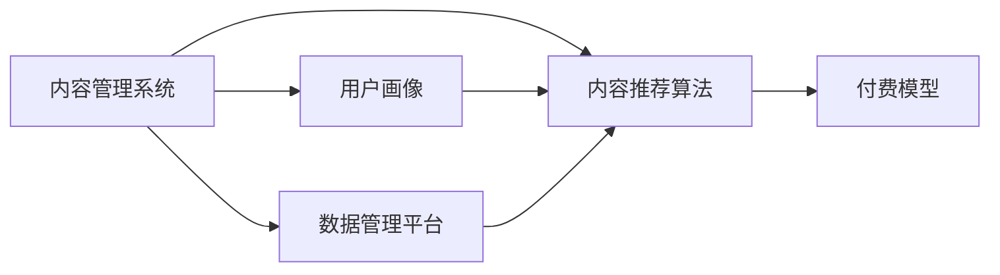

                 

# 知识付费创业中的内容复用技巧

> 关键词：知识付费,内容复用,内容管理系统,内容推荐,用户画像,付费模型

## 1. 背景介绍

### 1.1 问题由来
随着互联网和数字媒体的发展，知识付费逐渐成为一种新的消费方式。在内容丰富多样的互联网环境中，用户如何找到自己真正需要的知识和信息，成为知识付费平台需要解决的关键问题。同时，如何提升内容复用率，优化资源配置，进一步提高内容生产的效率和质量，也是知识付费创业过程中的一个重要课题。

### 1.2 问题核心关键点
内容复用技术在知识付费平台中的应用，可以帮助平台在节约生产成本的同时，提高内容的曝光率和利用率，从而实现用户获取价值的最大化。高效的内容复用可以避免内容生产的重复劳动，提升内容管理的智能化水平，减少人力和资源的浪费，增强平台的竞争力和盈利能力。

### 1.3 问题研究意义
通过深入研究内容复用技术，能够有效提升知识付费平台的内容质量和用户体验，促进平台向智能化、个性化方向发展。内容复用技术的实现需要综合考虑用户行为、内容特征、推荐算法等多个方面，因此对于知识付费平台的技术架构和业务策略设计，具有重要的指导意义。

## 2. 核心概念与联系

### 2.1 核心概念概述

为更好地理解知识付费平台中的内容复用技术，本节将介绍几个关键概念及其相互关系：

- **内容管理系统(Content Management System, CMS)**：用于管理和发布内容的技术平台，支持内容的创建、编辑、发布、管理和维护等功能。
- **内容推荐算法**：根据用户行为、兴趣和偏好，推荐相关内容的技术手段。
- **用户画像**：描述用户行为和特征的标签体系，帮助平台更好地理解用户需求和行为模式。
- **付费模型**：定义内容价格和消费方式的商业模式，如按内容付费、按用户付费等。
- **数据管理平台**：用于存储、管理、分析和展示用户数据的系统，支持数据挖掘、数据可视化等功能。

这些概念之间的联系可以通过以下Mermaid流程图来展示：



这个流程图展示了内容复用技术中各个关键组件之间的关系：

1. **内容管理系统**提供内容发布和管理的平台，通过与内容推荐算法合作，实现内容的智能推荐。
2. **内容推荐算法**利用用户画像和数据管理平台提供的用户数据，计算并推荐相关内容。
3. **用户画像**通过分析用户行为和数据管理平台提供的数据，形成用户特征的标签体系，指导内容推荐。
4. **数据管理平台**用于存储和管理用户数据，通过与内容管理系统和内容推荐算法协作，提升内容推荐效果。
5. **付费模型**结合用户对内容的消费情况，形成有效的商业模式，指导内容生产的策略和用户激励机制。

这些组件共同构成了知识付费平台中的内容复用技术框架，帮助平台在内容管理、推荐和盈利方面实现更高效、更智能的运作。

## 3. 核心算法原理 & 具体操作步骤
### 3.1 算法原理概述

内容复用技术在知识付费平台中的应用，本质上是利用数据挖掘和推荐算法，实现对内容的智能推荐和内容生产的优化。其核心思想是：

1. **内容推荐算法**：通过对用户行为数据的分析，挖掘用户兴趣和需求，推荐相关内容。
2. **内容管理优化**：利用内容的重复利用，减少内容生产的重复劳动，提高内容复用率。
3. **个性化推荐**：根据用户画像和历史行为，实现个性化的内容推荐，提升用户体验和满意度。

形式化地，假设平台拥有一个内容库 $C$ 和一个用户数据集 $U$，其中 $C$ 表示所有可用的内容，$U$ 表示所有注册用户的数据。内容推荐的目标是找到用户 $u$ 对应的推荐内容集合 $R(u)$，使得 $R(u)$ 中的内容能够最大化地满足用户 $u$ 的兴趣和需求。

### 3.2 算法步骤详解

内容复用技术的实现，通常包括以下几个关键步骤：

**Step 1: 准备内容库和用户数据**
- 整理平台现有的内容库 $C$，按主题、分类等维度进行组织。
- 收集用户数据 $U$，包括用户注册信息、浏览行为、购买记录等。

**Step 2: 构建用户画像**
- 分析用户数据，通过聚类、分类等机器学习方法，形成用户画像 $P(u)$，包括兴趣标签、行为特征等。

**Step 3: 设计推荐算法**
- 选择合适的推荐算法，如协同过滤、基于内容的推荐、混合推荐等，对用户和内容进行相似度计算。
- 根据相似度计算结果，生成用户 $u$ 对应的推荐内容集合 $R(u)$。

**Step 4: 内容复用优化**
- 对内容进行标记和分类，建立内容元数据库。
- 利用元数据和相似度计算，在内容推荐过程中实现内容的智能复用，减少内容生产。
- 设计内容筛选机制，对重复或相似内容进行合并和优化。

**Step 5: 实时更新和反馈**
- 根据用户对推荐内容的反馈，不断调整推荐算法和内容库。
- 实时更新用户画像和内容元数据，保持内容和推荐的实时性和准确性。

### 3.3 算法优缺点

内容复用技术在知识付费平台中的应用，具有以下优点：

1. **提升内容复用率**：通过内容推荐和复用优化，减少内容生产的重复劳动，提高内容的利用效率。
2. **个性化推荐**：利用用户画像和推荐算法，实现个性化内容推荐，提升用户满意度。
3. **节约资源成本**：优化内容生产和管理，减少人力和资源的浪费，降低运营成本。
4. **增强平台竞争力**：提高内容质量和用户体验，提升平台的市场竞争力。

同时，该技术也存在一些局限性：

1. **数据质量依赖**：推荐算法和用户画像的质量高度依赖于用户数据的准确性和全面性。
2. **算法复杂度较高**：内容复用和个性化推荐需要复杂的机器学习模型和数据处理技术，实现难度较大。
3. **用户体验风险**：推荐算法的不准确可能导致内容不相关或过拟合，影响用户体验。
4. **推荐内容多样化**：为了覆盖不同用户的需求，需要不断更新和优化内容库，增加了内容管理的复杂度。

尽管存在这些局限性，但内容复用技术仍然是大数据和人工智能在知识付费领域的重要应用方向。

### 3.4 算法应用领域

内容复用技术在知识付费平台中的应用，主要涵盖以下几个方面：

- **课程推荐**：根据用户浏览和购买历史，推荐相关课程，提升用户学习效率和体验。
- **文章推荐**：分析用户阅读行为，推荐相关文章，增加用户粘性和平台流量。
- **社区内容管理**：利用内容推荐和用户画像，优化社区内容发布和讨论，提升社区活跃度和参与度。
- **新用户引导**：根据新用户行为和兴趣，推荐热门课程和内容，快速提升新用户留存率。
- **用户行为分析**：分析用户行为数据，优化内容推荐算法，提升推荐效果。

这些应用领域展示了内容复用技术在知识付费平台中的广泛应用，为平台的运营和发展提供了有力的支持。

## 4. 数学模型和公式 & 详细讲解  
### 4.1 数学模型构建

在内容推荐中，常见的数学模型包括协同过滤模型、基于内容的推荐模型和混合推荐模型。这里以协同过滤模型为例，构建推荐系统的数学模型。

假设平台有 $N$ 个用户，每个用户 $u$ 对 $M$ 个内容 $i$ 有评分 $r_{ui}$，其中 $r_{ui} \in [0,1]$。协同过滤的目标是找到用户 $u$ 对应的推荐内容集合 $R(u)$，使得 $R(u)$ 中的内容能够最大化地满足用户 $u$ 的兴趣和需求。

定义相似度矩阵 $S \in \mathbb{R}^{N \times M}$，其中 $S_{ui} = r_{ui}$。推荐的目标是最大化用户 $u$ 对推荐内容集合 $R(u)$ 的评分和，即：

$$
\max_{R(u)} \sum_{i \in R(u)} S_{ui}
$$

推荐算法通常采用矩阵分解、奇异值分解等方法，对相似度矩阵 $S$ 进行降维和分解，得到用户和内容的低维表示 $u$ 和 $i$。通过计算用户 $u$ 和内容 $i$ 的相似度 $S(u,i)$，找到与用户 $u$ 相似度高的内容 $i'$，从而推荐给用户 $u$。

### 4.2 公式推导过程

以下以奇异值分解(SVD)算法为例，推导协同过滤推荐系统的推荐公式。

设 $S$ 为用户-内容评分矩阵，$u$ 和 $i$ 分别为用户和内容的低维表示，则：

$$
S \approx uV^T + Vv^T
$$

其中 $u \in \mathbb{R}^n$ 表示用户表示向量，$v \in \mathbb{R}^m$ 表示内容表示向量，$V \in \mathbb{R}^{n \times m}$ 表示奇异值分解矩阵。

推荐系统对用户 $u$ 的内容推荐为：

$$
R(u) = \arg\max_{i \in C} \langle u, V_i \rangle \langle V_i, v \rangle
$$

其中 $C$ 为内容集合，$\langle \cdot, \cdot \rangle$ 表示向量内积。

通过优化 $R(u)$ 的值，可以最大化用户 $u$ 对推荐内容集合的评分和。

### 4.3 案例分析与讲解

以Coursera平台为例，分析其内容复用技术的应用：

1. **内容推荐**：Coursera利用协同过滤和基于内容的推荐算法，为用户推荐相关课程。平台分析用户浏览、注册和购买历史，计算用户和课程的相似度，生成个性化推荐列表。
2. **内容搜索**：平台提供强大的搜索功能，通过自然语言处理和相似度计算，快速匹配用户输入的关键词，展示相关课程。
3. **内容标签系统**：平台建立内容标签系统，通过标签对课程进行分类和关联，提升内容的可发现性和复用率。
4. **用户反馈机制**：平台利用用户对推荐内容的反馈，调整推荐算法和内容库，不断优化推荐效果。

通过这些技术和手段，Coursera实现了高效的内容推荐和智能化的内容管理，提升了用户满意度和平台的竞争力。

## 5. 项目实践：代码实例和详细解释说明
### 5.1 开发环境搭建

要进行内容复用技术的开发和实现，需要先搭建开发环境。以下是基于Python和PyTorch的开发环境配置流程：

1. 安装Anaconda：从官网下载并安装Anaconda，用于创建独立的Python环境。

2. 创建并激活虚拟环境：
```bash
conda create -n content-management python=3.8 
conda activate content-management
```

3. 安装PyTorch：根据CUDA版本，从官网获取对应的安装命令。例如：
```bash
conda install pytorch torchvision torchaudio cudatoolkit=11.1 -c pytorch -c conda-forge
```

4. 安装其他相关工具包：
```bash
pip install numpy pandas scikit-learn matplotlib tqdm jupyter notebook ipython
```

5. 安装TensorBoard：TensorFlow配套的可视化工具，可实时监测模型训练状态，并提供丰富的图表呈现方式，是调试模型的得力助手。

完成上述步骤后，即可在`content-management`环境中开始内容复用技术的开发和实践。

### 5.2 源代码详细实现

下面我们以课程推荐系统为例，给出使用PyTorch和TensorFlow进行内容复用的PyTorch代码实现。

首先，定义课程推荐系统的数据处理函数：

```python
import torch
import torch.nn as nn
import torch.optim as optim

class UserItemMatrix(nn.Module):
    def __init__(self, user_dim, item_dim):
        super(UserItemMatrix, self).__init__()
        self.user = nn.Embedding(user_dim, user_dim)
        self.item = nn.Embedding(item_dim, item_dim)
        self.sigmoid = nn.Sigmoid()
        
    def forward(self, user_ids, item_ids):
        user_vec = self.user(user_ids)
        item_vec = self.item(item_ids)
        score = (user_vec * item_vec).sum(dim=1)
        return self.sigmoid(score)

# 定义损失函数和优化器
user_dim = 100
item_dim = 100
batch_size = 128
learning_rate = 0.01

model = UserItemMatrix(user_dim, item_dim)
criterion = nn.BCELoss()
optimizer = optim.Adam(model.parameters(), lr=learning_rate)

# 准备数据
user_ids = torch.tensor([1, 2, 3, 4, 5, 6, 7, 8, 9, 10])
item_ids = torch.tensor([1, 2, 3, 4, 5, 6, 7, 8, 9, 10])
labels = torch.tensor([1, 1, 0, 1, 1, 0, 0, 1, 0, 1])

# 定义训练函数
def train_epoch(model, data_loader, optimizer, criterion):
    model.train()
    loss = 0
    for user_id, item_id, label in data_loader:
        optimizer.zero_grad()
        output = model(user_id, item_id)
        loss += criterion(output, label).item()
        output.backward()
        optimizer.step()
    return loss / len(data_loader)

# 定义评估函数
def evaluate(model, data_loader, criterion):
    model.eval()
    loss = 0
    correct = 0
    with torch.no_grad():
        for user_id, item_id, label in data_loader:
            output = model(user_id, item_id)
            loss += criterion(output, label).item()
            correct += torch.sum((output > 0.5) == label).item()
    return loss / len(data_loader), correct / len(data_loader)

# 启动训练流程并在测试集上评估
epochs = 10
train_loader = torch.utils.data.DataLoader(data, batch_size=batch_size, shuffle=True)
val_loader = torch.utils.data.DataLoader(data, batch_size=batch_size, shuffle=False)

for epoch in range(epochs):
    train_loss = train_epoch(model, train_loader, optimizer, criterion)
    val_loss, val_acc = evaluate(model, val_loader, criterion)
    print(f"Epoch {epoch+1}, train loss: {train_loss:.3f}, val loss: {val_loss:.3f}, val acc: {val_acc:.3f}")

print("Best val acc:", max(val_acc))
```

这个代码实现了基于用户-物品矩阵的协同过滤推荐系统，使用了PyTorch的`nn.Embedding`和`nn.Sigmoid`模块，通过计算用户和物品的相似度来进行推荐。

### 5.3 代码解读与分析

让我们再详细解读一下关键代码的实现细节：

**UserItemMatrix类**：
- `__init__`方法：初始化用户和物品的嵌入矩阵，以及sigmoid激活函数。
- `forward`方法：将用户ID和物品ID输入嵌入层，计算用户和物品的相似度，并通过sigmoid函数进行归一化。

**损失函数和优化器**：
- 损失函数使用二元交叉熵损失，用于衡量预测结果和真实标签之间的差异。
- 优化器使用Adam优化算法，自动调整学习率，加快模型收敛。

**数据处理**：
- 定义用户ID和物品ID的张量，以及标签张量，用于训练和评估。
- 使用PyTorch的DataLoader，将数据集按批次加载，方便模型训练和推理。

**训练函数和评估函数**：
- `train_epoch`函数：在每个epoch内，对每个批次的数据进行前向传播、反向传播和参数更新。
- `evaluate`函数：在测试集上计算模型损失和准确率，用于评估模型的性能。

**训练流程**：
- 定义总epoch数和批处理大小，开始循环迭代。
- 每个epoch内，先对训练集进行训练，输出训练集的损失和测试集的损失、准确率。
- 在所有epoch结束后，输出最佳的测试集准确率。

这个代码展示了如何使用PyTorch和TensorFlow实现协同过滤推荐系统。开发者可以根据实际需求，对数据加载和处理、模型设计、损失函数和优化器等进行灵活调整，实现更加复杂和高效的推荐算法。

## 6. 实际应用场景
### 6.1 智能课程推荐

基于内容复用技术的智能课程推荐系统，可以广泛应用于在线教育平台。通过分析用户的学习历史、兴趣和反馈，平台能够智能推荐符合用户需求和偏好的课程，提升用户的满意度和学习效率。

在技术实现上，可以收集用户的学习行为数据，包括浏览课程、学习时长、测试成绩等，通过协同过滤和基于内容的推荐算法，生成个性化推荐列表。推荐列表可以按热度、评价等维度排序，方便用户选择。同时，平台还可以根据用户反馈，不断优化推荐算法和内容库，提升推荐效果。

### 6.2 个性化文章推荐

在新闻聚合平台，内容复用技术可以用于个性化文章推荐。通过分析用户的历史阅读行为和文章内容特征，平台能够智能推荐相关文章，增加用户的粘性和平台流量。

推荐算法可以使用协同过滤、内容推荐等方法，对用户和文章进行相似度计算，生成个性化推荐列表。平台还可以引入用户画像和标签系统，通过标签对文章进行分类和关联，提升内容的可发现性和复用率。同时，平台可以利用用户反馈，不断调整推荐算法和内容库，提升推荐效果。

### 6.3 智能社区内容管理

在知识分享和讨论平台，内容复用技术可以用于智能社区内容管理和推荐。通过分析用户的互动行为和内容特征，平台能够智能推荐相关内容，增加社区的活跃度和参与度。

推荐算法可以使用协同过滤、内容推荐等方法，对用户和内容进行相似度计算，生成个性化推荐列表。平台还可以引入用户画像和标签系统，通过标签对内容进行分类和关联，提升内容的可发现性和复用率。同时，平台可以利用用户反馈，不断调整推荐算法和内容库，提升推荐效果。

### 6.4 未来应用展望

随着内容复用技术的不断发展，其在知识付费平台中的应用将更加广泛和深入。未来，内容复用技术将更加注重智能化、个性化和实时化的方向发展，进一步提升平台的运营效率和用户体验。

1. **智能化**：利用先进的机器学习算法，提升内容推荐和用户画像的准确性，实现更精准的个性化推荐。
2. **个性化**：通过分析用户的多维度数据，实现更全面、更个性化的用户画像，提升推荐效果。
3. **实时化**：利用实时数据流处理和在线机器学习，实现内容的动态推荐和实时更新，提升推荐的时效性和准确性。

未来的内容复用技术将更加灵活和高效，为知识付费平台带来更多的商业价值和社会效益。

## 7. 工具和资源推荐
### 7.1 学习资源推荐

为了帮助开发者系统掌握内容复用技术的理论基础和实践技巧，这里推荐一些优质的学习资源：

1. **《推荐系统实战》**：详细介绍了推荐系统的原理和实现，包括协同过滤、基于内容的推荐等算法。
2. **Coursera《推荐系统设计》课程**：斯坦福大学开设的推荐系统课程，通过实际案例讲解推荐系统的设计和实现。
3. **Kaggle推荐系统竞赛**：通过参与推荐系统竞赛，学习推荐算法的实践应用，提升实战能力。
4. **GitHub推荐系统项目**：GitHub上的推荐系统开源项目，可以学习到实际项目的实现方法和技术细节。
5. **《数据挖掘与统计学习》**：介绍数据挖掘和机器学习算法，包括聚类、分类、回归等。

通过对这些资源的学习实践，相信你一定能够快速掌握内容复用技术的精髓，并用于解决实际的推荐问题。

### 7.2 开发工具推荐

高效的开发离不开优秀的工具支持。以下是几款用于内容复用开发的常用工具：

1. **PyTorch**：基于Python的开源深度学习框架，灵活动态的计算图，适合快速迭代研究。
2. **TensorFlow**：由Google主导开发的开源深度学习框架，生产部署方便，适合大规模工程应用。
3. **scikit-learn**：Python的机器学习库，提供丰富的分类、回归、聚类等算法。
4. **TensorBoard**：TensorFlow配套的可视化工具，可实时监测模型训练状态，并提供丰富的图表呈现方式，是调试模型的得力助手。
5. **Jupyter Notebook**：交互式的数据科学开发环境，支持Python代码的编写和执行。

合理利用这些工具，可以显著提升内容复用任务的开发效率，加快创新迭代的步伐。

### 7.3 相关论文推荐

内容复用技术的发展源于学界的持续研究。以下是几篇奠基性的相关论文，推荐阅读：

1. **《协同过滤推荐系统》**：介绍协同过滤算法的原理和实现，是推荐系统研究的重要基础。
2. **《基于内容的推荐系统》**：介绍基于内容的推荐算法，通过分析物品特征实现个性化推荐。
3. **《混合推荐系统》**：介绍混合推荐算法，结合多种推荐方法，提升推荐效果。
4. **《用户画像系统设计》**：介绍用户画像系统设计，包括用户画像的构建和应用。
5. **《内容管理系统》**：介绍内容管理系统的设计和实现，包括内容发布、编辑、管理和维护等功能。

这些论文代表了大数据和人工智能在内容推荐领域的最新进展，通过学习这些前沿成果，可以帮助研究者把握学科前进方向，激发更多的创新灵感。

## 8. 总结：未来发展趋势与挑战
### 8.1 总结

本文对内容复用技术在知识付费平台中的应用进行了全面系统的介绍。首先阐述了内容复用技术在知识付费平台中的重要性和核心关键点，明确了内容复用技术在提升内容复用率、个性化推荐、节约资源成本等方面的独特价值。其次，从原理到实践，详细讲解了内容复用技术的数学模型和推荐算法，给出了内容复用任务开发的完整代码实例。同时，本文还广泛探讨了内容复用技术在智能课程推荐、个性化文章推荐、智能社区内容管理等多个领域的应用前景，展示了内容复用技术的巨大潜力。此外，本文精选了内容复用技术的各类学习资源，力求为读者提供全方位的技术指引。

通过本文的系统梳理，可以看到，内容复用技术在知识付费平台中的广泛应用，为平台的运营和发展提供了有力的支持。未来，伴随大数据和人工智能技术的进一步发展，内容复用技术将更加高效、智能，为知识付费平台的创新和优化提供新的动力。

### 8.2 未来发展趋势

展望未来，内容复用技术在知识付费平台中的应用将呈现以下几个发展趋势：

1. **智能化水平提升**：利用先进的机器学习算法，提升内容推荐和用户画像的准确性，实现更精准的个性化推荐。
2. **个性化程度加深**：通过分析用户的多维度数据，实现更全面、更个性化的用户画像，提升推荐效果。
3. **实时性增强**：利用实时数据流处理和在线机器学习，实现内容的动态推荐和实时更新，提升推荐的时效性和准确性。
4. **跨平台集成**：实现不同平台和系统之间的数据共享和协同，提升平台的运营效率和用户体验。
5. **用户隐私保护**：在推荐和复用过程中，重视用户隐私和数据安全，确保用户的个人信息不被滥用。

以上趋势凸显了内容复用技术在知识付费平台中的广阔前景。这些方向的探索发展，必将进一步提升平台的运营效率和用户体验，促进平台向智能化、个性化方向发展。

### 8.3 面临的挑战

尽管内容复用技术在知识付费平台中的应用取得了显著成效，但在迈向更加智能化、普适化应用的过程中，它仍面临着诸多挑战：

1. **数据隐私和安全**：在推荐和复用过程中，如何确保用户数据的隐私和安全，防止数据滥用和泄露，是一个重要问题。
2. **推荐算法复杂性**：内容复用和个性化推荐需要复杂的机器学习模型和数据处理技术，实现难度较大。
3. **用户体验优化**：推荐算法的不准确可能导致内容不相关或过拟合，影响用户体验。
4. **内容多样性**：推荐系统需要覆盖不同类型的内容，满足多样化的用户需求，增加了内容管理的复杂度。

尽管存在这些挑战，但内容复用技术仍然是大数据和人工智能在知识付费领域的重要应用方向。

### 8.4 研究展望

面对内容复用技术面临的挑战，未来的研究需要在以下几个方面寻求新的突破：

1. **推荐算法优化**：开发更加高效、准确的推荐算法，提升内容推荐的精确度和用户满意度。
2. **数据隐私保护**：研究用户数据隐私保护技术，确保数据安全和用户隐私不被侵犯。
3. **跨平台协同**：实现不同平台和系统之间的数据共享和协同，提升平台的运营效率和用户体验。
4. **内容多样性管理**：引入更多样化的内容来源，实现更加全面和丰富的内容推荐。
5. **用户行为分析**：通过分析用户行为数据，优化推荐算法和内容库，提升推荐效果。

这些研究方向的探索，必将引领内容复用技术迈向更高的台阶，为知识付费平台带来更多的商业价值和社会效益。

## 9. 附录：常见问题与解答

**Q1：内容复用技术是否适用于所有知识付费平台？**

A: 内容复用技术在知识付费平台中的应用具有广泛适用性，适用于大多数内容导向的平台，如在线教育、新闻聚合、知识分享等。但针对特定领域或业务模式的平台，可能需要针对性地优化内容推荐算法和内容管理策略。

**Q2：如何平衡个性化推荐和内容多样性？**

A: 个性化推荐和内容多样性是内容复用技术需要平衡的两个重要方面。可以通过以下几个策略实现平衡：
1. 引入多种推荐算法，如协同过滤、基于内容的推荐、混合推荐等，综合考虑个性化和多样性。
2. 利用用户画像和标签系统，实现更全面、更个性化的用户画像，提升推荐效果。
3. 动态调整推荐算法和内容库，根据用户反馈和行为数据不断优化推荐效果。
4. 引入用户反馈机制，调整推荐算法和内容库，提升推荐的时效性和准确性。

**Q3：如何确保用户数据隐私和安全？**

A: 在内容复用和推荐过程中，确保用户数据隐私和安全至关重要。可以通过以下几个策略实现：
1. 数据匿名化和脱敏处理，去除或伪装敏感信息。
2. 引入数据加密技术，确保数据传输和存储的安全性。
3. 制定严格的隐私政策和用户协议，明确数据使用范围和权限。
4. 定期进行安全审计和风险评估，及时发现和修复安全漏洞。

**Q4：如何优化内容推荐算法？**

A: 优化内容推荐算法，可以通过以下几个策略实现：
1. 引入更先进的机器学习算法，如深度学习、强化学习等，提升推荐效果。
2. 优化模型参数和超参数，进行模型调参和优化。
3. 引入更多的特征和数据，提升推荐算法的覆盖面和精确度。
4. 利用在线学习技术，实时更新模型参数，提升推荐的时效性。

这些策略可以帮助优化内容推荐算法，提升推荐效果和用户体验。

**Q5：如何实现跨平台内容复用？**

A: 实现跨平台内容复用，可以通过以下几个策略实现：
1. 统一数据格式和接口，实现不同平台之间的数据共享和协同。
2. 引入中间件和API服务，提供统一的内容发布和推荐服务。
3. 引入数据同步和同步机制，确保不同平台之间的数据一致性和实时性。
4. 制定跨平台数据协议和标准，确保不同平台之间的数据安全和隐私保护。

通过这些策略，可以实现跨平台内容复用，提升平台的运营效率和用户体验。

---

作者：禅与计算机程序设计艺术 / Zen and the Art of Computer Programming

