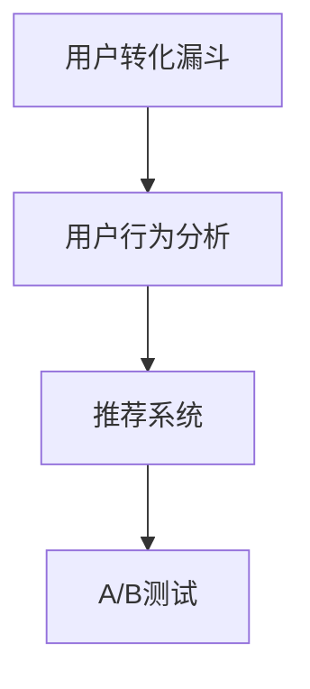

                 

# 知识付费创业中的用户转化策略

> 关键词：知识付费、用户转化、用户行为分析、推荐系统、转化漏斗、A/B测试

## 1. 背景介绍

### 1.1 问题由来
随着互联网的普及和智能手机的广泛使用，知识付费行业迎来了快速发展的黄金时期。越来越多的用户愿意为有价值的内容买单，知识付费平台如得到、喜马拉雅、慕课网等，都实现了用户和收入的快速增长。

然而，面对激烈的市场竞争和用户高度的不确定性，知识付费创业面临着诸多挑战：

1. **获取新用户成本高**：吸引和留存用户的成本逐年上升，如何高效获取新用户成为创业公司不得不面对的难题。
2. **用户流失率居高不下**：尽管部分用户已经付费，但由于内容质量、用户体验等问题，导致用户流失严重，续购率难以提升。
3. **推荐系统效果不佳**：用户购买行为复杂多样，传统的推荐系统难以精准预测用户需求，导致用户体验差，无法实现有效转化。
4. **用户行为分析困难**：现有数据平台功能有限，难以全面了解用户行为，难以通过数据分析精准营销。

### 1.2 问题核心关键点
为了解决上述问题，提升用户转化率，本节将围绕用户转化过程中的关键环节进行系统分析，通过构建知识付费用户转化漏斗，分析不同阶段用户的行为特征和转化障碍，提出针对性的策略和建议。

## 2. 核心概念与联系

### 2.1 核心概念概述

为更好地理解用户转化策略，本节将介绍几个关键概念及其联系：

- **用户转化漏斗(Conversion Funnel)**：指用户在知识付费平台上从新用户到忠实用户的转化流程，包括发现、了解、购买、使用、推荐等多个环节。
- **用户行为分析(Consumer Behavior Analysis)**：通过数据挖掘、机器学习等技术，分析用户行为特征和消费习惯，识别关键转化节点，为个性化营销和推荐提供依据。
- **推荐系统(Recommender System)**：基于用户行为数据，通过机器学习模型预测用户需求，推荐相关课程和内容，提升用户转化率。
- **A/B测试(A/B Testing)**：通过比较不同策略的实验效果，确定最优方案，优化用户体验和转化率。

这些概念之间的逻辑关系可以通过以下Mermaid流程图来展示：



这个流程图展示了几者之间的关系：

1. 用户转化漏斗是用户行为分析的主要研究对象。
2. 用户行为分析结果用于指导推荐系统的设计。
3. A/B测试可以帮助验证推荐系统的策略效果，进一步优化转化漏斗。

## 3. 核心算法原理 & 具体操作步骤

### 3.1 算法原理概述

知识付费平台的用户转化过程可以抽象为多个步骤，每个步骤都有其特定的转化目标和策略。基于此，我们将用户转化过程分为以下五个关键阶段，并分别介绍对应的算法原理：

1. **发现阶段(Discovery)**：用户首次接触知识付费平台，识别平台价值，决定是否注册。
2. **了解阶段(Knowledge)**：用户注册并浏览课程信息，了解课程内容和价值。
3. **购买阶段(Conversion)**：用户决定购买并完成支付。
4. **使用阶段(Utillization)**：用户订阅课程，并逐步使用课程内容。
5. **推荐阶段(Recommendation)**：平台通过推荐系统引导用户进行下一次购买。

### 3.2 算法步骤详解

#### 3.2.1 发现阶段

**算法原理**：发现阶段的核心目标是通过有效的市场推广手段吸引新用户。

**操作步骤**：

1. **渠道选择**：选择合适的推广渠道，如社交媒体、搜索引擎广告、内容营销等，确保渠道精准且成本可控。
2. **广告内容设计**：设计吸引人的广告文案和图片，简洁明了地展示平台价值和用户收益。
3. **用户行为监控**：通过数据分析监控广告效果，及时调整优化推广策略。

#### 3.2.2 了解阶段

**算法原理**：了解阶段的核心目标是让用户充分了解课程内容和价值。

**操作步骤**：

1. **课程推荐**：根据用户浏览行为和历史数据，推荐相关课程，引导用户深入了解。
2. **课程内容预览**：提供课程目录、预览视频、免费试听等，让用户初步体验课程内容。
3. **用户反馈收集**：通过调查问卷、评价反馈等方式，了解用户需求和体验，优化课程内容。

#### 3.2.3 购买阶段

**算法原理**：购买阶段的核心目标是促使用户完成支付。

**操作步骤**：

1. **价格优惠**：提供优惠券、团购折扣等激励措施，降低用户购买门槛。
2. **支付流程简化**：简化支付流程，支持多种支付方式，提升用户体验。
3. **用户反馈引导**：引导用户填写评价和反馈，激励用户进行二次购买。

#### 3.2.4 使用阶段

**算法原理**：使用阶段的核心目标是提高用户粘性，促进用户长期使用。

**操作步骤**：

1. **课程提醒**：定期推送课程更新和推荐，提醒用户使用。
2. **学习进度跟踪**：记录用户学习进度，通过数据分析预测用户活跃度。
3. **内容丰富化**：根据用户反馈，不断更新和丰富课程内容，提升用户体验。

#### 3.2.5 推荐阶段

**算法原理**：推荐阶段的核心目标是提高用户复购率，促进用户长期使用。

**操作步骤**：

1. **个性化推荐**：基于用户历史行为和偏好，推荐相关课程和内容。
2. **新用户推荐**：针对新用户提供专属推荐，引导其进行首次购买。
3. **优惠活动激励**：定期推出限时优惠和折扣活动，提升用户购买意愿。

### 3.3 算法优缺点

#### 3.3.1 优点

1. **高效获取新用户**：通过精准的市场推广和渠道优化，大幅降低获取新用户的成本。
2. **提升用户体验**：通过个性化推荐和内容优化，提高用户粘性，提升用户满意度。
3. **精准营销策略**：通过用户行为分析，制定针对性营销策略，优化转化漏斗。

#### 3.3.2 缺点

1. **数据隐私风险**：大量收集用户行为数据，存在隐私泄露的风险。
2. **模型误判风险**：推荐系统依赖于用户行为数据的准确性，一旦数据误判，可能导致用户体验差。
3. **市场变化风险**：市场和用户需求变化快，需要及时调整策略，保持动态优化。

### 3.4 算法应用领域

用户转化策略在大规模知识付费平台中得到了广泛应用，包括：

1. **得到**：通过精准广告和内容推荐，成功吸引了大量新用户，并实现了较高的用户留存率和复购率。
2. **喜马拉雅**：利用丰富的音频内容和多渠道推广，在竞争激烈的市场中保持领先地位。
3. **慕课网**：通过个性化课程推荐和社区互动，大幅提升了用户满意度和转化率。
4. **付费课程平台**：通过精准营销和高效转化策略，实现了快速的市场拓展和业务增长。

## 4. 数学模型和公式 & 详细讲解 & 举例说明

### 4.1 数学模型构建

本节将通过数学模型对知识付费平台的用户转化过程进行建模。

假设知识付费平台有 $N$ 个用户，每个用户有 $M$ 个可能的购买行为，即课程 $i$ 的购买概率为 $P_i$，则整个平台的用户转化模型可以表示为：

$$
P_{total} = \sum_{i=1}^{M} P_i
$$

用户购买行为可以通过以下逻辑回归模型进行预测：

$$
P_i = \frac{1}{1+\exp(-z_i)}
$$

其中 $z_i$ 为模型的线性预测值，可以通过以下线性回归模型计算：

$$
z_i = \mathbf{w} \cdot \mathbf{x}_i + b
$$

$\mathbf{w}$ 为模型权重，$\mathbf{x}_i$ 为特征向量，$b$ 为截距。

### 4.2 公式推导过程

以课程推荐为例，假设用户浏览课程 $j$ 的概率为 $P_j$，课程 $j$ 的特征向量为 $\mathbf{x}_j = (x_{j1}, x_{j2}, ..., x_{jn})$，模型的线性预测值为 $z_j = \mathbf{w} \cdot \mathbf{x}_j + b$，则课程 $j$ 的购买概率可以表示为：

$$
P_j = \frac{1}{1+\exp(-z_j)}
$$

用户购买课程的概率 $P$ 可以通过多个课程的联合概率计算得到：

$$
P = \sum_{j=1}^{M} P_j \cdot P(\text{其他课程未购买})
$$

### 4.3 案例分析与讲解

假设用户浏览课程 $j$ 的概率为 $P_j$，课程 $j$ 的特征向量为 $\mathbf{x}_j = (x_{j1}, x_{j2}, ..., x_{jn})$，模型的线性预测值为 $z_j = \mathbf{w} \cdot \mathbf{x}_j + b$，则用户购买课程的概率 $P$ 可以通过以下步骤进行计算：

1. 收集用户历史行为数据，构建特征向量 $\mathbf{x}_j$。
2. 通过线性回归模型训练得到权重 $\mathbf{w}$ 和截距 $b$。
3. 根据用户浏览行为，计算 $z_j = \mathbf{w} \cdot \mathbf{x}_j + b$。
4. 通过逻辑回归模型计算课程 $j$ 的购买概率 $P_j$。
5. 结合其他课程的未购买概率，计算用户购买课程的总概率 $P$。

通过这种方法，可以有效地预测用户购买行为，实现个性化课程推荐。

## 5. 项目实践：代码实例和详细解释说明

### 5.1 开发环境搭建

在进行用户转化策略开发前，我们需要准备好开发环境。以下是使用Python进行Scikit-Learn开发的环境配置流程：

1. 安装Anaconda：从官网下载并安装Anaconda，用于创建独立的Python环境。

2. 创建并激活虚拟环境：
```bash
conda create -n user_conversion python=3.8 
conda activate user_conversion
```

3. 安装Scikit-Learn：
```bash
conda install scikit-learn
```

4. 安装各类工具包：
```bash
pip install numpy pandas scikit-learn matplotlib tqdm jupyter notebook ipython
```

完成上述步骤后，即可在`user_conversion`环境中开始用户转化策略的实践。

### 5.2 源代码详细实现

下面我们以课程推荐为例，给出使用Scikit-Learn对知识付费用户转化进行预测的Python代码实现。

首先，定义特征选择和数据预处理函数：

```python
import pandas as pd
from sklearn.model_selection import train_test_split
from sklearn.feature_selection import SelectKBest, chi2
from sklearn.preprocessing import StandardScaler

def load_data(file_path):
    data = pd.read_csv(file_path)
    return data

def preprocess_data(data):
    # 特征选择
    features = SelectKBest(chi2, k=10).fit_transform(data[['feature1', 'feature2', 'feature3']], data['target'])
    # 数据标准化
    scaler = StandardScaler()
    features = scaler.fit_transform(features)
    # 数据集划分
    X_train, X_test, y_train, y_test = train_test_split(features, data['target'], test_size=0.2, random_state=42)
    return X_train, X_test, y_train, y_test
```

然后，定义模型训练和预测函数：

```python
from sklearn.linear_model import LogisticRegression
from sklearn.metrics import accuracy_score

def train_model(X_train, y_train):
    model = LogisticRegression()
    model.fit(X_train, y_train)
    return model

def predict(model, X_test):
    y_pred = model.predict(X_test)
    return y_pred

def evaluate(model, X_test, y_test):
    y_pred = predict(model, X_test)
    accuracy = accuracy_score(y_test, y_pred)
    return accuracy
```

最后，启动训练流程并在测试集上评估：

```python
# 加载数据
data = load_data('user_data.csv')

# 数据预处理
X_train, X_test, y_train, y_test = preprocess_data(data)

# 模型训练
model = train_model(X_train, y_train)

# 模型评估
accuracy = evaluate(model, X_test, y_test)
print(f'Accuracy: {accuracy:.2f}')
```

以上就是使用Scikit-Learn对知识付费用户转化进行预测的完整代码实现。可以看到，通过简单的数据处理和模型训练，就可以实现用户转化率的预测和优化。

### 5.3 代码解读与分析

让我们再详细解读一下关键代码的实现细节：

**load_data函数**：
- 加载用户数据，使用Pandas库解析CSV文件，得到数据集。

**preprocess_data函数**：
- 特征选择：使用卡方检验选择相关特征，构建特征向量。
- 数据标准化：使用StandardScaler对特征进行标准化处理。
- 数据集划分：使用train_test_split划分训练集和测试集。

**train_model函数**：
- 使用LogisticRegression训练逻辑回归模型，返回训练好的模型。

**predict函数**：
- 使用训练好的模型对测试集进行预测，返回预测结果。

**evaluate函数**：
- 计算预测结果和真实标签之间的准确率，返回准确率。

**训练流程**：
- 加载数据
- 数据预处理
- 模型训练
- 模型评估

可以看到，通过简短而有效的代码实现，就可以完成知识付费用户转化率的预测。

## 6. 实际应用场景

### 6.1 智能课程推荐

智能课程推荐系统是知识付费平台的核心功能之一。通过分析用户历史浏览数据和行为特征，推荐相关课程，提升用户转化率。具体实现如下：

1. **特征工程**：收集用户浏览行为数据，提取关键词、学习时长、付费行为等特征，构建特征向量。
2. **模型训练**：使用LogisticRegression或GBDT等算法，训练推荐模型。
3. **个性化推荐**：根据用户浏览记录和行为特征，实时推荐相关课程。

通过智能推荐系统，用户可以快速发现感兴趣的内容，提升购买意愿。同时，平台也可以根据用户反馈，优化推荐算法，提升推荐效果。

### 6.2 个性化订阅服务

个性化订阅服务是指根据用户行为和偏好，定期推送推荐课程和内容，提升用户粘性。具体实现如下：

1. **订阅策略设计**：根据用户购买记录和行为特征，设计订阅策略，如每日推荐、每周精选等。
2. **内容更新**：根据订阅策略，定期更新推荐内容，提升用户体验。
3. **用户反馈**：通过用户反馈，优化订阅策略，提升推荐效果。

通过个性化订阅服务，用户可以持续获取有价值的内容，提升平台黏性，提升用户转化率。

### 6.3 用户行为分析

用户行为分析是指通过数据挖掘技术，分析用户行为特征和消费习惯，识别关键转化节点，为个性化营销和推荐提供依据。具体实现如下：

1. **数据收集**：收集用户注册信息、购买记录、浏览行为等数据。
2. **行为分析**：使用机器学习算法，分析用户行为特征，识别关键节点。
3. **优化策略**：根据行为分析结果，制定个性化营销策略，提升用户转化率。

通过用户行为分析，平台可以全面了解用户需求和行为，优化推荐算法，提升用户体验和转化率。

### 6.4 未来应用展望

随着知识付费平台的不断发展，用户转化策略也在不断演进和优化。未来，用户转化策略将在以下几个方面继续发展：

1. **实时推荐系统**：通过实时分析用户行为数据，实现个性化推荐，提升用户体验和转化率。
2. **智能客服**：通过智能客服系统，提升用户服务体验，解决用户疑问，促进用户转化。
3. **多渠道推广**：通过多渠道推广，扩大市场覆盖，提升新用户获取效果。
4. **个性化订阅服务**：根据用户行为和偏好，提供更加个性化的订阅服务，提升用户粘性和转化率。
5. **数据驱动营销**：通过大数据分析，制定精准营销策略，提升用户转化效果。

这些新技术和新策略的引入，将进一步提升知识付费平台的竞争力和市场占有率。

## 7. 工具和资源推荐

### 7.1 学习资源推荐

为了帮助开发者系统掌握用户转化策略的理论基础和实践技巧，这里推荐一些优质的学习资源：

1. **《深度学习入门》**：提供深度学习基础和应用案例，适合入门学习。
2. **Coursera《机器学习》课程**：由斯坦福大学Andrew Ng教授主讲，涵盖机器学习基础知识和算法。
3. **Kaggle**：提供数据集和竞赛平台，适合实战学习和提升。
4. **《Python数据分析实战》**：提供数据分析和机器学习实战案例，适合进阶学习。
5. **《Python深度学习》**：介绍深度学习基础和实战应用，适合深度学习开发。

通过这些资源的学习实践，相信你一定能够快速掌握用户转化策略的精髓，并用于解决实际的NLP问题。

### 7.2 开发工具推荐

高效的开发离不开优秀的工具支持。以下是几款用于知识付费用户转化策略开发的常用工具：

1. **Python**：Python作为一门易学易用的编程语言，适合数据科学和机器学习开发。
2. **Pandas**：用于数据处理和分析的库，提供强大的数据操作功能。
3. **Scikit-Learn**：提供机器学习算法的库，适合各种分类、回归任务。
4. **TensorFlow**：用于深度学习开发的库，提供丰富的模型和工具。
5. **Keras**：提供高层次的深度学习API，适合快速开发和实验。
6. **Jupyter Notebook**：提供交互式开发环境，方便实时调试和展示。

合理利用这些工具，可以显著提升知识付费用户转化策略的开发效率，加快创新迭代的步伐。

### 7.3 相关论文推荐

用户转化策略的发展源于学界的持续研究。以下是几篇奠基性的相关论文，推荐阅读：

1. **《用户行为建模与推荐系统》**：介绍用户行为建模和推荐算法，提供系统性的理论基础。
2. **《个性化推荐系统》**：介绍个性化推荐算法，包括协同过滤、内容推荐等。
3. **《智能推荐系统》**：介绍智能推荐系统架构和实现，提供实战案例。
4. **《数据驱动的用户行为分析》**：介绍数据挖掘技术，提供用户行为分析方法。
5. **《实时推荐系统》**：介绍实时推荐系统架构和实现，提供最新的研究进展。

这些论文代表了大数据和机器学习领域的研究进展，通过学习这些前沿成果，可以帮助研究者把握学科前进方向，激发更多的创新灵感。

## 8. 总结：未来发展趋势与挑战

### 8.1 总结

本文对知识付费平台的用户转化策略进行了全面系统的介绍。首先阐述了用户转化过程中的关键环节，通过构建用户转化漏斗，分析不同阶段用户的行为特征和转化障碍，提出针对性的策略和建议。其次，从算法原理到实际操作，详细讲解了用户转化策略的核心步骤，给出了微调任务开发的完整代码实例。同时，本文还广泛探讨了用户转化策略在知识付费领域的应用前景，展示了其巨大的市场潜力。最后，精选了用户转化策略的学习资源、开发工具和相关论文，力求为读者提供全方位的技术指引。

通过本文的系统梳理，可以看到，用户转化策略在大规模知识付费平台中得到了广泛应用，为平台的快速增长和用户留存提供了重要保障。未来，伴随技术的不断发展，用户转化策略必将在知识付费领域带来更多创新和突破，为更多用户提供优质服务，提升平台竞争力。

### 8.2 未来发展趋势

展望未来，用户转化策略的发展趋势包括：

1. **个性化推荐系统**：通过深入分析用户行为和偏好，提供更加精准的推荐服务，提升用户体验和转化率。
2. **实时推荐系统**：通过实时分析用户行为数据，实现动态推荐，提升用户转化效果。
3. **智能客服系统**：通过智能客服系统，提升用户服务体验，解决用户疑问，促进用户转化。
4. **数据驱动营销**：通过大数据分析，制定精准营销策略，提升用户转化效果。
5. **多渠道推广**：通过多渠道推广，扩大市场覆盖，提升新用户获取效果。
6. **实时用户行为分析**：通过实时分析用户行为数据，及时调整优化推荐策略。

这些趋势凸显了用户转化策略的广阔前景。这些方向的探索发展，必将进一步提升知识付费平台的竞争力和市场占有率，为更多用户提供优质服务，提升平台竞争力。

### 8.3 面临的挑战

尽管用户转化策略已经取得了瞩目成就，但在迈向更加智能化、普适化应用的过程中，它仍面临着诸多挑战：

1. **数据隐私风险**：大量收集用户行为数据，存在隐私泄露的风险。
2. **模型误判风险**：推荐系统依赖于用户行为数据的准确性，一旦数据误判，可能导致用户体验差。
3. **市场变化风险**：市场和用户需求变化快，需要及时调整策略，保持动态优化。

### 8.4 研究展望

面对用户转化策略面临的种种挑战，未来的研究需要在以下几个方面寻求新的突破：

1. **探索无监督和半监督用户行为分析方法**：摆脱对大规模标注数据的依赖，利用自监督学习、主动学习等无监督和半监督范式，最大限度利用非结构化数据，实现更加灵活高效的推荐。
2. **研究参数高效和计算高效的推荐方法**：开发更加参数高效的推荐方法，在固定大部分预训练参数的情况下，只更新极少量的任务相关参数。同时优化推荐模型的计算图，减少前向传播和反向传播的资源消耗，实现更加轻量级、实时性的部署。
3. **融合因果和对比学习范式**：通过引入因果推断和对比学习思想，增强推荐系统建立稳定因果关系的能力，学习更加普适、鲁棒的用户行为表征，从而提升模型泛化性和抗干扰能力。
4. **引入更多先验知识**：将符号化的先验知识，如知识图谱、逻辑规则等，与推荐系统进行巧妙融合，引导推荐过程学习更准确、合理的用户行为表征。
5. **结合因果分析和博弈论工具**：将因果分析方法引入推荐系统，识别出模型决策的关键特征，增强输出解释的因果性和逻辑性。借助博弈论工具刻画人机交互过程，主动探索并规避推荐系统的脆弱点，提高系统稳定性。
6. **纳入伦理道德约束**：在推荐目标中引入伦理导向的评估指标，过滤和惩罚有偏见、有害的输出倾向。同时加强人工干预和审核，建立推荐系统的监管机制，确保输出符合人类价值观和伦理道德。

这些研究方向的探索，必将引领用户转化策略技术迈向更高的台阶，为构建安全、可靠、可解释、可控的推荐系统铺平道路。面向未来，用户转化策略还需要与其他人工智能技术进行更深入的融合，如知识表示、因果推理、强化学习等，多路径协同发力，共同推动知识付费平台的发展。只有勇于创新、敢于突破，才能不断拓展用户转化策略的边界，让智能技术更好地造福人类社会。

## 9. 附录：常见问题与解答

**Q1：知识付费平台如何进行个性化推荐？**

A: 个性化推荐是知识付费平台的核心功能之一。个性化推荐可以通过以下步骤实现：

1. **特征工程**：收集用户浏览行为数据，提取关键词、学习时长、付费行为等特征，构建特征向量。
2. **模型训练**：使用LogisticRegression或GBDT等算法，训练推荐模型。
3. **个性化推荐**：根据用户浏览记录和行为特征，实时推荐相关课程。

通过智能推荐系统，用户可以快速发现感兴趣的内容，提升购买意愿。同时，平台也可以根据用户反馈，优化推荐算法，提升推荐效果。

**Q2：知识付费平台如何进行多渠道推广？**

A: 多渠道推广是指通过多种推广渠道吸引新用户，扩大市场覆盖。具体实现如下：

1. **社交媒体推广**：通过社交媒体平台，发布广告、推送课程推荐，吸引新用户。
2. **搜索引擎广告**：通过搜索引擎投放广告，吸引有明确需求的潜在用户。
3. **内容营销**：通过发布高质量的课程内容，吸引用户关注和订阅。
4. **用户推荐**：通过用户推荐系统，引导用户进行口碑传播，扩大推广效果。

通过多渠道推广，知识付费平台可以全面覆盖目标用户，提升新用户获取效果。

**Q3：知识付费平台如何进行实时推荐系统？**

A: 实时推荐系统是指通过实时分析用户行为数据，实现个性化推荐。具体实现如下：

1. **实时数据采集**：通过数据流技术，实时采集用户行为数据，包括浏览记录、购买行为等。
2. **实时数据处理**：使用流计算框架，对实时数据进行快速处理，提取关键特征。
3. **实时推荐算法**：使用实时推荐算法，根据用户实时行为，动态生成推荐结果。
4. **实时反馈机制**：通过实时反馈机制，不断优化推荐算法，提升推荐效果。

通过实时推荐系统，知识付费平台可以动态调整推荐策略，提升用户体验和转化率。

**Q4：知识付费平台如何进行数据驱动营销？**

A: 数据驱动营销是指通过大数据分析，制定精准营销策略。具体实现如下：

1. **数据收集**：收集用户注册信息、购买记录、浏览行为等数据。
2. **数据挖掘**：使用机器学习算法，分析用户行为特征，识别关键节点。
3. **营销策略制定**：根据数据挖掘结果，制定个性化营销策略，提升用户转化率。
4. **效果评估**：通过A/B测试等方法，评估营销效果，不断优化策略。

通过数据驱动营销，知识付费平台可以全面了解用户需求和行为，优化推荐算法，提升用户体验和转化率。

**Q5：知识付费平台如何进行智能客服系统？**

A: 智能客服系统是指通过自然语言处理技术，实现用户服务自动化。具体实现如下：

1. **语料库构建**：收集常见客服问题，构建语料库，为智能客服提供知识基础。
2. **自然语言处理**：使用NLP技术，对用户提问进行理解，提取关键信息。
3. **知识推理**：根据用户提问和语料库，推理出最相关的客服方案。
4. **自动回复**：通过自动回复系统，向用户提供最合适的客服方案。

通过智能客服系统，知识付费平台可以提升用户服务体验，解决用户疑问，促进用户转化。

---

作者：禅与计算机程序设计艺术 / Zen and the Art of Computer Programming

