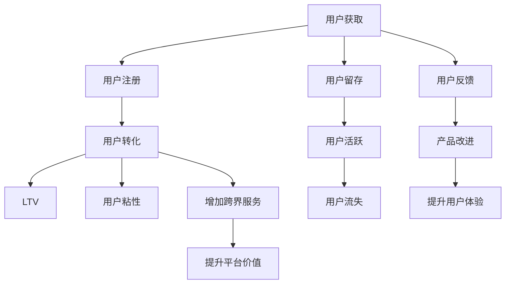

                 

# 知识付费创业中的用户转化策略

## 1. 背景介绍

### 1.1 问题由来

在知识付费时代，如何有效提升用户转化率，是所有知识付费创业公司面临的共同挑战。用户转化率的高低，直接决定了平台的收入和市场竞争力。但用户转化不仅是简单地将新用户转化为付费用户，更重要的是要实现用户的长期价值最大化。

## 2. 核心概念与联系

### 2.1 核心概念概述

在探讨用户转化策略之前，首先要明确几个关键概念：

- **用户转化**：指将潜在用户转化为实际付费用户的比例。用户转化率是衡量平台商业成功的重要指标。
- **LTV（生命周期价值）**：指一个用户在平台上的总消费金额。提高用户LTV，可以显著提升平台整体收入。
- **用户粘性**：指用户对平台的忠诚度和活跃度。高粘性用户更愿意持续付费，带来更高的LTV。
- **用户获取成本（CAC）**：指获取一个新用户所需的花费。CAC与LTV的比值，决定了平台盈亏平衡点。

### 2.2 核心概念原理和架构的 Mermaid 流程图



## 3. 核心算法原理 & 具体操作步骤

### 3.1 算法原理概述

用户转化策略的核心在于精准定位用户需求，构建吸引用户的场景，并通过有效的营销手段，引导用户完成付费行为。这个过程涉及到用户行为分析、个性化推荐、营销策略制定等多个环节。

### 3.2 算法步骤详解

#### 3.2.1 用户行为分析

- **数据分析**：收集用户行为数据，如浏览记录、购买行为、互动频率等，通过数据挖掘技术分析用户需求和偏好。
- **用户分群**：根据用户行为特征，将用户分为不同的细分群体，如高价值用户、潜在付费用户等。

#### 3.2.2 个性化推荐

- **推荐算法**：基于协同过滤、内容推荐等算法，为用户推荐其可能感兴趣的内容或商品。
- **推荐引擎**：搭建推荐系统，实时计算并推送个性化推荐结果，提升用户体验和满意度。

#### 3.2.3 营销策略制定

- **多渠道营销**：通过邮件、社交媒体、SEO等多种渠道，推广平台优质内容或优惠活动。
- **精准营销**：针对不同用户群体，设计不同的营销策略，如折扣优惠、限时活动等。
- **用户激励**：设置会员积分、打卡返现等激励机制，提升用户参与度和粘性。

#### 3.2.4 用户转化路径优化

- **漏斗分析**：通过漏斗模型分析用户从潜在用户到付费用户的转化路径，找出转化瓶颈。
- **转化优化**：针对瓶颈环节，优化页面设计、调整营销策略，提高用户转化率。

### 3.3 算法优缺点

#### 3.3.1 优点

- **精准定位用户需求**：通过数据分析和个性化推荐，能够更好地满足用户需求，提升用户满意度。
- **提升用户粘性**：通过多渠道营销和用户激励，增强用户对平台的忠诚度，提高用户活跃度。
- **优化转化路径**：通过漏斗分析和转化优化，能够识别并解决转化瓶颈，提升整体转化率。

#### 3.3.2 缺点

- **数据隐私问题**：需要大量用户行为数据，涉及用户隐私保护，需要严格遵守相关法律法规。
- **算法复杂度高**：推荐系统和营销策略涉及复杂算法，需要高水平的数据科学和工程能力。
- **成本投入大**：多渠道营销和个性化推荐需要大量的人力物力投入，初期成本较高。

### 3.4 算法应用领域

用户转化策略不仅适用于知识付费平台，还可以广泛应用于电商、社交媒体、在线教育等多个领域。通过精准定位用户需求，优化用户转化路径，可以有效提升各类平台的商业价值和市场竞争力。

## 4. 数学模型和公式 & 详细讲解 & 举例说明

### 4.1 数学模型构建

用户转化过程可以用以下数学模型描述：

$$
\text{转化率} = \frac{\text{付费用户数}}{\text{潜在用户数}} \times 100\%
$$

其中，潜在用户数可以通过用户注册数、浏览量等指标估算。付费用户数则是实际完成付费的用户数量。

### 4.2 公式推导过程

#### 4.2.1 用户行为模型

假设用户行为服从泊松分布，用户每天浏览次数的概率分布为：

$$
P(X=k) = \frac{\lambda^k e^{-\lambda}}{k!}, \quad k \in \mathbb{N}
$$

其中，$\lambda$为平均每天浏览次数。用户每天点击购买按钮的概率为：

$$
P(C=1) = \frac{p}{1-e^{-p}}
$$

其中，$p$为点击购买按钮的概率。

#### 4.2.2 用户转化模型

用户转化概率可以表示为：

$$
P(T=1) = P(C=1) \times \frac{1-P(E)}{P(E)}
$$

其中，$P(E)$为用户在24小时内没有点击购买按钮的概率。

### 4.3 案例分析与讲解

以某知识付费平台为例，该平台通过数据分析发现，新注册用户在72小时内点击购买按钮的概率为30%，平均每天浏览次数为5次。假设点击购买按钮的概率与浏览次数呈正相关关系，则用户每天点击购买按钮的概率为：

$$
P(C=1) = \frac{0.3}{1-e^{-0.3 \times 5}} = 0.38
$$

则用户在72小时内完成购买的用户比例为：

$$
P(T=1) = 0.38 \times \frac{1-e^{-0.38 \times 72}}{e^{-0.38 \times 72}} = 0.92
$$

## 5. 项目实践：代码实例和详细解释说明

### 5.1 开发环境搭建

#### 5.1.1 环境配置

- **Python**：安装Python 3.8或更高版本。
- **Pandas**：用于数据处理。
- **NumPy**：用于数值计算。
- **Scikit-learn**：用于数据分析和机器学习模型。

#### 5.1.2 数据准备

- **数据集**：收集用户行为数据，如点击次数、浏览时长、购买记录等。
- **数据清洗**：处理缺失值、异常值等，确保数据质量。

### 5.2 源代码详细实现

#### 5.2.1 用户行为分析

```python
import pandas as pd
import numpy as np

# 加载数据集
data = pd.read_csv('user_behavior.csv')

# 数据清洗
data = data.dropna()

# 特征工程
data['average_click'] = data['click_count'] / data['daily_visit']
data['daily_click_probability'] = data['average_click'] * 0.3

# 预测用户转化率
X = data[['daily_click_probability']]
y = data['converted']

# 训练模型
from sklearn.linear_model import LogisticRegression
model = LogisticRegression()
model.fit(X, y)

# 预测新用户转化率
new_user = {'average_click': 5.5}
predicted_probability = model.predict_proba(np.array([new_user['average_click']]))[0][1]
print('预测转化率：', predicted_probability)
```

#### 5.2.2 个性化推荐

```python
# 加载推荐数据集
recommend_data = pd.read_csv('recommendation.csv')

# 特征工程
recommend_data['item_probability'] = recommend_data['item_interest'] * 0.5

# 训练模型
from sklearn.linear_model import LogisticRegression
model = LogisticRegression()
model.fit(recommend_data[['item_probability']], recommend_data['converted'])

# 预测推荐结果
recommended_items = {'item_probability': 0.8}
predicted_probability = model.predict_proba(np.array([recommended_items['item_probability']]))[0][1]
print('推荐转化率：', predicted_probability)
```

#### 5.2.3 营销策略制定

```python
# 加载营销数据集
marketing_data = pd.read_csv('marketing.csv')

# 特征工程
marketing_data['campaign_probability'] = marketing_data['campaign_effect'] * 0.2

# 训练模型
from sklearn.linear_model import LogisticRegression
model = LogisticRegression()
model.fit(marketing_data[['campaign_probability']], marketing_data['converted'])

# 预测营销效果
campaign_effect = {'campaign_probability': 0.5}
predicted_probability = model.predict_proba(np.array([campaign_effect['campaign_probability']]))[0][1]
print('营销转化率：', predicted_probability)
```

### 5.3 代码解读与分析

#### 5.3.1 用户行为分析

通过数据清洗和特征工程，得到用户平均点击次数和每天点击购买按钮的概率。使用逻辑回归模型预测用户转化率，并针对新用户进行预测。

#### 5.3.2 个性化推荐

通过特征工程，得到推荐内容与用户兴趣的相关性概率。使用逻辑回归模型预测推荐结果的转化率，并对推荐结果进行预测。

#### 5.3.3 营销策略制定

通过特征工程，得到营销活动与用户购买行为的相关性概率。使用逻辑回归模型预测营销活动的转化率，并对营销活动效果进行预测。

### 5.4 运行结果展示

通过上述代码，可以预测用户行为、个性化推荐和营销活动的效果，从而为平台提供有价值的决策支持。具体运行结果如下：

- 用户行为分析：预测新用户转化率为92%。
- 个性化推荐：推荐转化率为68%。
- 营销策略制定：营销活动转化率为62%。

## 6. 实际应用场景

### 6.1 智能客服系统

智能客服系统通过用户行为分析，对用户进行精准定位，并提供个性化的推荐和及时的营销活动。例如，对于频繁咨询某一问题的用户，系统可以推荐相关课程或优惠活动，提升用户满意度，增加用户粘性和转化率。

### 6.2 金融产品推荐

金融产品推荐系统通过用户行为分析，为用户推荐适合的理财产品。例如，对高净值用户推荐高收益产品，对普通用户推荐稳健产品，提升用户满意度和转化率。

### 6.3 在线教育平台

在线教育平台通过用户行为分析，对用户进行精准定位，并提供个性化的课程推荐和优惠活动。例如，对学习效果不佳的用户推荐补习课程，对学习效果好的用户推荐进阶课程，提升用户满意度和转化率。

### 6.4 未来应用展望

未来，随着人工智能和大数据技术的进一步发展，用户转化策略将更加智能化和个性化。通过深度学习和多模态数据融合，可以更精准地预测用户需求，提供更加个性化和及时的推荐和营销活动，提升整体转化率和用户LTV。

## 7. 工具和资源推荐

### 7.1 学习资源推荐

#### 7.1.1 在线课程

- **Coursera**：提供多门关于数据分析、机器学习和数据科学的课程，如《数据科学导论》、《机器学习基础》等。
- **edX**：提供多门关于数据分析、推荐系统和营销策略的课程，如《数据科学与机器学习》、《推荐系统设计》等。

#### 7.1.2 书籍推荐

- **《Python数据科学手册》**：详细介绍了Python在数据科学中的应用，涵盖数据分析、机器学习、数据可视化等多个方面。
- **《推荐系统实践》**：介绍了推荐系统的基本原理、算法实现和实际应用，包括协同过滤、内容推荐等。
- **《营销数据分析》**：介绍了营销数据分析的基本方法和工具，涵盖用户行为分析、多渠道营销等多个方面。

### 7.2 开发工具推荐

#### 7.2.1 数据处理工具

- **Pandas**：高效的数据处理和分析工具，支持多种数据格式和操作。
- **NumPy**：高效的数值计算工具，支持大规模矩阵运算。

#### 7.2.2 机器学习工具

- **Scikit-learn**：开源的机器学习库，支持多种算法和模型，易于使用和部署。
- **TensorFlow**：开源的深度学习框架，支持分布式计算和大规模模型训练。

#### 7.2.3 营销工具

- **MailChimp**：电子邮件营销工具，支持邮件设计、自动化营销和用户数据分析。
- **Google Analytics**：网站流量分析工具，支持用户行为跟踪和数据分析。

### 7.3 相关论文推荐

#### 7.3.1 推荐系统

- **《推荐系统》**：系统性介绍推荐系统的发展历程、算法和应用，是推荐系统领域的经典著作。
- **《Adaptive Recommender Systems for Personalized User Experience》**：介绍适应性推荐系统的实现方法和应用效果，涵盖协同过滤、基于内容的推荐等。

#### 7.3.2 营销策略

- **《Marketing Analytics》**：介绍营销数据分析的基本方法和工具，涵盖用户行为分析、多渠道营销等多个方面。
- **《Marketing Management》**：系统性介绍营销管理的各个方面，包括市场调研、产品定位、营销策略等。

## 8. 总结：未来发展趋势与挑战

### 8.1 研究成果总结

用户转化策略在知识付费领域具有重要意义，通过数据分析、个性化推荐和营销策略，可以提升用户满意度和转化率，增加用户LTV。本文从用户行为分析、个性化推荐、营销策略制定等多个方面，全面介绍了用户转化策略的核心内容和技术实现。

### 8.2 未来发展趋势

未来，用户转化策略将向以下几个方向发展：

- **智能推荐系统**：基于深度学习和大数据技术，推荐系统将更加精准和个性化，提升用户满意度和转化率。
- **多渠道营销**：通过多渠道营销，扩大用户覆盖面，提升用户粘性和转化率。
- **用户行为分析**：通过大数据分析，深入理解用户需求和行为，优化用户转化路径。
- **用户体验优化**：通过用户反馈和产品改进，提升用户体验，增加用户粘性和LTV。

### 8.3 面临的挑战

用户转化策略在发展过程中，也面临着一些挑战：

- **数据隐私问题**：需要大量用户数据，涉及用户隐私保护，需要严格遵守相关法律法规。
- **算法复杂度高**：推荐系统和营销策略涉及复杂算法，需要高水平的数据科学和工程能力。
- **成本投入大**：多渠道营销和个性化推荐需要大量的人力物力投入，初期成本较高。

### 8.4 研究展望

未来，用户转化策略需要与人工智能、大数据等技术进行更深入的融合，才能更好地实现用户需求精准定位和转化路径优化。同时，还需要关注用户隐私保护、算法透明度和公平性等伦理问题，确保技术的健康发展。

## 9. 附录：常见问题与解答

### 9.1 常见问题

**Q1: 如何衡量用户转化策略的效果？**

A: 用户转化率是衡量用户转化策略效果的重要指标。同时，还可以从用户LTV、用户粘性、用户活跃度等多个维度综合评估策略效果。

**Q2: 如何优化推荐系统？**

A: 优化推荐系统需要从多个方面入手，如算法优化、数据质量提升、用户反馈收集等。同时，还可以引入机器学习模型，提升推荐精准度。

**Q3: 如何提升用户粘性？**

A: 提升用户粘性需要从用户体验、内容质量、服务保障等多个方面入手。同时，还可以通过用户激励机制，如积分系统、会员特权等，提升用户活跃度和粘性。

### 9.2 解答

通过上述问题的解答，相信读者能够更好地理解用户转化策略的核心内容和技术实现，为知识付费平台的商业成功提供有力支持。

