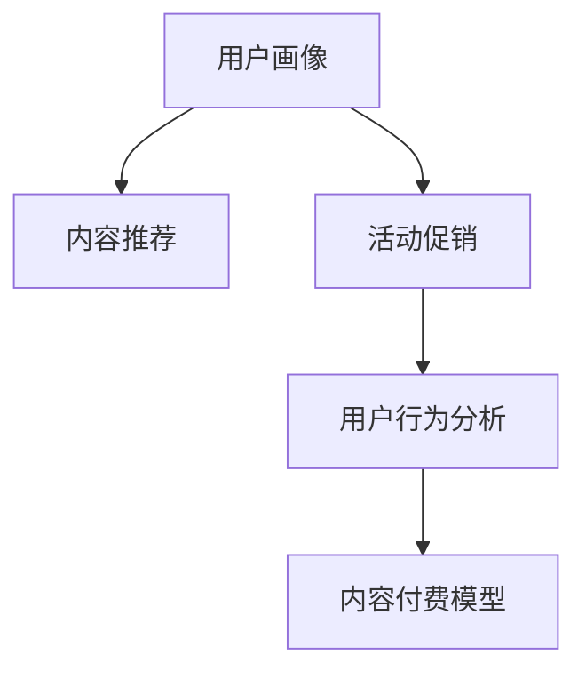

                 

# 知识付费创业中的用户运营体系

## 1. 背景介绍

### 1.1 问题由来
随着移动互联网的普及和智能设备的普及，知识付费市场正处于蓬勃发展之中。越来越多的用户习惯于通过订阅服务获取知识和信息。然而，知识付费平台如何构建有效的用户运营体系，实现用户留存、提升转化率，进而持续盈利，成为行业内亟需解决的核心问题。

### 1.2 问题核心关键点
知识付费平台的用户运营体系通常包括以下几个关键点：
- 用户画像构建：了解用户需求和行为特征，构建精准用户画像。
- 内容推荐算法：基于用户画像，为用户提供个性化内容推荐，提升用户体验。
- 活动促销策略：通过各类营销活动和促销策略，吸引用户订阅和付费。
- 用户行为分析：通过数据驱动的方法，实时监测和调整运营策略，提升运营效果。
- 内容付费模型：构建科学的付费模型，平衡用户和平台的利益，促进健康生态建设。

### 1.3 问题研究意义
构建高效的用户运营体系，对于知识付费平台的持续发展至关重要。它能帮助平台实现用户增长、提高用户粘性、增加收入来源，最终实现良性循环。具体意义包括：
- 提升用户体验：通过精准推荐和个性化服务，满足用户的多样化需求，提升用户满意度。
- 提高转化率：通过有效的促销策略和运营手段，吸引用户付费订阅，提升平台营收。
- 增强用户粘性：通过持续的内容更新和互动，保持用户活跃度和参与感。
- 促进生态建设：构建健康的内容付费模型，激励创作者输出高质量内容，形成良性循环。

## 2. 核心概念与联系

### 2.1 核心概念概述

为更好地理解知识付费平台的用户运营体系，本节将介绍几个关键概念：

- 用户画像(User Persona)：基于用户行为数据和调查问卷，构建一个详细的用户描述，包括年龄、性别、职业、兴趣爱好、消费习惯等，用于指导运营策略制定。
- 内容推荐(Content Recommendation)：根据用户画像，使用算法为用户推荐个性化内容，提升用户满意度。
- 活动促销(Promotion Campaign)：通过各类营销活动和促销手段，吸引用户关注和参与，增加转化率。
- 用户行为分析(User Behavior Analysis)：通过数据分析方法，监测用户行为模式，识别用户需求和问题，优化运营策略。
- 内容付费模型(Paywall Model)：构建合理的付费策略，平衡用户和平台利益，促进用户转化和长期订阅。

这些概念之间的逻辑关系可以通过以下Mermaid流程图来展示：



这个流程图展示了一系列概念之间的联系：

1. 用户画像构建后，可以作为内容推荐的基础，为用户提供个性化服务。
2. 通过活动促销吸引用户参与，结合内容推荐，提升用户转化率。
3. 用户行为分析可用于识别用户需求和问题，优化运营策略。
4. 最终通过合理的付费模型，促进用户订阅和长期留存。

## 3. 核心算法原理 & 具体操作步骤
### 3.1 算法原理概述

知识付费平台的用户运营体系，本质上是一个数据驱动的个性化推荐和用户行为监测系统。其核心思想是：通过数据驱动的方法，了解用户需求，优化内容和营销策略，提升用户满意度和转化率。

形式化地，假设知识付费平台的目标是最大化用户转化率 $\theta$，即：

$$
\theta^* = \mathop{\arg\max}_{\theta} \mathcal{L}(\theta)
$$

其中 $\mathcal{L}$ 为针对用户转化率的损失函数，用于衡量推荐和营销策略的效果。常见的损失函数包括交叉熵损失、平均绝对误差等。

通过梯度下降等优化算法，运营体系不断更新用户画像、内容推荐算法、活动促销策略等，最小化损失函数 $\mathcal{L}$，提升用户转化率。

### 3.2 算法步骤详解

知识付费平台的用户运营体系一般包括以下几个关键步骤：

**Step 1: 数据收集与预处理**
- 收集用户的浏览、订阅、购买、互动等行为数据。
- 通过问卷调查、用户反馈等方式，收集用户画像数据。
- 对数据进行清洗、去重、归一化等预处理操作。

**Step 2: 用户画像构建**
- 基于收集到的数据，通过聚类、分类等方法，构建用户画像。
- 对不同用户群体进行特征分析，如年龄、性别、职业、兴趣爱好、消费习惯等。

**Step 3: 内容推荐算法设计**
- 选择合适的推荐算法，如协同过滤、基于内容的推荐、深度学习推荐等。
- 设计推荐指标，如点击率、转化率、用户满意度等。
- 进行A/B测试，评估不同推荐策略的效果。

**Step 4: 活动促销策略制定**
- 根据用户画像和行为数据，设计各类促销活动，如折扣、优惠券、赠品等。
- 确定促销活动的时间和频率，结合用户画像，选择最合适的营销渠道。
- 通过A/B测试，评估不同促销策略的效果。

**Step 5: 用户行为分析**
- 使用数据挖掘和机器学习技术，分析用户行为模式和趋势。
- 通过日志分析、用户反馈等方式，实时监测用户行为变化。
- 根据分析结果，调整用户画像和推荐策略。

**Step 6: 内容付费模型设计**
- 根据用户画像和行为数据，设计合理的付费模型，如按次付费、包月订阅、年度订阅等。
- 设定价格策略，平衡用户和平台利益。
- 实时监测付费模型效果，调整定价策略。

### 3.3 算法优缺点

知识付费平台的用户运营体系具有以下优点：
1. 个性化推荐：通过精准的用户画像，提供个性化内容推荐，提升用户满意度。
2. 实时优化：基于实时数据驱动，能够快速调整运营策略，优化用户体验。
3. 科学定价：通过数据分析和实验，设计合理的付费模型，促进用户订阅。

同时，该体系也存在一定的局限性：
1. 数据依赖：运营效果依赖于高质量数据，数据收集和处理成本较高。
2. 复杂性高：需要综合多方面数据和策略，体系设计复杂。
3. 风险难以控制：过度依赖数据驱动，可能导致运营策略过于机械化，无法应对突发情况。

尽管存在这些局限性，但就目前而言，数据驱动的个性化推荐和用户行为分析是知识付费平台运营的最主流范式。未来相关研究的重点在于如何进一步降低数据收集和处理的成本，提高策略制定的科学性和灵活性，同时兼顾用户体验和平台利益。

### 3.4 算法应用领域

知识付费平台的用户运营体系已经在许多领域得到了广泛的应用，例如：

- 在线教育：通过个性化推荐和实时互动，提升用户学习体验和效果。
- 媒体平台：通过内容推荐和活动促销，增加用户订阅和付费，提高平台流量和收入。
- 健身应用：通过个性化训练计划和用户行为分析，提高用户参与度和粘性。
- 金融服务：通过数据分析和用户画像，提供个性化的理财建议和产品推荐，提升用户转化率。

除了上述这些经典应用外，知识付费体系还被创新性地应用到更多场景中，如智能客服、智能家居、智慧医疗等，为各行业的数字化转型提供了新的动力。随着数据科学和人工智能技术的不断发展，知识付费体系必将在更多领域发挥重要作用。

## 4. 数学模型和公式 & 详细讲解 & 举例说明
### 4.1 数学模型构建

本节将使用数学语言对知识付费平台的用户运营体系进行更加严格的刻画。

假设用户画像为 $P=\{x_i\}_{i=1}^N$，其中 $x_i$ 为第 $i$ 个用户的行为特征向量，包括浏览时间、付费记录、互动次数等。假设推荐算法为 $M$，活动促销策略为 $C$。目标是最大化用户转化率 $\theta$，即：

$$
\theta^* = \mathop{\arg\max}_{\theta} \mathcal{L}(P, M, C)
$$

其中 $\mathcal{L}$ 为损失函数，包括点击率、转化率、用户满意度等。

### 4.2 公式推导过程

以点击率为例，假设用户点击内容的概率为 $p(y_i=1|x_i, M, C)$，则最大化用户转化率的优化问题可转化为：

$$
\theta^* = \mathop{\arg\max}_{\theta} \sum_{i=1}^N p(y_i=1|x_i, M, C)
$$

根据贝叶斯定理，用户点击内容的概率可表示为：

$$
p(y_i=1|x_i, M, C) = \frac{p(x_i|y_i=1, M, C)p(y_i=1|M, C)}{p(x_i|M, C)}
$$

其中 $p(x_i|y_i=1, M, C)$ 为点击条件下的内容概率，$p(y_i=1|M, C)$ 为点击条件下的用户概率，$p(x_i|M, C)$ 为总体条件下的内容概率。

将上式代入最大化问题，得：

$$
\theta^* = \mathop{\arg\max}_{\theta} \sum_{i=1}^N \frac{p(x_i|y_i=1, M, C)p(y_i=1|M, C)}{p(x_i|M, C)}
$$

在实践中，可以通过优化算法求解上述最优化问题，得到最优的用户画像、推荐算法和促销策略组合。

### 4.3 案例分析与讲解

假设某在线教育平台有 $N=1000$ 名用户，收集到每个用户的历史学习行为数据 $x_i$，包括课程观看次数、测验成绩、互动评论等。平台的目标是最大化用户订阅率 $\theta$。

**Step 1: 数据收集与预处理**
- 通过平台日志收集 $N=1000$ 名用户的观看记录、测验成绩、互动评论等数据。
- 对数据进行清洗、去重、归一化等预处理操作。

**Step 2: 用户画像构建**
- 使用聚类算法对用户行为数据进行分类，识别出不同用户群体的特征。
- 对不同用户群体进行特征分析，如年龄、性别、学习习惯、学习效果等。

**Step 3: 内容推荐算法设计**
- 选择协同过滤算法 $M$，基于用户历史行为数据和课程评分数据，生成个性化推荐列表。
- 设计推荐指标，如点击率、订阅率、用户满意度等。
- 通过A/B测试，评估不同推荐策略的效果。

**Step 4: 活动促销策略制定**
- 根据用户画像和行为数据，设计各类促销活动，如新用户首月免费、推荐好友优惠等。
- 确定促销活动的时间和频率，结合用户画像，选择最合适的营销渠道。
- 通过A/B测试，评估不同促销策略的效果。

**Step 5: 用户行为分析**
- 使用数据挖掘和机器学习技术，分析用户行为模式和趋势。
- 通过日志分析、用户反馈等方式，实时监测用户行为变化。
- 根据分析结果，调整用户画像和推荐策略。

**Step 6: 内容付费模型设计**
- 根据用户画像和行为数据，设计合理的付费模型，如按次付费、包月订阅、年度订阅等。
- 设定价格策略，平衡用户和平台利益。
- 实时监测付费模型效果，调整定价策略。

## 5. 项目实践：代码实例和详细解释说明
### 5.1 开发环境搭建

在进行用户运营体系实践前，我们需要准备好开发环境。以下是使用Python进行PyTorch开发的环境配置流程：

1. 安装Anaconda：从官网下载并安装Anaconda，用于创建独立的Python环境。

2. 创建并激活虚拟环境：
```bash
conda create -n pytorch-env python=3.8 
conda activate pytorch-env
```

3. 安装PyTorch：根据CUDA版本，从官网获取对应的安装命令。例如：
```bash
conda install pytorch torchvision torchaudio cudatoolkit=11.1 -c pytorch -c conda-forge
```

4. 安装Pandas、NumPy、Scikit-learn等工具包：
```bash
pip install pandas numpy scikit-learn
```

5. 安装Jupyter Notebook：
```bash
pip install jupyter notebook
```

完成上述步骤后，即可在`pytorch-env`环境中开始用户运营体系的开发实践。

### 5.2 源代码详细实现

下面我们以在线教育平台为例，给出使用PyTorch进行用户画像构建和内容推荐的PyTorch代码实现。

首先，定义用户画像构建函数：

```python
import pandas as pd
import numpy as np
from sklearn.cluster import KMeans
from sklearn.decomposition import PCA

def build_user_profile(data):
    # 数据预处理
    data = data.fillna(0)
    data = (data - data.mean()) / data.std()

    # 使用KMeans聚类算法构建用户画像
    kmeans = KMeans(n_clusters=10, random_state=0)
    kmeans.fit(data)

    # 对聚类结果进行降维
    pca = PCA(n_components=2)
    pca.fit(data)

    # 将用户画像保存到文件
    user_profiles = pd.DataFrame(pca.transform(data), columns=['feature1', 'feature2'])
    user_profiles['cluster'] = kmeans.labels_
    user_profiles.to_csv('user_profiles.csv', index=False)

# 使用示例数据构建用户画像
data = pd.read_csv('user_data.csv')
build_user_profile(data)
```

然后，定义内容推荐函数：

```python
import torch
import torch.nn as nn
import torch.optim as optim
from torch.utils.data import Dataset, DataLoader

class CourseDataset(Dataset):
    def __init__(self, courses, user_profiles, user_ids):
        self.courses = courses
        self.user_profiles = user_profiles
        self.user_ids = user_ids
        self.num_users = len(user_ids)

    def __len__(self):
        return len(self.user_ids)

    def __getitem__(self, idx):
        user_id = self.user_ids[idx]
        user_profile = self.user_profiles.loc[user_id, :].values
        courses = self.courses.iloc[idx]
        return torch.tensor(user_profile), torch.tensor(courses)

# 加载数据
courses = pd.read_csv('courses.csv')
user_profiles = pd.read_csv('user_profiles.csv')
user_ids = np.random.choice(np.arange(len(user_profiles)), size=100)

# 定义模型
class RecommendationModel(nn.Module):
    def __init__(self, embed_dim=10, num_clusters=10):
        super(RecommendationModel, self).__init__()
        self.user_embeddings = nn.Embedding(num_clusters, embed_dim)
        self.course_embeddings = nn.Embedding(len(courses), embed_dim)
        self.dot_product = nn.Linear(embed_dim, 1)

    def forward(self, user_profile, course_ids):
        user_embeddings = self.user_embeddings(user_profile)
        course_embeddings = self.course_embeddings(course_ids)
        dot_product = self.dot_product(torch.bmm(course_embeddings, user_embeddings.transpose(0, 1)))
        return dot_product

# 定义优化器和损失函数
model = RecommendationModel()
optimizer = optim.Adam(model.parameters(), lr=0.01)
criterion = nn.MSELoss()

# 定义数据集和数据加载器
dataset = CourseDataset(courses, user_profiles, user_ids)
dataloader = DataLoader(dataset, batch_size=32, shuffle=True)

# 训练模型
for epoch in range(10):
    for batch in dataloader:
        user_profile, course_ids = batch
        optimizer.zero_grad()
        dot_product = model(user_profile, course_ids)
        loss = criterion(dot_product, torch.tensor([0.0]))
        loss.backward()
        optimizer.step()
```

以上就是使用PyTorch构建用户画像和内容推荐的完整代码实现。可以看到，利用PyTorch，我们能够高效地实现聚类算法和线性回归模型的训练，以预测用户点击课程的概率。

### 5.3 代码解读与分析

让我们再详细解读一下关键代码的实现细节：

**build_user_profile函数**：
- 对原始用户数据进行预处理，包括填充缺失值、标准化等。
- 使用KMeans算法进行聚类，将用户划分为不同群体。
- 对聚类结果进行降维，提取用户画像的关键特征。
- 将用户画像保存到文件中，方便后续读取。

**CourseDataset类**：
- 定义数据集，包括用户画像和课程评分数据。
- 通过DataLoader对数据集进行批次化加载，供模型训练和推理使用。

**RecommendationModel类**：
- 定义推荐模型，包括用户嵌入、课程嵌入和点积层。
- 前向传播计算用户画像和课程评分数据的内积，预测用户点击课程的概率。

**优化器和损失函数**：
- 使用Adam优化器和均方误差损失函数，对模型进行优化训练。

**训练流程**：
- 定义总的epoch数和batch size，开始循环迭代
- 每个epoch内，在数据集上训练，输出损失值
- 重复上述步骤直至收敛

可以看到，PyTorch提供了强大的工具支持，使得构建用户画像和内容推荐模型的代码实现变得简洁高效。开发者可以将更多精力放在数据处理、模型改进等高层逻辑上，而不必过多关注底层的实现细节。

当然，工业级的系统实现还需考虑更多因素，如模型的保存和部署、超参数的自动搜索、更灵活的任务适配层等。但核心的用户运营体系构建流程基本与此类似。

## 6. 实际应用场景
### 6.1 在线教育

在线教育平台通过构建高效的用户运营体系，可以实现个性化推荐和实时互动，提升用户学习体验和效果。具体应用场景包括：
- 推荐课程：基于用户画像，向用户推荐最感兴趣和最适合的课程。
- 实时互动：通过在线问答、作业反馈等方式，增加用户互动，提升学习效果。
- 个性化学习路径：根据用户学习进度和效果，推荐适合的复习计划和习题练习。

### 6.2 媒体平台

媒体平台通过内容推荐和活动促销，吸引用户关注和参与，增加订阅和付费。具体应用场景包括：
- 推荐内容：根据用户画像和行为数据，推荐感兴趣的文章、视频和直播。
- 活动促销：设计各类优惠活动，如折扣、抽奖、免费试用等，吸引用户订阅。
- 互动反馈：通过在线评论、点赞等方式，收集用户反馈，优化内容推荐策略。

### 6.3 健身应用

健身应用通过个性化训练计划和用户行为分析，提高用户参与度和粘性。具体应用场景包括：
- 推荐训练计划：根据用户体质、健康状况等数据，推荐适合的训练计划和动作。
- 实时监测：通过各类传感器数据，实时监测用户运动状态和效果。
- 个性化反馈：根据用户表现，提供个性化的训练建议和营养建议。

### 6.4 金融服务

金融服务通过数据分析和用户画像，提供个性化的理财建议和产品推荐，提升用户转化率。具体应用场景包括：
- 推荐产品：根据用户画像和行为数据，推荐适合的理财产品和保险产品。
- 实时监测：通过金融数据，实时监测用户资产变化和风险状态。
- 理财建议：根据用户财务状况和投资偏好，提供个性化的理财建议和方案。

除了上述这些应用场景外，用户运营体系还被创新性地应用到更多领域中，如智能客服、智能家居、智慧医疗等，为各行业的数字化转型提供了新的动力。随着数据科学和人工智能技术的不断发展，用户运营体系必将在更多领域发挥重要作用。

## 7. 工具和资源推荐
### 7.1 学习资源推荐

为了帮助开发者系统掌握用户运营体系的理论基础和实践技巧，这里推荐一些优质的学习资源：

1. 《机器学习实战》：经典的机器学习入门书籍，涵盖各类机器学习算法和实践案例。
2. 《Python数据分析》：通过Python进行数据分析的权威指南，适合数据分析和机器学习入门。
3. 《数据科学导论》：全面介绍数据科学理论和实践，涵盖数据收集、预处理、建模等环节。
4. 《自然语言处理入门》：介绍自然语言处理的基础知识和应用，适合初学者入门。
5. 《深度学习基础》：深入浅出地介绍深度学习原理和实践，适合深度学习入门和进阶。

通过对这些资源的学习实践，相信你一定能够快速掌握用户运营体系的理论基础和实践技巧，并用于解决实际的运营问题。
###  7.2 开发工具推荐

高效的开发离不开优秀的工具支持。以下是几款用于用户运营体系开发的常用工具：

1. PyTorch：基于Python的开源深度学习框架，灵活动态的计算图，适合快速迭代研究。大部分机器学习算法都有PyTorch版本的实现。

2. TensorFlow：由Google主导开发的开源深度学习框架，生产部署方便，适合大规模工程应用。同样有丰富的机器学习算法资源。

3. Scikit-learn：基于Python的科学计算库，提供了多种机器学习算法和数据预处理工具，适合数据科学研究和应用。

4. Pandas：基于Python的数据分析库，提供了高效的数据处理和分析工具，适合数据清洗、特征工程等任务。

5. Jupyter Notebook：交互式笔记本环境，支持多种编程语言和数据分析工具，适合研究和学习。

合理利用这些工具，可以显著提升用户运营体系的开发效率，加快创新迭代的步伐。

### 7.3 相关论文推荐

用户运营体系的研究源于学界的持续研究。以下是几篇奠基性的相关论文，推荐阅读：

1. "User Modeling for E-commerce Platforms"：介绍用户建模方法和算法，适用于电商平台的用户画像构建。

2. "Personalized Recommendation Algorithms"：详细介绍各类个性化推荐算法，包括协同过滤、基于内容的推荐等。

3. "A Survey on Online User Behavior Modeling"：综述在线用户行为建模方法，涵盖数据收集、特征提取、模型训练等环节。

4. "Recommendation Systems in e-Commerce"：介绍电子商务中的推荐系统，涵盖推荐算法、数据挖掘、实时推荐等技术。

5. "Predictive Modeling for Customer Behavior Analysis"：介绍客户行为预测方法，适用于用户行为分析和市场预测。

这些论文代表了大数据和机器学习在用户运营体系中的应用，通过学习这些前沿成果，可以帮助研究者把握学科前进方向，激发更多的创新灵感。

## 8. 总结：未来发展趋势与挑战

### 8.1 总结

本文对知识付费平台的用户运营体系进行了全面系统的介绍。首先阐述了用户运营体系的研究背景和意义，明确了运营策略制定的关键点。其次，从原理到实践，详细讲解了用户画像构建、内容推荐算法、活动促销策略、用户行为分析、内容付费模型等核心算法，并给出了代码实现和解释说明。同时，本文还探讨了用户运营体系在多个领域的应用前景，展示了其在在线教育、媒体平台、健身应用、金融服务等方面的潜力。

通过本文的系统梳理，可以看到，用户运营体系是知识付费平台运营的核心，通过精准的用户画像和个性化推荐，提升用户满意度和转化率，从而实现平台持续盈利。未来，随着数据科学和人工智能技术的不断发展，用户运营体系必将在更多领域发挥重要作用，推动人工智能技术在各行各业的落地应用。

### 8.2 未来发展趋势

展望未来，用户运营体系将呈现以下几个发展趋势：

1. 数据质量提升：随着数据采集和处理技术的进步，用户行为数据将更加全面、准确，有助于构建更加精准的用户画像和推荐算法。
2. 个性化推荐多样化：除了协同过滤、基于内容的推荐，未来将涌现更多个性化推荐算法，如深度学习推荐、图神经网络推荐等，提升推荐效果。
3. 实时互动增强：通过实时数据流处理和流式学习，增强用户互动体验，提升平台用户粘性。
4. 跨平台整合：通过多平台数据整合和用户画像融合，实现更加全面、一致的用户画像和推荐策略。
5. 业务协同优化：将用户运营体系与业务场景深度结合，优化推荐、营销、客服等各个环节，提升整体运营效果。

以上趋势凸显了用户运营体系的广阔前景。这些方向的探索发展，必将进一步提升用户满意度和转化率，推动知识付费平台的持续发展。

### 8.3 面临的挑战

尽管用户运营体系已经在诸多领域得到了应用，但在迈向更加智能化、普适化应用的过程中，它仍面临着诸多挑战：

1. 数据隐私问题：用户行为数据涉及隐私信息，如何保护用户隐私，是构建用户画像和推荐算法的关键。
2. 数据不均衡问题：不同用户群体的行为数据分布不均衡，如何应对数据不均衡问题，提升推荐效果。
3. 系统复杂性：用户运营体系涉及多个环节和算法，体系设计复杂，如何简化系统架构，提高系统鲁棒性。
4. 模型可解释性：用户运营体系的推荐和营销算法，往往缺乏可解释性，难以满足用户和监管的要求。
5. 实时性问题：实时数据流的处理和实时推荐算法的优化，需要更高的计算资源和技术水平，如何解决实时性问题。

尽管存在这些挑战，但通过学界和产业界的共同努力，这些问题终将一一被克服，用户运营体系必将在构建人机协同的智能时代中扮演越来越重要的角色。相信随着技术的不断进步和应用的不断拓展，用户运营体系必将成为知识付费平台运营的重要范式，推动人工智能技术在更多领域的发展和应用。

### 8.4 研究展望

面对用户运营体系所面临的种种挑战，未来的研究需要在以下几个方面寻求新的突破：

1. 数据隐私保护：引入隐私保护技术，如差分隐私、联邦学习等，保护用户隐私，提升用户信任度。
2. 数据不均衡处理：引入数据增强、重采样等技术，应对数据不均衡问题，提升推荐效果。
3. 系统架构优化：引入分布式计算、流式处理等技术，优化系统架构，提高系统鲁棒性和可扩展性。
4. 模型可解释性增强：引入可解释性算法，如LIME、SHAP等，增强推荐和营销算法的可解释性。
5. 实时性优化：引入实时计算和缓存技术，优化实时数据流处理和实时推荐算法，提升系统响应速度。

这些研究方向将推动用户运营体系向更高效、更安全、更智能的方向发展，为知识付费平台带来更强大的竞争力。面向未来，用户运营体系的研究需要更多跨学科的合作和创新，共同推动人工智能技术在各行各业的落地应用。

## 9. 附录：常见问题与解答

**Q1：用户画像构建需要哪些关键步骤？**

A: 用户画像构建需要以下关键步骤：
1. 数据收集：收集用户的浏览、订阅、购买、互动等行为数据。
2. 数据预处理：对数据进行清洗、去重、归一化等预处理操作。
3. 特征提取：选择有代表性的特征，构建特征向量。
4. 聚类分析：使用聚类算法对用户行为数据进行分类，识别出不同用户群体的特征。
5. 降维处理：对聚类结果进行降维，提取用户画像的关键特征。
6. 结果评估：通过A/B测试和指标评估，不断优化用户画像构建方法。

**Q2：内容推荐算法有哪些常见类型？**

A: 内容推荐算法包括但不限于以下几种常见类型：
1. 协同过滤算法：基于用户历史行为数据，推荐相似内容。
2. 基于内容的推荐算法：根据内容特征，推荐相关内容。
3. 深度学习推荐算法：使用深度神经网络，预测用户点击概率。
4. 矩阵分解算法：基于矩阵分解，推荐相关内容。
5. 混合推荐算法：结合多种推荐方法，提升推荐效果。

**Q3：如何设计有效的活动促销策略？**

A: 设计有效的活动促销策略需要以下关键步骤：
1. 目标用户定位：明确促销活动的目标用户群体，选择适合的营销渠道。
2. 促销方式选择：选择合适的促销方式，如折扣、优惠券、赠品等。
3. 时间和频率设定：根据用户行为数据，设定促销活动的时间和频率，最大化用户参与度。
4. 效果评估：通过A/B测试和数据分析，评估促销活动的效果，优化促销策略。

**Q4：用户行为分析需要考虑哪些关键因素？**

A: 用户行为分析需要考虑以下关键因素：
1. 用户行为数据收集：收集用户的浏览、购买、互动等行为数据。
2. 数据清洗和预处理：对数据进行清洗、去重、归一化等预处理操作。
3. 用户行为建模：使用机器学习算法，构建用户行为模型。
4. 行为模式分析：识别用户行为模式和趋势，优化推荐和营销策略。
5. 实时监测和预警：实时监测用户行为变化，设置异常告警阈值，保障平台稳定运行。

**Q5：内容付费模型有哪些常见类型？**

A: 内容付费模型包括但不限于以下几种常见类型：
1. 按次付费：用户每次访问或阅读内容时，按次收费。
2. 包月订阅：用户每月支付固定费用，获得内容访问权。
3. 年度订阅：用户每年支付固定费用，获得内容访问权。
4. 免费试用：用户首次访问或阅读时，免费试用，后续按次收费。
5. 分阶付费：根据用户付费金额和内容访问权限，设定不同的付费层级。

**Q6：如何设计科学的内容付费模型？**

A: 设计科学的内容付费模型需要以下关键步骤：
1. 用户行为分析：收集和分析用户行为数据，识别用户付费意愿和能力。
2. 付费层级设计：根据用户画像和行为数据，设计合理的付费层级。
3. 价格策略设定：设定合理的价格策略，平衡用户和平台利益。
4. 效果评估：通过A/B测试和数据分析，评估付费模型的效果，优化定价策略。

通过这些问题的解答，相信你能够更好地理解用户运营体系的核心概念和实践方法，进而应用于实际的运营场景中。

