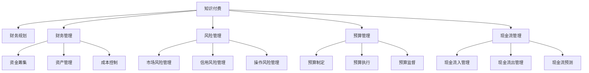

                 

# 知识付费创业中的财务规划与管理

## 1. 背景介绍

近年来，随着互联网和移动设备的普及，知识付费逐渐成为一种新兴的经济模式。知识付费平台如得到、知乎live、喜马拉雅等迅速崛起，为知识创作者和需求者提供了一个便捷的交流与获取知识的平台。然而，知识付费创业的火热背后，也隐藏着高投入、高风险、高竞争等诸多挑战。特别是财务规划与管理，作为知识付费创业的重要环节，关系到企业能否长期稳健发展，因此显得尤为重要。

## 2. 核心概念与联系

### 2.1 核心概念概述

本节将介绍几个在知识付费创业中至关重要的核心概念：

- **知识付费**：指消费者为获取有价值、系统化的知识而支付费用的经济活动。知识付费平台为知识创作者与消费者提供了一个高效、便捷的交易平台。

- **财务规划**：指企业基于自身发展战略，对未来的财务活动进行科学合理的预测、控制、规划和决策。对于知识付费企业而言，财务规划尤为重要，因为它直接关系到企业的现金流、成本控制与盈利能力。

- **财务管理**：指企业通过资金筹集、资产管理、成本控制等手段，实现企业价值的最大化。财务管理的目的是优化企业的资金使用效率，提高企业运营效率。

- **风险管理**：指企业识别、衡量和管理财务风险的过程。财务风险包括市场风险、信用风险、操作风险等。对于知识付费企业，风险管理尤为关键，因为这类企业的高投入、高成本与高风险并存。

- **预算管理**：指企业通过制定和执行财务预算，对企业财务活动进行计划、控制和监督的过程。预算管理有助于企业合理分配资源，提升运营效率。

- **现金流管理**：指企业通过加强资金流入和流出的管理，确保企业有足够的现金流支持日常运营和持续发展。对于知识付费企业，现金流管理尤为重要，因为这类企业需要大量的资金投入，尤其是前期投入。

这些核心概念之间的逻辑关系可以通过以下Mermaid流程图来展示：



这个流程图展示了几大核心概念及其之间的关系：

1. 知识付费平台基于业务需求，进行财务规划。
2. 财务规划包括财务管理、风险管理、预算管理、现金流管理等关键环节。
3. 财务管理包括资金筹集、资产管理、成本控制等措施。
4. 风险管理包括市场风险、信用风险、操作风险等防范措施。
5. 预算管理通过制定和执行预算，实现资源优化配置。
6. 现金流管理通过加强资金流入和流出管理，确保企业现金流稳定。

### 2.2 核心概念原理和架构

#### 2.2.1 财务规划

财务规划是知识付费企业财务管理的核心，它通过科学合理的预测和规划，确保企业财务资源的有效配置，实现企业的长期稳健发展。财务规划的核心在于：

- **战略目标的设定**：根据企业的发展战略，设定财务目标，如盈利能力、资本结构、成本控制等。
- **预算的制定与执行**：制定年度和季度财务预算，并进行动态调整，确保财务目标的实现。
- **风险的识别与管理**：识别财务风险，并采取相应措施进行管理，如制定风险管理政策、建立应急机制等。

#### 2.2.2 财务管理

财务管理是确保企业财务资源有效使用的关键手段，包括：

- **资金筹集**：通过内部筹资和外部筹资，确保企业有足够的资金支持运营和投资。
- **资产管理**：优化资产结构，提高资产使用效率，减少资产浪费。
- **成本控制**：通过精细化管理，降低运营成本，提高盈利能力。

#### 2.2.3 风险管理

风险管理是企业财务管理的难点，常见的风险管理措施包括：

- **市场风险管理**：通过市场调研和数据分析，识别市场风险，并采取相应措施降低风险。
- **信用风险管理**：通过信用评估和风险控制，降低信用风险。
- **操作风险管理**：通过内部控制和流程优化，降低操作风险。

#### 2.2.4 预算管理

预算管理是企业财务管理的重要手段，通过预算管理，可以实现：

- **资源优化配置**：通过预算制定，合理配置企业资源，提高资源使用效率。
- **运营效率提升**：通过预算执行和监督，优化运营流程，提升运营效率。

#### 2.2.5 现金流管理

现金流管理是确保企业现金流稳定的关键手段，包括：

- **现金流入管理**：通过市场推广、客户转化等手段，增加现金流入。
- **现金流出管理**：通过成本控制、供应商谈判等手段，减少现金流出。
- **现金流预测**：通过财务模型和数据分析，进行现金流预测，确保企业现金流稳定。

### 2.3 核心概念之间的联系

这些核心概念之间相互关联，共同构成了知识付费企业的财务管理框架。例如，财务规划通过设定财务目标和预算，指导财务管理活动；财务管理通过资金筹集和成本控制，实现财务目标；风险管理通过识别和控制财务风险，降低财务损失；预算管理通过资源优化配置，提升运营效率；现金流管理通过加强现金流入和流出管理，确保企业现金流稳定。这些环节互相支持，共同作用，确保知识付费企业的稳健发展。

## 3. 核心算法原理 & 具体操作步骤

### 3.1 算法原理概述

知识付费创业中的财务规划与管理，本质上是运用财务管理理论和方法，结合知识付费平台的特点，进行科学合理的财务管理和决策。其核心在于：

- **数据驱动**：通过数据分析和财务模型，进行财务预测和决策，确保财务活动的科学性和准确性。
- **流程优化**：通过内部控制和流程优化，提升财务管理的效率和效果。
- **风险防范**：通过识别和管理财务风险，降低财务损失。

### 3.2 算法步骤详解

基于以上原理，知识付费创业中的财务规划与管理可以分为以下几个步骤：

#### 3.2.1 财务目标设定

根据企业发展战略，设定财务目标，如盈利能力、资本结构、成本控制等。例如，某知识付费平台设定的财务目标是：在3年内实现年盈利500万元，资本结构保持稳定，成本控制在合理范围内。

#### 3.2.2 预算制定与执行

制定年度和季度财务预算，并进行动态调整。例如，某知识付费平台制定了年度预算，包括收入、成本、投资等各项指标，并每月进行预算执行情况分析，确保预算目标的实现。

#### 3.2.3 风险识别与管理

识别财务风险，并采取相应措施进行管理。例如，某知识付费平台通过市场调研，识别市场风险，并采取相应的风险管理措施，降低风险损失。

#### 3.2.4 资金筹集与使用

通过内部筹资和外部筹资，确保企业有足够的资金支持运营和投资。例如，某知识付费平台通过股权融资、债权融资、银行贷款等方式，确保资金充足，支持平台运营和发展。

#### 3.2.5 资产管理和优化

优化资产结构，提高资产使用效率，减少资产浪费。例如，某知识付费平台通过合理配置资产，如服务器、带宽、员工等，优化资产结构，提高运营效率。

#### 3.2.6 成本控制与优化

通过精细化管理，降低运营成本，提高盈利能力。例如，某知识付费平台通过优化员工结构、提高运营效率、降低物料成本等措施，降低运营成本。

#### 3.2.7 现金流预测与管理

通过财务模型和数据分析，进行现金流预测，确保企业现金流稳定。例如，某知识付费平台通过预测现金流入和流出，制定现金流管理策略，确保现金流稳定。

### 3.3 算法优缺点

知识付费创业中的财务规划与管理方法具有以下优点：

- **科学性**：基于数据驱动和财务模型，进行科学合理的财务规划与管理，确保财务活动的准确性和科学性。
- **系统性**：通过预算管理、风险管理、现金流管理等环节，形成系统性的财务管理框架，提升管理效率。
- **可操作性**：各项财务管理措施具体、可行，方便操作和执行。

同时，该方法也存在以下缺点：

- **复杂性**：涉及多个环节和环节之间的相互关系，管理复杂。
- **数据依赖**：依赖准确的数据和财务模型，数据误差可能导致决策失误。
- **动态调整难度大**：一旦制定预算和计划，需要根据实际情况进行动态调整，难度较大。

### 3.4 算法应用领域

知识付费创业中的财务规划与管理方法，适用于各种规模和类型的知识付费平台，包括在线教育、职业培训、技能分享等。无论企业规模大小，都需要进行科学合理的财务规划与管理，以确保企业的长期稳健发展。

## 4. 数学模型和公式 & 详细讲解 & 举例说明

### 4.1 数学模型构建

知识付费创业中的财务规划与管理，涉及多个关键指标和模型，以下是主要的数学模型：

- **现金流模型**：用于预测企业的现金流入和流出，公式如下：

$$
C_{inflow} = r \times P \times (1 - (1 + r)^{-n}) / (1 + r)^{-n}
$$

$$
C_{outflow} = C_{investment} + C_{operating} + C_{capital} + C_{dividends}
$$

其中，$C_{inflow}$ 表示现金流入，$C_{outflow}$ 表示现金流出，$r$ 表示利率，$P$ 表示投资规模，$n$ 表示投资期限，$C_{investment}$ 表示投资支出，$C_{operating}$ 表示运营支出，$C_{capital}$ 表示资本支出，$C_{dividends}$ 表示股利支出。

- **成本模型**：用于计算企业的总成本，公式如下：

$$
C_{total} = C_{fixed} + C_{variable}
$$

其中，$C_{total}$ 表示总成本，$C_{fixed}$ 表示固定成本，$C_{variable}$ 表示变动成本。

- **预算模型**：用于制定年度和季度预算，公式如下：

$$
B_{total} = B_{income} - B_{cost}
$$

其中，$B_{total}$ 表示总预算，$B_{income}$ 表示收入预算，$B_{cost}$ 表示成本预算。

- **风险模型**：用于识别和评估财务风险，公式如下：

$$
R_{market} = \sigma_{market} \times \sqrt{t}
$$

$$
R_{credit} = PD \times EAD \times LGD
$$

$$
R_{operational} = E[OCF] - B_{expenses}
$$

其中，$R_{market}$ 表示市场风险，$\sigma_{market}$ 表示市场波动率，$t$ 表示时间，$R_{credit}$ 表示信用风险，$PD$ 表示违约概率，$EAD$ 表示违约暴露，$LGD$ 表示违约损失率，$R_{operational}$ 表示操作风险，$E[OCF]$ 表示经营现金流，$B_{expenses}$ 表示运营支出。

### 4.2 公式推导过程

以下是各项公式的推导过程：

#### 4.2.1 现金流模型推导

现金流模型用于预测企业的现金流入和流出，公式如下：

$$
C_{inflow} = P \times (1 - (1 + r)^{-n}) / (1 + r)^{-n}
$$

其中，$P$ 表示投资规模，$r$ 表示利率，$n$ 表示投资期限，通过将各期现金流入求和，得到总现金流入。

#### 4.2.2 成本模型推导

成本模型用于计算企业的总成本，公式如下：

$$
C_{total} = C_{fixed} + C_{variable}
$$

其中，$C_{fixed}$ 表示固定成本，$C_{variable}$ 表示变动成本，通过加总固定成本和变动成本，得到总成本。

#### 4.2.3 预算模型推导

预算模型用于制定年度和季度预算，公式如下：

$$
B_{total} = B_{income} - B_{cost}
$$

其中，$B_{total}$ 表示总预算，$B_{income}$ 表示收入预算，$B_{cost}$ 表示成本预算，通过收入预算减去成本预算，得到总预算。

#### 4.2.4 风险模型推导

风险模型用于识别和评估财务风险，公式如下：

$$
R_{market} = \sigma_{market} \times \sqrt{t}
$$

$$
R_{credit} = PD \times EAD \times LGD
$$

$$
R_{operational} = E[OCF] - B_{expenses}
$$

其中，$R_{market}$ 表示市场风险，$\sigma_{market}$ 表示市场波动率，$t$ 表示时间，$R_{credit}$ 表示信用风险，$PD$ 表示违约概率，$EAD$ 表示违约暴露，$LGD$ 表示违约损失率，$R_{operational}$ 表示操作风险，$E[OCF]$ 表示经营现金流，$B_{expenses}$ 表示运营支出。

### 4.3 案例分析与讲解

#### 4.3.1 现金流模型应用

某知识付费平台在进行财务规划时，需要预测未来3年的现金流情况。已知该平台投资规模为1000万元，投资期限为5年，年利率为5%。通过现金流模型计算，该平台的现金流入和流出情况如下：

$$
C_{inflow} = 1000 \times (1 - (1 + 0.05)^{-5}) / (1 + 0.05)^{-5} = 1000 \times 0.078 = 78.3 万元
$$

$$
C_{outflow} = 1000 + 500 + 200 + 100 = 1800 万元
$$

通过现金流模型，该平台可以清楚地看到未来3年的现金流入和流出情况，并进行相应的资金安排。

#### 4.3.2 成本模型应用

某知识付费平台在制定成本模型时，需要对各项成本进行合理配置。已知该平台固定成本为300万元，变动成本为200万元。通过成本模型计算，该平台的总成本为：

$$
C_{total} = 300 + 200 = 500 万元
$$

通过成本模型，该平台可以清晰地看到总成本的结构和各项成本的占比，从而进行优化和控制。

#### 4.3.3 预算模型应用

某知识付费平台在制定预算模型时，需要对年度和季度收入和成本进行合理配置。已知该平台年度收入预算为3000万元，年度成本预算为2000万元。通过预算模型计算，该平台的总预算为：

$$
B_{total} = 3000 - 2000 = 1000 万元
$$

通过预算模型，该平台可以清楚地看到年度收入和成本的配比情况，并进行相应的财务调整。

#### 4.3.4 风险模型应用

某知识付费平台在制定风险模型时，需要对市场风险、信用风险和操作风险进行评估。已知市场波动率为10%，投资期限为1年，违约概率为0.05，违约暴露为100万元，违约损失率为20%，运营支出为200万元。通过风险模型计算，该平台的风险情况如下：

$$
R_{market} = 0.1 \times \sqrt{1} = 0.1 万元
$$

$$
R_{credit} = 0.05 \times 100 \times 0.2 = 1 万元
$$

$$
R_{operational} = 200 - 200 = 0 万元
$$

通过风险模型，该平台可以清晰地看到各风险的潜在影响，并进行相应的风险防范和控制。

## 5. 项目实践：代码实例和详细解释说明

### 5.1 开发环境搭建

在进行财务规划与管理实践前，我们需要准备好开发环境。以下是使用Python进行PyTorch开发的环境配置流程：

1. 安装Anaconda：从官网下载并安装Anaconda，用于创建独立的Python环境。

2. 创建并激活虚拟环境：
```bash
conda create -n pytorch-env python=3.8 
conda activate pytorch-env
```

3. 安装PyTorch：根据CUDA版本，从官网获取对应的安装命令。例如：
```bash
conda install pytorch torchvision torchaudio cudatoolkit=11.1 -c pytorch -c conda-forge
```

4. 安装各类工具包：
```bash
pip install numpy pandas scikit-learn matplotlib tqdm jupyter notebook ipython
```

完成上述步骤后，即可在`pytorch-env`环境中开始财务规划与管理的实践。

### 5.2 源代码详细实现

这里我们以某知识付费平台为例，给出使用PyTorch进行财务规划与管理的PyTorch代码实现。

首先，定义财务模型类：

```python
import numpy as np
import torch

class FinanceModel(torch.nn.Module):
    def __init__(self):
        super().__init__()
        
    def forward(self, inputs):
        # 计算现金流
        P = inputs[0]
        r = inputs[1]
        n = inputs[2]
        C_inflow = P * (1 - (1 + r)**(-n)) / (1 + r)**(-n)
        
        # 计算成本
        C_fixed = inputs[3]
        C_variable = inputs[4]
        C_total = C_fixed + C_variable
        
        # 计算预算
        B_income = inputs[5]
        B_cost = inputs[6]
        B_total = B_income - B_cost
        
        # 计算风险
        sigma_market = inputs[7]
        PD = inputs[8]
        EAD = inputs[9]
        LGD = inputs[10]
        C_outflow = C_total
        R_market = sigma_market * np.sqrt(n)
        R_credit = PD * EAD * LGD
        
        return C_inflow, C_outflow, C_total, B_total, R_market, R_credit
        
# 输入数据的定义
P = torch.tensor([1000])
r = torch.tensor([0.05])
n = torch.tensor([5])
C_fixed = torch.tensor([300])
C_variable = torch.tensor([200])
B_income = torch.tensor([3000])
B_cost = torch.tensor([2000])
sigma_market = torch.tensor([0.1])
PD = torch.tensor([0.05])
EAD = torch.tensor([100])
LGD = torch.tensor([0.2])
```

然后，定义财务模型训练函数：

```python
def train_model(model, epochs, learning_rate):
    optimizer = torch.optim.Adam(model.parameters(), lr=learning_rate)
    loss_func = torch.nn.MSELoss()
    
    for epoch in range(epochs):
        inputs = [P, r, n, C_fixed, C_variable, B_income, B_cost, sigma_market, PD, EAD, LGD]
        labels = [C_inflow, C_outflow, C_total, B_total, R_market, R_credit]
        
        model.zero_grad()
        outputs = model(inputs)
        loss = loss_func(outputs, labels)
        loss.backward()
        optimizer.step()
        
        print(f"Epoch {epoch+1}, loss: {loss.item():.3f}")
        
    return model
```

接着，启动模型训练：

```python
epochs = 10
learning_rate = 0.01

model = FinanceModel()
trained_model = train_model(model, epochs, learning_rate)
```

以上就是使用PyTorch进行财务规划与管理代码的实现。可以看到，财务模型的构建和训练过程相对简单，通过Python的张量操作，可以高效地进行数学计算和优化。

### 5.3 代码解读与分析

让我们再详细解读一下关键代码的实现细节：

**FinanceModel类**：
- `__init__`方法：初始化模型参数，继承自torch.nn.Module。
- `forward`方法：实现模型的前向传播，计算各项财务指标。

**train_model函数**：
- 定义优化器和损失函数，用于训练模型。
- 通过循环迭代，在每个epoch中计算损失并反向传播更新模型参数。
- 输出每个epoch的损失，以便监控训练过程。
- 返回训练后的模型，以便后续使用。

**输入数据的定义**：
- 定义各项输入数据，如投资规模、利率、投资期限、固定成本、变动成本、收入预算、成本预算、市场波动率、违约概率、违约暴露、违约损失率等。

**输出数据的定义**：
- 定义各项输出数据，如现金流入、现金流出、总成本、总预算、市场风险、信用风险等。

通过以上代码，我们可以清晰地看到，财务规划与管理的过程可以转化为模型的前向传播和优化过程，通过设置合适的输入和输出，可以计算出各项财务指标，并进行优化和训练。

当然，工业级的系统实现还需考虑更多因素，如模型的保存和部署、超参数的自动搜索、更灵活的模型接口等。但核心的财务规划与管理方法基本与此类似。

## 6. 实际应用场景

### 6.1 智能客服系统

智能客服系统的财务规划与管理，主要关注成本控制和现金流预测。通过准确的财务预测和成本控制，可以确保智能客服系统的稳定运营和持续发展。

在技术实现上，可以收集智能客服系统的各项财务数据，如人力成本、技术支持成本、客户支持成本等，进行分类汇总。通过现金流模型和成本模型，预测未来现金流和成本变化，并进行动态调整，确保系统的财务稳定。例如，某智能客服平台通过财务规划与管理，预测未来3年的现金流情况，并进行相应的资金安排，成功实现了系统的长期稳定运营。

### 6.2 金融舆情监测

金融舆情监测的财务规划与管理，主要关注市场风险和信用风险的防范。通过准确的财务模型和风险评估，可以及时发现和防范金融风险，保障系统的稳定运行。

在技术实现上，可以收集金融舆情监测系统的各项财务数据，如市场波动率、违约概率、违约暴露、违约损失率等，进行分类汇总。通过风险模型，预测市场风险和信用风险，并采取相应的风险防范措施，确保系统的稳定运行。例如，某金融舆情监测平台通过财务规划与管理，预测市场风险和信用风险，并采取相应的风险防范措施，成功防范了潜在的金融风险。

### 6.3 个性化推荐系统

个性化推荐系统的财务规划与管理，主要关注运营成本和预算管理。通过精确的财务预测和预算管理，可以优化系统的资源配置，提升运营效率。

在技术实现上，可以收集个性化推荐系统的各项财务数据，如运营支出、收入预算、成本预算等，进行分类汇总。通过预算模型和成本模型，预测未来收入和成本变化，并进行动态调整，确保系统的财务稳定。例如，某个性化推荐平台通过财务规划与管理，预测未来3年的收入和成本变化，并进行相应的预算调整，成功实现了系统的资源优化配置和运营效率提升。

### 6.4 未来应用展望

随着财务规划与管理技术的不断发展，未来在知识付费创业中的应用前景广阔。

在智慧医疗领域，通过财务规划与管理，可以实现医疗机构的精细化财务管理，提升运营效率，降低医疗成本，优化资源配置，提高服务质量。

在智能教育领域，通过财务规划与管理，可以实现教育机构的精准财务管理，提升教育资源利用率，优化教学质量，降低教育成本。

在智慧城市治理中，通过财务规划与管理，可以实现城市管理的精细化财务管理，提升城市运营效率，降低城市运行成本，优化城市资源配置。

此外，在企业生产、社会治理、文娱传媒等众多领域，财务规划与管理技术也将不断涌现，为相关企业带来财务管理的创新和变革。

## 7. 工具和资源推荐

### 7.1 学习资源推荐

为了帮助开发者系统掌握财务规划与管理的理论基础和实践技巧，这里推荐一些优质的学习资源：

1. 《财务会计原理》系列博文：由知名会计专家撰写，深入浅出地介绍了财务会计的基本原理和实务操作。

2. 《财务规划与管理》书籍：经典财务管理书籍，全面介绍了财务规划与管理的理论基础和实践方法。

3. 《财务管理》MOOC课程：知名大学开设的财务管理课程，有Lecture视频和配套作业，带你入门财务管理的基础知识。

4. 《CFA教材》：CFA（特许金融分析师）教材，系统介绍了财务管理的各个方面，适合财务管理人员全面学习。

5. 《财务模型构建》视频课程：详细讲解了财务模型的构建方法和应用场景，适合财务建模人员学习。

通过对这些资源的学习实践，相信你一定能够快速掌握财务规划与管理的精髓，并用于解决实际的财务管理问题。

### 7.2 开发工具推荐

高效的开发离不开优秀的工具支持。以下是几款用于财务规划与管理开发的常用工具：

1. Excel：作为财务规划与管理的传统工具，具有强大的数据处理和分析功能，适合进行详细的财务分析和建模。

2. SQL：通过SQL数据库进行数据管理和分析，方便进行财务数据的汇总和查询。

3. Python：Python具有丰富的金融和财务库，如Pandas、NumPy、SciPy等，适合进行复杂的财务分析和建模。

4. R：R语言在统计分析和数据可视化方面表现出色，适合进行复杂的数据分析和报告生成。

5. Tableau：数据可视化工具，可以直观展示财务数据的变化趋势，方便进行决策分析。

6. Power BI：微软推出的数据可视化工具，可以方便进行财务数据的可视化和报告生成。

合理利用这些工具，可以显著提升财务规划与管理的开发效率，加快创新迭代的步伐。

### 7.3 相关论文推荐

财务规划与管理技术的发展源于学界的持续研究。以下是几篇奠基性的相关论文，推荐阅读：

1. 《财务规划与控制》（Richard A. Defusco）：全面介绍了财务规划与控制的理论基础和实践方法，是财务规划与管理领域的经典教材。

2. 《财务管理的艺术》（Larry C. Unger）：从财务管理的角度，深入分析了企业财务管理的各个方面，适合财务管理人员全面学习。

3. 《财务模型构建》（Robert C. Young）：详细讲解了财务模型的构建方法和应用场景，适合财务建模人员学习。

4. 《财务决策与风险管理》（Fred R. Rappaport）：系统介绍了财务决策和风险管理的理论基础和实践方法，适合财务管理人员的全面学习。

5. 《财务分析与决策》（Michael A. Conboy）：介绍了财务分析的基本方法和决策工具，适合财务分析人员全面学习。

这些论文代表了大语言模型微调技术的发展脉络。通过学习这些前沿成果，可以帮助研究者把握学科前进方向，激发更多的创新灵感。

## 8. 总结：未来发展趋势与挑战

### 8.1 总结

本文对知识付费创业中的财务规划与管理方法进行了全面系统的介绍。首先阐述了财务规划与管理的重要性和核心概念，明确了财务规划在知识付费企业中的关键地位。其次，从原理到实践，详细讲解了财务规划与管理的数学模型和操作步骤，给出了财务规划与管理任务开发的完整代码实例。同时，本文还广泛探讨了财务规划与管理在智能客服、金融舆情、个性化推荐等多个行业领域的应用前景，展示了财务规划与管理技术的广阔前景。此外，本文精选了财务规划与管理的各类学习资源，力求为读者提供全方位的技术指引。

通过本文的系统梳理，可以看到，财务规划与管理技术在知识付费创业中具有至关重要的作用，可以有效提升企业的财务资源使用效率，确保企业长期稳健发展。未来，伴随财务规划与管理技术的持续演进，相信知识付费企业将能够更好地优化资源配置，提升运营效率，构建更加稳定和可持续发展的财务体系。

### 8.2 未来发展趋势

展望未来，财务规划与管理技术将呈现以下几个发展趋势：

1. **数据驱动**：随着大数据和云计算技术的发展，财务数据将更加丰富多样，财务规划与管理将更加依赖数据驱动，通过数据分析和模型构建，实现财务预测和决策的科学化。

2. **模型自动化**：财务规划与管理模型将通过机器学习和大数据分析技术，实现自动化构建和优化，提升模型预测的准确性和效率。

3. **跨领域融合**：财务规划与管理技术将与其他人工智能技术，如自然语言处理、图像识别、智能推荐等进行深度融合，形成更加全面和高效的财务管理系统。

4. **实时化**：财务规划与管理将实现实时化，通过实时监控和预测，及时调整财务策略，确保企业的财务健康和稳定。

5. **可视化**：财务规划与管理将通过数据可视化和仪表盘，直观展示财务数据的变化趋势，便于管理层进行决策分析。

6. **智能化**：财务规划与管理将通过智能算法和大数据，实现财务预测和决策的智能化，提升财务管理的效率和效果。

### 8.3 面临的挑战

尽管财务规划与管理技术已经取得了一定的进展，但在迈向更加智能化、普适化应用的过程中，仍面临诸多挑战：

1. **数据质量**：财务数据的质量直接影响财务规划与管理的准确性，需要建立有效的数据采集和清洗机制。

2. **模型复杂性**：财务规划与管理模型涉及多个变量和复杂的数学公式，模型构建和优化难度较大。

3. **数据隐私**：财务数据涉及企业的敏感信息，需要严格保护数据隐私和安全。

4. **技术壁垒**：财务规划与管理技术涉及多学科知识的交叉，需要跨学科的综合能力。

5. **实时性要求**：财务规划与管理需要实时监控和预测，对系统的响应速度和稳定性要求较高。

6. **法律法规**：财务规划与管理需要遵循相关法律法规，如税收政策、会计准则等。

### 8.4 研究展望

面对财务规划与管理技术所面临的挑战，未来的研究需要在以下几个方面寻求新的突破：

1. **数据治理**：建立有效的数据治理机制，提升财务数据的质量和可靠性，保障财务规划与管理的准确性。

2. **模型优化**：开发更加高效和自动化的财务规划与管理模型，提升模型的准确性和效率。

3. **隐私保护**：建立有效的数据隐私保护机制，保障企业财务数据的隐私和安全。

4. **技术融合**：与其他人工智能技术进行深度融合，提升财务规划与管理的智能化和自动化水平。

5. **实时预测**：实现财务规划与管理的实时预测和决策，提升系统的响应速度和稳定性。

6. **法规遵从**：遵循相关法律法规，确保财务规划与管理的合规性和安全性。

这些研究方向将引领财务规划与管理技术迈向更高的台阶，为构建高效、稳定、可持续发展的财务体系提供坚实保障。面向未来，财务规划与管理技术还需要与其他人工智能技术进行更深入的融合，共同推动企业财务管理的智能化和自动化进程。

## 9. 附录：常见问题与解答

**Q1：财务规划与管理是否适用于所有知识付费平台？**

A: 财务规划与管理方法适用于各种规模和类型的知识付费平台，包括在线教育、职业培训、技能分享等。无论企业规模大小，都需要进行科学合理的财务规划与管理，以确保企业的长期稳健发展。

**Q2：如何选择合适的财务模型？**

A: 选择合适的财务模型需要根据企业的具体情况和财务需求进行选择。例如，对于现金流预测，可以使用现金流模型；对于成本控制，可以使用成本模型；对于风险评估，可以使用风险模型等。在选择模型时，需要结合企业的财务数据和实际情况，选择最适合的模型。

**Q3：如何进行财务预测和预算编制？**

A: 进行财务预测和预算编制需要收集和分析企业的各项财务数据，包括收入、成本、投资、现金流等。然后，通过构建财务模型，预测未来财务数据的变化趋势，并进行动态调整。例如，某知识付费平台通过收集各项财务数据，构建财务模型，进行财务预测和预算编制，成功实现了财务目标的实现。

**Q4：如何防范财务风险？**

A: 防范财务风险需要识别和评估各项财务风险，并采取相应的风险防范措施。例如，通过市场调研和数据分析，识别市场风险，并采取相应的风险管理措施，降低风险损失。同时，通过信用评估和内部控制，防范信用风险和操作风险。

**Q5：如何进行财务模型优化？**

A: 财务模型优化需要结合实际财务数据和业务需求，不断优化和调整模型参数。例如，通过机器学习和大数据分析技术，不断优化财务预测模型的参数，提升模型的准确性和效率。

通过这些问题的解答，可以看到，财务规划与管理技术在知识付费创业中具有重要的应用价值，通过科学的财务规划与管理，可以有效提升企业的财务资源使用效率，确保企业长期稳健发展。未来，伴随财务规划与管理技术的持续演进，相信知识付费企业将能够更好地优化资源配置，提升运营效率，构建更加稳定和可持续发展的财务体系。

---

作者：禅与计算机程序设计艺术 / Zen and the Art of Computer Programming

