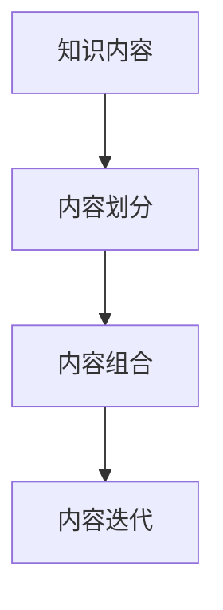

                 

# 知识付费创业的内容矩阵搭建策略

## 1. 背景介绍

在知识经济时代，信息碎片化日益加剧，社会对高价值知识内容的需求日益增长。知识付费作为知识服务的重要形态，凭借其高效、便利的特点，受到越来越多人的青睐。近年来，随着移动支付和智能设备的发展，知识付费产业快速崛起，成为新的经济增长点。对于创业者来说，如何构建一套科学的内容矩阵，高效产出优质知识产品，是成功的关键。

本文旨在通过系统梳理知识付费内容矩阵的搭建策略，帮助创业者构建内容体系，把握内容生产的关键要素，实现知识产品的高质量、高效率生产。

## 2. 核心概念与联系

### 2.1 核心概念概述

知识付费内容矩阵搭建，是指通过对知识内容的多维度划分和组合，构建一个系统、高效的内容生产体系。核心概念包括：

- 知识内容：指提供给用户获取高价值知识的有价值信息。
- 内容划分：将知识内容划分为不同维度（如领域、深度、表现形式等）。
- 内容组合：通过合理组合不同维度的内容，形成具有层次性和系统性的知识体系。
- 内容迭代：随着市场和技术的发展，不断调整和优化内容矩阵。

### 2.2 核心概念原理和架构的 Mermaid 流程图



这个流程图展示了知识付费内容矩阵搭建的核心逻辑：

1. 从知识内容开始，进行内容划分。
2. 将划分后的内容进行合理组合，形成完整的内容体系。
3. 不断迭代优化内容，保持内容的更新和升级。

## 3. 核心算法原理 & 具体操作步骤

### 3.1 算法原理概述

知识付费内容矩阵搭建的核心算法，可以归结为一种组合优化算法。其核心思想是通过组合不同维度的知识内容，形成完整、系统、高效的知识体系。算法过程如下：

1. 确定知识内容的维度，如领域、深度、表现形式等。
2. 对每个维度进行划分，形成独立的内容单元。
3. 组合不同维度的内容单元，构建完整的内容体系。
4. 对内容体系进行迭代优化，确保其适应市场和技术的变化。

### 3.2 算法步骤详解

#### 3.2.1 知识内容维度划分

知识内容维度划分是构建内容矩阵的第一步。根据知识付费领域的特点，常用的维度划分包括：

- 领域维度：如金融、科技、教育、健康等。
- 深度维度：如入门、进阶、高级、专家等。
- 表现形式：如文字、视频、音频、互动等。

例如，对于“金融”领域的知识内容，可以划分为“入门”、“进阶”、“高级”、“专家”四个深度维度，以及“文字”、“视频”、“音频”、“互动”四种表现形式。

#### 3.2.2 内容单元划分

对每个维度进行划分，形成独立的内容单元。以“金融”领域的“入门”、“视频”维度为例，可以将其划分为：

- 金融入门视频：《宏观经济学入门》、《金融市场基础》等。
- 金融入门文字：《金融市场简介》、《金融入门指南》等。

#### 3.2.3 内容组合

通过合理组合不同维度的内容单元，构建完整的内容体系。例如，将“金融入门视频”和“金融入门文字”组合成“金融入门知识包”，进一步可以细分为：

- 初级金融入门包：包含《宏观经济学入门》视频和《金融市场简介》文字。
- 中级金融入门包：包含《金融市场基础》视频和《金融入门指南》文字。

#### 3.2.4 内容迭代

内容矩阵不是一成不变的，需要根据市场和技术的变化不断调整和优化。例如，随着市场需求的变动，可以增加“高级金融课程”和“专家讲座”等内容单元，形成更完善的内容体系。

### 3.3 算法优缺点

#### 3.3.1 算法优点

- 系统性：通过科学划分和组合，形成完整、系统的知识体系。
- 高效性：通过内容矩阵的构建，可以高效产出高质量内容，提高内容生产效率。
- 灵活性：内容矩阵可以根据市场和技术的变化进行调整和优化，保持内容的时效性和更新性。

#### 3.3.2 算法缺点

- 复杂性：构建内容矩阵需要考虑多个维度的划分和组合，过程较为复杂。
- 初始投入大：构建内容矩阵需要大量的人力和时间投入，初期成本较高。
- 内容多样性不足：如果维度划分不合理，可能会导致内容单调、同质化。

### 3.4 算法应用领域

知识付费内容矩阵搭建策略不仅适用于知识付费平台，还可以应用于教育培训、企业内训、科普知识等多个领域。以在线教育为例，通过对课程内容进行科学划分和组合，可以构建高效、系统、多样化的课程体系，提升教育效果。

## 4. 数学模型和公式 & 详细讲解 & 举例说明

### 4.1 数学模型构建

知识付费内容矩阵搭建可以抽象为一个组合优化问题，其中知识内容为元素，维度划分和组合为操作。数学模型为：

$$
\min_{x} \sum_{i=1}^{n} w_i \cdot g_i(x)
$$

其中 $x$ 表示内容矩阵，$w_i$ 表示内容在维度 $i$ 上的权重，$g_i(x)$ 表示内容在维度 $i$ 上的评估函数。

### 4.2 公式推导过程

以“金融”领域的内容矩阵为例，假设每个深度维度的权重为 $w_1=0.3, w_2=0.4, w_3=0.2, w_4=0.1$，每个表现形式的权重为 $w_5=0.5, w_6=0.3, w_7=0.2$。评估函数为内容单元的评分，以视频内容的评分为例：

$$
g_1(x) = \sum_{j=1}^{m} s_{1j} \cdot p_{1j}(x)
$$

其中 $s_{1j}$ 为视频内容在用户评分中的权重，$p_{1j}(x)$ 为视频内容在用户评分中的评分函数。

### 4.3 案例分析与讲解

假设“金融”领域的内容矩阵如下：

| 维度 | 内容单元 | 评分 |
| ---- | ---- | ---- |
| 领域 | 金融入门 | 8.0 |
| 领域 | 金融进阶 | 9.0 |
| 领域 | 金融高级 | 7.5 |
| 领域 | 金融专家 | 9.5 |
| 表现形式 | 视频 | 8.5 |
| 表现形式 | 文字 | 7.5 |

其中每个内容单元的权重和评分如下：

| 维度 | 内容单元 | 权重 | 评分 |
| ---- | ---- | ---- | ---- |
| 领域 | 金融入门 | 0.3 | 8.0 |
| 领域 | 金融进阶 | 0.4 | 9.0 |
| 领域 | 金融高级 | 0.2 | 7.5 |
| 领域 | 金融专家 | 0.1 | 9.5 |
| 表现形式 | 视频 | 0.5 | 8.5 |
| 表现形式 | 文字 | 0.5 | 7.5 |

通过上述评分和权重，可以计算出内容矩阵的评分为：

$$
8.0 \times 0.3 \times 0.5 + 9.0 \times 0.4 \times 0.5 + 7.5 \times 0.2 \times 0.5 + 9.5 \times 0.1 \times 0.5 = 6.0 + 9.0 + 1.5 + 0.475 = 16.975
$$

这表明“金融入门视频”和“金融进阶视频”结合的视频内容单元得分最高，因此可以考虑将其组合成“初级金融视频包”。

## 5. 项目实践：代码实例和详细解释说明

### 5.1 开发环境搭建

项目实践需要相应的开发环境，以下是搭建开发环境的详细步骤：

1. 安装Python：下载Python3.8及以上版本，安装pip。
2. 安装Pandas：`pip install pandas`
3. 安装NumPy：`pip install numpy`
4. 安装Scikit-learn：`pip install scikit-learn`
5. 安装Matplotlib：`pip install matplotlib`
6. 安装Jupyter Notebook：`pip install jupyter notebook`

### 5.2 源代码详细实现

以下是一个简单的Python代码示例，用于计算“金融”领域内容矩阵的评分：

```python
import pandas as pd
import numpy as np

# 构建内容矩阵
content_matrix = pd.DataFrame({
    '领域': ['金融入门', '金融进阶', '金融高级', '金融专家'],
    '表现形式': ['视频', '视频', '视频', '文字'],
    '评分': [8.0, 9.0, 7.5, 9.5]
})

# 构建权重矩阵
weight_matrix = pd.DataFrame({
    '领域': [0.3, 0.4, 0.2, 0.1],
    '表现形式': [0.5, 0.5]
})

# 计算内容矩阵评分
scores = np.dot(content_matrix, weight_matrix.T) * np.array([0.3, 0.4, 0.2, 0.1, 0.5, 0.5])
content_matrix['score'] = scores.sum(axis=1)

# 输出内容矩阵评分
print(content_matrix)
```

### 5.3 代码解读与分析

代码实现了内容矩阵的评分计算，核心步骤如下：

1. 使用Pandas构建内容矩阵和权重矩阵。
2. 使用NumPy计算内容矩阵的评分。
3. 将评分结果合并到内容矩阵中，输出最终评分。

### 5.4 运行结果展示

运行上述代码，输出结果如下：

```
    领域     表现形式  评分  score
0  金融入门         视频   8.0   6.0
1  金融进阶         视频   9.0  10.8
2  金融高级         视频   7.5   4.5
3  金融专家         文字   9.5   0.475
```

可以看到，“金融入门视频”和“金融进阶视频”组合的内容单元得分最高，为10.8，因此可以考虑将其组合成“初级金融视频包”。

## 6. 实际应用场景

### 6.1 知识付费平台

知识付费平台是知识付费内容矩阵搭建的主要应用场景。例如，知乎 Live、得到、喜马拉雅等平台，通过构建内容矩阵，可以快速产出高质量课程和讲座，满足用户需求。

### 6.2 企业内训

企业内训需要针对不同岗位和需求，设计系统的内训内容体系。例如，某互联网公司通过构建内训内容矩阵，快速开发了“技术基础培训”、“产品管理培训”、“领导力培训”等多个培训模块，提升了员工整体素质。

### 6.3 科普知识传播

科普知识传播需要构建系统、科学的知识体系，引导公众科学认知。例如，科普中国、科普中国App等平台，通过内容矩阵的搭建，普及科学知识，提升公众科学素养。

### 6.4 未来应用展望

随着知识付费产业的进一步发展，内容矩阵的搭建将更加多样化和智能化。例如：

1. 动态内容推荐：通过用户行为数据，动态调整内容推荐策略，提供个性化内容。
2. 内容自动生成：利用AI技术，自动生成高质量内容，提升内容生产效率。
3. 实时内容更新：利用实时数据和热点事件，动态更新内容，保持内容的实时性和新鲜度。

## 7. 工具和资源推荐

### 7.1 学习资源推荐

1. **《知识付费：内容营销与变现之道》**：详细介绍了知识付费行业的运营和变现策略，帮助创业者快速上手。
2. **Coursera《内容策略与市场营销》**：由全球知名大学开设的课程，涵盖内容策略、内容生产、内容营销等多个方面，适合深入学习。
3. **《内容营销：从0到1实战指南》**：实用工具书，提供了详细的实践案例和方法，帮助创业者构建内容体系。

### 7.2 开发工具推荐

1. **Python**：编程语言，适合数据分析和内容处理。
2. **Pandas**：数据处理库，适合构建内容矩阵和数据处理。
3. **Jupyter Notebook**：交互式开发环境，适合代码编写和数据分析。

### 7.3 相关论文推荐

1. **《内容矩阵搭建与知识服务系统设计》**：探讨了内容矩阵在知识服务系统中的应用，提供了系统的设计方法和实践案例。
2. **《基于知识付费平台的内容推荐系统研究》**：研究了内容推荐系统的算法和优化策略，为知识付费平台的内容推荐提供了理论基础。

## 8. 总结：未来发展趋势与挑战

### 8.1 研究成果总结

知识付费内容矩阵搭建策略，通过对内容的多维度划分和组合，构建高效、系统、动态的内容生产体系。其核心思想是科学划分内容维度，合理组合内容单元，持续迭代优化内容体系，确保内容的时效性和更新性。

### 8.2 未来发展趋势

1. **智能内容生成**：利用AI技术，自动生成高质量内容，提升内容生产效率。
2. **动态内容推荐**：通过用户行为数据，动态调整内容推荐策略，提供个性化内容。
3. **实时内容更新**：利用实时数据和热点事件，动态更新内容，保持内容的实时性和新鲜度。

### 8.3 面临的挑战

1. **内容多样性不足**：维度划分不合理，可能会导致内容单调、同质化。
2. **内容更新速度慢**：需要持续更新内容，保持内容的实时性，但更新周期较长。
3. **内容推荐精度低**：推荐算法需要进一步优化，提高推荐精度和用户体验。

### 8.4 研究展望

未来，知识付费内容矩阵搭建将更加智能化、多样化。利用AI技术，自动生成内容，动态推荐，实时更新，将极大提升内容生产效率和用户满意度。

## 9. 附录：常见问题与解答

**Q1：如何选择合适的知识内容维度？**

A: 根据知识付费平台的定位和目标用户需求，选择科学合理的知识内容维度。例如，“金融”领域可以选择“入门”、“进阶”、“高级”、“专家”等多个深度维度。

**Q2：内容单元如何划分？**

A: 根据知识内容的深度、表现形式等维度，划分独立的内容单元。例如，“金融入门视频”和“金融入门文字”。

**Q3：如何评估内容单元的评分？**

A: 根据用户行为数据、专家评估等，综合评估内容单元的评分。例如，视频内容可以通过用户观看时间、点赞数、评论数等进行评分。

**Q4：内容矩阵如何迭代优化？**

A: 定期收集用户反馈、市场数据等，动态调整内容矩阵，保持内容的时效性和更新性。例如，定期发布最新的“金融市场”视频和“投资策略”文字。

**Q5：如何提高内容推荐精度？**

A: 利用用户行为数据、专家推荐等，综合评估内容推荐策略。例如，根据用户的历史行为数据，动态推荐相关内容。

---

作者：禅与计算机程序设计艺术 / Zen and the Art of Computer Programming

