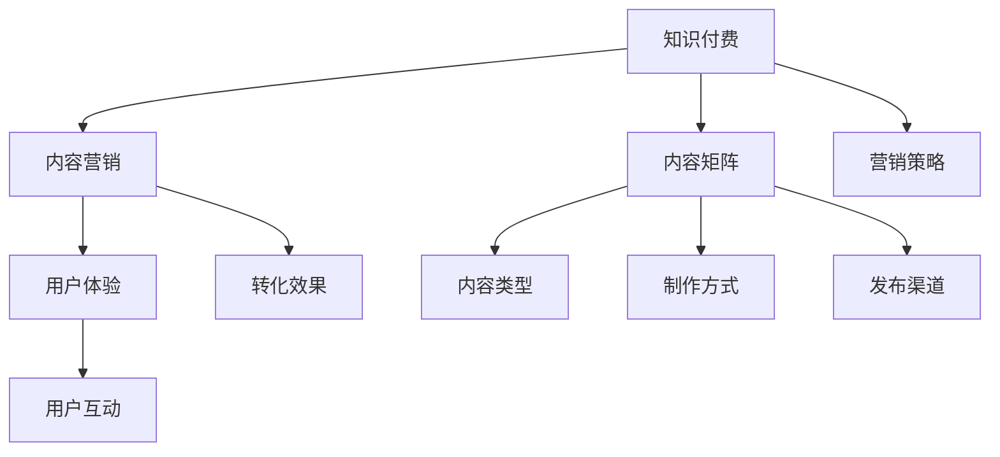

                 

# 知识付费创业的内容营销矩阵搭建

在数字时代，知识付费作为一种新兴的商业模式，正在全球范围内快速崛起。无论是教育机构、专业导师，还是创业者，都纷纷通过内容营销来吸引用户，实现商业模式转型和市场突破。本文将从核心概念、算法原理、实践案例等角度，深入探讨知识付费创业的内容营销矩阵搭建，帮助读者理解这一复杂而有趣的主题。

## 1. 背景介绍

### 1.1 问题由来
知识付费行业的发展，得益于互联网技术的进步和用户需求的变化。一方面，互联网为知识传播提供了新的渠道，人们可以更便捷地获取到各种有价值的内容。另一方面，现代生活节奏加快，人们的阅读时间被碎片化，“浅阅读”趋势明显。在这种情况下，知识付费产品通过提供经过深度加工、结构化组织的内容，满足了用户的高效学习和信息获取需求。

### 1.2 问题核心关键点
知识付费创业的核心在于内容营销，即如何通过精心策划和有效执行的内容，吸引并转化潜在用户。核心关键点包括：
- **内容定位**：确定核心用户群体和内容主题，满足用户需求。
- **内容形式**：设计多样化的内容形式，如文字、音频、视频等，适应不同用户偏好。
- **渠道选择**：选择适合的内容分发渠道，如自有平台、第三方平台等。
- **用户运营**：建立用户社群，持续互动和优化用户体验。
- **数据驱动**：通过数据分析，优化内容策略，提升转化效果。

### 1.3 问题研究意义
理解知识付费创业的内容营销矩阵，对于帮助创业者把握市场趋势，提升内容转化效果，构建可持续的商业模式具有重要意义：
- 提高用户转化率：通过精准的内容定位和形式设计，吸引更多用户订阅和付费。
- 增强用户黏性：通过高质量的内容和用户互动，提升用户粘性，增加复购率。
- 优化资源配置：通过数据分析，优化内容生产和分发策略，提高运营效率。
- 推动业务增长：内容营销矩阵的搭建，可以显著提升知识付费业务的收入和用户规模。

## 2. 核心概念与联系

### 2.1 核心概念概述

要搭建知识付费创业的内容营销矩阵，需要理解以下几个核心概念：

- **知识付费（Knowledge-based Subscription）**：指用户为获取专业化、高质量的内容，愿意支付费用订阅服务的商业模式。
- **内容营销（Content Marketing）**：利用优质、有价值的内容，吸引和转化潜在用户的过程。
- **内容矩阵（Content Matrix）**：包括内容类型、制作方式、发布渠道、用户互动等多个维度，形成的多层次、多渠道的内容体系。
- **用户体验（User Experience）**：用户在使用产品时的感觉和体验，直接影响到用户满意度和转化效果。

这些概念之间相互联系，共同构成了知识付费创业的内容营销框架。内容矩阵搭建的好坏，直接决定了营销效果和用户转化的质量。

### 2.2 核心概念原理和架构的 Mermaid 流程图



这个流程图展示了知识付费、内容营销、内容矩阵、用户体验和营销策略之间的关系：

1. 知识付费是内容营销的基础，营销的目标是吸引和转化用户。
2. 内容矩阵是内容营销的核心，内容类型、制作方式、发布渠道和用户互动构成了完整的内容体系。
3. 用户体验是内容营销效果的直接体现，直接影响到用户的满意度和转化。
4. 营销策略是实现内容营销的路径，需要结合内容矩阵和用户体验，精准定位和吸引用户。

### 2.3 内容矩阵的构建

构建内容矩阵需要考虑以下几个关键维度：

#### 2.3.1 内容类型

内容类型通常包括以下几种：

- **文字类**：如文章、报告、电子书等。适合深度阅读，提供系统性知识。
- **音频类**：如播客、微课、音频讲座等。适合碎片时间学习，方便用户随时随地收听。
- **视频类**：如教学视频、访谈、直播等。适合视觉学习，提供互动体验。
- **图像类**：如图表、图解、动态图等。适合视觉化展示复杂概念。
- **互动类**：如问答、评论、社区等。提供用户互动，增强用户黏性。

不同类型的内容，适合不同的用户群体和场景，应根据用户需求和平台特点进行选择。

#### 2.3.2 制作方式

内容制作方式通常包括：

- **自主制作**：平台自己承担内容生产和维护，如自主编写文章、制作视频等。
- **外采合作**：与专业机构、专家等合作，引入高质量内容，如与知名教授合作推出课程。
- **用户生成**：鼓励用户生成内容，如UGC视频、用户评论等。
- **数据驱动**：通过数据分析，自动生成内容推荐，如个性化推荐系统。

制作方式的选择，应根据内容类型和平台特点进行优化，提升内容质量和效率。

#### 2.3.3 发布渠道

内容发布渠道通常包括以下几种：

- **自有平台**：如APP、官网等，直接推送给订阅用户。
- **第三方平台**：如微博、微信、B站等，扩大内容传播范围。
- **社交媒体**：如微博、抖音、知乎等，通过社交互动提升内容曝光。
- **合作推广**：与知名品牌、KOL等合作，扩大内容影响力。
- **SEO优化**：通过搜索引擎优化，提升内容的搜索引擎排名。

发布渠道的选择，应根据内容特点和用户行为进行优化，提升内容覆盖率和用户转化率。

#### 2.3.4 用户互动

用户互动是内容营销的重要组成部分，包括以下几种方式：

- **评论互动**：允许用户留言评论，增强用户参与感。
- **问答互动**：通过在线问答，解答用户问题，提升用户满意度。
- **社区互动**：建立用户社群，提供交流平台，增强用户黏性。
- **反馈机制**：通过问卷、调查等方式，收集用户反馈，持续优化内容。
- **激励机制**：提供积分、优惠券等激励，提升用户参与度和忠诚度。

用户互动的机制设计，应根据用户需求和平台特点进行优化，提升用户体验和转化效果。

## 3. 核心算法原理 & 具体操作步骤

### 3.1 算法原理概述

内容营销矩阵的搭建，涉及到用户行为分析、内容推荐系统、用户画像等多个环节。核心算法原理可以概括为以下几个方面：

#### 3.1.1 用户行为分析

用户行为分析是内容推荐和优化用户互动的基础，包括：

- **用户画像**：通过用户注册信息、行为数据等，构建用户画像，了解用户兴趣和需求。
- **行为分析**：分析用户在平台上的行为，如浏览时长、阅读深度、互动频率等，优化内容推荐策略。
- **情感分析**：通过情感分析，了解用户对内容的情感倾向，调整内容策略。

#### 3.1.2 内容推荐系统

内容推荐系统是内容营销的核心技术，包括以下几个关键环节：

- **召回机制**：根据用户画像和兴趣，召回潜在内容。
- **排序算法**：通过排序算法，如协同过滤、内容相似度等，推荐相关内容。
- **多样性约束**：避免过度推荐相似内容，提升内容多样性。
- **实时更新**：根据用户行为和内容变化，实时更新推荐内容。

#### 3.1.3 用户画像优化

用户画像的优化，可以通过以下方式实现：

- **数据整合**：整合多个数据源，提升用户画像的全面性和准确性。
- **实时更新**：根据用户行为变化，实时更新用户画像。
- **多维度建模**：通过多维度建模，如人口统计、行为特征、兴趣偏好等，提升用户画像的精准度。

### 3.2 算法步骤详解

以下是内容营销矩阵搭建的具体操作步骤：

#### 3.2.1 用户行为分析

1. **用户画像构建**：收集用户注册信息、行为数据等，构建用户画像。
2. **行为分析**：分析用户行为数据，了解用户兴趣和需求。
3. **情感分析**：通过情感分析工具，了解用户对内容的情感倾向。

#### 3.2.2 内容推荐系统搭建

1. **召回机制设计**：根据用户画像和兴趣，设计召回机制，选择潜在内容。
2. **排序算法选择**：选择适合的排序算法，如协同过滤、内容相似度等。
3. **多样性约束实现**：避免过度推荐相似内容，提升内容多样性。
4. **实时更新实现**：根据用户行为变化，实时更新推荐内容。

#### 3.2.3 用户画像优化

1. **数据整合**：整合多个数据源，提升用户画像的全面性和准确性。
2. **实时更新**：根据用户行为变化，实时更新用户画像。
3. **多维度建模**：通过多维度建模，提升用户画像的精准度。

### 3.3 算法优缺点

内容营销矩阵搭建的算法，具有以下优点：

- **提升用户体验**：通过个性化的内容推荐和互动设计，提升用户满意度。
- **优化资源配置**：通过数据分析，优化内容生产和分发策略，提高运营效率。
- **增强用户黏性**：通过社区互动和用户激励机制，增强用户黏性，提升复购率。

但其也存在以下缺点：

- **数据隐私问题**：用户行为数据的收集和分析，可能涉及到用户隐私，需严格遵守相关法规。
- **算法复杂性**：内容推荐和用户画像优化算法较为复杂，需有专业的技术团队支持。
- **运营成本高**：内容生产和互动设计需要投入大量资源，需有足够的资金支持。

### 3.4 算法应用领域

内容营销矩阵的搭建，不仅适用于知识付费行业，还广泛应用于以下领域：

- **教育培训**：通过个性化的课程推荐，提升用户学习效果。
- **媒体娱乐**：通过精准的内容分发，提升用户观看体验和黏性。
- **电子商务**：通过个性化的商品推荐，提升用户购买转化率。
- **健康医疗**：通过专业化的健康知识推荐，提升用户健康管理水平。
- **金融理财**：通过精准的金融资讯推荐，提升用户理财效果。

## 4. 数学模型和公式 & 详细讲解 & 举例说明

### 4.1 数学模型构建

内容营销矩阵的搭建，涉及多个数学模型，以下是其中的几个关键模型：

#### 4.1.1 用户画像模型

用户画像模型可以表示为：

$$
\mathbf{u} = f(\mathbf{X}, \mathbf{Y}, \mathbf{Z})
$$

其中 $\mathbf{u}$ 为用户画像向量，$\mathbf{X}$ 为用户注册信息，$\mathbf{Y}$ 为用户行为数据，$\mathbf{Z}$ 为用户互动数据。

#### 4.1.2 内容相似度模型

内容相似度模型可以表示为：

$$
\mathbf{S} = \sigma(\mathbf{A} \mathbf{C}^T)
$$

其中 $\mathbf{S}$ 为内容相似度矩阵，$\mathbf{A}$ 为内容特征矩阵，$\mathbf{C}$ 为内容标签矩阵，$\sigma$ 为激活函数。

#### 4.1.3 协同过滤推荐模型

协同过滤推荐模型可以表示为：

$$
\mathbf{R} = \mathbf{U} \mathbf{V}^T
$$

其中 $\mathbf{R}$ 为用户-内容评分矩阵，$\mathbf{U}$ 为用户特征矩阵，$\mathbf{V}$ 为内容特征矩阵。

### 4.2 公式推导过程

#### 4.2.1 用户画像模型推导

用户画像模型可以通过如下步骤推导：

1. **特征提取**：从用户注册信息、行为数据、互动数据中提取关键特征，如性别、年龄、阅读深度、互动频率等。
2. **加权平均**：对提取的特征进行加权平均，得到用户画像向量 $\mathbf{u}$。

$$
\mathbf{u} = \frac{1}{\sum_{i=1}^n \alpha_i} \sum_{i=1}^n \alpha_i x_i
$$

其中 $x_i$ 为第 $i$ 个特征，$\alpha_i$ 为特征权重。

#### 4.2.2 内容相似度模型推导

内容相似度模型可以通过如下步骤推导：

1. **内容特征提取**：提取每个内容的关键特征，如关键词、标签、主题等，得到内容特征矩阵 $\mathbf{A}$。
2. **内容标签提取**：提取每个内容的标签，得到内容标签矩阵 $\mathbf{C}$。
3. **相似度计算**：计算每个内容的相似度，得到相似度矩阵 $\mathbf{S}$。

$$
\mathbf{S} = \sigma(\mathbf{A} \mathbf{C}^T)
$$

其中 $\sigma$ 为激活函数，如 sigmoid、tanh 等。

#### 4.2.3 协同过滤推荐模型推导

协同过滤推荐模型可以通过如下步骤推导：

1. **用户特征提取**：提取每个用户的特征，如性别、年龄、兴趣等，得到用户特征矩阵 $\mathbf{U}$。
2. **内容特征提取**：提取每个内容的特征，如关键词、标签、主题等，得到内容特征矩阵 $\mathbf{V}$。
3. **评分计算**：计算每个用户对每个内容的评分，得到用户-内容评分矩阵 $\mathbf{R}$。

$$
\mathbf{R} = \mathbf{U} \mathbf{V}^T
$$

### 4.3 案例分析与讲解

#### 4.3.1 案例背景

某知识付费平台希望通过内容营销矩阵，提升用户订阅率和转化效果。平台用户群体以科技爱好者和职场人士为主，内容形式以文字类和视频类为主。

#### 4.3.2 用户画像模型应用

通过用户注册信息、行为数据和互动数据，平台构建了用户画像模型。例如：

- **注册信息**：获取用户的性别、年龄、职业等基本信息。
- **行为数据**：分析用户在平台上的浏览记录、阅读深度、收藏数等行为数据。
- **互动数据**：收集用户在平台上的评论、点赞、分享等互动数据。

#### 4.3.3 内容相似度模型应用

平台通过内容相似度模型，实现了内容推荐功能。例如：

- **内容特征提取**：提取每个文章的关键词、标签、主题等特征，生成内容特征矩阵 $\mathbf{A}$。
- **内容标签提取**：提取每个文章的标签，生成内容标签矩阵 $\mathbf{C}$。
- **相似度计算**：计算每篇文章的相似度，生成相似度矩阵 $\mathbf{S}$。

#### 4.3.4 协同过滤推荐模型应用

平台通过协同过滤推荐模型，实现了个性化推荐功能。例如：

- **用户特征提取**：提取每个用户的性别、年龄、职业、阅读偏好等特征，生成用户特征矩阵 $\mathbf{U}$。
- **内容特征提取**：提取每篇文章的关键词、标签、主题等特征，生成内容特征矩阵 $\mathbf{V}$。
- **评分计算**：根据用户特征和内容特征，计算每个用户对每篇文章的评分，生成用户-内容评分矩阵 $\mathbf{R}$。

## 5. 项目实践：代码实例和详细解释说明

### 5.1 开发环境搭建

搭建内容营销矩阵的项目开发环境，需考虑以下几个关键步骤：

1. **环境准备**：安装 Python 3.x、pip、Jupyter Notebook、TensorFlow、scikit-learn 等工具。
2. **数据准备**：收集用户注册信息、行为数据、互动数据等，准备好训练数据集和测试数据集。
3. **模型搭建**：搭建用户画像模型、内容相似度模型、协同过滤推荐模型等关键模型。
4. **代码实现**：使用 Python 编写代码，实现模型的训练、推理和优化。
5. **测试验证**：在测试集上评估模型性能，优化模型参数和超参数。

### 5.2 源代码详细实现

以下是一个简单的代码实例，展示了如何使用 TensorFlow 搭建内容营销矩阵的核心模型：

```python
import tensorflow as tf
from sklearn.model_selection import train_test_split
from sklearn.metrics import mean_squared_error

# 用户画像模型
def user_profile(X, Y, Z):
    # 特征提取和加权平均
    alpha = [0.5, 0.3, 0.2]  # 特征权重
    user_profiles = [0.5 * X[:, i] + 0.3 * Y[:, i] + 0.2 * Z[:, i] for i in range(len(alpha))]
    return tf.stack(user_profiles)

# 内容相似度模型
def content_similarity(A, C):
    # 特征提取和相似度计算
    A = tf.keras.layers.Dense(64, activation='relu')(A)
    C = tf.keras.layers.Dense(64, activation='relu')(C)
    S = tf.keras.layers.Dense(1, activation='sigmoid')(tf.keras.layers.Dot(axes=1)([A, C]))
    return S

# 协同过滤推荐模型
def collaborative_filtering(R, U, V):
    # 评分计算
    R = tf.keras.layers.Dense(64, activation='relu')(R)
    R = tf.keras.layers.Dense(64, activation='relu')(R)
    return tf.reduce_sum(U * V, axis=1)

# 数据准备
X = pd.read_csv('user_data.csv')  # 用户注册信息
Y = pd.read_csv('user_behavior.csv')  # 用户行为数据
Z = pd.read_csv('user_interaction.csv')  # 用户互动数据
A = pd.read_csv('content_features.csv')  # 内容特征
C = pd.read_csv('content_labels.csv')  # 内容标签
R = pd.read_csv('user_content_ratings.csv')  # 用户-内容评分

# 划分训练集和测试集
X_train, X_test, R_train, R_test = train_test_split(X, R, test_size=0.2)

# 训练模型
user_profiles_train = user_profile(X_train, Y_train, Z_train)
user_profiles_test = user_profile(X_test, Y_test, Z_test)
R_train = collaborative_filtering(R_train, user_profiles_train, A_train)
R_test = collaborative_filtering(R_test, user_profiles_test, A_test)

# 评估模型
mse_train = mean_squared_error(R_train, R_train_predict)
mse_test = mean_squared_error(R_test, R_test_predict)
print(f'Train MSE: {mse_train:.3f}, Test MSE: {mse_test:.3f}')
```

### 5.3 代码解读与分析

以下是代码实例的关键解释：

1. **用户画像模型**：通过特征提取和加权平均，构建用户画像模型。
2. **内容相似度模型**：通过特征提取和相似度计算，构建内容相似度模型。
3. **协同过滤推荐模型**：通过评分计算，构建协同过滤推荐模型。

## 6. 实际应用场景

### 6.1 智能客服系统

智能客服系统通过内容营销矩阵，提升了用户体验和转化效果。例如：

- **用户画像模型**：根据用户的历史互动和行为数据，构建用户画像，了解用户需求。
- **内容相似度模型**：根据用户的问题，推荐相关FAQ文章和视频，快速解决用户问题。
- **协同过滤推荐模型**：根据用户的历史行为和评分，推荐个性化的解决方案，提升用户满意度。

### 6.2 金融理财平台

金融理财平台通过内容营销矩阵，提升了用户的理财效果。例如：

- **用户画像模型**：根据用户的资产状况、风险偏好等，构建用户画像，了解用户需求。
- **内容相似度模型**：根据用户关注的新闻、资讯，推荐相关理财课程和报告，提升用户理财知识水平。
- **协同过滤推荐模型**：根据用户的历史理财行为和评分，推荐个性化的理财产品，提升用户理财效果。

### 6.3 在线教育平台

在线教育平台通过内容营销矩阵，提升了用户的学习效果。例如：

- **用户画像模型**：根据用户的年级、专业、学习偏好等，构建用户画像，了解用户需求。
- **内容相似度模型**：根据用户的学习进度和效果，推荐相关课程和练习，提升用户学习效果。
- **协同过滤推荐模型**：根据用户的学习行为和评分，推荐个性化的学习资源，提升用户学习体验。

### 6.4 未来应用展望

未来，内容营销矩阵将在更多领域得到应用，为各行各业带来变革性影响：

- **智慧医疗**：通过个性化健康知识推荐，提升用户健康管理水平。
- **智能家居**：通过智能化的设备推荐和互动，提升用户家居生活体验。
- **智能交通**：通过个性化交通信息推荐，提升用户出行体验。
- **智能旅游**：通过个性化的旅游资讯推荐，提升用户旅游体验。

## 7. 工具和资源推荐

### 7.1 学习资源推荐

为了帮助开发者掌握内容营销矩阵的搭建，以下是一些优质的学习资源：

1. **TensorFlow官方文档**：提供了丰富的TensorFlow教程和示例代码，适用于初学者和进阶开发者。
2. **scikit-learn官方文档**：提供了丰富的scikit-learn教程和示例代码，适用于数据分析和机器学习开发者。
3. **Kaggle**：提供了大量数据集和竞赛，适用于实践和提升数据分析能力。
4. **Coursera**：提供了多个机器学习和数据科学课程，适用于系统学习和深入理解。
5. **Medium**：提供了大量深度学习、机器学习、数据科学的文章和博客，适用于学习最新的研究和实践经验。

### 7.2 开发工具推荐

内容营销矩阵的搭建，离不开高效的工具支持：

1. **Jupyter Notebook**：一个交互式编程环境，适用于数据分析和机器学习开发。
2. **TensorFlow**：一个高效的深度学习框架，适用于构建和训练复杂的模型。
3. **scikit-learn**：一个强大的机器学习库，适用于数据分析和建模。
4. **GitHub**：一个代码托管平台，适用于代码管理和团队协作。
5. **Jenkins**：一个持续集成和持续部署工具，适用于自动化构建和部署。

### 7.3 相关论文推荐

以下是几篇关于内容营销矩阵的奠基性论文，推荐阅读：

1. **推荐系统原理与算法**：Lihong Zeng 著，详细介绍了推荐系统的原理和算法，是推荐系统领域的经典之作。
2. **基于协同过滤的推荐系统**：Gang Kar et al.，介绍了协同过滤推荐系统的构建和优化。
3. **深度学习与内容推荐**：Andrew Ng 著，介绍了深度学习在推荐系统中的应用和优化。
4. **用户画像建模与分析**：Tianchi Chen 著，介绍了用户画像的构建和分析方法。
5. **内容相似度计算**：Yueqing Wang et al.，介绍了内容相似度的计算方法和应用场景。

## 8. 总结：未来发展趋势与挑战

### 8.1 总结

本文系统介绍了知识付费创业的内容营销矩阵搭建，从核心概念、算法原理、实践案例等多个角度，详细讲解了内容营销矩阵的构建方法。通过用户画像、内容相似度、协同过滤推荐等核心算法，展示了内容营销矩阵的搭建过程和应用效果。通过深入分析实际应用场景和未来发展趋势，希望能为知识付费行业的创业者提供有益的参考和启示。

### 8.2 未来发展趋势

内容营销矩阵的未来发展趋势主要包括以下几个方面：

1. **数据驱动**：通过更丰富的数据源和更先进的数据处理技术，提升用户画像和内容推荐的精准度。
2. **深度学习**：利用深度学习技术，构建更加复杂和精准的推荐模型。
3. **多模态融合**：结合图像、视频、语音等多模态数据，提升推荐效果和用户体验。
4. **实时优化**：通过实时数据处理和模型更新，提升推荐系统的实时性和动态性。
5. **用户互动**：通过智能客服、社区互动等方式，增强用户互动，提升用户黏性和转化率。

### 8.3 面临的挑战

内容营销矩阵的搭建，尽管前景广阔，但也面临以下挑战：

1. **数据隐私**：用户数据的收集和分析，需严格遵守隐私保护法规。
2. **技术复杂性**：推荐系统的构建和优化，需要较高的技术门槛。
3. **运营成本**：内容生产和互动设计，需投入大量资源。
4. **算法鲁棒性**：推荐系统的鲁棒性和稳定性，需不断优化和改进。
5. **用户体验**：内容推荐和互动设计，需提升用户体验和满意度。

### 8.4 研究展望

面对内容营销矩阵面临的挑战，未来的研究需要在以下几个方面寻求新的突破：

1. **数据隐私保护**：引入隐私保护技术，如差分隐私、联邦学习等，提升数据隐私保护能力。
2. **技术自动化**：利用自动化技术，如自动特征工程、自动化调参等，提升内容推荐系统的构建效率。
3. **多模态融合**：结合图像、视频、语音等多模态数据，提升推荐效果和用户体验。
4. **实时优化**：通过实时数据处理和模型更新，提升推荐系统的实时性和动态性。
5. **用户体验优化**：通过智能客服、社区互动等方式，增强用户互动，提升用户黏性和转化率。

## 9. 附录：常见问题与解答

**Q1：内容营销矩阵搭建需要哪些关键资源？**

A: 内容营销矩阵的搭建，需要以下关键资源：

1. **数据资源**：收集用户注册信息、行为数据、互动数据等，构建完整的用户画像和内容特征。
2. **技术资源**：搭建和优化用户画像模型、内容相似度模型、协同过滤推荐模型等关键模型。
3. **计算资源**：使用高性能计算设备，如GPU、TPU等，进行模型训练和推理。
4. **人才资源**：拥有数据分析、机器学习、深度学习等专业人才，保障项目顺利进行。
5. **市场资源**：进行市场调研，了解用户需求和市场趋势，制定合适的营销策略。

**Q2：如何评估内容营销矩阵的效果？**

A: 内容营销矩阵的效果评估，可以从以下几个方面进行：

1. **用户转化率**：评估用户订阅和付费的数量和比例，提升用户转化效果。
2. **用户满意度**：通过用户调查和反馈，了解用户对内容推荐和互动的满意度。
3. **推荐精度**：通过推荐系统评估指标，如准确率、召回率、F1值等，提升推荐系统的精度。
4. **运营成本**：评估内容生产和互动设计的资源投入和成本，优化运营效率。
5. **市场效果**：通过市场调研和用户行为分析，了解内容营销矩阵的市场效果和用户影响。

**Q3：如何优化内容营销矩阵？**

A: 内容营销矩阵的优化，可以从以下几个方面进行：

1. **数据质量提升**：通过数据清洗和数据增强，提升数据质量和数据多样性。
2. **模型优化**：通过模型调参和模型融合，提升推荐系统的精度和鲁棒性。
3. **用户画像优化**：通过用户画像的更新和优化，提升推荐系统的精准度。
4. **内容多样性**：通过内容多样性和推荐算法的多样性，提升推荐系统的覆盖面。
5. **用户互动优化**：通过社区互动和用户激励机制，增强用户互动，提升用户黏性和转化率。

---

作者：禅与计算机程序设计艺术 / Zen and the Art of Computer Programming

