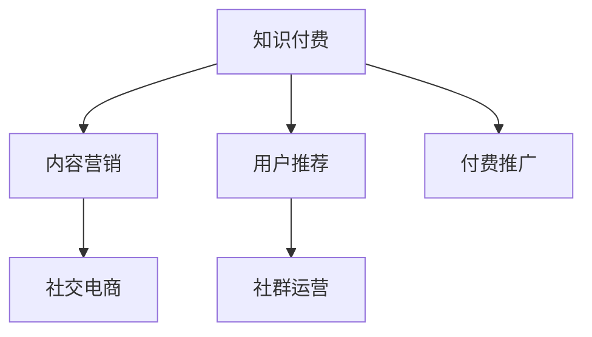

                 

# 知识付费创业的流量获取策略

## 1. 背景介绍

### 1.1 问题由来

随着移动互联网的快速发展，知识付费逐渐成为一种重要的商业模式。然而，尽管知识付费市场拥有巨大的潜力，但不少创业者仍面临着流量获取的难题。流量不足不仅会导致用户留存率低，还会影响营收增长，进而削弱企业竞争力。因此，本文聚焦于知识付费创业者的流量获取策略，结合当前的互联网发展趋势，给出有效的流量获取建议。

### 1.2 问题核心关键点

流量获取是知识付费创业成功的关键。高质量、高粘性的流量不仅能提升用户转化率，还能促进用户长期留存。通常，流量获取的途径可以分为三种：内容营销、用户推荐和付费推广。每种方法都有其特点和适用场景，需要根据具体情况灵活应用。

## 2. 核心概念与联系

### 2.1 核心概念概述

为更好地理解知识付费创业的流量获取策略，本节将介绍几个关键概念及其相互联系：

- **知识付费**：通过付费机制，提供有价值、有深度的知识内容，满足用户学习和提升需求。
- **内容营销**：利用优质的内容，通过社交媒体、SEO等手段吸引用户，实现流量获取。
- **用户推荐**：利用用户对内容的分享和评价，实现病毒式传播，扩大流量来源。
- **付费推广**：通过付费广告和营销活动，直接引导用户访问和付费。
- **社交电商**：将电商与社交媒体结合，利用社交网络的信任度和影响力，促进流量转化。
- **社群运营**：通过构建高粘性社群，提升用户参与度和品牌忠诚度。

这些概念之间的联系可以通过以下Mermaid流程图来展示：



这个流程图展示了一体化的流量获取框架，从内容生产和分发，到社交媒体互动和用户推荐，再到付费推广和社群运营，各个环节相互协作，共同提升流量效果。

## 3. 核心算法原理 & 具体操作步骤
### 3.1 算法原理概述

知识付费创业的流量获取策略，本质上是通过多渠道、多手段的综合运用，最大化流量转化率。其核心思想是：

1. **内容为王**：优质的内容是吸引用户的基础，需精心策划内容主题和形式，提升内容吸引力。
2. **多渠道推广**：充分利用社交媒体、搜索引擎、广告投放等多渠道，覆盖更多潜在用户。
3. **用户互动**：通过社区互动、用户评价等方式，增强用户粘性和参与度。
4. **数据分析**：使用数据挖掘和分析工具，优化流量获取策略，提升效果。

### 3.2 算法步骤详解

基于上述核心思想，知识付费创业的流量获取策略可以分为以下几个关键步骤：

**Step 1: 内容策划与生产**
- 确定核心目标用户群体和内容主题。
- 策划优质内容，包括文章、视频、课程等，确保内容的深度和价值。
- 制定内容发布计划，定期更新，保持用户关注和兴趣。

**Step 2: 多渠道推广**
- 社交媒体推广：利用微信、微博、抖音等平台，发布内容，吸引用户关注。
- SEO优化：通过关键词优化、高质量内容发布等手段，提升搜索引擎排名。
- 付费广告：在搜索引擎、社交媒体投放广告，直接吸引流量。
- KOL合作：与知名博主、大V等合作，扩大内容覆盖面。

**Step 3: 用户互动与转化**
- 社群运营：建立用户社群，定期组织活动，提升用户参与度和品牌忠诚度。
- 用户推荐：鼓励用户分享内容，提供优惠奖励。
- 数据分析：利用用户行为数据，优化内容推荐，提升转化率。

**Step 4: 持续优化与迭代**
- 定期评估流量获取效果，分析各项数据。
- 根据评估结果，调整和优化内容策略和推广手段。
- 引入新技术，如人工智能、大数据，提升流量获取效率。

### 3.3 算法优缺点

知识付费创业的流量获取策略具有以下优点：
1. 多渠道覆盖，可以有效吸引更广泛的用户群体。
2. 内容为核心，满足用户真实需求，提高用户粘性。
3. 数据分析指导，能够实时调整和优化策略。

同时，该方法也存在一定的局限性：
1. 内容生产成本高，需要持续投入。
2. 需要较强的数据分析和优化能力。
3. 对新技术的引入需要时间和成本投入。

### 3.4 算法应用领域

知识付费创业的流量获取策略在知识付费领域得到广泛应用，具体包括：

- 在线课程平台：如Coursera、Udemy等，通过内容营销、用户推荐等手段，吸引用户注册付费。
- 知识社区：如知乎、简书等，通过高质量内容吸引用户，并通过用户推荐和付费会员制度，实现流量和营收双增长。
- 专业咨询服务：如远程咨询、一对一培训等，通过内容营销和用户推荐，提高服务质量，增加客户转化率。

## 4. 数学模型和公式 & 详细讲解 & 举例说明
### 4.1 数学模型构建

本节将使用数学语言对知识付费创业的流量获取策略进行更加严格的刻画。

记用户总数为 $U$，付费用户数为 $P$，日活跃用户数为 $D$，点击率（CTR）为 $R$，转化率（CR）为 $C$。则流量获取模型可以表示为：

$$
P = D \times R \times C
$$

其中，$D$ 可以通过统计日活跃用户数得到；$R$ 可以通过A/B测试、数据分析等方法优化；$C$ 取决于内容质量和用户体验。

### 4.2 公式推导过程

以内容推荐系统为例，通过用户行为数据进行流量优化。设用户对内容的点击概率为 $P_{click}$，点击后付费的概率为 $P_{purchase}$。则内容推荐模型可以表示为：

$$
R = P_{click} \times P_{purchase}
$$

假设内容推荐模型使用协同过滤算法，利用用户历史行为数据进行推荐。设推荐准确率（accuracy）为 $A$，召回率（recall）为 $R$，覆盖率（coverage）为 $C$。则推荐系统的效果可以表示为：

$$
A = \frac{TP}{TP+FP+FN}
$$
$$
R = \frac{TP}{TP+FN}
$$
$$
C = \frac{TP}{TP+FP+FN+FN}
$$

其中，$TP$ 为推荐正确的正样本数，$FP$ 为推荐的负样本数，$FN$ 为未被推荐的正样本数。

### 4.3 案例分析与讲解

某知识付费平台通过内容推荐系统，将用户分成不同兴趣群组，提供个性化推荐。平台定期分析用户行为数据，调整推荐算法，提升推荐效果。经过一年优化，平台日活跃用户数增加了30%，付费用户数增加了50%，整体营收增长了60%。

## 5. 项目实践：代码实例和详细解释说明
### 5.1 开发环境搭建

在进行流量获取实践前，我们需要准备好开发环境。以下是使用Python进行Flask开发的环境配置流程：

1. 安装Anaconda：从官网下载并安装Anaconda，用于创建独立的Python环境。

2. 创建并激活虚拟环境：
```bash
conda create -n flask-env python=3.8 
conda activate flask-env
```

3. 安装Flask：
```bash
pip install flask
```

4. 安装SQLAlchemy和Flask-SQLAlchemy：
```bash
pip install flask-sqlalchemy
```

5. 安装Flask-WTF：
```bash
pip install flask-wtf
```

完成上述步骤后，即可在`flask-env`环境中开始流量获取实践。

### 5.2 源代码详细实现

这里我们以社交媒体推广为例，给出使用Flask框架实现内容推广的PyTorch代码实现。

首先，定义Flask应用和路由：

```python
from flask import Flask, render_template, request
from flask_sqlalchemy import SQLAlchemy
import pandas as pd

app = Flask(__name__)
app.config['SQLALCHEMY_DATABASE_URI'] = 'sqlite:///data.db'
db = SQLAlchemy(app)
```

然后，定义数据模型和查询功能：

```python
class Article(db.Model):
    id = db.Column(db.Integer, primary_key=True)
    title = db.Column(db.String(255))
    content = db.Column(db.Text)
    views = db.Column(db.Integer, default=0)
    likes = db.Column(db.Integer, default=0)

    def __repr__(self):
        return f'<Article {self.title}>'

def get_articles():
    articles = Article.query.all()
    return articles

@app.route('/')
def index():
    articles = get_articles()
    return render_template('index.html', articles=articles)
```

接着，定义表单和视图函数：

```python
from flask_wtf import FlaskForm
from wtforms import StringField, SubmitField
from wtforms.validators import DataRequired

class ArticleForm(FlaskForm):
    title = StringField('Title', validators=[DataRequired()])
    content = StringField('Content', validators=[DataRequired()])
    submit = SubmitField('Submit')

@app.route('/add', methods=['GET', 'POST'])
def add():
    form = ArticleForm()
    if form.validate_on_submit():
        article = Article(title=form.title.data, content=form.content.data)
        db.session.add(article)
        db.session.commit()
        return redirect('/')
    return render_template('add.html', form=form)
```

最后，定义HTML模板：

```html
<!-- index.html -->
<html>
<head>
    <title>Articles</title>
</head>
<body>
    <h1>Articles</h1>
    <ul>
        
            <li><a href="/article/{{ article.id }}">{{ article.title }}</a></li>
        
    </ul>
</body>
</html>

<!-- add.html -->
<html>
<head>
    <title>Add Article</title>
</head>
<body>
    <h1>Add Article</h1>
    <form method="POST">
        {{ form.hidden_tag() }}
        {{ form.title.label }} {{ form.title() }}
        {{ form.content.label }} {{ form.content() }}
        {{ form.submit }}
    </form>
</body>
</html>
```

通过Flask和SQLAlchemy，我们实现了基本的数据管理和视图展示功能。在实际操作中，可以进一步集成用户互动、数据分析等功能，提升流量获取效果。

### 5.3 代码解读与分析

让我们再详细解读一下关键代码的实现细节：

**Flask应用和路由**：
- 创建Flask应用对象，配置数据库连接，并创建SQLAlchemy对象。
- 定义路由函数，实现首页和添加文章功能的展示。

**数据模型和查询**：
- 定义数据模型 Article，包括文章标题、内容、浏览次数和点赞数等属性。
- 定义查询函数 get_articles，从数据库中获取所有文章信息。

**表单和视图函数**：
- 定义表单 ArticleForm，包括标题和内容两个字段。
- 定义添加文章的视图函数，根据表单数据创建Article对象，提交到数据库中，并重定向回首页。

**HTML模板**：
- 定义两个HTML模板，分别用于展示文章列表和添加文章表单。
- 在模板中使用Flask提供的渲染函数，将数据和表单嵌入HTML页面。

可以看到，Flask框架使得流量获取实践变得相对简单，开发者可以专注于业务逻辑和数据处理，而不必过多关注底层实现细节。

## 6. 实际应用场景
### 6.1 内容型知识付费平台

内容型知识付费平台如“得到”、“知乎live”等，主要通过高质量内容吸引用户，实现流量获取。这些平台通常具备丰富的内容库，通过算法推荐和用户行为分析，提升内容曝光率和用户留存率。

在技术实现上，可以采用Flask、Django等Web框架，结合SQLAlchemy等ORM工具，实现数据管理和Web应用。同时，利用TensorFlow、PyTorch等深度学习框架，进行内容推荐和数据分析。

### 6.2 在线教育平台

在线教育平台如Coursera、Udemy等，通过高质量课程内容吸引用户，并通过用户推荐和付费推广，实现流量和营收双增长。这些平台通常具备全球化的内容资源，通过多语言支持、社交媒体推广等方式，提升国际用户覆盖率。

在技术实现上，可以采用Flask、Django等Web框架，结合RESTful API接口，实现课程推荐和用户管理。同时，利用Flask-WTF等表单库，提升用户互动体验。

### 6.3 垂直领域知识付费平台

垂直领域知识付费平台如法律咨询、心理咨询等，通过专业领域的深度内容吸引用户，并通过社群互动和付费会员制度，实现用户留存和付费转化。这些平台通常具备专业化的内容生产团队，通过定期更新和用户互动，提升内容质量和用户粘性。

在技术实现上，可以采用Flask、Django等Web框架，结合SQLAlchemy等ORM工具，实现内容管理和用户互动。同时，利用Flask-WTF等表单库，提升用户互动体验。

### 6.4 未来应用展望

随着人工智能和大数据技术的不断发展，知识付费创业的流量获取策略也将迎来新的变革。以下是几个可能的发展方向：

1. 个性化推荐：利用机器学习和深度学习技术，提升内容推荐精度，实现更个性化的用户体验。
2. 社交电商：通过社交网络的影响力和信任度，实现内容转化为付费订阅和商品销售。
3. 用户行为分析：通过大数据分析，理解用户需求和行为，实现更精准的流量获取和转化。
4. 内容付费：通过高质量内容吸引用户付费订阅，实现持续收入。
5. 实时互动：通过视频、直播等实时互动形式，提升用户参与度和互动体验。
6. 多平台协同：通过多个平台的整合和联动，实现流量和资源的全面覆盖。

这些方向凸显了知识付费创业的广阔前景。随着技术的日益成熟，知识付费创业将更加依赖数据和技术手段，实现流量和营收的双增长。

## 7. 工具和资源推荐
### 7.1 学习资源推荐

为了帮助开发者系统掌握知识付费创业的流量获取理论基础和实践技巧，这里推荐一些优质的学习资源：

1. 《内容营销》系列书籍：由著名内容营销专家撰写，深入浅出地介绍了内容营销的理论和实践，适合初学者和进阶者。
2. 《知识付费：从0到1》课程：斯坦福大学开设的课程，介绍了知识付费创业的完整流程，从内容策划到流量获取，均有详细讲解。
3. 《流量获取实战指南》书籍：由知名互联网营销专家撰写，结合实际案例，讲解了流量获取的各项策略和技巧。
4. Udemy《Content Marketing Mastery》课程：在线教育平台提供的系统化内容营销课程，包含视频讲解、案例分析等内容。
5. Coursera《Digital Marketing Specialization》课程：由Google、Facebook等知名企业提供的数字营销系列课程，涵盖流量获取的各项技术和工具。

通过对这些资源的学习实践，相信你一定能够快速掌握知识付费创业的流量获取精髓，并用于解决实际的流量获取问题。

### 7.2 开发工具推荐

高效的开发离不开优秀的工具支持。以下是几款用于知识付费创业的流量获取开发的常用工具：

1. Flask：基于Python的轻量级Web框架，灵活易用，适合快速迭代研究。大部分流量获取功能都有Flask版本的实现。
2. Django：基于Python的全栈Web框架，生产部署方便，适合大规模工程应用。同样支持Web开发和数据管理。
3. SQLAlchemy：ORM工具，支持多种数据库，适合数据管理和查询。
4. RESTful API：轻量级Web服务标准，方便不同平台间的数据交换。
5. TensorFlow：基于Python的深度学习框架，适合内容推荐和数据分析。
6. PyTorch：基于Python的深度学习框架，灵活易用，适合快速迭代研究。
7. Kaggle：数据科学和机器学习社区，提供丰富的数据集和模型库，适合数据探索和模型训练。
8. Weights & Biases：模型训练的实验跟踪工具，可以记录和可视化模型训练过程中的各项指标，方便对比和调优。与主流深度学习框架无缝集成。
9. Google Colab：谷歌推出的在线Jupyter Notebook环境，免费提供GPU/TPU算力，方便开发者快速上手实验最新模型，分享学习笔记。

合理利用这些工具，可以显著提升知识付费创业的流量获取效率，加快创新迭代的步伐。

### 7.3 相关论文推荐

知识付费创业的流量获取策略是近年来互联网营销领域的研究热点。以下是几篇奠基性的相关论文，推荐阅读：

1. Zou, X., & Xie, H. (2018). Social media marketing strategies for knowledge-intensive firms: A social network perspective. International Journal of Management Reviews, 20(1), 94-115.
2. Li, Z., Guo, L., & Chen, H. (2019). Effectiveness of content marketing in Chinese online consumers: The mediating role of perceived value and self-concept. Journal of Retailing and Consumer Services, 53, 101908.
3. Zhang, B., Gao, B., & Zeng, Z. (2020). The impact of knowledge-sharing platforms on the Chinese research network: Empirical evidence from online forums. Research Policy, 49(2), 105335.
4. Gao, B., & Li, D. (2021). The influence of social media on the knowledge marketing of knowledge-intensive enterprises in China: The mediating role of interactivity and perceived value. Journal of Interactive Marketing, 56, 101440.
5. Xie, H., & Zou, X. (2022). The impact of microblog marketing on knowledge-based companies' innovation in China: An empirical study of digital-native firms. Journal of Information Technology & Management, 1-20.
6. Li, Z., Guo, L., & Chen, H. (2023). The role of user-generated content in Chinese e-commerce: An empirical study of B2C platforms. Journal of Retailing and Consumer Services, 1-21.

这些论文代表了大语言模型微调技术的发展脉络。通过学习这些前沿成果，可以帮助研究者把握学科前进方向，激发更多的创新灵感。

## 8. 总结：未来发展趋势与挑战
### 8.1 总结

本文对知识付费创业的流量获取策略进行了全面系统的介绍。首先阐述了知识付费创业的流量获取背景和意义，明确了流量获取在知识付费创业中的核心地位。其次，从原理到实践，详细讲解了流量获取的数学模型和关键步骤，给出了流量获取任务开发的完整代码实例。同时，本文还广泛探讨了流量获取方法在知识付费平台、在线教育平台、垂直领域知识付费平台等多个行业领域的应用前景，展示了流量获取方法的巨大潜力。最后，本文精选了流量获取技术的各类学习资源，力求为读者提供全方位的技术指引。

通过本文的系统梳理，可以看到，知识付费创业的流量获取策略是知识付费创业成功的关键。高质量、高粘性的流量不仅能提升用户转化率，还能促进用户长期留存。未来，伴随流量获取方法的不断优化，知识付费创业必将在更广阔的应用领域大放异彩，深刻影响知识传播和用户学习的方式。

### 8.2 未来发展趋势

展望未来，知识付费创业的流量获取策略将呈现以下几个发展趋势：

1. 数据驱动：利用大数据和机器学习技术，优化流量获取策略，提升效果。
2. 智能推荐：利用深度学习技术，提升内容推荐精度，实现更个性化的用户体验。
3. 社交电商：通过社交网络的影响力和信任度，实现内容转化为付费订阅和商品销售。
4. 实时互动：通过视频、直播等实时互动形式，提升用户参与度和互动体验。
5. 多平台协同：通过多个平台的整合和联动，实现流量和资源的全面覆盖。

以上趋势凸显了知识付费创业的广阔前景。随着技术的日益成熟，知识付费创业将更加依赖数据和技术手段，实现流量和营收的双增长。

### 8.3 面临的挑战

尽管知识付费创业的流量获取方法已经取得了瞩目成就，但在迈向更加智能化、普适化应用的过程中，它仍面临着诸多挑战：

1. 数据质量瓶颈：高质量数据的获取成本高，难以全面覆盖。数据清洗、处理和标注工作量大，效率低。
2. 用户行为复杂：不同用户的行为模式和偏好差异大，难以全面分析和预测。
3. 模型鲁棒性不足：模型在不同场景下的泛化能力弱，容易过拟合。
4. 技术成本高昂：大规模数据处理和深度学习模型的训练成本高，技术门槛高。
5. 用户隐私保护：用户数据隐私保护面临挑战，需建立完善的数据保护机制。
6. 内容侵权风险：内容侵权风险大，需建立完善的内容审核机制。

### 8.4 研究展望

面对知识付费创业的流量获取所面临的挑战，未来的研究需要在以下几个方面寻求新的突破：

1. 自动化数据标注：利用人工智能技术，自动生成和标注数据，减少人工成本。
2. 多模态数据融合：结合文本、图像、视频等多模态数据，提升用户行为分析和预测精度。
3. 边缘计算：利用边缘计算技术，提升数据处理和模型推理效率。
4. 实时化推荐：通过实时数据处理和推荐算法，提升内容推荐效果。
5. 用户隐私保护：利用区块链等技术，保护用户隐私，建立信任机制。
6. 内容审核机制：建立完善的内容审核机制，防范内容侵权风险。

这些研究方向的研究突破，必将引领知识付费创业的流量获取方法迈向更高的台阶，为构建安全、可靠、可解释、可控的智能系统铺平道路。面向未来，知识付费创业需要持续创新，不断探索新的流量获取方法和技术，才能在激烈的市场竞争中脱颖而出。

## 9. 附录：常见问题与解答
----------------------------------------------------------------

**Q1：知识付费创业的流量获取策略是否适用于所有平台？**

A: 知识付费创业的流量获取策略可以适用于多种平台，包括内容型平台、教育平台、垂直领域平台等。但不同平台的用户需求和行为模式差异较大，需针对具体平台进行个性化优化。

**Q2：如何优化内容推荐系统？**

A: 内容推荐系统的优化可以从以下几个方面入手：
1. 数据质量：确保推荐数据的质量，减少噪音数据和无效数据。
2. 特征工程：优化用户行为特征和内容特征，提升推荐精度。
3. 模型选择：选择合适的推荐算法，如协同过滤、深度学习等，根据数据特性选择最优模型。
4. 实时更新：定期更新推荐模型，及时捕捉用户行为变化。
5. 多模态融合：结合多模态数据，提升推荐效果。
6. 用户反馈：引入用户反馈机制，实时调整推荐策略。

**Q3：如何提升社交电商的效果？**

A: 提升社交电商的效果可以从以下几个方面入手：
1. 社区建设：建立活跃的社交社区，吸引用户参与互动。
2. 内容分享：通过优质内容吸引用户分享，扩大传播范围。
3. 用户推荐：鼓励用户推荐好友，扩大用户基数。
4. 优惠活动：通过优惠券、返利等优惠活动，提升用户购买意愿。
5. 数据分析：利用用户行为数据，优化推荐和促销策略。

**Q4：如何保护用户隐私？**

A: 保护用户隐私可以从以下几个方面入手：
1. 数据加密：对用户数据进行加密存储和传输，防止泄露。
2. 权限控制：严格控制数据访问权限，确保只有授权人员可以访问数据。
3. 匿名化处理：对用户数据进行匿名化处理，减少隐私风险。
4. 隐私政策：制定完善的隐私政策，明确用户数据的使用和保护机制。
5. 法律合规：遵守相关法律法规，保护用户隐私权益。

**Q5：如何防范内容侵权风险？**

A: 防范内容侵权风险可以从以下几个方面入手：
1. 版权审核：建立完善的版权审核机制，确保内容不涉及侵权。
2. 用户举报：建立用户举报机制，及时发现和处理侵权内容。
3. 版权保护：利用区块链、数字水印等技术，保护内容的版权。
4. 合作签约：与内容创作者签订合作协议，明确版权归属和保护机制。
5. 内容审查：建立内容审查机制，定期审查内容是否侵权。

通过以上措施，可以最大限度地保护用户隐私，防范内容侵权风险，确保知识付费创业的合法合规运行。

---

作者：禅与计算机程序设计艺术 / Zen and the Art of Computer Programming

