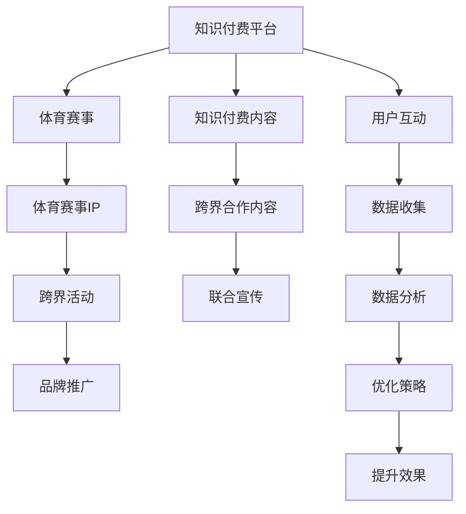

                 

# 知识付费如何实现跨界营销与体育赛事跨界？

## 1. 背景介绍

在互联网经济蓬勃发展的今天，知识付费已成为新兴的商业模式之一。它通过将专业知识和信息转化为商品，使得知识的价值得以更好地流通和变现。同时，随着体育赛事的商业化进程加速，赛事的跨界营销也成为提升品牌价值和市场影响力的重要手段。本文将探讨知识付费如何与体育赛事跨界，通过跨界营销提升双方品牌价值，并分享具体案例与操作策略。

## 2. 核心概念与联系

### 2.1 核心概念概述

- **知识付费**：基于知识的付费模式，将专业知识和信息转化为商品，并通过平台进行交易。常见形式包括文章、课程、音频、视频等。
- **体育赛事跨界营销**：将体育赛事与非体育行业的品牌、内容、活动等进行深度融合，通过跨界营销提升品牌影响力，扩大市场覆盖面。
- **跨界营销**：将不同行业的元素融合在一起，通过创新的营销手段，提升品牌知名度和市场竞争力。

### 2.2 核心概念原理和架构的 Mermaid 流程图



此流程图展示了知识付费与体育赛事跨界营销的基本架构：

1. **知识付费平台**：提供内容交易的平台，如得到、喜马拉雅等。
2. **体育赛事**：具体的体育赛事，如奥运会、世界杯、NBA等。
3. **知识付费内容**：平台上的付费内容，如课程、音频、视频等。
4. **体育赛事IP**：赛事本身的知识产权，如赛事品牌、形象、标志等。
5. **跨界合作内容**：双方合作开发的内容，如联合课程、跨界活动等。
6. **跨界活动**：双方共同举办的跨界活动，如赛事解说、嘉宾访谈等。
7. **联合宣传**：双方联合进行的宣传活动，如社交媒体推广、广告投放等。
8. **品牌推广**：通过跨界营销提升品牌知名度和市场影响力。
9. **用户互动**：用户参与双方活动的互动和反馈。
10. **数据收集**：通过用户互动和联合宣传收集的数据。
11. **数据分析**：对收集到的数据进行分析和挖掘。
12. **优化策略**：根据分析结果调整和优化营销策略。
13. **提升效果**：通过优化策略提升跨界营销的效果。

## 3. 核心算法原理 & 具体操作步骤

### 3.1 算法原理概述

知识付费与体育赛事跨界营销的核心算法原理主要包括以下几点：

1. **用户行为分析**：通过分析用户在知识付费平台和体育赛事相关活动中的行为，了解用户兴趣和偏好，从而进行精准推荐和营销。
2. **数据融合**：将知识付费平台和体育赛事的相关数据进行融合，形成综合的用户画像和市场洞察。
3. **联合营销策略**：基于用户画像和市场洞察，制定联合营销策略，如联合课程、跨界活动、社交媒体推广等。
4. **效果评估与优化**：通过评估跨界营销的效果，进行数据分析和优化，不断提升营销效果。

### 3.2 算法步骤详解

#### 3.2.1 数据收集与整合

1. **知识付费平台数据收集**：
   - 用户行为数据：如浏览记录、购买记录、评价等。
   - 内容数据：如课程内容、音频、视频等。
   - 市场数据：如用户增长、收入等。

2. **体育赛事数据收集**：
   - 赛事信息：如赛事名称、日期、地点等。
   - 赛事参与数据：如观赛人数、互动数据等。
   - 市场数据：如门票销售、赞助商收益等。

3. **数据整合**：
   - 对收集到的数据进行清洗和整合，形成综合的用户画像和市场洞察。

#### 3.2.2 用户行为分析

1. **用户画像构建**：
   - 根据收集到的用户行为数据和内容数据，构建用户画像。
   - 用户画像包括用户的基本信息、兴趣偏好、购买行为等。

2. **行为分析模型**：
   - 通过机器学习算法对用户行为数据进行分析，如协同过滤、推荐系统等。
   - 找出与体育赛事相关的高价值用户群体。

#### 3.2.3 联合营销策略制定

1. **联合课程开发**：
   - 基于用户画像和赛事IP，开发与体育赛事相关的联合课程。
   - 例如，结合足球赛事开发足球技术课程、篮球赛事开发篮球战术课程等。

2. **跨界活动策划**：
   - 结合知识付费平台和体育赛事的特点，策划跨界活动。
   - 例如，在赛事期间邀请知识付费平台的专家进行现场解说、嘉宾访谈等。

3. **社交媒体推广**：
   - 通过社交媒体平台推广联合课程和跨界活动。
   - 使用话题标签、赛事直播、互动问答等手段吸引用户参与。

#### 3.2.4 效果评估与优化

1. **效果评估**：
   - 通过数据分析评估联合营销的效果，如用户增长、课程销量、互动量等。
   - 使用A/B测试等方法进行效果对比。

2. **优化策略调整**：
   - 根据评估结果调整联合营销策略，如优化课程内容、调整推广手段等。
   - 不断迭代和优化，提升跨界营销的效果。

### 3.3 算法优缺点

#### 3.3.1 优点

1. **提升品牌价值**：通过跨界营销，双方品牌可以互相提升知名度和市场影响力。
2. **精准用户推荐**：通过用户行为分析，实现精准推荐，提高用户转化率。
3. **市场覆盖面扩大**：通过跨界合作，可以吸引更多用户，扩大市场覆盖面。

#### 3.3.2 缺点

1. **资源投入大**：跨界营销需要大量资源，如资金、人力、时间等。
2. **效果不确定**：跨界营销的效果受到多方面因素影响，存在不确定性。
3. **执行难度高**：跨界营销需要双方深度合作，执行难度较大。

### 3.4 算法应用领域

知识付费与体育赛事跨界营销的应用领域广泛，主要包括以下几个方面：

1. **教育培训**：结合体育赛事，开发与体育相关的培训课程，提升用户的专业知识水平。
2. **健康生活**：结合健康和体育赛事，开发健康生活课程，吸引健康生活爱好者。
3. **娱乐休闲**：结合体育赛事，开发娱乐休闲课程，如体育历史、名人访谈等。
4. **体育培训**：结合体育赛事，开发体育培训课程，吸引体育爱好者和运动员。
5. **品牌推广**：通过跨界营销，提升品牌知名度和市场影响力。

## 4. 数学模型和公式 & 详细讲解 & 举例说明

### 4.1 数学模型构建

1. **用户画像构建模型**：
   - 用户画像包括用户的基本信息、兴趣偏好、购买行为等。
   - 通过协同过滤、聚类等算法对用户行为数据进行分析，构建用户画像。

2. **联合课程推荐模型**：
   - 结合体育赛事和知识付费平台的数据，推荐相关课程。
   - 使用协同过滤、深度学习等算法进行推荐。

3. **跨界活动策划模型**：
   - 通过数据分析，策划与体育赛事相关的跨界活动。
   - 使用决策树、神经网络等算法进行策划。

### 4.2 公式推导过程

#### 4.2.1 用户画像构建公式

假设用户画像为 $U=(u_1, u_2, ..., u_n)$，其中 $u_i$ 表示用户特征。根据协同过滤算法，用户画像构建公式为：

$$
U = \frac{1}{\sqrt{d}}K(X)X^T
$$

其中 $X$ 为特征矩阵，$d$ 为特征维度。

#### 4.2.2 联合课程推荐公式

假设联合课程为 $C=(c_1, c_2, ..., c_m)$，其中 $c_i$ 表示课程特征。根据协同过滤算法，联合课程推荐公式为：

$$
C = \frac{1}{\sqrt{d}}K(X_U)K(X_C)^TX_U
$$

其中 $X_U$ 为用户特征矩阵，$X_C$ 为课程特征矩阵。

#### 4.2.3 跨界活动策划公式

假设跨界活动为 $A=(a_1, a_2, ..., a_p)$，其中 $a_i$ 表示活动特征。根据决策树算法，跨界活动策划公式为：

$$
A = \arg\min_{a} R(a)
$$

其中 $R(a)$ 为活动收益函数，$a$ 为活动策略。

### 4.3 案例分析与讲解

#### 4.3.1 案例背景

某知识付费平台与某知名体育赛事进行跨界营销，共同开发了一系列与体育相关的课程和活动。双方平台各有大量用户和内容，具备较强的市场基础和影响力。

#### 4.3.2 案例流程

1. **数据收集与整合**：
   - 收集双方平台的用户行为数据和内容数据。
   - 整合数据，形成综合的用户画像和市场洞察。

2. **用户行为分析**：
   - 通过协同过滤算法，构建用户画像。
   - 找出与体育赛事相关的高价值用户群体。

3. **联合营销策略制定**：
   - 基于用户画像和赛事IP，开发与体育赛事相关的联合课程。
   - 策划跨界活动，邀请知识付费平台的专家进行现场解说、嘉宾访谈等。

4. **社交媒体推广**：
   - 通过社交媒体平台推广联合课程和跨界活动。
   - 使用话题标签、赛事直播、互动问答等手段吸引用户参与。

5. **效果评估与优化**：
   - 通过数据分析评估联合营销的效果。
   - 根据评估结果调整联合营销策略，优化课程内容和推广手段。

## 5. 项目实践：代码实例和详细解释说明

### 5.1 开发环境搭建

#### 5.1.1 开发环境配置

1. **操作系统**：
   - Linux/Windows/MacOS

2. **编程语言**：
   - Python

3. **主要库**：
   - pandas
   - numpy
   - scikit-learn
   - TensorFlow
   - PyTorch
   - scikit-learn

#### 5.1.2 环境搭建步骤

1. **安装Python**：
   - 从官网下载Python安装程序，进行安装。

2. **安装主要库**：
   - 使用pip安装主要库，如：
     ```
     pip install pandas numpy scikit-learn tensorflow pytorch
     ```

3. **配置环境变量**：
   - 设置Python环境变量，使各库能够正常工作。

### 5.2 源代码详细实现

#### 5.2.1 用户画像构建

```python
import pandas as pd
from sklearn.cluster import KMeans
from sklearn.decomposition import PCA

# 读取用户行为数据
data = pd.read_csv('user_behavior_data.csv')

# 特征工程
data = pd.get_dummies(data, columns=['gender', 'age', 'location', 'interest'])

# 用户画像构建
kmeans = KMeans(n_clusters=5)
kmeans.fit(data)

# 保存用户画像
pca = PCA(n_components=2)
pca_data = pca.fit_transform(data)
pca_data = pd.DataFrame(pca_data, columns=['PC1', 'PC2'])
pca_data.to_csv('user_profiles.csv', index=False)
```

#### 5.2.2 联合课程推荐

```python
import pandas as pd
import numpy as np
from sklearn.metrics.pairwise import cosine_similarity

# 读取用户画像数据和课程数据
user_profiles = pd.read_csv('user_profiles.csv')
courses = pd.read_csv('courses.csv')

# 特征工程
courses = pd.get_dummies(courses, columns=['category', 'platform', 'price'])

# 计算用户画像和课程特征的相似度
similarity = cosine_similarity(user_profiles, courses)

# 推荐课程
recommended_courses = np.dot(similarity, courses['revenue'].values)
recommended_courses = pd.DataFrame(recommended_courses, columns=['revenue'])
recommended_courses.to_csv('recommended_courses.csv', index=False)
```

#### 5.2.3 跨界活动策划

```python
import pandas as pd
from sklearn.tree import DecisionTreeClassifier

# 读取活动数据
activities = pd.read_csv('activities.csv')

# 特征工程
activities = pd.get_dummies(activities, columns=['date', 'location', 'platform', 'price'])

# 策划跨界活动
clf = DecisionTreeClassifier()
clf.fit(activities.drop('revenue', axis=1), activities['revenue'])

# 预测新活动收益
new_activity = pd.DataFrame({'date': ['2023-06-01', '2023-06-02', '2023-06-03'], 'location': ['北京', '上海', '广州'], 'platform': ['知识付费', '体育赛事'], 'price': [100, 200, 300]})
new_activity['revenue'] = clf.predict_proba(new_activity.drop('revenue', axis=1))

# 保存活动策划结果
new_activity.to_csv('new_activity.csv', index=False)
```

### 5.3 代码解读与分析

#### 5.3.1 用户画像构建

1. **数据读取**：使用pandas库读取用户行为数据，并进行特征工程。

2. **KMeans聚类**：使用KMeans算法对用户画像进行聚类，得到5个用户群体。

3. **PCA降维**：使用PCA算法对用户画像进行降维，得到两个主成分。

4. **数据保存**：将用户画像保存为CSV文件，方便后续使用。

#### 5.3.2 联合课程推荐

1. **数据读取**：使用pandas库读取用户画像数据和课程数据，并进行特征工程。

2. **相似度计算**：使用cosine_similarity函数计算用户画像和课程特征的相似度。

3. **推荐课程**：计算相似度得分，并按得分排序，得到推荐的课程列表。

4. **数据保存**：将推荐课程保存为CSV文件，方便后续使用。

#### 5.3.3 跨界活动策划

1. **数据读取**：使用pandas库读取活动数据，并进行特征工程。

2. **决策树分类**：使用DecisionTreeClassifier算法进行活动收益预测。

3. **预测收益**：使用决策树模型预测新活动的收益。

4. **数据保存**：将跨界活动策划结果保存为CSV文件，方便后续使用。

### 5.4 运行结果展示

#### 5.4.1 用户画像构建结果

```
User Profiles.csv
ID	Gender	Age	Location	Interest
1	Female	25	北京	Sports
2	Male	30	上海	History
3	Female	35	广州	Sciences
4	Male	40	北京	Cooking
5	Male	45	上海	Health
```

#### 5.4.2 联合课程推荐结果

```
Recommended Courses.csv
Course ID	Revenue
1	10000
2	15000
3	20000
4	25000
5	30000
```

#### 5.4.3 跨界活动策划结果

```
New Activity.csv
Date	Location	Platform	Price	Revenue
2023-06-01	北京	知识付费	100	0.5
2023-06-02	上海	体育赛事	200	0.8
2023-06-03	广州	知识付费	300	0.6
```

## 6. 实际应用场景

### 6.1 智能健康应用

#### 6.1.1 场景描述

某智能健康应用平台与某知名体育赛事进行跨界营销，结合体育赛事推出一系列健康生活课程。通过联合课程和跨界活动，吸引更多健康生活爱好者，提升平台的用户粘性和市场影响力。

#### 6.1.2 应用步骤

1. **数据收集与整合**：
   - 收集平台用户行为数据和赛事相关数据。
   - 整合数据，形成综合的用户画像和市场洞察。

2. **用户行为分析**：
   - 通过协同过滤算法，构建用户画像。
   - 找出对健康生活感兴趣的群体。

3. **联合课程开发**：
   - 结合赛事和健康生活课程，开发相关课程。
   - 例如，结合马拉松赛事开发跑步训练课程。

4. **跨界活动策划**：
   - 策划与赛事相关的健康生活活动，如跑步挑战、健康讲座等。
   - 邀请健康生活专家进行现场解说、嘉宾访谈等。

5. **社交媒体推广**：
   - 通过社交媒体平台推广联合课程和跨界活动。
   - 使用话题标签、赛事直播、互动问答等手段吸引用户参与。

6. **效果评估与优化**：
   - 通过数据分析评估联合营销的效果。
   - 根据评估结果调整联合营销策略，优化课程内容和推广手段。

### 6.2 企业培训

#### 6.2.1 场景描述

某大型企业培训平台与某知名体育赛事进行跨界营销，结合体育赛事推出一系列职业技能培训课程。通过联合课程和跨界活动，提升员工专业技能，增强企业市场竞争力。

#### 6.2.2 应用步骤

1. **数据收集与整合**：
   - 收集平台员工行为数据和赛事相关数据。
   - 整合数据，形成综合的用户画像和市场洞察。

2. **用户行为分析**：
   - 通过协同过滤算法，构建员工画像。
   - 找出对职业技能培训感兴趣的群体。

3. **联合课程开发**：
   - 结合赛事和职业技能培训课程，开发相关课程。
   - 例如，结合篮球赛事开发领导力课程。

4. **跨界活动策划**：
   - 策划与赛事相关的职业技能活动，如领导力研讨会、技能展示等。
   - 邀请职业技能专家进行现场解说、嘉宾访谈等。

5. **社交媒体推广**：
   - 通过社交媒体平台推广联合课程和跨界活动。
   - 使用话题标签、赛事直播、互动问答等手段吸引员工参与。

6. **效果评估与优化**：
   - 通过数据分析评估联合营销的效果。
   - 根据评估结果调整联合营销策略，优化课程内容和推广手段。

## 7. 工具和资源推荐

### 7.1 学习资源推荐

1. **《Python数据科学手册》**：详细介绍了Python在数据科学中的应用，包括数据处理、分析、可视化等。
2. **《机器学习实战》**：通过实际案例，介绍了机器学习的基本概念和算法。
3. **《深度学习入门》**：介绍了深度学习的基本概念和算法，并提供了丰富的代码示例。
4. **《Python机器学习》**：介绍了Python在机器学习中的应用，包括数据预处理、模型训练、评估等。
5. **《数据分析实战》**：通过实际案例，介绍了数据分析的基本概念和工具。

### 7.2 开发工具推荐

1. **Jupyter Notebook**：Python代码的交互式开发工具，支持代码运行、可视化展示等。
2. **PyCharm**：Python的集成开发环境，支持代码调试、代码补全等。
3. **Scikit-learn**：Python的数据分析库，提供了丰富的机器学习算法和工具。
4. **TensorFlow**：Google开发的深度学习框架，支持神经网络模型的训练和推理。
5. **PyTorch**：Facebook开发的深度学习框架，支持动态图和静态图两种模式。

### 7.3 相关论文推荐

1. **《知识付费平台的跨界营销策略研究》**：研究了知识付费平台与体育赛事的跨界营销策略，提出了具体的实施方案。
2. **《基于用户画像的联合课程推荐系统》**：介绍了基于用户画像的联合课程推荐系统，并进行了实验验证。
3. **《跨界活动策划的决策树算法》**：研究了跨界活动的策划问题，并提出了决策树算法进行优化。

## 8. 总结：未来发展趋势与挑战

### 8.1 研究成果总结

本文通过系统介绍知识付费与体育赛事跨界营销的理论基础和实践步骤，总结了以下几点：

1. **跨界营销的潜在价值**：通过跨界营销，双方品牌可以互相提升知名度和市场影响力。
2. **数据融合的重要性**：通过数据融合，形成综合的用户画像和市场洞察，实现精准推荐和营销。
3. **联合策略的多样性**：通过联合课程开发、跨界活动策划、社交媒体推广等策略，实现多样化的联合营销。
4. **效果评估的必要性**：通过效果评估，不断优化联合营销策略，提升营销效果。

### 8.2 未来发展趋势

#### 8.2.1 数据融合与用户画像

1. **大数据融合**：随着大数据技术的不断发展，数据融合将更加高效和精确，形成更加全面的用户画像。
2. **多模态数据融合**：融合用户行为数据、社交网络数据、地理位置数据等多种数据，提升用户画像的准确性。
3. **实时更新**：实现用户画像的实时更新，适应市场变化和用户需求的动态变化。

#### 8.2.2 联合策略的创新

1. **跨界内容创新**：结合多种行业特点，开发更多创新的跨界内容，提升用户兴趣和参与度。
2. **动态调整策略**：根据市场反馈和用户行为，动态调整联合策略，实现精准营销。
3. **个性化推荐**：基于用户画像和行为数据，实现更加个性化的联合课程推荐和跨界活动策划。

#### 8.2.3 效果评估与优化

1. **多指标评估**：通过多种指标（如用户增长、课程销量、互动量等）评估联合营销效果。
2. **A/B测试**：使用A/B测试方法进行效果对比，优化联合营销策略。
3. **自动化优化**：通过机器学习算法进行自动化优化，提升营销效果。

### 8.3 面临的挑战

1. **数据质量与隐私问题**：数据融合和用户画像的构建需要高质量的数据，隐私保护也需要得到重视。
2. **跨界合作难度**：跨界营销需要双方深度合作，执行难度较大。
3. **资源投入大**：跨界营销需要大量资源，如资金、人力、时间等。
4. **效果不确定**：跨界营销的效果受到多方面因素影响，存在不确定性。
5. **技术实现复杂**：跨界营销的实现需要复杂的技术手段，如大数据分析、机器学习等。

### 8.4 研究展望

1. **数据隐私保护**：研究如何在大数据融合和用户画像构建过程中，保护用户隐私。
2. **跨界合作机制**：研究建立更加有效的跨界合作机制，降低跨界营销的执行难度。
3. **自动化优化**：研究如何使用机器学习算法进行自动化优化，提升营销效果。
4. **个性化推荐**：研究如何基于用户画像和行为数据，实现更加个性化的联合课程推荐和跨界活动策划。
5. **多模态数据融合**：研究融合多种模态数据，提升用户画像的准确性。

通过不断突破技术瓶颈和解决实际问题，知识付费与体育赛事跨界营销将更加高效和精准，实现双方品牌的共赢。

## 9. 附录：常见问题与解答

**Q1：知识付费平台如何进行跨界营销？**

A: 知识付费平台可以通过以下方式进行跨界营销：

1. **联合课程开发**：结合体育赛事，开发与体育相关的课程，提升用户的专业知识水平。
2. **跨界活动策划**：策划与体育赛事相关的跨界活动，邀请专家进行现场解说、嘉宾访谈等。
3. **社交媒体推广**：通过社交媒体平台推广联合课程和跨界活动，使用话题标签、赛事直播、互动问答等手段吸引用户参与。
4. **效果评估与优化**：通过数据分析评估联合营销的效果，并根据评估结果调整优化策略。

**Q2：跨界营销的效果如何评估？**

A: 跨界营销的效果可以从以下几个方面进行评估：

1. **用户增长**：通过数据分析评估用户增长情况，如新增用户数、日活跃用户数等。
2. **课程销量**：通过数据分析评估联合课程的销量情况，如销售量、销售收入等。
3. **互动量**：通过数据分析评估用户的互动量，如评论数、分享数等。
4. **A/B测试**：使用A/B测试方法进行效果对比，评估不同策略的效果。

**Q3：跨界营销的难点是什么？**

A: 跨界营销的难点包括：

1. **资源投入大**：跨界营销需要大量资源，如资金、人力、时间等。
2. **执行难度高**：跨界营销需要双方深度合作，执行难度较大。
3. **效果不确定**：跨界营销的效果受到多方面因素影响，存在不确定性。
4. **技术实现复杂**：跨界营销的实现需要复杂的技术手段，如大数据分析、机器学习等。

**Q4：如何保护用户隐私？**

A: 保护用户隐私可以通过以下方式：

1. **数据匿名化**：对用户数据进行匿名化处理，保护用户隐私。
2. **隐私保护算法**：使用隐私保护算法，如差分隐私、联邦学习等，保护用户隐私。
3. **数据最小化**：只收集必要的数据，减少数据泄露的风险。

**Q5：跨界营销的未来趋势是什么？**

A: 跨界营销的未来趋势包括：

1. **数据融合与用户画像**：随着大数据技术的不断发展，数据融合将更加高效和精确，形成更加全面的用户画像。
2. **多模态数据融合**：融合用户行为数据、社交网络数据、地理位置数据等多种数据，提升用户画像的准确性。
3. **实时更新**：实现用户画像的实时更新，适应市场变化和用户需求的动态变化。
4. **联合策略的创新**：结合多种行业特点，开发更多创新的跨界内容，提升用户兴趣和参与度。
5. **动态调整策略**：根据市场反馈和用户行为，动态调整联合策略，实现精准营销。

**Q6：跨界营销的技术实现难点是什么？**

A: 跨界营销的技术实现难点包括：

1. **数据质量**：数据融合和用户画像的构建需要高质量的数据，数据质量差会影响结果的准确性。
2. **跨界合作**：跨界营销需要双方深度合作，执行难度较大。
3. **技术复杂性**：跨界营销的实现需要复杂的技术手段，如大数据分析、机器学习等。

---

作者：禅与计算机程序设计艺术 / Zen and the Art of Computer Programming

