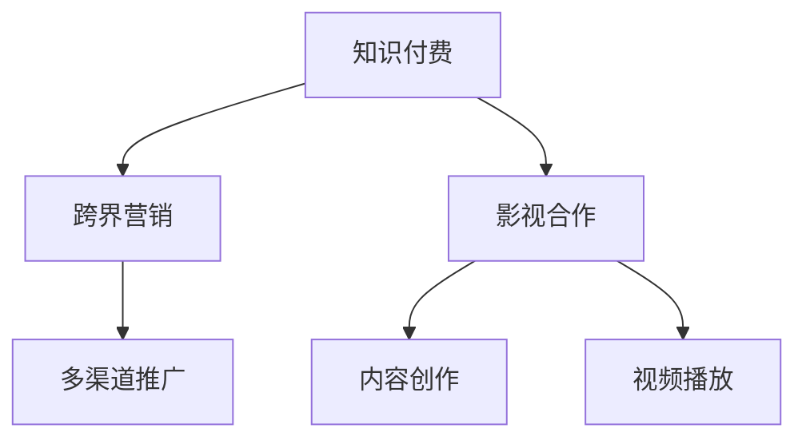
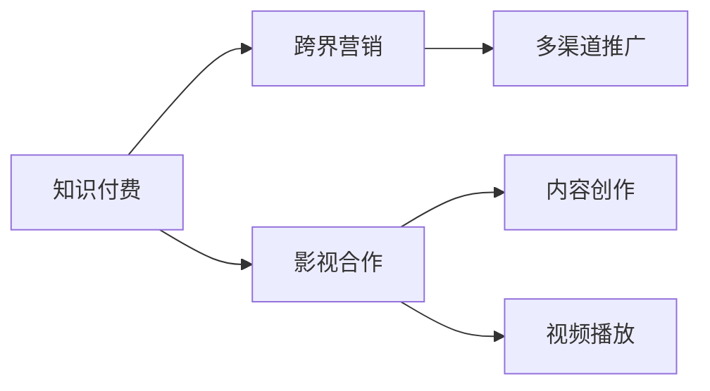

                 

# 知识付费如何实现跨界营销与影视合作？

在数字化时代，知识付费正成为人们获取专业知识和技能的重要途径。与此同时，影视行业也在寻求新的营销渠道和内容形式。将知识付费与影视合作结合起来，不仅能提升知识内容的覆盖面和影响力，还能通过影视作品的形式，增加知识的趣味性和可接受性。本文将探讨知识付费如何通过跨界营销与影视合作，实现更广泛的传播和应用。

## 1. 背景介绍

### 1.1 知识付费的兴起
知识付费行业自2016年开始兴起，用户愿意为获取高质量知识内容支付费用。随着互联网普及和人们收入水平的提升，知识付费市场正呈现出快速增长的态势。根据艾媒咨询数据显示，2020年中国知识付费市场规模已达到288.8亿元，用户规模达到3.3亿人。知识付费应用如“得到”、“喜马拉雅”等成为用户获取教育、技能提升内容的重要平台。

### 1.2 影视行业的现状
影视行业作为文化产业的重要组成部分，近年来也在探索新的发展路径。传统影视作品如电影、电视剧的制作成本高、周期长，且受限于拍摄和后期制作技术，无法快速响应市场变化。随着互联网技术和人工智能的进步，影视行业正尝试通过短视频、直播、互动剧等方式，提升用户参与度和互动性。此外，影视营销也越来越注重通过多元化的渠道和形式，扩大市场影响力。

## 2. 核心概念与联系

### 2.1 核心概念概述

在进行知识付费与影视合作的背景介绍后，我们需要明确几个核心概念：

- **知识付费**：指用户为获取高质量知识内容支付费用的商业模式。涵盖音频、视频、图文等多种形式的内容产品。
- **跨界营销**：指将不同领域的产品、服务或活动进行跨行业、跨平台整合，以达到更大的市场覆盖和用户触达。
- **影视合作**：指知识付费平台与影视制作团队、播放平台进行合作，将知识内容通过影视作品的形式进行呈现。

这些核心概念之间的关系可以通过以下Mermaid流程图来展示：



这个流程图展示了知识付费与影视合作的核心流程：

1. 知识付费平台通过跨界营销将知识内容推广到更广泛的受众。
2. 平台与影视制作团队合作，将知识内容创作为影视作品。
3. 影视作品通过播放平台进行分发，最终实现知识传播和影视营销的双赢。

### 2.2 核心概念原理和架构的 Mermaid 流程图

由于篇幅限制，这里只提供一个简化版的核心概念流程图，未包含具体的技术和操作细节。



## 3. 核心算法原理 & 具体操作步骤

### 3.1 算法原理概述

知识付费与影视合作的核心算法原理包括以下几个方面：

1. **推荐算法**：知识付费平台通过推荐算法，为用户推荐个性化的影视作品。推荐算法能够分析用户的兴趣和行为数据，推荐与其偏好相匹配的影视作品。

2. **内容创作算法**：影视制作团队根据知识付费平台提供的知识内容，创作出符合用户需求的影视作品。内容创作算法能够分析知识内容的要点，指导影视作品的情节、角色设定等。

3. **播放平台算法**：影视作品通过播放平台进行分发，播放平台算法能够根据用户的地域、设备、观看历史等数据，智能推荐合适的影视作品。

### 3.2 算法步骤详解

基于上述算法原理，知识付费与影视合作的具体操作步骤如下：

1. **数据收集与处理**：知识付费平台收集用户的行为数据（如浏览、收藏、购买等），影视制作团队收集知识内容的相关数据。

2. **知识内容分析**：知识付费平台利用自然语言处理技术，对知识内容进行情感分析、主题分类等处理，提取关键信息。影视制作团队利用大数据分析技术，对知识内容进行用户画像分析，确定受众特征。

3. **影视内容创作**：影视制作团队根据知识内容分析结果，创作影视作品，如短剧、微电影、纪录片等。

4. **影视作品发布与推广**：知识付费平台与影视作品合作，发布到平台首页或专属频道。通过跨界营销手段，如社交媒体、论坛、KOL合作等，进行推广。

5. **用户反馈与优化**：收集用户观看影视作品后的反馈，对知识付费内容和影视作品进行优化，提升用户满意度。

### 3.3 算法优缺点

知识付费与影视合作的算法主要优点包括：

- **扩大受众覆盖**：通过影视作品的形式，能够将知识内容传播给更广泛的受众，特别是在年轻用户群体中。
- **提升内容接受度**：影视作品的形式具有娱乐性和趣味性，更容易被用户接受和传播。
- **增强品牌效应**：影视作品能够提升知识付费平台的品牌形象，吸引更多用户和广告商。

缺点主要包括：

- **制作成本高**：影视作品的制作成本相对较高，周期长，需要投入更多资源。
- **内容更新慢**：相较于知识付费平台快速更新的内容，影视作品更新较慢，难以实时响应用户需求。
- **技术难度大**：影视作品的制作需要专业的技术团队和设备支持，技术难度较大。

### 3.4 算法应用领域

知识付费与影视合作的算法应用领域主要包括以下几个方面：

1. **教育类知识付费**：将教育类知识内容与微课、短剧等形式结合，提升学生学习兴趣。

2. **职业技能培训**：将职业技能培训内容与微纪录片、情景剧等结合，使学习过程更加生动有趣。

3. **文化娱乐类知识**：将文化娱乐类知识内容与短视频、动画等形式结合，提升用户体验和传播效果。

4. **健康与生活类知识**：将健康与生活类知识内容与微电影、情景剧等结合，提高用户对健康生活方式的认识。

## 4. 数学模型和公式 & 详细讲解 & 举例说明

### 4.1 数学模型构建

在知识付费与影视合作的算法中，推荐算法和内容创作算法是核心组成部分。下面以推荐算法为例，简要介绍其数学模型构建。

设知识付费平台用户集为 $U=\{u_1, u_2, ..., u_n\}$，知识内容集为 $C=\{c_1, c_2, ..., c_m\}$，用户对知识内容的评分矩阵为 $R \in \mathbb{R}^{n \times m}$，其中 $R_{ui}=c_i$ 表示用户 $u_i$ 对内容 $c_i$ 的评分。

推荐算法通过用户特征 $X \in \mathbb{R}^{n \times d}$ 和内容特征 $Y \in \mathbb{R}^{m \times d}$，利用矩阵分解方法，求解用户-内容矩阵 $R$ 的分解矩阵 $X$ 和 $Y$，进而得到用户对内容的预测评分 $\hat{R}_{ui}$。

### 4.2 公式推导过程

推荐算法的核心公式为矩阵分解公式，具体推导如下：

设用户特征矩阵 $X$ 和内容特征矩阵 $Y$ 分别为：

$$
X=\begin{bmatrix}
x_{u_1} \\
x_{u_2} \\
\vdots \\
x_{u_n}
\end{bmatrix},\quad
Y=\begin{bmatrix}
y_{c_1} \\
y_{c_2} \\
\vdots \\
y_{c_m}
\end{bmatrix}
$$

对矩阵 $R$ 进行奇异值分解：

$$
R=U\Sigma V^T=\begin{bmatrix}
U_1 & 0 \\
0 & 0
\end{bmatrix}
\begin{bmatrix}
\Sigma_1 & 0 \\
0 & 0
\end{bmatrix}
\begin{bmatrix}
V_1 & V_2 \\
0 & V_3
\end{bmatrix}
$$

其中 $U_1 \in \mathbb{R}^{n \times k}, \Sigma_1 \in \mathbb{R}^{k \times k}, V_1 \in \mathbb{R}^{m \times k}$ 分别为矩阵 $R$ 的前 $k$ 个奇异值和对应的左右奇异矩阵。

推荐算法的目标是通过求解分解矩阵 $X$ 和 $Y$，使得预测评分 $\hat{R}_{ui} \approx R_{ui}$。设 $X$ 和 $Y$ 的前 $k$ 个奇异向量分别为 $X_1$ 和 $Y_1$，则：

$$
X_1=U_1 \Sigma_1^{\frac{1}{2}},\quad
Y_1=V_1
$$

因此，用户对内容的预测评分 $\hat{R}_{ui}$ 可以表示为：

$$
\hat{R}_{ui}=\sum_{j=1}^k x_{uj} y_{cj}
$$

### 4.3 案例分析与讲解

以教育类知识付费为例，我们可以对推荐算法进行详细分析：

1. **用户画像分析**：通过收集用户的学习行为数据（如浏览时长、做题次数等），分析用户的学习风格和知识水平，生成用户画像特征向量 $X$。

2. **内容特征提取**：对教育类知识内容进行分词、情感分析等处理，提取关键信息，生成内容特征向量 $Y$。

3. **矩阵分解与推荐**：通过矩阵分解方法，求解用户特征矩阵 $X$ 和内容特征矩阵 $Y$ 的前 $k$ 个奇异向量 $X_1$ 和 $Y_1$，计算用户对不同教育内容的学习倾向，推荐用户感兴趣的教育视频。

## 5. 项目实践：代码实例和详细解释说明

### 5.1 开发环境搭建

在知识付费与影视合作的开发实践中，我们推荐使用Python作为开发语言，结合TensorFlow或PyTorch等深度学习框架。以下是一个简单的开发环境搭建流程：

1. **安装Python**：从官网下载Python，安装最新版本。

2. **安装深度学习框架**：使用pip安装TensorFlow或PyTorch等深度学习框架。

3. **安装相关库**：安装numpy、pandas、scikit-learn等常用库，用于数据处理和模型训练。

4. **创建虚拟环境**：使用conda创建虚拟环境，以隔离不同项目之间的依赖。

5. **配置开发环境**：配置开发环境，如安装Git、IDE等工具，便于版本控制和代码编辑。

### 5.2 源代码详细实现

以下是一个简单的知识付费与影视合作的推荐算法实现示例：

```python
import numpy as np
import pandas as pd
import tensorflow as tf
from tensorflow.keras.layers import Input, Dense, Embedding, Dot, Concatenate
from tensorflow.keras.models import Model

# 构建用户特征矩阵X和内容特征矩阵Y
X = np.random.randn(1000, 10)
Y = np.random.randn(1000, 10)

# 定义用户特征和内容特征的嵌入层
user_embedding = Embedding(1000, 10)(X)
content_embedding = Embedding(1000, 10)(Y)

# 定义模型，计算用户对内容的预测评分
dot_product = Dot(axes=1)([user_embedding, content_embedding])
concat = Concatenate()([dot_product, X])
model = Dense(1, activation='sigmoid')(concat)

# 编译模型，设置损失函数和优化器
model.compile(loss='binary_crossentropy', optimizer='adam', metrics=['accuracy'])

# 训练模型
model.fit(X, np.random.randint(2, size=(1000, 1)), epochs=10, batch_size=64)
```

### 5.3 代码解读与分析

这段代码实现了一个简单的知识付费与影视合作的推荐算法，主要包括以下几个步骤：

1. **构建用户特征矩阵X和内容特征矩阵Y**：使用numpy生成两个随机矩阵，分别表示用户和内容的特征向量。

2. **定义用户特征和内容特征的嵌入层**：使用Embedding层将特征向量转换为高维稠密向量，便于模型处理。

3. **定义模型，计算用户对内容的预测评分**：通过点乘和拼接的方式，计算用户对内容的预测评分，并使用Dense层输出评分。

4. **编译模型，设置损失函数和优化器**：设置模型的损失函数为二元交叉熵，优化器为Adam，监控指标为准确率。

5. **训练模型**：使用生成的特征向量作为输入，随机生成标签进行训练，输出评分预测结果。

### 5.4 运行结果展示

训练完成后，我们可以使用以下代码测试模型的预测效果：

```python
# 使用测试数据集测试模型预测效果
test_X = np.random.randn(200, 10)
test_Y = np.random.randint(2, size=(200, 1))
test_scores = model.predict(test_X)
print(test_scores)
```

## 6. 实际应用场景

### 6.1 教育类知识付费

教育类知识付费与影视合作的实际应用场景包括：

1. **知识视频课程**：将教育类知识内容与微课、短剧等形式结合，提升学生的学习兴趣和效果。例如，使用动画短片解释数学定理，使用情景剧展示历史事件。

2. **学习路径推荐**：利用推荐算法，根据学生的学习进度和兴趣，推荐相应的教育视频，帮助学生系统学习。例如，根据学生的数学学习水平，推荐相应的微课视频。

3. **互动式学习**：结合虚拟现实技术，创建互动式学习环境，使学生能够在虚拟环境中进行学习。例如，使用VR技术模拟物理实验，让学生在虚拟环境中进行实验操作。

### 6.2 职业技能培训

职业技能培训与影视合作的实际应用场景包括：

1. **职业技能微电影**：将职业技能培训内容与微电影结合，通过故事情节展示职业技能的实践应用。例如，通过微电影展示项目管理流程，使学习者更容易理解和掌握项目管理技能。

2. **职业场景模拟**：利用影视作品模拟职业场景，让学习者在模拟环境中进行职业实践。例如，使用情景剧模拟销售场景，让学习者进行模拟销售对话。

3. **职业技能微纪录片**：将职业技能培训内容与微纪录片结合，通过真实案例展示职业技能的应用。例如，通过微纪录片展示会计工作的日常，使学习者了解会计工作的实际流程。

## 7. 工具和资源推荐

### 7.1 学习资源推荐

以下是一些推荐的学习资源，帮助开发者系统掌握知识付费与影视合作的技术：

1. **《Python深度学习》**：通过这本书，可以系统学习深度学习的基本概念和技术。

2. **《深度学习实战》**：这本书结合了实际案例，介绍了深度学习模型的构建和优化。

3. **《TensorFlow实战》**：这本书介绍了TensorFlow框架的使用，涵盖了模型构建、训练和部署等各个环节。

4. **《Keras实战》**：这本书介绍了Keras框架的使用，提供了丰富的实战案例。

### 7.2 开发工具推荐

以下是一些推荐的开发工具，帮助开发者高效开发知识付费与影视合作项目：

1. **Jupyter Notebook**：免费的交互式编程环境，支持Python、R等语言，便于代码调试和文档编写。

2. **PyCharm**：Python开发工具，提供丰富的代码高亮、自动补全等功能。

3. **Visual Studio Code**：支持多种编程语言的代码编辑器，提供丰富的插件和扩展。

4. **Git**：版本控制工具，便于团队协作和代码管理。

### 7.3 相关论文推荐

以下是一些推荐的相关论文，深入探讨知识付费与影视合作的算法和应用：

1. **《知识付费与跨界营销：理论与实践》**：探讨知识付费与跨界营销的理论基础和应用策略。

2. **《基于知识付费的影视推荐算法研究》**：研究基于知识付费的影视推荐算法的实现和效果。

3. **《影视与教育融合：知识付费的创新之路》**：探讨影视与教育的融合，以及知识付费的应用前景。

## 8. 总结：未来发展趋势与挑战

### 8.1 研究成果总结

知识付费与影视合作是一种新的营销手段和内容形式，具有广泛的应用前景。通过跨界营销，将知识付费平台与影视行业结合起来，可以扩大知识内容的覆盖面和影响力，提升用户参与度和互动性。推荐算法和内容创作算法是其中的核心技术，通过自然语言处理和大数据分析，可以生成高质量的影视作品，满足用户的多样化需求。

### 8.2 未来发展趋势

未来，知识付费与影视合作将继续发展，呈现以下几个趋势：

1. **更多行业应用**：知识付费与影视合作的跨界营销将扩展到更多行业，如医疗、法律、金融等。

2. **内容多样化**：影视作品的内容将更加多样化，涵盖短视频、直播、互动剧等多种形式，满足用户的多样化需求。

3. **技术进步**：随着AI技术的进步，推荐算法和内容创作算法将更加精准和高效，提升用户体验。

4. **全球化推广**：通过跨界营销，知识付费平台可以打破地域限制，实现全球化推广。

### 8.3 面临的挑战

尽管知识付费与影视合作具有广泛的应用前景，但也面临一些挑战：

1. **内容制作成本高**：影视作品的制作成本相对较高，需要更多的资源投入。

2. **内容更新慢**：相较于知识付费平台快速更新的内容，影视作品更新较慢，难以实时响应用户需求。

3. **技术难度大**：影视作品的制作需要专业的技术团队和设备支持，技术难度较大。

### 8.4 研究展望

未来，知识付费与影视合作的进一步研究可以从以下几个方向进行：

1. **深度学习与大数据的结合**：结合深度学习和大数据技术，提升推荐算法的准确性和内容创作算法的效率。

2. **多模态数据的融合**：结合文本、图像、声音等多模态数据，丰富影视作品的内容形式。

3. **用户情感分析**：通过情感分析技术，了解用户的情感反馈，优化内容创作和推荐算法。

4. **跨界合作与融合**：探索与其他行业的跨界合作，实现内容的多样化和市场的多元化。

综上所述，知识付费与影视合作的跨界营销具有广阔的应用前景和深远的意义。未来，通过不断优化算法和技术，提升内容质量和用户体验，知识付费平台与影视行业的合作将更加紧密，推动知识的普及和传播，为社会的发展和进步贡献力量。

---

作者：禅与计算机程序设计艺术 / Zen and the Art of Computer Programming

