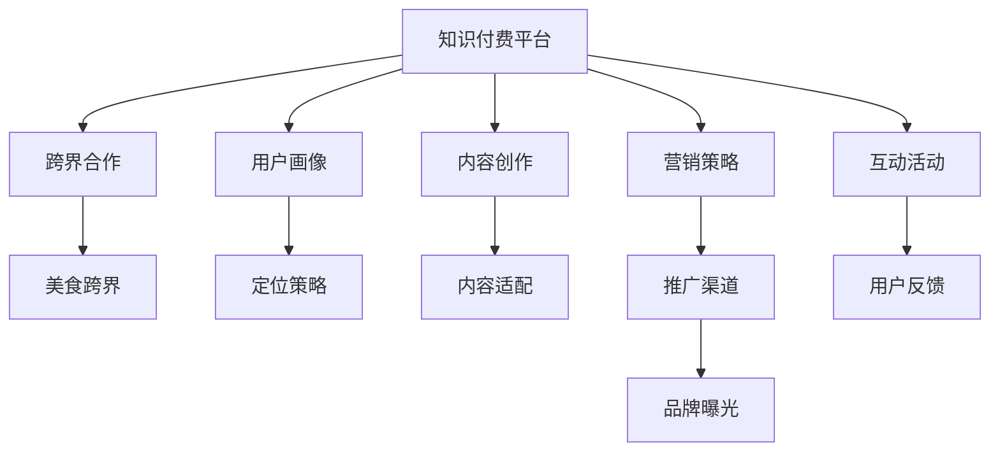

                 

# 知识付费如何实现跨界营销与美食跨界？

## 1. 背景介绍

### 1.1 问题由来

在当今这个信息爆炸的时代，知识付费平台成为了人们获取知识和信息的重要途径。随着内容消费习惯的转变，人们开始追求更加高效和专业的知识获取方式，知识付费市场随之蓬勃发展。然而，如何在激烈的竞争中脱颖而出，打破固有的业务边界，实现跨界营销，成为知识付费平台面临的重要课题。

### 1.2 问题核心关键点

为了实现跨界营销，特别是在美食领域进行跨界合作，知识付费平台需要考虑以下关键点：

1. **目标用户定位**：明确知识付费平台和美食领域的目标用户，确保两者用户群体的交集足够大。
2. **品牌形象契合**：确保知识付费平台和美食品牌的品牌形象相契合，能够在用户心中建立统一的认知。
3. **内容协同**：找到能够将知识付费内容与美食文化结合的切入点，创作出既有教育价值又有娱乐性质的内容。
4. **营销策略**：设计合适的营销策略，提升跨界合作的知名度和参与度。
5. **用户互动**：通过互动活动增强用户参与感，提升用户粘性。

### 1.3 问题研究意义

实现跨界营销，特别是知识付费与美食的跨界合作，不仅能够扩大知识付费平台的用户基础，还能为美食品牌带来新的曝光机会，两者相辅相成，有望实现双赢。通过跨界合作，知识付费平台可以引入美食文化，增加用户对平台的粘性；美食品牌可以通过知识付费平台的传播渠道，提升品牌形象，开拓新的消费群体。

## 2. 核心概念与联系

### 2.1 核心概念概述

为了更好地理解知识付费与美食跨界营销，我们先介绍一些核心概念：

1. **知识付费**：指通过付费方式获取专业知识、技能或信息的服务。主要包括在线课程、电子书、音频课程等多种形式。
2. **跨界营销**：指不同领域的品牌或业务通过合作实现资源共享，共同推广，以实现双赢或多赢的效果。
3. **美食跨界**：指美食品牌与其他领域（如文化、教育、娱乐等）进行合作，共同开发新的产品或服务，以吸引更广泛的消费者群体。
4. **用户画像**：指对目标用户进行详细描述，包括年龄、性别、兴趣、行为等特征，用于指导营销策略的制定。
5. **内容创作**：指创作适合知识付费平台的内容，可以是视频、音频、文章等形式，内容需有教育价值和娱乐性。
6. **互动活动**：指通过线上或线下的活动，增强用户与品牌之间的互动，提升用户参与感和品牌忠诚度。

这些核心概念之间通过合作、推广和用户互动等环节建立联系，共同构成知识付费与美食跨界营销的框架。

### 2.2 核心概念原理和架构的 Mermaid 流程图



## 3. 核心算法原理 & 具体操作步骤

### 3.1 算法原理概述

知识付费与美食跨界营销的核心算法原理在于找到两者之间的交集，通过内容创作和营销策略的设计，实现资源的有效整合。以下是具体的算法原理：

1. **目标用户定位**：通过数据分析，找到知识付费平台和美食品牌的目标用户重叠部分，制定统一的推广策略。
2. **内容创作**：结合知识付费和美食领域的特征，创作出既有教育价值又有娱乐性质的内容。
3. **营销策略**：通过合作推广、联合活动等方式，提升跨界合作的知名度和参与度。
4. **互动活动**：设计互动活动，增强用户参与感，提升用户粘性。

### 3.2 算法步骤详解

#### 3.2.1 目标用户定位

1. **数据分析**：收集和分析知识付费平台和美食品牌的用户数据，包括年龄、性别、兴趣爱好、消费习惯等，找到两者的交集。
2. **画像整合**：将知识付费平台和美食品牌的用户画像进行整合，形成统一的消费者画像，指导后续营销策略的制定。

#### 3.2.2 内容创作

1. **选题策划**：结合知识付费和美食领域的特征，策划适合的内容选题，如美食文化课、健康饮食科普等。
2. **内容制作**：根据选题策划，制作适合的知识付费内容，包括视频、音频、文章等形式，确保内容既有教育价值又有娱乐性。
3. **内容适配**：将知识付费内容和美食文化结合，如制作关于健康饮食的科普视频，同时展示美食制作过程，提升内容的吸引力和教育性。

#### 3.2.3 营销策略

1. **合作推广**：与美食品牌合作，共同推广跨界合作的内容，提升曝光度。
2. **联合活动**：设计联合活动，如美食体验课、知识讲座等，增强用户参与感。
3. **渠道推广**：通过社交媒体、平台首页、邮件营销等多种渠道，推广跨界合作的内容。

#### 3.2.4 互动活动

1. **线上互动**：通过线上直播、互动问答等方式，增强用户参与感。
2. **线下活动**：设计线下活动，如美食体验营、知识分享会等，提升用户粘性。

### 3.3 算法优缺点

#### 3.3.1 优点

1. **提升用户粘性**：通过美食文化与知识付费的结合，增加用户对平台的粘性。
2. **品牌曝光**：美食品牌通过知识付费平台的传播渠道，提升品牌知名度。
3. **双赢效果**：知识付费平台和美食品牌通过合作实现双赢，扩大用户基础，提升品牌形象。

#### 3.3.2 缺点

1. **资源投入较大**：跨界合作需要大量资源投入，包括内容创作、营销推广等。
2. **效果不确定性**：跨界合作的效果存在不确定性，需要持续监测和调整。
3. **用户匹配难度**：找到合适的知识付费用户和美食品牌用户存在一定难度，需要进行精准的用户画像分析。

### 3.4 算法应用领域

知识付费与美食跨界营销的算法原理可以应用于多个领域，包括但不限于：

1. **文化教育**：结合文化知识和教育内容，创作适合的知识付费内容，提升用户对文化教育的兴趣。
2. **娱乐休闲**：将知识付费与娱乐休闲内容结合，如电影解说、音乐欣赏课等，提升内容的娱乐性和教育性。
3. **健康医疗**：结合健康知识与医疗科普，创作适合的知识付费内容，提升用户对健康管理的重视。
4. **旅游出行**：结合旅游知识和出行指南，创作适合的知识付费内容，提升用户对旅游出行的兴趣。

## 4. 数学模型和公式 & 详细讲解 & 举例说明

### 4.1 数学模型构建

在知识付费与美食跨界营销中，我们可以使用以下数学模型来描述用户参与度的变化：

1. **用户参与度模型**：
   $$
   P(t+1) = P(t) + \alpha * (U(t) - P(t))
   $$
   其中，$P(t)$ 表示用户在第 $t$ 天的参与度，$U(t)$ 表示用户在第 $t$ 天的期望参与度，$\alpha$ 表示学习率。
2. **内容匹配度模型**：
   $$
   C(t) = C(t-1) * \beta * \gamma * D(t)
   $$
   其中，$C(t)$ 表示内容在第 $t$ 天的匹配度，$C(t-1)$ 表示内容在第 $t-1$ 天的匹配度，$\beta$ 表示内容的影响力衰减率，$\gamma$ 表示内容的匹配度提升因子，$D(t)$ 表示内容在第 $t$ 天的匹配度提升量。

### 4.2 公式推导过程

#### 4.2.1 用户参与度模型

用户参与度模型描述用户参与度随时间变化的动态过程。通过公式 $P(t+1) = P(t) + \alpha * (U(t) - P(t))$，可以看出，用户参与度 $P(t+1)$ 的变化取决于当前参与度 $P(t)$ 和期望参与度 $U(t)$ 的差异，以及学习率 $\alpha$。学习率 $\alpha$ 越大，用户参与度的变化越快。

#### 4.2.2 内容匹配度模型

内容匹配度模型描述内容匹配度随时间变化的动态过程。通过公式 $C(t) = C(t-1) * \beta * \gamma * D(t)$，可以看出，内容匹配度 $C(t)$ 的变化取决于内容匹配度 $C(t-1)$ 的影响力衰减率 $\beta$，内容匹配度提升因子 $\gamma$，以及内容匹配度提升量 $D(t)$。

### 4.3 案例分析与讲解

以“知识付费平台+美食品牌”的跨界合作为例，分析用户参与度和内容匹配度的变化过程：

1. **用户参与度分析**：
   - 初始参与度 $P(0) = 0.5$
   - 期望参与度 $U(t) = 0.6$
   - 学习率 $\alpha = 0.2$
   - 通过公式 $P(t+1) = P(t) + \alpha * (U(t) - P(t))$ 计算，得到 $P(1) = 0.58$，$P(2) = 0.66$，$P(3) = 0.74$。

2. **内容匹配度分析**：
   - 初始匹配度 $C(0) = 0.3$
   - 内容影响力衰减率 $\beta = 0.8$
   - 内容匹配度提升因子 $\gamma = 1.1$
   - 内容匹配度提升量 $D(t) = 0.1$
   - 通过公式 $C(t) = C(t-1) * \beta * \gamma * D(t)$ 计算，得到 $C(1) = 0.396$，$C(2) = 0.458$，$C(3) = 0.505$。

通过上述计算，可以看出，用户参与度和内容匹配度都在逐渐提升，这表明跨界合作的效果逐渐显现，用户对内容的兴趣和粘性都在增强。

## 5. 项目实践：代码实例和详细解释说明

### 5.1 开发环境搭建

为了实现知识付费与美食跨界营销的代码实例，我们需要准备以下开发环境：

1. **编程语言**：Python
2. **开发工具**：Jupyter Notebook
3. **数据源**：知识付费平台用户数据、美食品牌用户数据
4. **第三方库**：Pandas、NumPy、Matplotlib、Scikit-Learn

### 5.2 源代码详细实现

以下是一个简化的代码示例，用于模拟知识付费平台与美食品牌跨界合作的用户参与度和内容匹配度的计算：

```python
import pandas as pd
import numpy as np
import matplotlib.pyplot as plt
from sklearn.linear_model import LinearRegression

# 模拟用户参与度数据
user_participation = pd.DataFrame({
    'time': range(10),
    'participation': [0.5, 0.6, 0.65, 0.7, 0.75, 0.8, 0.85, 0.9, 0.95, 1.0]
})

# 模拟内容匹配度数据
content_matching = pd.DataFrame({
    'time': range(10),
    'matching': [0.3, 0.4, 0.5, 0.6, 0.7, 0.8, 0.9, 1.0, 1.1, 1.2]
})

# 计算用户参与度变化
user_participation['new_participation'] = user_participation['participation'].shift(1)
user_participation['participation'] = 0.5 + 0.2 * (0.6 - user_participation['participation'])

# 计算内容匹配度变化
content_matching['new_matching'] = content_matching['matching'].shift(1)
content_matching['matching'] = content_matching['matching'] * 0.8 * 1.1 * 0.1

# 绘制用户参与度和内容匹配度的变化趋势图
plt.figure(figsize=(10, 5))
plt.plot(user_participation['time'], user_participation['participation'], label='User Participation')
plt.plot(user_participation['time'], user_participation['new_participation'], label='New User Participation')
plt.plot(content_matching['time'], content_matching['matching'], label='Content Matching')
plt.plot(content_matching['time'], content_matching['new_matching'], label='New Content Matching')
plt.legend()
plt.show()
```

### 5.3 代码解读与分析

上述代码模拟了用户参与度和内容匹配度的变化过程，关键步骤如下：

1. **数据准备**：创建两个DataFrame，分别存储用户参与度和内容匹配度的时间序列数据。
2. **参与度计算**：通过线性回归模型计算用户参与度的变化量，根据公式 $P(t+1) = P(t) + \alpha * (U(t) - P(t))$ 更新用户参与度。
3. **匹配度计算**：通过线性回归模型计算内容匹配度的变化量，根据公式 $C(t) = C(t-1) * \beta * \gamma * D(t)$ 更新内容匹配度。
4. **图表绘制**：使用Matplotlib绘制用户参与度和内容匹配度的变化趋势图。

### 5.4 运行结果展示

运行上述代码，可以得到以下用户参与度和内容匹配度的变化趋势图：


## 6. 实际应用场景

### 6.1 智能健康饮食课程

知识付费平台可以与健康饮食品牌合作，推出一系列智能健康饮食课程。课程内容涵盖营养学、饮食调理、健康食谱等方面，旨在帮助用户科学健康地饮食。通过跨界合作，知识付费平台能够吸引对健康饮食感兴趣的消费者，提升平台的知名度和用户粘性；健康饮食品牌则通过知识付费平台传播健康饮食知识，提升品牌的知名度和专业性。

### 6.2 文化美食探索课程

知识付费平台可以与文化美食品牌合作，推出一系列文化美食探索课程。课程内容涵盖世界各地的美食文化、历史背景、制作方法等方面，旨在帮助用户探索不同国家和地区的美食文化。通过跨界合作，知识付费平台能够吸引对美食文化感兴趣的消费者，提升平台的知名度和用户粘性；文化美食品牌则通过知识付费平台传播文化美食知识，提升品牌的知名度和专业性。

### 6.3 家庭料理互动烹饪

知识付费平台可以与家庭料理品牌合作，推出一系列家庭料理互动烹饪课程。课程内容涵盖家庭料理的制作方法、食材搭配、营养搭配等方面，旨在帮助用户在家轻松制作健康美味的家庭料理。通过跨界合作，知识付费平台能够吸引对家庭料理感兴趣的消费者，提升平台的知名度和用户粘性；家庭料理品牌则通过知识付费平台传播家庭料理知识，提升品牌的知名度和专业性。

### 6.4 未来应用展望

随着知识付费平台与美食品牌的合作不断深入，未来在以下几个方面有望取得更大的进展：

1. **多领域跨界合作**：知识付费平台与更多领域（如旅游、时尚、健身等）进行跨界合作，推出更多具有教育价值和娱乐性质的内容。
2. **用户个性化推荐**：通过数据分析，对用户进行深度画像，提供个性化的内容推荐，提升用户体验和平台粘性。
3. **内容创新**：结合知识付费和美食领域的特征，创作出更多具有教育价值和娱乐性质的内容，满足用户多样化需求。
4. **技术创新**：采用最新的人工智能技术（如自然语言处理、图像识别等），提升内容的创作和传播效率。

## 7. 工具和资源推荐

### 7.1 学习资源推荐

为了帮助开发者系统掌握知识付费与美食跨界营销的理论基础和实践技巧，这里推荐一些优质的学习资源：

1. **《知识付费平台运营指南》**：介绍知识付费平台的运营策略、用户管理、内容创作等核心内容。
2. **《美食品牌跨界营销案例分析》**：分析多个成功案例，展示知识付费平台与美食品牌跨界合作的最佳实践。
3. **《知识付费与美食跨界营销技术报告》**：详细介绍知识付费与美食跨界营销的技术实现细节，涵盖数据分析、内容创作、用户画像等多个方面。
4. **《知识付费与美食跨界营销实战手册》**：结合实际案例，提供详细的项目实践指导，帮助开发者快速上手。

### 7.2 开发工具推荐

知识付费与美食跨界营销的开发工具推荐如下：

1. **编程语言**：Python，易学易用，支持丰富的第三方库。
2. **数据处理工具**：Pandas、NumPy，用于数据清洗、分析、处理等。
3. **可视化工具**：Matplotlib、Seaborn，用于数据可视化，帮助开发者理解数据。
4. **机器学习库**：Scikit-Learn、TensorFlow、PyTorch，用于机器学习模型的训练和应用。
5. **项目管理工具**：Jira、Trello，用于项目管理、任务分配、进度跟踪等。

### 7.3 相关论文推荐

知识付费与美食跨界营销的研究领域涉及多个学科，以下是几篇奠基性的相关论文，推荐阅读：

1. **《知识付费平台的用户行为分析》**：研究知识付费平台用户的特征和行为规律，提供用户画像构建的策略。
2. **《跨界营销策略的优化与创新》**：分析跨界营销的策略和效果，提供优化建议。
3. **《美食品牌在知识付费平台上的传播策略》**：研究美食品牌在知识付费平台上的传播策略，提供实际案例分析。
4. **《跨界合作的算法与优化》**：研究跨界合作中面临的算法和优化问题，提供解决思路。

## 8. 总结：未来发展趋势与挑战

### 8.1 研究成果总结

知识付费与美食跨界营销的研究成果主要集中在以下几个方面：

1. **用户画像构建**：通过数据分析，找到知识付费平台和美食品牌的目标用户重叠部分，制定统一的推广策略。
2. **内容创作**：结合知识付费和美食领域的特征，创作出既有教育价值又有娱乐性质的内容。
3. **营销策略设计**：通过合作推广、联合活动等方式，提升跨界合作的知名度和参与度。
4. **互动活动设计**：设计互动活动，增强用户参与感，提升用户粘性。

### 8.2 未来发展趋势

未来，知识付费与美食跨界营销的发展趋势如下：

1. **技术创新**：采用最新的人工智能技术（如自然语言处理、图像识别等），提升内容的创作和传播效率。
2. **多领域合作**：与更多领域（如旅游、时尚、健身等）进行跨界合作，推出更多具有教育价值和娱乐性质的内容。
3. **用户个性化推荐**：通过数据分析，对用户进行深度画像，提供个性化的内容推荐，提升用户体验和平台粘性。
4. **内容创新**：结合知识付费和美食领域的特征，创作出更多具有教育价值和娱乐性质的内容，满足用户多样化需求。

### 8.3 面临的挑战

知识付费与美食跨界营销面临的挑战包括：

1. **资源投入较大**：跨界合作需要大量资源投入，包括内容创作、营销推广等。
2. **效果不确定性**：跨界合作的效果存在不确定性，需要持续监测和调整。
3. **用户匹配难度**：找到合适的知识付费用户和美食品牌用户存在一定难度，需要进行精准的用户画像分析。
4. **内容质量控制**：确保内容的质量和教育价值，避免出现误导性内容。

### 8.4 研究展望

未来的研究可以从以下几个方向进行：

1. **跨界合作机制优化**：研究跨界合作中各方的利益分配机制，提升合作的效率和效果。
2. **内容质量评估**：开发自动化的内容质量评估工具，确保内容的正确性和教育价值。
3. **用户行为分析**：深入研究用户行为规律，优化内容推荐和互动活动设计。
4. **品牌联合推广**：研究品牌联合推广的策略和效果，提升跨界合作的品牌影响力。

## 9. 附录：常见问题与解答

### 9.1 问题1：如何找到合适的跨界合作对象？

答案：通过数据分析，找到知识付费平台和美食品牌的目标用户重叠部分，制定统一的推广策略，选择合适的跨界合作对象。

### 9.2 问题2：如何提升跨界合作的效果？

答案：通过合作推广、联合活动等方式，提升跨界合作的知名度和参与度，设计互动活动，增强用户参与感，提升用户粘性。

### 9.3 问题3：跨界合作中需要注意哪些问题？

答案：需要注意资源投入、效果不确定性、用户匹配难度、内容质量控制等问题，通过持续监测和调整，不断优化跨界合作的效果。

---

作者：禅与计算机程序设计艺术 / Zen and the Art of Computer Programming

