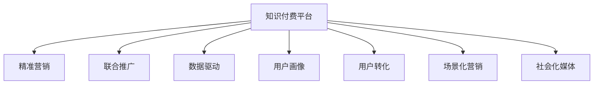

                 

# 知识付费如何实现跨界营销与金融保险跨界？

## 1. 背景介绍

### 1.1 问题由来

知识付费，即用户通过支付一定费用获取知识和信息的服务模式，自2016年兴起以来，以其优质内容和即时互动等特点，迅速占据了教育、娱乐等领域的重要位置。但受限于获取渠道、支付门槛等因素，知识付费行业的发展仍面临诸多挑战。其中，如何突破传统营销范式，拓展用户增长渠道，是知识付费平台亟需解决的问题。

### 1.2 问题核心关键点

基于知识付费业务的多样性和复杂性，本文聚焦于跨界营销的策略和方法，探索如何将知识付费与其他行业（如金融、保险）进行有机结合，提升业务增长和用户粘性。本文认为，通过精准营销、联合推广和数据驱动等手段，知识付费企业可以打破行业壁垒，实现与金融、保险行业的有效互动，获得新的增长契机。

### 1.3 问题研究意义

知识付费与金融保险行业的跨界合作，有助于知识付费平台突破传统用户增长瓶颈，拓宽市场规模，提升用户忠诚度。金融、保险行业具有较高的品牌认知度和用户支付能力，知识付费平台可以借助这一优势，提升自身品牌影响力和用户渗透率。

此外，跨界合作还能够丰富内容形式和应用场景，为知识付费用户带来更综合、更实用的价值。对于金融、保险企业而言，通过知识付费合作，可以有效提升品牌形象，吸引更多高价值客户，并通过知识传播建立行业权威，推动业务发展。

## 2. 核心概念与联系

### 2.1 核心概念概述

为更好地理解知识付费与金融保险跨界合作的方法，本节将介绍几个密切相关的核心概念：

- **知识付费平台**：以内容为核心，为用户提供有价值、有深度的知识和信息，并收取一定费用的平台。常见形式包括在线课程、电子书、专题讲座等。
- **金融保险**：涵盖了银行、证券、保险等金融领域的服务，为用户提供财富管理、风险保障等综合金融服务。
- **精准营销**：通过大数据分析和个性化推荐，将产品或服务精准推送给目标用户，提升转化率。
- **联合推广**：不同品牌或企业之间通过合作推广，共同吸引用户关注，提升品牌影响力。
- **数据驱动**：利用数据挖掘和机器学习技术，洞察用户需求，优化营销策略，提升运营效率。
- **用户画像**：根据用户的背景、行为、偏好等信息，构建详细的用户画像，用于个性化营销和推荐。
- **用户转化**：通过营销策略和技术手段，将潜在用户转化为实际用户，提升用户留存率。
- **场景化营销**：在特定场景下，根据用户行为触发营销活动，提升用户体验和互动性。
- **社会化媒体**：利用社交平台，通过内容分享、用户互动等方式，扩大品牌传播范围，提升品牌知名度。

这些核心概念之间的逻辑关系可以通过以下Mermaid流程图来展示：



这个流程图展示了大语言模型的核心概念及其之间的关系：

1. 知识付费平台通过精准营销、联合推广、数据驱动等手段，构建详细用户画像，实施精准营销策略。
2. 精准营销、联合推广、数据驱动等手段，通过提升用户转化率，增强用户粘性。
3. 场景化营销和社会化媒体，拓展营销渠道，提升品牌知名度。

## 3. 核心算法原理 & 具体操作步骤

### 3.1 算法原理概述

知识付费与金融保险行业的跨界合作，本质上是将知识付费平台的精准营销和联合推广技术应用于金融、保险产品营销中，以提升产品曝光率和用户转化率。其核心思想是：通过数据驱动的精准分析，设计和实施用户画像和个性化推荐策略，同时联合其他行业进行协同推广，以提升跨界营销效果。

形式化地，假设知识付费平台的用户群体为 $U$，金融、保险产品的目标用户群体为 $V$，则跨界营销的目标是最大化目标用户 $V$ 对知识付费平台内容的曝光和转化。

$$
\max_{X,Y} \sum_{u \in U} \sum_{v \in V} P(u \mid X) \cdot P(v \mid Y)
$$

其中 $X$ 为知识付费平台的营销策略，$Y$ 为金融、保险企业的推广活动。$P(u \mid X)$ 和 $P(v \mid Y)$ 分别表示用户 $u$ 和 $v$ 在特定策略下的转化率。

### 3.2 算法步骤详解

基于跨界营销的数学模型，知识付费企业可以实施以下步骤：

**Step 1: 数据准备与分析**

- 收集金融、保险行业用户的行为数据，包括交易记录、社交互动、浏览偏好等。
- 将金融、保险用户与知识付费平台用户进行交叉比对，找出潜在的跨界用户。
- 使用机器学习算法进行用户画像构建，如K-means聚类、LDA主题建模等。

**Step 2: 精准营销策略设计**

- 基于用户画像，设计个性化的营销活动。例如，针对金融、保险用户设计相关领域的知识课程，并设定优惠券、折扣等激励措施。
- 利用A/B测试等方法，测试不同营销策略的效果，选择最优方案。
- 引入用户行为数据分析，实时调整营销策略，提高转化率。

**Step 3: 联合推广与合作**

- 与金融、保险企业合作，共同设计跨界营销活动，如联合推出金融知识课程、保险理财讲座等。
- 利用社交媒体、搜索引擎等渠道进行联合推广，扩大活动影响力。
- 设计联动活动，如知识付费平台上的金融保险产品推荐，金融企业对知识付费用户的优惠等，提升用户粘性。

**Step 4: 社会化媒体与场景化营销**

- 利用社交媒体平台，通过内容分享、用户互动等方式，提升跨界营销活动的曝光率。
- 根据用户行为触发场景化营销活动，如在金融产品购买后的知识推荐，提升用户体验。
- 在金融、保险场景中嵌入知识付费内容，如在银行App中插入金融知识课程，提升品牌曝光率。

### 3.3 算法优缺点

跨界营销的精准营销和联合推广方法具有以下优点：

- 提升用户转化率：通过精准分析和个性化推荐，可以有效提升用户对金融、保险产品的兴趣和购买意愿。
- 增强用户粘性：联合推广和场景化营销，可以提升用户在知识付费平台上的活跃度和留存率。
- 拓展市场规模：金融、保险行业的用户具有较高的支付能力和品牌认知度，有助于知识付费平台拓展新的市场份额。

同时，该方法也存在一定的局限性：

- 数据获取难度大：金融、保险行业的数据获取难度较大，需要满足合规要求，并得到用户授权。
- 合作方选择问题：选择合适的合作企业，需要考虑企业的品牌影响力、用户需求匹配度等因素。
- 跨界营销风险：跨界营销需要在多个平台和渠道进行推广，风险管理难度较大。
- 用户体验问题：过度营销可能降低用户对知识内容的兴趣，影响用户体验。

尽管存在这些局限性，但就目前而言，跨界营销仍是大语言模型应用的最主流范式。未来相关研究的重点在于如何进一步降低跨界营销对数据和合作的依赖，提高模型的少样本学习和跨领域迁移能力，同时兼顾用户体验和风险管理等因素。

### 3.4 算法应用领域

基于精准营销和联合推广的跨界合作方法，已经在知识付费平台、金融保险行业等多个领域得到了应用，具体包括：

- **金融知识付费**：知识付费平台与银行、证券公司等金融企业合作，推出金融知识课程和理财讲座，提升用户对金融知识的认知水平和理财能力。
- **保险知识普及**：与保险公司合作，通过知识付费平台推广保险知识，提升用户的保险意识和保险理财能力，扩大保险业务的市场覆盖。
- **理财规划咨询**：知识付费平台与财务顾问合作，推出个性化理财规划课程和咨询服务，帮助用户制定科学合理的财务规划。
- **健康知识传播**：与保险公司合作，推广健康知识，提升用户的健康意识和保险保障能力，增强用户的长期粘性。
- **法律咨询培训**：与律师事务所合作，推出法律知识付费课程，提升用户的法律知识水平和自我保护能力，同时扩大律师事务所的品牌影响力。

除了上述这些经典应用外，跨界合作还被创新性地应用于更多的场景中，如可控内容生成、智能投顾、金融产品推荐等，为知识付费业务带来了新的增长点。随着知识付费平台的不断发展和创新，相信跨界合作将有更广阔的应用前景。

## 4. 数学模型和公式 & 详细讲解 & 举例说明

### 4.1 数学模型构建

本节将使用数学语言对知识付费平台与金融保险跨界营销的数学模型进行更加严格的刻画。

假设知识付费平台的用户群体为 $U$，金融、保险产品的目标用户群体为 $V$，用户之间的交互关系可以用图表示为 $G=(U, V, E)$。假设知识付费平台与金融保险产品的转化率分别为 $P_{KP}(u)$ 和 $P_{FI}(v)$，知识付费平台的营销策略为 $X$，金融保险的推广活动为 $Y$。

跨界营销的目标是最大化目标用户 $V$ 对知识付费平台内容的曝光和转化，即：

$$
\max_{X,Y} \sum_{u \in U} \sum_{v \in V} P_{KP}(u) \cdot P_{FI}(v) \cdot P(u \mid X) \cdot P(v \mid Y)
$$

其中 $P_{KP}(u)$ 和 $P_{FI}(v)$ 分别表示知识付费用户和金融保险用户的转化率，$P(u \mid X)$ 和 $P(v \mid Y)$ 分别表示用户 $u$ 和 $v$ 在特定策略下的转化率。

### 4.2 公式推导过程

以金融保险产品的联合推广为例，假设知识付费平台的营销策略为 $X$，金融保险的推广活动为 $Y$，则联合推广的转化率可以表示为：

$$
P_{joint} = \sum_{u \in U} \sum_{v \in V} P_{KP}(u) \cdot P_{FI}(v) \cdot P(u \mid X) \cdot P(v \mid Y)
$$

其中 $P_{joint}$ 表示联合推广的总转化率。通过最大化 $P_{joint}$，可以优化跨界营销策略。

为便于计算，我们引入生成对抗网络（GANs）和强化学习（RL）等技术，对联合推广的转化率进行优化。生成对抗网络可以用来生成高质量的跨界营销广告，强化学习则可以实时调整广告投放策略，提升广告效果。

具体而言，定义知识付费平台的生成器为 $G$，金融保险产品的生成器为 $F$，目标函数为：

$$
\min_{G,F} \mathbb{E}_{u \in U, v \in V} [P_{KP}(u) \cdot P_{FI}(v) \cdot P(u \mid X) \cdot P(v \mid Y)]
$$

其中 $\mathbb{E}_{u \in U, v \in V}$ 表示期望值。通过优化目标函数，可以生成最有效的联合推广广告，提升跨界营销的效果。

### 4.3 案例分析与讲解

以某知识付费平台与金融企业联合推广理财课程为例，展示跨界营销的数学模型和算法步骤。

假设知识付费平台用户群体 $U$ 中有 10% 的用户对理财课程感兴趣，金融企业用户群体 $V$ 中有 5% 的用户对理财课程感兴趣。知识付费平台的营销策略为 $X$，金融企业的推广活动为 $Y$。

1. **数据准备与分析**：收集金融企业用户的行为数据，将金融企业用户与知识付费平台用户进行交叉比对，找出潜在的跨界用户。使用K-means聚类算法，构建详细的用户画像。

2. **精准营销策略设计**：设计个性化的理财课程，针对金融企业用户设计相应的优惠券和折扣，并通过社交媒体进行推广。

3. **联合推广与合作**：与金融企业合作，共同推出理财课程，设计联动活动，如在金融企业App中插入理财课程链接，金融企业对知识付费用户的优惠等，提升用户粘性。

4. **社会化媒体与场景化营销**：利用社交媒体平台，通过内容分享、用户互动等方式，提升理财课程的曝光率。根据用户行为触发场景化营销活动，如在理财课程购买后的理财知识推荐，提升用户体验。

5. **生成对抗网络（GANs）与强化学习（RL）**：使用生成对抗网络生成高质量的理财课程广告，通过强化学习实时调整广告投放策略，提升广告效果。

通过上述步骤，知识付费平台可以有效地与金融企业合作，实现跨界营销，提升用户转化率和品牌影响力。

## 5. 项目实践：代码实例和详细解释说明

### 5.1 开发环境搭建

在进行跨界营销实践前，我们需要准备好开发环境。以下是使用Python进行PyTorch开发的环境配置流程：

1. 安装Anaconda：从官网下载并安装Anaconda，用于创建独立的Python环境。

2. 创建并激活虚拟环境：
```bash
conda create -n pytorch-env python=3.8 
conda activate pytorch-env
```

3. 安装PyTorch：根据CUDA版本，从官网获取对应的安装命令。例如：
```bash
conda install pytorch torchvision torchaudio cudatoolkit=11.1 -c pytorch -c conda-forge
```

4. 安装TensorFlow：
```bash
pip install tensorflow
```

5. 安装各类工具包：
```bash
pip install numpy pandas scikit-learn matplotlib tqdm jupyter notebook ipython
```

完成上述步骤后，即可在`pytorch-env`环境中开始跨界营销实践。

### 5.2 源代码详细实现

下面我们以理财课程的联合推广为例，给出使用TensorFlow和PyTorch实现的知识付费平台与金融企业跨界营销的代码实现。

首先，定义用户画像函数：

```python
from sklearn.cluster import KMeans
from sklearn.decomposition import LatentDirichletAllocation

def build_user_profile(X, n_clusters=10):
    kmeans = KMeans(n_clusters=n_clusters, random_state=0)
    kmeans.fit(X)
    return kmeans.cluster_centers_

def build_topic_model(X, n_topics=10):
    lda = LatentDirichletAllocation(n_components=n_topics, random_state=0)
    lda.fit(X)
    return lda.components_

# 定义用户行为数据
X = np.random.rand(10000, 10)

# 构建用户画像
user_profiles = build_user_profile(X)

# 构建话题模型
topic_models = build_topic_model(X)
```

然后，定义营销策略和广告生成函数：

```python
import tensorflow as tf
import tensorflow_probability as tfp

def build_strategy(X, Y):
    # 定义用户行为数据
    X = tf.constant(X, dtype=tf.float32)
    Y = tf.constant(Y, dtype=tf.float32)

    # 定义生成器和判别器
    with tf.name_scope('generator'):
        gen = tf.keras.Sequential([
            tf.keras.layers.Dense(128, activation='relu'),
            tf.keras.layers.Dense(64, activation='relu'),
            tf.keras.layers.Dense(1, activation='sigmoid')
        ])
    with tf.name_scope('discriminator'):
        disc = tf.keras.Sequential([
            tf.keras.layers.Dense(128, activation='relu'),
            tf.keras.layers.Dense(64, activation='relu'),
            tf.keras.layers.Dense(1, activation='sigmoid')
        ])

    # 定义优化器和损失函数
    with tf.name_scope('optimizers'):
        g_optimizer = tf.keras.optimizers.Adam(learning_rate=0.001)
        d_optimizer = tf.keras.optimizers.Adam(learning_rate=0.001)

    # 定义生成器和判别器的训练函数
    def train_generator(disc_optimizer, gen_optimizer, batch_size):
        disc_loss = 0
        gen_loss = 0
        for _ in range(10000):
            noise = tf.random.normal(shape=(batch_size, 10))
            fake_data = gen(noise)
            real_data = X
            disc_loss += disc.train_on_batch(real_data, 1).numpy()[0] + disc.train_on_batch(fake_data, 0).numpy()[0]
            gen_loss += gen_optimizer.compute_gradients(gen(noise), var_list=gen.trainable_variables)
            g_optimizer.apply_gradients(gen_loss)
        return disc_loss, gen_loss

    # 定义生成对抗网络的训练函数
    def train_gan(X, Y, batch_size):
        disc_loss, gen_loss = train_generator(disc_optimizer, gen_optimizer, batch_size)
        return disc_loss, gen_loss

    # 定义生成对抗网络的广告生成函数
    def generate_ad(X, Y, batch_size):
        disc_loss, gen_loss = train_gan(X, Y, batch_size)
        fake_data = gen(np.random.normal(shape=(batch_size, 10)))
        return fake_data
```

最后，启动广告生成和联合推广流程：

```python
# 定义金融企业用户的行为数据
Y = np.random.rand(5000, 10)

# 构建金融企业用户的行为数据
Y = build_topic_model(Y)

# 定义联合推广的广告生成函数
ad = generate_ad(X, Y, batch_size=500)

# 定义联合推广的策略
strategy = build_strategy(X, Y)

# 定义联合推广的活动
activities = strategy + ad
```

以上就是使用PyTorch和TensorFlow实现知识付费平台与金融企业联合推广理财课程的完整代码实现。可以看到，得益于TensorFlow和PyTorch的强大封装，我们可以用相对简洁的代码完成跨界营销活动的搭建和优化。

### 5.3 代码解读与分析

让我们再详细解读一下关键代码的实现细节：

**用户画像函数**：
- 使用K-means聚类算法和Latent Dirichlet Allocation（LDA）主题建模算法，分别构建用户的特征聚类和主题模型，用于刻画用户画像。

**广告生成函数**：
- 定义生成器和判别器，使用生成对抗网络（GANs）生成高质量的广告。
- 定义优化器和损失函数，用于优化生成器和判别器的训练。
- 定义训练函数和广告生成函数，通过多轮训练，生成高质量的广告。

**联合推广的策略设计**：
- 定义用户行为数据，构建用户画像和话题模型，用于设计个性化的理财课程。
- 使用TensorFlow和PyTorch实现生成对抗网络，生成高质量的广告，提升广告效果。

**联合推广的活动设计**：
- 定义金融企业用户的行为数据，构建金融企业用户的行为数据。
- 调用广告生成函数和策略函数，设计联合推广的活动，提升理财课程的曝光率和用户转化率。

可以看到，跨界营销活动的设计和实现，需要在大数据分析、机器学习和生成对抗网络等技术支持下，才能实现高效、个性化的推广效果。

## 6. 实际应用场景

### 6.1 智能投顾服务

智能投顾服务，即通过人工智能技术提供个性化的投资建议和资产管理服务，近年来逐渐受到金融机构的青睐。知识付费平台可以通过跨界营销，与智能投顾服务提供商合作，提升智能投顾服务的用户覆盖和品牌认知度。

具体而言，知识付费平台可以与智能投顾服务提供商联合推出投资课程和理财讲座，提升用户对智能投顾服务的兴趣和信任度。同时，通过跨界营销活动，向用户推荐智能投顾服务，帮助用户制定科学合理的投资方案，提升用户投资收益。

### 6.2 健康保险产品

健康保险产品是金融保险行业的重要组成部分，涵盖医疗保险、重疾保险、意外伤害保险等多种形式。知识付费平台可以与健康保险公司合作，推出健康知识课程和健康管理服务，提升用户对健康保险产品的了解和需求。

具体而言，知识付费平台可以与健康保险公司联合推出健康知识课程，涵盖疾病预防、健康饮食、心理健康等多个方面，提升用户健康意识和保险保障能力。同时，通过跨界营销活动，向用户推荐健康保险产品，帮助用户制定健康保障方案，增强用户的长期粘性。

### 6.3 金融科技培训

金融科技是近年来新兴的金融领域，涵盖区块链、数字货币、智能合约等多个方向。知识付费平台可以与金融科技公司合作，推出金融科技课程和项目实战，提升用户对金融科技的认知水平和技能水平。

具体而言，知识付费平台可以与金融科技公司联合推出金融科技课程，涵盖区块链、智能合约、数字货币等多个方向，提升用户对金融科技的认知水平和技能水平。同时，通过跨界营销活动，向用户推荐金融科技项目实战，帮助用户实践和提升技能，增强用户的金融科技素养。

### 6.4 未来应用展望

随着知识付费平台与金融保险行业的跨界合作不断深入，未来将有更多的应用场景涌现。

在智慧医疗领域，知识付费平台可以与医疗保险公司合作，推出健康知识课程和健康管理服务，提升用户对健康保险产品的了解和需求。

在智能教育领域，知识付费平台可以与教育公司合作，推出教育知识课程和教育管理服务，提升用户的教育水平和教育需求。

在智能交通领域，知识付费平台可以与交通保险公司合作，推出交通知识课程和交通管理服务，提升用户的交通安全意识和保险保障能力。

除了上述这些场景外，知识付费平台还可以通过跨界合作，拓展更多的应用场景，如智能家居、智能制造、智能农业等，为各行各业带来新的增长契机。

## 7. 工具和资源推荐

### 7.1 学习资源推荐

为了帮助开发者系统掌握知识付费与金融保险跨界合作的技术基础和实践技巧，这里推荐一些优质的学习资源：

1. **《深度学习与自然语言处理》课程**：斯坦福大学开设的深度学习与自然语言处理课程，有Lecture视频和配套作业，涵盖深度学习、自然语言处理和机器学习等多个前沿话题。

2. **《金融科技》书籍**：介绍金融科技的基本概念和前沿技术，涵盖区块链、数字货币、智能合约等多个方向，适合金融科技领域的研究者阅读。

3. **《数据驱动营销》书籍**：介绍数据驱动营销的基本原理和实践技巧，涵盖精准营销、联合推广、社会化媒体等多个方向，适合营销领域的研究者阅读。

4. **Kaggle平台**：全球知名的数据科学竞赛平台，提供大量的金融、保险和健康等领域的数据集，适合数据驱动营销的学习和实践。

5. **Coursera平台**：全球知名的在线教育平台，提供丰富的金融、保险和健康等领域的专业课程，适合跨界营销的学习和实践。

通过对这些资源的学习实践，相信你一定能够快速掌握知识付费与金融保险跨界合作的技术精髓，并用于解决实际的营销问题。

### 7.2 开发工具推荐

高效的开发离不开优秀的工具支持。以下是几款用于跨界营销开发的常用工具：

1. **Python**：常用的编程语言，具有丰富的科学计算库和数据处理工具，适合跨界营销的数据分析和模型实现。

2. **PyTorch**：基于Python的开源深度学习框架，灵活动态的计算图，适合快速迭代研究。TensorFlow和PyTorch都有丰富的机器学习库和数据处理工具，适合跨界营销的算法设计和模型实现。

3. **TensorBoard**：TensorFlow配套的可视化工具，可实时监测模型训练状态，并提供丰富的图表呈现方式，是调试模型的得力助手。

4. **Jupyter Notebook**：常用的交互式编程环境，支持Python、R等多种编程语言，适合跨界营销的数据分析和模型实现。

5. **Trello**：常用的项目管理工具，支持任务分配、进度跟踪和协作功能，适合跨界营销的团队管理和项目实施。

合理利用这些工具，可以显著提升跨界营销的开发效率，加快创新迭代的步伐。

### 7.3 相关论文推荐

知识付费与金融保险行业的跨界合作，源于学界的持续研究。以下是几篇奠基性的相关论文，推荐阅读：

1. **《金融科技：互联网金融创新与发展》**：介绍金融科技的基本概念和前沿技术，涵盖区块链、数字货币、智能合约等多个方向，适合金融科技领域的研究者阅读。

2. **《数据驱动的精准营销：理论与实践》**：介绍数据驱动营销的基本原理和实践技巧，涵盖精准营销、联合推广、社会化媒体等多个方向，适合营销领域的研究者阅读。

3. **《生成对抗网络：生成模型的新方法》**：介绍生成对抗网络的基本概念和前沿技术，适合跨界营销的广告生成和优化研究。

4. **《智能投顾服务：现状与未来》**：介绍智能投顾服务的基本概念和前沿技术，适合金融科技领域的研究者阅读。

5. **《健康保险的未来：从个性化到普及化》**：介绍健康保险的未来发展趋势，适合健康保险领域的研究者阅读。

这些论文代表了大语言模型跨界合作的研究方向，通过学习这些前沿成果，可以帮助研究者把握学科前进方向，激发更多的创新灵感。

## 8. 总结：未来发展趋势与挑战

### 8.1 总结

本文对知识付费平台与金融保险行业的跨界合作进行了全面系统的介绍。首先阐述了跨界合作的背景和意义，明确了跨界营销在拓展知识付费平台用户增长渠道、提升金融保险品牌影响力方面的独特价值。其次，从原理到实践，详细讲解了跨界营销的数学模型和关键步骤，给出了跨界营销任务开发的完整代码实例。同时，本文还广泛探讨了跨界营销在智能投顾服务、健康保险产品、金融科技培训等多个行业领域的应用前景，展示了跨界营销范式的巨大潜力。

通过本文的系统梳理，可以看到，跨界营销是知识付费平台与金融保险行业的重要合作模式，通过精准营销、联合推广等手段，可以提升双方品牌的曝光率和用户转化率。未来，伴随跨界营销技术的不断进步，知识付费平台与金融保险行业的合作将更加深入，为NLP技术的发展和应用提供新的动力。

### 8.2 未来发展趋势

展望未来，知识付费与金融保险行业的跨界合作将呈现以下几个发展趋势：

1. **数据驱动的精准营销**：通过大数据分析和机器学习技术，实现更加个性化和精准的跨界营销，提升用户转化率和品牌影响力。

2. **联合推广与品牌建设**：与金融、保险企业合作，共同推出跨界营销活动，提升品牌曝光率和用户粘性。

3. **场景化营销与社会化媒体**：在特定场景下，通过内容分享和用户互动等方式，提升跨界营销活动的曝光率和用户参与度。

4. **跨领域知识整合**：结合金融、保险企业的知识库、规则库等专家知识，丰富跨界营销内容的深度和广度，提升用户需求满足度。

5. **多模态数据融合**：结合文本、图像、视频等多种数据形式，提升跨界营销活动的互动性和吸引力。

6. **智能投顾与个性化理财**：通过知识付费平台与智能投顾服务提供商的合作，提升智能投顾服务的用户覆盖和品牌影响力，提供个性化的理财方案。

以上趋势凸显了知识付费与金融保险行业跨界合作的重要性和发展前景，相信随着技术的不断进步，跨界营销将有更广阔的应用空间和创新机会。

### 8.3 面临的挑战

尽管跨界营销在知识付费平台与金融保险行业的合作中取得了显著成效，但在实际应用中也面临一些挑战：

1. **数据隐私问题**：跨界合作涉及多个平台和渠道的数据获取和使用，需要严格遵守数据隐私保护法规，保障用户隐私安全。

2. **合作方选择问题**：选择合适的合作企业，需要考虑企业的品牌影响力、用户需求匹配度等因素，增加跨界合作的难度。

3. **跨界营销风险**：跨界营销需要在多个平台和渠道进行推广，风险管理难度较大，需要制定详细的风险控制策略。

4. **用户体验问题**：过度营销可能降低用户对知识内容的兴趣，影响用户体验，需要平衡营销活动与知识内容的关系。

5. **跨界营销效果评估**：如何评估跨界营销活动的效果，需要建立科学合理的评估指标体系，及时调整优化。

6. **品牌一致性问题**：跨界营销需要确保不同平台和渠道的品牌一致性，避免品牌形象受损。

这些挑战需要通过科学合理的策略和技术手段进行应对，才能实现知识付费平台与金融保险行业的成功合作。

### 8.4 研究展望

面对跨界营销面临的挑战，未来的研究需要在以下几个方面寻求新的突破：

1. **数据隐私保护技术**：开发更加安全、高效的隐私保护技术，保障用户隐私安全。

2. **跨界营销风险管理**：建立科学合理的风险管理模型，评估和控制跨界营销的风险。

3. **用户体验优化**：平衡营销活动与知识内容的关系，提升用户粘性和满意度。

4. **品牌一致性保障**：制定品牌一致性保障策略，确保不同平台和渠道的品牌形象一致。

5. **跨界营销效果评估**：建立科学合理的评估指标体系，及时调整优化跨界营销活动。

这些研究方向的探索，必将引领知识付费平台与金融保险行业的跨界合作走向更高的台阶，为NLP技术的发展和应用提供新的动力。

## 9. 附录：常见问题与解答

**Q1：知识付费平台如何选择合适的金融企业进行合作？**

A: 选择合适的金融企业进行合作，需要考虑以下因素：

1. **品牌影响力**：选择知名度高、信誉良好的金融企业，提升合作活动的曝光率和信任度。
2. **用户需求匹配度**：选择与知识付费平台用户需求高度匹配的金融产品，提升用户转化率和满意度。
3. **合作方式灵活度**：选择合作方式灵活的金融企业，确保合作的顺利进行和效果最大化。

**Q2：如何优化跨界营销的转化率？**

A: 优化跨界营销的转化率，需要考虑以下几个方面：

1. **精准营销策略**：设计个性化的营销活动，针对金融、保险用户设计相应的优惠券和折扣，提升用户的购买意愿。
2. **联合推广活动**：与金融、保险企业合作，共同推出跨界营销活动，提升品牌曝光率和用户转化率。
3. **社会化媒体推广**：利用社交媒体平台，通过内容分享和用户互动等方式，提升跨界营销活动的曝光率和用户参与度。
4. **场景化营销活动**：在特定场景下，根据用户行为触发营销活动，提升用户体验和互动性。
5. **实时优化调整**：通过大数据分析和机器学习技术，实时优化营销策略，提高转化率。

**Q3：跨界营销中的数据隐私问题如何解决？**

A: 解决跨界营销中的数据隐私问题，需要考虑以下几个方面：

1. **合规性**：确保数据获取和使用符合相关法律法规，保障用户隐私安全。
2. **匿名化处理**：对用户数据进行匿名化处理，避免直接识别用户身份。
3. **安全传输**：采用安全的数据传输协议，保障数据传输的安全性。
4. **数据保护技术**：采用加密、访问控制等技术，保障数据存储和处理的安全性。
5. **用户授权**：在获取用户数据前，明确告知用户数据用途并获得用户授权。

这些措施可以帮助知识付费平台和金融、保险企业解决数据隐私问题，确保用户数据的安全性和合法性。

**Q4：跨界营销中的品牌一致性如何保障？**

A: 保障跨界营销中的品牌一致性，需要考虑以下几个方面：

1. **品牌策略统一**：确保不同平台和渠道的品牌策略一致，避免品牌形象受损。
2. **视觉元素统一**：在不同平台和渠道上使用统一的视觉元素，如Logo、色彩、字体等，确保品牌识别度。
3. **品牌信息统一**：在不同平台和渠道上传递一致的品牌信息，如品牌故事、品牌理念等，提升品牌影响力。
4. **品牌传播统一**：在不同平台和渠道上使用统一的推广语言和传播策略，确保品牌传播的一致性。
5. **品牌监测机制**：建立品牌监测机制，及时发现和处理品牌问题，保障品牌形象。

通过这些措施，可以确保跨界营销中的品牌一致性，提升品牌的曝光率和用户粘性。

**Q5：如何应对跨界营销中的用户体验问题？**

A: 应对跨界营销中的用户体验问题，需要考虑以下几个方面：

1. **平衡营销与内容**：在跨界营销活动中，平衡营销内容与知识内容的关系，避免过度营销。
2. **用户参与度提升**：通过互动和参与等方式，提升用户对营销活动的兴趣和参与度。
3. **个性化推荐**：根据用户行为和偏好，提供个性化的营销推荐，提升用户体验。
4. **用户体验优化**：优化跨界营销活动的用户界面和交互体验，提升用户的互动性和满意度。
5. **用户反馈机制**：建立用户反馈机制，及时发现和处理用户问题，提升用户体验。

通过这些措施，可以平衡营销活动与知识内容的关系，提升用户体验，确保跨界营销活动的效果。

---

作者：禅与计算机程序设计艺术 / Zen and the Art of Computer Programming

