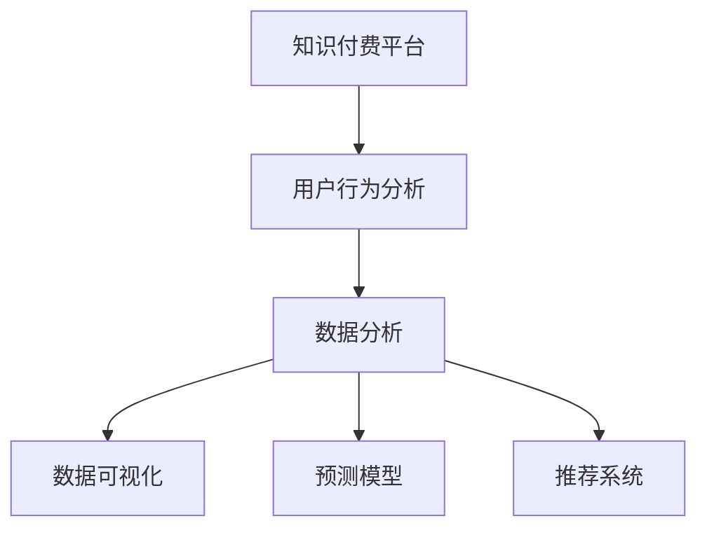

                 

# 知识付费平台的用户数据分析方法

> 关键词：知识付费、用户行为分析、数据分析、数据可视化、预测模型、推荐系统

## 1. 背景介绍

在知识付费平台兴起的大背景下，如何通过数据分析深入理解用户行为，优化用户体验，提升平台收益，成为平台运营者面临的重要挑战。本文将系统地介绍知识付费平台用户数据分析的方法和技术，帮助运营者基于数据驱动，实现平台的精准运营和高效决策。

## 2. 核心概念与联系

### 2.1 核心概念概述

为更好地理解知识付费平台用户数据分析的框架和方法，本节将介绍几个关键概念：

- **知识付费平台**：以提供知识内容为核心的订阅型或按需付费平台，如得到、喜马拉雅、分答等。
- **用户行为分析**：通过对用户行为数据的收集和分析，了解用户的兴趣、需求和行为模式。
- **数据分析**：运用统计学、数据挖掘等方法，从海量数据中提取有用信息，提供决策支持。
- **数据可视化**：将数据分析结果以图表、地图等形式呈现，便于直观理解。
- **预测模型**：基于历史数据和机器学习算法，构建模型预测用户行为和需求。
- **推荐系统**：通过分析用户行为，推荐个性化内容，提升用户粘性和平台收益。

这些概念之间的逻辑关系可以通过以下Mermaid流程图来展示：



这个流程图展示了这个框架的核心概念及其之间的关系：

1. 知识付费平台是数据分析的主要数据源。
2. 用户行为分析是数据采集的核心，数据分析的出发点和归宿。
3. 数据分析基于用户行为数据，通过统计、挖掘等手段获得有用信息。
4. 数据可视化帮助理解和展示分析结果。
5. 预测模型利用数据分析结果，预测用户行为和需求。
6. 推荐系统根据预测结果，提供个性化内容推荐，提升用户体验和平台收益。

## 3. 核心算法原理 & 具体操作步骤
### 3.1 算法原理概述

知识付费平台用户数据分析的核心算法原理，主要基于以下几种技术：

1. **用户行为分析**：通过点击流、浏览记录、订阅记录、支付记录等数据，了解用户的行为模式和偏好。
2. **数据分析**：采用描述性统计、聚类分析、关联规则分析、时间序列分析等方法，从数据中提取知识。
3. **数据可视化**：运用图表、地图等工具，直观展示分析结果。
4. **预测模型**：采用回归、分类、聚类、关联规则等机器学习算法，预测用户行为。
5. **推荐系统**：基于协同过滤、内容推荐、混合推荐等方法，为每位用户推荐个性化内容。

本文将详细介绍这些核心算法原理和操作步骤，以帮助运营者理解和应用。

### 3.2 算法步骤详解

#### 3.2.1 用户行为分析

用户行为分析是知识付费平台数据分析的第一步。通过收集和分析用户在不同模块（如课程模块、推荐模块、搜索模块）上的行为数据，了解用户兴趣和行为模式。

1. **数据采集**：使用API接口获取用户行为数据，包括点击、浏览、订阅、购买等行为。
2. **数据预处理**：清洗数据，处理缺失值和异常值，标准化数据格式。
3. **数据挖掘**：运用关联规则、序列模式挖掘等算法，发现用户行为模式。
4. **可视化展示**：使用可视化工具展示用户行为图谱，如点击热力图、用户路径图等。

#### 3.2.2 数据分析

数据分析是知识付费平台数据分析的核心。通过分析用户行为数据，获得对用户需求和行为模式的深入理解。

1. **描述性统计**：计算平均值、中位数、标准差等描述性统计量，了解数据分布情况。
2. **聚类分析**：使用K-means、层次聚类等算法，将用户分成不同的兴趣群体。
3. **关联规则分析**：采用Apriori、FP-growth等算法，发现不同行为之间的关联规则。
4. **时间序列分析**：运用ARIMA、LSTM等模型，预测用户行为随时间的变化趋势。

#### 3.2.3 数据可视化

数据可视化是知识付费平台数据分析的重要手段。通过可视化展示分析结果，帮助运营者直观理解用户行为和需求。

1. **数据可视化工具**：使用Tableau、Power BI、D3.js等工具，展示用户行为分析结果。
2. **可视化图表类型**：如散点图、柱状图、折线图、热力图、地图等。
3. **数据交互**：实现数据筛选、钻取等交互功能，增强数据分析的可操作性。

#### 3.2.4 预测模型

预测模型是知识付费平台数据分析的重要组成部分。通过预测用户行为和需求，实现个性化的内容推荐和精准运营。

1. **预测模型选择**：根据问题类型和数据特点，选择合适的预测模型，如线性回归、随机森林、神经网络等。
2. **特征工程**：设计特征，提取和变换数据，提升模型的预测能力。
3. **模型训练与评估**：使用训练集训练模型，在验证集和测试集上评估模型性能。
4. **模型应用**：将训练好的模型应用到新数据上，实现用户行为和需求的预测。

#### 3.2.5 推荐系统

推荐系统是知识付费平台数据分析的最终应用。通过推荐个性化内容，提升用户体验和平台收益。

1. **协同过滤**：基于用户行为和物品属性的相似性，推荐相似用户喜欢的内容。
2. **内容推荐**：基于物品特征，如关键词、标签等，推荐相关内容。
3. **混合推荐**：结合协同过滤和内容推荐，提升推荐效果。
4. **推荐算法优化**：使用A/B测试等方法，优化推荐算法，提升用户体验。

### 3.3 算法优缺点

知识付费平台用户数据分析的主要算法具有以下优点和缺点：

#### 优点

1. **深入理解用户需求**：通过数据分析，深入了解用户行为模式和需求，为产品优化和精准运营提供数据支持。
2. **提升用户粘性**：基于预测模型和推荐系统，为每位用户推荐个性化内容，提升用户粘性和平台收益。
3. **决策支持**：通过数据分析，为决策提供科学依据，减少决策风险。

#### 缺点

1. **数据质量要求高**：数据采集和处理环节容易出现错误和偏差，影响分析结果的准确性。
2. **算法复杂度大**：机器学习算法复杂度高，需要大量计算资源和时间进行训练和优化。
3. **模型解释性差**：一些复杂的算法模型，如深度神经网络，难以解释其内部工作机制。

## 4. 数学模型和公式 & 详细讲解 & 举例说明
### 4.1 数学模型构建

知识付费平台用户数据分析的数学模型构建，主要基于以下几种数学方法：

1. **描述性统计模型**：计算平均值、中位数、标准差等统计量，描述数据分布情况。
2. **聚类分析模型**：使用K-means、层次聚类等算法，将用户分成不同的兴趣群体。
3. **关联规则分析模型**：使用Apriori、FP-growth等算法，发现不同行为之间的关联规则。
4. **时间序列分析模型**：使用ARIMA、LSTM等模型，预测用户行为随时间的变化趋势。

#### 4.1.1 描述性统计模型

描述性统计模型主要用于计算数据的基本统计量，了解数据分布情况。

$$
\mu = \frac{1}{N} \sum_{i=1}^{N} x_i
$$

其中，$\mu$ 表示平均值，$x_i$ 表示样本数据，$N$ 表示样本数量。

#### 4.1.2 聚类分析模型

聚类分析模型主要用于将用户分成不同的兴趣群体，使用K-means算法。

1. **数据预处理**：标准化数据，使其符合0-1分布。
2. **初始化聚类中心**：随机选取K个聚类中心点。
3. **迭代更新**：计算每个样本到每个聚类中心的距离，将样本分配到最近的聚类中心。
4. **更新聚类中心**：计算每个聚类中心的新位置。
5. **收敛判断**：当聚类中心不再变化，算法收敛。

#### 4.1.3 关联规则分析模型

关联规则分析模型主要用于发现不同行为之间的关联规则，使用Apriori算法。

1. **数据预处理**：将数据转换为事务数据库，删除项集支持度小于最小支持度阈值的项集。
2. **候选生成**：计算频繁项集，生成候选关联规则。
3. **规则筛选**：筛选频繁关联规则，生成最终关联规则。

#### 4.1.4 时间序列分析模型

时间序列分析模型主要用于预测用户行为随时间的变化趋势，使用ARIMA模型。

$$
Y_t = c + \sum_{i=1}^{p} \alpha_i Y_{t-i} + \sum_{j=1}^{d} \beta_j \Delta^j Y_t + \sum_{k=1}^{q} \gamma_k \epsilon_{t-k}
$$

其中，$Y_t$ 表示时间t的观测值，$\Delta^j$ 表示滞后算子，$\epsilon_{t-k}$ 表示随机误差项，$p$、$d$、$q$ 分别表示自回归、差分和移动平均项的阶数。

### 4.2 公式推导过程

#### 4.2.1 描述性统计模型

描述性统计模型的推导过程如下：

1. **均值计算**：

$$
\mu = \frac{1}{N} \sum_{i=1}^{N} x_i
$$

2. **方差计算**：

$$
\sigma^2 = \frac{1}{N-1} \sum_{i=1}^{N} (x_i - \mu)^2
$$

3. **标准差计算**：

$$
\sigma = \sqrt{\sigma^2}
$$

#### 4.2.2 聚类分析模型

K-means算法的推导过程如下：

1. **初始化聚类中心**：

$$
C_1, C_2, ..., C_k
$$

2. **迭代更新**：

$$
\begin{aligned}
&d(x, C_j) = \sum_{i=1}^{n} |x_i - C_j| \\
&y_i = \arg\min_{j=1,...,k} d(x, C_j) \\
&C_j = \frac{1}{\sum_{i=1}^{n} \mathbb{I}(y_i = j)} \sum_{i=1}^{n} x_i \cdot \mathbb{I}(y_i = j)
\end{aligned}
$$

其中，$x$ 表示样本，$C_j$ 表示聚类中心，$d(x, C_j)$ 表示样本到聚类中心的距离，$\mathbb{I}(y_i = j)$ 表示哑变量，$y_i$ 表示样本分配到最近的聚类中心，$n$ 表示样本数量，$k$ 表示聚类数目。

#### 4.2.3 关联规则分析模型

Apriori算法的推导过程如下：

1. **候选生成**：

$$
L_1 = \{t_1, t_2, ..., t_m\}
$$

2. **频繁项集生成**：

$$
L_2 = \{t_i \in L_1 | \text{support}(t_i) \geq \min_{t_i} \text{support}(t_i)\}
$$

3. **关联规则生成**：

$$
R_1 = \{t_i \in L_2 | t_i \subseteq L_2, |t_i| = 2\}
$$

4. **规则筛选**：

$$
R_2 = \{t_i \in L_2 | t_i \subseteq L_2, \text{support}(t_i) \geq \min_{t_i} \text{support}(t_i) \text{且} \text{confidence}(t_i) \geq \min_{t_i} \text{confidence}(t_i)\}
$$

其中，$t_i$ 表示项集，$\text{support}(t_i)$ 表示项集的支持度，$\text{confidence}(t_i)$ 表示关联规则的置信度，$L_1$ 表示候选项集，$L_2$ 表示频繁项集，$R_1$ 表示候选关联规则，$R_2$ 表示频繁关联规则。

#### 4.2.4 时间序列分析模型

ARIMA模型的推导过程如下：

1. **自回归模型**：

$$
Y_t = \sum_{i=1}^{p} \alpha_i Y_{t-i} + \epsilon_t
$$

2. **差分模型**：

$$
\Delta Y_t = Y_t - Y_{t-1}
$$

3. **移动平均模型**：

$$
\epsilon_t = \sum_{i=1}^{q} \gamma_i \epsilon_{t-i}
$$

4. **组合模型**：

$$
Y_t = c + \sum_{i=1}^{p} \alpha_i Y_{t-i} + \sum_{j=1}^{d} \beta_j \Delta^j Y_t + \sum_{k=1}^{q} \gamma_k \epsilon_{t-k}
$$

其中，$Y_t$ 表示时间t的观测值，$\epsilon_t$ 表示随机误差项，$c$ 表示常数项，$\alpha_i$ 表示自回归系数，$\beta_j$ 表示差分系数，$\gamma_k$ 表示移动平均系数，$p$、$d$、$q$ 分别表示自回归、差分和移动平均项的阶数。

### 4.3 案例分析与讲解

#### 4.3.1 描述性统计模型

以某知识付费平台的课程订阅数据为例，计算其月均订阅人数和课程平均订阅时长。

1. **数据收集**：收集平台2018年1月至2020年12月的课程订阅数据，包括课程ID、订阅时间、用户ID等。

2. **数据预处理**：标准化数据，处理缺失值和异常值。

3. **计算平均值**：

$$
\mu = \frac{1}{N} \sum_{i=1}^{N} x_i
$$

4. **计算方差**：

$$
\sigma^2 = \frac{1}{N-1} \sum_{i=1}^{N} (x_i - \mu)^2
$$

5. **计算标准差**：

$$
\sigma = \sqrt{\sigma^2}
$$

通过描述性统计模型，运营者可以了解课程订阅的总体趋势和波动情况，为课程优化和运营策略调整提供依据。

#### 4.3.2 聚类分析模型

以某知识付费平台的课程订阅数据为例，将用户分成不同的兴趣群体。

1. **数据收集**：收集平台2018年1月至2020年12月的课程订阅数据，包括课程ID、订阅时间、用户ID等。

2. **数据预处理**：标准化数据，处理缺失值和异常值。

3. **聚类分析**：

$$
C_1, C_2, ..., C_k
$$

通过聚类分析模型，运营者可以了解用户的兴趣偏好，为个性化推荐和用户画像构建提供数据支持。

#### 4.3.3 关联规则分析模型

以某知识付费平台的课程订阅数据为例，发现用户订阅课程的关联规则。

1. **数据收集**：收集平台2018年1月至2020年12月的课程订阅数据，包括课程ID、订阅时间、用户ID等。

2. **数据预处理**：标准化数据，处理缺失值和异常值。

3. **关联规则分析**：

$$
R_1 = \{t_i \in L_2 | t_i \subseteq L_2, |t_i| = 2\}
$$

通过关联规则分析模型，运营者可以了解用户订阅课程的关联关系，优化课程推荐策略。

#### 4.3.4 时间序列分析模型

以某知识付费平台的课程订阅数据为例，预测用户订阅人数随时间的变化趋势。

1. **数据收集**：收集平台2018年1月至2020年12月的课程订阅数据，包括课程ID、订阅时间、用户ID等。

2. **数据预处理**：标准化数据，处理缺失值和异常值。

3. **时间序列分析**：

$$
Y_t = c + \sum_{i=1}^{p} \alpha_i Y_{t-i} + \sum_{j=1}^{d} \beta_j \Delta^j Y_t + \sum_{k=1}^{q} \gamma_k \epsilon_{t-k}
$$

通过时间序列分析模型，运营者可以预测用户订阅人数的趋势，为课程上架和库存管理提供依据。

## 5. 项目实践：代码实例和详细解释说明
### 5.1 开发环境搭建

在进行知识付费平台用户数据分析的实践前，我们需要准备好开发环境。以下是使用Python进行Pandas开发的环境配置流程：

1. 安装Anaconda：从官网下载并安装Anaconda，用于创建独立的Python环境。

2. 创建并激活虚拟环境：
```bash
conda create -n py-env python=3.8 
conda activate py-env
```

3. 安装Pandas：
```bash
conda install pandas
```

4. 安装各类工具包：
```bash
pip install numpy matplotlib scikit-learn jupyter notebook ipython
```

完成上述步骤后，即可在`py-env`环境中开始数据分析实践。

### 5.2 源代码详细实现

这里我们以某知识付费平台的课程订阅数据为例，给出使用Pandas进行数据分析的代码实现。

```python
import pandas as pd
import numpy as np

# 读取数据
data = pd.read_csv('courses.csv')

# 数据预处理
data.dropna(inplace=True)  # 处理缺失值
data = data.drop_duplicates()  # 处理重复数据

# 计算月均订阅人数
monthly_subscribers = data.groupby(['month'])['user_id'].nunique()

# 计算课程平均订阅时长
course_duration = data.groupby(['course_id'])['duration'].mean()

# 计算总订阅人数
total_subscribers = data['user_id'].nunique()

# 可视化展示
monthly_subscribers.plot(kind='line', title='Monthly Subscribers')
course_duration.plot(kind='line', title='Course Duration')
total_subscribers.plot(kind='line', title='Total Subscribers')

# 聚类分析
from sklearn.cluster import KMeans
kmeans = KMeans(n_clusters=5, random_state=42)
kmeans.fit(data[['interest']])
labels = kmeans.labels_
labels = pd.Series(labels, index=data.index)

# 可视化展示
pd.DataFrame(labels).plot(kind='bar', title='User Clusters')

# 关联规则分析
from mlxtend.frequent_patterns import apriori, association_rules
frequent_patterns = apriori(data[['course_id', 'user_id']], min_support=0.05)
rules = association_rules(frequent_patterns, metric='lift', min_threshold=1.5)
rules.plot(kind='scatter', title='Lift Chart')
```

以上就是使用Pandas对知识付费平台课程订阅数据进行分析和可视化的完整代码实现。可以看到，Pandas提供了强大的数据处理和分析能力，使得数据分析任务变得简洁高效。

### 5.3 代码解读与分析

让我们再详细解读一下关键代码的实现细节：

**数据预处理**：
- `data.dropna(inplace=True)`：删除缺失值。
- `data.drop_duplicates()`：删除重复数据。

**月均订阅人数计算**：
- `data.groupby(['month'])['user_id'].nunique()`：按月份分组，计算每个月的用户数量。

**课程平均订阅时长计算**：
- `data.groupby(['course_id'])['duration'].mean()`：按课程分组，计算每个课程的平均订阅时长。

**总订阅人数计算**：
- `data['user_id'].nunique()`：计算所有用户的数量。

**可视化展示**：
- 使用Pandas的`plot()`方法绘制线图，展示数据变化趋势。

**聚类分析**：
- `KMeans(n_clusters=5, random_state=42)`：使用K-means算法将用户分成5个兴趣群体。
- `kmeans.labels_`：获取每个用户的聚类标签。

**关联规则分析**：
- `apriori(data[['course_id', 'user_id']], min_support=0.05)`：使用Apriori算法发现频繁项集。
- `association_rules(frequent_patterns, metric='lift', min_threshold=1.5)`：生成关联规则，并使用提升度过滤规则。

**可视化展示**：
- `rules.plot(kind='scatter', title='Lift Chart')`：绘制关联规则的提升度散点图，展示关联强度。

通过这些代码，可以完成知识付费平台用户数据分析的大部分工作。Pandas提供了丰富的数据处理和分析功能，使得数据分析任务变得简洁高效。

## 6. 实际应用场景

### 6.1 用户行为分析

在知识付费平台中，用户行为分析是核心应用场景之一。通过分析用户在不同模块上的行为数据，了解用户兴趣和需求，优化平台运营策略。

1. **点击行为分析**：通过分析用户在不同课程和推荐模块上的点击行为，了解用户对哪些课程和内容感兴趣。
2. **订阅行为分析**：通过分析用户订阅课程的行为数据，了解用户的订阅偏好和课程推荐效果。
3. **支付行为分析**：通过分析用户支付订单的行为数据，了解用户的支付习惯和付费能力。

### 6.2 数据分析

数据分析在知识付费平台中起到至关重要的作用。通过数据分析，了解用户行为和需求，优化产品设计和运营策略。

1. **用户画像构建**：通过聚类分析等方法，将用户分成不同的兴趣群体，为个性化推荐和用户画像构建提供数据支持。
2. **行为趋势预测**：通过时间序列分析等方法，预测用户行为和需求的变化趋势，为产品优化和运营策略调整提供依据。
3. **关联关系挖掘**：通过关联规则分析等方法，发现不同行为之间的关联关系，优化推荐算法。

### 6.3 数据可视化

数据可视化是知识付费平台数据分析的重要手段。通过可视化展示分析结果，帮助运营者直观理解用户行为和需求。

1. **用户行为图谱**：通过点击热力图、用户路径图等可视化工具，展示用户在不同模块上的行为模式。
2. **行为趋势图**：通过时间线图、柱状图等可视化工具，展示用户行为随时间的变化趋势。
3. **用户画像图**：通过散点图、聚类图等可视化工具，展示用户聚类分析结果。

### 6.4 预测模型

预测模型在知识付费平台中起到关键作用。通过预测用户行为和需求，实现个性化的内容推荐和精准运营。

1. **用户行为预测**：通过时间序列分析等方法，预测用户行为和需求的变化趋势，为产品优化和运营策略调整提供依据。
2. **推荐系统优化**：通过协同过滤、内容推荐等方法，优化推荐算法，提升用户体验和平台收益。
3. **广告投放优化**：通过预测模型，优化广告投放策略，提升广告效果和投放效率。

### 6.5 推荐系统

推荐系统是知识付费平台数据分析的最终应用。通过推荐个性化内容，提升用户体验和平台收益。

1. **协同过滤推荐**：基于用户行为和物品属性的相似性，推荐相似用户喜欢的内容。
2. **内容推荐系统**：基于物品特征，如关键词、标签等，推荐相关内容。
3. **混合推荐系统**：结合协同过滤和内容推荐，提升推荐效果。

## 7. 工具和资源推荐

### 7.1 学习资源推荐

为了帮助开发者系统掌握知识付费平台用户数据分析的方法和技术，这里推荐一些优质的学习资源：

1. **Pandas官方文档**：Pandas的官方文档，提供了丰富的数据处理和分析功能，是Pandas学习的必备资料。
2. **Python数据科学手册**：由Jake VanderPlas编写的数据科学经典书籍，系统介绍了Python在数据处理和分析中的应用。
3. **机器学习实战**：由Peter Harrington编写的机器学习实战书籍，结合Pandas等工具，介绍了机器学习算法的实现。
4. **知识付费平台数据分析实战**：由某知识付费平台开发团队编写的实战教程，结合具体案例，介绍知识付费平台用户数据分析的实践方法。
5. **数据可视化实战**：由Cormen等编写的数据可视化书籍，系统介绍了数据可视化的理论和实现方法。

通过对这些资源的学习实践，相信你一定能够快速掌握知识付费平台用户数据分析的方法，并应用于实际的运营决策中。

### 7.2 开发工具推荐

开发知识付费平台用户数据分析的工具推荐：

1. **Pandas**：Python中的数据处理和分析库，提供了丰富的数据操作和分析功能。
2. **Matplotlib**：Python中的数据可视化库，提供了丰富的图表绘制功能。
3. **Seaborn**：基于Matplotlib的数据可视化库，提供了更美观的图表绘制功能。
4. **Jupyter Notebook**：交互式编程环境，支持Python代码的编写和运行，方便数据分析和可视化。
5. **PyTorch**：深度学习框架，提供了丰富的机器学习算法和模型实现。

通过这些工具，可以显著提升知识付费平台用户数据分析的效率和效果。

### 7.3 相关论文推荐

知识付费平台用户数据分析的研究源于学界的持续研究。以下是几篇奠基性的相关论文，推荐阅读：

1. **《知识付费平台用户行为分析与优化》**：探讨了知识付费平台用户行为分析的理论与实践方法。
2. **《基于聚类分析的用户画像构建》**：介绍了聚类分析方法在用户画像构建中的应用。
3. **《时间序列分析在知识付费平台中的应用》**：探讨了时间序列分析方法在知识付费平台中的应用。
4. **《知识付费平台推荐系统优化》**：介绍了协同过滤、内容推荐等推荐系统优化方法。
5. **《知识付费平台数据分析中的数据可视化应用》**：探讨了数据可视化方法在知识付费平台数据分析中的应用。

这些论文代表了大数据平台用户数据分析的研究方向。通过学习这些前沿成果，可以帮助研究者把握学科前进方向，激发更多的创新灵感。

## 8. 总结：未来发展趋势与挑战

### 8.1 总结

本文对知识付费平台用户数据分析的方法进行了全面系统的介绍。首先阐述了知识付费平台数据分析的背景和意义，明确了数据分析在平台运营中的核心作用。其次，从原理到实践，详细讲解了用户行为分析、数据分析、数据可视化、预测模型和推荐系统的数学原理和操作步骤，以帮助运营者理解和应用。同时，本文还广泛探讨了数据分析在知识付费平台中的实际应用场景，展示了数据分析的广泛价值。

通过本文的系统梳理，可以看到，知识付费平台用户数据分析是知识付费平台运营的重要手段，能够深入了解用户行为和需求，优化产品设计和运营策略。未来，伴随数据分析技术的不断进步，知识付费平台用户数据分析将进一步提升用户体验和平台收益。

### 8.2 未来发展趋势

展望未来，知识付费平台用户数据分析将呈现以下几个发展趋势：

1. **数据质量提升**：伴随数据采集和处理技术的不断进步，知识付费平台用户数据分析将获得更丰富的数据支持。
2. **算法多样化**：伴随数据分析方法的不断演进，知识付费平台用户数据分析将涉及更多种类的算法和模型，提升数据分析的准确性和效率。
3. **模型解释性增强**：伴随模型可解释性技术的发展，知识付费平台用户数据分析将更加透明和可控。
4. **跨平台协同**：伴随跨平台数据分析的实现，知识付费平台用户数据分析将涵盖更多场景和数据源。
5. **技术集成化**：伴随数据分析与推荐系统、广告投放等技术的多路径协同，知识付费平台用户数据分析将形成更加全面和系统的方法体系。

以上趋势凸显了知识付费平台用户数据分析的广阔前景。这些方向的探索发展，必将进一步提升知识付费平台用户数据分析的深度和广度，为知识付费平台的运营和优化提供坚实的数据基础。

### 8.3 面临的挑战

尽管知识付费平台用户数据分析已经取得了一定的成果，但在迈向更加智能化、普适化应用的过程中，它仍面临诸多挑战：

1. **数据质量瓶颈**：数据采集和处理环节容易出现错误和偏差，影响数据分析结果的准确性。
2. **算法复杂度大**：机器学习算法复杂度高，需要大量计算资源和时间进行训练和优化。
3. **模型解释性差**：一些复杂的算法模型，如深度神经网络，难以解释其内部工作机制。
4. **跨平台协同困难**：跨平台数据分析涉及不同数据源和数据格式，数据集成和协同分析面临挑战。
5. **用户隐私保护**：伴随数据分析的深入，用户隐私保护和数据安全问题需要关注。

正视知识付费平台用户数据分析所面临的这些挑战，积极应对并寻求突破，将是大数据平台用户数据分析迈向成熟的必由之路。相信随着学界和产业界的共同努力，这些挑战终将一一被克服，知识付费平台用户数据分析必将在构建人机协同的智能时代中扮演越来越重要的角色。

### 8.4 研究展望

面对知识付费平台用户数据分析所面临的挑战，未来的研究需要在以下几个方面寻求新的突破：

1. **无监督数据分析方法**：摆脱对大规模标注数据的依赖，利用自监督学习、主动学习等无监督方法，最大限度利用非结构化数据，实现更加灵活高效的数据分析。
2. **多模态数据分析**：结合文本、图像、语音等多模态数据，提升用户行为分析和预测的准确性和鲁棒性。
3. **因果数据分析**：引入因果分析方法，增强数据分析结果的因果性和逻辑性，提升预测模型的可解释性和可靠性。
4. **数据隐私保护技术**：通过数据脱敏、差分隐私等技术，保护用户隐私和数据安全。
5. **跨平台数据分析方法**：结合分布式计算和大数据技术，实现跨平台数据分析，提升数据分析的效率和覆盖面。

这些研究方向的探索，必将引领知识付费平台用户数据分析技术迈向更高的台阶，为知识付费平台的运营和优化提供更加坚实的数据基础。面向未来，知识付费平台用户数据分析技术还需要与其他人工智能技术进行更深入的融合，如知识表示、因果推理、强化学习等，多路径协同发力，共同推动知识付费平台的持续发展和用户价值的不断提升。

## 9. 附录：常见问题与解答

**Q1：知识付费平台用户数据分析的目标是什么？**

A: 知识付费平台用户数据分析的目标是通过对用户行为数据的收集和分析，深入了解用户行为和需求，优化产品设计和运营策略，提升用户体验和平台收益。

**Q2：知识付费平台用户数据分析涉及哪些关键步骤？**

A: 知识付费平台用户数据分析涉及以下关键步骤：
1. 数据采集：使用API接口获取用户行为数据。
2. 数据预处理：处理缺失值和异常值，标准化数据格式。
3. 数据分析：运用描述性统计、聚类分析、关联规则分析、时间序列分析等方法，从数据中提取知识。
4. 数据可视化：使用可视化工具展示分析结果。
5. 预测模型：采用回归、分类、聚类、关联规则等机器学习算法，预测用户行为。
6. 推荐系统：基于协同过滤、内容推荐等方法，为每位用户推荐个性化内容。

**Q3：知识付费平台用户数据分析常用的数据处理工具有哪些？**

A: 知识付费平台用户数据分析常用的数据处理工具包括：
1. Pandas：Python中的数据处理和分析库，提供了丰富的数据操作和分析功能。
2. NumPy：Python中的数学计算库，提供了丰富的数学计算和数组操作功能。
3. Scikit-learn：Python中的机器学习库，提供了丰富的机器学习算法和模型实现。
4. Matplotlib：Python中的数据可视化库，提供了丰富的图表绘制功能。
5. Seaborn：基于Matplotlib的数据可视化库，提供了更美观的图表绘制功能。

**Q4：知识付费平台用户数据分析中常见的数据类型有哪些？**

A: 知识付费平台用户数据分析中常见的数据类型包括：
1. 行为数据：如点击行为、订阅行为、支付行为等。
2. 文本数据：如课程描述、用户评论等。
3. 图像数据：如课程封面、用户头像等。
4. 时间序列数据：如用户行为随时间的变化趋势。

**Q5：知识付费平台用户数据分析中常见的数据分析方法有哪些？**

A: 知识付费平台用户数据分析中常见的数据分析方法包括：
1. 描述性统计：计算平均值、中位数、标准差等描述性统计量，了解数据分布情况。
2. 聚类分析：使用K-means、层次聚类等算法，将用户分成不同的兴趣群体。
3. 关联规则分析：使用Apriori、FP-growth等算法，发现不同行为之间的关联规则。
4. 时间序列分析：使用ARIMA、LSTM等模型，预测用户行为随时间的变化趋势。

通过这些问题的解答，相信你能够更好地理解知识付费平台用户数据分析的核心概念和方法。如果你有任何其他问题或疑问，欢迎随时提出，我们将逐一解答。

