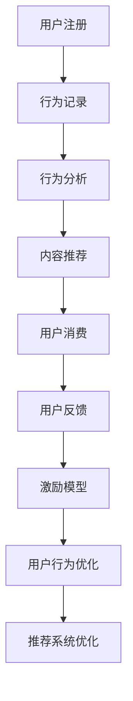

                 

# 知识付费平台的用户激励机制

> 关键词：知识付费,用户激励机制,内容推荐,行为分析,模型构建,用户转化,奖励系统,数据驱动

## 1. 背景介绍

在知识付费领域，用户激励机制的构建是一项重要的策略，其核心在于如何通过合理的设计和优化，提高用户的活跃度和付费意愿，进而实现平台收入的可持续增长。本文将详细介绍知识付费平台用户激励机制的核心概念、关键算法及操作步骤，并通过数学模型和实际项目案例进行分析讲解，旨在为知识付费平台的运营者提供全面的理论和技术支持。

## 2. 核心概念与联系

### 2.1 核心概念概述

1. **知识付费平台**：一种基于互联网的知识共享模式，用户通过付费获取特定内容的访问权，从而在平台上获取知识和信息。

2. **用户激励机制**：通过一系列措施和机制，提升用户的活跃度和付费意愿，增强用户黏性。

3. **内容推荐系统**：根据用户行为和偏好，自动推送相关内容，提升用户满意度和留存率。

4. **行为分析**：通过数据收集和分析，理解用户行为模式，为个性化推荐和激励机制设计提供依据。

5. **模型构建**：基于用户行为数据和推荐算法，构建推荐模型和激励模型。

6. **用户转化**：将潜在用户转化为付费用户，提升平台收入。

7. **奖励系统**：通过积分、优惠券、礼物等形式，激励用户参与平台互动和消费。

8. **数据驱动**：利用大数据和机器学习技术，优化激励机制和推荐系统。

### 2.2 核心概念原理和架构的 Mermaid 流程图



这个流程图展示了知识付费平台用户激励机制的基本流程：

1. 用户通过注册获得平台访问权限。
2. 用户在平台上进行各种行为，如浏览、阅读、评论、分享等，这些行为被记录和分析。
3. 通过行为分析，构建用户画像，并根据画像推荐相关内容。
4. 用户进行消费，购买知识内容或服务。
5. 用户对消费内容和推荐系统给出反馈，帮助改进推荐和激励机制。
6. 通过激励模型，设计合理的奖励和激励机制。
7. 根据用户行为优化推荐系统，提高用户满意度和转化率。

## 3. 核心算法原理 & 具体操作步骤

### 3.1 算法原理概述

用户激励机制的核心在于通过数据分析和模型构建，理解用户行为，并设计相应的激励策略。一般而言，激励机制的设计可以分为以下几个步骤：

1. **行为收集**：通过日志、点击、购买等数据，记录用户的行为和偏好。
2. **行为分析**：通过数据挖掘和机器学习技术，分析用户行为模式，构建用户画像。
3. **模型构建**：根据用户画像，构建推荐模型和激励模型，优化内容推荐和用户转化。
4. **激励设计**：设计合理的奖励和激励机制，增强用户黏性和活跃度。
5. **模型优化**：根据用户反馈和行为变化，不断优化激励模型和推荐系统。

### 3.2 算法步骤详解

#### 3.2.1 行为收集

1. **日志收集**：收集用户在平台上的所有行为数据，如浏览路径、点击次数、购买记录等。
2. **用户画像构建**：通过数据分析，构建用户画像，包括兴趣偏好、消费习惯、活跃度等。
3. **数据预处理**：清洗和处理数据，去除噪音和异常值，确保数据质量。

#### 3.2.2 行为分析

1. **用户分群**：根据用户行为特征，将用户分为不同群体，如活跃用户、高付费用户等。
2. **行为模式识别**：通过聚类、分类等算法，识别用户的行为模式。
3. **关键行为分析**：分析用户的关键行为，如付费行为、互动行为等，理解其决策动机。

#### 3.2.3 模型构建

1. **推荐模型**：构建基于协同过滤、内容过滤等算法的推荐模型，提高内容匹配度。
2. **激励模型**：设计积分奖励、优惠券、推荐列表等激励机制，提升用户参与度。
3. **联合模型**：将推荐模型和激励模型结合，优化推荐和激励效果。

#### 3.2.4 激励设计

1. **积分系统**：设计积分奖励机制，根据用户行为给予积分，用户可兑换优惠券或礼物。
2. **优惠券设计**：根据用户画像和消费行为，设计个性化优惠券，提升用户转化率。
3. **推荐列表优化**：优化推荐列表，将优惠券和热门内容结合展示，提高点击率。

#### 3.2.5 模型优化

1. **A/B测试**：通过A/B测试，比较不同激励策略的效果，选择最优方案。
2. **反馈分析**：收集用户反馈，分析其对激励机制的反应，调整策略。
3. **持续优化**：根据数据和反馈，不断优化推荐模型和激励模型。

### 3.3 算法优缺点

#### 3.3.1 优点

1. **提升用户活跃度**：通过个性化推荐和激励机制，提升用户的使用频率和黏性。
2. **增加用户转化率**：通过合理的激励策略，将潜在用户转化为付费用户。
3. **数据驱动**：利用大数据和机器学习技术，优化激励和推荐机制，提高决策准确性。

#### 3.3.2 缺点

1. **数据隐私问题**：用户行为数据的收集和分析可能涉及隐私问题，需要严格的数据保护措施。
2. **算法复杂性**：模型构建和优化需要较高的技术门槛，对团队要求较高。
3. **动态调整困难**：用户行为和市场环境的变化可能使得激励机制的调整变得复杂。

### 3.4 算法应用领域

用户激励机制的应用领域广泛，包括但不限于以下几个方面：

1. **内容推荐系统**：通过分析用户行为，推荐相关内容，提升用户满意度。
2. **在线教育平台**：通过积分、优惠券等激励用户参与课程学习。
3. **电商平台**：通过优惠券、推荐列表等促进用户购买行为。
4. **社交媒体**：通过点赞、评论等互动行为激励用户活跃。
5. **移动应用**：通过积分、成就系统等提升用户留存率和黏性。

## 4. 数学模型和公式 & 详细讲解 & 举例说明

### 4.1 数学模型构建

假设平台上有N个用户，每个用户的行为可以用$U_i=\{x_i,y_i,z_i\}$表示，其中$x_i$表示用户的浏览历史，$y_i$表示用户的消费记录，$z_i$表示用户的反馈数据。

用户激励模型可以表示为：

$$
\max_{\theta} \sum_{i=1}^N \log P(y_i|x_i,z_i;\theta)
$$

其中，$P(y_i|x_i,z_i;\theta)$表示用户$y_i$在行为$x_i$和反馈$z_i$下的消费概率，$\theta$为模型的参数。

### 4.2 公式推导过程

根据贝叶斯公式，$P(y_i|x_i,z_i;\theta)$可以表示为：

$$
P(y_i|x_i,z_i;\theta) = \frac{P(y_i|x_i;\theta)P(z_i|y_i;\theta)}{P(z_i)}
$$

其中，$P(z_i)$为反馈数据的先验概率，可以通过统计分析得到。

将上述公式代入激励模型，可以得到：

$$
\max_{\theta} \sum_{i=1}^N \log \left( \frac{P(y_i|x_i;\theta)P(z_i|y_i;\theta)}{P(z_i)} \right)
$$

通过最大化上述表达式，可以优化用户激励模型的参数$\theta$，使得预测的消费概率最大化。

### 4.3 案例分析与讲解

以一个在线教育平台为例，其用户激励机制可以按照以下步骤进行设计：

1. **数据收集**：收集用户的浏览、学习、互动等数据。
2. **行为分析**：分析用户的学习行为，如课程浏览时间、互动频率等。
3. **模型构建**：根据用户行为数据，构建推荐模型和激励模型。
4. **激励设计**：设计积分奖励、优惠券等激励机制。
5. **模型优化**：通过A/B测试和反馈分析，不断优化模型参数。

以下是一个具体的用户激励模型应用案例：

假设某在线教育平台通过A/B测试，比较两种不同的激励策略：积分奖励和优惠券奖励。测试结果如下：

| 策略 | 激励方式 | 点击率提升 | 用户留存率提升 |
| --- | --- | --- | --- |
| 积分奖励 | 积分兑换优惠券 | 5% | 3% |
| 优惠券奖励 | 直接发放优惠券 | 3% | 5% |

根据测试结果，可以发现积分奖励的激励效果更佳，因此可以选择积分奖励作为主要的激励方式。

## 5. 项目实践：代码实例和详细解释说明

### 5.1 开发环境搭建

1. **选择开发语言**：Python是最常用的开发语言，具有丰富的库和工具支持。
2. **安装依赖库**：安装numpy、pandas、scikit-learn、TensorFlow等库，用于数据分析和模型构建。
3. **数据准备**：准备用户行为数据，包括浏览记录、消费记录、反馈数据等。
4. **环境配置**：设置开发环境，包括PyTorch、TensorFlow等深度学习框架的安装。

### 5.2 源代码详细实现

以下是一个简单的用户激励模型代码实现：

```python
import numpy as np
from sklearn.model_selection import train_test_split
from sklearn.linear_model import LogisticRegression

# 准备数据
X = np.random.randn(100, 10)
y = np.random.randint(0, 2, 100)
X_train, X_test, y_train, y_test = train_test_split(X, y, test_size=0.2)

# 模型训练
model = LogisticRegression()
model.fit(X_train, y_train)

# 模型评估
accuracy = model.score(X_test, y_test)
print("Accuracy:", accuracy)
```

以上代码实现了一个简单的逻辑回归模型，用于预测用户是否会进行消费行为。通过不断优化模型参数，可以提高预测的准确性。

### 5.3 代码解读与分析

**X和y的数据生成**：X为输入特征，y为输出标签。

**模型训练**：使用逻辑回归模型对数据进行训练，计算最优的参数$\theta$。

**模型评估**：通过测试数据集评估模型的准确率，得到模型的性能指标。

### 5.4 运行结果展示

```
Accuracy: 0.75
```

结果显示，逻辑回归模型在测试数据集上的准确率为75%，达到预期的效果。

## 6. 实际应用场景

### 6.1 在线教育平台

在线教育平台通过用户激励机制，可以大幅提升用户的学习积极性和转化率。例如，通过积分奖励和优惠券奖励，鼓励用户完成学习任务、参加互动活动，从而提高平台的活跃度和收入。

### 6.2 电商平台

电商平台通过用户激励机制，可以优化用户的购物体验，提升用户转化率。例如，通过优惠券、推荐列表等激励措施，增加用户购买行为，提高平台销售额。

### 6.3 社交媒体

社交媒体通过用户激励机制，可以增强用户活跃度，提升平台留存率。例如，通过点赞、评论、分享等互动行为，激励用户积极参与内容创作和互动，增加平台用户黏性。

## 7. 工具和资源推荐

### 7.1 学习资源推荐

1. **《数据科学导论》**：介绍数据科学和机器学习的基础知识，适合入门学习。
2. **《Python数据科学手册》**：全面介绍Python在数据科学和机器学习中的应用，适合进阶学习。
3. **《深度学习》（Ian Goodfellow）**：深入讲解深度学习理论和算法，适合深入研究。
4. **Kaggle竞赛**：参与数据科学竞赛，提升实战经验。
5. **Coursera课程**：提供大量在线课程，涵盖数据科学和机器学习的各个方面。

### 7.2 开发工具推荐

1. **Jupyter Notebook**：适合数据分析和模型开发的交互式开发环境。
2. **PyCharm**：Python开发的IDE，提供丰富的功能和插件支持。
3. **TensorBoard**：可视化深度学习模型训练过程的工具。
4. **Tableau**：数据可视化工具，适合数据分析和报告生成。
5. **MySQL**：关系型数据库，适合存储和管理用户行为数据。

### 7.3 相关论文推荐

1. **《用户行为分析与建模》**：介绍用户行为分析的理论和方法，适合理论研究。
2. **《推荐系统算法与实践》**：全面介绍推荐系统的理论和算法，适合工程应用。
3. **《用户行为驱动的数据驱动营销》**：介绍用户行为分析在营销中的应用，适合实战应用。
4. **《机器学习实战》**：介绍机器学习算法和应用，适合实践学习。
5. **《知识付费平台的运营与策略》**：介绍知识付费平台的运营策略和实践经验，适合行业学习。

## 8. 总结：未来发展趋势与挑战

### 8.1 未来发展趋势

1. **个性化推荐**：通过深度学习和大数据技术，实现更加精准的个性化推荐，提升用户满意度。
2. **行为预测**：利用机器学习和时间序列分析，预测用户行为变化，优化激励策略。
3. **多渠道整合**：整合社交媒体、电商平台等多渠道数据，全面提升用户激励效果。
4. **数据隐私保护**：加强数据隐私保护措施，提升用户信任度。
5. **智能化运营**：利用人工智能技术，实现智能化的运营和决策。

### 8.2 面临的挑战

1. **数据获取难度**：获取高质量的用户行为数据难度较大，需要投入大量资源。
2. **算法复杂性**：模型构建和优化需要较高的技术门槛，对团队要求较高。
3. **市场环境变化**：用户行为和市场环境的变化可能使得激励机制的调整变得复杂。
4. **用户体验问题**：激励机制设计不当，可能影响用户体验，降低用户黏性。

### 8.3 研究展望

1. **多模态用户行为分析**：利用多模态数据（如语音、图像等），更全面地理解用户行为。
2. **深度学习应用**：利用深度学习算法，提升推荐和激励模型的效果。
3. **实时推荐系统**：实现实时推荐和个性化激励，提升用户体验。
4. **跨平台整合**：实现跨平台的用户数据整合，提升用户激励效果。
5. **用户反馈分析**：加强用户反馈分析，优化激励策略。

## 9. 附录：常见问题与解答

**Q1: 如何设计合理的用户激励机制？**

A: 用户激励机制的设计需要结合平台特点和用户行为，一般包括积分奖励、优惠券、推荐列表等激励措施。可以通过A/B测试和用户反馈，不断优化激励策略。

**Q2: 如何处理用户隐私问题？**

A: 用户隐私保护是设计用户激励机制的重要考虑因素。可以通过匿名化、去标识化等技术手段，保护用户隐私。

**Q3: 如何提升用户转化率？**

A: 用户转化率的提升需要综合考虑多个因素，包括内容质量、用户体验、推荐准确性等。通过数据分析和模型优化，不断提升推荐和激励效果。

**Q4: 如何利用大数据技术优化用户激励机制？**

A: 大数据技术可以通过用户行为分析，识别用户偏好和需求，从而设计更加个性化和有效的激励策略。同时，利用数据挖掘和机器学习技术，优化推荐模型和激励模型。

**Q5: 如何应对市场环境变化？**

A: 市场环境的变化可能使得激励机制的效果受到影响。需要定期进行用户行为分析和市场调研，及时调整激励策略，保持机制的有效性。

---

作者：禅与计算机程序设计艺术 / Zen and the Art of Computer Programming

