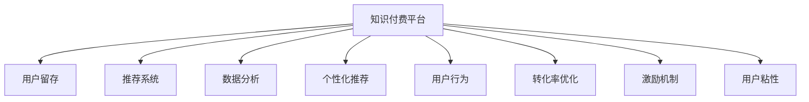

                 

# 知识付费平台的用户留存策略

> 关键词：知识付费, 用户留存, 推荐系统, 数据分析, 用户行为, 转化率优化, 激励机制, 个性化推荐

## 1. 背景介绍

随着互联网的普及和智能手机的普及，知识付费平台已经成为信息获取的重要渠道之一。但随着市场竞争的加剧，用户流失问题日益严重。如何提升用户留存率，构建健康可持续的商业模式，是知识付费平台面临的重大挑战。本文将从用户体验、个性化推荐、数据分析、激励机制等多个方面，系统阐述知识付费平台的用户留存策略。

## 2. 核心概念与联系

### 2.1 核心概念概述

为更好地理解知识付费平台的用户留存策略，本节将介绍几个密切相关的核心概念：

- **知识付费平台**：提供各类有偿知识资源服务的平台，如得到、喜马拉雅、知乎live等。
- **用户留存**：指用户在使用知识付费平台一段时间后，持续使用并回访该平台的比例。
- **推荐系统**：根据用户行为和偏好，推荐合适的内容，提升用户体验和满意度。
- **数据分析**：通过收集和分析用户行为数据，了解用户需求和行为模式，辅助产品改进和运营决策。
- **个性化推荐**：利用机器学习和深度学习技术，根据用户的历史行为和兴趣，提供量身定制的内容推荐。
- **用户行为**：用户在平台上的点击、浏览、购买、评论等操作行为，反映用户的兴趣和需求。
- **转化率优化**：通过改进用户路径、优化产品设计、增加促销手段等方式，提高用户购买和付费转化率。
- **激励机制**：通过积分、优惠券、VIP会员等方式，激励用户持续使用和付费。
- **用户粘性**：用户对平台的黏性和依赖度，体现平台的用户留存情况。

这些核心概念之间的逻辑关系可以通过以下Mermaid流程图来展示：



这个流程图展示了一个知识付费平台的核心组件及其之间的关系：

1. 知识付费平台基于推荐系统、数据分析、个性化推荐等技术手段，提升用户体验，增加用户粘性。
2. 用户行为分析揭示用户需求和兴趣，优化产品设计，提高转化率。
3. 激励机制通过积分、优惠券等手段，进一步促进用户购买和付费。
4. 用户粘性体现在用户留存率的提升，是知识付费平台运营成功的关键指标。

## 3. 核心算法原理 & 具体操作步骤
### 3.1 算法原理概述

知识付费平台的用户留存策略，本质上是一个多维度协同优化的过程。其核心思想是通过改进用户体验、优化内容推荐、分析用户行为、设置激励机制，最大化提升用户留存率。

形式化地，假设知识付费平台的总用户数为 $U$，经过一段时间后的留存用户数为 $R$。则目标函数为：

$$
\max_{X_1, X_2, X_3, X_4, X_5} \frac{R}{U}
$$

其中 $X_1$ 为推荐系统优化程度，$X_2$ 为数据分析深度，$X_3$ 为个性化推荐精准度，$X_4$ 为转化率优化效果，$X_5$ 为激励机制强度。

通过对以上各维度变量的综合优化，可以最大化提升用户留存率。

### 3.2 算法步骤详解

基于以上原理，知识付费平台的用户留存策略一般包括以下几个关键步骤：

**Step 1: 用户行为分析与建模**

- 收集用户的行为数据，包括但不限于浏览记录、购买记录、评论记录等。
- 使用机器学习算法，如协同过滤、序列建模、深度学习等，建立用户行为模型。
- 提取用户兴趣特征，如内容主题、作者偏好、浏览时长等，为个性化推荐提供依据。

**Step 2: 个性化推荐系统构建**

- 根据用户行为模型，构建个性化推荐算法。
- 选择合适的推荐算法，如协同过滤、基于内容的推荐、深度学习推荐等。
- 引入多臂老虎机（Multi-Armed Bandit）等策略，动态调整推荐内容，提升用户体验。

**Step 3: 用户路径分析与优化**

- 分析用户在平台上的浏览路径，识别关键节点和瓶颈。
- 设计更流畅、直观的产品界面和导航结构，优化用户路径。
- 增加搜索和筛选功能，使用户能更快捷地找到所需内容。

**Step 4: 转化率优化**

- 分析用户流失的原因，识别关键流失环节。
- 优化产品设计，减少流失环节，提高用户转化率。
- 引入促销手段，如限时优惠、用户裂变、积分体系等，促进用户购买和付费。

**Step 5: 激励机制设计**

- 设计多样化的激励机制，如积分体系、优惠券、VIP会员等。
- 通过数据分析，评估激励机制对用户留存的影响。
- 动态调整激励机制，持续吸引用户回归。

**Step 6: 用户反馈收集与分析**

- 收集用户反馈，了解用户需求和痛点。
- 定期对用户反馈进行分析，进行产品改进和优化。
- 根据用户反馈，及时调整产品策略和运营手段，提升用户满意度。

### 3.3 算法优缺点

知识付费平台的用户留存策略具有以下优点：

1. 综合优化提升用户留存率。通过多维度协同优化，可以有效提升用户留存率。
2. 提高用户转化率。优化用户路径和产品设计，提升用户转化率。
3. 提升个性化推荐精准度。个性化推荐系统可以显著提高用户满意度。
4. 增强用户粘性。激励机制和用户反馈可以增强用户粘性，增加回访次数。

同时，该策略也存在一定的局限性：

1. 数据依赖性高。依赖于用户行为数据的收集和分析，数据质量直接影响策略效果。
2. 技术门槛高。推荐系统和数据分析涉及复杂的技术，需要高水平的技术团队支持。
3. 用户隐私问题。数据收集和使用可能涉及用户隐私问题，需要严格遵守相关法规。
4. 策略执行成本高。用户路径优化、个性化推荐等策略的执行需要大量资源投入。
5. 策略效果受限。策略效果受限于用户行为和产品设计的复杂性，难以达到理想效果。

尽管存在这些局限性，但就目前而言，多维度协同优化的策略仍是知识付费平台提升用户留存率的最主流范式。未来相关研究的重点在于如何进一步降低数据收集和分析的成本，提高个性化推荐和转化率优化的效果，同时兼顾用户隐私和策略执行成本等因素。

### 3.4 算法应用领域

知识付费平台的用户留存策略，已在各类知识付费应用中得到了广泛应用，例如：

- 音频类平台：如喜马拉雅、荔枝等，通过个性化推荐和VIP会员激励，提升用户留存率。
- 视频类平台：如爱奇艺、腾讯视频等，通过数据分析和用户路径优化，增强用户体验和黏性。
- 在线教育平台：如新东方在线、Coursera等，通过个性化推荐和积分体系，提升用户学习效果和满意度。
- 内容类平台：如知乎、豆瓣等，通过协同过滤推荐和用户行为分析，优化内容匹配和用户体验。

除了上述这些经典应用外，知识付费平台的用户留存策略还被创新性地应用到更多场景中，如金融知识付费、医疗健康教育、法律知识付费等，为不同行业用户提供个性化、高品质的知识服务。

## 4. 数学模型和公式 & 详细讲解  
### 4.1 数学模型构建

本节将使用数学语言对知识付费平台的用户留存策略进行更加严格的刻画。

记知识付费平台的用户总数为 $U$，经过 $T$ 时间后留存的用户数为 $R$。假设用户在 $t$ 时刻从平台流失的概率为 $P(t)$，则平台在第 $T$ 时间的用户留存率可以表示为：

$$
R = U \times \prod_{t=1}^{T} (1 - P(t))
$$

为了最大化用户留存率，我们需要最小化用户流失概率 $P(t)$。根据上述模型，我们可以定义损失函数 $\mathcal{L}$，并使用优化算法最小化该损失函数：

$$
\min_{X_1, X_2, X_3, X_4, X_5} \mathcal{L}(P(t))
$$

其中 $X_1$ 为推荐系统优化程度，$X_2$ 为数据分析深度，$X_3$ 为个性化推荐精准度，$X_4$ 为转化率优化效果，$X_5$ 为激励机制强度。

### 4.2 公式推导过程

以下我们以用户路径优化为例，推导模型中的关键公式。

假设用户在平台上的浏览路径为 $\langle A_1, A_2, \ldots, A_n \rangle$，其中 $A_i$ 为用户在第 $i$ 次浏览的页面。为了优化用户路径，我们需要计算不同路径下的用户流失概率，并最小化该概率。

设用户在第 $i$ 次浏览时的流失概率为 $P_i$，则整个路径的流失概率为：

$$
P(\langle A_1, A_2, \ldots, A_n \rangle) = \prod_{i=1}^{n} P_i
$$

为了最小化流失概率，我们引入路径优化模型：

$$
\min_{A_1, A_2, \ldots, A_n} \sum_{i=1}^{n} P_i
$$

其中 $P_i$ 为用户在第 $i$ 次浏览时的流失概率。

通过优化路径中的页面选择，我们可以最小化整个路径的流失概率，从而提高用户留存率。

### 4.3 案例分析与讲解

以在线教育平台为例，分析用户路径优化如何提升用户留存率。

在线教育平台常见的用户路径包括：

1. 登录页面：用户输入账号密码，进入学习界面。
2. 课程选择：用户浏览课程目录，选择感兴趣的课程。
3. 课程学习：用户学习课程内容，完成作业和测验。
4. 反馈评价：用户对课程内容进行评价和反馈。

通过对用户路径中的关键节点进行分析，可以发现以下问题：

1. 登录页面：用户账号输入频繁，容易因操作繁琐而流失。
2. 课程选择：课程目录复杂，用户难以快速找到感兴趣的内容。
3. 课程学习：课程内容枯燥，用户难以持续学习。
4. 反馈评价：用户反馈渠道不畅，缺乏互动和反馈机制。

针对以上问题，可以采取以下优化措施：

1. 简化登录流程，提供自动登录、快捷登录等方式，减少用户输入操作。
2. 精简课程目录，根据用户兴趣推荐相关课程，缩短用户浏览路径。
3. 引入互动和多媒体元素，增强课程趣味性，提升学习效果。
4. 增加用户反馈渠道，及时回应用户评论和建议，增强用户满意度。

通过优化用户路径，可以减少用户流失，提高用户留存率。

## 5. 项目实践：代码实例和详细解释说明
### 5.1 开发环境搭建

在进行用户留存策略实践前，我们需要准备好开发环境。以下是使用Python进行PyTorch开发的环境配置流程：

1. 安装Anaconda：从官网下载并安装Anaconda，用于创建独立的Python环境。

2. 创建并激活虚拟环境：
```bash
conda create -n pytorch-env python=3.8 
conda activate pytorch-env
```

3. 安装PyTorch：根据CUDA版本，从官网获取对应的安装命令。例如：
```bash
conda install pytorch torchvision torchaudio cudatoolkit=11.1 -c pytorch -c conda-forge
```

4. 安装TensorFlow：
```bash
pip install tensorflow
```

5. 安装Scikit-learn、Pandas、Numpy等工具包：
```bash
pip install scikit-learn pandas numpy
```

完成上述步骤后，即可在`pytorch-env`环境中开始用户留存策略的开发实践。

### 5.2 源代码详细实现

下面我们以推荐系统为例，给出使用PyTorch构建个性化推荐模型的代码实现。

首先，定义推荐系统的数据处理函数：

```python
import numpy as np
from sklearn.model_selection import train_test_split

# 定义训练集和测试集
train_data, test_data = train_test_split(data, test_size=0.2, random_state=42)
```

然后，定义模型和损失函数：

```python
from torch import nn
import torch.nn.functional as F

class Recommender(nn.Module):
    def __init__(self, num_users, num_items, num_factors):
        super(Recommender, self).__init__()
        self.W1 = nn.Embedding(num_users, num_factors)
        self.W2 = nn.Embedding(num_items, num_factors)
        self.W3 = nn.Linear(num_factors * 2, 1)
    
    def forward(self, user, item):
        u = self.W1(user)
        i = self.W2(item)
        x = torch.cat([u, i], dim=1)
        x = self.W3(x)
        return x

# 定义损失函数
criterion = nn.MSELoss()
```

接着，定义训练和评估函数：

```python
from torch.utils.data import DataLoader
from tqdm import tqdm
from sklearn.metrics import mean_squared_error

def train_epoch(model, optimizer, data_loader):
    model.train()
    running_loss = 0.0
    for batch in tqdm(data_loader, desc='Training'):
        optimizer.zero_grad()
        user, item, rating = batch
        output = model(user, item)
        loss = criterion(output, rating)
        loss.backward()
        optimizer.step()
        running_loss += loss.item()
    return running_loss / len(data_loader)

def evaluate(model, data_loader):
    model.eval()
    running_loss = 0.0
    running_mse = 0.0
    for batch in tqdm(data_loader, desc='Evaluating'):
        user, item, rating = batch
        output = model(user, item)
        loss = criterion(output, rating)
        running_loss += loss.item()
        running_mse += mean_squared_error(rating, output).item()
    return running_loss / len(data_loader), running_mse / len(data_loader)
```

最后，启动训练流程并在测试集上评估：

```python
epochs = 10
batch_size = 256
learning_rate = 0.01

model = Recommender(num_users, num_items, num_factors)
optimizer = torch.optim.Adam(model.parameters(), lr=learning_rate)

for epoch in range(epochs):
    train_loss, train_mse = train_epoch(model, optimizer, train_loader)
    val_loss, val_mse = evaluate(model, val_loader)
    print(f'Epoch {epoch+1}, train loss: {train_loss:.3f}, train mse: {train_mse:.3f}, val loss: {val_loss:.3f}, val mse: {val_mse:.3f}')
```

以上就是使用PyTorch对推荐系统进行个性化推荐模型的代码实现。可以看到，通过简单的代码实现，即可构建出基础的个性化推荐系统。

### 5.3 代码解读与分析

让我们再详细解读一下关键代码的实现细节：

**Recommender类**：
- `__init__`方法：初始化用户和物品的嵌入矩阵，以及线性层。
- `forward`方法：前向传播，计算推荐输出。

**损失函数**：
- 使用均方误差损失函数，用于衡量模型预测的准确性。

**训练和评估函数**：
- 使用PyTorch的DataLoader对数据集进行批次化加载，供模型训练和推理使用。
- 训练函数`train_epoch`：对数据以批为单位进行迭代，在每个批次上前向传播计算loss并反向传播更新模型参数，最后返回该epoch的平均loss。
- 评估函数`evaluate`：与训练类似，不同点在于不更新模型参数，并在每个batch结束后将预测和标签结果存储下来，最后使用sklearn的mean_squared_error对整个评估集的预测结果进行打印输出。

**训练流程**：
- 定义总的epoch数和batch size，开始循环迭代
- 每个epoch内，先在训练集上训练，输出平均loss和mse
- 在验证集上评估，输出平均loss和mse
- 重复上述步骤直至满足预设的迭代轮数。

可以看到，PyTorch配合Scikit-learn等工具，使得推荐系统的代码实现变得简洁高效。开发者可以将更多精力放在数据处理、模型改进等高层逻辑上，而不必过多关注底层的实现细节。

当然，工业级的系统实现还需考虑更多因素，如模型的保存和部署、超参数的自动搜索、更灵活的任务适配层等。但核心的个性化推荐模型基本与此类似。

## 6. 实际应用场景
### 6.1 在线教育平台

在线教育平台的用户留存策略，可以显著提升平台的运营效果。通过个性化推荐系统，在线教育平台可以为每个用户推荐感兴趣的内容和课程，增强学习效果和用户体验。

具体而言，平台可以根据用户的学习历史和行为，推荐相关课程、习题和资源。例如，对于用户浏览过的课程，可以推荐与其相关的其他课程或教师资源；对于用户的考试和作业成绩，可以推荐适合的习题和资料。通过个性化推荐，平台可以显著提高用户的学习兴趣和粘性，提升用户留存率。

### 6.2 金融服务平台

金融服务平台的用户留存策略，对于金融机构的业务发展至关重要。通过推荐系统和数据分析，金融平台可以提升用户对平台的信任度和依赖度，提高用户留存率。

例如，金融平台可以为用户推荐适合的理财产品和金融服务，根据用户的投资偏好和风险承受能力，推荐个性化的理财方案和投资组合。平台还可以通过数据分析，了解用户的金融需求和行为模式，提供定制化的金融服务，增强用户满意度。通过个性化推荐和数据分析，金融平台可以显著提高用户留存率，提升平台的业务收入和市场竞争力。

### 6.3 内容聚合平台

内容聚合平台的用户留存策略，可以显著提升用户的浏览和互动效果。通过推荐系统和数据分析，内容平台可以为每个用户推荐感兴趣的内容和资源，增强用户的浏览和互动体验。

例如，内容平台可以根据用户的浏览历史和评论记录，推荐相关的主题、作者和文章。对于用户感兴趣的内容，可以推荐与其相关的其他内容或作者。通过个性化推荐，内容平台可以显著提高用户的浏览量和互动率，提升用户留存率。

### 6.4 未来应用展望

随着推荐系统和数据分析技术的不断发展，基于用户留存策略的应用场景将更加广泛。

在智慧医疗领域，基于用户留存策略的医疗问答、病历分析、药物推荐等应用，将提升医疗服务的智能化水平，辅助医生诊疗，加速新药开发进程。

在智能教育领域，基于用户留存策略的学习推荐、作业批改、知识推荐等应用，将因材施教，促进教育公平，提高教学质量。

在智慧城市治理中，基于用户留存策略的城市事件监测、舆情分析、应急指挥等应用，将提高城市管理的自动化和智能化水平，构建更安全、高效的未来城市。

此外，在企业生产、社会治理、文娱传媒等众多领域，基于用户留存策略的人工智能应用也将不断涌现，为各行各业带来变革性影响。相信随着技术的日益成熟，用户留存策略必将在构建人机协同的智能时代中扮演越来越重要的角色。

## 7. 工具和资源推荐
### 7.1 学习资源推荐

为了帮助开发者系统掌握知识付费平台的用户留存策略的理论基础和实践技巧，这里推荐一些优质的学习资源：

1. 《推荐系统原理与实现》系列博文：由推荐系统专家撰写，深入浅出地介绍了推荐系统的原理、算法和实现方法。

2. 《深度学习与推荐系统》课程：由清华大学开设的推荐系统课程，涵盖推荐系统的理论基础和实践方法，适合初学者和进阶者学习。

3. 《推荐系统实战》书籍：介绍推荐系统的主要算法和实际应用案例，适合深入理解推荐系统的开发者阅读。

4. 《Python推荐系统实战》书籍：由知乎推荐系统团队编写，详细介绍了推荐系统的数据处理、模型构建和优化方法，适合实践开发人员。

5. Kaggle推荐系统竞赛：通过参加推荐系统竞赛，实践推荐系统算法和优化方法，积累实战经验。

通过对这些资源的学习实践，相信你一定能够快速掌握知识付费平台的用户留存策略，并用于解决实际的NLP问题。

### 7.2 开发工具推荐

高效的开发离不开优秀的工具支持。以下是几款用于知识付费平台用户留存策略开发的常用工具：

1. PyTorch：基于Python的开源深度学习框架，灵活动态的计算图，适合快速迭代研究。大部分推荐系统和数据分析任务都有PyTorch版本的实现。

2. TensorFlow：由Google主导开发的开源深度学习框架，生产部署方便，适合大规模工程应用。同样有丰富的推荐系统和数据分析资源。

3. Scikit-learn：Python数据分析和机器学习库，提供丰富的数据分析和模型训练工具。适合推荐系统的数据预处理和特征工程。

4. Pandas：Python数据处理库，提供高效的数据读取、处理和分析功能。适合数据清洗和特征工程。

5. NumPy：Python数值计算库，提供高效的数组和矩阵运算功能。适合数值计算和模型训练。

6. Jupyter Notebook：Python编程环境，提供丰富的交互式编程和数据可视化功能。适合快速原型开发和实验验证。

合理利用这些工具，可以显著提升推荐系统和数据分析任务的开发效率，加快创新迭代的步伐。

### 7.3 相关论文推荐

知识付费平台的用户留存策略，受到了学界的广泛关注。以下是几篇奠基性的相关论文，推荐阅读：

1. "A Factorization Approach to Recommender Systems"：提出协同过滤推荐算法，成为推荐系统的主流算法之一。

2. "Item-based Collaborative Filtering Recommendation"：提出基于物品的协同过滤算法，进一步提升推荐系统的准确性。

3. "Deep Recommendation via Cross-Domain Training"：提出跨领域训练方法，通过迁移学习提升推荐系统的泛化能力。

4. "Personalized PageRank for Recommendation Systems"：提出基于PageRank的个性化推荐算法，提高推荐系统的多样性和准确性。

5. "Click-Through Rate Prediction and Recommendation"：提出CTR预测算法，通过预测用户点击行为提升推荐系统的效果。

6. "Reinforcement Learning for Dynamic Recommendation Systems"：提出强化学习算法，通过动态调整推荐策略提升推荐系统的实时性。

这些论文代表了大语言模型微调技术的发展脉络。通过学习这些前沿成果，可以帮助研究者把握学科前进方向，激发更多的创新灵感。

## 8. 总结：未来发展趋势与挑战

### 8.1 总结

本文对知识付费平台的用户留存策略进行了全面系统的介绍。首先阐述了知识付费平台用户留存策略的研究背景和意义，明确了个性化推荐、数据分析、激励机制等关键因素对用户留存率提升的影响。其次，从原理到实践，详细讲解了推荐系统的构建和优化方法，给出了推荐系统代码实现的完整示例。同时，本文还广泛探讨了用户留存策略在在线教育、金融服务、内容聚合等多个行业领域的应用前景，展示了用户留存策略的广阔应用空间。

通过本文的系统梳理，可以看到，用户留存策略在知识付费平台中扮演了重要角色。用户留存率的提升，不仅提升了平台的业务收入和市场竞争力，还显著增强了用户体验和满意度。未来，随着推荐系统和数据分析技术的不断发展，基于用户留存策略的应用场景将更加广泛，为各行各业带来变革性影响。

### 8.2 未来发展趋势

展望未来，知识付费平台的用户留存策略将呈现以下几个发展趋势：

1. 推荐系统技术日趋成熟。推荐系统技术不断发展，将带来更精准、实时的推荐效果，提升用户留存率。
2. 多维度协同优化。通过推荐系统、数据分析、激励机制等综合优化，可以显著提升用户留存率。
3. 引入更多外部数据。利用外部数据如用户社交网络、行为数据等，进一步提升推荐精准度。
4. 实时动态调整。通过实时数据分析，动态调整推荐策略，提升用户留存率。
5. 个性化推荐精准度提高。随着推荐算法和模型的发展，推荐系统将更加精准，提升用户满意度。
6. 自动化运营。通过自动化流程和智能工具，降低人工运营成本，提高运营效率。
7. 用户体验提升。通过界面优化、功能增强等手段，提升用户体验，增强用户粘性。

以上趋势凸显了知识付费平台用户留存策略的广阔前景。这些方向的探索发展，必将进一步提升用户留存率，构建健康可持续的商业模式，推动知识付费平台的持续发展。

### 8.3 面临的挑战

尽管知识付费平台的用户留存策略已经取得了显著成效，但在迈向更加智能化、普适化应用的过程中，仍面临诸多挑战：

1. 数据隐私问题。用户数据收集和使用可能涉及隐私问题，需要严格遵守相关法规。
2. 数据质量影响。数据质量直接影响推荐系统的效果，数据收集和处理难度较大。
3. 模型复杂度。推荐系统模型复杂，需要高水平的技术团队支持。
4. 成本投入高。数据收集、模型训练、系统维护等成本较高，需要长期投入。
5. 策略执行困难。策略执行需要多部门协同，难以快速落地实施。

尽管存在这些挑战，但通过持续的技术创新和战略优化，相信知识付费平台的用户留存策略将不断提升，为平台带来更大的商业价值和用户满意度。

### 8.4 研究展望

面对知识付费平台用户留存策略所面临的挑战，未来的研究需要在以下几个方面寻求新的突破：

1. 探索更高效的数据收集和处理方法。通过技术创新，降低数据收集和处理的难度，提高数据质量。
2. 开发更高效的推荐系统模型。引入深度学习、强化学习等技术，提高推荐系统的精准度和实时性。
3. 引入更多外部数据。通过与第三方平台合作，引入用户社交网络、行为数据等外部数据，提升推荐系统的效果。
4. 优化激励机制和用户反馈。通过数据分析，设计更有效的激励机制和用户反馈系统，提升用户满意度。
5. 引入更多新技术。引入自然语言处理、图像识别等新技术，提升推荐系统的多样性和精准度。
6. 优化用户体验。通过界面优化、功能增强等手段，提升用户体验，增强用户粘性。

这些研究方向的探索，必将引领知识付费平台用户留存策略迈向更高的台阶，为构建人机协同的智能时代中，推动知识付费平台的持续发展。只有勇于创新、敢于突破，才能不断拓展知识付费平台的用户留存策略的边界，让智能技术更好地造福用户和社会。

## 9. 附录：常见问题与解答

**Q1：如何衡量用户留存率？**

A: 用户留存率可以通过以下公式计算：

$$
用户留存率 = \frac{最近一定时间内留存的活跃用户数}{总用户数}
$$

其中，最近一定时间通常为7天、30天或90天。可以通过统计用户登录、浏览、付费等行为，计算用户留存率。

**Q2：用户留存策略的核心因素有哪些？**

A: 用户留存策略的核心因素包括：

1. 个性化推荐：通过推荐系统，提升用户满意度和体验。
2. 数据分析：通过数据分析，了解用户需求和行为，优化产品设计和运营策略。
3. 激励机制：通过激励机制，增强用户粘性和依赖度。
4. 用户体验：通过界面优化、功能增强等手段，提升用户体验。
5. 用户反馈：通过用户反馈，了解用户痛点和需求，改进产品和服务。

**Q3：推荐系统的推荐算法有哪些？**

A: 推荐系统的推荐算法主要包括以下几种：

1. 协同过滤算法：基于用户历史行为和物品相似性，推荐相似的物品。
2. 基于内容的推荐算法：基于物品的特征和用户偏好，推荐相关物品。
3. 深度学习推荐算法：通过神经网络模型，预测用户行为，提升推荐效果。
4. 矩阵分解算法：通过矩阵分解，降低推荐系统的复杂度，提高推荐效果。

**Q4：如何优化用户路径？**

A: 优化用户路径可以从以下方面入手：

1. 简化页面跳转：减少用户的操作步骤，简化页面跳转。
2. 增加引导提示：增加引导提示，帮助用户快速找到所需内容。
3. 优化内容结构：优化内容结构，提高内容的可读性和可理解性。
4. 增加互动元素：增加互动元素，提升用户参与度。
5. 优化搜索功能：优化搜索功能，提高搜索的准确性和速度。

**Q5：激励机制的设计需要注意哪些问题？**

A: 激励机制的设计需要注意以下问题：

1. 多样性：设计多种激励方式，满足不同用户的需求。
2. 可获取性：激励机制应易于获取，增强用户的激励感和信任度。
3. 公平性：激励机制应公平公正，避免对某些用户产生不公平的影响。
4. 时效性：激励机制应有明确的有效期和限制，避免用户滥用。
5. 透明度：激励机制应透明公开，增强用户信任度。

通过回答这些问题，相信你一定能够更好地理解和掌握知识付费平台的用户留存策略，并用于解决实际的NLP问题。

---

作者：禅与计算机程序设计艺术 / Zen and the Art of Computer Programming

