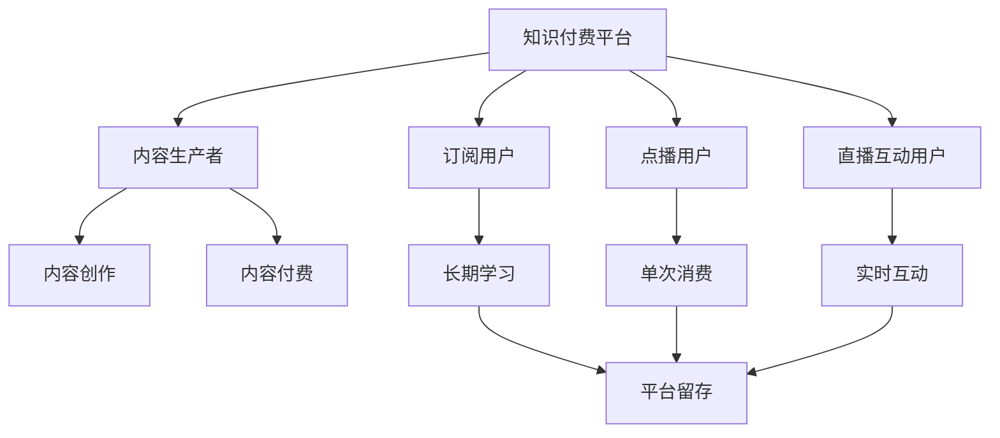

                 

## 1. 背景介绍

### 1.1 问题由来
随着互联网和移动互联网的普及，人们获取知识的方式发生了翻天覆地的变化。从传统的书籍、课程、培训，到如今的海量在线内容，人们可以随时随地学习，获取知识。但同时，免费的互联网内容也带来了一些问题：内容质量参差不齐，用户体验不够优质，难以针对个体需求定制学习内容。因此，知识付费应运而生。

知识付费，即通过付费的方式获取高质量、个性化、及时更新的内容。在知识付费平台上，用户可以根据自身需求选择感兴趣的课程、书籍、文章等内容，以节省时间、提升效率。对于知识生产者来说，通过付费模式可以激励优质内容的生产，提升市场竞争力。

在知识付费时代，程序员这一群体逐渐成为重要用户。传统的编程学习资料往往结构化程度不高、内容深度不够，而在线课程、技术博客等形式的知识付费内容则更为系统和丰富。程序员需要具备持续学习的习惯，不断掌握最新的编程技能和工具，才能在职业生涯中不断进步。知识付费为程序员提供了更多的学习渠道和资源，帮助他们更好地适应技术发展。

### 1.2 问题核心关键点
对于程序员来说，创业不仅仅是技术上的挑战，更是思维上的转变。以下是知识付费时代程序员创业的几个核心关键点：

1. **需求导向**：创业者需要深刻理解用户需求，通过调研和市场分析，确定目标用户群体和他们的痛点。
2. **产品设计**：根据用户需求设计产品，强调产品的易用性和用户体验，提供个性化的学习路径和内容推荐。
3. **技术实施**：利用最新的技术栈和工具，开发高效、稳定、可扩展的产品，如微服务架构、云计算等。
4. **商业运营**：通过合理的商业模式和商业策略，实现产品变现和用户增长。

### 1.3 问题研究意义
本文将系统介绍知识付费时代程序员的创业思维。通过分析现有的知识付费平台和技术，探讨程序员如何在知识付费领域创业，不仅有助于创业者提升自身能力，还能为市场提供更多高质量、具有竞争力的产品和服务。

## 2. 核心概念与联系

### 2.1 核心概念概述

为了更好地理解程序员在知识付费领域的创业思维，我们首先介绍几个关键概念：

- **知识付费平台**：提供知识内容订阅和付费服务的企业或平台，如得到、掘金、知乎Live等。
- **内容生产者**：创建和提供知识内容的专业人士，如程序员、作家、讲师等。
- **订阅模式**：用户通过定期支付费用，获取平台上的知识内容，如按月、按年订阅。
- **点播模式**：用户可以购买单次内容访问权限，如单次付费购买文章或课程。
- **直播互动**：知识生产者通过直播的方式，与用户进行实时互动和交流。

这些概念构成了知识付费生态的基础，帮助理解整个市场和生态系统。

### 2.2 核心概念联系

知识付费生态系统由多个核心组件构成，并通过它们之间的协同作用形成完整的价值链。以下是一个Mermaid流程图，展示这些组件之间的联系：



### 2.3 核心概念案例

以得到平台为例，它是目前市面上最知名的知识付费平台之一。得到的商业模式主要由以下几个部分构成：

1. **内容创作**：平台邀请各行各业的专业人士，通过付费专栏、音频课程、图书等形式提供知识内容。
2. **内容付费**：用户可以通过订阅专栏、购买课程、阅读图书等形式，获取高质量的知识内容。
3. **订阅用户**：平台有大量的长期学习用户，通过订阅专栏或课程，持续获取知识内容。
4. **直播互动**：部分内容生产者通过直播的形式，与用户进行实时互动，提升用户体验。

得到的商业成功，很大程度上依赖于其内容质量和用户体验，以及平台的商业策略。

## 3. 核心算法原理 & 具体操作步骤

### 3.1 算法原理概述

在知识付费领域，创业的关键在于如何高效地提供有价值的内容，并满足用户的需求。核心算法原理包括：

- **推荐算法**：根据用户历史行为和兴趣，推荐个性化的内容，提升用户体验。
- **内容优化**：通过对内容进行分析和优化，提升内容的可读性和吸引力。
- **用户留存**：通过合理的用户激励和互动策略，提高用户的长期留存率。

这些算法原理构成了知识付费平台的核心竞争力。

### 3.2 算法步骤详解

以下是知识付费平台推荐算法的详细步骤：

1. **数据采集**：收集用户的行为数据，如浏览历史、购买记录、评分反馈等。
2. **特征工程**：对用户数据和内容数据进行特征提取，如用户兴趣标签、内容关键词、评分等。
3. **模型训练**：选择合适的推荐算法模型，如协同过滤、基于内容的推荐、混合推荐等，训练推荐模型。
4. **内容推荐**：根据用户的实时行为和特征，动态生成推荐内容。
5. **效果评估**：通过A/B测试等手段，评估推荐算法的效果，不断优化推荐策略。

### 3.3 算法优缺点

推荐算法有以下优点：

- **个性化**：根据用户兴趣和行为，提供个性化的推荐内容。
- **效率高**：通过算法模型，可以高效生成推荐内容，节省人工成本。
- **动态性**：推荐内容可以实时更新，适应用户需求变化。

但同时也存在一些缺点：

- **数据依赖**：算法效果依赖于用户数据和内容数据的完整性和准确性。
- **冷启动问题**：新用户或新内容往往面临冷启动问题，难以获取准确推荐。
- **模型复杂度**：复杂的推荐模型可能带来计算和存储负担。

### 3.4 算法应用领域

推荐算法在知识付费领域有着广泛的应用，具体如下：

- **内容推荐**：为用户推荐个性化的课程、文章、图书等。
- **社区推荐**：为用户推荐相关社区和讨论，促进社区活跃度。
- **用户推荐**：为内容生产者推荐目标用户群体，提升内容曝光率。

## 4. 数学模型和公式 & 详细讲解 & 举例说明

### 4.1 数学模型构建

在知识付费领域，推荐算法的数学模型主要包括以下几种：

- **协同过滤**：基于用户和物品的相似度进行推荐，公式为：

$$
\text{Similarity}(u,i) = \frac{\sum_{j=1}^{n} r_{ui}r_{uj}}{\sqrt{\sum_{j=1}^{n} r_{uj}^2}\sqrt{\sum_{j=1}^{n} r_{ui}^2}}
$$

- **基于内容的推荐**：根据内容特征进行推荐，公式为：

$$
\text{Recommendation}(u,i) = \sum_{j=1}^{n} \alpha_j \text{Features}(i)_j \text{Features}(u)_j
$$

其中 $\alpha_j$ 为特征权重，$\text{Features}(i)_j$ 和 $\text{Features}(u)_j$ 为物品和用户的特征向量。

### 4.2 公式推导过程

协同过滤算法的推导过程如下：

1. **相似度计算**：计算用户 $u$ 和物品 $i$ 之间的相似度，公式为：

$$
\text{Similarity}(u,i) = \frac{\sum_{j=1}^{n} r_{ui}r_{uj}}{\sqrt{\sum_{j=1}^{n} r_{uj}^2}\sqrt{\sum_{j=1}^{n} r_{ui}^2}}
$$

其中 $r_{ui}$ 和 $r_{uj}$ 为物品 $i$ 和 $j$ 的评分，$n$ 为用户和物品的评分数量。

2. **推荐计算**：计算物品 $i$ 对用户 $u$ 的推荐分数，公式为：

$$
\text{Recommendation}(u,i) = \sum_{j=1}^{n} \text{Similarity}(u,j) \text{Score}(j,i)
$$

其中 $\text{Score}(j,i)$ 为物品 $j$ 和 $i$ 之间的评分。

基于内容的推荐算法的推导过程如下：

1. **特征提取**：对物品 $i$ 和用户 $u$ 进行特征提取，得到特征向量 $\text{Features}(i)$ 和 $\text{Features}(u)$。
2. **相似度计算**：计算物品 $i$ 和用户 $u$ 之间的相似度，公式为：

$$
\text{Similarity}(u,i) = \sum_{j=1}^{n} \alpha_j \text{Features}(i)_j \text{Features}(u)_j
$$

其中 $\alpha_j$ 为特征权重，$\text{Features}(i)_j$ 和 $\text{Features}(u)_j$ 为物品和用户的特征向量。
3. **推荐计算**：计算物品 $i$ 对用户 $u$ 的推荐分数，公式为：

$$
\text{Recommendation}(u,i) = \sum_{j=1}^{n} \text{Similarity}(u,j) \text{Score}(j,i)
$$

其中 $\text{Score}(j,i)$ 为物品 $j$ 和 $i$ 之间的评分。

### 4.3 案例分析与讲解

以YouTube推荐算法为例，它是基于协同过滤和内容推荐的混合推荐算法。在YouTube上，用户可以通过点击、观看、点赞等行为生成评分数据，平台通过这些数据训练推荐模型，为用户提供个性化视频推荐。

YouTube的推荐算法分为以下步骤：

1. **数据采集**：收集用户的观看历史、评分数据、点击数据等。
2. **特征工程**：对用户和视频进行特征提取，如视频分类、用户兴趣标签等。
3. **模型训练**：使用协同过滤和内容推荐的混合模型，训练推荐模型。
4. **内容推荐**：根据用户的实时行为和特征，动态生成推荐视频。
5. **效果评估**：通过A/B测试等手段，评估推荐算法的效果，不断优化推荐策略。

YouTube通过混合算法实现了高效的推荐效果，成为全球最大的视频分享平台之一。

## 5. 项目实践：代码实例和详细解释说明

### 5.1 开发环境搭建

在知识付费平台的开发中，通常需要使用Python、Flask等工具搭建后端服务，使用MySQL、MongoDB等数据库存储用户和内容数据。以下是具体的开发环境搭建步骤：

1. **安装Python和Flask**：

```bash
sudo apt-get update
sudo apt-get install python3 python3-pip
pip3 install flask
```

2. **创建数据库**：

```bash
mysql -u root -p -e "CREATE DATABASE knowledge_purchase"
```

3. **创建Flask应用**：

```python
from flask import Flask, render_template, request, jsonify
app = Flask(__name__)

# 数据存储
@app.route('/data')
def data():
    # 返回用户和内容数据
    data = {'users': [{'id': 1, 'name': 'User1', 'age': 30}, {'id': 2, 'name': 'User2', 'age': 25}],
            'items': [{'id': 1, 'title': 'Item1', 'category': 'category1'}, {'id': 2, 'title': 'Item2', 'category': 'category2'}]}
    return jsonify(data)
```

### 5.2 源代码详细实现

以下是一个简单的知识付费平台API接口实现：

```python
from flask import Flask, request, jsonify
app = Flask(__name__)

# 用户注册
@app.route('/register', methods=['POST'])
def register():
    # 获取用户数据
    data = request.json
    # 进行注册逻辑，如保存用户信息到数据库
    return jsonify({'message': '注册成功'})

# 内容订阅
@app.route('/subscribe', methods=['POST'])
def subscribe():
    # 获取订阅数据
    data = request.json
    # 进行订阅逻辑，如保存订阅信息到数据库
    return jsonify({'message': '订阅成功'})

# 内容推荐
@app.route('/recommend', methods=['GET'])
def recommend():
    # 获取用户ID
    user_id = request.args.get('user_id')
    # 根据用户ID获取推荐内容
    recommendations = []
    # 进行推荐逻辑，如查询数据库获取推荐内容
    return jsonify({'recommendations': recommendations})
```

### 5.3 代码解读与分析

在上述代码中，我们使用了Flask框架实现了一个简单的知识付费平台API接口。具体解读如下：

- **用户注册**：通过POST请求，获取用户数据，并进行注册逻辑，保存用户信息到数据库。
- **内容订阅**：通过POST请求，获取订阅数据，并进行订阅逻辑，保存订阅信息到数据库。
- **内容推荐**：通过GET请求，获取用户ID，并根据用户ID获取推荐内容。推荐内容可以通过查询数据库获取，也可以基于推荐算法生成。

### 5.4 运行结果展示

运行上述代码后，可以通过访问http://127.0.0.1:5000/register和http://127.0.0.1:5000/subscribe进行用户注册和内容订阅，通过http://127.0.0.1:5000/recommend进行内容推荐。

## 6. 实际应用场景

### 6.1 智能学习平台

智能学习平台是一种典型的知识付费应用。它通过AI技术，为用户提供个性化学习路径和推荐内容，提升学习效率。以下是智能学习平台的几个实际应用场景：

1. **课程推荐**：根据用户的学习进度和兴趣，推荐合适的课程和章节。
2. **练习推荐**：根据用户的练习情况，推荐相关习题和练习资料。
3. **学习路径设计**：根据用户的职业目标，设计个性化的学习路径和计划。

### 6.2 在线教育平台

在线教育平台是知识付费领域的另一大应用场景。它通过提供优质课程和个性化学习服务，帮助用户提升技能，实现职业发展。以下是在线教育平台的几个实际应用场景：

1. **课程设计**：设计丰富的课程内容和结构，覆盖多个技术领域。
2. **互动直播**：通过直播互动，提升学习体验和互动性。
3. **社区讨论**：提供社区讨论功能，促进用户交流和学习。

### 6.3 企业培训平台

企业培训平台是面向企业内部的知识付费应用。它通过提供定制化的培训课程和认证体系，提升员工技能，增强企业竞争力。以下是企业培训平台的几个实际应用场景：

1. **课程定制**：根据企业需求，设计定制化的培训课程。
2. **培训认证**：提供课程认证和考试，增强员工技能认证。
3. **知识共享**：建立知识共享平台，促进员工知识交流和分享。

## 7. 工具和资源推荐

### 7.1 学习资源推荐

以下是几个优秀的知识付费平台学习资源推荐：

- **得到**：提供高质量的课程和知识内容，覆盖多个技术领域。
- **掘金**：提供技术文章和专业课程，提升技术能力和职业发展。
- **知乎Live**：通过直播互动，进行技术分享和讨论。
- **Coursera**：提供全球顶尖大学的在线课程，涵盖多个技术领域。

通过学习这些资源，程序员可以获取最新的技术知识，提升自身能力。

### 7.2 开发工具推荐

以下是几个常用的知识付费平台开发工具推荐：

- **Flask**：轻量级的Web框架，适合快速开发API接口。
- **MySQL**：关系型数据库，适合存储结构化数据。
- **MongoDB**：NoSQL数据库，适合存储非结构化数据。
- **Git**：版本控制系统，适合协作开发和代码管理。

合理使用这些工具，可以提升开发效率，加速产品迭代。

### 7.3 相关论文推荐

以下是几个重要的知识付费领域研究论文推荐：

- **基于协同过滤的推荐算法**：介绍协同过滤算法的原理和应用，帮助理解推荐系统的核心技术。
- **深度学习在知识付费领域的应用**：介绍深度学习技术在知识付费平台的应用，提升推荐算法的效果。
- **知识付费平台的用户行为分析**：通过用户行为分析，提升推荐算法的效果和用户满意度。

通过学习这些论文，程序员可以深入理解知识付费领域的核心技术和方法，提升产品设计和开发能力。

## 8. 总结：未来发展趋势与挑战

### 8.1 研究成果总结

知识付费领域的创业思维主要体现在用户需求导向、产品设计和技术实施上。通过设计高质量的内容和个性化推荐算法，提升用户体验和平台留存率，是知识付费创业成功的关键。

### 8.2 未来发展趋势

1. **内容质量提升**：未来的知识付费平台将更加注重内容质量，引入更多优质的内容生产者和知识库，提升平台竞争力。
2. **个性化推荐**：通过更加精准的推荐算法，提升个性化推荐效果，增强用户粘性。
3. **数据驱动决策**：通过大数据分析和AI技术，实现更加科学的决策和运营管理。
4. **多平台融合**：知识付费平台将与社交平台、教育平台等多领域平台融合，实现知识共享和价值增值。

### 8.3 面临的挑战

尽管知识付费平台有着广阔的市场前景，但仍然面临以下挑战：

1. **内容获取和生产**：高质量内容的获取和生产成本较高，难以持续提供优质内容。
2. **用户留存**：用户流失率高，需要不断优化用户体验和推荐算法。
3. **商业变现**：如何通过合理的商业模式实现平台的可持续发展。
4. **数据隐私和安全**：需要加强数据隐私保护，防止数据泄露和滥用。

### 8.4 研究展望

未来，知识付费领域的研究将在以下几个方面进行探索：

1. **内容推荐算法优化**：通过改进推荐算法，提升推荐效果和用户体验。
2. **多模态内容推荐**：引入视频、音频等多模态内容，提升推荐效果和互动性。
3. **用户行为分析**：通过用户行为分析，提升推荐算法的效果和用户满意度。
4. **知识图谱应用**：将知识图谱应用于内容推荐和搜索，提升推荐效果和搜索精准度。

总之，知识付费领域的创业需要深度理解用户需求和市场趋势，通过技术创新和产品优化，实现平台的高质量运营和持续发展。

## 9. 附录：常见问题与解答

**Q1: 如何衡量知识付费平台的用户留存率？**

A: 用户留存率是衡量知识付费平台用户粘性的重要指标，通常通过以下几个步骤计算：

1. **数据采集**：收集用户注册、登录、使用等行为数据。
2. **用户分类**：将用户分为日活跃用户、周活跃用户、月活跃用户等。
3. **留存率计算**：计算指定时间内的用户留存率，如7天留存率、30天留存率等。

**Q2: 知识付费平台的内容推荐算法有哪些？**

A: 知识付费平台常用的内容推荐算法包括：

1. **协同过滤**：基于用户和物品的相似度进行推荐，如基于余弦相似度的协同过滤算法。
2. **基于内容的推荐**：根据内容特征进行推荐，如基于向量相似度的推荐算法。
3. **混合推荐**：结合多种推荐算法，提升推荐效果，如协同过滤和基于内容的混合推荐。
4. **深度学习推荐**：使用深度学习模型进行推荐，如基于深度神经网络的推荐算法。

**Q3: 如何提升知识付费平台的用户体验？**

A: 提升用户体验是知识付费平台成功的关键，以下是几个具体的策略：

1. **界面设计**：设计简洁美观的界面，提升用户体验。
2. **内容质量**：引入高质量的内容，提升用户的学习效果。
3. **互动体验**：通过直播互动、社区讨论等形式，提升用户的互动体验。
4. **个性化推荐**：通过精准的推荐算法，提升用户满意度。

**Q4: 知识付费平台的商业变现方式有哪些？**

A: 知识付费平台的商业变现方式包括：

1. **订阅模式**：用户通过订阅专栏、课程等方式，定期支付费用获取知识内容。
2. **单次付费**：用户通过单次付费购买内容，如单次购买文章、课程等。
3. **会员体系**：建立会员体系，通过会员特权提升用户粘性。
4. **广告和赞助**：通过广告和赞助等方式，实现平台盈利。

通过合理设计商业模式，知识付费平台可以实现可持续发展。

---

作者：禅与计算机程序设计艺术 / Zen and the Art of Computer Programming

