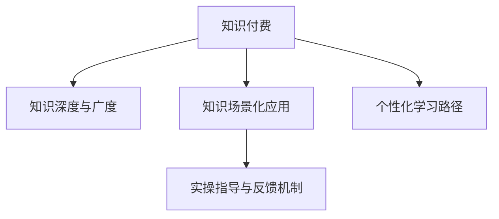

                 

## 1. 背景介绍

### 1.1 问题由来

近年来，知识付费作为一种新兴的互联网服务模式，吸引了大量用户和投资者的关注。它通过提供优质的内容和服务，帮助用户快速掌握新知识、提升专业能力，满足了人们对知识获取的新需求。然而，在知识付费市场的迅猛发展中，我们逐渐发现，单纯的内容输出并不能完全解决用户的学习问题。知识的应用性和实操性，成为了知识付费服务必须面对的重要挑战。

### 1.2 问题核心关键点

知识付费的核心价值在于解决用户的实际问题，提升其解决问题的能力。因此，如何让知识更加具有应用性和实操性，成为了知识付费服务质量的关键。以下是知识付费中需要注意的几个关键点：

1. **知识深度与广度**：知识的深度决定了其对用户学习效果的提升，知识的广度则决定了其适用范围的广泛性。
2. **知识场景化应用**：知识的应用场景决定了其价值，将知识应用到具体实践中，才能真正发挥其作用。
3. **实操指导与反馈机制**：提供实操指导和及时反馈，帮助用户理解知识的实践方法，并及时调整学习策略。
4. **个性化学习路径**：根据用户的学习需求和进度，提供个性化的学习方案，使知识学习更具针对性和高效性。

## 2. 核心概念与联系

### 2.1 核心概念概述

为更好地理解知识付费中知识的应用性和实操性，本节将介绍几个密切相关的核心概念：

- **知识付费(Knowledge Pay)**：指用户通过付费获取优质内容或服务的学习模式，旨在提升个人或企业的知识水平和能力。
- **知识深度与广度**：知识深度指内容的深度与专业性，广度指内容的覆盖范围与适用性。
- **知识场景化应用**：根据具体应用场景，将知识转化为可操作的工具或方法。
- **实操指导与反馈机制**：提供具体的实践指导和及时反馈，帮助用户有效应用知识。
- **个性化学习路径**：根据用户的学习需求和进度，制定个性化的学习计划，以提高学习效果。

这些核心概念之间的逻辑关系可以通过以下Mermaid流程图来展示：



这个流程图展示了知识付费服务中各环节的相互关系：

1. 知识付费平台收集和提供深度和广度适中的优质内容。
2. 平台将知识内容应用到具体场景中，实现知识的场景化应用。
3. 提供实操指导和反馈机制，帮助用户将知识应用于实践。
4. 根据用户需求制定个性化学习路径，提升学习效果。

## 3. 核心算法原理 & 具体操作步骤
### 3.1 算法原理概述

知识付费服务中，知识的应用性和实操性通常通过以下步骤实现：

1. **内容收集与筛选**：从大量内容中筛选出深度适中、广度覆盖广泛的优质知识。
2. **知识场景化应用设计**：将知识内容转化为具体的实践指导，帮助用户在实际应用中解决问题。
3. **实操指导与反馈**：提供具体的实践操作指导和及时反馈，帮助用户应用知识。
4. **个性化学习路径制定**：根据用户的学习进度和需求，制定个性化的学习方案。

这些步骤中，知识的应用性和实操性是最关键的部分，是知识付费服务的核心价值所在。

### 3.2 算法步骤详解

**步骤1：内容收集与筛选**

- 收集优质的内容资源：包括书籍、视频、音频、文章等。
- 筛选高质量的内容：根据内容的专业性、深度、广度等因素，进行筛选和评估。
- 提供内容预览：让用户可以免费预览部分内容，以确保其质量。

**步骤2：知识场景化应用设计**

- 将知识内容转化为具体的实践指南：包括操作步骤、注意事项、示例等。
- 结合实际案例：提供实际应用场景的案例分析，帮助用户更好地理解和应用知识。
- 提供可操作的练习：设计具体的练习题或任务，让用户进行实操练习。

**步骤3：实操指导与反馈**

- 提供实操指导：详细说明每一步的具体操作方法，确保用户能够顺利完成练习。
- 提供实时反馈：在用户操作过程中，实时提供反馈，帮助用户纠正错误和提升技能。
- 建立社区互动：鼓励用户在社区中分享自己的实践经验，互相学习。

**步骤4：个性化学习路径制定**

- 分析用户需求：通过用户画像、学习记录等数据，分析用户的学习需求和进度。
- 制定个性化学习方案：根据用户需求，制定个性化的学习路径和推荐内容。
- 动态调整学习方案：根据用户的学习进度和反馈，动态调整学习方案，确保其高效性。

### 3.3 算法优缺点

知识付费服务中的知识应用性和实操性具有以下优点：

1. **提升学习效果**：通过实操指导和反馈机制，用户能够更好地理解知识，并将其应用于实践中，显著提升学习效果。
2. **个性化服务**：根据用户需求和进度，制定个性化的学习路径，满足用户的个性化学习需求。
3. **覆盖广度**：通过场景化应用设计，将知识应用于不同场景，提升知识的应用范围和灵活性。

同时，这种服务也存在一定的局限性：

1. **成本较高**：高质量内容的收集和筛选、知识场景化应用的设计、个性化学习路径的制定等，都需要较高的时间和资金投入。
2. **依赖用户自律**：用户需要主动参与练习和反馈，才能充分发挥知识的应用性和实操性。
3. **学习路径单一**：固定的学习路径可能无法完全满足用户的学习需求，需要不断优化和调整。
4. **难以量化评估**：知识应用性和实操性的效果评估较为复杂，难以通过单一指标进行全面衡量。

尽管存在这些局限性，但通过合理的技术手段和策略，可以最大化发挥知识应用性和实操性的优势，提升知识付费服务的效果和用户满意度。

### 3.4 算法应用领域

知识应用性和实操性的知识付费服务，在多个领域都有广泛的应用：

- **职业技能培训**：通过场景化应用设计，帮助用户掌握具体的职业技能，提升职场竞争力。
- **高等教育在线教育**：结合个性化学习路径和实操指导，提供高质量的在线课程，满足不同学生的学习需求。
- **职业转型指导**：通过提供职业转型相关的知识和实操指导，帮助用户顺利完成职业转换。
- **健康生活指导**：通过健康饮食、运动等方面的知识应用，帮助用户改善生活习惯，提升生活质量。
- **儿童教育**：通过互动和反馈机制，激发儿童的学习兴趣，提升其学习效果。

除了这些典型应用领域外，知识付费服务还在更多场景中得到创新性地应用，如金融投资、法律咨询、旅游规划等，为不同行业提供高质量的知识服务。

## 4. 数学模型和公式 & 详细讲解 & 举例说明

### 4.1 数学模型构建

本节将使用数学语言对知识付费服务中知识应用性和实操性的实现过程进行更加严格的刻画。

假设知识付费平台收集的优质内容数量为 $N$，每个内容的专业性和广度可以用 $d_i \in [0,1]$ 和 $b_i \in [0,1]$ 表示，其中 $d_i$ 为内容的专业性深度，$b_i$ 为内容的覆盖范围广度。知识付费平台的目标是选择最优的内容集合 $S$，使得 $S$ 中的内容总和在深度和广度上都达到最优，即最大化：

$$
\max \sum_{i \in S} d_i + \sum_{i \in S} b_i
$$

同时，需要考虑内容选择和用户选择的动态交互。设用户 $u$ 对内容 $i$ 的选择概率为 $p_{ui}$，则用户在平台上的总满意度 $T$ 可以表示为：

$$
T = \sum_{i=1}^N p_{ui} \cdot f_i
$$

其中 $f_i$ 为内容 $i$ 的满意度函数，可以包括内容的深度、广度、更新频率等因素。

### 4.2 公式推导过程

为了最大化总满意度 $T$，需要优化选择概率 $p_{ui}$。引入拉格朗日乘子法，构建目标函数：

$$
\max \sum_{i=1}^N p_{ui} \cdot f_i \\
\text{subject to} \sum_{i=1}^N p_{ui} = 1
$$

引入拉格朗日乘子 $\lambda$，构造拉格朗日函数：

$$
\mathcal{L} = \sum_{i=1}^N p_{ui} \cdot f_i + \lambda (1 - \sum_{i=1}^N p_{ui})
$$

对 $p_{ui}$ 求偏导并令其为0，得到：

$$
\frac{\partial \mathcal{L}}{\partial p_{ui}} = f_i - \lambda = 0
$$

从而得到：

$$
p_{ui} = \frac{f_i}{\sum_{j=1}^N f_j}
$$

根据上述公式，用户对每个内容的选择概率与其满意度成正比。

### 4.3 案例分析与讲解

假设平台收集了三个内容 $i=1,2,3$，每个内容的深度和广度如下：

- $d_1=0.8, b_1=0.6$
- $d_2=0.7, b_2=0.5$
- $d_3=0.6, b_3=0.8$

每个内容的满意度函数 $f_i$ 如下：

- $f_1 = 0.9 \cdot d_1 + 0.6 \cdot b_1$
- $f_2 = 0.8 \cdot d_2 + 0.5 \cdot b_2$
- $f_3 = 0.7 \cdot d_3 + 0.8 \cdot b_3$

根据上述公式，可以计算出用户对每个内容的选择概率：

- $p_{u1} = \frac{0.9 \cdot 0.8 + 0.6 \cdot 0.6}{0.9 \cdot 0.8 + 0.8 \cdot 0.5 + 0.7 \cdot 0.6 + 0.8 \cdot 0.8} \approx 0.51$
- $p_{u2} = \frac{0.8 \cdot 0.7 + 0.5 \cdot 0.5}{0.9 \cdot 0.8 + 0.8 \cdot 0.5 + 0.7 \cdot 0.6 + 0.8 \cdot 0.8} \approx 0.35$
- $p_{u3} = \frac{0.7 \cdot 0.6 + 0.8 \cdot 0.8}{0.9 \cdot 0.8 + 0.8 \cdot 0.5 + 0.7 \cdot 0.6 + 0.8 \cdot 0.8} \approx 0.14$

因此，用户选择内容1的概率最高，选择内容3的概率最低。

## 5. 项目实践：代码实例和详细解释说明
### 5.1 开发环境搭建

在进行知识付费服务开发前，我们需要准备好开发环境。以下是使用Python进行Django开发的环境配置流程：

1. 安装Python：从官网下载并安装Python 3.7及以上版本，确保环境干净无冲突。

2. 安装Pip：在终端输入 `python -m ensurepip --default-pip` 安装Pip，用于管理Python包。

3. 安装Django：在终端输入 `pip install django` 安装Django框架。

4. 创建并激活虚拟环境：
```bash
python -m venv venv
source venv/bin/activate
```

5. 安装Django相关的第三方包：
```bash
pip install django-crispy-forms django-filter django-debug-toolbar django-axes django-compressor
```

6. 安装MySQL和MariaDB数据库：安装MySQL或MariaDB数据库，并创建数据库。

7. 安装Django管理后台：在终端输入 `python manage.py createsuperuser` 创建管理后台管理员。

完成上述步骤后，即可在虚拟环境中开始知识付费服务开发。

### 5.2 源代码详细实现

这里我们以在线课程平台为例，实现一个简化的知识付费服务功能。

首先，定义课程模型和相关操作：

```python
from django.db import models

class Course(models.Model):
    name = models.CharField(max_length=255)
    description = models.TextField()
    professor = models.CharField(max_length=255)
    price = models.DecimalField(max_digits=10, decimal_places=2)
    start_date = models.DateField()
    end_date = models.DateField()
    # 其他相关字段
```

然后，定义视图和模板：

```python
from django.shortcuts import render
from .models import Course

def course_detail(request, course_id):
    course = Course.objects.get(id=course_id)
    return render(request, 'course_detail.html', {'course': course})
```

其中，`course_detail.html`模板可以包含课程信息、课程内容、课程评价、用户留言等。

最后，定义模型和表单：

```python
from django import forms
from .models import Course

class EnrollForm(forms.ModelForm):
    class Meta:
        model = Course
        fields = ['price']

    def __init__(self, *args, **kwargs):
        super().__init__(*args, **kwargs)
        self.fields['price'].widget.attrs.update({
            'placeholder': 'Your Price'
        })
```

在用户完成表单提交后，可以通过Django提供的ORM操作进行用户注册和课程报名操作。

### 5.3 代码解读与分析

让我们再详细解读一下关键代码的实现细节：

**Course模型**：
- `name`：课程名称。
- `description`：课程描述。
- `professor`：讲师姓名。
- `price`：课程价格。
- `start_date`：开课日期。
- `end_date`：结课日期。

**EnrollForm表单**：
- `price`：用户填写的课程价格，用于表单验证。

**EnrollForm的__init__方法**：
- 在表单初始化时，通过`placeholder`属性设置价格输入框的占位符文本，方便用户填写。

完成上述代码实现后，可以在Django管理后台进行课程管理，如添加、编辑、删除课程，记录用户报名信息等。

## 6. 实际应用场景
### 6.1 在线教育

在线教育是知识付费服务的重要应用场景。通过将知识内容场景化应用，提供在线课程和练习题，结合实操指导与反馈，用户可以在家中自主学习，提升知识和技能。

例如，某在线编程课程平台可以将Python编程课程内容场景化应用，设计具体的编程任务，并提供在线代码编辑器和实时代码执行反馈，帮助用户提升编程技能。

### 6.2 职业技能培训

职业技能培训是知识付费服务的另一重要应用领域。通过提供具体的应用场景和实操指导，帮助用户掌握职业技能，提升职业竞争力。

例如，某在线会计培训课程平台可以提供真实的会计操作场景，通过具体的会计凭证录入、财务报表生成等任务，结合实操指导和反馈，帮助用户掌握会计技能。

### 6.3 健康生活指导

健康生活指导是知识付费服务的新兴应用场景。通过将健康饮食、运动等方面的知识应用到实际生活中，帮助用户改善生活习惯，提升生活质量。

例如，某在线健康生活指导平台可以提供个性化的饮食计划和运动指导，结合用户的生活习惯和健康数据，提供具体的饮食和运动建议，并实时跟踪用户反馈，帮助其健康生活。

## 7. 工具和资源推荐
### 7.1 学习资源推荐

为了帮助开发者系统掌握知识付费服务中的知识应用性和实操性，这里推荐一些优质的学习资源：

1. **Django官方文档**：Django框架的官方文档，详细介绍了Django的各个组件和使用方法。
2. **Python编程语言**：Python编程语言的基础教程和进阶教程，帮助开发者掌握Python编程技能。
3. **Django实战教程**：通过具体项目实践，帮助开发者掌握Django框架的使用技巧。
4. **SQL数据库基础教程**：SQL数据库的基础教程和高级教程，帮助开发者掌握数据库操作技能。
5. **Web前端框架教程**：常用的Web前端框架（如Bootstrap、Vue等）的使用教程，帮助开发者提升前端开发能力。

通过对这些资源的学习实践，相信你一定能够快速掌握知识付费服务的精髓，并用于解决实际的业务问题。

### 7.2 开发工具推荐

高效的开发离不开优秀的工具支持。以下是几款用于知识付费服务开发的常用工具：

1. **PyCharm**：JetBrains开发的Python开发工具，提供了丰富的功能和插件，帮助开发者提高开发效率。
2. **Visual Studio Code**：微软开发的轻量级开发工具，支持多种编程语言和框架，具有强大的扩展能力。
3. **Django框架**：一个流行的Python Web框架，提供了强大的ORM、模板引擎和表单验证功能，非常适合开发知识付费服务。
4. **MySQL和MariaDB数据库**：流行的关系型数据库，支持高并发和高可用性，适合存储和查询用户数据。
5. **Git版本控制工具**：Git版本控制工具，支持分布式协作开发，帮助开发者管理代码和项目。

合理利用这些工具，可以显著提升知识付费服务开发的效率，加快创新迭代的步伐。

### 7.3 相关论文推荐

知识付费服务中的知识应用性和实操性研究，还处于起步阶段。以下是几篇相关论文，推荐阅读：

1. **《在线教育平台用户行为分析与个性化推荐系统》**：研究了在线教育平台的用户行为特征，提出基于用户行为特征的个性化推荐算法。
2. **《职业技能培训平台的知识图谱构建与查询优化》**：探索了职业技能培训平台中知识图谱的构建方法，提高了知识检索的效率。
3. **《健康生活指导平台的数据驱动设计与实现》**：研究了健康生活指导平台的设计和实现方法，提出了基于健康数据的用户健康评估模型。

这些论文代表了知识付费服务中知识应用性和实操性研究的前沿方向，可以为开发者提供重要的理论支持和实践参考。

## 8. 总结：未来发展趋势与挑战
### 8.1 总结

本文对知识付费服务中的知识应用性和实操性进行了全面系统的介绍。首先阐述了知识付费服务中知识应用性和实操性的重要性，明确了知识应用性和实操性在提升用户学习效果和满意度方面的关键作用。其次，从原理到实践，详细讲解了知识应用性和实操性的数学模型和公式推导，给出了知识付费服务开发的完整代码实例。同时，本文还广泛探讨了知识应用性和实操性在在线教育、职业技能培训、健康生活指导等多个行业领域的应用前景，展示了知识付费服务的大范围应用价值。

通过本文的系统梳理，可以看到，知识应用性和实操性在知识付费服务中具有重要的地位。这些技术的合理应用，将使得知识付费服务能够更好地解决用户的实际问题，提升其学习效果和满意度。

### 8.2 未来发展趋势

展望未来，知识付费服务中的知识应用性和实操性将呈现以下几个发展趋势：

1. **个性化学习路径优化**：通过大数据和人工智能技术，分析用户的学习行为和需求，制定更加个性化的学习路径，提高学习效果。
2. **实景结合学习**：结合虚拟现实、增强现实等技术，提供实景学习体验，增强用户的学习兴趣和效果。
3. **跨平台学习**：开发跨平台学习应用，支持多种设备和操作系统，方便用户随时随地进行学习。
4. **多模态学习**：结合语音、图像、视频等多模态数据，提升用户的学习体验和效果。
5. **社交化学习**：通过社区互动、在线讨论等方式，激发用户的学习热情，促进知识分享和交流。

以上趋势将推动知识付费服务向更加智能化、个性化和互动化的方向发展，为用户提供更优质的学习体验和效果。

### 8.3 面临的挑战

尽管知识应用性和实操性在知识付费服务中已经取得了一定的进展，但在迈向更加智能化、普适化应用的过程中，它仍面临着诸多挑战：

1. **用户数据隐私保护**：在知识付费服务中，用户数据隐私保护是一个重要问题。如何保护用户隐私，同时满足知识服务的需求，是一个需要解决的关键问题。
2. **知识内容更新**：知识内容需要定期更新，以保持其时效性和实用性。如何在保证知识质量的同时，提高更新效率，是一个需要解决的问题。
3. **用户体验优化**：知识应用性和实操性的实现需要考虑用户体验，避免复杂和繁琐的操作，增强用户的满意度和粘性。
4. **技术复杂度提升**：知识应用性和实操性的实现需要多种技术的结合，如大数据分析、人工智能、Web开发等，增加了开发和维护的复杂度。

尽管存在这些挑战，但通过合理的技术手段和策略，可以最大化发挥知识应用性和实操性的优势，提升知识付费服务的效果和用户满意度。

### 8.4 研究展望

未来的知识付费服务研究，需要在以下几个方面寻求新的突破：

1. **多模态数据融合**：结合多种模态数据，提升用户的学习体验和效果。
2. **实景应用设计**：开发实景应用，增强用户的学习兴趣和效果。
3. **个性化学习路径优化**：通过大数据和人工智能技术，制定更加个性化的学习路径，提高学习效果。
4. **跨平台学习**：开发跨平台学习应用，支持多种设备和操作系统，方便用户随时随地进行学习。
5. **社交化学习**：通过社区互动、在线讨论等方式，激发用户的学习热情，促进知识分享和交流。

这些研究方向的探索，必将引领知识付费服务向更加智能化、个性化和互动化的方向发展，为用户提供更优质的学习体验和效果。

## 9. 附录：常见问题与解答

**Q1：知识付费服务是否适合所有用户？**

A: 知识付费服务适合具有自主学习需求和意愿的用户，适合希望快速掌握新知识、提升专业能力的人群。对于缺乏自主学习能力或学习意愿的用户，可能需要通过线下培训、传统教学等方式进行学习。

**Q2：如何设计知识应用性和实操性强的课程？**

A: 设计知识应用性和实操性强的课程，可以从以下几个方面入手：
1. **场景化应用设计**：将知识内容转化为具体的实践指导，设计实际应用场景。
2. **实操指导与反馈**：提供详细的实践操作指导和实时反馈，帮助用户应用知识。
3. **个性化学习路径**：根据用户的学习需求和进度，制定个性化的学习方案。

**Q3：知识付费服务中如何保护用户数据隐私？**

A: 保护用户数据隐私是知识付费服务中的重要问题，需要采取以下措施：
1. **数据匿名化**：对用户数据进行匿名化处理，避免直接暴露用户个人信息。
2. **加密存储**：采用加密技术存储用户数据，防止数据泄露和篡改。
3. **权限控制**：严格控制数据访问权限，确保只有授权人员可以访问用户数据。
4. **隐私政策透明**：制定透明的隐私政策，明确告知用户数据的采集和使用方式。

通过以上措施，可以有效保护用户数据隐私，增强用户对知识付费服务的信任和满意度。

**Q4：知识付费服务中的知识内容如何更新？**

A: 知识内容的更新需要考虑以下几个方面：
1. **定期更新**：定期更新知识内容，保持其时效性和实用性。
2. **质量保证**：在更新知识内容时，确保其质量和准确性。
3. **用户反馈**：收集用户反馈，根据用户需求更新知识内容。

通过定期更新和质量保证，可以确保知识内容的时效性和实用性，增强知识付费服务的效果和用户满意度。

**Q5：知识付费服务中的用户体验如何优化？**

A: 优化知识付费服务中的用户体验，可以从以下几个方面入手：
1. **界面设计**：设计简洁、易用的界面，减少用户操作复杂度。
2. **实时反馈**：提供实时的用户反馈机制，及时响应用户需求。
3. **交互设计**：采用交互式设计，增强用户的学习体验。
4. **个性化推荐**：根据用户的学习行为和需求，提供个性化的学习推荐。

通过以上措施，可以提升用户的学习体验和满意度，增强知识付费服务的吸引力。

---

作者：禅与计算机程序设计艺术 / Zen and the Art of Computer Programming

