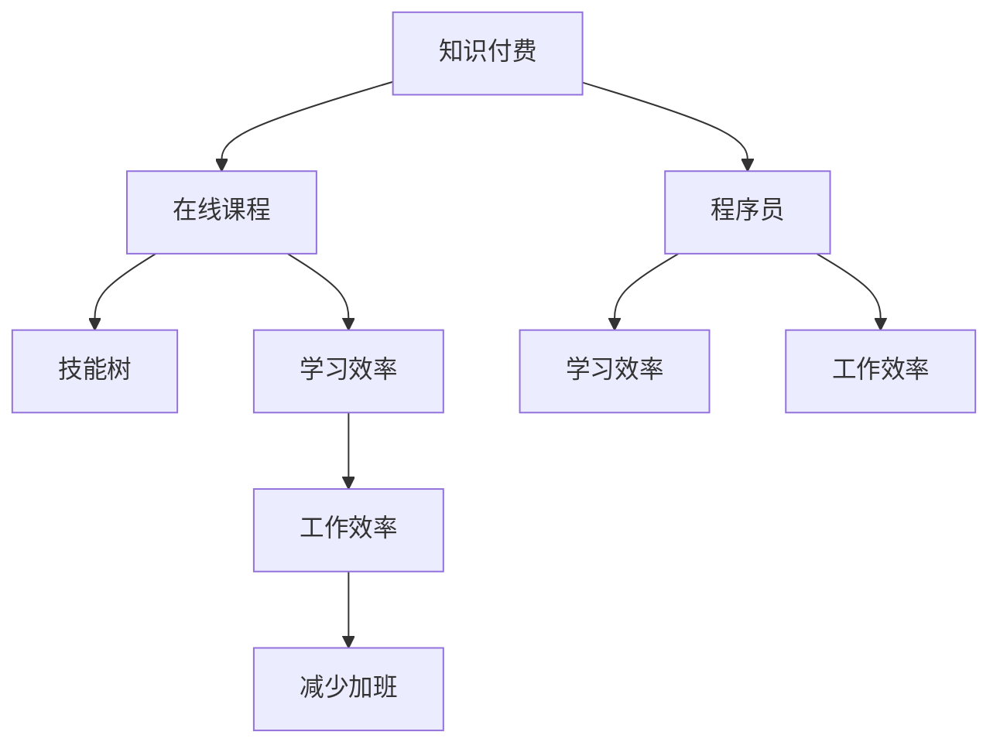

                 

# 知识付费让程序员告别加班文化的策略

## 1. 背景介绍

在当今快速变化的技术环境中，程序员的工作负担日益加重，面临着不断学习新技能、应对新技术更新和需求变化的双重压力。传统的加班文化不仅影响了程序员的身心健康，也阻碍了他们在工作和生活中的平衡。随着知识付费平台的兴起，提供了一系列的解决方案，帮助程序员在掌握新技能的同时，实现更高效、更有成效的工作方式，从而告别加班文化。

### 1.1 问题由来

在信息技术行业，技术更新迭代速度快，新工具、新框架和新技术层出不穷。为了保持竞争力，程序员需要不断学习和适应新的技术趋势。然而，由于工作量大、项目周期紧迫、需求多变等因素，很多程序员不得不加班以满足项目需求。长此以往，加班文化成为了常态，损害了程序员的身心健康，降低了他们的工作效率和生活质量。

### 1.2 问题核心关键点

解决这一问题需要从多个方面入手，包括提高工作效率、优化工作流程、增强技能掌握度等。知识付费平台提供的课程和资源，为程序员提供了一个高效、系统化的学习途径，帮助他们快速掌握新技能，提高工作效率，从而在减少加班的同时，提升工作质量和产出。

## 2. 核心概念与联系

### 2.1 核心概念概述

为更好地理解知识付费平台如何帮助程序员告别加班文化，本节将介绍几个密切相关的核心概念：

- 知识付费：指通过购买知识、技能或服务，获得所需的学习材料和支持，以实现快速提升自身能力的方法。
- 程序员：掌握计算机科学知识，使用编程语言开发软件、系统或应用程序的专业人士。
- 在线课程：通过网络平台提供的课程资源，包括视频、文章、代码示例等，帮助学习者掌握新技能。
- 技能树：描述个体技能掌握程度和结构的概念，通过学习不同课程，逐步构建和完善技能树。
- 学习效率：衡量学习者在一定时间内掌握新知识和技能的程度，是提升工作产出、减少加班的关键因素。

这些核心概念之间的逻辑关系可以通过以下Mermaid流程图来展示：



这个流程图展示了这个主题中的核心概念及其之间的关系：

1. 知识付费通过提供在线课程，帮助程序员快速掌握新技能。
2. 程序员通过学习课程，逐步完善自己的技能树。
3. 技能树的构建和完善有助于提高学习效率。
4. 学习效率的提升直接转化为工作效率的提高。
5. 工作效率的提升最终减少了加班需求。

## 3. 核心算法原理 & 具体操作步骤
### 3.1 算法原理概述

知识付费平台的核心算法原理是通过提供高质量的在线课程，帮助程序员快速学习新技能，提高学习效率，从而提高工作效率，减少加班。具体来说，平台通过以下几个步骤实现这一目标：

- 收集和整合各类优质课程资源，涵盖最新的编程语言、框架、工具和开发技巧。
- 提供个性化的学习路径和推荐系统，根据学习者的基础和需求，推荐适合的课程和资源。
- 利用数据分析技术，评估学习效果和进度，及时调整学习计划。
- 提供互动和协作学习环境，通过社区和论坛，促进学习者之间的交流和经验分享。

### 3.2 算法步骤详解

知识付费平台的算法流程主要包括以下几个关键步骤：

**Step 1: 课程资源准备**

- 收集和筛选高质量课程资源，涵盖最新技术趋势和开发技巧。
- 邀请业内专家和开发者制作课程内容，确保课程内容的深度和广度。
- 利用爬虫技术，从各大公开课程平台和开发者社区收集资源，扩大资源库。

**Step 2: 个性化学习路径设计**

- 根据学习者的历史学习行为和反馈，分析其技能水平和学习需求。
- 设计个性化的学习路径，包括推荐的课程、资源和学习顺序。
- 通过机器学习算法，实时调整推荐策略，优化学习路径。

**Step 3: 学习效果评估**

- 利用数据分析工具，评估学习者的学习效果和进度。
- 根据评估结果，及时调整学习计划和推荐策略。
- 通过在线测试和实践项目，检验学习者的实际掌握程度。

**Step 4: 社区和协作环境构建**

- 建立在线社区和论坛，促进学习者之间的交流和经验分享。
- 组织线下技术沙龙和培训班，加强学习者之间的互动。
- 提供编程协作工具，支持学习者共同开发项目和解决问题。

通过以上步骤，知识付费平台能够提供一站式的学习资源和支持，帮助程序员快速掌握新技能，提高学习效率，从而减少加班需求。

### 3.3 算法优缺点

知识付费平台的算法具备以下优点：

- 高效性：通过个性化推荐和实时评估，学习者可以迅速掌握新技能，提高工作效率。
- 灵活性：学习者可以根据自己的需求和时间安排，灵活选择学习路径和节奏。
- 互动性：社区和协作环境促进学习者之间的交流和协作，增强学习效果。

同时，该算法也存在一些局限性：

- 成本高：高质量课程资源的制作和维护成本较高，可能导致价格偏高。
- 依赖性强：学习者的学习效果和效果评估依赖于平台算法的精准度，可能存在偏差。
- 社交依赖：过于依赖在线社区和协作环境，可能影响学习者自主学习和思考能力。

尽管存在这些局限性，但就目前而言，知识付费平台仍然是提升程序员技能、提高工作效率、减少加班的有效手段。

### 3.4 算法应用领域

知识付费平台的算法应用领域非常广泛，除了提升程序员的技能，还涉及教育、培训、医疗等多个领域。在教育领域，平台可以根据学习者的兴趣和需求，提供个性化的学习路径和资源；在医疗领域，平台可以提供专业医疗知识和技能的在线课程，提高医疗从业人员的技能水平。

## 4. 数学模型和公式 & 详细讲解 & 举例说明

### 4.1 数学模型构建

知识付费平台的算法模型主要基于机器学习算法，包括推荐系统、个性化学习路径设计和效果评估。这些模型通常使用以下数据进行训练和优化：

- 学习者的历史学习行为数据，包括浏览、点击、学习时长等。
- 课程资源的属性数据，如课程内容、难度、讲师背景等。
- 学习效果的数据，如测试成绩、项目完成度等。

这些数据可以构成一个多维度的特征空间，用于训练推荐系统、个性化学习路径设计和效果评估模型。

### 4.2 公式推导过程

以下是一个简单的推荐系统模型的公式推导过程：

设学习者集合为 $U$，课程资源集合为 $I$，则推荐系统可以表示为一个矩阵 $R$，其中 $R_{ui}$ 表示学习者 $u$ 对课程资源 $i$ 的评分。

推荐系统的目标是最小化预测评分与实际评分的差异，即：

$$
\min_{\theta} \sum_{(u,i) \in U \times I} (R_{ui} - \hat{R}_{ui})^2
$$

其中 $\theta$ 为模型的参数，$\hat{R}_{ui}$ 为预测评分。

为了解决高维稀疏矩阵的问题，通常使用矩阵分解技术，将矩阵 $R$ 分解为两个低维矩阵 $P$ 和 $Q$ 的乘积，即：

$$
R \approx PQ
$$

其中 $P$ 为学习者向量，$Q$ 为课程资源向量，$\hat{R}_{ui} = P_u \cdot Q_i$。

通过优化损失函数，不断调整 $P$ 和 $Q$ 矩阵，以提高预测准确率。

### 4.3 案例分析与讲解

假设某知识付费平台收集了 $10,000$ 名学习者的历史学习数据，包含 $500$ 门课程。平台使用协同过滤算法和矩阵分解技术，设计了一个推荐系统。

首先，平台对学习者的历史行为进行分析，构建学习者向量 $P$。然后，对课程资源的属性进行分析，构建课程资源向量 $Q$。接着，利用矩阵分解技术，将矩阵 $R$ 分解为 $P$ 和 $Q$ 的乘积，得到预测评分矩阵 $\hat{R}$。最后，根据预测评分矩阵 $\hat{R}$，向学习者推荐与其兴趣最匹配的课程资源。

## 5. 项目实践：代码实例和详细解释说明
### 5.1 开发环境搭建

在进行知识付费平台开发前，我们需要准备好开发环境。以下是使用Python进行Flask开发的环境配置流程：

1. 安装Anaconda：从官网下载并安装Anaconda，用于创建独立的Python环境。

2. 创建并激活虚拟环境：
```bash
conda create -n flask-env python=3.8 
conda activate flask-env
```

3. 安装Flask：
```bash
pip install flask
```

4. 安装SQLAlchemy：
```bash
pip install sqlalchemy
```

5. 安装Flask-RESTful：
```bash
pip install flask-restful
```

6. 安装Flask-SQLAlchemy：
```bash
pip install flask-sqlalchemy
```

完成上述步骤后，即可在`flask-env`环境中开始开发。

### 5.2 源代码详细实现

这里我们以一个简单的知识付费平台为例，给出使用Flask框架构建推荐系统的Python代码实现。

首先，定义数据库连接和模型：

```python
from flask_sqlalchemy import SQLAlchemy

db = SQLAlchemy(app)

class User(db.Model):
    id = db.Column(db.Integer, primary_key=True)
    name = db.Column(db.String(100), nullable=False)
    courses = db.relationship('Course', backref='users', lazy=True)

class Course(db.Model):
    id = db.Column(db.Integer, primary_key=True)
    name = db.Column(db.String(100), nullable=False)
    user_id = db.Column(db.Integer, db.ForeignKey('user.id'), nullable=False)

    def __repr__(self):
        return f"<Course {self.name}>"

class UserCourse(db.Model):
    id = db.Column(db.Integer, primary_key=True)
    user_id = db.Column(db.Integer, db.ForeignKey('user.id'), nullable=False)
    course_id = db.Column(db.Integer, db.ForeignKey('course.id'), nullable=False)
```

然后，定义推荐系统模型：

```python
from scipy.sparse import lil_matrix
from scipy.sparse.linalg import svds

def matrix_decomposition(R):
    U, S, Vt = svds(R, k=10)
    return U, S, Vt

def predict_course(user, courses):
    U, S, Vt = matrix_decomposition(R)
    predictions = U[user] * Vt.T.dot(S)
    return courses[predictions.argmax()]

@app.route('/recommend', methods=['POST'])
def recommend():
    user_id = request.json['user_id']
    user = User.query.get(user_id)
    courses = [Course.query.filter_by(user_id=user).all()]
    predicted_course = predict_course(user.id, courses)
    return jsonify(predicted_course)
```

接着，定义学习路径设计模块：

```python
@app.route('/path', methods=['GET'])
def path():
    user_id = request.args.get('user_id')
    user = User.query.get(user_id)
    path = user.path
    return jsonify(path)
```

最后，启动Flask服务：

```python
if __name__ == '__main__':
    app.run(debug=True)
```

以上就是使用Flask框架构建知识付费平台的完整代码实现。可以看到，通过Flask框架，我们可以快速搭建一个基于推荐算法的知识付费平台，帮助程序员快速掌握新技能。

### 5.3 代码解读与分析

让我们再详细解读一下关键代码的实现细节：

**数据库模型**：
- `User`类：表示学习者，包含学习者ID和名字，以及关联的课程信息。
- `Course`类：表示课程资源，包含课程ID和名称，以及关联的学习者信息。
- `UserCourse`类：表示学习者与课程的关联关系。

**矩阵分解函数**：
- `matrix_decomposition`函数：使用scipy库中的SVD方法，对稀疏矩阵R进行矩阵分解，得到低秩近似矩阵U、S和Vt。

**推荐函数**：
- `predict_course`函数：使用分解后的矩阵U、S和Vt，计算预测评分，并返回预测评分最高的课程。

**API接口**：
- `/recommend`接口：接收学习者ID和课程列表，返回预测评分最高的课程。
- `/path`接口：获取学习者的学习路径。

**运行服务**：
- `if __name__ == '__main__':`代码：启动Flask服务，等待请求并响应。

通过上述代码，学习者可以在知识付费平台上快速获取个性化的课程推荐，制定学习路径，从而在减少加班的同时，提升技能掌握度和工作效率。

## 6. 实际应用场景
### 6.1 智能客服系统

知识付费平台可以在智能客服系统中发挥重要作用。传统客服系统依赖大量人工，成本高，效率低。通过知识付费平台，客服人员可以随时学习新技能，快速掌握新知识和解决复杂问题，提高客户满意度。

在技术实现上，知识付费平台可以提供专业的客服课程、实时咨询和社区支持，帮助客服人员快速提升能力。此外，平台还可以提供在线技术支持，帮助客服人员解决实际问题。

### 6.2 金融科技

金融科技领域的技术日新月异，知识付费平台可以帮助金融从业者快速掌握最新的金融技术和新产品，提高业务能力。通过平台提供的学习资源和课程，金融从业者可以在工作中不断提升自身技能，应对各种复杂和不确定性。

例如，平台可以提供区块链、数字货币、大数据分析等课程，帮助金融从业者掌握最新技术，提高业务竞争力。

### 6.3 在线教育

知识付费平台是在线教育的重要组成部分。通过平台提供的丰富课程资源和个性化推荐系统，学习者可以随时随地学习新知识，提高自身竞争力。

平台可以根据学习者的兴趣和需求，推荐适合的课程和资源，帮助学习者系统化地掌握新技能。同时，平台还可以提供在线测试和项目实践，检验学习者的实际掌握程度，确保学习效果。

### 6.4 未来应用展望

随着知识付费平台的不断发展，其在多个领域的应用将更加广泛。未来，知识付费平台有望在医疗、法律、教育等多个行业实现规模化应用，帮助从业者快速提升技能，提高工作效率，减少加班需求。

在医疗领域，平台可以提供医学知识、技能培训和实时咨询服务，帮助医护人员提升医疗水平，提高患者满意度。在法律领域，平台可以提供法律知识、案例分析和实际操作课程，帮助法律从业者提升专业能力，应对复杂案件。

## 7. 工具和资源推荐
### 7.1 学习资源推荐

为了帮助程序员系统掌握知识付费平台的理论基础和实践技巧，这里推荐一些优质的学习资源：

1. Coursera和Udacity：提供大量高质量的在线课程和专业认证，涵盖计算机科学、数据科学、人工智能等多个领域。

2. edX和Khan Academy：提供免费的在线课程和资源，适合希望系统化学习新知识的学习者。

3. GitHub Learning Lab：提供面向开发者的编程和工具教程，通过实践项目帮助学习者掌握新技能。

4. Stack Overflow：提供广泛的编程问题讨论和解决方案，帮助学习者解决实际问题，提升编程能力。

5. Codecademy和LeetCode：提供互动式编程练习和在线测试，帮助学习者不断练习和提升编程技能。

通过对这些资源的学习实践，相信你一定能够快速掌握知识付费平台的精髓，并将其应用到实际开发中。

### 7.2 开发工具推荐

高效的开发离不开优秀的工具支持。以下是几款用于知识付费平台开发的常用工具：

1. Flask：轻量级的Web应用框架，易于上手，支持RESTful API开发。

2. SQLAlchemy：强大的SQL数据库 ORM，支持多种数据库系统，方便数据管理。

3. Scikit-learn和TensorFlow：常用的机器学习和深度学习框架，支持模型训练和优化。

4. NumPy和Pandas：强大的数据处理和分析工具，支持高效的数据处理和分析。

5. Jupyter Notebook：支持Python编程和数据可视化的交互式开发环境。

6. PyCharm和VSCode：流行的IDE工具，支持代码编写、调试和版本控制。

合理利用这些工具，可以显著提升知识付费平台的开发效率，加快创新迭代的步伐。

### 7.3 相关论文推荐

知识付费平台的研究源于学界的持续探索。以下是几篇奠基性的相关论文，推荐阅读：

1. "Collaborative Filtering"：介绍了协同过滤算法的原理和应用，是推荐系统研究的基础。

2. "Matrix Factorization Techniques for Recommender Systems"：详细介绍了矩阵分解技术，为推荐系统提供了理论基础。

3. "Recommender Systems Handbook"：综合性的推荐系统手册，涵盖各种推荐算法的原理和实现。

4. "Practical Recommendation Systems"：实用型的推荐系统教程，结合案例和代码，帮助读者理解和实现推荐系统。

5. "Deep Learning for Recommendation Engines"：介绍深度学习在推荐系统中的应用，包括卷积神经网络和循环神经网络等。

这些论文代表了大数据、机器学习和推荐系统的发展脉络。通过学习这些前沿成果，可以帮助研究者把握学科前进方向，激发更多的创新灵感。

## 8. 总结：未来发展趋势与挑战
### 8.1 总结

本文对知识付费平台如何帮助程序员告别加班文化进行了全面系统的介绍。首先阐述了程序员加班文化的问题由来和核心关键点，明确了知识付费平台的独特价值。其次，从原理到实践，详细讲解了知识付费平台的算法流程和操作步骤，给出了完整的代码实现示例。同时，本文还广泛探讨了知识付费平台在多个行业领域的应用前景，展示了平台的巨大潜力。

通过本文的系统梳理，可以看到，知识付费平台通过提供高质量的在线课程和个性化推荐，帮助程序员快速掌握新技能，提升工作效率，减少加班需求。知识付费平台正在成为程序员提升技能、提高工作效率的重要手段，必将对程序员的工作方式和职业发展产生深远影响。

### 8.2 未来发展趋势

展望未来，知识付费平台的发展将呈现以下几个趋势：

1. 个性化推荐更精准。平台将进一步优化推荐算法，提供更加个性化的学习路径和课程推荐。

2. 多模态学习成为可能。平台将支持视频、音频、文档等多种形式的学习材料，提升学习效果。

3. 交互式学习更加丰富。平台将引入更多互动和协作元素，如在线讨论、即时问答等，提升学习体验。

4. 实时反馈和评估机制完善。平台将实时收集学习效果数据，进行分析和评估，优化学习路径和课程内容。

5. 社区和社交功能增强。平台将加强学习者之间的互动和社区建设，形成更加活跃的学习社区。

以上趋势凸显了知识付费平台的发展方向，这些方向的探索和发展，将进一步提升学习者的学习效果和工作效率，减少加班需求，推动知识共享和传播。

### 8.3 面临的挑战

尽管知识付费平台在提升程序员技能、提高工作效率方面展现了巨大潜力，但仍面临一些挑战：

1. 内容质量控制。高质量课程内容的制作和维护成本较高，需要大量专业资源。平台需要建立有效的质量控制机制，确保课程内容的深度和广度。

2. 学习效果的评估。学习效果的数据采集和分析难度较大，平台需要设计有效的评估体系，及时调整学习路径和课程内容。

3. 用户黏性问题。如何吸引学习者持续使用平台，避免流失，仍是一个重要问题。平台需要不断创新和改进，提升用户体验和满意度。

4. 技术壁垒高。知识付费平台涉及推荐算法、数据处理、系统架构等多个技术领域，开发和维护难度较大。

尽管存在这些挑战，但随着技术的不断进步和市场需求的推动，知识付费平台必将进一步发展和完善，为程序员提供更加高效、灵活、个性化的学习平台。

### 8.4 研究展望

未来的研究可以从以下几个方向进行：

1. 推荐算法的多样化。探索更多推荐算法和模型，提升个性化推荐的效果和准确度。

2. 学习效果的优化。引入更多反馈机制和评估模型，提升学习效果和效率。

3. 多模态学习的应用。支持更多形式的学习材料和互动方式，丰富学习体验。

4. 社会化学习机制。加强学习者之间的互动和协作，形成更加活跃的学习社区。

5. 技术平台的优化。不断优化平台的技术架构和系统性能，提升用户体验和平台稳定性。

通过这些研究方向的探索和发展，知识付费平台将不断提升其功能和价值，帮助程序员告别加班文化，实现更加高效、灵活和智能的学习和工作方式。

## 9. 附录：常见问题与解答

**Q1：知识付费平台是否适用于所有程序员？**

A: 知识付费平台适用于大多数程序员，特别是那些希望提升自身技能和效率的开发者。对于那些对特定技术领域感兴趣或希望进入新领域的程序员，知识付费平台提供了系统化学习途径，帮助他们快速掌握新技能。

**Q2：如何选择合适的课程？**

A: 选择合适的课程可以从以下几个方面入手：
1. 确定学习目标：明确自己的学习目标，如掌握某项新技能或进入新的技术领域。
2. 分析自身基础：了解自己的编程基础和技术水平，选择适合自己基础和需求的课程。
3. 查看课程评价：查看其他学习者的评价和反馈，了解课程的教学质量和学习效果。
4. 参考推荐系统：利用平台推荐系统，获取个性化的课程推荐。

**Q3：如何评估学习效果？**

A: 评估学习效果可以从以下几个方面入手：
1. 在线测试：平台提供在线测试和练习，检验学习者的实际掌握程度。
2. 项目实践：通过实际项目和作业，检验学习者的实际应用能力。
3. 社区反馈：参与在线社区和讨论，了解其他学习者的反馈和建议。
4. 定期评估：定期进行自我评估，分析学习效果和进度，调整学习计划。

**Q4：知识付费平台的缺点是什么？**

A: 知识付费平台的缺点主要包括以下几个方面：
1. 学习成本高：高质量课程内容的制作和维护成本较高，可能导致课程费用偏高。
2. 过度依赖平台：过度依赖平台的学习资源和推荐系统，可能影响自主学习和思考能力。
3. 内容更新慢：平台课程内容的更新和迭代速度较慢，可能无法跟上技术发展的步伐。

**Q5：知识付费平台如何帮助减少加班？**

A: 知识付费平台通过提供高质量的在线课程和个性化推荐，帮助程序员快速掌握新技能，提升工作效率，减少加班需求。具体来说：
1. 系统化学习：平台提供系统化学习路径和课程资源，帮助程序员快速提升技能。
2. 实时评估：平台实时收集学习效果数据，进行分析和评估，优化学习路径和课程内容。
3. 互动和协作：平台提供互动和协作学习环境，促进学习者之间的交流和经验分享。

通过以上措施，知识付费平台能够帮助程序员快速掌握新技能，提升工作效率，减少加班需求。

---

作者：禅与计算机程序设计艺术 / Zen and the Art of Computer Programming

