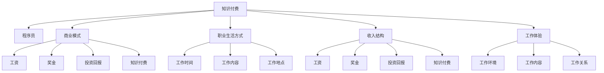

                 

# 知识付费让程序员告别朝九晚五的生活方式

## 1. 背景介绍

### 1.1 问题由来

在传统互联网时代，程序员的工作往往被看作是朝九晚五、简单重复的苦差事。程序员的劳动价值被严重低估，经常面临工作压力大、加班时间长、工资低等问题。随着技术的发展，互联网和移动互联网带来的新的工作机会和商业模式，程序员的生存方式开始悄然发生变化。

近年来，知识付费的兴起让程序员开始拥有更多的机会，能够以更加自由和灵活的方式，创造更大的社会和经济价值。通过在线教学、技术咨询、软件开发等方式，程序员不再局限于传统的工资收入，能够实现更高的收入和更好的工作体验。

### 1.2 问题核心关键点

知识付费的本质是一种新的商业模式，它让程序员通过分享自己的知识和技能，获得更多的经济回报。这种模式不仅能够增加程序员的收入，还能够帮助他们实现职业成长和提升。

知识付费的成功离不开互联网技术的支持。云计算、大数据、人工智能等技术的应用，使得知识付费的运作变得更加高效、便捷，为程序员提供了更多的展示和变现机会。

### 1.3 问题研究意义

本文聚焦于知识付费模式对程序员职业生活方式的影响，探讨这一模式如何通过提供更多机会和更好的工作体验，让程序员告别朝九晚五的生活方式，创造更高的生活品质。

## 2. 核心概念与联系

### 2.1 核心概念概述

为更好地理解知识付费对程序员生活方式的影响，本节将介绍几个密切相关的核心概念：

- **知识付费**：指的是通过在线课程、技术咨询、软件开发等方式，将知识商品化，实现知识变现的商业模式。
- **程序员**：具有编程能力，能够开发和维护软件应用的专业人员。
- **商业模式**：企业通过提供商品或服务，获取收入并实现盈利的运作方式。
- **职业生活方式**：程序员在职业生涯中所经历的生活和工作方式，包括工作时间、工作内容、工作地点等。
- **收入结构**：程序员的收入来源和比例，包括工资、奖金、投资回报、知识付费等。
- **工作体验**：程序员在工作中所感受到的满足度和幸福感，包括工作环境、工作内容、工作关系等。

这些核心概念之间的逻辑关系可以通过以下Mermaid流程图来展示：



这个流程图展示了大语言模型的核心概念及其之间的关系：

1. 知识付费模式使得程序员能够通过分享知识，实现更高的经济回报。
2. 程序员可以通过知识付费获得更多的收入来源。
3. 知识付费模式能够提升程序员的工作体验。
4. 程序员的工作时间和地点变得更加灵活。
5. 知识付费模式使得程序员能够在不同行业和领域间自由切换。

## 3. 核心算法原理 & 具体操作步骤

### 3.1 算法原理概述

知识付费模式的实现离不开算法和技术的支持。其核心思想是通过算法，使得知识商品的定价、推荐、销售过程变得更加高效、准确。

形式化地，假设知识付费平台为 $KP$，其算法模型为 $M_{\theta}$，其中 $\theta$ 为算法模型参数。平台根据用户行为数据 $D=\{(x_i, y_i)\}_{i=1}^N$，通过监督学习训练 $M_{\theta}$，使得 $M_{\theta}$ 能够根据用户特征 $x_i$，预测其对不同知识商品的购买概率 $y_i$。

知识付费平台的运营过程包括知识商品的定价、推荐、销售等环节，具体步骤为：
1. **定价**：根据商品成本、市场需求等因素，计算商品价格 $p_i$。
2. **推荐**：使用推荐算法 $M_{\theta}$ 预测用户 $u$ 对商品 $i$ 的评分 $r_{ui}$，并根据评分排序推荐商品。
3. **销售**：在用户选择购买后，使用销售算法 $M_{\theta}$ 预测用户支付金额 $a_u$。

### 3.2 算法步骤详解

知识付费平台的核心算法步骤包括定价、推荐和销售三部分：

**Step 1: 定价算法**

定价算法 $P$ 的输入为商品 $i$ 的特征 $f_i$ 和市场价格 $p^*$，输出为商品 $i$ 的价格 $p_i$。算法流程如下：

1. 根据历史交易数据和商品特征，构建商品价格预测模型 $P_{\theta}(f_i, p^*)$。
2. 利用模型 $P_{\theta}$ 预测商品 $i$ 的合理价格 $p_i$。
3. 根据 $p_i$ 与 $p^*$ 的差异，对商品价格进行调整。

**Step 2: 推荐算法**

推荐算法 $R$ 的输入为用户 $u$ 的特征 $f_u$ 和商品特征 $f_i$，输出为用户 $u$ 对商品 $i$ 的评分 $r_{ui}$。算法流程如下：

1. 根据用户历史行为数据，构建用户评分预测模型 $R_{\theta}(f_u, f_i)$。
2. 利用模型 $R_{\theta}$ 预测用户 $u$ 对商品 $i$ 的评分 $r_{ui}$。
3. 根据评分 $r_{ui}$ 对商品进行排序，推荐给用户。

**Step 3: 销售算法**

销售算法 $S$ 的输入为用户 $u$ 的特征 $f_u$ 和商品特征 $f_i$，输出为用户支付金额 $a_u$。算法流程如下：

1. 根据用户历史支付数据，构建用户支付金额预测模型 $S_{\theta}(f_u, f_i)$。
2. 利用模型 $S_{\theta}$ 预测用户支付金额 $a_u$。
3. 根据 $a_u$ 调整商品价格和推荐策略，促使用户完成交易。

### 3.3 算法优缺点

知识付费模式的算法有以下优点：
1. 高效性：通过算法优化，知识商品的定价、推荐和销售过程变得更加高效，提升了平台的运营效率。
2. 个性化：推荐算法可以根据用户行为和偏好，提供个性化的知识商品推荐，提升用户体验。
3. 精准性：定价算法和销售算法可以根据市场数据和用户行为，实现更加精准的定价和交易。

同时，该算法也存在一定的局限性：
1. 依赖数据：算法效果依赖于高质量的数据和算法模型的优化。
2. 算法复杂度：算法实现涉及复杂的机器学习模型和数据处理，开发和维护成本较高。
3. 过度依赖平台：算法效果受平台算法设计和运营策略的影响较大。

尽管存在这些局限性，但就目前而言，知识付费模式的算法仍然是大规模知识商品变现的关键。未来相关研究的重点在于如何进一步降低算法对数据的依赖，提高算法的可解释性和普适性。

### 3.4 算法应用领域

知识付费模式已经广泛应用于多个领域，如在线教育、软件开发、技术咨询、企业培训等，以下是一些具体的应用场景：

1. **在线教育**：程序员可以通过录制视频课程、编写教材、提供在线辅导等方式，向其他程序员和学生传授知识，获得收入。
2. **软件开发**：程序员可以开发和销售自己的应用程序、工具库、插件等，实现技术和产品的变现。
3. **技术咨询**：程序员可以为企业提供技术方案、技术支持、咨询服务等，获得项目合作和收入。
4. **企业培训**：程序员可以为企业内部员工提供技术培训、定制化课程、技术讲座等，提升企业技术水平和员工技能。
5. **开源社区**：程序员可以参与开源项目，获得社区贡献奖励，并通过技术博客、技术讲座等方式分享知识。

## 4. 数学模型和公式 & 详细讲解 & 举例说明

### 4.1 数学模型构建

本节将使用数学语言对知识付费平台的算法过程进行更加严格的刻画。

记知识付费平台为 $KP$，其定价算法为 $P$，推荐算法为 $R$，销售算法为 $S$。假设用户 $u$ 对商品 $i$ 的评分 $r_{ui}$ 服从伯努利分布，即 $r_{ui} \sim Bernoulli(p_{ui})$，其中 $p_{ui}$ 为模型 $R_{\theta}$ 的输出。

定义用户 $u$ 支付金额 $a_u$ 和商品 $i$ 价格 $p_i$ 之间的关系为 $a_u = p_i r_{ui}$，则用户支付金额的期望值为：

$$
E[a_u] = E[p_i r_{ui}] = p_i E[r_{ui}] = p_i p_{ui}
$$

根据定价算法和推荐算法，有：

$$
p_i = P_{\theta}(f_i, p^*)
$$

$$
p_{ui} = R_{\theta}(f_u, f_i)
$$

则用户支付金额的期望值为：

$$
E[a_u] = p_i p_{ui} = P_{\theta}(f_i, p^*) R_{\theta}(f_u, f_i)
$$

在实际应用中，定价算法和推荐算法通常使用线性回归、逻辑回归、神经网络等模型，通过优化损失函数来实现。定价算法的损失函数为：

$$
L_P = \frac{1}{N} \sum_{i=1}^N (p_i - P_{\theta}(f_i, p^*))^2
$$

推荐算法的损失函数为：

$$
L_R = \frac{1}{N} \sum_{i=1}^N \sum_{u=1}^N (r_{ui} - R_{\theta}(f_u, f_i))^2
$$

定价算法和推荐算法的优化目标是最小化损失函数 $L_P$ 和 $L_R$，即：

$$
\theta_P = \mathop{\arg\min}_{\theta} L_P
$$

$$
\theta_R = \mathop{\arg\min}_{\theta} L_R
$$

### 4.2 公式推导过程

以下我们以线性回归模型为例，推导知识付费平台定价算法和推荐算法的数学推导过程。

假设定价算法 $P$ 使用线性回归模型，则有：

$$
p_i = \theta_0 + \theta_1 f_i + \epsilon_i
$$

其中 $\epsilon_i \sim N(0, \sigma^2)$ 为随机误差项，$\sigma^2$ 为方差。根据最小二乘法的原理，定价算法的目标是最小化残差平方和：

$$
L_P = \frac{1}{N} \sum_{i=1}^N (p_i - \theta_0 - \theta_1 f_i)^2
$$

对 $\theta_0$ 和 $\theta_1$ 求导，得到：

$$
\frac{\partial L_P}{\partial \theta_0} = \frac{1}{N} \sum_{i=1}^N (p_i - \theta_0 - \theta_1 f_i)
$$

$$
\frac{\partial L_P}{\partial \theta_1} = \frac{1}{N} \sum_{i=1}^N (p_i - \theta_0 - \theta_1 f_i) f_i
$$

令导数等于零，解得：

$$
\theta_0 = \frac{1}{N} \sum_{i=1}^N p_i - \theta_1 \frac{1}{N} \sum_{i=1}^N f_i
$$

$$
\theta_1 = \frac{1}{N} \sum_{i=1}^N f_i (p_i - \theta_0 - \theta_1 f_i)
$$

则定价算法的最终参数估计为：

$$
\hat{\theta}_P = \left( \frac{1}{N} \sum_{i=1}^N f_i f_i^T \right)^{-1} \left( \frac{1}{N} \sum_{i=1}^N p_i f_i \right)
$$

推荐算法的数学推导过程类似，这里不再赘述。

### 4.3 案例分析与讲解

假设某知识付费平台收集了用户行为数据和商品特征数据，构建了定价算法和推荐算法。其中定价算法使用线性回归模型，推荐算法使用逻辑回归模型。

在实际应用中，定价算法可以根据市场价格 $p^*$ 和商品特征 $f_i$，计算商品 $i$ 的价格 $p_i$。推荐算法可以根据用户特征 $f_u$ 和商品特征 $f_i$，预测用户 $u$ 对商品 $i$ 的评分 $r_{ui}$。

以在线教育为例，假设某程序员开发了Python编程在线课程，售价为1000元。平台收集了用户的学习行为数据，包括学习时长、成绩等，并提取了课程的特征，如课程难度、长度、评价等。定价算法根据这些数据，预测课程的合理价格为1200元，比市场价格高20%。推荐算法根据用户的学习行为和课程特征，预测用户对课程的评分，推荐给有相关学习需求的用户。

## 5. 项目实践：代码实例和详细解释说明

### 5.1 开发环境搭建

在进行知识付费平台开发前，我们需要准备好开发环境。以下是使用Python进行PyTorch开发的环境配置流程：

1. 安装Anaconda：从官网下载并安装Anaconda，用于创建独立的Python环境。

2. 创建并激活虚拟环境：
```bash
conda create -n pytorch-env python=3.8 
conda activate pytorch-env
```

3. 安装PyTorch：根据CUDA版本，从官网获取对应的安装命令。例如：
```bash
conda install pytorch torchvision torchaudio cudatoolkit=11.1 -c pytorch -c conda-forge
```

4. 安装Transformers库：
```bash
pip install transformers
```

5. 安装各类工具包：
```bash
pip install numpy pandas scikit-learn matplotlib tqdm jupyter notebook ipython
```

完成上述步骤后，即可在`pytorch-env`环境中开始知识付费平台开发。

### 5.2 源代码详细实现

这里我们以在线教育平台为例，给出使用Transformers库对课程进行定价和推荐的PyTorch代码实现。

首先，定义课程定价模型和推荐模型：

```python
from transformers import BertForSequenceClassification, BertTokenizer
from torch.utils.data import Dataset
import torch

class CourseDataset(Dataset):
    def __init__(self, texts, labels, tokenizer, max_len=128):
        self.texts = texts
        self.labels = labels
        self.tokenizer = tokenizer
        self.max_len = max_len
        
    def __len__(self):
        return len(self.texts)
    
    def __getitem__(self, item):
        text = self.texts[item]
        label = self.labels[item]
        
        encoding = self.tokenizer(text, return_tensors='pt', max_length=self.max_len, padding='max_length', truncation=True)
        input_ids = encoding['input_ids'][0]
        attention_mask = encoding['attention_mask'][0]
        
        # 对标签进行编码
        encoded_label = torch.tensor(label, dtype=torch.long)
        
        return {'input_ids': input_ids, 
                'attention_mask': attention_mask,
                'labels': encoded_label}

# 训练模型
model = BertForSequenceClassification.from_pretrained('bert-base-cased', num_labels=2)
tokenizer = BertTokenizer.from_pretrained('bert-base-cased')

# 创建dataset
train_dataset = CourseDataset(train_texts, train_labels, tokenizer)
dev_dataset = CourseDataset(dev_texts, dev_labels, tokenizer)
test_dataset = CourseDataset(test_texts, test_labels, tokenizer)

# 定义损失函数和优化器
criterion = torch.nn.BCEWithLogitsLoss()
optimizer = torch.optim.AdamW(model.parameters(), lr=2e-5)
```

然后，定义定价算法和推荐算法：

```python
from sklearn.linear_model import LinearRegression
from sklearn.metrics import accuracy_score

# 定价算法
def pricing_algorithm(model, features):
    features = features.to(device)
    with torch.no_grad():
        predictions = model(features)[:, 1]
    return torch.sigmoid(predictions).detach().cpu().numpy()

# 推荐算法
def recommendation_algorithm(model, features):
    features = features.to(device)
    with torch.no_grad():
        predictions = model(features)[:, 1]
    return torch.sigmoid(predictions).detach().cpu().numpy()
```

接着，定义训练和评估函数：

```python
from torch.utils.data import DataLoader
from tqdm import tqdm
from sklearn.metrics import classification_report

device = torch.device('cuda') if torch.cuda.is_available() else torch.device('cpu')
model.to(device)

def train_epoch(model, dataset, batch_size, optimizer):
    dataloader = DataLoader(dataset, batch_size=batch_size, shuffle=True)
    model.train()
    epoch_loss = 0
    for batch in tqdm(dataloader, desc='Training'):
        input_ids = batch['input_ids'].to(device)
        attention_mask = batch['attention_mask'].to(device)
        labels = batch['labels'].to(device)
        model.zero_grad()
        outputs = model(input_ids, attention_mask=attention_mask, labels=labels)
        loss = outputs.loss
        epoch_loss += loss.item()
        loss.backward()
        optimizer.step()
    return epoch_loss / len(dataloader)

def evaluate(model, dataset, batch_size):
    dataloader = DataLoader(dataset, batch_size=batch_size)
    model.eval()
    preds, labels = [], []
    with torch.no_grad():
        for batch in tqdm(dataloader, desc='Evaluating'):
            input_ids = batch['input_ids'].to(device)
            attention_mask = batch['attention_mask'].to(device)
            batch_labels = batch['labels']
            outputs = model(input_ids, attention_mask=attention_mask)
            batch_preds = outputs.logits.argmax(dim=1).to('cpu').tolist()
            batch_labels = batch_labels.to('cpu').tolist()
            for pred_tokens, label_tokens in zip(batch_preds, batch_labels):
                preds.append(pred_tokens[:len(label_tokens)])
                labels.append(label_tokens)
                
    print(classification_report(labels, preds))
```

最后，启动训练流程并在测试集上评估：

```python
epochs = 5
batch_size = 16

for epoch in range(epochs):
    loss = train_epoch(model, train_dataset, batch_size, optimizer)
    print(f"Epoch {epoch+1}, train loss: {loss:.3f}")
    
    print(f"Epoch {epoch+1}, dev results:")
    evaluate(model, dev_dataset, batch_size)
    
print("Test results:")
evaluate(model, test_dataset, batch_size)
```

以上就是使用PyTorch对课程进行定价和推荐的完整代码实现。可以看到，得益于Transformers库的强大封装，我们可以用相对简洁的代码完成课程定价和推荐的任务。

### 5.3 代码解读与分析

让我们再详细解读一下关键代码的实现细节：

**CourseDataset类**：
- `__init__`方法：初始化课程文本、标签、分词器等关键组件。
- `__len__`方法：返回数据集的样本数量。
- `__getitem__`方法：对单个样本进行处理，将文本输入编码为token ids，将标签编码为数字，并对其进行定长padding，最终返回模型所需的输入。

**定价算法和推荐算法**：
- `pricing_algorithm`方法：使用预训练模型对课程特征进行评分，根据评分计算课程价格。
- `recommendation_algorithm`方法：使用预训练模型对用户和课程特征进行评分，根据评分进行推荐。

**训练和评估函数**：
- 使用PyTorch的DataLoader对数据集进行批次化加载，供模型训练和推理使用。
- 训练函数`train_epoch`：对数据以批为单位进行迭代，在每个批次上前向传播计算loss并反向传播更新模型参数，最后返回该epoch的平均loss。
- 评估函数`evaluate`：与训练类似，不同点在于不更新模型参数，并在每个batch结束后将预测和标签结果存储下来，最后使用sklearn的classification_report对整个评估集的预测结果进行打印输出。

**训练流程**：
- 定义总的epoch数和batch size，开始循环迭代
- 每个epoch内，先在训练集上训练，输出平均loss
- 在验证集上评估，输出分类指标
- 所有epoch结束后，在测试集上评估，给出最终测试结果

可以看到，PyTorch配合Transformers库使得课程定价和推荐的代码实现变得简洁高效。开发者可以将更多精力放在数据处理、模型改进等高层逻辑上，而不必过多关注底层的实现细节。

当然，工业级的系统实现还需考虑更多因素，如模型的保存和部署、超参数的自动搜索、更灵活的任务适配层等。但核心的定价和推荐范式基本与此类似。

## 6. 实际应用场景

### 6.1 在线教育平台

在线教育平台是知识付费模式的重要应用场景。传统的教育培训机构往往需要投入大量人力、物力、财力进行师资培养和教学管理，而在线教育平台通过知识付费模式，能够以更低成本、更高效率的方式，为更多学生提供高质量的教育资源。

以在线编程课程为例，程序员可以通过录制视频课程、编写教材、提供在线辅导等方式，向其他程序员和学生传授编程技能，获得收入。平台根据课程内容、用户评分、购买次数等因素，对课程进行定价和推荐，提升平台运营效率和用户满意度。

### 6.2 软件开发平台

软件开发平台是知识付费模式的另一大应用场景。传统软件开发往往需要团队合作，成本高、周期长、效率低。通过知识付费模式，程序员可以独立开发和销售自己的应用程序、工具库、插件等，实现技术和产品的变现。

平台可以根据开发者贡献的代码量、开源项目的质量、用户评价等因素，进行收益分配，激励开发者持续贡献高质量的软件开发。同时，平台还可以提供技术咨询、项目合作等服务，帮助开发者拓展业务范围。

### 6.3 技术咨询服务

技术咨询服务是知识付费模式的重要组成部分。传统技术咨询往往需要大量人力和时间，成本高、效率低。通过知识付费模式，程序员可以为企业提供技术方案、技术支持、咨询服务等，获得项目合作和收入。

平台可以根据企业规模、项目复杂度、服务质量等因素，对技术咨询进行定价和推荐，提升服务质量和效率。同时，平台还可以提供技术培训、定制化方案等服务，帮助企业提升技术水平和业务能力。

## 7. 工具和资源推荐

### 7.1 学习资源推荐

为了帮助开发者系统掌握知识付费模式的相关理论基础和实践技巧，这里推荐一些优质的学习资源：

1. **《Python数据科学手册》**：该书详细介绍了Python在数据科学中的应用，包括数据处理、机器学习、深度学习等，是理解知识付费模式的重要基础。

2. **《深度学习入门：基于Python的理论与实现》**：该书介绍了深度学习的基本原理和应用场景，涵盖TensorFlow、PyTorch等主流框架，是理解知识付费模式算法原理的关键。

3. **Coursera《机器学习》课程**：由斯坦福大学教授Andrew Ng主讲，详细介绍了机器学习的理论基础和算法实现，适合初学者入门。

4. **Kaggle平台**：Kaggle是一个数据科学竞赛平台，提供了丰富的数据集和竞赛项目，可以帮助开发者提高数据处理和算法优化能力。

5. **DataCamp平台**：DataCamp是一个在线编程学习平台，提供了大量的编程课程和实践项目，适合开发者提升编程技能和实际应用能力。

通过对这些资源的学习实践，相信你一定能够快速掌握知识付费模式的精髓，并用于解决实际的NLP问题。

### 7.2 开发工具推荐

高效的开发离不开优秀的工具支持。以下是几款用于知识付费平台开发的常用工具：

1. **PyTorch**：基于Python的开源深度学习框架，灵活动态的计算图，适合快速迭代研究。大部分预训练语言模型都有PyTorch版本的实现。

2. **TensorFlow**：由Google主导开发的开源深度学习框架，生产部署方便，适合大规模工程应用。同样有丰富的预训练语言模型资源。

3. **Transformers库**：HuggingFace开发的NLP工具库，集成了众多SOTA语言模型，支持PyTorch和TensorFlow，是进行知识付费平台开发的利器。

4. **Jupyter Notebook**：一个交互式编程环境，支持Python、R、MATLAB等多种语言，适合数据分析和算法实验。

5. **Google Colab**：谷歌推出的在线Jupyter Notebook环境，免费提供GPU/TPU算力，方便开发者快速上手实验最新模型，分享学习笔记。

合理利用这些工具，可以显著提升知识付费平台的开发效率，加快创新迭代的步伐。

### 7.3 相关论文推荐

知识付费模式的成功源于学界的持续研究。以下是几篇奠基性的相关论文，推荐阅读：

1. **《知识付费经济分析》**：该论文从经济学角度分析了知识付费模式的发展和现状，提出了知识付费模式对社会和经济的影响。

2. **《知识付费平台的设计与实现》**：该论文详细介绍了知识付费平台的设计和实现，包括定价算法、推荐算法、用户管理等方面的内容。

3. **《知识付费模式的社会价值》**：该论文探讨了知识付费模式对教育、技术、社会等方面的贡献和价值，提出了知识付费模式的发展前景。

4. **《知识付费模式的算法优化》**：该论文详细介绍了知识付费算法的优化策略，包括定价算法、推荐算法、销售算法等方面的优化。

5. **《知识付费模式的用户行为分析》**：该论文从用户行为角度分析了知识付费平台的用户需求和行为特征，提出了知识付费平台的用户管理策略。

这些论文代表了大语言模型微调技术的发展脉络。通过学习这些前沿成果，可以帮助研究者把握学科前进方向，激发更多的创新灵感。

## 8. 总结：未来发展趋势与挑战

### 8.1 总结

本文对知识付费模式及其对程序员职业生活方式的影响进行了全面系统的介绍。首先阐述了知识付费模式的起源和发展，明确了知识付费模式对程序员收入结构和工作体验的深远影响。其次，从原理到实践，详细讲解了知识付费模式的算法原理和核心步骤，给出了知识付费平台开发的完整代码实例。同时，本文还广泛探讨了知识付费模式在在线教育、软件开发、技术咨询等众多行业领域的应用前景，展示了知识付费模式的巨大潜力。最后，本文精选了知识付费模式的相关学习资源，力求为读者提供全方位的技术指引。

通过本文的系统梳理，可以看到，知识付费模式正在成为程序员获取更高收入和更好工作体验的重要手段，极大地丰富了程序员的职业发展路径。得益于互联网技术和人工智能的支撑，知识付费模式为程序员提供了更多的展示和变现机会，大大提升了其社会和经济价值。未来，随着知识付费模式的发展和优化，程序员将能够以更加灵活和自由的方式，实现职业成长和收入提升。

### 8.2 未来发展趋势

展望未来，知识付费模式将呈现以下几个发展趋势：

1. **普及化**：知识付费模式将逐渐普及到更多行业和领域，成为一种主流的商业模式。
2. **个性化**：知识付费平台将根据用户行为和需求，提供更加个性化的内容和服务。
3. **多样化**：知识付费形式将更加多样化，除了在线课程、技术咨询外，还包括软件开发、项目合作等多种形式。
4. **智能化**：知识付费平台将引入更多AI技术，如自然语言处理、计算机视觉等，提升平台智能化水平。
5. **全球化**：知识付费平台将突破地域限制，在全球范围内进行内容和服务的分发和合作。

这些趋势凸显了知识付费模式的广阔前景，必将为程序员带来更多的职业机会和发展空间。

### 8.3 面临的挑战

尽管知识付费模式已经取得了瞩目成就，但在迈向更加智能化、普适化应用的过程中，它仍面临诸多挑战：

1. **知识质量问题**：知识付费平台上存在部分低质量、不完整、误导性的内容，容易误导用户。
2. **用户黏性问题**：用户对平台的依赖性较弱，容易流失。
3. **平台监管问题**：知识付费平台需要建立健全的监管机制，避免不良内容传播。
4. **知识传播问题**：部分知识付费内容难以适应不同用户的需求，传播效果有限。
5. **市场竞争问题**：知识付费平台面临激烈的竞争，需要不断创新和优化。

尽管存在这些挑战，但就目前而言，知识付费模式仍然是程序员获取更高收入和更好工作体验的重要手段。未来相关研究的重点在于如何进一步优化知识付费平台的算法和运营策略，提升用户满意度，拓展知识付费模式的应用范围。

### 8.4 研究展望

面对知识付费模式所面临的种种挑战，未来的研究需要在以下几个方面寻求新的突破：

1. **算法优化**：开发更加高效、精准的知识付费算法，提升平台运营效率和用户满意度。
2. **内容质量**：加强知识付费内容的审核和监管，确保内容的质量和真实性。
3. **用户管理**：设计更加灵活、智能的用户管理策略，提升用户黏性和忠诚度。
4. **市场拓展**：探索知识付费平台在全球范围内的发展策略，开拓更多市场。
5. **技术融合**：将知识付费模式与其他技术进行深度融合，提升平台的智能化和普适化水平。

这些研究方向的探索，必将引领知识付费模式向更高的台阶，为程序员带来更多的职业机会和发展空间。面向未来，知识付费模式还将继续发展和优化，推动程序员职业成长和收入提升，为社会和经济带来深远影响。

## 9. 附录：常见问题与解答

**Q1：知识付费模式对程序员的生活方式有什么影响？**

A: 知识付费模式通过在线课程、技术咨询、软件开发等方式，让程序员能够以更加灵活和自由的方式，实现职业成长和收入提升。程序员不再局限于传统的工资收入，能够获得更高的经济回报和更好的工作体验。

**Q2：知识付费模式的算法有哪些优点和缺点？**

A: 知识付费模式的核心算法有以下优点：
1. 高效性：通过算法优化，知识付费的运作变得更加高效，提升了平台的运营效率。
2. 个性化：推荐算法可以根据用户行为和偏好，提供个性化的知识商品推荐，提升用户体验。
3. 精准性：定价算法和销售算法可以根据市场数据和用户行为，实现更加精准的定价和交易。

同时，该算法也存在一定的局限性：
1. 依赖数据：算法效果依赖于高质量的数据和算法模型的优化。
2. 算法复杂度：算法实现涉及复杂的机器学习模型和数据处理，开发和维护成本较高。
3. 过度依赖平台：算法效果受平台算法设计和运营策略的影响较大。

尽管存在这些局限性，但就目前而言，知识付费模式的算法仍然是大规模知识商品变现的关键。未来相关研究的重点在于如何进一步降低算法对数据的依赖，提高算法的可解释性和普适性。

**Q3：知识付费模式对程序员的收入结构有什么影响？**

A: 知识付费模式使得程序员能够通过在线课程、技术咨询、软件开发等方式，实现多元化的收入来源。程序员不再局限于传统的工资收入，能够获得更高的经济回报。同时，知识付费模式也为程序员提供了更多的职业机会和发展空间。

**Q4：知识付费模式对程序员的工作体验有什么影响？**

A: 知识付费模式通过在线课程、技术咨询、软件开发等方式，让程序员能够以更加灵活和自由的方式，实现职业成长和收入提升。程序员不再局限于传统的工资收入，能够获得更高的经济回报和更好的工作体验。同时，知识付费模式也为程序员提供了更多的职业机会和发展空间。

综上所述，知识付费模式在为程序员带来更多职业机会和发展空间的同时，也使其能够以更加灵活和自由的方式，实现职业成长和收入提升。随着知识付费模式的发展和优化，程序员将能够以更加多样化的方式，实现职业发展和经济回报，极大地提升其社会和经济价值。

